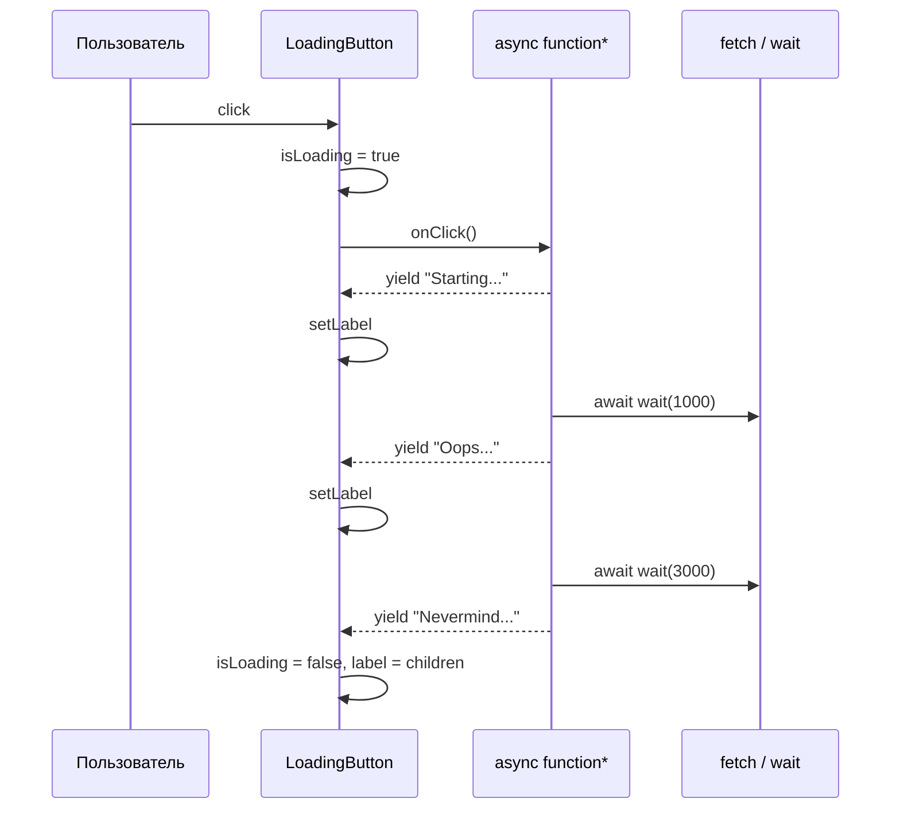

# Кнопка с загрузкой — React, Promise и поток обновлений

<div class="article-tags">
  <span class="tag tag-required">ОБЯЗАТЕЛЬНО</span>
  <span class="tag tag-beginner">ДЛЯ НОВИЧКОВ</span>
</div>

<span class="complexity-badge">Разработчику</span>

**См. также:** [Первая программа на React](./272.md) · [Асинхронность](./21.md) · [Генераторы](./22.md) · [Утилита `wait`](./32.md#ожидание-задержка) · [Кнопка "Поделиться" (vanilla)](./44.md)

---

## Задача

Пользователь нажимает кнопку "Создать заметку" или "Отправить". Пока сервер отвечает, нужно:

1. **Заблокировать повторный клик** — иначе уйдут два одинаковых запроса.
2. **Показать, что идёт работа** — текст `"..."`, спиннер или пошаговые сообщения.
3. **Дождаться Promise** — `fetch`, `navigator.share` или любая `async`-функция.

В [первой программе на React](./272.md) загрузка списка уже есть через `useEffect`. Здесь другой сценарий: **действие по клику** (`onClick`), а не автоматический запрос при монтировании.

Ниже три уровня — от ручного `isLoading` до **потока значений** из `async function*`.

---

## Плавный старт — как воспринимать паттерн

Кнопка с загрузкой — это маленькая state-machine:

- `idle` — кнопка активна;
- `loading` — действие выполняется и повторный запуск блокируется;
- `done/error` — интерфейс возвращается в рабочее состояние.

Такой взгляд помогает писать надёжный UI без случайных дублей запросов и зависших `disabled`-состояний.

---

## Мини-кейс "до/после"

| Подход | Поведение |
|--------|-----------|
| До | двойной клик отправляет два POST, пользователь не понимает, что происходит |
| После | один клик запускает одну операцию, статус виден прямо на кнопке |

---

## Базовый паттерн — `useState` и `isLoading`

Состояние загрузки хранят в **`useState`**. Пока операция выполняется, кнопку **отключают** (`disabled`) и меняют **подпись** (`label`).

```jsx

import { useState } from 'react';

async function createTodoAPI(text) {
  const res = await fetch('http://127.0.0.1:3000/notes', {
    method: 'POST',
    headers: { 'Content-Type': 'application/json' },
    body: JSON.stringify({ text }),
  });
  if (!res.ok) throw new Error(`HTTP ${res.status}`);
  return res.json();
}

function CreateTodoButton() {
  const [isLoading, setIsLoading] = useState(false);

  async function handleClick() {
    if (isLoading) return;
    setIsLoading(true);
    try {
      await createTodoAPI('new todo text');
    } catch (err) {
      console.error(err);
    } finally {
      setIsLoading(false);
    }
  }

  return (
    <button type="button" onClick={handleClick} disabled={isLoading}>
      {isLoading ? '...' : 'Create Todo'}
    </button>
  );
}
```

| Элемент | Роль |
|---------|------|
| `useState(false)` | флаг "операция в процессе" |
| `if (isLoading) return` | защита от двойного клика до перерисовки |
| `disabled={isLoading}` | браузер не шлёт повторный `click` |
| `isLoading ? '...' : 'Create Todo'` | смена **label** на время ожидания |
| `try/finally` | `isLoading` сбрасывается и при ошибке |

**`onClick={handleClick}`** — передаётся **ссылка на функцию**. Не пишите `onClick={handleClick()}`: тогда функция вызовется сразу при рендере. Подробнее — в [частых ошибках React](./272.md#частые-ошибки).

Promise и Event Loop — в [асинхронности](./21.md).

---

## Обёртка `LoadingButton`

Один и тот же шаблон (`isLoading`, `disabled`, текст) повторяется в каждой форме. Его выносят в переиспользуемый компонент:

```jsx

import { useState } from 'react';

function LoadingButton({ onClick, children }) {
  const [isLoading, setIsLoading] = useState(false);

  async function handleClick() {
    if (isLoading) return;
    setIsLoading(true);
    try {
      await onClick();
    } finally {
      setIsLoading(false);
    }
  }

  return (
    <button type="button" onClick={handleClick} disabled={isLoading}>
      {isLoading ? '...' : children}
    </button>
  );
}

function CreateTodoButton() {
  return (
    <LoadingButton
      onClick={async () => {
        await createTodoAPI('new todo text');
      }}
    >
      Create Todo
    </LoadingButton>
  );
}
```

| Prop | Смысл |
|------|--------|
| `children` | обычный **label** кнопки ("Create Todo", "Сохранить") |
| `onClick` | функция, возвращающая **Promise** (часто `async () => { ... }`) |

Компонент **не знает**, что именно делает `onClick` — только ждёт завершения Promise и управляет UI.

---

## Сокращение через `useAsyncCallback` (библиотека)

Пакет **`react-async-hook`** инкапсулирует тот же паттерн:

```jsx

import { useAsyncCallback } from 'react-async-hook';

function AppButton({ onClick, children }) {
  const asyncOnClick = useAsyncCallback(onClick);

  return (
    <button
      type="button"
      onClick={asyncOnClick.execute}
      disabled={asyncOnClick.loading}
    >
      {asyncOnClick.loading ? '...' : children}
    </button>
  );
}
```

| Поле | Роль |
|------|------|
| `execute` | запуск обработчика по клику |
| `loading` | аналог `isLoading` |

Это **внешняя зависимость** (`npm install react-async-hook`). Для учебных проектов достаточно своего `LoadingButton` на `useState`; библиотека удобна, когда таких кнопок много и нужны счётчики ошибок или отмена.

---

## Поток значений — `async function*` и `yield`

Иногда одного `"..."` мало: длинная операция и пользователь должен видеть **этапы** — "Отправка", "Ожидание сервера", "Готово". Тогда обработчик делают **асинхронным генератором**: `async function* () { yield ...; await ...; }`.

Каждый **`yield`** отдаёт следующее значение **label** (строка или JSX). Между шагами — **`await wait(ms)`** ([утилита из 32.md](./32.md#ожидание-задержка)) или реальный `fetch`.

```jsx

import { useState } from 'react';

function wait(ms) {
  return new Promise((resolve) => setTimeout(resolve, ms));
}

function LoadingButton({ onClick, children, className }) {
  const [label, setLabel] = useState(children);
  const [isLoading, setIsLoading] = useState(false);

  async function handleClick() {
    if (isLoading) return;
    setIsLoading(true);
    setLabel(children);

    try {
      const result = onClick();

      if (result && typeof result[Symbol.asyncIterator] === 'function') {
        for await (const step of result) {
          setLabel(step);
        }
      } else {
        await result;
      }
    } finally {
      setIsLoading(false);
      setLabel(children);
    }
  }

  return (
    <button
      type="button"
      className={className}
      onClick={handleClick}
      disabled={isLoading}
    >
      {isLoading ? label : children}
    </button>
  );
}

function Demo() {
  return (
    <LoadingButton
      className="counter"
      onClick={async function* () {
        yield 'Starting some process';
        await wait(1000);
        yield 'Oops, taking longer than usual';
        await wait(2000);
        yield (
          <span>
            Maybe there is a <code>Retry-after</code>?
          </span>
        );
        await wait(3000);
        yield 'Nevermind, I got it';
      }}
    >
      Click me
    </LoadingButton>
  );
}
```

Схема одного клика:



| Конструкция | Связь с другими темами |
|-------------|------------------------|
| `async function*` | [асинхронные генераторы](./22.md#asyncgenerator-и-asyncgeneratorfunction) |
| `for await...of` | обход **AsyncIterator** — потока значений |
| `yield` | пауза генератора и отдача очередного **label** |
| `wait(ms)` | Promise вокруг `setTimeout` — [32.md](./32.md#ожидание-задержка) |

Теория генераторов и `fetchPages` — в [22.md](./22.md); здесь тот же механизм, но значения идут **в текст кнопки**, а не в консоль.

---

## `label`, `children` и JSX внутри кнопки

- **`children`** — подпись в спокойном состоянии ("Click me", "Сохранить").
- Во время загрузки **`label`** (state) может быть строкой или **JSX** — React перерисует содержимое `<button>`.
- После `finally` подпись возвращают к `children`, чтобы кнопка снова была узнаваемой.

Если этапы только текстовые, достаточно строк в `yield`. JSX уместен, когда на кнопке нужен `<code>` или короткая разметка без отдельного модального окна.

---

## Сравнение подходов

| Подход | Когда использовать |
|--------|-------------------|
| `isLoading` вручную | одна-две кнопки, учебный минимум |
| `<LoadingButton onClick={async () => ...}>` | формы, мутации, POST через [Node API](./262.md) |
| `useAsyncCallback` | много async-кнопок, нужен готовый хук |
| `async function*` + `yield` | длинные операции, пошаговый feedback на самой кнопке |

Загрузка **списка при открытии страницы** по-прежнему через `useEffect` — см. [272.md](./272.md#загрузка-данных--fetch-и-node-api). Кнопка с `isLoading` — для **действий пользователя**.

---

## Частые ошибки

| Симптом | Причина |
|---------|---------|
| Два одинаковых POST | нет `disabled` / `isLoading`, двойной клик |
| Кнопка "вечно" disabled | забыли `setIsLoading(false)` в `finally` |
| Запрос при загрузке страницы | `onClick={save()}` вместо `onClick={() => save()}` |
| Генератор не обновляет текст | не `async function*`, а обычная `async function` |
| `yield` без `await` между шагами | UI не успевает перерисоваться — добавьте `wait(0)` или реальный I/O |

---

## Связь с другими темами раздела

| Тема | Где углубиться |
|------|----------------|
| `useState`, компоненты, `onClick` | [272.md](./272.md), [27.md](./27.md) |
| Promise, `async/await` | [21.md](./21.md) |
| `function*`, `async function*`, `for await` | [22.md](./22.md) |
| `wait(ms)` | [32.md](./32.md#ожидание-задержка) |
| Async по клику без React | [44.md](./44.md) |
| POST к API | [262.md](./262.md) · [264.md](./264.md) |

---

## Практика для продуктовых интерфейсов

Кнопка с загрузкой в реальном проекте обычно делает больше, чем смена подписи:

- показывает прогресс или этап операции;
- блокирует соседние кнопки, если операция конфликтует;
- отдаёт понятное сообщение об ошибке рядом с формой;
- после успеха обновляет список и возвращает фокус пользователю.

Такой подход повышает предсказуемость интерфейса и снижает число повторных кликов.

---

## Чек-лист качества для LoadingButton

| Проверка | Ожидаемое поведение |
|----------|---------------------|
| Двойной клик | второй запуск блокируется |
| Ошибка API | `isLoading` сбрасывается в `finally` |
| Медленный запрос | подпись/индикатор сообщают о процессе |
| Успешный ответ | UI обновляется без перезагрузки страницы |
| Отмена операции | состояние кнопки корректно возвращается |

Для сетевых операций соединяйте этот паттерн с [AbortController](./37.md) и [валидацией форм](./36.md), чтобы получить полный цикл "проверка → отправка → отклик интерфейса".

---

## Краткий итог

1. **`useState(false)`** + **`isLoading`** — флаг загрузки; **`disabled={isLoading}`** блокирует повторный клик.
2. **`onClick`** с **`async`** и **`await`** ждёт **Promise** (сеть, таймер, API).
3. **`LoadingButton`** выносит повторяющийся шаблон; **`children`** — обычный **label**.
4. **`async function*`** и **`yield`** дают **поток значений** для пошагового текста на кнопке; **`for await...of`** обходит этот поток в React.
5. **`wait(ms)`** связывает паузы с Promise — удобно между `yield` в учебных примерах.

---

{/* http-basics-link  */}
<div class="callout callout--tip">
  <div class="callout-title">Основа по протоколу</div>

  <div class="callout-body">
  Базовый разбор HTTP и HTTPS находится в отдельной статье — [HTTP как основа веб-интеграций](/encyclopedia/2-system-network/2-09-osnovy-integratsionnogo-vzaimodeystviya/118).
</div>
  </div>


