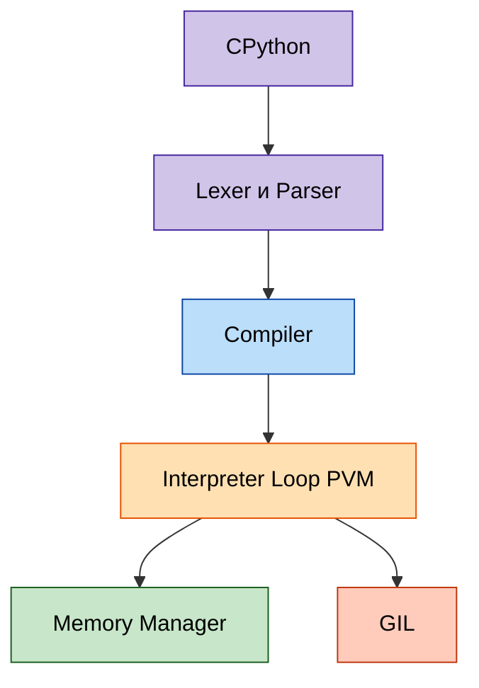
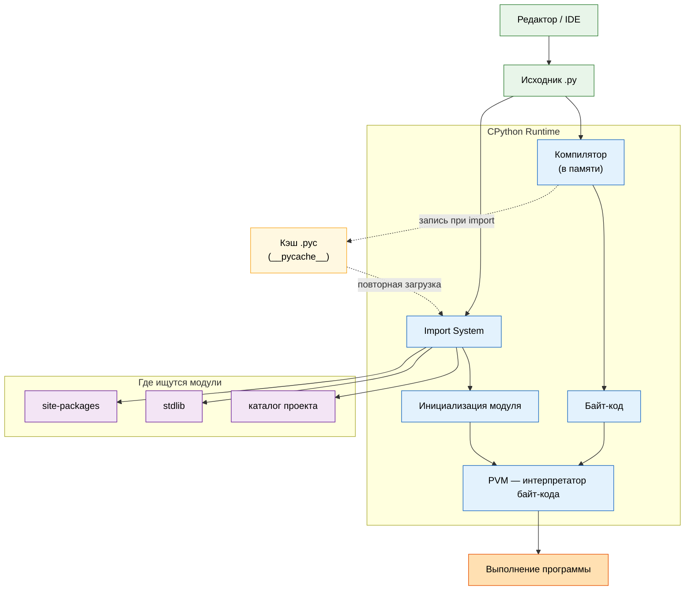
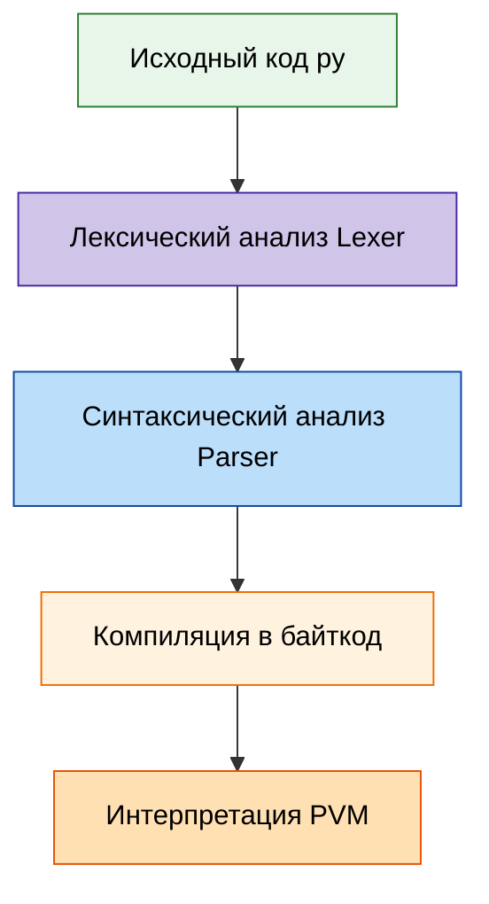

# Архитектура интерпретатора Python

<div class="article-tags">
  <span class="tag tag-required">ОБЯЗАТЕЛЬНО</span>
  <span class="tag tag-beginner">ДЛЯ НОВИЧКОВ</span>
</div>

<span class="complexity-badge">Разработчику</span>
<span class="complexity-badge">Архитектору</span>

---

## Архитектура Python

### Дистрибутив Python

**Python** — это целая экосистема, включающая интерпретатор, систему модулей, стандартную библиотеку, менеджеры зависимостей и различные реализации.

Официальный дистрибутив Python поставляется как единый пакет, содержащий все необходимые компоненты для разработки и выполнения программ. 

После установки дистрибутива на диске формируется иерархическая структура каталогов. Корневой каталог содержит исполняемый файл интерпретатора `python.exe` (Windows) или `python3` (Unix-системы), скрипты утилит в подкаталоге `Scripts`, модули стандартной библиотеки в подкаталоге `Lib`, скомпилированные расширения на C в подкаталоге `DLLs` (Windows) или `lib-dynload` (Unix), а также документацию и примеры кода. Эта структура обеспечивает предсказуемое расположение компонентов и упрощает автоматизацию процессов разработки и развертывания.

В комплекте также устанавивается IDLE.

**IDLE** представляет собой интегрированную среду разработки и обучения, поставляемую вместе с дистрибутивом Python. Среда написана на самом языке Python с использованием графической библиотеки **Tkinter** ([теория](./311.md), [примеры окон в Lab](/lab/Примеры/1124)). IDLE предоставляет редактор кода с подсветкой синтаксиса, интерактивную оболочку Python для немедленного выполнения команд, отладчик с возможностью установки точек останова и пошагового выполнения, а также систему автодополнения кода. Среда предназначена для начинающих программистов и учебных целей, обеспечивая минимальный порог входа в язык. IDLE работает кроссплатформенно и доступна сразу после установки Python без дополнительной настройки.

---

### CPython

Центральной реализацией Python является **CPython** — **эталонная реализация** (*reference implementation*, de facto стандарт поведения языка). Её развивает сообщество под эгидой **Python Software Foundation**; интерпретатор написан на **C**, распространяется как **ПО с открытым исходным кодом** под **Python Software Foundation License** (допускает использование в проприетарных продуктах). Первый релиз CPython как отдельной линии датируют **26 января 1994** года; исходники — [github.com/python/cpython](https://github.com/python/cpython).

CPython - это эталонная и наиболее широко используемая реализация языка Python, написанная на языке C, которая компилирует исходный код в байт-код и выполняет его с помощью виртуальной машины.

Именно CPython вы скачиваете с [python.org](https://www.python.org/); он используется в подавляющем большинстве проектов — от скриптов до крупных сервисов.

Работа CPython включает следующие компоненты:
	- Lexer и Parser — разбор синтаксиса.
	- Compiler — компилятор, его задача - генерация байткода.
	- Interpreter Loop (PVM) — виртуальная машина для выполнения байткода.
	- Memory Manager — управление памятью через счётчик ссылок и сборщик мусора.
	- Global Interpreter Lock (GIL) — механизм, ограничивающий выполнение байткода одним потоком одновременно. Это ограничивает параллелизм в CPU-bound задачах, но не мешает эффективному использованию асинхронности и многопроцессорности.

Lexer - это компонент компилятора или интерпретатора, который выполняет лексический анализ, разбивая исходный текст программы на последовательность значимых лексических единиц, называемых токенами.

Parser - это компонент, который принимает на вход поток токенов от лексера и строит по ним синтаксическое дерево разбора, проверяя соответствие исходного кода грамматике языка.

Compiler - это программа, которая преобразует исходный код, написанный на одном языке, в код на другом языке, обычно на более низком уровне, таком как байт-код или машинный код, сохраняя при этом смысл программы.

Interpreter Loop, или PVM, то есть виртуальная машина Python, - это основной цикл интерпретатора, который последовательно считывает инструкции байт-кода, декодирует их и выполняет соответствующие операции, являясь ядром выполнения программы.

Memory Manager - это подсистема, отвечающая за выделение, распределение и освобождение памяти для объектов во время работы программы, включая управление кучей и сборку мусора.

Global Interpreter Lock, или GIL, - это мьютекс в CPython, который защищает доступ к внутренним объектам интерпретатора, позволяя выполнять байт-код только одному потоку в один момент времени, что упрощает управление памятью, но ограничивает параллелизм.



---

Кроме CPython существуют другие реализации с иными компромиссами:

| Реализация | Платформа | Особенность |
|------------|-----------|-------------|
| **PyPy** | кроссплатформенно | подмножество RPython, JIT, ускорение CPU-bound |
| **Jython** | JVM | интеграция с Java-классами |
| **IronPython** | CLR / .NET | интеграция с экосистемой Microsoft |
| **Stackless Python** | CPython-ветка | микропотоки, уменьшенный стек вызовов |

CPython остаётся эталоном: спецификация языка и тесты ориентируются на его поведение.

PyPy - это альтернативная реализация Python, которая использует Just-In-Time компиляцию для ускорения выполнения программ и отличается от CPython более эффективной работой с памятью и поддержкой разных моделей сборки мусора.

Jython - это реализация языка Python, написанная на Java и работающая на виртуальной машине Java, что позволяет легко интегрировать код Python с библиотеками Java.

IronPython - это реализация Python для платформы .NET, написанная на C Sharp, которая делает код Python совместимым с библиотеками и средами исполнения экосистемы Microsoft.

Stackless Python - это реализация языка Python, которая избегает использования стандартного стека вызовов языка C и предоставляет средства для легковесных потоков и микропотоков, облегчая написание конкурентных программ.

CPython — это интерпретатор и полная система выполнения, включающая, как мы выяснили, парсер, компилятор в байт-код, виртуальную машину PVM, менеджер памяти, сборщик мусора и GIL. Давайте подробнее.

<span id="zhiznennyy-tsikl-koda"></span>

### Жизненный цикл Python-кода в CPython

Удобно представить путь от файла `.py` до результата программы как **шесть этапов**. Все они происходят внутри процесса **CPython** (среды выполнения), кроме самого исходника на диске и кэша байт-кода.



Source - это исходный текст программы, написанный человеком на языке программирования высокого уровня, который является входными данными для компилятора или интерпретатора.

Compile - это процесс преобразования исходного кода из читаемой человеком формы в более низкоуровневое представление, например в байт-код, пригодное для выполнения виртуальной машиной или процессором.

Artifacts - это все промежуточные и конечные файлы, порождаемые в процессе сборки и компиляции программы, включая скомпилированный байт-код, объектные файлы и исполняемые модули.

Load - это этап выполнения программы, на котором интерпретатор считывает скомпилированный байт-код или модуль из файловой системы и размещает его в оперативной памяти для дальнейшего использования.

Import System - это совокупность правил и механизмов в Python, определяющих, как и откуда модули находятся, загружаются и инициализируются при использовании инструкции import, включая поиск по путям и кеширование.

Execute - это непосредственное выполнение инструкций программы интерпретатором, при котором каждая команда преобразуется в действия процессора или виртуальной машины, приводящие к изменению состояния программы.

Run - это полный процесс запуска программы, включающий в себя все этапы от инициализации интерпретатора, загрузки модулей, компиляции исходного кода до непосредственного выполнения основного кода и завершения работы.

| Этап | Что происходит |
|------|----------------|
| **Source** | Вы пишете код в редакторе; на диске лежит файл `.py`. |
| **Compile** | CPython читает исходник, строит AST и **компилирует байт-код в памяти** (отдельного `.exe` нет). |
| **Artifacts** | При **импорте** модуля байт-код может быть записан в **`__pycache__/*.pyc`**, чтобы при следующем запуске пропустить компиляцию, если `.py` не менялся. |
| **Load** | **Import System** находит модуль в каталоге проекта, в **stdlib** или в **site-packages** (пакеты из `pip`), при необходимости подгружает готовый `.pyc`. |
| **Execute** | Выполняется код верхнего уровня модуля (инициализация), создаются объекты в `sys.modules`. |
| **Run** | **PVM** пошагово исполняет инструкции байт-кода до завершения скрипта или процесса. |

При запуске `python script.py` главный файл проходит ту же цепочку: компиляция (или чтение `.pyc`), затем интерпретация на PVM. При `import requests` для каждого нового модуля срабатывает **Load → Compile (если кэш устарел) → Execute**, а повторный `import` того же имени берёт объект из `sys.modules` без перечитывания файла.

Флаг `-B` / переменная `PYTHONDONTWRITEBYTECODE=1` отключают запись `.pyc` (удобно в Docker и CI, где кэш всё равно не нужен). Подробнее о поиске модулей — в разделе [Как Python ищет модули](#как-python-ищет-модули) ниже; о refcount и GC после выполнения — в [архитектуре выполнения и сборке мусора](./27.md).

<div class="callout callout--tip">
  <div class="callout-title">Связь с общей теорией</div>

  <div class="callout-body">
  Тип "компилирующий интерпретатор" и примеры байт-кода для других языков — в [что такое интерпретатор](/encyclopedia/1-basics/1-19-programma/2#что-такое-интерпретатор). Вводное сравнение "интерпретируемый язык" в учебном смысле — в [Python — язык общего назначения](./1.md#interpretiruemyy-yazyk).
  </div>
</div>

> Система выполнения представляет собой программную среду, обеспечивающую запуск и управление жизненным циклом программного кода. Эта среда предоставляет базовые сервисы, необходимые для преобразования исходного текста программы в исполняемые инструкции процессора. Система выполнения включает компоненты для анализа синтаксиса, генерации промежуточного представления кода, управления памятью, обработки ошибок и взаимодействия с операционной системой. В случае Python система выполнения реализована в интерпретаторе CPython и охватывает все этапы от чтения исходного файла до завершения выполнения программы.

> Парсер — это компонент системы выполнения, отвечающий за синтаксический анализ исходного кода. Парсинг представляет собой процесс преобразования последовательности символов исходного текста в структурированное представление, обычно в виде абстрактного синтаксического дерева. Абстрактное синтаксическое дерево организует элементы программы в иерархическую структуру, отражающую грамматические правила языка. Парсер Python проверяет соответствие кода правилам синтаксиса языка, выявляет ошибки на этапе анализа и формирует промежуточное представление для последующей компиляции в байт-код. Этот этап происходит автоматически при импорте модуля или выполнении скрипта, до начала фактического исполнения инструкций.

> Виртуальная машина Python представляет собой исполнительную среду, предназначенную для выполнения байт-кода. Байт-код — это промежуточное представление программы, генерируемое компилятором Python из абстрактного синтаксического дерева. Виртуальная машина интерпретирует инструкции байт-кода последовательно, преобразуя их в вызовы низкоуровневых функций, реализованных на языке C. Каждая инструкция байт-кода соответствует простой операции — загрузка значения, вызов функции, арифметическое действие или управление потоком выполнения. Виртуальная машина управляет стеком вызовов, кадрами стека для каждой функции и таблицами локальных и глобальных переменных. Выполнение байт-кода происходит медленнее нативного кода процессора, но обеспечивает переносимость программ между различными аппаратными платформами и операционными системами. Файлы с расширением .pyc хранят скомпилированный байт-код для ускорения последующих запусков модулей.

> Менеджер памяти Python отвечает за распределение и освобождение оперативной памяти во время выполнения программы. Этот компонент реализует многоуровневую систему управления памятью. На нижнем уровне менеджер взаимодействует с операционной системой через системные вызовы malloc и free для получения крупных блоков памяти. На среднем уровне реализованы пулы объектов — заранее выделенные области памяти для объектов одинакового размера. Пулы ускоряют выделение памяти для часто создаваемых объектов, таких как целые числа или короткие строки. На верхнем уровне менеджер предоставляет единый интерфейс для всех объектов Python, независимо от их типа. Каждый объект в Python содержит заголовок с метаданными — счетчик ссылок, указатель на тип объекта и дополнительные поля, специфичные для типа. Счетчик ссылок отслеживает количество активных ссылок на объект. При достижении нулевого значения счетчика память объекта немедленно возвращается в пул для повторного использования. Менеджер памяти работает совместно со сборщиком мусора для обработки циклических ссылок, которые счетчик ссылок не может обнаружить.


---

### Процесс запуска Python скрипта

Ниже — те же стадии **Compile** и **Run** из [жизненного цикла](#zhiznennyy-tsikl-koda), но с разбором по компонентам (лексер, парсер, PVM, GIL). Процесс запуска Python-скрипта проходит через несколько этапов:





1. Лексический анализ (Lexer). На первом шаге исходный код (`*.py`) разбивается на лексемы — минимальные значимые единицы — ключевые слова, операторы, идентификаторы, строки и т.д. Например, строка x = 5 + 3 превращается в последовательность — `[ID(x), ASSIGN, INT(5), PLUS, INT(3)]`.

2. Синтаксический анализ (Parser). Лексемы передаются парсеру, который строит абстрактное синтаксическое дерево (AST) — иерархическую структуру, отражающую логику программы. Это дерево становится основой для дальнейшей компиляции.

3. Компиляция в байткод. Из AST генерируется байткод — платформо-независимый набор инструкций, предназначенный для выполнения на виртуальной машине Python (PVM). Байткод сохраняется в файлах .pyc в папке `__pycache__`.

```python

import dis

def hello():
    return "Hello"

dis.dis(hello)
# Выход —
#   2           0 LOAD_CONST               1 ('Hello')
#               2 RETURN_VALUE

```

4. Интерпретация байткода (PVM). Байткод выполняется на Python Virtual Machine (PVM) — цикле, который читает и исполняет инструкции по одной. PVM — это часть CPython, написанная на C, и именно она обеспечивает кроссплатформенность. Хотя Python часто называют "интерпретируемым", он всё же компилируется в байткод, что делает его гибридной системой, близкой к Java или .NET.

5. Управление памятью. Память в Python управляется автоматически:
	- Счётчик ссылок — основной механизм: каждый объект хранит количество ссылок на него. Когда оно достигает нуля, объект немедленно удаляется.
	- Сборщик мусора (GC) — дополняет систему, обнаруживая и удаляя циклические ссылки, которые счётчик не может обработать.
Объекты живут в private heap — закрытой области памяти, управляемой интерпретатором. Разработчик не имеет прямого доступа к указателям.

6. Global Interpreter Lock (GIL). GIL — это мьютекс (взаимное исключение), который гарантирует, что только один поток одновременно выполняет байткод. Это означает, что даже на многопроцессорных системах CPU-bound задачи не могут быть параллельны в рамках одного процесса. Что это значит на практике?
	- Для I/O-bound задач (сетевые запросы, файлы, базы данных) асинхронность (async/await) и многопоточность остаются эффективными.
	- Для CPU-bound задач (расчёты, обработка массивов) необходимо использовать многопроцессорность (multiprocessing) или переходить на PyPy.

GIL является компромиссом ради простоты и производительности в типичных сценариях. Его удаление — предмет активных дискуссий (PEP 703).

---

### Модульность

Теперь вернёмся к уровню выше. Одним из ключевых преимуществ Python является его модульная архитектура, позволяющая организовывать код в повторно используемые компоненты.

Частью философии Python является модульность и возможность импортировать что угодно, используя ключевое слово `import`.

```python

import math

```

**Модуль** — это файл с расширением `.py`, содержащий код — функции, классы, переменные, выражения.

```python
# math_utils.py
def add(a, b):
    return a + b

PI = 3.14159
```

Импорт:
```python

import math_utils

print(math_utils.add(2, 3))  # 5

from math_utils import PI
print(PI)  # 3.14159
```

Другой пример с модулем `random`:
```python

import random

print(random.randint(1, 10))
```

Каждый модуль — это пространство имён (namespace). Имена модулей должны быть в стиле snake_case. При импорте модуль выполняется один раз и кэшируется в sys.modules.

Стандартная библиотека Python — это коллекция модулей, поставляемых вместе с интерпретатором. Она включает такие модули, как `os`, `sys`, `json`, `datetime`, `math`, `random` и многие другие.

Большинство из них реализованы на языке Python и хранятся в виде обычных `.py` файлов. Некоторые критически важные модули (например, `sys`, `gc`, `time`) частично написаны на C для повышения производительности, но с точки зрения пользователя они используются точно так же, как и любые другие модули.

Пример: модуль `random` — это обычный Python-файл, расположенный в каталоге стандартной библиотеки. Вы можете найти его, выполнив:
```python

import random

print(random.__file__)
```

Это покажет путь к файлу `random.py` на вашей системе.

Если нужного модуля нет в стандартной библиотеке и он отсутствует локально, его необходимо установить. Для этого используется **менеджер пакетов** — в основном `pip`.

---

#### Установка через `pip`
```bash
pip install requests
```

После установки пакет `requests` становится доступен глобально (или в рамках виртуального окружения, если оно активно) и может быть импортирован:
```python

import requests

```

Сторонние пакеты устанавливаются в директорию `site-packages`. Её расположение зависит от операционной системы и способа установки Python:

- **Windows**:  
`%USERPROFILE%\AppData\Local\Programs\Python\Python311\Lib\site-packages`

- **Linux/macOS**:  
`/usr/local/lib/python3.11/site-packages`  
  или  
`~/.local/lib/python3.11/site-packages` (если установлено без `sudo`)

Если используется **виртуальное окружение**, то `site-packages` будет находиться внутри папки этого окружения, например:
```
my_project/venv/lib/python3.11/site-packages
```

---

<span id="kak-python-ishchet-moduli"></span>

### Как Python ищет модули

При выполнении инструкции `import имя_модуля` срабатывает этап **Load** из [жизненного цикла](#zhiznennyy-tsikl-koda): **Import System** обходит каталоги в `sys.path`. Порядок поиска:

1. **Текущая директория** — та, из которой запущен скрипт.  
   Если в той же папке находится файл `my_module.py`, то команда `import my_module` найдёт его сразу.

2. **Директории из переменной окружения `PYTHONPATH`** — пользовательские пути, добавленные вручную для поиска модулей.

3. **Стандартные пути установки Python** — встроенные каталоги, где размещена стандартная библиотека и установленные сторонние пакеты.  
   Эти пути можно посмотреть программно:
```python
   import sys
   print(sys.path)
```

4. **Сайт-пакеты (site-packages)** — специальная директория, куда устанавливаются сторонние пакеты через менеджеры вроде `pip`.

Если модуль не найден ни в одном из этих мест, Python выбрасывает исключение `ModuleNotFoundError`.

В реальных проектах рекомендуется использовать **виртуальные окружения**, чтобы изолировать зависимости одного проекта от другого. Это предотвращает конфликты версий и делает проекты переносимыми.

Создание и активация:
```bash
python -m venv myenv
# Windows —
myenv\Scripts\activate
# Linux/macOS —
source myenv/bin/activate
```

После активации `pip` устанавливает пакеты только в это окружение.

При первом импорте модуля Python:

- читает файл;
- компилирует его в байт-код (`.pyc`);
- сохраняет в кэш (обычно в папке `__pycache__`);
- помещает объект модуля в словарь `sys.modules`.

При повторном импорте того же модуля Python **не перечитывает файл**, а возвращает уже загруженный объект из `sys.modules`. Это ускоряет выполнение и гарантирует, что модуль инициализируется только один раз.

Если нужно перезагрузить модуль (например, при разработке), используется функция `importlib.reload()`:
```python

import importlib
import my_module

importlib.reload(my_module)
```

Имена модулей должны соответствовать стилю **snake_case** — строчные буквы с подчёркиваниями, без пробелов и специальных символов. Например:
- `data_processor.py`
- `network_utils.py`
- `auth_service.py`

Это правило распространяется и на имена пакетов (каталогов с файлом `__init__.py`).


---

### Пакеты

Код можно организовать в иерархию через пакеты.

**Пакет** — это каталог, содержащий файл `__init__.py` (может быть пустым), который сообщает интерпретатору, что каталог является пакетом.

Структура:
```
my_package/
    __init__.py
    module_a.py
    subpackage/
        __init__.py
        module_b.py
```

Импорт:
```python

import my_package.module_a

from my_package.subpackage import module_b
```

Файл `__init__.py` может содержать код инициализации пакета, экспорт нужных сущностей через `__all__`, предварительный импорт модулей для удобства.

---

### Стандартная библиотека

Python поставляется с мощной стандартной библиотекой, часто называемой "batteries included". Она включает сотни модулей, предоставляющих готовые решения для типичных задач программирования. 

Библиотека разделена на категории — модули для работы с операционной системой (os, sys, pathlib), обработки текста (re, json, csv), сетевого взаимодействия (socket, http, smtplib), манипуляции данными (datetime, collections, itertools), криптографии (hashlib, ssl) и многие другие. 

Модули стандартной библиотеки написаны на языке Python и на C для критичных к производительности компонентов. Все модули доступны сразу после установки интерпретатора без необходимости дополнительной загрузки или компиляции. Стандартная библиотека проходит тот же цикл тестирования и версионирования, что и сам интерпретатор, обеспечивая стабильность и совместимость между версиями.

Вот ключевые модули:

| Модуль | Назначение |
|-----|---------|
|os	|Работа с операционной системой: файлы, пути, переменные окружения.
|sys	|Доступ к параметрам интерпретатора:argv,path,exit().
|json	|Сериализация/десериализация JSON.
|csv	|Чтение и запись CSV-файлов.
|datetime	|Работа с датами и временем.
|random	|Генерация случайных чисел.
|math	|Математические функции:sin,log,sqrt.
|string	|Константы и методы для работы со строками.
|email	|Создание и разбор email-сообщений.
|http	|Работа с HTTP: клиент (client), сервер (server).
|ssl	|Поддержка SSL/TLS для безопасного соединения.
|tkinter	|Создание графических интерфейсов (GUI).

Эти модули не требуют установки и доступны в любом окружении Python.

---

### Менеджеры пакетов и репозитории

Для внешних библиотек используются менеджеры пакетов и центральный каталог **PyPI** (*Python Package Index*, произношение близко к "пай-пи-ай"). Сайт [pypi.org](https://pypi.org/); владелец — **PSF**. Каталог работает с **2003** года; по масштабу его сравнивают с **CPAN** (Perl) и **PEAR** (PHP): в 2010-х в индексе было порядка десятков тысяч пакетов, к 2020-м — уже более **200 000**, сейчас — сотни тысяч.

#### Как появился PyPI

1. **distutils** (стандартная библиотека с Python **1.6.1** / **2.0**, 2000) — упаковка исходников и метаданных, без единого веб-каталога.
2. **PEP 241** (2001) — стандарт метаданных пакета (`name`, `version`, `author`, `license` и др.).
3. Утверждение централизованного индекса на **python.org** (2002) — предшественник PyPI.
4. **pip** (с **3.4** в комплекте CPython) — де-факто клиент установки: `pip install имя_пакета`.
5. Цепочка **setuptools** → **easy_install** → современный **pip**; параллельно развивались **Distribute** и идея **distutils2** (часть идей вошла в экосистему **packaging**).
6. **16 апреля 2018** — веб-интерфейс PyPI переведён на платформу **Warehouse**; legacy-сайт отключён в том же месяце, история пакетов сохранена.

Автор публикует дистрибутив (часто `pyproject.toml` / `setup.py`); pip скачивает wheel или sdist с PyPI и разрешает зависимости. Регистрация метаданных раньше выполнялась командой `python setup.py register`; сейчас обычно **twine upload** после сборки.

Менеджер **pip** устанавливает, обновляет и удаляет пакеты; поддерживает `venv` и `requirements.txt`:

```bash
pip install requests
pip install -r requirements.txt
pip freeze > requirements.txt
pip list
pip uninstall package_name
pip install --upgrade pip
```

Популярные пакеты на PyPI — `requests`, `flask`, `numpy`, `pandas`.

Практика — создать `requirements.txt`, установить `requests` и запустить скрипт с `import requests`: [Зависимости Python — requirements.txt и pyproject.toml](./39.md). Обзор манифестов для всех языков и Docker — [Манифесты зависимостей](/encyclopedia/4-code-dev/4-04-proekt-i-freymvorki/103).

Альтернативные менеджеры и форматы окружений — **conda**, **Poetry**, **uv**, **pip-tools**, **PDM**.

Не путайте PyPI и PyPy. PyPy - альтернатива CPython, написанная на подмножестве RPython, включающая JIT-компилятор (Just-In-Time), что даёт в 4–10 раз повышение производительности в CPU-bound задачах. Она совместима с большинством CPython-кода, однако не поддерживает все C-расширения (например, pandas работает, но медленнее).

Jython - реализация Python для JVM (Java Virtual Machine), позволяющая использовать Java-библиотеки напрямую. Нет GIL, можно использовать многопоточность Java, но отстаёт от актуальных версий Python. Как можно понять, это для интеграции с Java-системами.

IronPython - реализация для .NET Framework. Имеется интеграция с C#, ASP.NET, WPF и взаимодействие с .NET-библиотеками, для Windows-среды.

MicroPython оптимизирован для микроконтроллеров (ESP32, Raspberry Pi Pico), с минимальным объёмом памяти и поддержкой GPIO, I2C, UART. Для IoT и встраиваемых систем.

---

{/* http-basics-link  */}
<div class="callout callout--tip">
  <div class="callout-title">Основа по протоколу</div>

  <div class="callout-body">
  Базовый разбор HTTP и HTTPS находится в отдельной статье — [HTTP как основа веб-интеграций](/encyclopedia/2-system-network/2-09-osnovy-integratsionnogo-vzaimodeystviya/118).
</div>
  </div>


