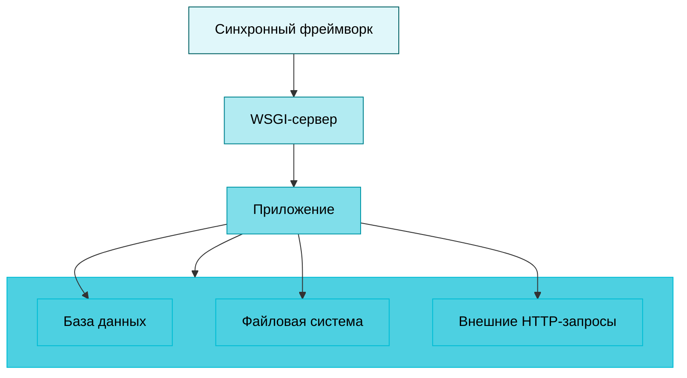
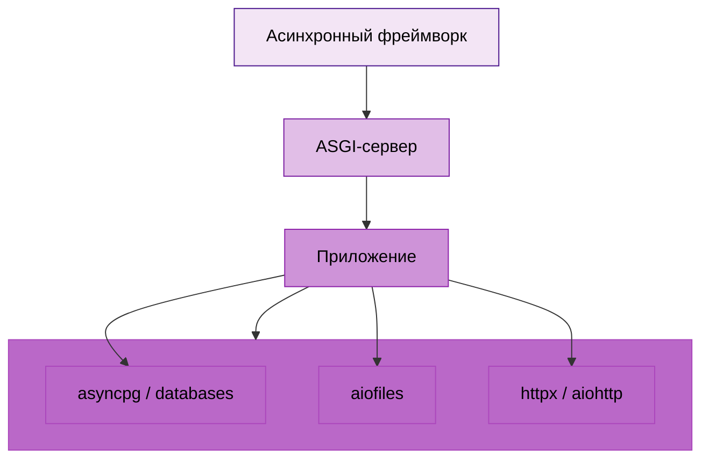

# Фреймворки и библиотеки Python

<div class="article-tags">
  <span class="tag tag-required">ОБЯЗАТЕЛЬНО</span>
  <span class="tag tag-beginner">ДЛЯ НОВИЧКОВ</span>
</div>

<span class="complexity-badge">Разработчику</span>
<span class="complexity-badge">Архитектору</span>

---

## Фреймворки

Фреймворки в экосистеме Python предоставляют готовые инструменты для маршрутизации, обработки запросов, работы с базами данных, аутентификации и многого другого, позволяя разработчикам сосредоточиться на бизнес-логике, а не на низкоуровневой инфраструктуре.

Давайте рассмотрим фреймворки, и сгруппируем их как синхронные и асинхронные.

---

## Синхронные фреймворки

### Что такое синхронный фреймворк?

**Синхронные фреймворки** обрабатывают один HTTP-запрос за раз в рамках одного потока. Пока запрос не завершён (например, ожидается ответ от базы данных), поток блокируется. Это простая модель, но она может стать узким местом при высокой нагрузке или большом количестве I/O-операций.



---

### Django

Django — это полноценный веб-фреймворк с широким набором встроенных возможностей:

- ORM;
- админка;
- система шаблонов;
- аутентификация;
- миграции;
- кэширование;
- многое другое.

У него есть высокий уровень абстракции, мощная ORM, поддерживающая множественные БД (PostgreSQL, MySQL, SQLite), встроенная админ-панель для управления данными, поддержка MVC/MVT-архитектуры. Пример:
```python
from django.http import HttpResponse
from django.views import View

def hello(request):
    return HttpResponse("Hello from Django!")
```
Разбор примера:
- `from ... import ...` импортирует классы из модулей Django.
- `def hello(request):` объявляет view-функцию. Аргумент `request` содержит HTTP-запрос.
- `return HttpResponse(...)` формирует HTTP-ответ с телом `"Hello from Django!"`.
- Функция будет вызвана роутером Django, когда URL сопоставится с этой view.
Django применяется в Instagram, Pinterest, Mozilla, The Washington Post.

---

### Flask

Flask — минималистичный фреймворк, предоставляющий только базовые инструменты: маршрутизацию, обработку запросов и шаблоны. Всё остальное (ORM, валидация, авторизация) добавляется через расширения.

Собственно, это главная особенность - гибкая архитектура, можно начать с малого и масштабироваться в дальнейшем. Здесь довольно богатая экосистема расширений, к примеру, Flask-SQLAlchemy, Flask-WTF, Flask-Login. Пример:
```python
from flask import Flask
app = Flask(__name__)

@app.route('/')
def hello():
    return "Hello from Flask!"
```
Разбор примера:
- `Flask(__name__)` создает объект приложения и использует имя текущего модуля для поиска шаблонов и ресурсов.
- `@app.route('/')` регистрирует маршрут `/` и связывает его с функцией `hello`.
- `def hello()` описывает обработчик запроса.
- `return "..."` во Flask автоматически превращается в HTTP-ответ со статусом `200 OK`.

---

### Pyramid

Pyramid позиционируется как фреймворк для проектов любого масштаба — от простых скриптов до крупных систем. Здесь есть поддержка как минималистичного, так и расширенного подхода, гибкая система маршрутизации, интеграция с различными ORM и шаблонизаторами. Подходит, когда нужна гибкость Flask, но с возможностью масштабирования до уровня Django.

---

## Асинхронные фреймворки

### Что такое асинхронный фреймворк?

**Асинхронные фреймворки** используют модель event loop и корутины (async/await), что позволяет обрабатывать тысячи соединений одновременно без блокировки потоков. Это особенно важно для I/O-bound задач: сетевые запросы, работа с БД, WebSocket.



---

### aiohttp

aiohttp — один из первых асинхронных фреймворков на Python, построенный на asyncio. Он поддерживает как серверную часть (web server), так и асинхронный HTTP-клиент.

Ключевые возможности - обработка тысяч запросов параллельно, поддержка WebSocket. Пример:
```python
from aiohttp import web

async def hello(request):
    return web.Response(text="Hello from Aiohttp!")

app = web.Application()
app.add_routes([web.get('/', hello)])
web.run_app(app)
```
Разбор примера:
- `async def` объявляет корутину: обработчик может выполнять `await` без блокировки event loop.
- `web.Response(...)` собирает HTTP-ответ с текстовым телом.
- `web.Application()` создает ASGI/async-приложение aiohttp.
- `app.add_routes([web.get('/', hello)])` добавляет правило маршрутизации.
- `web.run_app(app)` запускает сервер и начинает принимать соединения.

---

### FastAPI

FastAPI — один из самых популярных современных фреймворков, сочетающий асинхронность, автоматическую документацию (Swagger/OpenAPI) и поддержку аннотаций типов.

Он основан на Starlette (для web) и Pydantic (для валидации), имеет автоматическую генерацию интерактивной документации, и высокую производительность (оправдывая название). Пример:
```python
from fastapi import FastAPI

app = FastAPI()

@app.get("/")
async def hello():
    return {"message": "Hello from FastAPI!"}
```
Разбор примера:
- `FastAPI()` инициализирует приложение с автогенерацией OpenAPI-схемы.
- `@app.get("/")` объявляет endpoint для метода `GET`.
- `async def hello()` позволяет неблокирующие I/O-операции внутри обработчика.
- Возврат `dict` автоматически сериализуется в JSON (`{"message": ...}`).

---

### gevent

gevent — это библиотека, реализующая cooperative multitasking с помощью зелёных потоков (greenlets). Она позволяет запускать синхронный код в асинхронном режиме, перехватывая I/O-вызовы. Она перезаписывает стандартные функции ввода-вывода (например, socket, time.sleep) на неблокирующие версии и не требует использования async/await.

```python
from gevent.pywsgi import WSGIServer
from flask import Flask

app = Flask(__name__)

@app.route('/')
def hello():
    return 'Hello from Flask + Gevent!'

# Запуск Flask с Gevent
http_server = WSGIServer(('0.0.0.0', 5000), app)
http_server.serve_forever()
```
Разбор примера:
- `WSGIServer((host, port), app)` поднимает WSGI-сервер и передает ему Flask-приложение.
- Адрес `0.0.0.0` означает прослушивание всех сетевых интерфейсов.
- `serve_forever()` запускает бесконечный цикл обработки входящих запросов.
- Пара gevent + Flask дает кооперативную конкурентность без переписывания всего приложения на `async/await`.
Это нужно для ускорения уже существующих Flask/Django-приложений.

Хотя Flask изначально был синхронным, с выходом Flask 2.0 и Python 3.7+ он получил поддержку асинхронных view-функций. Начиная с Flask 2.0, можно использовать async def:
```python
from flask import Flask

import asyncio

app = Flask(__name__)

@app.route('/async')
async def async_route():
    await asyncio.sleep(1)
    return "Async in Flask!"
```
Разбор примера:
- `async def` включает асинхронный обработчик во Flask 2+.
- `await asyncio.sleep(1)` приостанавливает только текущую корутину, а event loop в это время обслуживает другие задачи.
- После завершения `await` функция возвращает строку как HTTP-ответ.
- Такой подход полезен при I/O-нагрузке, но экосистема Flask остается преимущественно синхронной.

С ограничениями, конечно. Асинхронность работает только с ASGI-серверами (например, Hypercorn, Uvicorn) и большинство расширений Flask всё ещё синхронные, и нет поддержки WebSocket. Flask можно использовать в асинхронном режиме, но он не является "нативно асинхронным" фреймворком, как FastAPI или Aiohttp.

---

{/* http-basics-link  */}
<div class="callout callout--tip">
  <div class="callout-title">Основа по протоколу</div>

  <div class="callout-body">
  Базовый разбор HTTP и HTTPS находится в отдельной статье — [HTTP как основа веб-интеграций](/encyclopedia/2-system-network/2-09-osnovy-integratsionnogo-vzaimodeystviya/118).
</div>
  </div>


