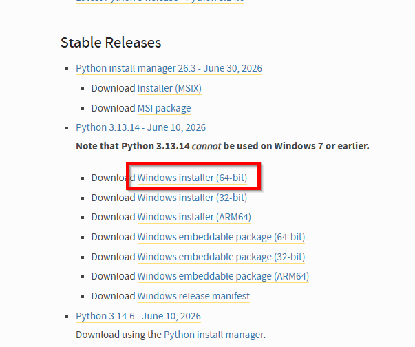
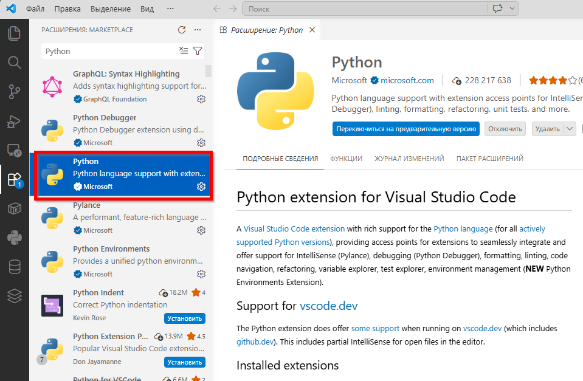

import ExternalPlayEmbed from '@site/src/components/ExternalPlayEmbed';


# Первая программа на Python

<div class="article-tags">
  <span class="tag tag-required">ОБЯЗАТЕЛЬНО</span>
  <span class="tag tag-beginner">ДЛЯ НОВИЧКОВ</span>
</div>

<span class="complexity-badge">Разработчику</span>
<span class="complexity-badge">Архитектору</span>

<ExternalPlayEmbed example="lab/first-program-play" title="Первая программа" minHeight={420} playProps={{ language: 'python' }} />

---

## Первая программа

Приветствую.

Начнём сразу с краткого алгоритма.

1. Python - это комплекс программ. Вам его нужно установить. Можете перейти по ссылке [https://www.python.org/downloads/windows/](https://www.python.org/downloads/windows/). Рекомендую версию 3.13:

2. При установке не забудьте нажать галочку "Add Python to PATH", чтобы терминал видел Python.
3. Затем вам понадобится редактор кода - рекомендую Visual Studio Code.
4. В Visual Studio Code вам понадобится расширение Python.

5. И всё - вы готовы к работе.

---

### Где применяют Python

**Python** — универсальный язык с читаемым синтаксисом — веб (Django, FastAPI), данные, автоматизация, ML. Интерпретатор **CPython** с REPL и IDLE; пакеты через `pip`, проекты в `venv`.

Эта статья — установка, первая `print`, запуск из IDE и терминала. Сторонние пакеты (`requests`, Flask и др.) — [Зависимости Python — requirements.txt и pyproject.toml](./39.md). Для **задач ЕГЭ и олимпиад** после базового синтаксиса — сначала [Big-O — шпаргалка](/lab/Примеры/1128) (оценка сложности по коду), затем [Алгоритмы на Python — ЕГЭ и олимпиадка](/lab/Примеры/1122). Когда понадобится **читать и писать `.txt`, CSV, JSON** — [Python — работа с файлами и текстом](/lab/Примеры/1126) и теория в [Работа с файлами, сетью и внешними API](./31.md). Дальше: [Разработка игр на Python](./312.md) (теория Pygame), [мини-игры с разбором](/lab/Примеры/1132), [Flask](./3411.md), [Django](./3011.md).

---

### Установка и настройка среды

Python является свободным программным обеспечением с открытым исходным кодом, поддерживаемым сообществом и организацией Python Software Foundation (PSF). Официальный репозиторий дистрибутивов расположен по адресу `python.org`. Именно с этого сайта рекомендуется загружать интерпретатор, поскольку дистрибутивы проверяются на целостность, собираются официальной командой разработчиков CPython и исключается риск загрузки модифицированных или заражённых версий интерпретатора, что возможно при использовании сторонних зеркал или пакетных менеджеров неизвестного происхождения.

Дистрибутивы доступны для всех основных платформ: Windows, macOS и большинства дистрибутивов Linux. На сайте представлены как последние стабильные версии, так и предрелизные сборки (alpha, beta, release candidates), предназначенные для тестирования. При выборе версии следует ориентироваться на актуальную стабильную ветку (на момент написания — Python 3.13.x). Версии Python 2.x официально устарели (end-of-life с 1 января 2020 года) и не должны использоваться в новых проектах.

После установки Python представляет собой комплекс программных компонентов, объединённых в единую исполняемую среду. Ниже приведено описание ключевых элементов, входящих в состав стандартной установки.

Основной компонент — интерпретатор `python.exe` (Windows) или `python` (Unix-подобные системы), реализованный на языке C и известный как CPython. Это эталонная реализация языка Python, определяющая поведение спецификации языка. Интерпретатор выполняет парсинг исходного кода (лексический и синтаксический анализ), компиляцию в байт-код, выполнение байт-кода на виртуальной машине PVM и управление памятью через сборщик мусора (garbage collector), использующий комбинацию подсчёта ссылок и циклического детектора.

Интерпретатор не является традиционным компилятором, преобразующим код в машинные инструкции напрямую. Вместо этого он работает по модели "интерпретируемый язык с компиляцией на лету": каждый `.py`-файл компилируется в байт-код (часто кэшируется в `.pyc`), который затем выполняется **PVM**. Схема этапов — в [жизненном цикле Python-кода](./11.md#zhiznennyy-tsikl-koda).

В состав дистрибутива входит **IDLE** (Integrated Разработка and Learning Environment) — простая IDE, написанная на Tkinter ([Tkinter и GUI](./311.md), [примеры GUI](/lab/Примеры/1124)). Она предназначена в первую очередь для обучения и прототипирования. IDLE предоставляет интерактивную оболочку (REPL), позволяющую выполнять выражения по одному; редактор с подсветкой синтаксиса, автозавершением и возможностью отладки; возможность запуска скриптов с отображением вывода и ошибок.


Хотя IDLE не используется в профессиональной разработке из-за ограниченных возможностей, она остаётся полезным инструментом для новичков и диагностики проблем, так как не требует дополнительных зависимостей.

Одна из ключевых особенностей Python — богатая стандартная библиотека (`stdlib`), включающая модули для работы с файловой системой, сетью, сериализацией, многопоточностью, регулярными выражениями и т.д. Эти модули устанавливаются вместе с интерпретатором и доступны без дополнительных действий.

---

## Процесс установки

Установка программ обычно выглядит так (у Python с python.org — такой же мастер, не забудьте "Add Python to PATH"):

<ExternalPlayEmbed example="basics/installer-wizard-play" title="Мастер установки" minHeight={480} playProps={{ appName: 'Установка Python', productName: 'Python 3', welcomeText: 'Мастер установит интерпретатор, pip и IDLE. Обязательно отметьте добавление Python в PATH.', extraOptionsLabel: 'Add python.exe to PATH · Install launcher for all users', cardSubtitle: 'Далее — Windows, macOS и Linux по шагам' }} />

Давайте рассмотрим процесс установки.

---

### Windows

На Windows установка осуществляется через графический установщик (.exe). Ключевой момент - нужно отметить опцию "Add Python to PATH", чтобы интерпретатор был доступен из любого каталога через терминал. 

Установщик может автоматически использовать Microsoft Store (начиная с Python 3.9), но рекомендуется скачивать дистрибутив напрямую с python.org, чтобы иметь полный контроль над окружением. После установки создаются ярлыки на IDLE и Python (Command Line).

---

### macOS

Для macOS доступны два основных пути:
	- Официальный установщик от python.org — устанавливает Python в `/Library/Frameworks/Python.framework/`, что позволяет избежать конфликтов с системным Python (который используется самой macOS и может быть удалён или изменён при обновлении ОС).
	- Через пакетные менеджеры (Homebrew) — brew install python устанавливает Python в `/usr/local/bin/` (или в `~/.brew` при ARM). Этот способ удобен для управления несколькими версиями.

Системный Python (`/usr/bin/python3`) не рекомендуется модифицировать.

---

### Linux

На большинстве дистрибутивов Linux Python уже предустановлен, но часто в минимальной конфигурации. Для полноценной разработки необходимо установить дополнительные пакеты:
```
# Ubuntu/Debian
sudo apt install python3 python3-pip python3-venv python3-dev

# Fedora
sudo dnf install python3 python3-pip python3-virtualenv
```
Здесь:
	- python3 — интерпретатор.
	- python3-pip — менеджер пакетов.
	- python3-venv — модуль для создания виртуальных окружений.
	- python3-dev — заголовочные файлы, необходимые для компиляции расширений на C.

---

### PATH

`PATH` — это список папок, где ОС ищет исполняемые файлы при вводе команды в терминале.

- Если Python есть в `PATH`, команда `python` или `py` запускается из любой папки.
- Если Python нет в `PATH`, терминал пишет, что команда не найдена.

Быстрая проверка:

```bash
python --version
```

Ожидаемый результат — строка вида `Python 3.x.y`.

Проверка, что интерпретатор действительно исполняет код:

```bash
python -c "print('ok')"
```

- Флаг `-c` передаёт строку кода интерпретатору.
- После выполнения команды процесс завершается.
- На Linux и macOS чаще используют `python3 -c "print('ok')"`.
- На Windows часто удобнее `py -c "print('ok')"`.

Если команда не распознаётся, проверьте установку и путь к интерпретатору в системе. Подробнее про терминал и переменные окружения: [Терминал — о разделе](/encyclopedia/2-system-network/2-05-terminal/intro).

---

### `python`, `python3` и `py` — что запускать

В разных ОС одна и та же версия Python может запускаться разными командами:

| ОС | Что обычно писать | Почему |
|----|-------------------|--------|
| Windows | `py` или `python` | `py` (Python Launcher) выбирает установленную версию Python 3 |
| Linux/macOS | `python3` | Часто `python` отсутствует или указывает не туда |

Проверьте команды у себя:

```bash
python --version
python3 --version
py -V
```

Используйте команду, которая выводит вашу актуальную версию Python 3.

Если в системе установлено несколько версий Python:

- `py -3.12` запускает конкретную версию на Windows.
- В Linux/macOS можно запускать полный путь к интерпретатору из `venv`.

---

### pip

`pip` — менеджер пакетов Python. Он ставит внешние библиотеки из [PyPI](https://pypi.org), обновляет их и удаляет.

Термины:

- `пакет` — библиотека, которую вы подключаете через `import`.
- `PyPI` — центральный каталог пакетов Python.
- `site-packages` — папка, куда устанавливаются пакеты.

При установке пакета, например:

```bash
python -m pip install requests
```

происходит следующее:

- `pip` обращается к PyPI.
- Выбирает совместимую версию пакета и его зависимости.
- Скачивает архив (`.whl` или `.tar.gz`).
- Устанавливает файлы в `site-packages`.

Путь к `site-packages` зависит от системы и типа установки:

- Windows: `C:\Users\<user>\AppData\Local\Programs\Python\Python312\Lib\site-packages`
- macOS (python.org): `/Library/Frameworks/Python.framework/Versions/3.12/lib/python3.12/site-packages`
- Linux (system-wide): `/usr/local/lib/python3.12/site-packages`
- Virtual environment: `<venv_dir>/lib/python3.12/site-packages`

Путь можно узнать, выполнив:
```python

import site

print(site.getsitepackages())
```
или для текущего пользователя:
```python
print(site.getusersitepackages())
```

Установка пакетов в глобальное окружение часто приводит к конфликтам версий между проектами. Для учебных и рабочих проектов создавайте `venv`. Подробно: [Зависимости Python — requirements.txt, pyproject.toml и pip](./39.md), [Виртуальные окружения и управление зависимостями](./13.md).

---

## Выполнение кода и запуск

Существует несколько способов выполнения Python-кода. Выбор зависит от контекста — разработка, отладка, автоматизация, производственное развертывание.

---

### Через командную строку

**Скрипт из файла:**

```bash
python script.py
```

Интерпретатор загружает файл, компилирует его в байт-код (при импорте модулей может сохранить `.pyc` в `__pycache__/`) и передаёт инструкции PVM. Аргументы передаются через `sys.argv`. Подробнее — [архитектура интерпретатора](./11.md#zhiznennyy-tsikl-koda).

Важно понимать, **откуда** запускается скрипт:

- Текущая папка в терминале (`cwd`) влияет на относительные пути (`./data/input.txt`).
- При `python folder/script.py` директория скрипта и текущая директория могут отличаться.
- В IDE рабочая директория берётся из конфигурации запуска, а не всегда из папки файла.

Мини-проверка:

```python
import os
from pathlib import Path

print("cwd =", os.getcwd())
print("script dir =", Path(__file__).resolve().parent)
```

Если пути "не находятся", сначала сверяйте именно эти два значения.

Термины:

- `cwd` (current working directory) — текущая рабочая папка процесса.
- `relative path` — относительный путь, который считается от `cwd`.
- `absolute path` — полный путь от корня файловой системы.

Подробнее про пути и файлы: [Работа с файлами, сетью и внешними API](./31.md).

**Одна строка без файла** (быстрая проверка среды, мини-утилиты в терминале):

```bash
python -c "print('ok')"
```

Тот же приём для импорта модуля или вычисления выражения: `python -c "import json; print(json.__version__)"`. Подробнее про флаг `-c` при импорте — [точка входа `__main__`](./40.md).

---

### IDLE

В IDLE можно:
	- Написать код в редакторе и нажать F5 (Run Module) — файл сохраняется и выполняется в интерактивной оболочке.
	- Вводить команды напрямую в оболочке (REPL) — удобно для тестирования.

---

### Из IDE

IDE (PyCharm, VS Code и др.) предоставляют кнопку Run, которая:
	- Сохраняет файл.
	- Формирует команду запуска (возможно, с параметрами, переменными окружения, путями к интерпретатору).
	- Запускает процесс и перехватывает stdout/stderr.
	- Отображает результат в панели вывода.

---

### Как исполняемый файл

На Unix-подобных системах можно сделать скрипт исполняемым:
```
chmod +x script.py
```
и добавить шебанг в первую строку:
```
#!/usr/bin/env python3
```
После этого скрипт можно запускать как `./script.py`.

---

### Через модуль -m

Некоторые пакеты запускаются как модули:
```bash
python -m http.server 8000
```
Это вызывает `__main__.py` внутри пакета http.server.

---

### Онлайн-интерпретаторы

Сервисы вроде repl.it, Google Colab, Jupyter Notebook (в облаке) позволяют выполнять Python-код в браузере. 

Они используют серверные Docker-контейнеры с предустановленным Python и библиотеками. Преимущество — отсутствие необходимости локальной установки; недостаток — ограничения по ресурсам, безопасности и доступу к файловой системе.

Программировать, конечно, легче через IDE. 

---

### VS Code

**Visual Studio Code** — текстовый редактор с мощной экосистемой расширений. Для поддержки Python используется расширение Python, разрабатываемое Microsoft. Оно обеспечивает подсветку синтаксиса и автозавершение, интеграцию с отладчиком, поддержку виртуальных окружений, запуск и выполнение фрагментов кода, интеграцию с Jupiter Notebook, линтинг и форматирование.

Расширение работает следующим образом:
	- При открытии .py-файла активируется интерпретатор Python, выбранный пользователем (можно выбрать через команду Python: Select Interpreter).
	- Запускается языковой сервер (по умолчанию — Pylance), который анализирует код в фоне, строит AST (абстрактное синтаксическое дерево), предоставляет навигацию по символам, типам и рефакторинг.
	- При запуске скрипта VS Code формирует команду вида python path/to/script.py и выполняет её в интегрированном терминале.
	- Отладка осуществляется через debugpy, который запускается как отдельный процесс и взаимодействует с редактором по протоколу DAP (Debug Adapter Protocol).
	
---

## Создание программы

После установки и настройки среды разработки следующий шаг — написание и запуск первой программы. В этом разделе рассматриваются три типовых сценария, отражающих различные подходы к созданию простейшего скрипта print("Hello World!") в разных средах.

---

### Print, input и переменные

Три команды, с которых обычно начинают:

- **`print()`** — вывести текст или результат на экран. Строки берут в кавычки: `print("Привет, мир!")`.
- **`input()`** — спросить пользователя и дождаться ответа. Результат всегда **строка**: `name = input("Как тебя зовут? ")`.
- **Переменная** — имя для значения. Удобная аналогия для старта: коробочка с наклейкой; позже, в статье про переменные, это уточняется до модели "имя → объект в памяти".

```python
name = input("Как тебя зовут? ")
print("Привет, " + name + "! Ты молодец!")
```

Оператор `+` для строк **склеивает** их — `"Привет, " + "Анна"` даёт `"Привет, Анна"`. Число и строку склеивать нельзя — `print("Мне " + 10 + " лет")` вызовет ошибку. Преобразуйте число в строку: `str(10)`.

Комментарий `#` — заметка для человека; интерпретатор эту строку игнорирует:

```python
# Это мой первый код
print("Ура!")
```

Простое домашнее задание после первого занятия — программа "Меня зовут …, мне … лет":

```python
name = input("Как тебя зовут? ")
age = input("Сколько тебе лет? ")
print("Меня зовут " + name + ", мне " + age + " лет")
```

---

### Сценарий 1. Запуск print("Hello World!") в IDLE

1. **Запуск IDLE**.

На Windows: через меню "Пуск" найдите IDLE (Python 3.x) и запустите.

На macOS/Linux — запуск IDLE:

```bash
idle3
# или
python3 -m idlelib.idle
```

Откроется REPL с приглашением `&gt;&gt;>`.

2. **Создание нового файла**. Чтобы написать программу, а не просто выполнить команду в REPL:
	- Перейдите в меню File → New File.
	- Откроется пустое окно редактора.

3. **Написание кода**. Введите следующую строку:
```python
print("Hello World!")
```
Это выражение вызывает встроенную функцию print, которая выводит переданную строку в поток стандартного вывода (stdout).

4. **Сохранение файла**. 
	- Выберите File → Save As…
	- Укажите имя файла, например, hello.py.
	- Убедитесь, что расширение .py присутствует.
	- Сохраните в удобное место (например, на рабочем столе).

5. **Запуск программы**. 
В меню выберите Run → Run Module (или нажмите F5). Если файл ещё не сохранён, IDLE запросит сохранение. После запуска в окне оболочки (REPL) появится:
```python
Hello World!
>>> 
```
Программа выполняется в том же процессе, что и оболочка. Переменные, определённые в скрипте, остаются доступными после завершения (если нет `if __name__ == '__main__':`).

Отладка возможна через встроенный отладчик (Debug → Debugger), но используется редко. Так, можно сказать что IDLE подходит для обучения, но не рекомендуется для сложных проектов из-за ограниченной производительности и функциональности.

---

### Сценарий 2. Запуск print("Hello World!") и input() в VS Code.

1. Установка необходимых компонентов. Убедитесь, что:
	- установлен Python (проверьте: `python --version` и `python -c "print('ok')"` → в выводе `ok`);
	- установлено расширение Python от Microsoft (в Marketplace: ms-python.python);
	- активирован интерпретатор (нижняя панель должна показывать выбранную версию Python).

2. Создание файла:
	- откройте директорию проекта (например, first_program);
	- создайте новый файл: Ctrl+N → Ctrl+S → укажите имя hello.py.

3. Написание кода. Введите следующий код:
```python
print("Hello World!")
input("Нажмите Enter для завершения...")
```

Функция input() останавливает выполнение программы до ввода символа (в данном случае — Enter). Это предотвращает мгновенное закрытие окна вывода при запуске.

4. **Запуск программы**.

Существует несколько способов:

**Вариант A**: Через кнопку "Run" (вверху справа). Нажмите зелёную стрелку в правом верхнем углу VS Code автоматически выполнит python /path/to/hello.py и результат отобразится в интегрированном терминале (внизу).

**Вариант B**: Через контекстное меню. Щёлкните правой кнопкой по редактору → Run Python File in Terminal, и аналогично запускается команда в терминале.

**Вариант C** — в терминале VS Code (`Ctrl+``):

```bash
python hello.py
```

Вы увидите:
```
Hello World!
Нажмите Enter для завершения...
```
После нажатия Enter программа завершится, и управление вернётся в терминал.

Если input() не работает в режиме "Run", возможно, используется консоль, не поддерживающая ввод. В этом случае следует запускать скрипт в обычном терминале.

5. **Отладка**.
Попробуйте добавить следующий код и самостоятельно его отладить:
```python
x = 1
test = "Test"

def main():
    print("Hello World!")
    y = 12
    print(y)
    input("Нажмите Enter для завершения...")
    
    

if __name__ == "__main__":
    main()
```
Поставьте точку остановы на print("Hello World!") и запустите отладку:


Точка остановы устанавливается в крайней левой части около номера строки. Красная точка означает, что точка установлена (1).
 
Слева вы можете увидеть детали отладки (2) - переменные (локальные и глобальные). В нашем случае глобальной будет x, а локальной - y.

В центре будет панель управления отладкой (3), позволяющая переходить по шагам выполнения.

---

### Сценарий 3. Создание программы как проекта в PyCharm

**PyCharm** — полнофункциональная IDE от JetBrains, ориентированная на серьёзную разработку. Она предоставляет глубокую интеграцию с Python, системой сборки, отладчиком и инструментами управления проектами.

PyCharm Community Edition бесплатен и поддерживает чистый Python. Professional Edition (платный) добавляет веб-разработку, научные библиотеки, удалённые интерпретаторы.

1. Создание нового проекта.
	- Установите и запустите PyCharm.
	- Выберите New Project и укажите тип проекта Pure Python.
	- Укажите расположение, например, ~/projects/hello_world
	- Выберите интерпретатор - установленный Python (локальный или виртуальный).
	- Нажмите Create.

PyCharm создаст структуру проекта c файлом main.py и .idea (служебный файл).

2. Редактирование кода.

Откройте main.py. 

По умолчанию он может содержать шаблон. Замените его на:
```python
def main():
    print("Hello World!")
    input("Нажмите Enter для завершения...")

if __name__ == "__main__":
    main()
```
Объяснение структуры
	- `if __name__ == "__main__":` — условие, которое истинно только при прямом запуске файла, а не при импорте как модуля. Подробнее — [if __name__ == "__main__" — точка входа](./40.md).
	- `main()` — функция, содержащая логику программы. Такой стиль позволяет легко тестировать и переиспользовать код.

3. Запуск программы.

Нажмите зелёную стрелку рядом с функцией main или в правом верхнем углу. PyCharm создаст конфигурацию запуска (Run Configuration), где имя main, а скрипт main.py. Рабочей директорией будет корень проекта.

Программа запускается в панели Run, где отображается вывод:
```
Hello World!
Нажмите Enter для завершения...
```

4. Отладка (опционально):
	- Установите точку останова (щелчок слева от номера строки).
	- Нажмите Debug (зелёный жучок).
	- Программа остановится на указанной строке.
	- В нижней панели отображаются локальные переменные, стек вызовов, и возможность пошагового выполнения. 

---

### Частые ошибки

| Симптом | Причина | Что проверить/сделать |
|---------|---------|-----------------------|
| `python` не найден | Python не добавлен в `PATH` | Переустановить с `"Add Python to PATH"` или добавить путь вручную |
| Путаются `python` и `python3` | Разные команды указывают на разные интерпретаторы | Сравнить `python --version`, `python3 --version`, на Windows — `py -V` |
| Скрипт "не видит" файлы рядом | Запуск не из той рабочей директории | Проверить `os.getcwd()` и путь `Path(__file__)` |
| `ModuleNotFoundError: No module named ...` | Интерпретатор не находит модуль в текущем окружении | Активировать нужный `venv`, выполнить `python -m pip install ...`, проверить `python -m pip list`, затем сверить со статьей [Зависимости Python — requirements.txt, pyproject.toml и pip](./39.md) |
| Кракозябры в консоли Windows | Кодировка терминала | `chcp 65001` или запуск через IDE |

---

### Что попробовать

1. REPL: `python` → `print(2 + 2)` без файла.
2. Скрипт с `input()` — спросите имя и выведите приветствие.
3. Окно с кнопкой: [Tkinter](./3111.md), [примеры в Lab](/lab/Примеры/1124) или [PyQt6](./3131.md).

---

{/* sidebar-collections */}

---

## В подборках

Статья входит в [тематические подборки](/about/collections) и блок "С чего начать?" на [главной](/). Соседние шаги того же маршрута:

**Первые шаги** ([маршрут подборки](/about/collections/pervye-shagi)) — [Первая программа на Java](/encyclopedia/5-languages/5-03-java/13), [Первая программа на PHP](/encyclopedia/5-languages/5-07-php/13), [Первая программа на Go](/encyclopedia/5-languages/5-10-go/24), [Первая программа на C#](/encyclopedia/5-languages/5-05-csharp/16), [Первая программа на C++](/encyclopedia/5-languages/5-06-cpp/1002), [Первая программа на TypeScript](/encyclopedia/5-languages/5-10-typescript/4).

{/* /sidebar-collections */}

---
