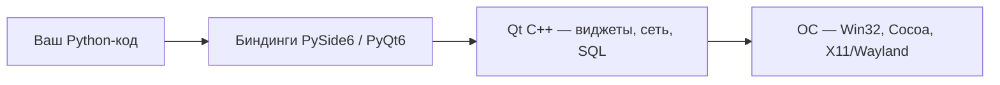
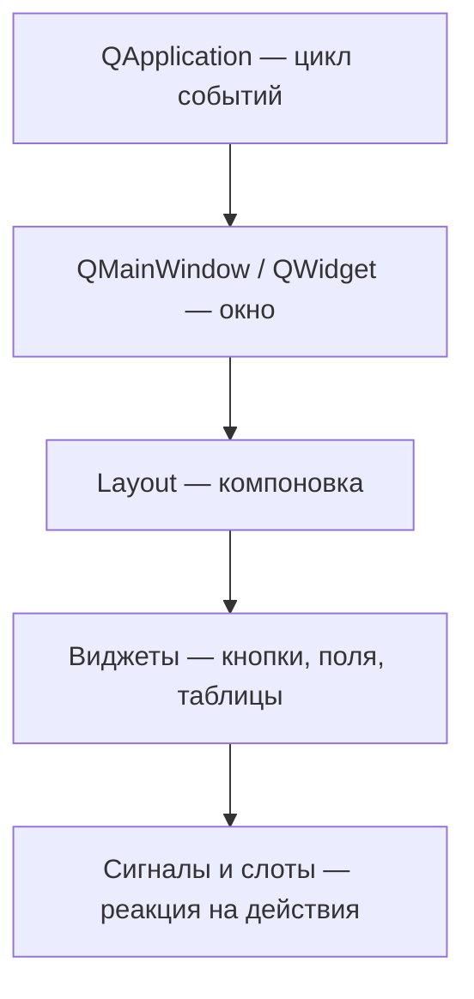

# PyQt, PySide и Flet — GUI beyond Tkinter

<div class="article-tags">
  <span class="tag tag-required">ОБЯЗАТЕЛЬНО</span>
  <span class="tag tag-beginner">ДЛЯ НОВИЧКОВ</span>
</div>

<span class="complexity-badge">Разработчику</span>
<span class="complexity-badge">Архитектору</span>

---

## GUI beyond Tkinter

[Tkinter](./311.md) хорош для обучения и простых утилит. Для **профессионального десктопа** чаще берут **Qt** (PyQt6 / PySide6) или **Flet** (Flutter-подход на Python).

Практика: [Первая программа на PyQt6](./3131.md) · [Tkinter — первая программа](./3111.md) · [Tkinter — примеры в Lab](/lab/Примеры/1124). Общая теория окон и событий — [Архитектура десктопных приложений](/encyclopedia/4-code-dev/4-11-desktopnye-prilozheniya/1).

Если коротко, у выбора здесь всегда есть контекст проекта. Для внутренней утилиты команды важнее скорость разработки и простота поддержки. Для desktop-продукта с долгим жизненным циклом важны компоненты, экосистема и предсказуемая архитектура. Для кросс-платформенной административной панели часто важна скорость прототипирования и визуальная аккуратность «из коробки».

---

## Маршрут по статье

1. [Сравнение стеков](#сравнение) — Tkinter, Qt, Flet в одной таблице.
2. [Что такое Qt](#что-такое-qt) — фреймворк, биндинги, слои.
3. [Событийная модель GUI](#событийная-модель-gui) — цикл событий, UI-поток.
4. [PyQt и PySide](#pyqt) — версии, лицензии, Python/pip.
5. [Архитектура приложения](#архитектура-qt-приложения) — окна, layout, дерево виджетов.
6. [Модули PySide6](#основные-модули-pyside6) — Widgets, Core, Gui, Network, Sql, Multimedia, WebEngine.
7. [Практика](#минимальное-приложение) — минимальный код, Designer, Model–View, потоки, QSS.
8. [Flet и выбор стека](#flet) — когда что брать.

---

## Как читать сравнение на практике

Ниже в таблицах и примерах легко потеряться в инструментах. Рабочий способ сравнивать фреймворки:

1. Формализовать сценарий — «одна форма», «много таблиц и фильтров», «графики», «офлайн-режим», «сложная навигация».
2. Сравнивать поддержку команды через 6–12 месяцев, а также «красиво/некрасиво» на первом экране.
3. Делать мини-прототипы одной и той же задачи в 2 стеках и измерять время реализации.
4. Проверять, как решаются ошибки в рантайме, упаковка и обновления приложения.

Отдельно полезно связать выбор GUI со стеком бэкенда и интеграций: [FastAPI](./3431.md), [Работа с базами данных](./314.md), [Файлы, сеть и внешние API](./31.md), [Особенности разработки десктопных приложений](/encyclopedia/4-code-dev/4-11-desktopnye-prilozheniya/112.md).

---

## Сравнение

| | Tkinter | PyQt6 / PySide6 | Flet |
|---|---------|-----------------|------|
| В комплекте CPython | Да | Нет (`pip install`) | Нет |
| Внешний вид | Системный, устаревший | Нативный / кастомный Qt | Material-подобный |
| Сложность входа | Низкая | Высокая | Средняя |
| Лицензия | PSF | PyQt — GPL/коммерч. · PySide — LGPL | Apache 2 |
| Визуальный редактор | Нет (сторонние) | Qt Designer (`.ui`) | Код / preview в IDE |
| Таблицы, деревья, графики | Ограниченно | Богатый набор виджетов | Базовые контролы |
| Мультимедиа, WebView | Слабо | QtMultimedia, WebEngine | Ограниченно |
| Размер дистрибутива | Минимальный | Средний–большой (Qt libs) | Flutter runtime |
| Мобильные | Нет | Через Qt Mobile (редко) | Экспериментально |

**Tkinter** опирается на Tcl/Tk — мост Python → Tcl → отрисовка. **Qt** — самостоятельный C++-фреймворк с собственным рендерером и единым API на Windows, macOS и Linux. **Flet** генерирует UI через Flutter и подходит, когда команда хочет «современный» вид без погружения в Qt.

---

## Что такое Qt

**Qt** (произносится «кью-ти») — кроссплатформенный C++-фреймворк для графических и embedded-приложений. Его используют в KDE, VLC, Autodesk Maya, Telegram Desktop, части автомобильных панелей и промышленных HMI. Qt поставляет не только виджеты, но и сеть, SQL, мультимедиа, 3D (Qt Quick), internationalization и инструменты сборки (`qmake`, CMake).

На Python Qt доступен через **биндинги** — слой, который переводит вызовы Python в C++ API Qt и обратно возвращает результаты в интерпретатор.



### Две обёртки для Python

| Пакет | Поставщик | Генератор биндингов | Базовый Qt | Лицензия |
|-------|-----------|---------------------|------------|----------|
| **PyQt5** / **PyQt6** | Riverbank Computing | SIP | Qt 5 / Qt 6 | GPL или коммерческая |
| **PySide2** / **PySide6** | Qt Company | Shiboken | Qt 5 / Qt 6 | LGPL / GPL |

API PyQt6 и PySide6 совпадает примерно на 95%. В примерах ниже — **PySide6**; для PyQt6 достаточно заменить префикс импорта (`PySide6` → `PyQt6`) и учесть редкие отличия (см. таблицу ниже).

| Тема | PySide6 | PyQt6 |
|------|---------|-------|
| Запуск цикла событий | `app.exec()` | `app.exec()` |
| Сигналы в классах | `Signal`, `Slot` из `QtCore` | `pyqtSignal`, `pyqtSlot` |
| Enum | `Qt.AlignmentFlag.AlignCenter` | то же в Qt 6 |
| `QAction` | модуль `QtGui` | модуль `QtGui` |

<div class="callout callout--info">
  <div class="callout-title">Qt 5 и Qt 6</div>
  Qt 6 — текущая major-ветка с улучшенной графикой, единым модулем `QtCore` и активной поддержкой. Qt 5 в maintenance-режиме; новые проекты на Python стартуют с PySide6/PyQt6. Legacy-код на PyQt5/PySide2 мигрируют по официальным гайдам Qt Company.
</div>

---

## Событийная модель GUI

Любое desktop GUI — **событийно-ориентированная** программа. Приложение не крутит бесконечный `while True` с опросом мыши, а **ждёт события** в очереди: клик, нажатие клавиши, таймер, сетевой ответ, завершение потока. Обработчик забирает событие, обновляет модель или виджеты, планирует перерисовку — и снова ждёт.

| Понятие | В Tkinter | В Qt |
|---------|-----------|------|
| Точка входа цикла | `root.mainloop()` | `app.exec()` |
| Привязка действия | `command=`, `bind()` | `signal.connect(slot)` |
| Отложенный вызов | `root.after(ms, fn)` | `QTimer.singleShot(ms, fn)` |
| Главный поток UI | один | один (**GUI thread**) |

**GUI thread** — единственный поток, в котором безопасно создавать и менять виджеты. Долгий расчёт или синхронный HTTP в этом потоке «замораживают» окно: курсор превращается в песочные часы, анимации останавливаются. Решение — вынести работу в `QThread` или worker-объект с сигналами (см. [Работа с потоками](#работа-с-потоками)).

Цикл событий Qt можно представить так:

```
1. ОС сообщает: «мышь нажата на кнопке»
2. Qt превращает это в QEvent и кладёт в очередь
3. QApplication забирает событие и вызывает обработчик QPushButton
4. Кнопка испускает сигнал clicked
5. Подключённый слот выполняет ваш Python-код
6. При необходимости виджеты помечаются «грязными» и перерисовываются
7. Цикл повторяется, пока открыто хотя бы одно окно
```

Подробнее о WIMP-модели, зонах окна и роли mainloop — [Архитектура десктопных приложений](/encyclopedia/4-code-dev/4-11-desktopnye-prilozheniya/1).

---

## PyQt

**PyQt** — первая массовая Python-обёртка Qt, развивается с 1998 года компанией **Riverbank Computing**. Пакет включает генератор **SIP** (аналог SWIG для Qt) и готовые wheels с Qt-библиотеками, поэтому отдельно ставить Qt SDK обычно не нужно.

### PyQt5 и PyQt6

| | PyQt5 | PyQt6 |
|---|-------|-------|
| Версия Qt | 5.x | 6.x |
| Пакет pip | `PyQt5` | `PyQt6` |
| Статус | Legacy, поддержка старых проектов | Актуальная ветка для новых приложений |
| Типичные отличия API | `exec_()`, `QAction` в `QtWidgets` | `exec()`, `QAction` в `QtGui`, enum в scoped-типах |

Для **нового** desktop-проекта на Python разумнее сразу брать **PyQt6** (или PySide6). PyQt5 имеет смысл при поддержке кода под Qt 5 или зависимости от библиотеки, ещё не перешедшей на Qt 6.

### Лицензирование PyQt

| Вариант | Кому подходит | Ограничения |
|---------|---------------|-------------|
| **GPL** (бесплатно) | Open-source проекты | Copyleft — исходники производного ПО должны быть доступны на условиях GPL |
| **Коммерческая** (Riverbank) | Закрытые коммерческие продукты | Платная лицензия, без GPL-обязательств |

**PySide6** распространяется под **LGPL**: динамическая линковка с Qt-библиотеками обычно допускает закрытый прикладной код при соблюдении условий LGPL (возможность замены Qt-библиотеки пользователем). Для корпоративных продуктов PySide6 часто выбирают именно из-за лицензии без отдельной покупки у Riverbank.

### Совместимость с Python и pip

Актуальные **PyQt6** и **PySide6** (6.11+) требуют **Python 3.10+**, **64-bit** интерпретатор и свежий `pip`. Wheels публикуются на PyPI для Windows, macOS и Linux (amd64; на Linux также aarch64).

| Пакет | Минимальный Python (актуальные релизы) | Установка |
|-------|--------------------------------------|-----------|
| PyQt6 | 3.10+ | `pip install PyQt6` |
| PySide6 | 3.10+ | `pip install PySide6` |
| PyQt5 | 3.5+ (зависит от версии пакета) | `pip install PyQt5` |
| PySide2 | 3.5+ (зависит от версии пакета) | `pip install PySide2` |

<div class="callout callout--info">
  <div class="callout-title">Проверка окружения</div>
  Перед установкой убедитесь, что Python 64-bit: `python -c "import struct; print(8 * struct.calcsize('P'))"`. Должно вывести `64`. Работайте в venv — так проще управлять версиями Qt-биндингов и упаковкой через PyInstaller.
</div>

```bash
python -m venv venv
# Windows —
venv\Scripts\activate
# macOS / Linux —
source venv/bin/activate

pip install --upgrade pip
pip install PySide6
# или
pip install PyQt6
```

После установки PySide6 в PATH появляются утилиты `pyside6-designer`, `pyside6-uic` и др. У PyQt6 аналоги — `pyqt6-tools` (сторонний пакет) или Designer из Qt SDK.

---

## Архитектура Qt-приложения

Любое Qt GUI строится вокруг нескольких идей: **одно приложение**, **дерево виджетов**, **layout вместо координат**, **сигналы вместо прямых вызовов**.



| Уровень | Класс / понятие | Роль |
|---------|-----------------|------|
| Приложение | `QApplication` | Единственный объект на процесс; инициализация стилей, локали, high-DPI; запуск **цикла событий** (`app.exec()`) |
| Окно | `QMainWindow`, `QDialog`, `QWidget` | Контейнер верхнего уровня; `QMainWindow` добавляет меню, toolbar, status bar, dock-панели |
| Компоновка | `QVBoxLayout`, `QHBoxLayout`, `QGridLayout`, `QFormLayout` | Располагает виджеты с учётом resize; заменяет ручной `move(x, y)` |
| Элемент UI | `QPushButton`, `QLineEdit`, `QTableView`… | Конкретные контролы |
| Связь | Сигнал → слот | Декларативная реакция на клик, ввод, таймер |

### Дерево виджетов и владение

Каждый `QWidget` может иметь **родителя**. Дочерние виджеты рисуются внутри области родителя и уничтожаются вместе с ним — это упрощает управление памятью. Окно верхнего уровня (`parent=None`) получает декорации от ОС (рамка, кнопки свернуть/закрыть).

```
QApplication
└── QMainWindow                    ← окно верхнего уровня
    ├── QMenuBar / QToolBar / QStatusBar
    └── central QWidget
        └── QVBoxLayout            ← layout не виджет, но управляет геометрией
            ├── QLabel
            ├── QLineEdit
            └── QHBoxLayout
                ├── QPushButton("OK")
                └── QPushButton("Отмена")
```

### Layout — зачем они нужны

Без layout виджеты остаются в фиксированных пикселях и «ломаются» при изменении размера окна или масштаба DPI. **Layout manager** пересчитывает позиции при `resizeEvent`:

| Layout | Поведение |
|--------|-----------|
| `QVBoxLayout` | Вертикальный столбец |
| `QHBoxLayout` | Горизонтальная строка |
| `QGridLayout` | Сетка строк × столбцов |
| `QFormLayout` | Пары «метка — поле» для форм |

У layout есть **stretch** и **margin/spacing** — ими задают, какой виджет растягивается, а какой остаётся компактным.

### Meta-Object System

**Meta-Object System** — внутренний механизм Qt на C++: через него работают сигналы/слоты, свойства (`Q_PROPERTY`), introspection и переводы (`tr()`). Python-биндинги генерируют glue-код автоматически (Shiboken/SIP), но ментальная модель та же, что у C++ Qt: объект испускает **сигнал**, подписчики-**слоты** получают вызов.

Подробный разбор первого окна — [Первая программа на PyQt6](./3131.md). Аналог на C++ — [Qt — первая программа](/encyclopedia/5-languages/5-06-cpp/2731).

---

## PySide

**PySide** (бренд **Qt for Python**) — официальная ветка биндингов от **Qt Company**. Проект стартовал как «Reference Implementation» LGPL-обёртки; с Qt 6 стал рекомендуемым open-source путём для Python + Qt. Генератор **Shiboken** создаёт Python-типы из C++ заголовков Qt.

| | PySide2 | PySide6 |
|---|---------|---------|
| Qt | 5.x | 6.x |
| pip | `pip install PySide2` | `pip install PySide6` |
| Лицензия | LGPL / GPL | LGPL / GPL |
| Утилиты | `pyside2-uic`, … | `pyside6-designer`, `pyside6-uic`, … |

PySide6 поставляет те же модули, что PyQt6 (`QtWidgets`, `QtCore`, `QtGui`…). Документация и примеры — на [doc.qt.io/qtforpython](https://doc.qt.io/qtforpython/).

<div class="callout callout--tip">
  <div class="callout-title">PyQt или PySide</div>
  Для учебного и open-source проекта чаще берут PySide6 (LGPL). Для команды с уже купленной коммерческой лицензией Riverbank или при жёсткой привязке к PyQt-экосистеме — PyQt6. Код переносится заменой префикса импортов и точечной правкой сигналов (`Signal` ↔ `pyqtSignal`).
</div>

---

## Основные модули PySide6

Qt разбит на **модули** — логические библиотеки, которые подключают по необходимости. Это уменьшает размер сборки и явно показывает зависимости.

```python
from PySide6.QtWidgets import *   # Виджеты — кнопки, окна, таблицы
from PySide6.QtCore import *       # Ядро — сигналы, слоты, время, потоки, URL
from PySide6.QtGui import *        # Графика — шрифты, иконки, цвета, QPainter, QAction
from PySide6.QtNetwork import *    # HTTP, TCP/UDP, DNS
from PySide6.QtSql import *        # SQLite, PostgreSQL, MySQL через драйверы Qt
from PySide6.QtMultimedia import * # Аудио и видео
from PySide6.QtWebEngineWidgets import *  # Встроенный Chromium-браузер
```

| Модуль | Ответственность | Типичные классы |
|--------|----------------|-----------------|
| `QtWidgets` | Стандартные контролы desktop UI | `QApplication`, `QMainWindow`, `QPushButton`, `QTableView` |
| `QtCore` | Ядро без отрисовки | `QObject`, `Signal`, `QTimer`, `QThread`, `QUrl`, `Qt` |
| `QtGui` | Растровая графика, шрифты, clipboard | `QPainter`, `QPixmap`, `QIcon`, `QFont`, `QAction` |
| `QtNetwork` | Сетевой стек | `QNetworkAccessManager`, `QTcpSocket` |
| `QtSql` | Доступ к СУБД | `QSqlDatabase`, `QSqlQuery`, `QSqlTableModel` |
| `QtMultimedia` | Воспроизведение медиа | `QMediaPlayer`, `QAudioOutput`, `QVideoWidget` |
| `QtWebEngineWidgets` | HTML/CSS/JS в окне | `QWebEngineView` |

`QtWebEngineWidgets` входит в addon-пакет `PySide6_Addons` (ставится вместе с `pip install PySide6`). На минимальных Linux-сборках могут понадобиться системные зависимости Chromium. WebEngine заметно увеличивает размер дистрибутива — подключайте только когда встроенный браузер действительно нужен.

---

## QtWidgets — виджеты

**Виджет (widget)** — визуальный элемент интерфейса или контейнер для других виджетов. Все интерактивные контролы наследуют `QWidget`; у каждого есть геометрия, палитра, шрифт, политика фокуса и цепочка **tab order** для клавиатурной навигации.

### Категории виджетов

| Категория | Назначение | Примеры |
|-----------|------------|---------|
| **Отображение** | Показ текста, картинок, прогресса | `QLabel`, `QProgressBar` |
| **Ввод** | Данные от пользователя | `QLineEdit`, `QTextEdit`, `QSpinBox`, `QComboBox` |
| **Выбор** | Булевы и взаимоисключающие опции | `QCheckBox`, `QRadioButton` |
| **Команды** | Запуск действий | `QPushButton`, `QToolButton` |
| **Контейнеры** | Группировка и навигация | `QTabWidget`, `QScrollArea`, `QGroupBox`, `QStackedWidget` |
| **Списки и таблицы** | Много строк данных | `QListWidget`, `QTreeWidget`, `QTableWidget`, `QTableView` |
| **Диалоги** | Модальные окна | `QMessageBox`, `QFileDialog`, `QInputDialog` |

**`QTableWidget`** хранит данные внутри себя — удобно для прототипов.**`QTableView` + модель** — правильный путь для больших таблиц: данные живут в `QAbstractTableModel` или `QSqlTableModel`, view только рисует видимые ячейки.

Общий каркас для запуска любого фрагмента ниже:

```python
import sys
from PySide6.QtWidgets import QApplication, QWidget, QVBoxLayout

app = QApplication(sys.argv)
window = QWidget()
window.setWindowTitle("Демо")
window.resize(400, 300)
layout = QVBoxLayout(window)  # layout сразу на window
# … добавьте виджеты через layout.addWidget(...) …
window.show()
sys.exit(app.exec())
```

### QLabel — текст или картинка

Метка показывает статический или динамический текст, pixmap или HTML-подмножество. Для обновления из кода используют `setText()`; для форматирования — `setTextFormat(Qt.RichText)`.

```python
from PySide6.QtWidgets import QLabel

label = QLabel("Температура: 23 °C")
label.setStyleSheet("font-size: 16px;")
layout.addWidget(label)
```

### QPushButton — кнопка

Кнопка испускает сигнал `clicked()` при отпускании ЛКМ внутри области. Есть также `pressed`, `released`, `toggled` (для checkable-кнопок). Текст, иконка и shortcut (`setShortcut("Ctrl+S")`) задаются отдельно.

```python
from PySide6.QtWidgets import QPushButton

btn = QPushButton("Сохранить")
btn.clicked.connect(lambda: print("Нажато"))
layout.addWidget(btn)
```

### QLineEdit — однострочное поле

Однострочный ввод с маской, валидатором (`QIntValidator`) и режимом пароля (`setEchoMode(QLineEdit.Password)`). Сигнал `textChanged` срабатывает на каждый символ; `editingFinished` — при Enter или потере фокуса.

```python
from PySide6.QtWidgets import QLineEdit

field = QLineEdit()
field.setPlaceholderText("Введите имя")
name = field.text()
layout.addWidget(field)
```

### QTextEdit — многострочный текст

Полноценный редактор с форматированием (Rich Text) или plain mode. Для логов и заметок чаще `setPlainText` / `toPlainText`; для документов с форматированием — `QTextDocument`.

```python
from PySide6.QtWidgets import QTextEdit

editor = QTextEdit()
editor.setPlainText("Черновик заметки")
content = editor.toPlainText()
layout.addWidget(editor)
```

### QCheckBox и QRadioButton

`QCheckBox` — независимый флажок; `QRadioButton` — элемент группы, где активен один вариант. Группировку радиокнопок делают через `QButtonGroup`, чтобы Qt управлял взаимным исключением.

```python
from PySide6.QtWidgets import QCheckBox, QRadioButton, QButtonGroup

dark = QCheckBox("Тёмная тема")
dark.stateChanged.connect(lambda state: print("checked" if state else "off"))

group = QButtonGroup()
rb_a = QRadioButton("Вариант A")
rb_b = QRadioButton("Вариант B")
group.addButton(rb_a)
group.addButton(rb_b)
layout.addWidget(dark)
layout.addWidget(rb_a)
layout.addWidget(rb_b)
```

### QComboBox — выпадающий список

Компактный выбор из списка или редактируемое поле с автодополнением (`setEditable(True)`). Сигналы `currentIndexChanged` и `currentTextChanged` помогают реагировать на выбор города, темы, профиля.

```python
from PySide6.QtWidgets import QComboBox

combo = QComboBox()
combo.addItems(["Москва", "Санкт-Петербург", "Казань"])
city = combo.currentText()
layout.addWidget(combo)
```

### QListWidget — список элементов

Простой список «всё в одном виджете». Для больших коллекций и сортировки лучше `QListView` + модель (см. [Model–View](#модель-и-представление-modelview)).

```python
from PySide6.QtWidgets import QListWidget

lst = QListWidget()
lst.addItems(["Яблоко", "Банан", "Груша"])
lst.itemClicked.connect(lambda item: print(item.text()))
layout.addWidget(lst)
```

### QTableWidget — таблица

Таблица фиксированного числа строк/столбцов в памяти виджета. Быстрый старт; при тысячах строк переходите на `QTableView` + модель.

```python
from PySide6.QtWidgets import QTableWidget, QTableWidgetItem

table = QTableWidget(2, 3)
table.setHorizontalHeaderLabels(["Имя", "Возраст", "Город"])
table.setItem(0, 0, QTableWidgetItem("Анна"))
table.setItem(0, 1, QTableWidgetItem("28"))
layout.addWidget(table)
```

### QProgressBar и QSlider

Связка «ползунок → значение → progress bar» демонстрирует сигналы без промежуточного кода: `slider.valueChanged.connect(progress.setValue)`.

```python
from PySide6.QtWidgets import QProgressBar, QSlider

progress = QProgressBar()
progress.setValue(40)

slider = QSlider()
slider.setRange(0, 100)
slider.valueChanged.connect(progress.setValue)
layout.addWidget(slider)
layout.addWidget(progress)
```

### QSpinBox — число с кнопками +/-

Целые или вещественные (`QDoubleSpinBox`) значения с кнопками и клавиатурным вводом. Подходит для возраста, процентов, таймаутов.

```python
from PySide6.QtWidgets import QSpinBox

spin = QSpinBox()
spin.setRange(0, 120)
spin.setValue(25)
layout.addWidget(spin)
```

### QTabWidget — вкладки

Контейнер с несколькими страницами; каждая вкладка — отдельный `QWidget`. Удобно для настроек, мастеров, IDE-подобных панелей.

```python
from PySide6.QtWidgets import QTabWidget, QLabel

tabs = QTabWidget()
tabs.addTab(QLabel("Содержимое вкладки 1"), "Общее")
tabs.addTab(QLabel("Содержимое вкладки 2"), "Настройки")
layout.addWidget(tabs)
```

### QMessageBox — диалог

Модальные системные диалоги: информация, предупреждение, вопрос Да/Нет, выбор файла (`QFileDialog` — отдельный класс). Модальность блокирует родительское окно до закрытия диалога.

```python
from PySide6.QtWidgets import QMessageBox

QMessageBox.information(window, "Готово", "Файл сохранён")
QMessageBox.warning(window, "Внимание", "Поле пустое")
```

Сводка частых виджетов:

| Виджет | Назначение |
|--------|------------|
| `QLabel` | Статический текст, иконка |
| `QPushButton` | Действие по клику |
| `QLineEdit` | Одна строка ввода |
| `QTextEdit` | Многострочный редактор |
| `QCheckBox` / `QRadioButton` | Выбор опций |
| `QComboBox` | Выпадающий список |
| `QListWidget` | Простой список |
| `QTableWidget` / `QTableView` | Табличные данные |
| `QProgressBar` / `QSlider` | Прогресс и диапазон |
| `QTabWidget` | Вкладки |
| `QMessageBox` | Модальные сообщения |

---

## QtCore — сигналы и слоты

**Сигнал (signal)** — типизированное уведомление объекта-наследника `QObject`: «кнопку нажали», «текст изменился», «поток завершился». **Слот (slot)** — функция, вызываемая при сигнале. Связь декларативная: `button.clicked.connect(self.on_click)`.

В Tkinter близкий аналог — `command=handler` или `bind()`. В Qt один сигнал может питать **несколько** слотов; один слот может быть подписан на **несколько** сигналов. От подписки можно отписаться через `disconnect()`.

| Механизм | Поведение |
|----------|-----------|
| Прямое соединение | Слот вызывается сразу в потоке отправителя |
| Queued connection | Событие ставится в очередь GUI-потока (важно для worker → UI) |
| `QTimer.singleShot(0, fn)` | Отложить вызов до следующей итерации цикла |

Собственные сигналы объявляют в классах-наследниках `QObject`:

```python
from PySide6.QtWidgets import *
from PySide6.QtCore import Signal, QObject, Slot

class Worker(QObject):
    finished = Signal(str)

    def do_work(self):
        self.finished.emit("Работа завершена!")

class MainWindow(QMainWindow):
    def __init__(self):
        super().__init__()
        self.worker = Worker()
        self.worker.finished.connect(self.on_finished)

    @Slot(str)
    def on_finished(self, message):
        QMessageBox.information(self, "Готово", message)
```

`@Slot(str)` необязателен, но помогает Shiboken/PyQt корректно маршрутизировать типы. Встроенные сигналы виджетов (`clicked`, `textChanged`, `currentIndexChanged`) покрывают большинство UI-сценариев.

---

## QtGui — графика

Модуль **QtGui** отвечает за растровую графику, шрифты, цвета, иконки, буферы изображений, clipboard и (в Qt 6) `QAction`. Отрисовка на виджете идёт через **`paintEvent`**: Qt вызывает его, когда область нужно перерисовать.

```python
from PySide6.QtGui import QPainter, QColor, QFont, QPixmap, QIcon
from PySide6.QtWidgets import QWidget

class Canvas(QWidget):
    def paintEvent(self, event):
        painter = QPainter(self)
        painter.setFont(QFont("Segoe UI", 14))
        painter.setPen(QColor("#2196F3"))
        painter.drawText(20, 40, "Рисуем текст напрямую")
        painter.fillRect(20, 60, 120, 40, QColor("#E3F2FD"))

pix = QPixmap("logo.png")
icon = QIcon(pix)
button.setIcon(icon)
```

**High DPI** — на экранах с масштабом 125–200% Qt масштабирует виджеты, если включена политика `AA_EnableHighDpiScaling` (в Qt 6 часть поведения по умолчанию). Иконки лучше хранить в нескольких разрешениях или SVG.

Для диаграмм — `QtCharts`; для больших сцен с тысячами элементов — `QGraphicsView` / `QGraphicsScene`; для declarative UI — **Qt Quick (QML)** — отдельный путь от классических Widgets.

---

## QtSql — работа с БД

**QtSql** даёт унифицированный доступ к SQLite, PostgreSQL, MySQL и другим СУБД через **драйверы** Qt (`QSQLITE`, `QPSQL`, `QMYSQL`). Подходит для **локального** хранилища в desktop-приложении (настройки, кэш, офлайн-режим).

```python
from PySide6.QtSql import QSqlDatabase, QSqlQuery

db = QSqlDatabase.addDatabase("QSQLITE")
db.setDatabaseName("app.db")
db.open()

query = QSqlQuery()
query.exec("CREATE TABLE IF NOT EXISTS users (id INTEGER PRIMARY KEY, name TEXT)")
query.prepare("INSERT INTO users (name) VALUES (?)")
query.addBindValue("Алексей")
query.exec()
```

**`QSqlTableModel`** + **`QTableView`** связывают таблицу БД с UI: правки в view могут писаться обратно в БД через `submitAll()`. Для сложной доменной логики и миграций чаще комбинируют Qt UI с [SQLAlchemy](./314.md) или серверным API.

---

## QtNetwork — сеть

**QtNetwork** покрывает HTTP/HTTPS-клиент, TCP/UDP-сокеты, DNS, TLS. **`QNetworkAccessManager`** — центральная точка для REST: один объект на приложение, асинхронные `get`/`post` с сигналом `finished` у `QNetworkReply`.

```python
from PySide6.QtNetwork import QNetworkAccessManager, QNetworkRequest
from PySide6.QtCore import QUrl

manager = QNetworkAccessManager()

def on_finished(reply):
    data = reply.readAll().data().decode()
    print(data)
    reply.deleteLater()

request = QNetworkRequest(QUrl("https://httpbin.org/get"))
reply = manager.get(request)
reply.finished.connect(lambda: on_finished(reply))
```

Ответ приходит в GUI-потоке через queued connection — UI можно обновлять напрямую. Для тяжёлого парсинга JSON всё равно лучше worker-поток. См. также [Файлы, сеть и внешние API](./31.md) и [Асинхронность и многопоточность](./29.md).

---

## QtMultimedia — аудио и видео

Модуль абстрагирует воспроизведение через backends ОС (DirectShow, AVFoundation, GStreamer). **`QMediaPlayer`** управляет источником; **`QAudioOutput`** / **`QVideoWidget`** — выводом.

```python
from PySide6.QtMultimedia import QMediaPlayer, QAudioOutput
from PySide6.QtCore import QUrl

player = QMediaPlayer()
audio = QAudioOutput()
player.setAudioOutput(audio)
player.setSource(QUrl.fromLocalFile("track.mp3"))
player.play()
```

Набор поддерживаемых кодеков зависит от платформы и сборки Qt. Для профессионального видео иногда подключают VLC/libVLC или FFmpeg отдельно.

---

## QtWebEngineWidgets — встроенный браузер

**Qt WebEngine** — встраиваемый Chromium. Подходит для справки, preview HTML, OAuth-страниц, гибридных UI. Цена — размер бинарника и потребление RAM.

```python
from PySide6.QtWebEngineWidgets import QWebEngineView
from PySide6.QtCore import QUrl

browser = QWebEngineView()
browser.setUrl(QUrl("https://doc.qt.io/qtforpython/"))
layout.addWidget(browser)
```

Для десктопа с «веб-интерфейсом» альтернатива — [Electron](/encyclopedia/4-code-dev/4-11-desktopnye-prilozheniya/114) или **pywebview** + локальный Flask/FastAPI.

---

## Минимальное приложение

Каждая программа на QtWidgets проходит три шага: создать `QApplication`, создать виджеты, вызвать `exec()`.

```python
import sys
from PySide6.QtWidgets import QApplication, QLabel

app = QApplication(sys.argv)   # 1. приложение + аргументы командной строки
label = QLabel("Привет, PySide6!")
label.show()                   # 2. виджет верхнего уровня — своё окно
sys.exit(app.exec())           # 3. цикл событий до закрытия
```

`QApplication` обязателен **ровно один** на процесс. `sys.argv` передаёт флаги вроде `-style fusion` для отладки тем. `app.exec()` блокирует main до закрытия последнего окна верхнего уровня.

---

## Классическое окно с кнопкой

`QMainWindow` — каркас с меню, toolbar и центральной областью. Контент кладут в **central widget**, внутри — layout.

```python
import sys
from PySide6.QtWidgets import *
from PySide6.QtCore import *

class MyWindow(QMainWindow):
    def __init__(self):
        super().__init__()
        self.setWindowTitle("Моё приложение")
        self.setGeometry(100, 100, 400, 300)

        central = QWidget()
        self.setCentralWidget(central)

        btn = QPushButton("Нажми меня!")
        btn.clicked.connect(self.on_click)

        layout = QVBoxLayout()
        layout.addWidget(btn)
        central.setLayout(layout)

    def on_click(self):
        QMessageBox.information(self, "Успех", "Кнопка нажата!")

app = QApplication(sys.argv)
window = MyWindow()
window.show()
sys.exit(app.exec())
```

Наследование от `QMainWindow` упрощает добавление меню (`menuBar()`), статуса (`statusBar()`) и dock-панелей позже без перестройки структуры.

---

## Полезные утилиты PySide6

| Утилита | Назначение |
|---------|------------|
| `pyside6-designer` | Визуальный редактор `.ui` — перетаскивание виджетов, preview layout |
| `pyside6-uic input.ui -o output.py` | Генерация Python-класса `Ui_*` из XML-описания |
| `pyside6-rcc resources.qrc -o resources_rc.py` | Компиляция иконок и переводов в Python-модуль |
| `pyside6-linguist` | Редактор `.ts` для i18n, экспорт в `.qm` |

**Типичный workflow Designer**

1. Нарисовать форму в Designer, сохранить `mainwindow.ui`.
2. Сгенерировать `ui_mainwindow.py` через `pyside6-uic`.
3. В коде: класс `MainWindow(QMainWindow)` создаёт `Ui_MainWindow()` и вызывает `setupUi(self)`.
4. Логику (сигналы, бизнес-правила) пишут в Python, разметку меняют в `.ui` без merge-конфликтов в hand-written layout.

Пошагово — [Первая программа на PyQt6](./3131.md).

---

## Модель и представление (Model–View)

Qt поощряет разделение **данных** (Model), **отображения** (View) и **редактирования ячеек** (Delegate). View не хранит строки таблицы — он запрашивает `data(index, role)` у модели. При изменении модели view перерисовывает только затронутые ячейки.

```python
from PySide6.QtWidgets import QListView
from PySide6.QtCore import QStringListModel

data = ["Яблоко", "Банан", "Апельсин", "Груша"]
model = QStringListModel()
model.setStringList(data)

list_view = QListView()
list_view.setModel(model)
```

| Компонент | Роль |
|-----------|------|
| `QAbstractItemModel` | Контракт данных (строки, столбцы, роли) |
| `QListView` / `QTableView` / `QTreeView` | Отображение |
| `QStyledItemDelegate` | Кастомный редактор ячейки |
| `QSortFilterProxyModel` | Сортировка и фильтр без копирования данных |

Для SQL — `QSqlTableModel`; для pandas-подобных структур — наследник `QAbstractTableModel` с переопределением `rowCount`, `columnCount`, `data`.

---

## Работа с потоками

Долгие операции (сеть, парсинг, расчёты) **блокируют GUI-поток**, если выполнять их в слоте кнопки. Правило: виджеты трогает только GUI-поток; работу выносят в **`QThread`** или worker-`QObject` в отдельном потоке через **`moveToThread`**.

```python
from PySide6.QtCore import QThread, Signal
import time

class WorkerThread(QThread):
    progress = Signal(int)
    finished = Signal()

    def run(self):
        for i in range(101):
            time.sleep(0.05)
            self.progress.emit(i)
        self.finished.emit()

thread = WorkerThread()
thread.progress.connect(lambda v: print(f"Прогресс: {v}%"))
thread.start()
```

Сигналы из worker-потока в слоты UI по умолчанию используют **queued connection** — безопасно обновлять progress bar. Подробнее — [Асинхронность и многопоточность](./29.md), [Особенности десктопа](/encyclopedia/4-code-dev/4-11-desktopnye-prilozheniya/112.md).

---

## Стилизация — QSS

**Qt Style Sheets (QSS)** — CSS-подобный синтаксис для оформления виджетов. Поддерживаются селекторы по типу (`QPushButton`), по objectName (`#saveBtn`), по состоянию (`:hover`, `:pressed`, `:disabled`).

```python
button.setStyleSheet("""
    QPushButton {
        background-color: #4CAF50;
        color: white;
        border-radius: 5px;
        padding: 10px;
        font-size: 14px;
    }
    QPushButton:hover {
        background-color: #45a049;
    }
    QPushButton:pressed {
        background-color: #3d8b40;
    }
""")
```

| Подход | Когда использовать |
|--------|-------------------|
| **QSS** | Единая тема, брендированные цвета, кастомные кнопки |
| **Fusion / Windows / macOS style** | Нативный вид «как у системы» |
| **Qt Quick Controls** | Declarative UI, мобильные и embedded сценарии |

Глобальную тему задают через `app.setStyleSheet(...)` или внешний файл `.qss`, загружаемый при старте.

---

## Flet

```bash
pip install flet
```

**Flet** описывает UI на Python; рендер идёт через **Flutter**. Архитектура другая: нет сигналов Qt, вместо них callback-функции и декларативное дерево контролов на `page`.

```python
import flet as ft

def main(page: ft.Page):
    page.title = "Flet demo"
    page.add(ft.Text("Привет, Flet!"), ft.ElevatedButton("OK"))

ft.app(target=main)
```

Flet быстрее даёт «современный» Material-вид, но уступает Qt в сложных таблицах, Designer, offline SQL и зрелой desktop-экосистеме. Хорош для внутренних админок и прототипов.

---

## Когда что выбрать

- **Учебный проект, одно окно** → Tkinter.
- **Инженерное ПО, CAD-подобный UI, таблицы, Designer, offline** → PySide6 / PyQt6.
- **Быстрый красивый прототип без Qt** → Flet.
- **Уже есть веб-команда** → [Electron](/encyclopedia/4-code-dev/4-11-desktopnye-prilozheniya/114) или pywebview + Flask/FastAPI.

---

## Типичные ошибки выбора и как их избежать

- Выбор по «первому красивому демо» без проверки реальных сценариев (таблицы, фильтры, экспорт, фоновые задачи).
- Игнорирование лицензирования на старте проекта. Для коммерческих продуктов важно заранее согласовать модель лицензий и поставки.
- Отсутствие критериев производительности и тестирования UI перед архитектурным решением.
- Недооценка этапа упаковки (`PyInstaller`, размер Qt/WebEngine) и установки на машины пользователей.
- Блокировка GUI-потока тяжёлыми вычислениями вместо `QThread` или worker.
- Смешение PyQt5 и PyQt6 или PySide2 и PySide6 в одном проекте — API и wheels несовместимы.

Хорошая практика — закрепить решение коротким ADR (Architecture Decision Record) с критериями выбора, ограничениями и планом пересмотра.

---

### Что попробовать

1. Соберите один конвертер температуры на Tkinter, PySide6 и Flet — сравните строки кода и UX.
2. Откройте `.ui` в Qt Designer и подключите через `uic.loadUi` ([Первая программа на PyQt6](./3131.md)).
3. Добавьте `QThread` к длинной операции и progress bar — почувствуйте разницу с блокирующим слотом.
4. Упакуйте PySide-приложение: `pip install pyinstaller` и один файл `.exe` для коллеги без Python.

```bash
pip install pyinstaller
```

---

## Связанные материалы

- [Первая программа на PyQt6](./3131.md)
- [Tkinter и GUI](./311.md)
- [Справочник по Tkinter — элементы UI](./3112.md)
- [Tkinter — окна и виджеты (Lab)](/lab/Примеры/1124)
- [Архитектура десктопных приложений](/encyclopedia/4-code-dev/4-11-desktopnye-prilozheniya/1)
- [Особенности разработки десктопных приложений](/encyclopedia/4-code-dev/4-11-desktopnye-prilozheniya/112.md)
- [Десктопные приложения — раздел](/encyclopedia/4-code-dev/4-11-desktopnye-prilozheniya/intro)
- [Экосистема Python-приложений](./121.md)

---
