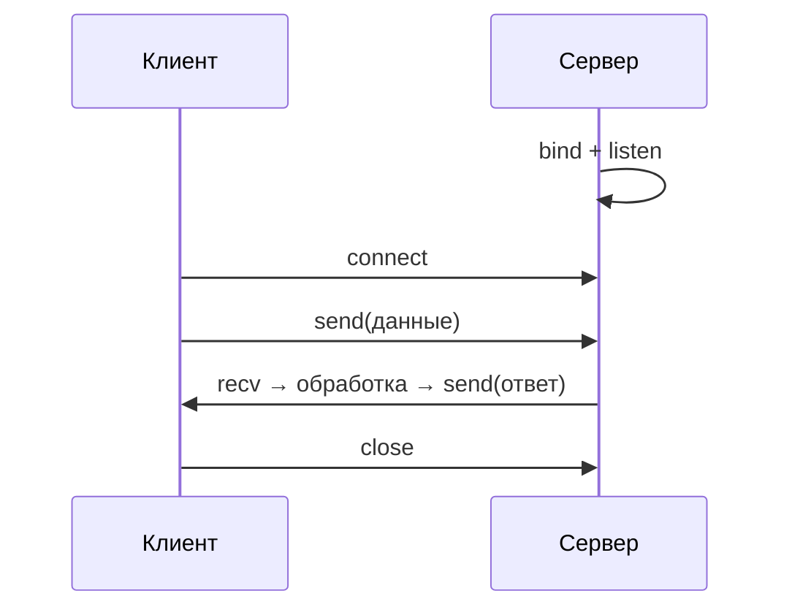

# Сетевое программирование на Python

<div class="article-tags">
  <span class="tag tag-required">ОБЯЗАТЕЛЬНО</span>
  <span class="tag tag-beginner">ДЛЯ НОВИЧКОВ</span>
</div>

<span class="complexity-badge">Разработчику</span>
<span class="complexity-badge">Архитектору</span>

См. также: [Работа с файлами, сетью и внешними API](./31.md) · [Асинхронность и многопоточность](./29.md) · [раздел «Сети»](/encyclopedia/2-system-network/2-01-operatsionnaya-sistema/intro)

## Зачем нужны сокеты

Большинство повседневных задач на Python решается через **HTTP-клиенты** (`requests`, `urllib`) или веб-фреймворки — см. [главу про файлы, сеть и API](./31.md). Но HTTP — это протокол **поверх** транспорта: обычно **TCP** (иногда UDP для DNS, QUIC и т.п.). Понимание сокетов помогает:

- отлаживать «зависшие» соединения и таймауты;
- писать собственные протоколы (игры, чаты, IoT, агенты мониторинга);
- читать документацию по сетевым ошибкам без магии «библиотека сама».

Модуль **`socket`** входит в стандартную библиотеку и даёт доступ к BSD-сокетам ОС.

---

## Модель клиент–сервер



**Сервер** привязывается к адресу и порту (`bind`), переходит в режим ожидания (`listen`), принимает входящие соединения (`accept`). **Клиент** инициирует соединение (`connect`), обменивается байтами (`send` / `recv`), закрывает сокет.

Важно: сокеты работают с **байтами**, не со строками. Кодировку (UTF-8) выбирает прикладной код.

---

## TCP: минимальный эхо-сервер

```python
import socket

HOST = "127.0.0.1"
PORT = 50007

with socket.socket(socket.AF_INET, socket.SOCK_STREAM) as server:
    server.setsockopt(socket.SOL_SOCKET, socket.SO_REUSEADDR, 1)
    server.bind((HOST, PORT))
    server.listen(1)
    conn, addr = server.accept()
    with conn:
        print("Подключение:", addr)
        while True:
            data = conn.recv(1024)
            if not data:
                break
            conn.sendall(data)  # эхо
```

Клиент:

```python
import socket

with socket.socket(socket.AF_INET, socket.SOCK_STREAM) as client:
    client.connect(("127.0.0.1", 50007))
    client.sendall(b"ping")
    print(client.recv(1024))
```

Параметры:

| Константа | Значение |
|-----------|----------|
| `AF_INET` | IPv4 |
| `SOCK_STREAM` | TCP (надёжный поток байтов) |
| `SOCK_DGRAM` | UDP (датаграммы без установки сессии) |

`recv(1024)` возвращает **до** 1024 байт за один системный вызов; для длинных сообщений нужен цикл или протокол с длиной заголовка.

---

## UDP

UDP не гарантирует доставку и порядок, зато дешевле по задержке — подходит для телеметрии, DNS-подобных запросов, игровых состояний «последний кадр важнее всех предыдущих».

```python
import socket

sock = socket.socket(socket.AF_INET, socket.SOCK_DGRAM)
sock.sendto(b"hello", ("127.0.0.1", 50008))
data, addr = sock.recvfrom(1024)
sock.close()
```

Сервер использует `bind`, клиент может не вызывать `connect` — достаточно `sendto` / `recvfrom`.

---

## Несколько клиентов

Один поток на `accept()` блокирует обработку остальных. Типичные варианты:

| Подход | Когда уместен |
|--------|----------------|
| **Поток на соединение** (`threading`) | Немного одновременных клиентов, простая логика |
| **Процесс на соединение** (`multiprocessing`) | CPU-bound обработка на клиента |
| **`asyncio` + неблокирующие сокеты** | Много I/O-bound соединений |
| **Отдельный балансировщик** (Nginx, HAProxy) | Продакшен HTTP |

Пример потока на клиента (упрощённо):

```python
import threading

def handle(conn):
    with conn:
        while True:
            chunk = conn.recv(4096)
            if not chunk:
                break
            conn.sendall(chunk)

# в цикле accept: threading.Thread(target=handle, args=(conn,), daemon=True).start()
```

Для учебных сервисов этого достаточно; для продакшена HTTP почти всегда отдают **Uvicorn/Gunicorn**, а не самописный TCP-сервер.

---

## asyncio и потоковые сокеты

В [главе про асинхронность](./29.md) описан event loop. Для сети удобны **высокоуровневые потоки**:

```python
import asyncio

async def tcp_echo_client():
    reader, writer = await asyncio.open_connection("127.0.0.1", 50007)
    writer.write(b"async ping\n")
    await writer.drain()
    data = await reader.read(100)
    print(data.decode())
    writer.close()
    await writer.wait_closed()

asyncio.run(tcp_echo_client())
```

`asyncio.open_connection` / `start_server` скрывают низкоуровневый `select`, но модель та же: байты, буферы, закрытие с обеих сторон.

---

## Связь с HTTP

HTTP-запрос — текст (или бинарные фреймы в HTTP/2) в TCP-потоке. Клиент `requests` открывает сокет, отправляет строки вроде `GET /path HTTP/1.1`, читает заголовки и тело. Поэтому:

- **таймаут** на уровне `requests` = ограничение ожидания на сокете;
- **keep-alive** = повторное использование одного TCP-соединения для нескольких запросов;
- **HTTPS** = TCP + TLS поверх (модуль `ssl` оборачивает сокет).

Самописный HTTP-сервер на `socket` возможен для обучения, но в проектах используют WSGI/ASGI — см. [веб и API](./34.md).

---

## Ошибки и безопасность

| Ситуация | Поведение |
|----------|-----------|
| Порт занят | `OSError: Address already in use` — другой процесс или `TIME_WAIT` |
| Разрыв соединения | `recv` возвращает `b""` |
| Таймаут | `socket.settimeout(seconds)` → `TimeoutError` |
| Сканирование извне | Не слушать `0.0.0.0` без необходимости; файрвол, TLS, аутентификация |

Никогда не `eval`/`pickle` на байтах из сети от непроверенных клиентов. Для прикладных протоколов лучше **JSON + длина сообщения** или **MessagePack**, явная схема версии.

---

## Когда что выбирать

| Задача | Инструмент |
|--------|------------|
| REST, веб-страницы, интеграции | `requests`, Flask, FastAPI, Django |
| Долгоживущие двусторонние каналы | WebSocket (Starlette/FastAPI) или TCP с собственным протоколом |
| Высокая частота мелких пакетов, потеря допустима | UDP |
| Обучение, отладка транспорта | `socket` / `asyncio` streams |

---

## Связанные материалы

- [Работа с файлами, сетью и внешними API](./31.md)
- [Асинхронность и многопоточность в Python](./29.md)
- [FastAPI](./3431.md) — WebSocket и ASGI поверх TCP

---
