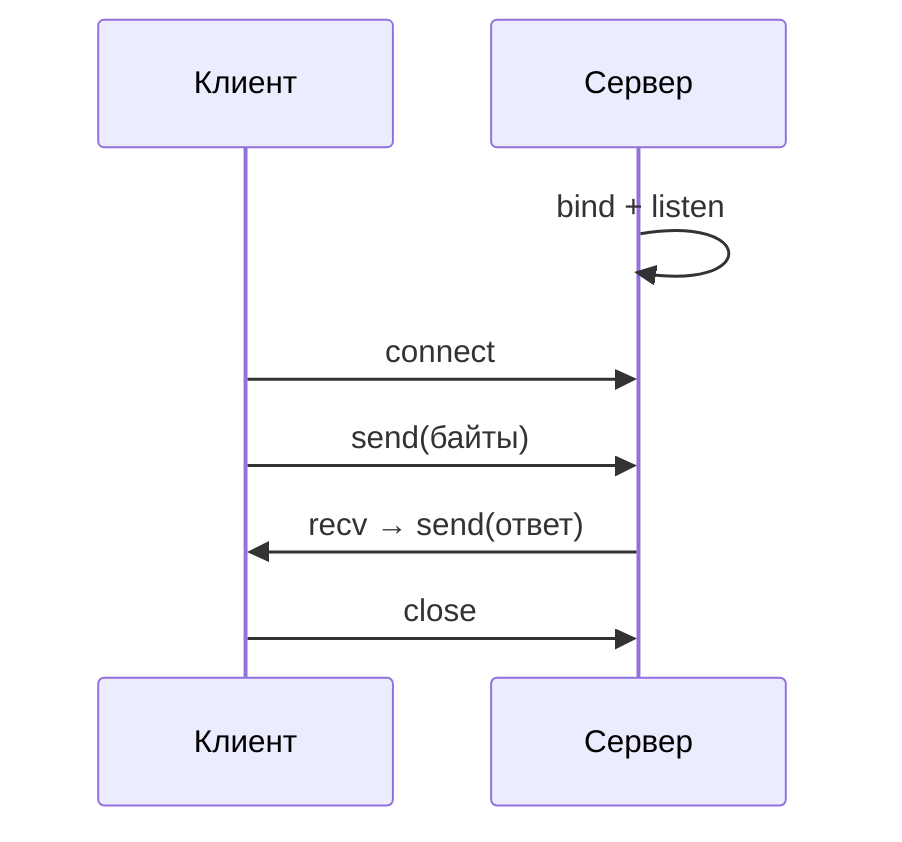

import ExternalCodeEmbed from '@site/src/components/ExternalCodeEmbed';


# Сетевое программирование на Python

<div class="article-tags">
  <span class="tag tag-required">ОБЯЗАТЕЛЬНО</span>
  <span class="tag tag-beginner">ДЛЯ НОВИЧКОВ</span>
</div>

<span class="complexity-badge">Разработчику</span>
<span class="complexity-badge">Архитектору</span>

См. также: [Работа с файлами, сетью и внешними API](./31.md) · [Асинхронность и многопоточность](./29.md) · [раздел "Сети"](/encyclopedia/2-system-network/2-01-operatsionnaya-sistema/intro)

---

## Зачем учить сокеты, если есть requests и FastAPI

В повседневной работе Python-разработчик чаще пишет `requests.get(...)` или поднимает API на **FastAPI** — см. [главу про файлы, сеть и API](./31.md).

Под капотом и `requests`, и браузер, и Uvicorn используют **сокеты** — интерфейс ОС для обмена **байтами** по сети.

Понимание сокетов помогает:

- разбираться в "connection refused", timeout, "broken pipe";
- писать свои протоколы (чат, игра, IoT);
- читать сетевую документацию без ощущения "магии библиотеки".

Модуль **`socket`** — в стандартной библиотеке Python.

Важный практический момент: сокеты редко пишут "вместо" HTTP-фреймворков. Чаще их изучают, чтобы глубже понимать поведение сетевых библиотек и диагностировать ошибки на уровне транспорта. Это напрямую помогает в проектах с API, интеграциями и realtime-сервисами.

---

## Слои — от приложения до провода

```
Ваш код (HTTP, JSON, свой протокол)
        ↓
HTTP / WebSocket / TLS
        ↓
TCP или UDP
        ↓
IP (127.0.0.1, 192.168…)
        ↓
Сетевой интерфейс
```

**HTTP** — правила текста поверх TCP. **Сокет** — уровень ниже: "отправь эти байты на порт".

---

## Словарь

| Термин | Простыми словами |
|--------|------------------|
| **IP-адрес** | "Номер" машины в сети, например `127.0.0.1` (localhost) |
| **Порт** | Номер службы на машине: 80/443 — веб, учебник — 50007 |
| **TCP** | Надёжный поток байтов |
| **UDP** | Пакеты без гарантии доставки |
| **Клиент** | Вызывает `connect` |
| **Сервер** | `bind` + `listen` + `accept` |
| **Сокет** | Канал для `send` / `recv` |

---

## Модель клиент–сервер



Сокеты работают с **байтами** (`b"текст"`), не со строками. Кодировку (UTF-8) выбирает ваш код.

---

## TCP — эхо-сервер — разбор построчно


<ExternalCodeEmbed example="python/py-502-315-001" title="TCP — эхо-сервер — разбор построчно" minHeight={390} />


Фрагмент поднимает базовый TCP echo-сервер:

- `socket.socket(AF_INET, SOCK_STREAM)` создаёт IPv4 TCP-сокет;
- `bind((HOST, PORT))` привязывает сервер к адресу и порту;
- `listen(1)` переводит сокет в режим ожидания подключений;
- `accept()` принимает клиента и возвращает его сокет `conn`;
- в цикле `recv(...)` читаются байты, а `sendall(data)` отправляет их обратно.

| Строка | Смысл |
|--------|--------|
| `AF_INET` | IPv4 |
| `SOCK_STREAM` | TCP |
| `SO_REUSEADDR` | Быстрее перезапуск после остановки |
| `bind` / `listen` | Занять порт и ждать |
| `accept()` | Ждать клиента |
| `recv(1024)` | До 1024 байт за вызов |
| `if not data` | Клиент закрыл соединение |
| `sendall` | Отправить все байты |

Клиент:

```python

import socket

with socket.socket(socket.AF_INET, socket.SOCK_STREAM) as client:
    client.connect(("127.0.0.1", 50007))
    client.sendall(b"ping")
    print(client.recv(1024))
```

Этот клиент подключается к локальному серверу и проверяет обмен:

- `connect(("127.0.0.1", 50007))` открывает TCP-сессию;
- `sendall(b"ping")` отправляет байтовое сообщение;
- `recv(1024)` получает ответ, который echo-сервер вернул без изменений.

Длинные сообщения читают в **цикле** или по заголовку с длиной.

---

<span id="kak-peredavat-soobscheniya-korrektno"></span>

## Как передавать сообщения корректно

`recv(1024)` не гарантирует получение "ровно одного логического сообщения". TCP передаёт поток байтов, поэтому границы сообщений задаёт приложение.

Типовые схемы фрейминга:

- фиксированная длина пакета;
- префикс длины (`4 байта длины` + payload);
- разделитель (`\n`) для текстового протокола;
- сериализация структур в JSON/MessagePack/Protobuf.

Пример с префиксом длины:

```python

import struct

def pack_message(data: bytes) -> bytes:
    return struct.pack("!I", len(data)) + data

def unpack_header(header: bytes) -> int:
    return struct.unpack("!I", header)[0]
```

Здесь реализован префикс длины для корректного фрейминга:

- `struct.pack("!I", len(data))` кодирует длину payload в 4 байта сетевого порядка;
- `pack_message(...)` склеивает заголовок длины и само сообщение;
- `unpack_header(...)` извлекает длину на принимающей стороне перед чтением тела.

Именно эта тема часто объясняет "пропадающие" и "слипшиеся" сообщения в первых сетевых проектах.

---

## UDP

```python

import socket

sock = socket.socket(socket.AF_INET, socket.SOCK_DGRAM)
sock.sendto(b"hello", ("127.0.0.1", 50008))
data, addr = sock.recvfrom(1024)
sock.close()
```

Фрагмент показывает минимальный обмен по UDP:

- `SOCK_DGRAM` выбирает датаграммный режим;
- `sendto(...)` отправляет пакет сразу на адрес получателя;
- `recvfrom(...)` возвращает и данные, и адрес отправителя;
- явное `close()` освобождает системный дескриптор сокета.

`sendto` / `recvfrom` — без долгой сессии, как у TCP.

---

## Несколько клиентов

| Подход | Когда |
|--------|--------|
| Поток на соединение | Мало клиентов, простая логика |
| `asyncio` | Много I/O |
| Nginx + Uvicorn | Продакшен HTTP |

```python

import threading

def handle(conn):
    with conn:
        while True:
            chunk = conn.recv(4096)
            if not chunk:
                break
            conn.sendall(chunk)
```

Функция `handle(conn)` обслуживает одного клиента в отдельном потоке:

- цикл читает входящие данные кусками по 4096 байт;
- при пустом чтении соединение считается закрытым и цикл завершается;
- полученный `chunk` сразу отправляется обратно, сохраняя логику echo.

---

## asyncio

```python

import asyncio

async def tcp_echo_client():
    reader, writer = await asyncio.open_connection("127.0.0.1", 50007)
    writer.write(b"async ping\n")
    await writer.drain()
    data = await reader.read(100)
    print(data.decode())
    writer.close()
    await writer.wait_closed()

asyncio.run(tcp_echo_client())
```

Здесь тот же клиент реализован асинхронно:

- `await asyncio.open_connection(...)` открывает неблокирующее TCP-подключение;
- `writer.write(...)` помещает данные в буфер отправки, `await writer.drain()` дожидается передачи;
- `await reader.read(100)` получает ответ сервера;
- `writer.close()` и `await writer.wait_closed()` завершают соединение корректно.

---

## Связь с HTTP

HTTP-запрос — текст в TCP-потоке. **requests** открывает сокет, при HTTPS добавляет **TLS**.

| Настройка | Уровень |
|-----------|---------|
| `timeout` | Ожидание байтов на сокете |
| Keep-Alive | Один TCP на несколько запросов |

В проектах HTTP отдают WSGI/ASGI — [веб и API](./34.md).

### ssl в стандартной библиотеке — TLS поверх сокета

```python

import socket
import ssl

host = "example.com"
context = ssl.create_default_context()

with socket.create_connection((host, 443), timeout=5) as sock:
    with context.wrap_socket(sock, server_hostname=host) as tls_sock:
        tls_sock.sendall(b"GET / HTTP/1.1\r\nHost: example.com\r\nConnection: close\r\n\r\n")
        data = tls_sock.recv(4096)
        print(data[:120])
```

Разбор фрагмента:

- `ssl.create_default_context()` включает безопасные настройки TLS и проверку сертификата по умолчанию.
- `socket.create_connection(...)` открывает TCP-соединение с таймаутом.
- `wrap_socket(..., server_hostname=...)` поднимает TLS поверх существующего сокета и включает SNI.
- `sendall(...)` отправляет HTTP-запрос уже в зашифрованном канале.
- `recv(...)` читает первые байты ответа, что полезно для диагностики TLS/HTTP на низком уровне.

---

## Ошибки и безопасность

| Ситуация | Поведение |
|----------|-----------|
| Порт занят | `Address already in use` |
| Сервер выключен | `Connection refused` |
| Разрыв | `recv` → `b""` |
| Таймаут | `settimeout` → `TimeoutError` |

На байтах из сети не вызывайте `eval` / `pickle` от незнакомых клиентов. Лучше JSON + длина сообщения.

---

## Практический roadmap по изучению

1. Запустить эхо-сервер и клиента на localhost.
2. Добавить таймауты и обработку разрыва соединения.
3. Ввести явный протокол сообщений (длина + payload).
4. Поддержать несколько клиентов через `threading` или `asyncio`.
5. Добавить TLS и логирование сетевых ошибок.

Для продолжения хорошо сочетаются материалы [Асинхронность и многопоточность](./29.md), [Работа с файлами, сетью и внешними API](./31.md) и [HTTP как основа веб-интеграций](/encyclopedia/2-system-network/2-09-osnovy-integratsionnogo-vzaimodeystviya/118).

---

## Когда что выбирать

| Задача | Инструмент |
|--------|------------|
| REST, веб | `requests`, Flask, FastAPI, Django |
| Двусторонний канал | WebSocket (часто через фреймворк) |
| Мелкие пакеты, потеря допустима | UDP, `socket.SOCK_DGRAM` |
| Учебный разбор транспорта | `socket`, `asyncio` |
| SSH, SFTP, автоматизация серверов | `paramiko`, Fabric |
| Настройка сетевого оборудования | `netmiko`, NAPALM, Nornir |
| Анализ трафика и пакетов | Scapy, pyshark |
| DNS из кода | `dnspython`, `aiodns` |

Полный обзор по категориям — в [справочнике ниже](#spravochnik-setevyh-bibliotek).

---

<span id="spravochnik-setevyh-bibliotek"></span>

## Справочник сетевых библиотек Python

Python покрывает сетевой стек от сырых сокетов до SDN и анализа пакетов. **`requests`** помогает быстро отправлять HTTP-запросы, **`socket`** — работать с TCP/UDP напрямую, **`paramiko`** — автоматизировать SSH-подключения и управление серверами. Ниже — подборка популярных библиотек и инструментов по задачам — HTTP, DNS, почта, очереди сообщений, QUIC/HTTP3, Linux networking и безопасность.

<div class="callout callout--info">
  <div class="callout-title">Стандартная библиотека и PyPI</div>

  <div class="callout-body">
  Модули без установки — `socket`, `ssl`, `asyncio`, `urllib`, `http.client`, `smtplib`, `ipaddress`.

  Остальное ставится через `pip install …`.

  Подробнее про установку — [как Python ищет модули](./11#kak-python-ishchet-moduli).
</div>
</div>

### Socket API — низкоуровневая сеть

| Библиотека | Назначение |
|------------|------------|
| **`socket`** | Стандартный интерфейс к TCP/UDP-сокетам ОС |
| **`selectors`** | Мультиплексирование I/O поверх нескольких дескрипторов |
| **`asyncio`** | Асинхронный event loop, задачи и неблокирующие соединения |
| **`ipaddress`** | Работа с IPv4/IPv6-адресами, подсетями и CIDR |
| **Twisted** | Event-driven движок для протоколов и серверов |
| **uvloop** | Быстрая замена event loop в `asyncio` (libuv) |
| **trio** | Альтернатива `asyncio` с structured concurrency |

См. также [асинхронность и многопоточность](./29.md).

### HTTP-клиенты

| Библиотека | Назначение |
|------------|------------|
| **`http.client`** | Низкоуровневый HTTP-клиент в stdlib |
| **`urllib`** | Открытие URL, запросы без внешних зависимостей |
| **`requests`** | Самый популярный синхронный HTTP-клиент |
| **httpx** | Современный клиент с sync и async API |
| **aiohttp** | Асинхронный HTTP-клиент и сервер на `asyncio` |

Практика `requests` и httpx — в [главе про файлы, сеть и API](./31.md); веб-серверы — в [веб и REST API](./34.md).

### Веб-серверы и фреймворки

| Библиотека | Назначение |
|------------|------------|
| **`http.server`** | Простейший HTTP-сервер в stdlib (учебные задачи) |
| **`wsgiref`** | Эталонная реализация WSGI |
| **Flask** | Лёгкий WSGI-фреймворк |
| **Django** | Полнофункциональный веб-фреймворк с ORM и админкой |
| **FastAPI** | ASGI-фреймворк для API с type hints |
| **Tornado** | Асинхронный веб и сетевой I/O |
| **Sanic** | Async веб-сервер и фреймворк |

Сравнение синхронных и async-фреймворков — [Фреймворки и библиотеки Python](./12.md).

### Почтовые протоколы

| Библиотека | Назначение |
|------------|------------|
| **`smtplib`** | Клиент SMTP (отправка почты) |
| **`imaplib`** | Клиент IMAP4 |
| **`poplib`** | Клиент POP3 |
| **aiosmtplib** | Асинхронный SMTP-клиент |
| **imap-tools** | Высокоуровневые операции с IMAP |

Порты SMTP/IMAP/POP3 — [справочник по сетевым протоколам](/encyclopedia/2-system-network/2-03-set-i-internet/618#pochta).

### DNS

| Библиотека | Назначение |
|------------|------------|
| **dnspython** | Запросы A/AAAA/MX/TXT, зоны, DNSSEC |
| **aiodns** | Асинхронный резолвер для `asyncio` |
| **pycares** | Обёртка над c-ares для async DNS |

Теория DNS — [система доменных имён](/encyclopedia/2-system-network/2-03-set-i-internet/6).

### Передача файлов

| Библиотека | Назначение |
|------------|------------|
| **paramiko** | SSHv2, SFTP, выполнение команд на удалённом хосте |
| **scp** | SCP поверх paramiko |
| **pysmb** | Клиент SMB/CIFS |
| **smbprotocol** | Чистый Python-клиент SMBv2/v3 |

SSH и SFTP — [шифрование и протокол SSH](/encyclopedia/2-system-network/2-08-osnovy-informatsionnoy-bezopasnosti/116).

### Очереди сообщений и pub/sub

| Библиотека | Назначение |
|------------|------------|
| **paho-mqtt** | Клиент MQTT (IoT, брокеры) |
| **asyncio-mqtt** | Async-обёртка над paho-mqtt |
| **aio-pika** | AMQP 0.9.1 для RabbitMQ |
| **aiokafka** | Async-клиент Apache Kafka |
| **nats-py** | Клиент NATS |
| **pyzmq** | Привязки ZeroMQ |

MQTT и порты — [справочник протоколов](/encyclopedia/2-system-network/2-03-set-i-internet/618#obmen-soobscheniyami-i-iot).

### RPC

| Библиотека | Назначение |
|------------|------------|
| **`xmlrpc`** | XML-RPC клиент и сервер (stdlib) |
| **grpcio** | gRPC поверх HTTP/2 |
| **thrift** | Apache Thrift |
| **json-rpc** | JSON-RPC транспорт |
| **tinyrpc** | Модульная RPC-библиотека |
| **pycapnp** | Cap'n Proto для Python |

gRPC в микросервисах — [8.05 / 1202](/encyclopedia/8-infra-security/8-05-mikroservisy-i-integratsiya/1202).

### Service discovery

| Библиотека | Назначение |
|------------|------------|
| **zeroconf** | mDNS/Bonjour — объявление и поиск служб в LAN |
| **python-consul** | Клиент HashiCorp Consul |
| **etcd3** | Клиент etcd v3 |

### QUIC и HTTP/3

| Библиотека | Назначение |
|------------|------------|
| **aioquic** | QUIC и HTTP/3 на `asyncio` |
| **qh3** | Реализация QUIC/HTTP3 |
| **hyper-h3** | HTTP/3 и QUIC-стек |

Контекст HTTP/3 — [современная HTTP-экосистема](/encyclopedia/2-system-network/2-09-osnovy-integratsionnogo-vzaimodeystviya/118#http-ecosystem).

### Анализ и манипуляция пакетами

| Библиотека | Назначение |
|------------|------------|
| **Scapy** | Сборка, отправка и разбор произвольных пакетов |
| **dpkt** | Быстрый парсинг/создание пакетов |
| **pyshark** | Python-обёртка над tshark (Wireshark CLI) |
| **kamene** | Форк Scapy |
| **pypcapkit** | Набор для захвата и разбора трафика |
| **impacket** | Классы для сетевых протоколов (в т.ч. Windows/SMB) |

Для учебного разбора достаточно Scapy или pyshark; в продакшене анализ трафика часто делают на уровне инфраструктуры (mirror port, IDS).

### Сетевая автоматизация

| Библиотека | Назначение |
|------------|------------|
| **netmiko** | SSH к коммутаторам и маршрутизаторам разных вендоров |
| **NAPALM** | Единый API поверх netmiko и других драйверов |
| **Nornir** | Параллельное выполнение задач с inventory |
| **ncclient** | NETCONF-клиент |
| **pysnmp** | SNMP-опрос и traps |
| **pyntc** | Мульти-вендорное взаимодействие с устройствами |
| **pygnmi** | gNMI (управление через gRPC) |
| **pyang** | Валидация и генерация кода из YANG |

Сценарии DevOps и SSH — [автоматизация и DevOps-скрипты](./35.md#udalennaya-setevaya-avtomatizatsiya).

### Linux networking

| Библиотека | Назначение |
|------------|------------|
| **pyroute2** | Netlink — маршруты, интерфейсы, правила |
| **netifaces** | Список сетевых интерфейсов и адресов |
| **ifaddr** | Перечисление IP на адаптерах |
| **psutil** | Соединения, порты, статистика сети и процессов |
| **tcconfig** | Настройка traffic control (`tc`) |
| **python-iptables** | Привязки к iptables |

Диагностика с терминала — [сетевые команды](/encyclopedia/2-system-network/2-06-sistemnoe-administrirovanie/6#setevye-komandy-diagnostika).

### Беспроводные сети

| Библиотека | Назначение |
|------------|------------|
| **pywifi** | Управление Wi‑Fi-интерфейсами |
| **bleak** | BLE-клиент (кроссплатформенный) |
| **pybluez** | Bluetooth (Linux; поддержка ограничена) |

### Безопасность и TLS

| Библиотека | Назначение |
|------------|------------|
| **`ssl`** | TLS поверх сокета (stdlib) |
| **`hmac`** | HMAC для аутентификации сообщений |
| **cryptography** | Примитивы и рецепты (сертификаты, шифры) |
| **pyOpenSSL** | Обёртка над OpenSSL |
| **certifi** | Корневые CA для проверки HTTPS |

Подробнее про SSH и TLS — [информационная безопасность](/encyclopedia/2-system-network/2-08-osnovy-informatsionnoy-bezopasnosti/intro).

### Прокси

| Библиотека | Назначение |
|------------|------------|
| **mitmproxy** | Перехватывающий HTTP(S)-прокси с UI |
| **PySocks** | SOCKS-клиент |
| **aiohttp-socks** | SOCKS-коннектор для aiohttp |
| **proxy.py** | Лёгкий HTTP(S)-прокси-сервер |

### Сериализация для сетевых протоколов

| Библиотека | Назначение |
|------------|------------|
| **`json`** | JSON (REST, конфиги) |
| **`pickle`** | Сериализация объектов Python (не для недоверенной сети) |
| **`struct`** | Упаковка бинарных полей (см. [фрейминг сообщений](#kak-peredavat-soobscheniya-korrektno)) |
| **protobuf** | Protocol Buffers (gRPC, высокопроизводительные API) |
| **msgpack** | Компактная бинарная сериализация |
| **cbor2** | CBOR |

### SDN и эмуляция сетей

| Библиотека | Назначение |
|------------|------------|
| **ryu.ofproto** | OpenFlow в контроллере Ryu |
| **pox.openflow** | OpenFlow в POX |
| **poseidon** | SDN-мониторинг безопасности |
| **faucet** | OpenFlow-контроллер для enterprise |
| **mininet** | Эмулятор SDN-топологий для экспериментов |

---

## Связанные материалы

- [Работа с файлами, сетью и внешними API](./31.md)
- [Автоматизация задач и DevOps-скрипты](./35.md)
- [Асинхронность и многопоточность в Python](./29.md)
- [Фреймворки и библиотеки Python](./12.md)
- [FastAPI](./3431.md)
- [Справочник по сетевым протоколам и портам](/encyclopedia/2-system-network/2-03-set-i-internet/618)

---

{/* http-basics-link  */}
<div class="callout callout--tip">
  <div class="callout-title">Основа по протоколу</div>

  <div class="callout-body">
  Базовый разбор HTTP и HTTPS находится в отдельной статье — [HTTP как основа веб-интеграций](/encyclopedia/2-system-network/2-09-osnovy-integratsionnogo-vzaimodeystviya/118).
</div>
  </div>


