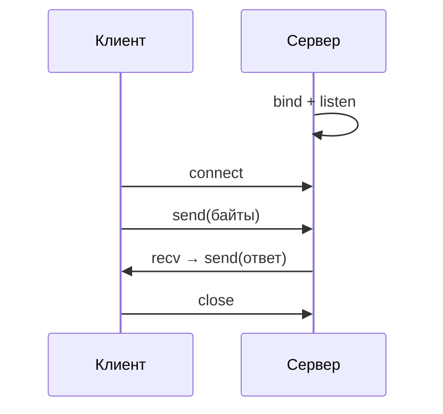

# Сетевое программирование на Python

<div class="article-tags">
  <span class="tag tag-required">ОБЯЗАТЕЛЬНО</span>
  <span class="tag tag-beginner">ДЛЯ НОВИЧКОВ</span>
</div>

<span class="complexity-badge">Разработчику</span>
<span class="complexity-badge">Архитектору</span>

См. также: [Работа с файлами, сетью и внешними API](./31.md) · [Асинхронность и многопоточность](./29.md) · [раздел "Сети"](/encyclopedia/2-system-network/2-01-operatsionnaya-sistema/intro)

---

## Зачем учить сокеты, если есть requests и FastAPI

В повседневной работе Python-разработчик чаще пишет `requests.get(...)` или поднимает API на **FastAPI** — см. [главу про файлы, сеть и API](./31.md).

Под капотом и `requests`, и браузер, и Uvicorn используют **сокеты** — интерфейс ОС для обмена **байтами** по сети.

Понимание сокетов помогает:

- разбираться в "connection refused", timeout, "broken pipe";
- писать свои протоколы (чат, игра, IoT);
- читать сетевую документацию без ощущения "магии библиотеки".

Модуль **`socket`** — в стандартной библиотеке Python.

---

## Слои — от приложения до провода

```
Ваш код (HTTP, JSON, свой протокол)
        ↓
HTTP / WebSocket / TLS
        ↓
TCP или UDP
        ↓
IP (127.0.0.1, 192.168…)
        ↓
Сетевой интерфейс
```

**HTTP** — правила текста поверх TCP. **Сокет** — уровень ниже: "отправь эти байты на порт".

---

## Словарь

| Термин | Простыми словами |
|--------|------------------|
| **IP-адрес** | "Номер" машины в сети, например `127.0.0.1` (localhost) |
| **Порт** | Номер службы на машине: 80/443 — веб, учебник — 50007 |
| **TCP** | Надёжный поток байтов |
| **UDP** | Пакеты без гарантии доставки |
| **Клиент** | Вызывает `connect` |
| **Сервер** | `bind` + `listen` + `accept` |
| **Сокет** | Канал для `send` / `recv` |

---

## Модель клиент–сервер



Сокеты работают с **байтами** (`b"текст"`), не со строками. Кодировку (UTF-8) выбирает ваш код.

---

## TCP — эхо-сервер — разбор построчно

```python
import socket

HOST = "127.0.0.1"
PORT = 50007

with socket.socket(socket.AF_INET, socket.SOCK_STREAM) as server:
    server.setsockopt(socket.SOL_SOCKET, socket.SO_REUSEADDR, 1)
    server.bind((HOST, PORT))
    server.listen(1)
    conn, addr = server.accept()
    with conn:
        print("Подключение:", addr)
        while True:
            data = conn.recv(1024)
            if not data:
                break
            conn.sendall(data)
```

| Строка | Смысл |
|--------|--------|
| `AF_INET` | IPv4 |
| `SOCK_STREAM` | TCP |
| `SO_REUSEADDR` | Быстрее перезапуск после остановки |
| `bind` / `listen` | Занять порт и ждать |
| `accept()` | Ждать клиента |
| `recv(1024)` | До 1024 байт за вызов |
| `if not data` | Клиент закрыл соединение |
| `sendall` | Отправить все байты |

Клиент:

```python
import socket

with socket.socket(socket.AF_INET, socket.SOCK_STREAM) as client:
    client.connect(("127.0.0.1", 50007))
    client.sendall(b"ping")
    print(client.recv(1024))
```

Длинные сообщения читают в **цикле** или по заголовку с длиной.

---

## UDP

```python
import socket

sock = socket.socket(socket.AF_INET, socket.SOCK_DGRAM)
sock.sendto(b"hello", ("127.0.0.1", 50008))
data, addr = sock.recvfrom(1024)
sock.close()
```

`sendto` / `recvfrom` — без долгой сессии, как у TCP.

---

## Несколько клиентов

| Подход | Когда |
|--------|--------|
| Поток на соединение | Мало клиентов, простая логика |
| `asyncio` | Много I/O |
| Nginx + Uvicorn | Продакшен HTTP |

```python
import threading

def handle(conn):
    with conn:
        while True:
            chunk = conn.recv(4096)
            if not chunk:
                break
            conn.sendall(chunk)
```

---

## asyncio

```python
import asyncio

async def tcp_echo_client():
    reader, writer = await asyncio.open_connection("127.0.0.1", 50007)
    writer.write(b"async ping\n")
    await writer.drain()
    data = await reader.read(100)
    print(data.decode())
    writer.close()
    await writer.wait_closed()

asyncio.run(tcp_echo_client())
```

---

## Связь с HTTP

HTTP-запрос — текст в TCP-потоке. **requests** открывает сокет, при HTTPS добавляет **TLS**.

| Настройка | Уровень |
|-----------|---------|
| `timeout` | Ожидание байтов на сокете |
| Keep-Alive | Один TCP на несколько запросов |

В проектах HTTP отдают WSGI/ASGI — [веб и API](./34.md).

---

## Ошибки и безопасность

| Ситуация | Поведение |
|----------|-----------|
| Порт занят | `Address already in use` |
| Сервер выключен | `Connection refused` |
| Разрыв | `recv` → `b""` |
| Таймаут | `settimeout` → `TimeoutError` |

На байтах из сети не вызывайте `eval` / `pickle` от незнакомых клиентов. Лучше JSON + длина сообщения.

---

## Когда что выбирать

| Задача | Инструмент |
|--------|------------|
| REST, веб | requests, Flask, FastAPI, Django |
| Двусторонний канал | WebSocket |
| Мелкие пакеты, потеря допустима | UDP |
| Учебный разбор транспорта | `socket`, asyncio |

---

## Связанные материалы

- [Работа с файлами, сетью и внешними API](./31.md)
- [Асинхронность и многопоточность в Python](./29.md)
- [FastAPI](./3431.md)

---
---

<!-- http-basics-link -->
:::tip Основа по протоколу
Базовый разбор HTTP и HTTPS находится в отдельной статье — [HTTP как основа веб-интеграций](/encyclopedia/2-system-network/2-09-osnovy-integratsionnogo-vzaimodeystviya/118).
:::

