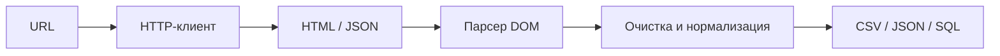
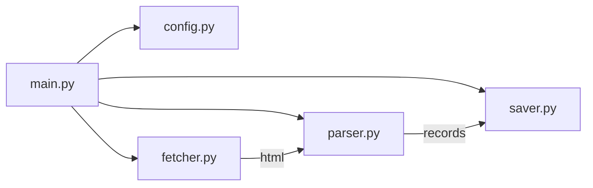
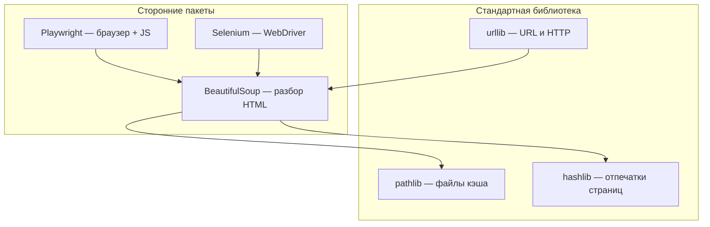
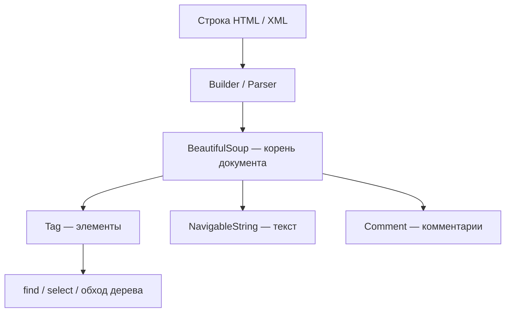
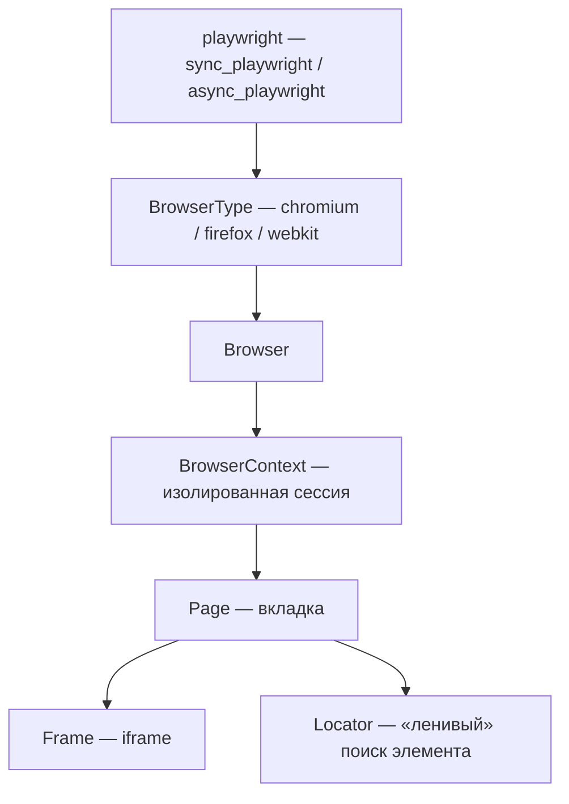
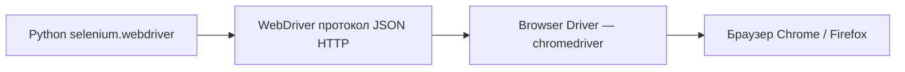

import ExternalCodeEmbed from '@site/src/components/ExternalCodeEmbed';


# Парсинг на Python

<div class="article-tags">
  <span class="tag tag-required">ОБЯЗАТЕЛЬНО</span>
  <span class="tag tag-beginner">ДЛЯ НОВИЧКОВ</span>
</div>

<span class="complexity-badge">Разработчику</span>
<span class="complexity-badge">Архитектору</span>

> Парсинг - это синтаксический разбор любого текста или кода. А веб-парсинг - это узкоспециализированный процесс работы с веб-сайтами.

Слово происходит от английского to parse — «разбирать по частям». Это процесс, когда программа берет сырой текст и превращает его в структурированные данные по определенным правилам. Превращение строки текста `{"name": "Иван", "age": 25}` в полноценный объект базы данных, где программа четко понимает, где имя, а где возраст. Это называется JSON-парсинг.

**Веб-парсинг** (web scraping, иногда говорят «скрапинг» или «скрейпинг») — автоматизированное извлечение данных с веб-ресурсов - страниц, каталогов, лент новостей, маркетплейсов, государственных реестров. На Python это одно из самых популярных прикладных направлений, ведь язык сочетает читаемый синтаксис, богатую экосистему HTTP-клиентов и HTML-парсеров, удобную работу с CSV, JSON и базами данных.

Технически, скрейпинг — это процесс скачивания страниц сайта целиком, а веб-парсинг — это выделение конкретных полезных данных из этих скачанных страниц. Однако в рунете термины «парсинг сайтов», «веб-парсинг» и «веб-скрейпинг» почти всегда используют как полные синонимы.

Программа заходит на сайт, скачивает HTML-код страницы, а затем с помощью обычного парсинга вытаскивает оттуда нужные теги (например, цены товаров, артикулы или отзывы).

Пример применения - автоматический сбор цен на смартфоны с сайта конкурента каждый час для коррекции собственных цен в интернет-магазине.

Эта статья — **единый путеводитель**: от [настройки окружения](#с-чего-начать-окружение-и-минимальный-стек) и [поиска селекторов в DevTools](#как-найти-селектор-в-devtools) до Playwright, Selenium, [структуры проекта](#структура-парсера-и-пайплайн-etl), дельта-парсинга и юридических ограничений. Крупный блок — [архитектура инструментов](#архитектура-инструментов-парсера): `urllib`, `pathlib`, `hashlib`, BeautifulSoup, Playwright и Selenium (модули, классы, методы). Для углублённой работы только с BeautifulSoup см. отдельную [главу про BeautifulSoup](./317.md); здесь — полный контекст вокруг парсинга.

---

## Что такое веб-парсинг и где он применяется

Структурированный текст жестко стандартизирован и сразу готов к анализу. Полуструктурированный содержит маркеры разделения, но не имеет фиксированной таблицы. Неструктурированный — это свободный человеческий язык, который машине сложнее всего понять без нейросетей.

**Парсинг** в широком смысле — разбор структурированного или полуструктурированного текста в удобную для программы форму. **Веб-парсинг** сужает задачу до данных, доступных через HTTP(S): HTML-страницы, XML-ленты, иногда — ответы JSON, которые браузер получает «за кулисами».

Парсинг веб-страниц — это превращение полуструктурированного HTML-кода сайта в структурированную таблицу Excel, например. Ваша программа имитирует браузер и запрашивает страницу у сервера, а сервер возвращает сырой, длинный HTML-код страницы. Специальная библиотека выполняет разбор (как раз-таки парсинг) - находит в этом коде нужные теги (например, `<span class="price">`) и забирает из них чистый текст.

Типичные сценарии:

| Область | Пример задачи |
|---------|---------------|
| Аналитика рынка | Сбор цен конкурентов, наличие товаров, история изменений |
| Мониторинг | Отслеживание новостей, вакансий, тендеров, изменений на сайте |
| Исследования | Агрегация открытых данных для отчётов и дашбордов |
| ML и NLP | Корпус текстов для обучения моделей (с соблюдением лицензий) |
| Внутренние инструменты | Миграция контента, инвентаризация ссылок, SEO-аудит |
| Тестирование | Проверка, что публичные страницы отдают ожидаемые данные |

Парсинг **не заменяет** полноценную интеграцию через API, если владелец ресурса предоставляет стабильный интерфейс. Но когда API нет, закрыт или дорог, а данные **публично отображаются** в HTML — парсинг остаётся рабочим инженерным инструментом.

Цепочка «от URL до таблицы в Python» выглядит так:



Вручную это выглядит так: открыть страницу → «Просмотр кода» (Ctrl+U) → найти нужный текст в HTML → скопировать в таблицу. Парсер **автоматизирует** тот же цикл: запрос → HTML → поиск по структуре → извлечение. Главное отличие от копипаста — **предсказуемость**: скрипт каждый раз ищет одни и те же теги и атрибуты.

Для решения этой задачи в экосистеме Python есть три основных инструмента, каждый из которых подходит под свой тип сайтов:
1. Requests + BeautifulSoup. Идеальная связка для статических сайтов. Requests быстро скачивает страницу, а BeautifulSoup парсит HTML. Работает молниеносно, но не умеет исполнять JavaScript.
2. Selenium / Playwright. Инструменты автоматизации браузеров для динамических сайтов (SPA). Если контент на сайте подгружается через JavaScript при прокрутке страницы или кликах, эти библиотеки запустят реальный браузер и дождутся появления данных.
3. Scrapy. Мощный, профессиональный фреймворк для масштабного парсинга. Подходит, если вам нужно скачать миллионы страниц, настроить многопоточность, очереди и авто-сохранение в базу данных.

---

## С чего начать?

Перед первым скриптом создайте **изолированное окружение** — так зависимости парсера не конфликтуют с другими проектами. Подробнее — [зависимости и venv](./39.md).

```bash
python -m venv venv
# Windows:
venv\Scripts\activate
# macOS / Linux:
source venv/bin/activate

pip install requests beautifulsoup4 lxml
```

| Пакет | Зачем |
|-------|-------|
| `requests` | HTTP-запросы, сессии, cookies |
| `beautifulsoup4` | Разбор HTML в дерево объектов |
| `lxml` | Быстрый парсер для BeautifulSoup |


Создадим файл `check.py` и добавим туда следующий код для проверки установки, затем запустим:

```python
import requests
from bs4 import BeautifulSoup
import lxml

print("requests:", requests.__version__)
print("bs4:", BeautifulSoup.__module__)
print("lxml:", lxml.__version__)
```

Вывод должен быть таким:
```python
requests: 2.33.1
bs4: bs4
lxml: 6.1.0
```

По мере роста задачи добавляют `httpx` или `aiohttp` (асинхронность), `playwright` или `selenium` (JS-сайты), `pandas` (анализ). Фиксируйте версии в `requirements.txt`.

---

## Тренировка с примером парсинга

### Общий код и пример парсинг-программы

Давайте сделаем простую парсинг-программу, которая будет автоматически собирать и выводить в консоль структурированный список основных разделов и найденных внутренних ссылок с главной страницы сайта `spirzen.ru`. Это базовый пример веб-парсинга для извлечения информации из HTML-кода страницы.

```python
import requests
from bs4 import BeautifulSoup

# 1. Отправляем запрос
headers = {"User-Agent": "Mozilla/5.0 (Windows NT 10.0; Win64; x64) Chrome/120.0.0.0"}
url = "https://spirzen.ru"
response = requests.get(url, headers=headers)

print(f"Статус ответа: {response.status_code}")  # Должно быть 200

# 2. Парсим HTML
soup = BeautifulSoup(response.text, "html.parser")

# 3. Ищем все ссылки на разделы (они находятся в секции "Форматы контента")
#    На сайте ссылки выглядят как <a href="/encyclopedia">Изучить раздел</a>
sections = {
    "Энциклопедия": "/encyclopedia",
    "Инструменты": "/tools", 
    "Глоссарий": "/glossary",
    "Лаборатория": "/lab",
    "Контекст": "/context",
    "Философия": "/philosophy"
}

print("=== ФОРМАТЫ КОНТЕНТА ===\n")
for name, path in sections.items():
    full_url = url + path
    print(f"{name}: {full_url}")

# 4. Собираем все ссылки на статьи с главной страницы
print("\n=== ССЫЛКИ НА СТАТЬИ (из раздела 'С чего начать?') ===\n")

# Находим все ссылки в блоке "С чего начать?"
# Ищем секцию с подборками
start_section = soup.find("section", class_="start") or soup.find("div", id="start")

# Более простой способ: найти все ссылки, которые ведут на подстраницы
all_links = soup.find_all("a", href=True)

# Фильтруем ссылки на статьи (обычно они ведут на /article/ или похожие)
article_links = []
for link in all_links:
    href = link.get("href")
    text = link.text.strip()
    
    # Исключаем ссылки на главную, внешние и пустые
    if (href and href.startswith("/") and 
        href != "/" and 
        not href.startswith("/category") and
        not href.startswith("/tag") and
        text and 
        len(text) > 3):  # Отсеиваем короткие надписи типа "→"
        
        # Убираем дубликаты по href
        if href not in [x[1] for x in article_links]:
            article_links.append((text, href))

print(f"Найдено уникальных ссылок: {len(article_links)}\n")

# Показываем первые 15 ссылок
for text, href in article_links[:15]:
    print(f"• {text}")
    print(f"  → {url}{href}\n")
```

Разберём по блокам.

---

### Импорт библиотек, и настройка запроса

Первое, что мы видим - это блок импорта библиотек и настройку запроса:
```python
import requests
from bs4 import BeautifulSoup

headers = {"User-Agent": "Mozilla/5.0 (Windows NT 10.0; Win64; x64) Chrome/120.0.0.0"}
url = "https://spirzen.ru"
response = requests.get(url, headers=headers)
print(f"Статус ответа: {response.status_code}")
```

Здесь мы:
- импортируем библиотеку `requests`, которая используется для отправки HTTP-запросов на сервер - чтобы скачать HTML-код страницы.
- импортируем библиотеку `BeautifulSoup` (из пакета `bs4`). Это основной инструмент для разбора (парсинга) HTML-кода. Она превращает сырой HTML в удобный объект с деревом тегов, который можно легко искать и навигировать.
- `headers = {...}` создаёт словарь с заголовками HTTP-запроса. Ключевой элемент – `"User-Agent"`. Он имитирует запрос от обычного браузера Chrome, чтобы сайт не заблокировал наш скрипт как бота.
- `requests.get(url, headers=headers)` отправляет GET-запрос на указанный URL с нашими заголовками. Сервер возвращает ответ, который сохраняется в переменную response.
- `print(f"Статус ответа: {response.status_code}")` выводит HTTP-статус ответа. Код `200` означает успех. Это важно для отладки.

---

### Создание объекта BeautifulSoup

```python
soup = BeautifulSoup(response.text, "html.parser")
```

`BeautifulSoup(response.text, "html.parser")` передает скачанный HTML-код (`response.text`) в конструктор BeautifulSoup. Второй аргумент `"html.parser"` указывает, какой встроенный парсер использовать для анализа HTML. Теперь переменная `soup` содержит структурированное представление всей веб-страницы.

---

### Формирование и вывод списка разделов (статический подход)

```python
sections = {
    "Энциклопедия": "/encyclopedia",
    "Инструменты": "/tools",
    # ... и так далее
}
print("=== ФОРМАТЫ КОНТЕНТА ===\n")
for name, path in sections.items():
    full_url = url + path
    print(f"{name}: {full_url}")
```

Здесь создается вручную составленный словарь, который не парсится со страницы, а задан программистом на основе заранее известной структуры сайта (из предыдущего анализа или из текста страницы в условии). Цикл проходит по элементам словаря, склеивает базовый URL с путем и выводит полную ссылку для каждого раздела.

---

### Динамический сбор ссылок на статьи (основной парсинг)

```python
all_links = soup.find_all("a", href=True)
```

`soup.find_all("a", href=True)` — ключевой метод. Он находит все (`find_all`) HTML-теги `<a>` (ссылки) на всей странице, у которых есть атрибут `href`. Результат — список всех ссылок на странице.

---

### Фильтрация и очистка найденных ссылок

```python
article_links = []
for link in all_links:
    href = link.get("href")
    text = link.text.strip()
    
    if (href and href.startswith("/") and 
        href != "/" and 
        not href.startswith("/category") and
        not href.startswith("/tag") and
        text and 
        len(text) > 3):
        
        if href not in [x[1] for x in article_links]:
            article_links.append((text, href))
```

Это сердце скрипта. Здесь происходит фильтрация сырых данных. Для каждой найденной ссылки:
1. Извлекается адрес (`href`) и текст ссылки (то, что видит пользователь).
2. Текст очищается от лишних пробелов (`.strip()`).
3. Проверяются условия, чтобы оставить только нужные ссылки:
- `href and href.startswith("/")`: ссылка должна существовать и начинаться с `/` (то есть быть внутренней ссылкой сайта).
- `href != "/"`: исключаем ссылку на саму главную страницу.
- `not href.startswith("/category") and not href.startswith("/tag")`: исключаем служебные ссылки на категории и теги, чтобы не засорять результат.
- `text and len(text) > 3`: ссылка должна иметь текст длиннее 3 символов, чтобы отсечь иконки, стрелки (например, "`→`") и пустые ссылки.
4. `if href not in [x[1] for x in article_links]`: Проверка на уникальность. Если ссылка с таким `href` еще не добавлена в список, то добавляем. `[x[1] for x in article_links]` — это генератор списка, который создает список из всех уже добавленных адресов.
5. В список `article_links` добавляется кортеж (`text`, `href`), чтобы сохранить и текст ссылки, и ее адрес.

---

### Вывод результатов

```python
print(f"Найдено уникальных ссылок: {len(article_links)}\n")
for text, href in article_links[:15]:
    print(f"• {text}")
    print(f"  → {url}{href}\n")
```

Выводится общее количество найденных уникальных ссылок - в цикле выводятся первые 15 (`article_links[:15]`), чтобы не захламлять консоль. Для каждой выводится ее текст и полный URL.

---

## База: HTTP, веб-страницы, HTML и DOM

### User-Agent

`User-Agent` — это специальная текстовая строка, которую ваш браузер (или любая другая программа) автоматически отправляет веб-серверу при каждом запросе страницы. Посмотрев на эту строку, сервер сразу понимает, с какого устройства, операционной системы и браузера к нему пришли. 

Обычный `User-Agent` от браузера Google Chrome на Windows выглядит так: `Mozilla/5.0 (Windows NT 10.0; Win64; x64) AppleWebKit/537.36 (KHTML, like Gecko) Chrome/120.0.0.0 Safari/537.36`.

А вот так выглядит `User-Agent` по умолчанию у библиотеки `requests` в Python, если его не изменить вручную:`python-requests/2.31.0`.

Сервер сразу видит «честную» визитку скрипта (`python-requests`, Scrapy или Java). Для систем защиты сайта это сигнал: «Внимание, это не человек, это автоматический робот!». Владельцы сайтов настраивают системы защиты (WAF, Cloudflare) и блокируют такие запросы по нескольким причинам:
- Экономия серверных ресурсов. Обычный человек открывает 1 страницу за 5–10 секунд. Скрипт может отправлять сотни запросов в секунду. Если на сайт придет десяток таких парсеров, они просто перегрузят процессор и базу данных сервера, из-за чего сайт «упадет» для реальных покупателей.
- Защита коммерческих данных. Интернет-магазины не хотят, чтобы конкуренты автоматически скачивали их базу цен каждый час для демпинга. Агрегаторы авиабилетов или недвижимости защищают свои уникальные данные, за сбор которых они сами заплатили немалые деньги.
- Борьба с хакерами и спамом. Многие роботы в сети ищут уязвимости на сайтах, пытаются подобрать пароли (брутфорс) или оставлять спам-комментарии. Блокировка всех подозрительных User-Agent — это самый базовый, «первый рубеж» обороны сайта.

Если вы просто скопируете строку User-Agent от Chrome в свой Python-скрипт, защита сайта все равно может вас заблокировать. Роботов выдают другие поведенческие и технические факторы:
- Аномальная скорость: Человек физически не может кликнуть по 50 ссылкам за одну секунду.
- Идеальная стабильность: Запросы идут строго каждые 500 миллисекунд в течение трех часов. Люди так не делают.
- Сетевой адрес (IP): Большинство скриптов запускаются на серверах в дата-центрах (Amazon, DigitalOcean, Hetzner). Защита сайта знает пулы этих IP-адресов и блокирует их, так как обычные люди сидят через домашних провайдеров или мобильный интернет.
- Отсутствие куки (Cookies) и JavaScript: Обычный браузер сохраняет файлы куки и умеет выполнять сложный JS-код (например, проверку капчи). Простой скрипт на Requests этого делать не умеет.

---

### Основы HTML, HTTP и DOM

Прежде чем писать скрипт, полезно понимать, **что именно** вы скачиваете и **как браузер** это интерпретирует.

| Тема | Где читать в энциклопедии |
|------|----------------------------|
| **HTTP** — методы, заголовки, коды ответа, cookies | [HTTP как основа веб-интеграций](/encyclopedia/2-system-network/2-09-osnovy-integratsionnogo-vzaimodeystviya/118), [HTTP и HTTPS](/encyclopedia/2-system-network/2-03-set-i-internet/11) |
| **Веб-страницы** — клиент, сервер, статика и динамика | [Сайты и веб-сайты](/encyclopedia/2-system-network/2-04-kak-rabotayut-sayty-i-veb-sayty/1), [раздел «Веб-сайты и веб-приложения»](/encyclopedia/2-system-network/2-04-kak-rabotayut-sayty-i-veb-sayty/intro) |
| **HTML** — теги, атрибуты, формы, ссылки | [HTML](/encyclopedia/3-data-markup/3-09-html/1), [раздел HTML](/encyclopedia/3-data-markup/3-09-html/intro) |
| **DOM** — дерево узлов документа | [DOM-дерево](/encyclopedia/3-data-markup/3-09-html/1#dom-derevo) |

Кратко для парсера:

1. **HTTP-запрос** (`GET`, реже `POST`) уходит на сервер с заголовками (`User-Agent`, `Accept`, `Cookie`…).
2. **Ответ** содержит статус (`200`, `404`, `429`…), заголовки и **тело** — чаще всего HTML-текст.
3. Браузер (или библиотека) **разбирает** HTML в **DOM** — иерархию узлов: `html` → `body` → `div` → `a` с атрибутом `href`.
4. **BeautifulSoup**, **lxml** и CSS-селекторы в Playwright работают с этой же логикой дерева, только вне полноценного рендеринга страницы.

<div class="callout callout--tip">
  <div class="callout-title">Основа по протоколу</div>

  <div class="callout-body">
  Базовый разбор HTTP и HTTPS находится в отдельной статье — <a href="/encyclopedia/2-system-network/2-09-osnovy-integratsionnogo-vzaimodeystviya/118">HTTP как основа веб-интеграций</a>.
  </div>
</div>

Любой разработчик парсеров сталкивается с ошибками, которые означают, что система защиты сайта зафиксировала подозрительную активность и заблокировала вашему скрипту доступ.
1. Ошибка 429: Too Many Requests (Слишком много запросов). Эта ошибка — автоматическое предупреждение от сервера: «Вы шлете запросы слишком быстро, притормозите!». На сервере срабатывает ограничение скорости — Rate Limiting. Например, администратор сайта установил правило: «Не более 10 запросов в минуту с одного IP-адреса». Обычный человек это ограничение никогда не превысит, а ваш скрипт на Python может сделать 10 запросов за долю секунды.
2. Ошибка 403: Forbidden (Доступ запрещен). Эта ошибка гораздо серьезнее. Сервер говорит: «Я понял, кто вы, и я сознательно запрещаю вам вход». Если 429 ошибку выдает сам сайт, то 403 ошибку при парсинге чаще всего выставляет профессиональная система защиты (например, Cloudflare, DDoS-Guard или Kasada), которая стоит перед сайтом. Она проанализировала ваш запрос и сразу поняла, что вы — бот, даже если вы подменили `User-Agent`. Робота выдает отсутствие правильных заголовков, TLS-отпечаток (JA3) или то, что ваш IP-адрес принадлежит хостинг-провайдеру (дата-центру), а не домашнему интернету.

---

### Как исправить 429 и 403 в коде

Чтобы исправить ошибку 429 Too Many Requests, можно использовать два варианта:
1. Добавить паузы (таймауты). Самый простой способ — использовать модуль `time` и делать случайные паузы между запросами, имитируя поведение человека.
```python
import time
import random

# Пауза от 2 до 5 секунд перед каждым следующим запросом
time.sleep(random.uniform(2, 5))
```
2. Использовать пул прокси-серверов. Если вам нужно собрать миллион страниц и ждать по 3 секунды некогда, нужно распределить запросы. Вы покупаете список прокси и отправляете каждый следующий запрос с нового IP-адреса. Для сервера это выглядит так, будто пришли разные люди.

С 403 сложнее. Обычная библиотека `requests` против серьезной `403` ошибки бессильна. Приходится менять инструменты:
- Перейти на умные библиотеки (замена Requests). Использовать библиотеки вроде `curl_cffi` или `cloudscraper`. Они умеют имитировать TLS-отпечаток реального браузера (Chrome/Firefox) на сетевом уровне, обманывая защиту Cloudflare.
- Использовать автоматизацию браузера. Переписать парсер на Playwright или Selenium с плагином Undetected Chromedriver. В этом случае запускается настоящий браузер, который проходит стандартные проверки безопасности «на лету».
- Резидентские прокси (Residential Proxies). Использовать прокси-серверы, которые используют IP-адреса обычных домашних провайдеров (Ростелеком, Билайн и т.д.). Для защиты такой запрос выглядит максимально легитимно.

---

## Как найти селектор в DevTools

Прежде чем писать `soup.select()`, найдите элемент **в браузере** — так вы убедитесь, что данные вообще есть в HTML (или понимаете, что нужен headless-браузер).

> Headless-браузер (дословно «безголовый» браузер) — это обычный современный браузер (например, Chrome или Firefox), но запущенный в специальном режиме, у которого отключено графическое окно. Он делает абсолютно всё то же самое, что и ваш привычный браузер: загружает картинки, выполняет сложный JavaScript-код, переходит по ссылкам и строит DOM-дерево сайта. Однако он делает это исключительно в оперативной памяти компьютера, не выводя окно на экран.

Headless-браузер нужен для:
- экономии ресурсов. Отрисовка графического интерфейса, анимаций и кнопок на экране требует много ресурсов процессора и видеокарты. Без графики браузер работает в разы быстрее и потребляет меньше памяти.
- работы на сервере. Профессиональные парсеры работают на удаленных серверах (VPS/VDS) под управлением Linux, где в принципе нет монитора и графической оболочки (только консоль). Обычный браузер там просто не запустится, а headless — без проблем.

Популярные библиотеки для управления такими браузерами на Python — это Playwright и Selenium.

Когда вы отправляете обычный запрос через `requests.get()` и пытаетесь найти элемент через `soup.select()`, вы можете обнаружить, что код возвращает пустой список. Это происходит по трем главным причинам:
1. Контент генерируется через JavaScript (SPA-сайты). Современные сайты часто пишутся на фреймворках (React, Vue, Angular). Когда вы запрашиваете страницу, сервер присылает практически пустой HTML-каркас, внутри которого лежит огромный JS-скрипт.
- `requests` получает пустой шаблон (например, `<div id="app"></div>`). Данных внутри еще нет.
- а браузер скачивает шаблон, автоматически выполняет JS-скрипт, скрипт делает фоновый запрос к базе данных сайта и «на лету» отрисовывает карточки товаров внутри этого блока.
2. Динамическая (ленивая) загрузка (Lazy Loading). Многие сайты оптимизируют скорость работы: они не загружают комментарии, отзывы, цены или картинки до тех пор, пока пользователь не докрутит страницу до нужного места (скроллинг) или не нажмет кнопку «Показать больше». Обычный `requests` просто скачивает верхушку страницы, а все остальное остается незагруженным.
3. Сайт отдал вам страницу с ошибкой (например, капчу). Вы думаете, что парсите страницу товара, а система защиты сайта (например, Cloudflare) заблокировала ваш скрипт на сетевом уровне и отдала вместо товара страницу с текстом «Подтвердите, что вы человек» или ошибку `403`. Естественно, никаких CSS-селекторов вашего товара в этом коде не будет.

### Пошагово

1. Откройте страницу → **F12** (или Ctrl + Shift + I), чтобы открыть инструменты разработчика..
2. Вкладка **Elements** — клик по иконке «выбрать элемент» → наведите на заголовок, цену или карточку.
3. ПКМ по подсвеченному тегу → **Copy** → **Copy selector** (или скопируйте `class` / `id` вручную).
4. Вкладка **Console** — проверьте селектор:

```javascript
// первый элемент
document.querySelector("article.news h2 a").innerText

// все совпадения
document.querySelectorAll("article.news")
```

| API в браузере | Аналог в BeautifulSoup |
|----------------|------------------------|
| `querySelector("css")` | `soup.select_one("css")` |
| `querySelectorAll("css")` | `soup.select("css")` |

**XPath** (`//h2[@class='title']/a`) — альтернатива CSS; в Selenium и Playwright тоже поддерживается, в BeautifulSoup чаще используют CSS.

<div class="callout callout--tip">
  <div class="callout-title">Статика или динамика?</div>

  <div class="callout-body">
  Если селектор работает в Console после полной загрузки, но в «Просмотре кода» (Ctrl+U) элемента нет — страница <strong>динамическая</strong>, нужен Playwright/Selenium или прямой вызов API из вкладки Network.
  </div>
</div>

Совет: привязывайте селектор к **семантике** (`article`, `data-id`, роль блока), а не к случайным классам вроде `css-1x2y3z`.

Как проверить, нужен ли вам Headless-браузер?

Провести тест можно за 10 секунд прямо в вашем обычном браузере (Chrome / Яндекс.Браузер / Firefox):
1. Откройте нужный сайт и перейдите в инструменты разработчика.
2. Перейдите во вкладку Network (Сеть).
3. Обновите страницу (F5).
4. Найдите в самом верху списка самый первый запрос (он обычно называется так же, как сам сайт) и кликните на него.
5. Перейдите во вкладку Response (Ответ).

Если в этой вкладке вы видите текст товара/цены — значит, сайт статический. Использовать headless-браузер не нужно, хватит связки Requests + BeautifulSoup.

Если там сплошные скрипты, а нужных вам данных нет (хотя на экране компьютера вы их видите) — сайт динамический. Вам строго необходим Playwright или Selenium в headless-режиме, чтобы дождаться выполнения скриптов.


---

## Статика и динамика: как получить данные с сайта

Как мы определили, не все страницы одинаково «видны» простому `requests.get()`.

> `requests.get()` — это команда на языке Python, которая делает ровно то же самое, что и вы, когда вводите адрес сайта в строку браузера и нажимаете Enter. Она отправляет серверу сетевой запрос типа `GET` (от английского to get — «получить») с просьбой: «Сервер, пожалуйста, дай мне содержимое этой страницы».

Вот классический пример:

```python
import requests

# Отправляем запрос и сохраняем всё, что ответил сервер, в переменную 'response'
response = requests.get('https://example.com')

# Выводим цифровой код ответа (200 означает "Всё прошло успешно")
print(response.status_code)  

# Выводим сырой HTML-код страницы, который мы потом отдадим в BeautifulSoup
print(response.text)  
```

В реальном парсинге обычный requests.get(url) используют редко, потому что (как мы разобрали ранее) серверы сразу блокируют роботов. В функцию передают дополнительные настройки:
- headers (Заголовки). Сюда передают тот самый User-Agent, чтобы притвориться человеком в браузере.
```python
my_headers = {'User-Agent': 'Mozilla/5.0 (Windows NT 10.0; Win64; x64) Chrome/120.0.0.0'}
response = requests.get('https://example.com', headers=my_headers)
```
- params (Параметры ссылки). Вместо того чтобы вручную лепить длинную ссылку с кучей фильтров, можно передать их в виде понятного словаря.
```python
# Вместо ссылки https://site.com
my_params = {'query': 'iphone', 'page': 2}
response = requests.get('https://site.com', params=my_params)
```
- proxies (Прокси-серверы). Перенаправляет запрос через другой IP-адрес, чтобы избежать блокировок по IP.
```python
my_proxies = {'http': 'http://10.10.1.10:3128'}
response = requests.get('https://example.com', proxies=my_proxies)
```

Главный минус `requests.get()` - эта функция работает по принципу «скачал и забыл». Она просто скачивает тот текст, который сервер отдал в первую долю секунды. Она не умеет нажимать кнопки на сайте, ждать, пока загрузится JavaScript, и прокручивать страницу вниз.

### Статический контент

**Статическая страница** — HTML, который сервер отдаёт **целиком** в первом ответе. Все нужные теги уже в `response.text`. 

Достаточно:
- `requests` или `httpx` — скачать;
- `BeautifulSoup` / `lxml` — разобрать;
- CSS-селекторы или `find` — извлечь поля.

```python
import requests
from bs4 import BeautifulSoup

resp = requests.get("https://httpbin.org/html", timeout=10)
resp.raise_for_status()

# Если кириллица «ломается» — подсказать кодировку
resp.encoding = resp.apparent_encoding or resp.encoding

soup = BeautifulSoup(resp.text, "lxml")
heading = soup.find("h1")
print(heading.get_text(strip=True) if heading else "")
print(f"Длина HTML: {len(resp.text)}")
```

Этот скрипт:
1. Загружает страницу:
- отправляет GET-запрос на сайт `httpbin.org/html`;
- `timeout=10` - устанавливает таймаут в 10 секунд, чтобы скрипт не завис, если сервер не отвечает.
- `resp.raise_for_status()` проверяет, успешно ли завершился запрос (статус-код 200). Если нет (например, 404 или 500), скрипт вызовет исключение и остановится.
2. Корректирует кодировку в `encoding` - это умный трюк для работы с текстом. Он пытается определить реальную кодировку страницы (например, UTF-8 или windows-1251) из самого HTML-кода (`apparent_encoding`). Если это не удается, оставляет кодировку, указанную в HTTP-заголовках (encoding). Это помогает правильно отображать кириллицу и другие символы.
3. Парсит HTML и ищет заголовок:
- Создает объект `BeautifulSoup` для разбора HTML-кода. Здесь используется парсер `lxml` — он быстрее и мощнее, чем встроенный `html.parser`.
- `soup.find("h1")` — ищет первый тег `<h1>` на странице. Это стандартный тег для главного заголовка.
4. Выводит результат:
- Если заголовок найден, метод `.get_text(strip=True)` извлекает его текстовое содержимое, убирая лишние пробелы и переносы строк, и выводит на экран.
- Если заголовка нет (условие `if heading else ""`), выводится пустая строка, чтобы избежать ошибки.
- Затем выводится общая длина загруженного HTML-кода в символах.

По сути, это минимальный, но правильный скелет для любого парсера, который можно использовать как основу для более сложных скриптов. Например, вместо `find("h1")` вы можете использовать `find_all("div", class_="product-card")`, чтобы собрать все карточки товаров с интернет-магазина.

Всегда задавайте **`timeout`** — без него скрипт может зависнуть навсегда. `raise_for_status()` превращает ответы 4xx/5xx в исключение, а не «тихий» пустой результат.

### Динамический контент (JavaScript)

**Динамическая страница** подгружает данные **после** загрузки HTML: через `fetch`/XHR, WebSocket, бесконечную прокрутку. В «сыром» HTML от `requests` карточек товаров может **не быть** — только пустой `<div id="app"></div>`.

Три стратегии:

| Подход | Когда выбирать |
|--------|----------------|
| **Найти скрытый API** | В DevTools → Network виден JSON с теми же данными; быстрее и стабильнее DOM |
| **Headless-браузер** | Нужны клики, скролл, SPA без публичного API — Playwright, Selenium |
| **Готовый рендер-сервис** | Редко; обычно избыточен для учебных проектов |

Признаки динамики: пустой контейнер в View Source, но данные есть во вкладке Elements после загрузки; в Network — запросы к `/api/...` с JSON.

---

## Работа с HTML-разметкой: поиск элементов и обход дерева

**BeautifulSoup** строит дерево объектов из HTML-строки. Пакет: `beautifulsoup4`, импорт `from bs4 import BeautifulSoup`. Подробнее — [BeautifulSoup — парсинг HTML](./317.md).

### Поиск элементов

```python
from bs4 import BeautifulSoup

html = """
<article class="news" data-id="42">
  <h2><a href="/post/1">Заголовок</a></h2>
  <p class="lead">Краткое описание</p>
</article>
"""
soup = BeautifulSoup(html, "lxml")

# По имени тега
title_link = soup.find("a", href=True)

# По классу (class — зарезервированное слово в Python → class_)
lead = soup.find("p", class_="lead")

# CSS-селекторы — как в браузере
headline = soup.select_one("article.news h2 a")
all_news = soup.select("article.news")
```

Этот скрипт не отправляет запросы в интернет, а работает с образцом HTML, который записан прямо в коде:
1. В переменной `html` создаётся тестовый документ - просто многострочная строка, которая имитирует фрагмент веб-страницы;
2. Создаёт объект BeautifulSoup. Парсер превращает строку HTML в структурированное дерево объектов, которое можно искать и навигировать.
3. Демонстрирует три разных способа поиска:
- По имени тега (`soup.find("a", href=True)`). Находит первый тег `<a>` на странице, у которого есть атрибут `href`. Найдет ссылку внутри заголовка.
- По классу CSS (`soup.find("p", class_="lead")`). Находит первый тег `<p>` с классом `lead`. Обратите внимание на подчеркивание (`class_`) — это нужно, потому что `class` является зарезервированным словом в Python.
- По CSS-селектору (`soup.select_one("article.news h2 a")`). Находит первый элемент, который соответствует CSS-селектору. Селектор читается как: "найти тег `<a>`, который находится внутри `<h2>`, который находится внутри `<article>` с классом `news`". Это очень гибкий и мощный способ.
- По CSS-селектору (все - `soup.select("article.news")`). Находит все элементы, соответствующие селектору. Здесь найдет все теги `<article>` с классом `news`. Результат возвращается в виде списка.

Таким образом, вы видите методы поиска:
- `find()` - находит **первый** подходящий элемент.
- `select_one()` - находит **первый** элемент по CSS-селектору.
- `select()` - находит **все** элементы по CSS-селектору, возвращает список.


### Обход дерева

```python
article = soup.find("article")

# Родитель
parent = article.parent

# Прямые потомки
for child in article.children:
    if getattr(child, "name", None):
        print(child.name)

# Соседи
next_tag = article.find_next_sibling()

# Подъём и поиск внутри ветки
price = article.find("span", class_="price")
```

| Метод | Назначение |
|-------|------------|
| `find` / `find_all` | Тег + атрибуты, `class_`, `id` |
| `select` / `select_one` | CSS-селекторы |
| `.parent`, `.children` | Навигация по DOM |
| `find_next`, `find_all_next` | Поиск «вперёд» по документу |

Этот скрипт показывает, как перемещаться между элементами после того, как вы уже нашли нужный тег. В отличие от предыдущих примеров, здесь нет готового HTML для парсинга — предполагается, что переменная soup уже содержит загруженную страницу.
1. Находит первый элемент `<article>` на странице и сохраняет его в переменную. Это становится нашей "отправной точкой" для навигации.
2. Переходит к родительскому элементу - `.parent` возвращает родительский тег для найденного `<article>`. Например, если `<article>` лежит внутри `<div class="content">`, то parent будет ссылаться на этот `<div>`.
3. Обходит прямых потомков - `.children` — это итератор по всем непосредственным (первого уровня вложенности) дочерним элементам. Цикл проходит по ним и печатает их имена тегов (например, `h2`, `p`, `img`). `getattr(child, "name", None)` — это защита: у текстовых узлов (не тегов) нет атрибута name, поэтому проверка пропускает их, выводя только имена тегов.
4. Переходит к следующему соседнему элементу - `.find_next_sibling()` находит следующий тег на том же уровне вложенности (после нашего `<article>`). Например, если после `<article>` идет `<aside>`, то `next_tag` будет ссылаться на этот `<aside>`.
5. Ищет внутри найденной ветки - тег `<span>` с классом price только внутри нашего `<article>`, а не по всей странице. Это сужает область поиска и делает код надежнее.

Если на странице много одинаковых блоков, но вам нужен элемент только внутри конкретного, лучше сначала найти контейнер, а затем искать внутри него. 

Представьте, что у вас есть интернет-магазин:
```html
<div class="product-card">
    <h2 class="title">Ноутбук</h2>
    <div class="prices">
        <span class="old-price">1000$</span>
        <span class="price">799$</span>
    </div>
    <button>Купить</button>
</div>
```

Если вы хотите получить цену со скидкой, вам нужно:
1. Найти карточку товара: `card = soup.find("div", class_="product-card")`
2. Внутри нее найти цену: `price = card.find("span", class_="price")`

Использование `.parent` или `.find_next_sibling()` может понадобиться, если разметка сложнее, а нужный элемент не имеет уникального класса или находится не в том месте, где ожидалось.

---

## Извлечение данных: текст, ссылки, изображения, таблицы

Говоря простыми словами, если сам парсинг — это синтаксический разбор всего кода страницы, то извлечение — это вычленение из этого кода только нужных вам «кусочков» (например, только цен, названий товаров или номеров телефонов). Программа-парсер не просто копирует всё подряд, она действует по строго заданному алгоритму:
- Загрузка источника. Парсер скачивает веб-страницу или открывает файл.
- Анализ структуры. Код (например, HTML) преобразуется в дерево элементов (DOM).
- Поиск по маркерам. Программа ищет нужные данные по специальным адресам и меткам (тегам, классам, ID).
- Фильтрация и очистка. Из текста удаляется лишний «мусор» (HTML-теги, лишние пробелы, скрипты).
- Сохранение. Чистые данные записываются в таблицу Excel, CSV-файл или базу данных.

Селекторы XPath и CSS позволяют указать точный путь к элементу в коде страницы (например: «забери текст из третьего блока `<div>` с классом `product-price`»).

### Текст

```python
node = soup.select_one(".product-title")
title = node.get_text(strip=True, separator=" ") if node else ""
```

Этот скрипт проверяет, найден ли элемент, прежде чем пытаться получить из него данные:
- `soup.select_one()` находит первый элемент на странице, который соответствует CSS-селектору `.product-title`.
- селектор `.product-title `означает: "найти любой тег с классом `product-title`" (например, `<h2 class="product-title">` или `<div class="product-title">`).
- если элемент найден, он сохраняется в переменную `node`. Если нет — `node` получает значение `None`.
- далее мы видим тернарное выражение в `title` (условный оператор в одну строку) - можно прочитать так: "Если `node` существует (не равен `None`), то извлеки из него текст методом `.get_text()`. В противном случае присвой переменной `title` пустую строку".
- `.get_text()` имеет как параметры - `strip=True` убирает пробелы по краям; `separator` задаёт разделитель между фрагментами из вложенных тегов.

В BeautifulSoup есть два способа получить текст:
- `.text` — свойство, которое возвращает текст без дополнительной обработки.
- `.get_text()` — метод, который дает больше контроля через параметры.

Допустим, на странице есть такой HTML:
```html
<div class="product-title">
    <span>Супер</span>
    <span>Ноутбук</span>
    <span>Pro</span>
</div>
```

- `node.text` вернет: `"Супер\nНоутбук\nPro"`
- `node.get_text(strip=True, separator=" ")` вернет: `"Супер Ноутбук Pro"`

---

### Ссылки и абсолютные URL

Относительные `href="/catalog/item"` нужно превратить в полный URL:

```python
from urllib.parse import urljoin

base = "https://shop.example/catalog/"
for a in soup.select("a.product-link"):
    href = a.get("href")
    if href:
        full_url = urljoin(base, href)
        print(full_url)
```

Этот скрипт формирует абсолютные URL-адреса из относительных ссылок, найденных на веб-странице.
1. Импорт функции `urljoin` из стандартной библиотеки Python `urllib.parse`. Эта функция предназначена для объединения базового URL с относительным путем.
2. Определение базового URL - задаёт базовый адрес сайта (или раздела). Обычно это корневой URL сайта или URL текущей страницы, с которой вы собираете ссылки.
3. Поиск ссылок в `for` как раз находит все теги `<a>` с классом `product-link` на странице (с помощью CSS-селектора `a.product-link`). Это, например, ссылки на страницы товаров в интернет-магазине.
4. Извлечение и проверка адреса - извлекает значение атрибута `href` у каждой найденной ссылки. Если атрибут существует (не `None`), код продолжает работу.
5. Превращение относительной ссылки в абсолютную - главная операция. `urljoin(base, href)` объединяет базовый URL и относительную ссылку по правилам, описанным в спецификации URL. Результат — полный, рабочий адрес страницы.

На сайтах ссылки внутри HTML часто указываются как относительные, чтобы упростить код и облегчить перенос сайта между доменами. Относительные ссылки бывают двух типов:
- Относительная (от корня) - `/product/123`. Начинается со слеша. Вставляется после домена: `https://shop.example/product/123`;
- Относительная (от текущей папки) - `product/123` или `../product/123`. Не начинается со слеша. Объединяется с последней частью пути в `base`.

Если просто склеить строки (`base` + `href`), результат часто будет некорректным. `urljoin` делает это интеллектуально.

Пусть базовый URL: base = `"https://shop.example/catalog/"`

| href на странице | Результат `urljoin(base, href)` |
|------------------|--------------------------------|
| `/item/42` | `https://shop.example/item/42` |
| `item/42` | `https://shop.example/catalog/item/42` |
| `../product/42` | `https://shop.example/product/42` |
| `https://othershop.com/buy` | `https://othershop.com/buy` (абсолютный URL останется без изменений) |
| `#top` | `https://shop.example/catalog/#top` (якорь внутри страницы) |

**Пояснение поведения `urljoin`:**

*   **`/item/42`** — путь начинается с `/`, поэтому он считается абсолютным относительно домена (заменяет путь базы).
*   **`item/42`** — относительный путь, добавляется к текущему пути базы (`/catalog/`).
*   **`../product/42`** — `..` поднимает на уровень выше в иерархии пути, поэтому `/catalog/` заменяется на `/`.
*   **`https://othershop.com/buy`** — абсолютный URL с другим доменом возвращается как есть, база игнорируется.
*   **`#top`** — якорь (фрагмент), добавляется к текущему URL базы без изменения пути.

Это можно применять для сбора всех ссылок на товары/статьи, обхода всех страниц раздела, сбора изображений. Скрипт будет работать корректно, даже если ссылки указаны в любом формате. Всегда используйте `urljoin` при формировании адресов в парсерах. Это сэкономит вам много времени и нервов, особенно при парсинге больших сайтов с запутанной структурой ссылок.

---

### Изображения

```python
for img in soup.select("img[src]"):
    src = urljoin("https://shop.example", img["src"])
    alt = img.get("alt", "")
```

Этот скрипт демонстрирует, как находить изображения, формировать их полные URL-адреса и безопасно извлекать альтернативный текст.
1. Поиск всех изображений с атрибутом `src`:
- `soup.select("img[src]")` использует CSS-селектор для поиска всех тегов ``, у которых есть атрибут `src`.
- Синтаксис `img[src]` означает: "найти все теги `img`, у которых задан атрибут `src`". Это фильтрует изображения, у которых нет источника (например, пустые или сгенерированные JavaScript).
2. Формирование полного URL изображения:
- Для каждого найденного изображения берется значение атрибута `src` (путь к файлу) и объединяется с базовым URL сайта.
- Использование `urljoin` гарантирует, что даже если путь указан как `"/images/photo.jpg"` или `"photo.jpg"`, результат будет корректным абсолютным адресом.
3. Извлечение альтернативного текста с защитой:
- `img.get("alt", "")` — это безопасный способ извлечения атрибута `alt`.
- Если атрибут `alt` существует, возвращается его значение. Если нет — возвращается пустая строка (`""`), что предотвращает ошибку `KeyError`.

Атрибут `srcset` и lazy-loading (`data-src`) встречаются на современных сайтах — проверяйте оба.

Пример посложнее:

```python
from urllib.parse import urljoin
import requests
from bs4 import BeautifulSoup
from pathlib import Path
import time

base_url = "https://spirzen.ru"
page_url = "https://spirzen.ru/encyclopedia/2-system-network/2-01-operatsionnaya-sistema/1"
images_data = []

try:
    # Загружаем страницу
    response = requests.get(page_url, timeout=10)
    response.raise_for_status()
    
    # Парсим HTML
    soup = BeautifulSoup(response.text, "html.parser")
    
    print(f"Страница: {page_url}\n")
    print("=" * 60)
    
    # Находим все изображения
    for img in soup.select("img[src]"):
        # Получаем полный URL
        src = urljoin(base_url, img["src"])
        
        # Безопасно извлекаем атрибуты
        alt = img.get("alt", "Нет описания")
        title = img.get("title", "")
        width = img.get("width", "не указано")
        height = img.get("height", "не указано")
        loading = img.get("loading", "не указано")
        
        # Сохраняем данные
        img_info = {
            "url": src,
            "alt": alt,
            "title": title,
            "width": width,
            "height": height,
            "loading": loading
        }
        images_data.append(img_info)
        
        print(f"📷 Изображение: {src}")
        print(f"   Описание (alt): {alt}")
        if title:
            print(f"   Title: {title}")
        print(f"   Размеры: {width}x{height}")
        print("-" * 60)
    
    print(f"\n✓ Найдено изображений: {len(images_data)}\n")
    
    # Скачиваем изображения
    download_dir = Path("encyclopedia_images")
    download_dir.mkdir(exist_ok=True)
    
    print(f"⬇️  Скачивание изображений в папку: {download_dir}\n")
    
    for i, img_data in enumerate(images_data, 1):
        try:
            response = requests.get(img_data["url"], timeout=10)
            if response.status_code == 200:
                # Формируем имя файла
                filename = Path(img_data["url"].split("/")[-1])
                if not filename.suffix:
                    filename = filename.with_suffix(".png")
                
                # Добавляем префикс для уникальности
                safe_filename = f"{i:02d}_{filename.name}"
                filepath = download_dir / safe_filename
                
                with open(filepath, "wb") as f:
                    f.write(response.content)
                
                size_kb = len(response.content) / 1024
                print(f"✓ [{i}/{len(images_data)}] Скачано: {safe_filename} ({size_kb:.1f} KB)")
                print(f"   ALT: {img_data['alt'][:50]}...")
                
            else:
                print(f"✗ [{i}/{len(images_data)}] Ошибка HTTP {response.status_code}: {img_data['url']}")
                
        except Exception as e:
            print(f"✗ [{i}/{len(images_data)}] Ошибка скачивания: {e}")
        
        # Небольшая пауза между запросами
        time.sleep(0.5)
    
    print(f"\n✓ Готово! Скачано изображений: {len(images_data)}")
    print(f"📁 Папка сохранения: {download_dir.absolute()}")

except requests.exceptions.RequestException as e:
    print(f"✗ Ошибка загрузки страницы: {e}")
except Exception as e:
    print(f"✗ Ошибка: {e}")
```

Этот скрипт:
- загружает указанную страницу энциклопедии;
- находит все `` теги на странице;
- извлекает атрибуты `src`, `alt`, `title`, `width`, `height`;
- преобразует относительные пути в абсолютные через `urljoin`;
- скачивает изображения в папку `encyclopedia_images` с нумерацией;
- выводит подробную информацию о каждом изображении;
- создаёт папку для сохранения автоматически;
- добавляет префикс `01_`, `02_` и т.д. для сортировки;
- показывает размер файлов в KB;
- делает паузу 0.5 секунд между скачиваниями (чтобы не нагружать сервер);
- обрабатывает ошибки.

---

### Таблицы

```python
import csv

rows = []
table = soup.find("table", class_="prices")
if table:
    for tr in table.select("tbody tr"):
        cells = [td.get_text(strip=True) for td in tr.find_all("td")]
        if cells:
            rows.append(cells)

with open("prices.csv", "w", newline="", encoding="utf-8") as f:
    writer = csv.writer(f)
    writer.writerows(rows)
```

Этот скрипт - пример извлечения табличных данных с веб-страницы и сохранения их в CSV-файл.
1. Подготовка хранилища данных - создаётся пустой список `rows`, который будет хранить все строки таблицы. Каждая строка будет представлена в виде списка ячеек.
2. Поиск таблицы:
- Ищет первый тег `<table>` с классом `prices` на странице.
- Конструкция `if table:` проверяет, найдена ли таблица. Если нет — остальной код не выполняется (это предотвращает ошибки).
3. Парсинг строк таблицы:
- Внутри найденной таблицы находит все строки (`<tr>`), которые лежат внутри тега `<tbody>`.
- Использование `tbody tr` делает код точнее и пропускает заголовки (`<thead>`), если они есть.
4. Извлечение данных из ячеек:
- Генератор списка проходит по всем ячейкам (`<td>`) в строке.
- `td.get_text(strip=True)` извлекает текст из каждой ячейки, убирая лишние пробелы и переносы строк.
- Результат — список текстовых значений для одной строки таблицы.
5. Проверка и сохранение строки. Если в строке есть хотя бы одна ячейка (список не пустой), добавляем ее в общий список `rows`. Это отфильтровывает пустые строки.
6. Сохранение в CSV:
- `open("prices.csv", "w", newline="", encoding="utf-8")` открывает файл для записи. `newline=""` важен для корректной работы CSV в разных операционных системах, а `encoding="utf-8"` обеспечивает поддержку кириллицы.
- `csv.writer(f)` создает объект для записи CSV.
- `writer.writerows(rows)` — записывает все строки из rows в файл одной командой.

CSV — это текстовый формат, который открывается в Excel, Google Sheets и любом текстовом редакторе. Подходит для импорта в базы данных и аналитические инструменты и используется во многих сферах для обмена табличными данными.

Для сложных таблиц удобнее сразу собирать список словарей и передавать в **pandas** — см. [Анализ данных — pandas](./33.md).

---

## Обработка полученных данных: очистка, преобразование, структурирование

Обработка данных — это ключевой этап парсинга, превращающий «сырой» текст из кода страниц в чистую, готовую к анализу информацию. Без этого этапа данные остаются замусоренными HTML-тегами, дублями и неверными форматами.
1. Очистка данных (Data Cleaning):
- Очистка текста от остатков кода (например, превращение `<b>10 000 руб.</b>` в 10 000 руб.).
- Удаление лишних пробелов, переносов строк (`\n`), табуляций (`\t`) и неразрывных пробелов (`&nbsp;`).
- Удаление служебных слов, водяных знаков или стандартных фраз (например, «Цена по запросу», «В наличии»).
- Исключение повторяющихся строк, если парсер зашел на одну и ту же страницу дважды.
2. Преобразование данных (Data Transformation):
- Перевод текстовой строки `"4500"` в числовой формат `4500` (integer/float), чтобы с ценой можно было проводить расчеты.
- Приведение фраз вроде `«Вчера»`, «`3 дня назад`» или «`15 мая 26`» к единому международному стандарту `YYYY-MM-DD`.
- Удаление значков валют (`$`, `€`, `руб.`) и создание отдельной колонки для валюты. Перевод «кг» в «граммы» или «см» в «метры» для стандартизации.
- Приведение всех текстовых полей (например, названий брендов или городов) к нижнему или верхнему регистру для исключения ошибок при поиске.
3. Структурирование данных (Data Structuring):
- Разбивка единой строки адреса «г. Москва, ул. Ленина, д. 5» на три независимых поля: `[Город]`, `[Улица]`, `[Дом]`.
- Объединение характеристик товара в единый объект. Например, связывание главного товара с его вариациями (цвет, размер, артикул).
- Запись подготовленной структуры в целевой файл или базу данных.


Сырой текст с сайта редко готов к анализу. Типичный пайплайн:

1. **Очистка** — пробелы, неразрывные пробелы `\u00a0`, HTML-сущности.
2. **Нормализация** — цены в `Decimal`, даты в `datetime`, телефоны в единый формат.
3. **Структурирование** — список словарей или `DataFrame`.
4. **Дедупликация** — по URL, SKU, хешу содержимого.

```python
import re
from decimal import Decimal, InvalidOperation

def parse_price(raw: str) -> Decimal | None:
    if not raw:
        return None
    cleaned = re.sub(r"[^\d,.]", "", raw.replace("\u00a0", " "))
    cleaned = cleaned.replace(",", ".")
    try:
        return Decimal(cleaned)
    except InvalidOperation:
        return None

def normalize_record(item: dict) -> dict:
    return {
        "title": (item.get("title") or "").strip(),
        "price": parse_price(item.get("price", "")),
        "url": item.get("url", "").strip(),
    }
```

Регулярные выражения для типовых паттернов — [Regex — готовые паттерны](/lab/Примеры/615). Массовая обработка таблиц — [Pandas — типовые операции](/encyclopedia/3-data-markup/3-11-analiz-dannyh/428).

---

## Пагинация: сбор данных со множества страниц

Каталоги разбиты на страницы: `?page=2`, `/page/3/`, кнопка «Далее», бесконечный скролл.

### Параметр в URL

```python
import time
import requests
from bs4 import BeautifulSoup

BASE = "https://example.com/items"
session = requests.Session()
session.headers.update({"User-Agent": "MyResearchBot/1.0 (+mailto:you@example.com)"})

all_items = []
page = 1

while True:
    resp = session.get(BASE, params={"page": page}, timeout=15)
    resp.raise_for_status()
    soup = BeautifulSoup(resp.text, "lxml")
    cards = soup.select(".item-card")
    if not cards:
        break

    for card in cards:
        name = card.select_one(".name")
        all_items.append({"page": page, "name": name.get_text(strip=True) if name else ""})

    page += 1
    time.sleep(1.0)  # вежливая пауза
```

### Ссылка «Следующая страница»

```python
next_link = soup.select_one("a.pagination-next")
if not next_link or not next_link.get("href"):
    break
url = urljoin(resp.url, next_link["href"])
```

### Ограничения

- Задайте **максимум страниц** в учебных скриптах.
- Логируйте URL и номер страницы — проще воспроизвести сбой.
- При 429 (Too Many Requests) — увеличьте паузу или остановитесь.

---

## Обработка форм: логин, отправка данных, сессии, куки

Многие данные доступны только после входа. HTTP **сессия** сохраняет cookies между запросами — как вкладка браузера.

```python
import requests

session = requests.Session()
session.headers.update({
    "User-Agent": "MyApp/1.0",
    "Accept": "text/html,application/json",
})

# GET формы — иногда нужен CSRF-токен из скрытого input
login_page = session.get("https://example.com/login", timeout=10)
login_page.raise_for_status()

from bs4 import BeautifulSoup
soup = BeautifulSoup(login_page.text, "lxml")
token_input = soup.find("input", {"name": "csrf_token"})
csrf = token_input["value"] if token_input else ""

# POST логина
resp = session.post(
    "https://example.com/login",
    data={
        "username": "user",
        "password": "secret",
        "csrf_token": csrf,
    },
    timeout=10,
)
resp.raise_for_status()

# Дальнейшие запросы идут с cookie сессии
profile = session.get("https://example.com/account/orders", timeout=10)
```

| Понятие | Роль в парсинге |
|---------|-----------------|
| **Session** (`requests.Session`) | Общий jar cookies и заголовков |
| **Cookie** | Идентификатор сессии после логина |
| **CSRF-токен** | Скрытое поле формы — без него POST отклонят |
| **OAuth / JWT** | Часто проще получить токен через официальный API, чем эмулировать браузер |

Теория cookies в вебе — [Cookie](/encyclopedia/2-system-network/2-03-set-i-internet/7). **Никогда** не храните пароли в коде — используйте переменные окружения; см. [зависимости и venv](./39.md).

---

## Рендеринг JavaScript: работа с динамическим контентом

Когда `requests` возвращает пустой каркас, нужен **движок браузера**, который выполнит JS и построит итоговый DOM.

Общая схема:

1. Запустить Chromium/Firefox (headless или с UI).
2. Открыть URL, дождаться селектора или сетевого запроса.
3. Прочитать `page.content()` или данные из DOM / перехваченного API.
4. Закрыть браузер.

Сравнение инструментов — в разделах [Playwright](#playwright) и [Selenium](#selenium) ниже. Для крупных проектов смотрите также **Scrapy** + **scrapy-splash** в [экосистеме Python](./36.md).

**Альтернатива:** открыть DevTools → Network, найти XHR к `api.example.com/v1/products` и вызывать его напрямую через `requests` с теми же заголовками — часто быстрее headless-браузера.

### Ленивая подгрузка при скролле

На сайтах с бесконечной лентой карточки появляются только после прокрутки. Простой приём в Selenium:

```python
import time
from bs4 import BeautifulSoup
from selenium import webdriver
from selenium.webdriver.common.by import By
from selenium.webdriver.support import expected_conditions as EC
from selenium.webdriver.support.ui import WebDriverWait

driver = webdriver.Chrome()
driver.get("https://example.com/feed")

# прокрутка вниз — подгрузка новых блоков
driver.execute_script("window.scrollTo(0, document.body.scrollHeight);")
time.sleep(2)  # учебный вариант; в production — WebDriverWait

html = driver.page_source
soup = BeautifulSoup(html, "lxml")
items = soup.select(".lazy-item")
driver.quit()
```

В Playwright то же через `page.evaluate("window.scrollTo(...)")` и `page.wait_for_selector(".lazy-item")` — надёжнее, чем фиксированный `sleep`.

---

## Имитация поведения пользователя: задержки, заголовки, прокси

Сайты различают ботов по частоте запросов, отсутствию `User-Agent`, подозрительным IP.

### Задержки и повторы

```python
import random
import time
import requests
from requests.adapters import HTTPAdapter
from urllib3.util.retry import Retry

def polite_get(url: str, session: requests.Session) -> requests.Response:
    time.sleep(random.uniform(0.8, 2.0))
    resp = session.get(url, timeout=15)
    if resp.status_code == 429:
        time.sleep(5)
        resp = session.get(url, timeout=15)
    resp.raise_for_status()
    return resp

session = requests.Session()
session.headers["User-Agent"] = (
    "ResearchBot/1.0 (educational; +https://yoursite.example/bot)"
)

retry = Retry(total=3, backoff_factor=1, status_forcelist=[502, 503, 504])
session.mount("https://", HTTPAdapter(max_retries=retry))
```

### Заголовки

Минимальный набор: осмысленный `User-Agent`, `Accept-Language`, при необходимости `Referer`. Подделка «чужого» браузера без необходимости — плохая практика и может нарушать правила площадки.

### Прокси

Прокси меняют исходящий IP — используют при легитимной распределённой нагрузке или доступе из нужного региона. Прокси **не отменяют** robots.txt и пользовательское соглашение.

---

## Работа с API: альтернатива парсингу HTML

Если у ресурса есть **документированный REST или GraphQL API**, предпочитайте его:

| Критерий | HTML-парсинг | API |
|----------|--------------|-----|
| Стабильность | Вёрстка меняется | Версионирование, схема |
| Скорость | Тяжелее (HTML) | Легче (JSON) |
| Легальность | Серая зона | Явное разрешение в ToS |
| Авторизация | Эмуляция форм | Ключи, OAuth |

```python
import requests

API_KEY = "..."  # из переменной окружения
resp = requests.get(
    "https://api.example.com/v1/products",
    headers={"Authorization": f"Bearer {API_KEY}"},
    params={"limit": 100, "offset": 0},
    timeout=10,
)
resp.raise_for_status()
products = resp.json()["items"]
```

Публичный API без ключа — GitHub Search (удобно сравнить с HTML-парсингом):

```python
import requests

resp = requests.get(
    "https://api.github.com/search/repositories",
    params={"q": "python scraping", "per_page": 3},
    headers={"Accept": "application/vnd.github+json"},
    timeout=10,
)
resp.raise_for_status()
for repo in resp.json()["items"]:
    print(repo["full_name"], repo["stargazers_count"], repo.get("language"))
```

Обратите внимание на **rate limit** в заголовках ответа (`X-RateLimit-Remaining`) и пагинацию через `page` / `per_page` или поле `next` в теле.

Клиентский HTTP в Python — [Веб-разработка и REST API](./34.md), [глава 31](./31.md). Публичные open data часто отдают CSV/JSON без HTML вовсе.

---

## Асинхронный и многопоточный парсинг

Сетевой парсинг — типичная **I/O-bound** задача: процессор ждёт ответа сервера. Подробная теория — [Асинхронность и многопоточность](./29.md).

| Модель | Инструмент | Когда |
|--------|------------|-------|
| Последовательно | `requests` + цикл | Мало URL, учёба, вежливость к серверу |
| Потоки | `concurrent.futures.ThreadPoolExecutor` | Много синхронных `requests` (GIL отпускается на I/O) |
| Async | `httpx` / `aiohttp` + `asyncio` | Сотни одновременных запросов к разным хостам |
| Процессы | `multiprocessing` | Тяжёлый разбор HTML после загрузки (CPU-bound) |

```python
import asyncio
import httpx

URLS = [
    "https://httpbin.org/html",
    "https://httpbin.org/robots.txt",
]

async def fetch(client: httpx.AsyncClient, url: str) -> str:
    r = await client.get(url, timeout=10.0)
    r.raise_for_status()
    return r.text[:200]

async def main():
    async with httpx.AsyncClient() as client:
        tasks = [fetch(client, u) for u in URLS]
        results = await asyncio.gather(*tasks, return_exceptions=True)
        for url, result in zip(URLS, results):
            print(url, "OK" if isinstance(result, str) else result)

asyncio.run(main())
```

### Многопоточность — проще для старта

Если async пока не нужен, **ThreadPoolExecutor** ускоряет серию синхронных `requests` (GIL отпускается на ожидании сети):

```python
from concurrent.futures import ThreadPoolExecutor
import requests

def fetch_status(url: str) -> int:
    return requests.get(url, timeout=10).status_code

urls = ["https://httpbin.org/get"] * 5
with ThreadPoolExecutor(max_workers=5) as executor:
    results = list(executor.map(fetch_status, urls))
print(results)
```

`max_workers` не ставьте больше 10–20 без веской причины — нагрузка на целевой сайт растёт линейно.

### aiohttp — асинхронная альтернатива requests

```python
import asyncio
import aiohttp

async def fetch_text(session: aiohttp.ClientSession, url: str) -> int:
    async with session.get(url, timeout=aiohttp.ClientTimeout(total=10)) as resp:
        resp.raise_for_status()
        text = await resp.text()
        return len(text)

async def main():
    urls = ["https://httpbin.org/html"] * 3
    async with aiohttp.ClientSession() as session:
        lengths = await asyncio.gather(*[fetch_text(session, u) for u in urls])
    print(lengths)

asyncio.run(main())
```

Не смешивайте в одном event loop **блокирующий** `requests.get()` и `asyncio` — event loop «зависнет».

### Сравнение подходов на практике

```python
import asyncio
import time
from concurrent.futures import ThreadPoolExecutor

import httpx
import requests

URLS = ["https://httpbin.org/delay/1"] * 5

def sync_fetch():
    for u in URLS:
        requests.get(u, timeout=15)

def thread_fetch():
    with ThreadPoolExecutor(max_workers=5) as ex:
        list(ex.map(lambda u: requests.get(u, timeout=15), URLS))

async def async_fetch():
    async with httpx.AsyncClient() as client:
        await asyncio.gather(*[client.get(u, timeout=15) for u in URLS])

for name, fn in [("sync", sync_fetch), ("threads", thread_fetch)]:
    t0 = time.perf_counter()
    fn()
    print(f"{name}: {time.perf_counter() - t0:.2f}s")

t0 = time.perf_counter()
asyncio.run(async_fetch())
print(f"async: {time.perf_counter() - t0:.2f}s")
```

| Подход | Плюсы | Минусы |
|--------|-------|--------|
| Синхронный | Просто отлаживать | Медленно на многих URL |
| Потоки | Минимум переписывания | Overhead потоков, GIL на CPU |
| Async | Высокий параллелизм I/O | Сложнее код, нельзя блокировать loop |

**Осторожно:** параллельные запросы к **одному** сайту умножают нагрузку. Ограничивайте concurrency (`asyncio.Semaphore(3)`) и соблюдайте паузы.

---

## Сохранение данных: CSV, JSON, базы данных (SQL)

### CSV

```python
import csv

with open("output.csv", "w", newline="", encoding="utf-8") as f:
    writer = csv.DictWriter(f, fieldnames=["title", "price", "url"])
    writer.writeheader()
    writer.writerows(records)
```

### JSON

```python
import json

with open("output.json", "w", encoding="utf-8") as f:
    json.dump(records, f, ensure_ascii=False, indent=2)
```

### SQL

```python
import sqlite3

conn = sqlite3.connect("scrape.db")
conn.execute("""
    CREATE TABLE IF NOT EXISTS products (
        id INTEGER PRIMARY KEY AUTOINCREMENT,
        title TEXT NOT NULL,
        price REAL,
        url TEXT UNIQUE,
        scraped_at TEXT
    )
""")
conn.executemany(
    "INSERT OR IGNORE INTO products (title, price, url, scraped_at) VALUES (?, ?, ?, ?)",
    [(r["title"], float(r["price"] or 0), r["url"], r["scraped_at"]) for r in records],
)
conn.commit()
conn.close()
```

PostgreSQL, ORM, миграции — [Работа с базами данных в Python](./314.md). Файлы и кодировки — [глава 31](./31.md), [примеры в Lab](/lab/Примеры/1126).

---

## Обработка ошибок и исключений при парсинге

Парсер живёт в «грязном» мире: таймауты, 500-е, обрыв разметки, смена вёрстки.

```python
import logging
import requests
from bs4 import BeautifulSoup

logging.basicConfig(
    level=logging.INFO,
    format="%(asctime)s [%(levelname)s] %(message)s",
    handlers=[
        logging.FileHandler("scraper.log", encoding="utf-8"),
        logging.StreamHandler(),
    ],
)
log = logging.getLogger("scraper")

def scrape_page(url: str) -> list[dict]:
    try:
        resp = requests.get(url, timeout=15)
        resp.raise_for_status()
    except requests.Timeout:
        log.error("Таймаут: %s", url)
        return []
    except requests.HTTPError as e:
        log.error("HTTP %s: %s", e.response.status_code, url)
        return []
    except requests.RequestException as e:
        log.error("Сеть: %s — %s", url, e)
        return []

    soup = BeautifulSoup(resp.text, "lxml")
    items = []
    for card in soup.select(".item"):
        try:
            title_el = card.select_one(".title")
            price_el = card.select_one(".price")
            items.append({
                "title": title_el.get_text(strip=True) if title_el else "",
                "price": price_el.get_text(strip=True) if price_el else "",
            })
        except Exception as e:
            log.warning("Карточка пропущена на %s: %s", url, e)
    return items
```

| Ситуация | Действие |
|----------|----------|
| 404 | Не повторять бесконечно; пометить URL как мёртвый |
| 429 | Exponential backoff, снизить параллелизм |
| Изменился селектор | Пустые поля + алерт; версионируйте парсер |
| Невалидный HTML | Парсер `lxml` или `html5lib` |

Для временных сбоев (502, таймаут) добавьте **retry** с паузой — см. [имитацию поведения пользователя](#имитация-поведения-пользователя-задержки-заголовки-прокси). Логирование в файл важнее `print()`: при ночном запуске по cron история ошибок остаётся на диске.

Общая теория исключений — [обработка исключений](./28.md).

---

## Соблюдение правил сайта: robots.txt и ограничение нагрузки

**robots.txt** — файл на сайте с рекомендациями для роботов (какие пути обходить, задержка `Crawl-delay` у некоторых движков).

```python
from urllib import robotparser
from urllib.parse import urlparse

def allowed(url: str, user_agent: str = "MyBot") -> bool:
    parsed = urlparse(url)
    robots_url = f"{parsed.scheme}://{parsed.netloc}/robots.txt"
    rp = robotparser.RobotFileParser()
    rp.set_url(robots_url)
    try:
        rp.read()
        return rp.can_fetch(user_agent, url)
    except OSError:
        return False  # осторожно: при недоступности robots — не считать разрешением всего

if allowed("https://example.com/catalog"):
    # загрузка
    pass
```

Практики «вежливого» скрапинга:

- идентифицируйте бота в `User-Agent` (имя + контакт);
- пауза 1–3 с между запросами к одному хосту;
- кэшируйте уже скачанные страницы при разработке;
- не обходите CAPTCHA и paywall без явного права;
- при сомнении — запросите разрешение у владельца ресурса.

### Кэш ответов при разработке

Пакет **`requests-cache`** сохраняет ответы на диск — повторные запуски скрипта не бьют по сайту:

```python
import requests_cache

session = requests_cache.CachedSession(
    "scraper_cache",
    expire_after=3600,  # секунды
)
html = session.get("https://example.com/catalog", timeout=10).text
```

Для продакшена кэш отключают или ограничивают TTL; для отладки селекторов это снижает риск бана и ускоряет итерации.

---

## Юридические и этические аспекты парсинга

Техническая возможность скачать страницу **не равна** праву использовать данные как угодно.

Учитывайте:

- **Пользовательское соглашение** (Terms of Service) — может запрещать автоматический сбор.
- **Авторское право** — тексты, фото, уникальные описания защищены; факты (цена, название) — в другой правовой категории, зависит от юрисдикции.
- **Персональные данные** (GDPR, 152-ФЗ и аналоги) — ФИО, email, телефоны без законного основания собирать нельзя.
- **Компьютерное мошенничество** — обход технических барьеров (взлом, подбор паролей) — уголовные риски в ряде стран.

Этичный подход: собирать **минимум** нужных полей, хранить безопасно, указывать источник в отчётах, для коммерции — получать лицензию или использовать API.

---

## Мониторинг изменений на сайте: дельта-парсинг

**Дельта-парсинг** — повторный обход с фиксацией **только изменений** с прошлого запуска.

```python
import hashlib
import json
from pathlib import Path

STATE_FILE = Path("state.json")

def content_hash(html: str) -> str:
    return hashlib.sha256(html.encode("utf-8")).hexdigest()

def load_state() -> dict:
    if STATE_FILE.exists():
        return json.loads(STATE_FILE.read_text(encoding="utf-8"))
    return {}

def save_state(state: dict) -> None:
    STATE_FILE.write_text(json.dumps(state, indent=2), encoding="utf-8")

def check_url(url: str, html: str) -> bool:
    state = load_state()
    h = content_hash(html)
    prev = state.get(url)
    changed = prev is not None and prev != h
    state[url] = h
    save_state(state)
    return changed
```

Уровни детализации:

- хеш всей страницы — грубо, срабатывает на баннеры;
- хеш блока `.main-content` — точечнее;
- сравнение полей в БД (`price`, `stock`) — для каталогов.

Уведомления об изменениях — email, Telegram, webhook; см. примеры интеграций в [главе 34](./34.md).

---

## Валидация и проверка качества собранных данных

После парсинга проверьте:

```python
from pydantic import BaseModel, HttpUrl, field_validator

class Product(BaseModel):
    title: str
    price: float | None = None
    url: HttpUrl

    @field_validator("title")
    @classmethod
    def title_not_empty(cls, v: str) -> str:
        v = v.strip()
        if len(v) < 2:
            raise ValueError("слишком короткий заголовок")
        return v

def validate_batch(raw: list[dict]) -> tuple[list[Product], list[dict]]:
    ok, bad = [], []
    for row in raw:
        try:
            ok.append(Product(**row))
        except Exception as e:
            bad.append({"row": row, "error": str(e)})
    return ok, bad
```

Метрики качества:

- доля пустых обязательных полей;
- число дубликатов по `url`;
- резкие скачки количества записей (сломался селектор);
- сравнение с эталонной выборкой вручную.

Pydantic в проектах — [Pydantic — входящие данные](./41.md).

---

## Структура парсера и пайплайн ETL

Учебный скрипт из пятидесяти строк быстро превращается в «лапшу». Разделите ответственность — так проще отлаживать и менять только сломанный слой.

### Модули проекта

```text
scraper/
├── main.py       # точка входа, цикл по URL
├── config.py     # URL, задержки, пути к файлам
├── fetcher.py    # HTTP / браузер → HTML
├── parser.py     # HTML → list[dict]
├── saver.py      # запись в CSV / JSON / БД
└── requirements.txt
```



**config.py** — всё, что может меняться без правки логики:

```python
DELAY_SEC = 2.0
OUT_FILE = "data/products.csv"
URLS = [
    "https://example.com/catalog?page=1",
    "https://example.com/catalog?page=2",
]
USER_AGENT = "MyScraper/1.0 (+mailto:you@example.com)"
```

**fetcher.py** — только загрузка:

```python
import time
import requests

def get_html(url: str, delay: float, user_agent: str) -> str:
    time.sleep(delay)
    resp = requests.get(url, timeout=15, headers={"User-Agent": user_agent})
    resp.raise_for_status()
    resp.encoding = resp.apparent_encoding or resp.encoding
    return resp.text
```

**parser.py** — только извлечение полей (без `requests`):

```python
from bs4 import BeautifulSoup

def extract(html: str) -> list[dict]:
    soup = BeautifulSoup(html, "lxml")
    return [
        {"title": el.get_text(strip=True)}
        for el in soup.select("h2.title")
    ]
```

**saver.py** — только запись; **идемпотентность** — повторный запуск не дублирует строки (`INSERT OR IGNORE`, проверка URL в БД).

**main.py** — склейка и отчёт:

```python
import logging
import config
from fetcher import get_html
from parser import extract
from saver import append_records

logging.basicConfig(level=logging.INFO)
log = logging.getLogger(__name__)

def main() -> None:
    total = 0
    for url in config.URLS:
        try:
            html = get_html(url, config.DELAY_SEC, config.USER_AGENT)
            items = extract(html)
            append_records(items, config.OUT_FILE)
            total += len(items)
            log.info("OK %s → %d items", url, len(items))
        except Exception as e:
            log.error("FAIL %s: %s", url, e)
    log.info("Done. Total items: %d", total)

if __name__ == "__main__":
    main()
```

### ETL: Extract → Transform → Load

| Этап | В модулях | Содержание |
|------|-----------|------------|
| **Extract** | `fetcher` | Скачать HTML или JSON |
| **Transform** | `parser` + нормализация | Селекторы, очистка цен, даты |
| **Load** | `saver` | CSV, JSON, SQL |

Секреты (`API_KEY`, пароли) — в `.env` или переменных окружения, не в `config.py` в репозитории.

---

## Сбор и анализ данных с веб-ресурса: сквозной пример

Соберём мини-проект: каталог → нормализация → CSV → простая аналитика.

```python
import csv
import time
from datetime import datetime, timezone
from urllib.parse import urljoin

import requests
from bs4 import BeautifulSoup

BASE = "https://httpbin.org/html"
session = requests.Session()
session.headers["User-Agent"] = "TutorialBot/1.0"

resp = session.get(BASE, timeout=10)
resp.raise_for_status()
soup = BeautifulSoup(resp.text, "lxml")

records = []
for heading in soup.find_all("h1"):
    records.append({
        "title": heading.get_text(strip=True),
        "source": resp.url,
        "scraped_at": datetime.now(timezone.utc).isoformat(),
    })

# Аналитика: сколько записей, уникальные заголовки
unique_titles = {r["title"] for r in records if r["title"]}
print(f"Записей: {len(records)}, уникальных заголовков: {len(unique_titles)}")

with open("scrape_result.csv", "w", newline="", encoding="utf-8") as f:
    writer = csv.DictWriter(f, fieldnames=["title", "source", "scraped_at"])
    writer.writeheader()
    writer.writerows(records)
```

На реальном каталоге используйте [модульную структуру](#структура-парсера-и-пайплайн-etl): пагинацию в `main`, валидацию после `parser`, БД в `saver`, расписание (**cron**, **Celery**, GitHub Actions). Анализ в pandas: группировки, динамика цен, визуализация — [Matplotlib](./319.md), [pandas](./33.md).

---

## Архитектура инструментов парсера

Ниже — **внутренности** библиотек, которые чаще всего составляют стек парсера: три модуля **стандартной библиотеки** (`urllib`, `pathlib`, `hashlib`) и три внешних пакета (`beautifulsoup4`, `playwright`, `selenium`). Понимание их слоёв помогает выбирать правильный инструмент на каждом этапе пайплайна.



| Библиотека | Тип | Роль в парсинге |
|------------|-----|-----------------|
| `urllib` | stdlib | URL, простой HTTP, robots.txt |
| `pathlib` | stdlib | Пути к кэшу, дампам, логам |
| `hashlib` | stdlib | Дельта-парсинг, дедупликация |
| `beautifulsoup4` | PyPI | DOM-дерево из HTML-строки |
| `playwright` | PyPI | Рендер JS, автоматизация браузера |
| `selenium` | PyPI | WebDriver, legacy и корпоративные стеки |

---

### urllib — URL, HTTP и robots.txt

Пакет **`urllib`** входит в стандартную библиотеку Python и разбит на подмодули. Для парсинга важны четыре из них.

#### `urllib.parse` — разбор и сборка URL

Функции работают со **строками**, не открывают сеть сами по себе.

| Функция / класс | Назначение |
|-----------------|------------|
| `urlparse(url)` | Разбивает URL на `scheme`, `netloc`, `path`, `params`, `query`, `fragment` |
| `urlunparse(parts)` | Собирает URL обратно из кортежа |
| `urljoin(base, relative)` | Превращает `/item/1` в полный URL относительно базы |
| `urlencode(query_dict)` | Строит строку запроса `a=1&b=2` |
| `quote(s)` / `unquote(s)` | Кодирование спецсимволов в path и query |
| `parse_qs(qs)` | Разбор `?page=2&sort=price` в словарь списков |

```python
from urllib.parse import urlparse, urljoin, urlencode, parse_qs

parsed = urlparse("https://shop.example/catalog/laptops?page=2&utm=ads#top")
print(parsed.scheme)   # https
print(parsed.netloc)   # shop.example
print(parsed.path)     # /catalog/laptops
print(parse_qs(parsed.query))  # {'page': ['2'], 'utm': ['ads']}

next_page = urljoin("https://shop.example/catalog/", "laptops?page=3")
print(next_page)  # https://shop.example/catalog/laptops?page=3

api_url = "https://api.example/search?" + urlencode({"q": "ноутбук", "limit": 50})
```

**`ParseResult`** — именованный кортель (`parsed.hostname`, `parsed.port`). Удобно извлекать домен для проверки robots.txt или ограничения crawl по хосту.

#### `urllib.request` — минимальный HTTP-клиент

Низкоуровневый слой: без сессий и cookies «из коробки», как у `requests`, но **без зависимостей**.

| Класс / функция | Назначение |
|----------------|------------|
| `urlopen(url, timeout=...)` | GET-запрос; возвращает объект с `.read()`, `.status`, `.headers` |
| `Request(url, data=..., headers=..., method=...)` | Настраиваемый запрос (POST, заголовки) |
| `build_opener()` + handlers | Цепочка обработчиков: редиректы, cookies, прокси |
| `HTTPCookieProcessor` | Хранение cookies между запросами в `CookieJar` |
| `ProxyHandler({'http': '...'})` | Прокси |

```python
import json
from urllib.request import Request, urlopen
from urllib.error import HTTPError, URLError

req = Request(
    "https://httpbin.org/get",
    headers={"User-Agent": "StdlibBot/1.0"},
    method="GET",
)

try:
    with urlopen(req, timeout=10) as resp:
        body = resp.read().decode(resp.headers.get_content_charset() or "utf-8")
        data = json.loads(body)
        print(data["headers"]["User-Agent"])
except HTTPError as e:
    print("HTTP", e.code, e.reason)
except URLError as e:
    print("Сеть:", e.reason)
```

POST с form-data:

```python
from urllib.parse import urlencode
from urllib.request import Request, urlopen

payload = urlencode({"username": "demo", "password": "secret"}).encode()
req = Request("https://httpbin.org/post", data=payload, method="POST")
with urlopen(req, timeout=10) as resp:
    print(resp.status)
```

В продакшене чаще берут **requests** или **httpx** — они удобнее. `urllib.request` полезен, когда нельзя ставить зависимости, или для узких задач внутри stdlib (например, только `robotparser` + один `urlopen`).

#### `urllib.robotparser` — разбор robots.txt

Класс **`RobotFileParser`**:

| Метод | Описание |
|-------|----------|
| `set_url(url)` | Адрес файла robots |
| `read()` | Загрузить и разобрать |
| `can_fetch(useragent, path)` | Разрешён ли путь для данного агента |
| `mtime()` | Время последнего чтения (если доступно) |

```python
from urllib import robotparser
from urllib.parse import urlparse

def crawl_allowed(url: str, agent: str = "MyBot") -> bool:
    p = urlparse(url)
    rp = robotparser.RobotFileParser()
    rp.set_url(f"{p.scheme}://{p.netloc}/robots.txt")
    rp.read()
    return rp.can_fetch(agent, p.path or "/")
```

#### `urllib.error` — исключения

- **`URLError`** — сеть недоступна, DNS, таймаут на уровне сокета.
- **`HTTPError`** — подкласс `URLError` с атрибутами `.code`, `.reason`, `.headers`; его можно ловить как HTTP 404/500.

---

### pathlib — пути к кэшу, дампам и состоянию

Модуль **`pathlib`** (Python 3.4+) даёт объект **`Path`** вместо конкатенации строк `os.path.join`. В парсере им описывают каталоги кэша HTML, файлы `state.json`, ротацию логов.

#### Класс `Path`

Создание:

```python
from pathlib import Path

root = Path("scraper_data")           # относительный путь
cache = Path("/var/cache/scraper")    # абсолютный (Unix)
here = Path(__file__).resolve().parent  # каталог текущего скрипта
```

| Метод / свойство | Назначение в парсинге |
|------------------|----------------------|
| `exists()`, `is_file()`, `is_dir()` | Проверка перед чтением кэша |
| `mkdir(parents=True, exist_ok=True)` | Создать `cache/2025/06/` |
| `read_text(encoding="utf-8")` | Прочитать сохранённый HTML |
| `write_text(text, encoding="utf-8")` | Сохранить страницу в кэш |
| `read_bytes()` / `write_bytes()` | Бинарные дампы, скриншоты |
| `glob("*.html")` | Все HTML в каталоге |
| `rglob("*.json")` | Рекурсивный поиск state-файлов |
| `iterdir()` | Обход соседних файлов |
| `with_name("out.csv")` | Тот же каталог, другое имя |
| `with_suffix(".bak")` | Смена расширения |
| `/` оператор | `root / "pages" / f"{page_id}.html"` |

Пример — кэш страниц и идемпотентный повторный запуск:

```python
from hashlib import sha256
from pathlib import Path

CACHE = Path("cache/pages")
CACHE.mkdir(parents=True, exist_ok=True)

def cache_path(url: str) -> Path:
    digest = sha256(url.encode()).hexdigest()[:16]
    return CACHE / f"{digest}.html"

def load_or_fetch(url: str, fetcher) -> str:
    path = cache_path(url)
    if path.exists():
        return path.read_text(encoding="utf-8")
    html = fetcher(url)
    path.write_text(html, encoding="utf-8")
    return html
```

**`PurePath`** / **`WindowsPath`** / **`PosixPath`** — логика пути без обращения к диску; полезно для unit-тестов.

---

### hashlib — отпечатки контента и дельта-парсинг

Модуль **`hashlib`** реализует криптографические хеш-функции. В парсинге они не для безопасности, а для **быстрого сравнения**: изменилась ли страница, видели ли мы этот URL, есть ли дубликат записи.

#### Основные функции и объекты

| Имя | Назначение |
|-----|------------|
| `hashlib.md5()` | 128 бит; быстрый, но слабый — только для некритичного кэша |
| `hashlib.sha256()` | 256 бит; стандарт для отпечатков контента |
| `hashlib.blake2b()` | Быстрый современный хеш |
| `hashlib.new("sha256")` | Фабрика по имени алгоритма |
| `.update(chunk)` | Подать данные по частям (большие файлы) |
| `.hexdigest()` | Строка из hex-символов |
| `.digest()` | Сырые байты |

```python
import hashlib

def fingerprint(text: str) -> str:
    h = hashlib.sha256()
    h.update(text.encode("utf-8"))
    return h.hexdigest()

# Потоковый хеш файла дампа
def file_hash(path) -> str:
    h = hashlib.sha256()
    with open(path, "rb") as f:
        for chunk in iter(lambda: f.read(65536), b""):
            h.update(chunk)
    return h.hexdigest()
```

Хеш **фрагмента DOM** (стабильнее, чем вся страница с баннерами):

```python
from bs4 import BeautifulSoup

def main_block_hash(html: str) -> str | None:
    soup = BeautifulSoup(html, "lxml")
    block = soup.select_one("main#content")
    if not block:
        return None
    normalized = block.get_text(" ", strip=True)
    return hashlib.sha256(normalized.encode()).hexdigest()
```

**`hashlib.compare_digest(a, b)`** — сравнение отпечатков без timing-атак (актуально для токенов, не для цен каталога).

---

### BeautifulSoup — объектная модель HTML

Пакет **`beautifulsoup4`** (импорт `bs4`) — самый распространённый парсер HTML в Python. Он **не качает** страницы: принимает строку или файл и строит **дерево Python-объектов**, похожее на DOM.

#### Слои архитектуры



1. **Builder** (парсер) — `html.parser` (stdlib), `lxml`, `html5lib` — превращает текст в дерево.
2. **`BeautifulSoup`** — корневой узел документа; на нём же вызывают `find` и `select`.
3. **`Tag`** — элемент с именем тега и атрибутами.
4. **`NavigableString`** — текстовый узел внутри тега.
5. **`Comment`** — узел `<!-- ... -->`.

#### Класс `BeautifulSoup`

```python
from bs4 import BeautifulSoup

soup = BeautifulSoup(markup, "lxml", from_encoding="utf-8")
```

| Параметр | Смысл |
|----------|--------|
| `markup` | str, bytes или открытый файл |
| второй аргумент | имя парсера: `"html.parser"`, `"lxml"`, `"html5lib"` |
| `from_encoding` | подсказка кодировки при bytes |

Полезные методы **корня** (`soup`):

| Метод | Возвращает |
|-------|------------|
| `find(name, attrs, **kwargs)` | Первый `Tag` или `None` |
| `find_all(..., limit=n)` | Список всех совпадений |
| `select("css")` | Список по CSS-селектору |
| `select_one("css")` | Один элемент или `None` |
| `get_text(separator, strip)` | Весь текст документа |
| `prettify()` | HTML с отступами — отладка |
| `decode()` | Сериализация обратно в строку |

#### Класс `Tag` — элемент разметки

```python
tag = soup.find("a", href=True)
```

| Атрибут / метод | Описание |
|-----------------|----------|
| `.name` | Имя тега: `"div"`, `"a"` |
| `.attrs` | Словарь атрибутов `{"class": ["item"], "href": "/x"}` |
| `tag["href"]` | Доступ к атрибуту (KeyError если нет) |
| `tag.get("href")` | Безопасный доступ |
| `.string` | Прямой текстовый потомок (если один) |
| `.text` / `.get_text()` | Конкатенация текста потомков |
| `.parent` | Родительский `Tag` |
| `.children` / `.descendants` | Прямые / все потомки |
| `.next_sibling` / `.previous_sibling` | Соседи в дереве |
| `.find()` / `.select()` | Поиск внутри поддерева |
| `tag.has_attr("class")` | Проверка атрибута |
| `tag.decompose()` | Удалить узел из дерева |

**`class_`** — в `find` слово `class` зарезервировано в Python, поэтому класс CSS ищут так:

```python
soup.find("div", class_="product-card")
soup.find("div", class_=["card", "featured"])  # оба класса
soup.find("div", {"data-sku": "42"})
```

#### `NavigableString` и фильтрация

```python
from bs4 import NavigableString, Comment

for node in soup.descendants:
    if isinstance(node, Comment):
        continue
    if isinstance(node, NavigableString):
        text = str(node).strip()
        if text:
            print(repr(text))
```

#### Поиск: `find` vs CSS

```python
# По имени и атрибутам
soup.find_all("a", href=True, limit=10)

# Регулярное выражение в имени тега
import re
soup.find_all(re.compile(r"^h[1-3]$"))

# CSS — как в DevTools
soup.select("article.post > h2 a[rel='bookmark']")
soup.select_one("#main .price")
```

#### Изменение дерева (редко в парсинге, чаще в генерации отчётов)

```python
new_tag = soup.new_tag("span", **{"class": "badge"})
new_tag.string = "NEW"
soup.find("h1").append(new_tag)
```

#### Пример — полный мини-парсер на BeautifulSoup

```python
from bs4 import BeautifulSoup
from urllib.parse import urljoin

def parse_catalog(html: str, base_url: str) -> list[dict]:
    soup = BeautifulSoup(html, "lxml")
    items = []
    for card in soup.select("div.product-card"):
        title_el = card.select_one("h3.title")
        price_el = card.select_one("[data-price]")
        link_el = card.select_one("a[href]")
        items.append({
            "title": title_el.get_text(strip=True) if title_el else "",
            "price": price_el.get("data-price") if price_el else None,
            "url": urljoin(base_url, link_el["href"]) if link_el and link_el.get("href") else None,
        })
    return [x for x in items if x["title"]]
```

Углублённая глава только по BeautifulSoup — [BeautifulSoup — парсинг HTML](./317.md).

---

### Playwright — браузерная автоматизация

**Playwright** (Microsoft) управляет **реальными** движками Chromium, Firefox и WebKit через собственный протокол (не классический WebDriver). Python-биндинги — пакет `playwright` с двумя фасадами API.

В отличие от Selenium, здесь, помимо установки библиотеки, нужно отдельно загрузить браузерные движки. Но делается это одной командой.

Установите библиотеку Playwright через pip:
```
pip install playwright
```

Убедитесь, что библиотека установлена:
```
pip show playwright
```

Если вы видите информацию о версии — всё хорошо, библиотека есть.

Установите браузеры (Chromium, Firefox, WebKit):
```
python -m playwright install
```

Эта команда скачает браузеры (Chromium, Firefox, WebKit) и сделает команду playwright доступной. После завершения установки проверьте, запустите рекордер, чтобы убедиться:
```
python -m playwright codegen https://google.com
```

Если открылся браузер с интерфейсом — всё работает!

Для интереса - попробуйте создать файл `test.py` и добавить туда:
```python
from playwright.sync_api import sync_playwright

with sync_playwright() as p:
    browser = p.chromium.launch(headless=False)
    page = browser.new_page()
    
    print("💵 Получаем курс валют...")
    page.goto("https://www.cbr.ru/currency_base/daily/")
    
    # Ждём таблицу
    page.wait_for_selector("table.data", timeout=10000)
    
    # Ищем USD и EUR
    rows = page.locator("table.data tbody tr").all()
    
    print("\n" + "="*50)
    print("Курс ЦБ РФ на сегодня:")
    print("="*50)
    
    for row in rows:
        cols = row.locator("td").all()
        if len(cols) >= 5:
            code = cols[1].text_content().strip()
            name = cols[2].text_content().strip()
            rate = cols[4].text_content().strip()
            
            if code in ["USD", "EUR"]:
                print(f"{code} ({name}): {rate} ₽")
    
    page.screenshot(path="cbr.png")
    print("\nСкриншот: cbr.png")
    
    page.wait_for_timeout(3000)
    browser.close()
```

- `sync_api` — это синхронная версия (код выполняется последовательно, строка за строкой). Есть также `async_api` для асинхронного программирования.
- `with ... as p` — это контекстный менеджер (как `with open()` для файлов). Он автоматически запускает и закрывает Playwright. 
- `p` — это объект Playwright, через который мы управляем браузерами. Всё, что внутри `with`, выполняется внутри сессии Playwright
- `p.chromium` — выбираем браузер Chromium (можно `firefox`, `webkit`)
- `.launch()` — запускает браузер. Возвращает объект `browser` для управления браузером
- `headless=False` — показывает окно браузера (видим процесс). Если `headless=True` — браузер работает в фоне (не видно).
- `page` — основной объект для работы со страницей (клики, ввод текста, поиск элементов), создаёт новую вкладку в браузере. Можно создать несколько страниц в одном браузере.
- `page.goto()` — открывает указанный URL, автоматический ждет загрузки страницы. Можно использовать относительные пути или полные URL.
- `wait_for_selector()` — ждет, пока на странице появится элемент
- `"table.data"` — CSS-селектор (ищем таблицу с классом data), а `timeout=10000` — максимальное время ожидания в миллисекундах (10 секунд). Страница может загружаться не мгновенно, нужно подождать;
- `page.locator()` — создает объект для поиска элементов. Возвращает список объектов (каждый объект — строка таблицы)
- `"table.data tbody tr"` — CSS-селектор, где `table.data` — таблица с классом `data`, `tbody` — тело таблицы, `tr` — все строки внутри;
- `.all()` — получает ВСЕ элементы, подходящие под селектор.
- `page.screenshot(path="cbr.png")` делает скриншот всей страницы, и сохраняет в файл `cbr.png` в текущей папке.
- `browser.close()` закрывает браузер и завершает сессию.


#### Модули Python

| Модуль | Когда использовать |
|--------|-------------------|
| `playwright.sync_api` | Скрипты, Jupyter, простые краулеры |
| `playwright.async_api` | `asyncio`, высокий параллелизм |

Точка входа:

```python
from playwright.sync_api import sync_playwright
from playwright.async_api import async_playwright
```

#### Иерархия объектов



| Класс | Ответственность |
|-------|-----------------|
| **`Playwright`** | Фабрика `chromium`, `firefox`, `webkit` |
| **`BrowserType`** | `.launch()`, `.launch_persistent_context()` |
| **`Browser`** | Процесс браузера; `.new_context()`, `.close()` |
| **`BrowserContext`** | Cookies, storage, permissions; `.new_page()` |
| **`Page`** | Навигация, DOM, сеть, скриншоты |
| **`Frame`** | Документ внутри iframe |
| **`Locator`** | Устойчивый поиск с авто-ожиданием |
| **`Request` / `Response`** | Объекты сетевого перехвата |

#### `BrowserType.launch()` — ключевые параметры

```python
browser = p.chromium.launch(
    headless=True,
    slow_mo=50,           # задержка между действиями, мс
    proxy={"server": "http://proxy:8080"},
    args=["--disable-dev-shm-usage"],
)
```

#### `BrowserContext` — сессия как у пользователя

```python
context = browser.new_context(
    user_agent="ResearchBot/1.0",
    locale="ru-RU",
    viewport={"width": 1280, "height": 720},
    storage_state="auth.json",  # загрузить cookies
)
page = context.new_page()
# после логина:
context.storage_state(path="auth.json")
```

#### Класс `Page` — основные методы для парсинга

| Метод | Назначение |
|-------|------------|
| `goto(url, wait_until=..., timeout=...)` | Переход; `wait_until`: `load`, `domcontentloaded`, `networkidle` |
| `content()` | HTML после выполнения JS |
| `title()` | Заголовок вкладки |
| `url` | Текущий URL (свойство) |
| `wait_for_selector(sel, state=...)` | Ждать элемент: `attached`, `visible`, `hidden` |
| `query_selector` / `query_selector_all` | Разовый поиск без retry |
| `locator("css")` | Рекомендуемый API с авто-ожиданием |
| `evaluate(js)` / `evaluate_handle` | Выполнить JS в странице |
| `eval_on_selector_all(sel, js)` | JS над списком узлов |
| `route(pattern, handler)` | Перехват запросов |
| `on("response", handler)` | Слушатель ответов API |
| `screenshot(path=...)` | Снимок страницы |
| `pdf(path=...)` | PDF (Chromium) |
| `close()` | Закрыть вкладку |

Синхронный пример парсинга:

```python
from playwright.sync_api import sync_playwright

with sync_playwright() as p:
    browser = p.chromium.launch(headless=True)
    page = browser.new_page()
    page.goto("https://example.com", wait_until="networkidle", timeout=30000)
    page.wait_for_selector(".product-list .item", timeout=15000)

    items = page.eval_on_selector_all(
        ".product-list .item",
        """els => els.map(el => ({
            title: el.querySelector('.title')?.innerText?.trim() ?? '',
            price: el.querySelector('.price')?.innerText?.trim() ?? ''
        }))""",
    )
    browser.close()
```

#### `Locator` — предпочтительный способ кликов и чтения

```python
page.locator(".product-list .item").first.wait_for()
for card in page.locator(".product-list .item").all():
    title = card.locator(".title").inner_text()
    price = card.locator(".price").inner_text()
```

Методы локатора: `.click()`, `.fill(text)`, `.inner_text()`, `.get_attribute(name)`, `.count()`.

#### Перехват API вместо DOM

```python
def handle(route, request):
    if "/api/products" in request.url:
        response = route.fetch()
        data = response.json()
        print(len(data.get("items", [])))
    route.continue_()

page.route("**/*", handle)
page.goto("https://spa-shop.example")
```

#### Асинхронный API

```python
import asyncio
from playwright.async_api import async_playwright

async def scrape(url: str) -> str:
    async with async_playwright() as p:
        browser = await p.chromium.launch()
        page = await browser.new_page()
        await page.goto(url, wait_until="domcontentloaded")
        html = await page.content()
        await browser.close()
        return html

asyncio.run(scrape("https://example.com"))
```

См. [основы asyncio](./291.md). Playwright обычно **стабильнее Selenium** на новых проектах: встроенные браузеры, авто-ожидания, единый API для Chromium/Firefox/WebKit.

---

### Selenium — W3C WebDriver

**Selenium** реализует стандарт **W3C WebDriver**: ваш Python-код отправляет команды драйверу (ChromeDriver, GeckoDriver), драйвер управляет браузером. Архитектура старше Playwright, но широко распространена в enterprise и тестовых фреймворках.

Чтобы начать, установите себе библиотеку:
```
pip install selenium
```

WebDriver — это мост между вашим кодом и браузером. Он получает команды от Selenium и выполняет их в браузере. В последних версиях Selenium (начиная с 4.10.0) встроен инструмент Selenium Manager. Он автоматически определяет установленный браузер, скачивает и настраивает подходящий драйвер. В большинстве случаев вам больше не нужно ничего скачивать вручную.

Теперь можно написать базовый скрипт, который откроет браузер, перейдет на сайт и закроет его. Вот пошаговый пример для Python

```python
# 1. Импортируем библиотеку Selenium
from selenium import webdriver
from selenium.webdriver.common.by import By

# 2. Создаем экземпляр драйвера (откроется окно браузера)
driver = webdriver.Chrome()

# 3. Переходим на веб-страницу
driver.get("https://www.google.com")

# 4. (Опционально) Получаем и выводим заголовок страницы, чтобы убедиться, что всё работает
print(driver.title)

# 5. Закрываем браузер и завершаем сессию
driver.quit()
```

Любой скрипт Selenium строится на одних и тех же базовых действиях:
1. Запуск сессии: `driver = webdriver.Chrome()`
2. Переход на страницу: `driver.get("https://example.com")`
3. Получение информации: `driver.title` или `driver.current_url`
4. Установка ожидания: `driver.implicitly_wait(10)` (ждать до 10 секунд перед поиском элемента)
5. Поиск элемента: `driver.find_element(By.ID, "search")` (можно искать по ID, CSS-селектору, XPath и другим способам) 
6. Действие с элементом: `element.click()` (клик) или `element.send_keys("текст")` (ввод текста)
7. Получение данных из элемента: `element.text` или `element.get_attribute("href")`
8. Завершение сессии: `driver.quit()`

Для выполнения задач на сервере можно запускать браузер в фоновом режиме, используя headless режим:
```python
from selenium.webdriver.chrome.options import Options
options = Options()
options.add_argument("--headless=new")
driver = webdriver.Chrome(options=options)
```

Веб-страницы могут загружаться не мгновенно. Используйте `implicitly_wait` для глобальной настройки таймаута или явные ожидания (WebDriverWait) для ожидания появления конкретного элемента.

В браузере нажмите F12, чтобы открыть инструменты разработчика. С их помощью можно найти уникальные атрибуты (ID, классы) для поиска элементов на странице.

#### Слои



#### Пакет `selenium` — основные подмодули

| Подмодуль | Содержимое |
|-----------|------------|
| `selenium.webdriver` | `Chrome`, `Firefox`, `Edge`, `Remote` |
| `selenium.webdriver.common.by` | Enum **`By`**: `ID`, `CSS_SELECTOR`, `XPATH`, … |
| `selenium.webdriver.common.keys` | **`Keys`**: `ENTER`, `CONTROL`, … |
| `selenium.webdriver.support.ui` | **`WebDriverWait`**, **`Select`** (для `<select>`) |
| `selenium.webdriver.support` | **`expected_conditions`** (EC) |
| `selenium.webdriver.chrome.options` | **`Options`** для Chromium |
| `selenium.webdriver.chrome.service` | **`Service`** — путь к драйверу |
| `selenium.common.exceptions` | `TimeoutException`, `NoSuchElementException`, … |

#### Класс `WebDriver` (например, `webdriver.Chrome`)

| Метод | Назначение |
|-------|------------|
| `get(url)` | Открыть URL |
| `current_url` | Текущий адрес |
| `title` | Заголовок |
| `page_source` | HTML после JS (как `content()` в Playwright) |
| `find_element(By.CSS_SELECTOR, sel)` | Один элемент |
| `find_elements(...)` | Список элементов |
| `execute_script(js, *args)` | Выполнить JavaScript |
| `get_cookies()` / `add_cookie(...)` | Работа с cookies |
| `implicitly_wait(seconds)` | Неявное ожидание поиска (глобально) |
| `quit()` | Закрыть браузер и драйвер |
| `close()` | Закрыть текущую вкладку |

```python
from selenium import webdriver
from selenium.webdriver.common.by import By

driver = webdriver.Chrome()
driver.get("https://example.com")
html = driver.page_source
driver.quit()
```

#### Класс `WebElement`

Результат `find_element`:

| Атрибут / метод | Описание |
|-----------------|----------|
| `.text` | Видимый текст |
| `.get_attribute("href")` | Значение атрибута |
| `.is_displayed()`, `.is_enabled()` | Состояние |
| `.find_element(...)` | Поиск внутри элемента |
| `.click()`, `.send_keys("...")` | Действия пользователя |
| `.screenshot("el.png")` | Снимок элемента |

#### `By` — стратегии поиска

```python
from selenium.webdriver.common.by import By

driver.find_element(By.ID, "main")
driver.find_element(By.CSS_SELECTOR, ".product-list .item")
driver.find_element(By.XPATH, "//h2[@class='title']/a")
driver.find_element(By.LINK_TEXT, "Каталог")
driver.find_element(By.PARTIAL_LINK_TEXT, "Катал")
```

#### Явные ожидания — `WebDriverWait` + `expected_conditions`

В отличие от Playwright, **авто-ожидание не везде по умолчанию** — для динамики нужен явный wait:

```python
from selenium.webdriver.support.ui import WebDriverWait
from selenium.webdriver.support import expected_conditions as EC

wait = WebDriverWait(driver, 15)
items = wait.until(
    EC.presence_of_all_elements_located((By.CSS_SELECTOR, ".product-list .item"))
)
for card in items:
    title = card.find_element(By.CSS_SELECTOR, ".title").text
    print(title.strip())
```

Частые предикаты EC: `visibility_of_element_located`, `element_to_be_clickable`, `text_to_be_present_in_element`, `url_contains`.

#### `Options` и headless

```python
from selenium import webdriver
from selenium.webdriver.chrome.options import Options

options = Options()
options.add_argument("--headless=new")
options.add_argument("--window-size=1920,1080")
options.page_load_strategy = "eager"  # не ждать все картинки

driver = webdriver.Chrome(options=options)
```

Selenium 4+ через **Selenium Manager** часто сам подбирает драйвер; иначе задают `Service(executable_path=...)`.

#### Формы и `Select`

```python
from selenium.webdriver.support.ui import Select

select_el = driver.find_element(By.ID, "category")
select = Select(select_el)
select.select_by_visible_text("Ноутбуки")
```

#### Сравнение Playwright и Selenium

| Критерий | Playwright | Selenium |
|----------|------------|----------|
| Протокол | Собственный CDP-подобный | W3C WebDriver |
| Установка | `playwright install` | Драйвер + браузер |
| Ожидания | Locator auto-wait | `WebDriverWait` вручную |
| Перехват сети | `page.route`, события | Ограниченно (DevTools в Chrome) |
| Контексты / cookies | `BrowserContext` | `add_cookie`, профили |
| Скорость | Обычно выше | Зависит от драйвера |
| Экосистема | Растёт | Огромная, много legacy |

Для **нового** парсинга динамических сайтов чаще выбирают Playwright; Selenium оправдан при уже развёрнутой инфраструктуре, Grid, корпоративных политиках или совместимости с Java/.NET тестами.

---

### Как библиотеки стыкуются в одном проекте

```python
from hashlib import sha256
from pathlib import Path
from urllib.parse import urljoin, urlparse
from urllib.request import Request, urlopen

from bs4 import BeautifulSoup

CACHE = Path("data/cache")
CACHE.mkdir(parents=True, exist_ok=True)

def fetch_static(url: str) -> str:
    cache_file = CACHE / (sha256(url.encode()).hexdigest()[:16] + ".html")
    if cache_file.exists():
        return cache_file.read_text(encoding="utf-8")
    req = Request(url, headers={"User-Agent": "DemoBot/1.0"})
    with urlopen(req, timeout=15) as resp:
        html = resp.read().decode("utf-8", errors="replace")
    cache_file.write_text(html, encoding="utf-8")
    return html

def extract_links(html: str, base: str) -> list[str]:
    soup = BeautifulSoup(html, "lxml")
    links = []
    for a in soup.find_all("a", href=True):
        href = urljoin(base, a["href"])
        if urlparse(href).scheme in ("http", "https"):
            links.append(href)
    return links
```

Динамическая страница: Playwright/Selenium → `page.content()` / `page_source` → тот же **BeautifulSoup** для извлечения полей.

---

## Стек библиотек: краткая шпаргалка

| Задача | Библиотека |
|--------|------------|
| URL, простой HTTP, robots.txt | `urllib.parse`, `urllib.request`, `urllib.robotparser` |
| Пути к кэшу и дампам | `pathlib.Path` |
| Отпечатки страниц, дельта | `hashlib` |
| HTTP GET/POST (удобный API) | `requests`, `httpx` |
| Разбор HTML | `beautifulsoup4`, `lxml` |
| Крупный краулер | `Scrapy` |
| JS-рендеринг | `playwright`, `selenium` |
| Кэш при разработке | `requests-cache` |
| Таблицы и анализ | `pandas` |
| Валидация | `pydantic` |
| Планировщик | `cron`, `APScheduler`, Celery |

Зависимости фиксируйте в `requirements.txt` — [Зависимости Python](./39.md). Сетевой контекст — [Сетевое программирование](./315.md).

---

## Частые ошибки

1. **Нет `timeout`** — скрипт зависает навсегда.
2. **Парсинг без проверки `None`** — `AttributeError` при смене вёрстки.
3. **`requests` внутри `async def`** без `httpx` — блокирует event loop.
4. **Игнорирование кодировки** — кракозябры вместо кириллицы; проверяйте `resp.encoding` и `apparent_encoding`.
5. **Слишком агрессивный параллелизм** — бан IP и 429.
6. **Хранение паролей в репозитории** — утечка учётных данных.

---

## Чек-лист перед продакшеном

- [ ] Проверены ToS и robots.txt.
- [ ] Есть идентифицируемый User-Agent и контакт.
- [ ] Настроены таймауты, retry, паузы, лимит concurrency.
- [ ] Логируются ошибки и аномалии (пустые страницы, 0 записей).
- [ ] Данные валидируются перед записью в БД.
- [ ] Секреты в переменных окружения, не в коде.
- [ ] Для динамики выбран Playwright/Selenium или прямой API.
- [ ] Есть план на изменение вёрстки (мониторинг, алерты).

---

## См. также

- [BeautifulSoup — парсинг HTML](./317.md) — углублённо по DOM и селекторам
- [Работа с файлами, сетью и внешними API](./31.md) — requests, файлы, интеграции
- [Веб-разработка и REST API на Python](./34.md) — HTTP-клиент и серверная сторона
- [Асинхронность и многопоточность](./29.md) — потоки, процессы, asyncio
- [Работа с базами данных в Python](./314.md) — SQLAlchemy, PostgreSQL
- [Анализ данных — pandas, NumPy](./33.md) — таблицы после сбора
- [Экосистема Python](./36.md) — Scrapy, Playwright в обзоре пакетов
- [HTML](/encyclopedia/3-data-markup/3-09-html/1) · [DOM-дерево](/encyclopedia/3-data-markup/3-09-html/1#dom-derevo)
- [HTTP как основа веб-интеграций](/encyclopedia/2-system-network/2-09-osnovy-integratsionnogo-vzaimodeystviya/118)
- [Сайты и веб-сайты](/encyclopedia/2-system-network/2-04-kak-rabotayut-sayty-i-veb-sayty/1)
