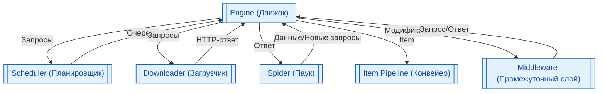

# Scrapy-парсинг и веб-краулинг

<div class="article-tags">
  <span class="tag tag-required">ОБЯЗАТЕЛЬНО</span>
  <span class="tag tag-beginner">ДЛЯ НОВИЧКОВ</span>
</div>

<span class="complexity-badge">Разработчику</span>
<span class="complexity-badge">Архитектору</span>

## Основы Scrapy

### Что такое Scrapy

**Scrapy** — это открытый фреймворк на языке Python, предназначенный для автоматизированного извлечения структурированных данных из веб-ресурсов. Система обрабатывает HTTP-запросы, управляет очередями задач, обрабатывает ответы серверов и передаёт извлечённые данные в конвейеры обработки. Фреймворк оптимизирован для работы с большими объёмами информации и поддерживает асинхронную обработку сетевых соединений.

Применение Scrapy обеспечивает автоматизацию регулярного сбора данных, мониторинг изменений контента и формирование датасетов для последующего анализа. Система интегрируется с базами данных, облачными хранилищами и инструментами машинного обучения.

Установка Scrapy, как правило, проста, но может потребовать установки дополнительных системных зависимостей в зависимости от вашей операционной системы. Ключевое требование — Python версии 3.10 или выше. Самый распространенный способ - использовать `pip`:

```
pip install scrapy
```

После установки проверьте, всё ли работает, выполнив `scrapy version` в терминале. Вы должны увидеть номер установленной версии.

Основной Scrapy являются **пауки** (spiders) - самописные классы, в которых разработчик указывает начальные URL-адреса, правила перехода по ссылкам и логику извлечения данных с помощью CSS-селекторов или XPath. 

Самый простой способ понять работу паука в Scrapy — представить его как робота, который заходит на сайт, собирает нужные данные по вашим правилам и переходит по ссылкам дальше.

Чтобы запустить Scrapy, достаточно описать один класс. Вот как выглядит базовый паук для сбора заголовков сайта:
```python
import scrapy

class ExampleSpider(scrapy.Spider):
    name = 'my_spider'  # Уникальное имя паука для запуска
    start_urls = ['https://example.com']  # Стартовая точка

    def parse(self, response):
        # Извлекаем текст тега <title> с помощью CSS-селектора
        title = response.css('title::text').get()
        yield {'title': title}

```

Запускается такой паук одной консольной командой: `scrapy crawl my_spider`.

Из чего состоит паук:
- `name` (Имя): Текстовый идентификатор. В одном проекте Scrapy может быть много пауков, и движок находит нужного именно по этому имени. Запуск в консоли: `scrapy crawl quotes`.
- `start_urls` (Стартовые адреса): Список URL-адресов. Паук автоматически сделает по ним первые запросы и скачает веб-страницы.
- `parse(self, response)` (Главный метод): Функция-обработчик, которая вызывается автоматически, как только страница скачалась. Аргумент `response` содержит весь HTML-код страницы.
- `yield` (Генератор): Вместо `return` используется `yield`. Это позволяет пауку отдавать данные порциями, не дожидаясь окончания всей работы, что экономит оперативную память.

Для поиска элементов в HTML используются CSS-селекторы (или XPath)"
- `response.css('div.quote')` — находит все блоки `<div>` с классом `quote`.
- `::text` — указывает, что нужно забрать именно текстовое содержимое внутри тега, а не сам HTML-код.
- `.get()` — забирает первый найденный элемент (например, одного автора).
- `.getall()` — собирает все подходящие элементы в список (например, все теги к цитате).

Вторая часть метода `parse` отвечает за пагинацию (листание страниц):
1. Паук ищет на странице кнопку «Вперед» или «Следующая страница» через CSS-селектор `li.next a::attr(href)`.
2. Если ссылка найдена, метод `response.follow()` создает новый запрос.
3. В параметр `callback=self.parse` мы передаем эту же самую функцию. Паук зайдет на страницу №2 и снова выполнит тот же алгоритм. Это будет продолжаться, пока страницы не закончатся.

Вы можете запустить паука и сразу сохранить весь результат в удобный формат без написания дополнительного кода. Для этого при запуске в консоли передается флаг `-o` (output):
- `scrapy crawl quotes -o results.json` — сохранит в JSON-файл.
- `scrapy crawl quotes -o results.csv` — сохранит в таблицу CSV (откроется в Excel).

Использование готового паука Scrapy вместо написания парсера «с нуля» на чистом Python даёт три главных преимущества: колоссальную скорость, экономию времени разработчика и надежность. Пока обычный скрипт ждет ответа от одного сайта (1–2 секунды), паук Scrapy успевает отправить десятки запросов параллельно, парсинг 10 000 страниц на обычном коде может занять часы. Паук Scrapy сделает это за пару минут.

Современные сайты не любят, когда с них массово качают информацию, и быстро блокируют роботов. Паук Scrapy умеет маскироваться:
- Паук при каждом запросе может притворяться новым устройством (то заходит как Chrome на Windows, то как Safari на iPhone).
- Паук сам анализирует скорость ответа сайта. Если сайт начинает "уставать" или злиться, паук автоматически притормаживает, чтобы не поймать бан.
- В паука легко встроить список промежуточных IP-адресов, и каждый запрос будет идти из новой точки мира.
- Паук никогда не зайдет на одну и ту же страницу дважды, даже если на нее ведут сто разных ссылок на сайте.
- Если в процессе парсинга у вас отключился интернет или выключился свет, Scrapy может продолжить работу ровно с того места, где остановился.
- Вы просто пишете `yield данные`, а фреймворк сам упаковывает их в красивую Excel-таблицу (CSV) или JSON.

Словом, это готовый фреймворк для парсинга.

---

### Архитектура фреймворка Scrapy

Scrapy имеет асинхронную архитектуру на базе Twisted, что делает его невероятно быстрым и эффективным.

> Twisted — это классический, зрелый сетевой фреймворк Python с открытым исходным кодом, который специализируется на асинхронном программировании. Он позволяет обрабатывать тысячи одновременных сетевых соединений в одном потоке без блокировки.

о своей сути Twisted выполняет роль мощного «движка», который избавляет разработчика от рутины при работе с низкоуровневыми сетевыми протоколами. Его компоненты включают:
- Reactor (Цикл событий). Ядро системы, которое работает в одном потоке. Он постоянно опрашивает систему ввода-вывода (I/O) и распределяет события (например, пришел ответ от сервера) по нужным обработчикам.
- Deferred (Отложенные объекты). Специальный механизм в Twisted для управления цепочками обратных вызовов (callback), так как ответ от сети занимает время. Когда сетевой запрос завершается, объект Deferred запускает цепочку связанных функций для обработки полученных данных.
- Поддержка протоколов. Содержит готовые реализации для десятков сетевых протоколов, таких как HTTP, SSH, SMTP, FTP, IRC и DNS.

Благодаря Twisted, Scrapy является асинхронным событийно-ориентированным фреймворком. Вместо того чтобы отправлять один запрос, ждать ответа (блокируя программу) и только потом переходить к следующему, Scrapy действует иначе:
1. Отправляет запрос к веб-сайту;
2. Не дожидаясь ответа, сразу отправляет следующий.
3. Как только приходит ответ от любого из сайтов, движок ловит событие и запускает связанный код (вашу функцию-паука) для обработки страницы.

Архитектура Scrapy построена на взаимодействе шести основных компонентов. Каждый компонент выполняет отдельную функцию в цикле обработки данных.

| Компонент | Функция | Пример использования |
|-----------|---------|----------------------|
| Engine | Управление потоком данных и координация компонентов | Передача запросов в очередь, распределение ответов парсерам |
| Spider | Определение логики извлечения данных и генерация запросов | Разбор HTML-разметки, переход по ссылкам, формирование объектов Item |
| Scheduler | Управление очередью запросов | Приоритизация URL, фильтрация дубликатов, планирование повторных запросов |
| Downloader | Выполнение сетевых запросов и получение ответов | Отправка HTTP-запросов, обработка заголовков, управление таймаутами |
| Item Pipeline | Обработка и сохранение извлечённых данных | Валидация полей, фильтрация записей, запись в JSON или базу данных |
| Middleware | Модификация запросов и ответов на промежуточных этапах | Добавление заголовков авторизации, ротация пользовательских агентов, обработка прокси |

Схема взаимодействия компонентов:


Таким образом, процесс работы выглядит так:
1. Движок получает первоначальные запросы от Паука (из его `start_urls` или метода `start()`).
2. Движок отправляет запросы в Планировщик, который ставит их в очередь.
3. Планировщик отдаёт следующий запрос Движку.
4. Движок отправляет запрос Загрузчику (через Downloader Middlewares).
5. Загрузчик скачивает страницу и отправляет ответ обратно Движку (через Downloader Middlewares).
6. Движок отправляет ответ Пауку (через Spider Middlewares).
7. Паук обрабатывает ответ и возвращает Items и новые Requests.
8. Движок отправляет Items в Item Pipeline, а новые Requests — Планировщику, и цикл повторяется.

---

### Пример работы Scrapy

Давайте разберем минимальный пример. Допустим, мы хотим получить цитаты и авторов с сайта `http://quotes.toscrape.com.`

Создадим простой проект `quotes_project` простой командой:
```
python -m scrapy startproject quotes_project
```

Эта команда создаст папку `quotes_project`, внутри неё - структуру проекта с основными файлами `items.py`, `pipelines.py`, `settings.py` и папкой `spiders/`.

Затем нужно создать паука. Создайте файл в папке `spiders` и назовите его `quotes_spider.py`. В нем мы определим нашего первого паука.

```python
import scrapy

class QuotesSpider(scrapy.Spider):
    name = "quotes"
    allowed_domains = ["quotes.toscrape.com"]
    start_urls = ["http://quotes.toscrape.com/"]

    def parse(self, response):
        for quote_block in response.css("div.quote"):
            yield {
                "text": quote_block.css("span.text::text").get(),
                "author": quote_block.css("span small.author::text").get(),
                "tags": quote_block.css("div.tags a.tag::text").getall(),
            }

        next_page = response.css("li.next a::attr(href)").get()
        if next_page is not None:
            yield response.follow(next_page, callback=self.parse)
```

Здесь:
- импортируем `scrapy` и создаём класс, наследующий от `scrapy.Spider`;
- определяем атрибуты - `name` — обязательное уникальное имя; `start_urls` — список URL-ов, с которых начнется сканирование;
- определяем метод `parse` - основной метод, который обрабатывает ответы с сервера;
- `response.css(...)` использует встроенный CSS-селектор для поиска элементов;
- `.get()` и `.getall():` `.get()` возвращает первый найденный элемент (или `None`), а `.getall()` — список всех найденных элементов;
- `response.follow` — удобный способ для создания и отправки нового запроса по найденной ссылке, `callback=self.parse` говорит, что ответ на этот запрос нужно обработать тем же методом `parse`. Это создает рекурсивный обход всех страниц.

Чтобы запустить паука и сохранить результат в файл (например, JSON), выполните в корневой директории проекта:

```
python -m scrapy crawl quotes -o quotes.json
```

Затем вы должны увидеть вывод об успешном окончании работы:

```
[scrapy.core.engine] INFO: Spider closed (finished)
```

`Spider closed (finished)` означает, что Scrapy завершил сбор данных. В корневой папке проекта (`\quotes_project\`) должен появиться файл `quotes.json`. Откройте его - вы увидите что-то вроде:
```json
[
  {"text": "“The world as we have created it is a process of our thinking. It cannot be changed without changing our thinking.”", "author": "Albert Einstein", "tags": ["change", "deep-thoughts", "thinking", "world"]},
  {"text": "“It is our choices, Harry, that show what we truly are, far more than our abilities.”", "author": "J.K. Rowling", "tags": ["abilities", "choices"]},
  ...
]
```

Вы собрали 10 цитат с первой страницы! (если только первая страница, или больше, если паук прошелся по всем). В логах вы могли видеть примерно такое:

```
[scrapy.statscollectors] INFO: Dumping Scrapy stats:
{'downloader/request_count': 1,  # Количество запросов
 'downloader/response_count': 1,
 'item_scraped_count': 10,       # Количество собранных элементов
 'finish_reason': 'finished',
 'finish_time': datetime.datetime(...),
 'start_time': datetime.datetime(...)}
```

Обратите внимание на `item_scraped_count` - это сколько цитат вы собрали.

Scrapy поддерживает множество форматов:
```bash
# JSON (красивый формат)
python -m scrapy crawl quotes -o quotes_pretty.json -o json

# JSON Lines (каждая запись на отдельной строке)
python -m scrapy crawl quotes -o quotes.jl

# CSV (можно открыть в Excel)
python -m scrapy crawl quotes -o quotes.csv

# XML
python -m scrapy crawl quotes -o quotes.xml

# YAML
python -m scrapy crawl quotes -o quotes.yaml
```


---

## Механизмы извлечения данных

### Селекторы XPath и CSS

Селекторы позволяют извлекать конкретные элементы из HTML и XML документов. Scrapy поддерживает два стандарта адресации узлов.

**XPath** — язык запросов для навигации по дереву документов. Селекторы используют пути, условия и функции для точного поиска элементов.
**CSS** — каскадные таблицы стилей, адаптированные для выбора элементов по классам, идентификаторам и атрибутам.

| Критерий | XPath | CSS |
|----------|-------|-----|
| Синтаксис | `//div[@class="price"]/text()` | `div.price::text` |
| Гибкость условий | Поддержка функций, осей, регулярных выражений | Базовые селекторы атрибутов и псевдоклассы |
| Производительность | Высокая при сложных фильтрациях | Оптимальная для стандартной разметки |
| Читаемость | Требует изучения синтаксиса осей | Соответствует стандартам веб-разработки |

Пример извлечения данных:
```python
title = response.xpath('//h1[@class="main-title"]/text()').get()
price = response.css('span.price::text').get().strip()
```
Пояснение кода:
- `response.xpath()` — вызов метода для поиска элементов по XPath;
- `'//h1[@class="main-title"]/text()'` — путь к текстовому содержимому заголовка с классом `main-title`;
- `.get()` — получение первого найденного элемента в виде строки;
- `response.css()` — вызов метода для поиска элементов по CSS-селектору;
- `'span.price::text'` — выбор текста внутри тега `span` с классом `price`;
- `.strip()` — удаление пробельных символов в начале и конце строки.


---

### Парсинг и обработка ответов

Объект `Response` содержит данные, полученные от сервера. Методы парсинга преобразуют сырую разметку в структурированные объекты.

- **Request** — объект, описывающий HTTP-запрос. Содержит URL, метод, заголовки и тело запроса.
- **Response** — объект, содержащий статус, заголовки ответа и тело документа.

Фрагмент обработки пагинации:
```python
def parse(self, response):
    for item in response.css('div.product'):
        yield {
            'name': item.css('h3::text').get(),
            'url': item.css('a::attr(href)').get()
        }
    next_page = response.css('a.next::attr(href)').get()
    if next_page:
        yield response.follow(next_page, self.parse)
```
Пояснение кода:
- `def parse(self, response):` — определение метода парсинга, принимающего ответ сервера;
- `response.css('div.product')` — выбор всех элементов с классом `product`;
- `yield` — передача объекта данных в конвейер без прерывания выполнения;
- `item.css('h3::text').get()` — извлечение названия товара;
- `response.follow()` — формирование нового запроса по относительному URL;
- `self.parse` — передача ссылки на метод для обработки следующей страницы.


---

## Управление данными и конвейеры

### Предметы Item и поля данных

**Item** — класс, определяющий структуру извлекаемых данных. Поля задают допустимые ключи и обеспечивают валидацию входных значений. Если CSS-селекторы вытаскивают из HTML «сырой» текст, то Items превращают его в четко структурированный объект, похожий на строку в базе данных или стандартный словарь Python.

Поля объявляются в файле `items.py` вашего проекта с помощью класса `scrapy.Field()`. Внутри этого поля можно сразу прописать функции для очистки данных.

Определение структуры данных:
```python
import scrapy

class ProductItem(scrapy.Item):
    title = scrapy.Field()
    price = scrapy.Field()
    category = scrapy.Field()
    rating = scrapy.Field()
```

Пояснение кода:
- `import scrapy` — импорт библиотеки фреймворка;
- `class ProductItem(scrapy.Item):` — объявление класса предмета, наследующего базовую структуру;
- `title = scrapy.Field()` — объявление поля для хранения названия товара;
- `price = scrapy.Field()` — объявление поля для хранения стоимости;
- `category = scrapy.Field()` — объявление поля для хранения категории;
- `rating = scrapy.Field()` — объявление поля для хранения оценки.

В коде паука вы импортируете свой класс, заполняете его поля и отдаете через `yield`. Scrapy полностью поддерживает такие объекты и без проблем экспортирует их в JSON или CSV.

Структура Item обеспечивает единообразие данных на всех этапах обработки и позволяет конвейерам применять общие правила валидации. Собранные Items автоматически передаются в конвейеры, где их удобно валидировать (например, проверять, что цена — это число, а не текст).

---

### Конвейеры обработки (Item Pipelines)

Item Pipelines (Конвейеры обработки) — это финальный этап сборки данных в Scrapy. После того как паук нашел данные на странице и упаковал их в объект Item, он передает этот объект в конвейер.

Конвейер последовательно обрабатывает каждый объект Item. Этапы включают проверку целостности данных, очистку значений и запись в целевое хранилище.

Каждый конвейер — это обычный класс Python с обязательным методом `process_item`.

Пример конвейера фильтрации и сохранения:
```python
class PriceValidationPipeline:
    def process_item(self, item, spider):
        if 'price' not in item:
            return item
        price = item['price'].replace(',', '.')
        numeric_price = float(price)
        item['price'] = numeric_price
        return item

    def close_spider(self, spider):
        self.file.close()
```
Пояснение кода:
- `class PriceValidationPipeline:` — объявление класса конвейера;
- `def process_item(self, item, spider):` — метод обработки каждого объекта;
- `if 'price' not in item:` — проверка наличия поля цены;
- `price.replace(',', '.')` — замена запятой на точку для преобразования в число;
- `float(price)` — преобразование строки в числовой тип;
- `return item` — возврат обработанного объекта в следующий этап конвейера;
- `def close_spider(self, spider):` — метод закрытия ресурсов при завершении парсера.

Все созданные конвейеры нужно зарегистрировать в файле настроек проекта `settings.py`. Вы можете активировать сразу несколько конвейеров. Число напротив класса (от 0 до 1000) определяет порядок их выполнения: чем меньше число, тем раньше запустится конвейер.

---

## Расширенная функциональность

### Промежуточные обработчики (Middleware)

Промежуточные обработчики (Middleware) в Scrapy — это перехватчики, которые контролируют движение сетевых запросов (Requests) и ответов от сайтов (Responses). Если Pipelines работают строго на выходе (обрабатывают уже собранные данные), то Middlewares работают "на передовой" — они модифицируют сетевое поведение паука, помогая ему избегать блокировок.

Scrapy делит обработчики на два независимых слоя:
- Downloader Middleware (Промежуточное ПО загрузчика): Находится между Движком и Сетью. Это самый используемый слой. Он перехватывает запросы до отправки на сайт и ответы до того, как они попадут к пауку.
- Spider Middleware (Промежуточное ПО паука): Находится между Движком и Пауком. Используется реже, в основном для глубокой модификации логики (например, управления вложенностью обхода ссылок или обработки специфических ошибок самого паука).

Промежуточные слои модифицируют запросы перед отправкой и обрабатывают ответы до передачи парсеру. Обработчики реализуют ротацию заголовков, управление сессиями и интеграцию с прокси.

Пример добавления заголовков:
```python
class CustomHeadersMiddleware:
    def process_request(self, request, spider):
        request.headers['Accept-Language'] = 'ru-RU,ru;q=0.9'
        request.headers['User-Agent'] = 'Mozilla/5.0 (Windows NT 10.0; Win64; x64)'
        return None
```
Пояснение кода:
- `class CustomHeadersMiddleware:` — объявление класса промежуточного обработчика;
- `def process_request(self, request, spider):` — метод обработки запроса перед отправкой;
- `request.headers['Accept-Language'] = ...` — установка заголовка языка;
- `request.headers['User-Agent'] = ...` — установка заголовка идентификатора клиента;
- `return None` — передача управления следующему обработчику в цепочке.

С помощью встроенных или кастомных классов в `middlewares.py` вы решаете большинство проблем с анти-бот системами:
- Подмена User-Agent. Каждому исходящему запросу можно динамически подставлять заголовки реальных браузеров, чтобы сайт думал, что его читает человек, а не скрипт.
- Ротация Прокси. Автоматическая отправка каждого нового запроса через разные IP-адреса из вашего пула.
- Умная обработка ошибок (Retry). Если сайт вернул ошибку 503 или 429 (Too Many Requests), middleware перехватит этот ответ, подождет пару секунд и отправит запрос заново, не ломая работу паука.
- Работа с куками и сессиями. Автоматическое сохранение сессионных кук между запросами к одному сайту.

По аналогии с конвейерами, обработчики регистрируются в файле `settings.py`. У каждого обработчика есть цифровой вес (приоритет).  В Scrapy уже предустановлено около десятка стандартных `middlewares` (для обработки редиректов, сжатия `gzip`, кук и т.д.). Назначая числа (от 0 до 1000), вы определяете, встанет ваш код до стандартных функций Scrapy или после них.

Чаще всего разработчики не пишут прокси-обработчики с нуля, а используют популярные готовые библиотеки, например `scrapy-rotating-proxies` или `scrapy-user-agents`. 

---

### Настройки производительности и ограничения

Файл `settings.py` содержит параметры управления асинхронностью, задержками, повторными попытками и обработкой ошибок. Правильная настройка позволяет найти баланс между максимальной скоростью сбора данных и стабильностью (чтобы не уронить целевой сайт и не попасть под блокировку). Все параметры ниже разбиты на две группы: ускорение и защита от банов.


| Параметр | Описание | Значение по умолчанию |
|----------|----------|----------------------|
| `CONCURRENT_REQUESTS` | Количество одновременных запросов | 16 |
| `DOWNLOAD_DELAY` | Задержка между запросами к одному домену | 0 |
| `AUTOTHROTTLE_ENABLED` | Автоматическая адаптация скорости загрузки | False |
| `RETRY_TIMES` | Количество повторных попыток при ошибке | 2 |
| `HTTPCACHE_ENABLED` | Кэширование ответов для снижения нагрузки | False |

Конфигурация параметров:
```python
CONCURRENT_REQUESTS = 32
DOWNLOAD_DELAY = 1.5
AUTOTHROTTLE_ENABLED = True
HTTPCACHE_ENABLED = True
```
Пояснение конфигурации:
- `CONCURRENT_REQUESTS = 32` — увеличение параллельных потоков до тридцати двух;
- `DOWNLOAD_DELAY = 1.5` — установка задержки в полторы секунды между запросами;
- `AUTOTHROTTLE_ENABLED = True` — активация автоматической регулировки скорости;
- `HTTPCACHE_ENABLED = True` — включение локального кэширования ответов.


---

## Интеграция и развертывание

Когда ваш паук Scrapy готов и протестирован на локальном компьютере, встает вопрос его регулярного запуска. Запускать скрипты вручную из терминала неудобно, поэтому проекты переносят на сервера и автоматизируют. Развертывание (деплой) и интеграцию Scrapy-проектов можно разделить на четыре основных подхода:
- Запуск по расписанию (Cron / Systemd). Если вам нужно запускать паука, например, раз в сутки в 3 часа ночи, проект просто переносится на обычный Linux-сервер (VPS).
- Scrapyd — это официальное open-source приложение от разработчиков Scrapy. Оно превращает ваш сервер в полноценный API-сервер для управления пауками. Вы устанавливаете Scrapyd на сервер, и он постоянно работает в фоновом режиме, ожидая HTTP-запросы.
- Docker + Airflow / Celery. Вы создаете Dockerfile, который собирает образ со всеми зависимостями, Python и кодом паука. Это гарантирует, что паук запустится одинаково и на вашем ПК, и в облаке Amazon AWS или Яндекс.Облаке.
- Облачные платформы (Scrapy Cloud / Zyte). Если вы не хотите администрировать собственные Linux-сервера, можно использовать готовые облачные решения. Самое известное — Zyte (бывший Scrapinghub, созданный основателями Scrapy).

### Экспорт собранных данных

В Scrapy экспорт собранных данных автоматизирован максимально удобно. Вам не нужно вручную открывать файлы, форматировать строки или писать код для сохранения. Систему экспорта можно разделить на два уровня: простой экспорт через консоль (для тестов и простых скриптов) и профессиональный экспорт через настройки Feed Exports (для продакшена).

Когда вы запускаете паука из терминала, достаточно добавить флаг `-o` (output) или `-O` (перезапись файла) и указать имя файла с нужным расширением. Scrapy сам поймет формат по расширению файла.

Если вы запускаете паука внутри системы автоматизации (например, через Scrapyd, Airflow или по расписанию), прописывать флаги в консоли неудобно. В этом случае пути и форматы сохранения жестко задают в файле настроек `settings.py`. Начиная с современных версий Scrapy, для этого используется словарь `FEEDS`.

Фреймворк поддерживает выгрузку данных в стандартные форматы. Командная строка предоставляет параметры выбора формата и кодировки.

Выполнение экспорта:
```bash
scrapy crawl myspider -o output.json -t json
scrapy crawl myspider -o output.csv -t csv -s FEED_EXPORT_ENCODING=utf-8
```
Пояснение команд:
- `scrapy crawl myspider` — запуск парсера с именем `myspider`;
- `-o output.json` — указание файла для сохранения результатов;
- `-t json` — выбор формата вывода;
- `-t csv` — выбор табличного формата;
- `-s FEED_EXPORT_ENCODING=utf-8` — установка кодировки UTF-8 для совместимости со специфическими символами.

Пример настроек FEEDS:

```python
# settings.py

FEEDS = {
    # 1. Локальное сохранение в CSV
    'share/exports/data.csv': {
        'format': 'csv',          # Формат файла
        'encoding': 'utf8',       # Кодировка (чтобы русский текст не ломался)
        'overwrite': True,        # Перезаписывать файл при каждом запуске (True) или дополнять (False)
        'fields': ['text', 'author'], # Экспортировать только эти поля (необязательно)
    },
    
    # 2. Параллельное сохранение в JSONL
    'share/exports/backup.jsonl': {
        'format': 'jsonlines',
        'encoding': 'utf8',
    }
}

```

Scrapy «из коробки» поддерживает отправку файлов на удаленные сервера. Вам не нужно скачивать файл локально, а потом куда-то его пересылать. Достаточно изменить схему пути в `settings.py`.

---

### Масштабирование и распределённый парсинг

Когда масштабов одного сервера становится недостаточно, а объемы данных вырастают до миллионов страниц, Scrapy масштабируют с помощью распределенного парсинга. Основная проблема стандартного Scrapy в том, что его очередь запросов (Scheduler) живет в оперативной памяти конкретной машины. Чтобы запустить парсинг одной задачи одновременно на 10 серверах, эту очередь нужно вынести во внешнее единое хранилище. Индустриальный стандарт для этого — связка Scrapy + Redis.

Распределённая архитектура разделяет задачи между несколькими узлами. Интеграция с очередями сообщений обеспечивает синхронизацию состояний и балансировку нагрузки.

| Технология | Назначение | Интеграция с Scrapy |
|------------|------------|---------------------|
| Scrapyd | Сервер удалённого запуска пауков | Отправка проектов, мониторинг выполнения |
| Redis | Хранилище очередей и кэша | Распределённый планировщик, фильтрация URL |
| Scrapy Cloud | Облачная платформа для запуска | Масштабирование, логирование, мониторинг |
| PostgreSQL | Реляционное хранилище | Прямая запись через конвейеры и ORM |

Для распределенной работы используют библиотеку `scrapy-redis`. Она полностью перестраивает стандартную архитектуру фреймворка:
```
[ Сервер 1: Паук ] \                               / [ База данных ]
[ Сервер 2: Паук ]  ===> [ Центральный REDIS ] ===>  [ База данных ]
[ Сервер 3: Паук ] /     (Очередь URL и дубликаты) \ [ База данных ]
```

1. Единая очередь (Scheduler): Вместо памяти компьютера запросы (Requests) хранятся в Redis. Все запущенные пауки на любых серверах обращаются к нему и берут оттуда следующую ссылку.
2. Единый фильтр дубликатов (DupeFilter): Хэши уже посещенных страниц хранятся в Redis (в виде Set). Ни один паук не зайдет на страницу, которую уже скачал его "коллега" на другом сервере.
3. Общий сбор (Items): Собранные данные со всех серверов могут также временно стекаться в очередь Redis, откуда их забирает отдельный скрипт для записи в основную БД.

Нужно увеличить скорость в 5 раз? Просто запустите еще 5 Docker-контейнеров с пауком на любых серверах. Они автоматически подключатся к Redis и включатся в работу.

Если посреди парсинга сайт забанит один из серверов или на нем пропадет питание, очередь в Redis не пострадает. Другие серверы продолжат работу, а упавший сервер после перезапуска просто продолжит с того же места. 

Сначала устанавливается библиотека: `pip install scrapy-redis`. Затем в файле настроек проекта `settings.py` стандартные модули Scrapy заменяются на модули распределенной работы:
```python
# settings.py

# 1. Меняем стандартный планировщик на планировщик Scrapy-Redis
SCHEDULER = "scrapy_redis.scheduler.Scheduler"

# 2. Включаем централизованный фильтр дубликатов
DUPEFILTER_CLASS = "scrapy_redis.dupefilter.RFPDupeFilter"

# 3. Настраиваем параметры очистки очереди (True — сохранять очередь при перезапуске)
SCHEDULER_PERSIST = True

# 4. Указываем адрес центрального сервера Redis
REDIS_HOST = '192.168.1.50'  # IP вашего сервера с Redis
REDIS_PORT = 6379
# REDIS_PARAMS = {'password': 'your_secure_password'} # если есть пароль

# 5. (Опционально) Отправка собранных айтемов в очередь Redis
ITEM_PIPELINES = {
    'scrapy_redis.pipelines.RedisPipeline': 300,
}

```

В коде самого паука вместо `scrapy.Spider` нужно унаследоваться от класса `RedisSpider` и убрать список `start_urls` (ведь стартовых ссылок в коде больше нет, они лежат в базе):

```python
from scrapy_redis.spiders import RedisSpider

class MyDistributedSpider(RedisSpider):
    name = 'distributed_spider'
    # Вместо start_urls указываем ключ, по которому паук будет ждать ссылки в Redis
    redis_key = 'distributed_spider:start_urls'

    def parse(self, response):
        # Логика парсинга остается абсолютно прежней
        yield {'url': response.url, 'title': response.css('title::text').get()}

```

Процесс работы выглядит так:
1. Вы запускаете паука на сервере №1, №2 и №3 командой: `scrapy crawl distributed_spider`. Пауки запускаются, подключаются к Redis и "замирают" в ожидании задач.
2. С помощью простого скрипта или команды в терминале вы отправляете стартовый URL в Redis:`redis-cli lpush distributed_spider:start_urls https://example.com`
3. Один из свободных пауков мгновенно забирает эту ссылку, скачивает страницу, находит на ней новые ссылки и отправляет их обратно в Redis. Остальные пауки тут же разбирают эти новые ссылки.

---

### Паттерны организации кода

Структурирование проекта обеспечивает переиспользование компонентов, упрощает тестирование и поддерживает масштабируемость кодовой базы.

Модульная структура:
```
myproject/
├── scrapy.cfg
└── myproject/
    ├── __init__.py
    ├── items.py
    ├── middlewares.py
    ├── pipelines.py
    ├── settings.py
    └── spiders/
        ├── __init__.py
        └── product_spider.py
```
Пояснение структуры:
- `scrapy.cfg` — конфигурационный файл проекта;
- `items.py` — определение классов данных;
- `middlewares.py` — реализация промежуточных обработчиков;
- `pipelines.py` — конвейеры валидации и сохранения;
- `settings.py` — глобальные параметры фреймворка;
- `spiders/` — директория с модулями парсеров;
- `product_spider.py` — файл с логикой извлечения данных.

Каждый модуль изолирует отдельную ответственность. Изоляция упрощает поддержку кода, позволяет тестировать компоненты отдельно и обеспечивает замену реализаций без изменения остальной архитектуры.


---


## См. также

- [Парсинг на Python](./316.md) — основы парсинга
- [BeautifulSoup — парсинг HTML](./317.md) — углублённо по DOM и селекторам
- [Работа с файлами, сетью и внешними API](./31.md) — requests, файлы, интеграции
- [Веб-разработка и REST API на Python](./34.md) — HTTP-клиент и серверная сторона
- [Асинхронность и многопоточность](./29.md) — потоки, процессы, asyncio
- [Работа с базами данных в Python](./314.md) — SQLAlchemy, PostgreSQL
- [Анализ данных — pandas, NumPy](./33.md) — таблицы после сбора
- [Экосистема Python](./36.md) — Scrapy, Playwright в обзоре пакетов
- [HTML](/encyclopedia/3-data-markup/3-09-html/1) · [DOM-дерево](/encyclopedia/3-data-markup/3-09-html/1#dom-derevo)
- [HTTP как основа веб-интеграций](/encyclopedia/2-system-network/2-09-osnovy-integratsionnogo-vzaimodeystviya/118)
- [Сайты и веб-сайты](/encyclopedia/2-system-network/2-04-kak-rabotayut-sayty-i-veb-sayty/1)
