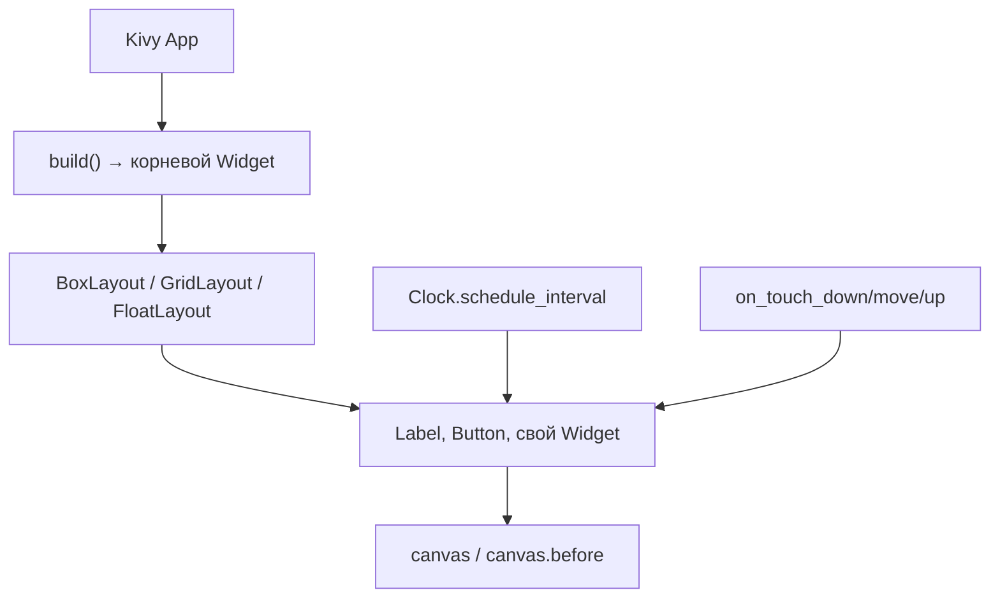

# Kivy — мобильные приложения и игры на Python

<span class="complexity-badge">Разработчику</span>
<span class="complexity-badge">Начальный уровень</span>

---

## Что такое Kivy

**Kivy** — open-source фреймворк для кроссплатформенных приложений с **сенсорным вводом**. Интерфейс рисуется через **OpenGL ES 2**, поэтому один и тот же код можно запускать на Windows, macOS, Linux, Android и (с ограничениями) iOS. Для учебных мобильных игр и прототипов на Python Kivy — практичная альтернатива тяжёлым движкам вроде Unity.

**Виджет** в Kivy — узел дерева UI с координатами, размером и обработчиками событий. **Главный цикл** Kivy не пишут вручную: его запускает `App.run()`, а кадры и таймеры планируют через `Clock`. Это отличает Kivy от Pygame, где цикл `while running` — центр программы (см. [Разработка игр на Python](./312.md)).

Краткий обзор в экосистеме Python — в [справочнике библиотек](./121.md). В этой статье — архитектура, отличия от Pygame/Tkinter/Flutter и маршрут к [практикумам](./kivy-praktikum/intro.md) (2048, Pong, Snake).

<div class="callout callout--info">
  <div class="callout-title">Где читать дальше</div>

  <div class="callout-body">
  <strong>Мобильный контекст</strong> — ограничения платформы, магазины, сенсорный UI — <a href="/encyclopedia/4-code-dev/4-12-mobilnye-prilozheniya/intro">раздел "Мобильные приложения"</a>, <a href="/encyclopedia/9-spinoff/9-04-razrabotka-igr/122">Мобильные игры</a>.<br/>
  <strong>Игры на десктопе</strong> — Pygame и учебный практикум — <a href="/encyclopedia/5-languages/5-02-python/312">Разработка игр на Python</a>, <a href="/encyclopedia/9-spinoff/9-04-razrabotka-igr/praktikum-razrabotki-igr/intro">Практикум разработки игр</a>.<br/>
  <strong>Окна с формами</strong> — встроенный Tkinter — <a href="/encyclopedia/5-languages/5-02-python/311">Tkinter и GUI</a>, <a href="/lab/Примеры/1124">галерея виджетов в Lab</a>.
  </div>
</div>

---

## Сравнение Kivy, Pygame, Tkinter и Flutter

| Критерий | Kivy | Pygame | Tkinter | Flutter |
|----------|------|--------|---------|---------|
| Цель | Мультитач UI, мобильные игры | 2D-игры на десктопе | Десктопные формы | Нативный мобильный UI |
| Графика | OpenGL, `canvas` | SDL, `blit` на Surface | Системные виджеты Tcl/Tk | Skia, Material/Cupertino |
| Сенсор | `on_touch_*`, свайпы | Мышь, джойстик | Мышь | Жесты из коробки |
| Сборка APK | Buildozer, python-for-android | Нет | Нет | `flutter build apk` |
| Кривая обучения | Средняя | Ниже для игр | Ниже для форм | Выше (Dart + экосистема) |

**Правило выбора**

- Уже знаете Python и нужна **простая мобильная игра** с тачем — **Kivy**.
- Игра только для ПК — [Pygame](./312.md) и [мини-игры в Lab](/lab/Примеры/1132).
- Нужен продуктовый мобильный UI с нативным видом — [Flutter](/encyclopedia/5-languages/5-22-dart/311) или Kotlin/Swift из [мобильного раздела](/encyclopedia/4-code-dev/4-12-mobilnye-prilozheniya/intro).
- Окно с кнопками и полями без OpenGL — [Tkinter](./311.md).

---

## Установка и первый запуск

Перед Kivy полезно настроить окружение по [Зависимости Python](./39.md) — venv и `requirements.txt` избавят от конфликтов пакетов.

```bash
python -m venv .venv
# Windows: .venv\Scripts\activate
# Linux/macOS: source .venv/bin/activate
pip install "kivy>=2.3.0"
```

Минимальное приложение:

```python
from kivy.app import App
from kivy.uix.button import Button


class HelloApp(App):
    def build(self):
        return Button(text="Привет, Kivy!", on_press=lambda *_: print("tap"))


if __name__ == "__main__":
    HelloApp().run()
```

**Разбор.**

- `App` — точка входа: метод `build()` возвращает корневой виджет, `run()` запускает цикл событий.
- `on_press` — обработчик нажатия; на мобильном это сработает и от тапа.
- `if __name__ == "__main__"` — тот же приём, что в [первой программе на Python](./16.md) и [точке входа `__main__`](./40.md).

Запуск — `python main.py`. Окно появится на десктопе — это нормально: Kivy сначала отлаживают на ПК, затем упаковывают в APK ([сборка APK](#buildozer)).

---

## Архитектура Kivy



### App и жизненный цикл

Жизненный цикл мобильного экрана в общих чертах описан в [Мобильных приложениях](/encyclopedia/4-code-dev/4-12-mobilnye-prilozheniya/1.md). В Kivy на практике важны три шага:

- Наследуем `kivy.app.App`, реализуем `build()` — возвращаем корневой виджет.
- `App.run()` запускает главный цикл — обработка событий, отрисовка, таймеры.
- Точка входа — `if __name__ == "__main__": ...App().run()`, как в обычных Python-скриптах.

### Виджеты и компоновка

**Виджет** (`Widget` и наследники) — прямоугольная область с `pos`, `size` и дочерними элементами. **Layout** раскладывает детей по правилам.

| Класс | Назначение |
|-------|------------|
| `BoxLayout` | Вертикальный или горизонтальный стек |
| `GridLayout` | Сетка с фиксированным числом столбцов (`cols`) |
| `FloatLayout` | Абсолютное позиционирование дочерних элементов |
| `Widget` | Пустая область — база для кастомной отрисовки на `canvas` |

Размеры задают двумя способами:

- **Доля родителя** — `size_hint=(1, 0.3)` (ширина 100%, высота 30%).
- **Фиксированный размер** — `size_hint_y=None` и `height=dp(48)` (см. ниже про `dp`).

Аналог компоновки в других стеках — [Flutter Layout](/encyclopedia/5-languages/5-22-dart/311), [Tkinter pack/grid](./3112.md).

### Единицы dp и sp

**dp** (density-independent pixel) — логический пиксель, не зависящий от плотности экрана. `kivy.metrics.dp(48)` даёт одинаково "щёлкаемую" кнопку на телефоне и на мониторе с высоким DPI.

**sp** (scale-independent pixel) — для шрифтов; в Kivy пишут `"22sp"` в `font_size`.

На мобильных важен **адаптивный дизайн** — см. [Мобильные игры](/encyclopedia/9-spinoff/9-04-razrabotka-igr/122) (раздел про экраны и safe areas). В Kivy доли `size_hint` и `dp` — основной инструмент.

### Отрисовка через canvas

**Canvas** — слой OpenGL-примитивов (`Rectangle`, `Ellipse`, `Line`, `RoundedRectangle`), привязанный к виджету. `canvas.before` рисует *под* дочерними виджетами (фон), `canvas` — поверх фона, но логика та же.

```python
from kivy.graphics import Color, Rectangle

with self.canvas:
    Color(0.2, 0.8, 1, 1)
    self.rect = Rectangle(pos=self.pos, size=self.size)
self.bind(pos=self._sync, size=self._sync)
```

**Разбор.**

- `with self.canvas` — контекстный менеджер добавляет примитивы на слой виджета.
- `Color(r, g, b, a)` — компоненты 0..1, не 0..255.
- `bind(pos=..., size=...)` обязателен: без него при ресайзе окна прямоугольник "отстанет" от виджета.

В [практикуме Pong](./kivy-praktikum/2.md) ракетка и мяч — виджеты с `Rectangle`/`Ellipse`; в [2048](./kivy-praktikum/1.md) — `RoundedRectangle` у плиток.

### Игровой цикл и Clock

В Pygame игровой цикл — явный `while running` с `clock.tick(60)` ([теория в 312](./312.md)). В Kivy кадры планируют через **Clock**:

```python
from kivy.clock import Clock

Clock.schedule_interval(self.update, 1.0 / 60.0)  # ~60 FPS

def update(self, dt):
    self.ball.x += self.ball.velocity_x * dt
```

**Разбор.**

- `dt` — секунды с прошлого вызова; умножение скорости на `dt` даёт движение, не зависящее от частоты кадров (как в физике [Pong на Pygame](/encyclopedia/9-spinoff/9-04-razrabotka-igr/praktikum-razrabotki-igr/3)).
- `schedule_once` — один отложенный вызов (подача мяча через 0.8 с после гола).
- Отмена — `event.cancel()`; в [Snake](./kivy-praktikum/3.md) интервал пересоздают при ускорении.

### Сенсорный ввод

**Touch** в Kivy — объект с координатами `touch.x`, `touch.y`. Цепочка событий:

- `on_touch_down` — палец коснулся экрана;
- `on_touch_move` — палец движется;
- `on_touch_up` — палец оторван.

**Свайп** — разность координат между down и up. Сохраняют `_touch_start`, сравнивают `dx`/`dy` с порогом `dp(30)` — так сделано в [Kivy — 2048](./kivy-praktikum/1.md) и [Kivy — Snake](./kivy-praktikum/3.md). Теория жестов — [Мобильные игры](/encyclopedia/9-spinoff/9-04-razrabotka-igr/122) (тап, свайп, виртуальные кнопки).

**Перетаскивание** — обновление позиции в `on_touch_move`, пока `player_touch_active` — [Kivy — Pong](./kivy-praktikum/2.md).

**Клавиатура** на десктопе — `Window.bind(on_key_down=handler)`; удобно при отладке на ПК без телефона.

Возврат `True` из обработчика означает "событие обработано" и останавливает всплытие к родителю.

### Properties и привязки

**Property** в Kivy — объявленный атрибут с уведомлением при изменении. Пример:

```python
from kivy.properties import NumericProperty

class Paddle(Widget):
    score = NumericProperty(0)

# где-то в App:
self.field.player.bind(score=self._update_score_labels)
```

При `player.score += 1` Kivy сам вызовет `_update_score_labels` — не нужно вручную обновлять Label после каждого гола. Подробнее в [практикуме Pong](./kivy-praktikum/2.md), этап 8.

---

## Разделение логики и UI

**Модель** хранит состояние и правила; **представление** рисует и принимает ввод. Связь — тонкий слой: `game.move("left")` → `board.refresh()`.

В учебных проектах Kivy:

- **2048** — `game_logic.py` (`Game2048`) не импортирует Kivy; `main.py` только рисует сетку.
- **Pong / Snake** — логика в `GameField` / `SnakeBoard`, корневой layout — в `App.build()`.

Тот же приём — в [SmallPong на Pharo](/encyclopedia/5-languages/5-08-smalltalk/31) (`PongGame` + `PongGameMorph`) и [Pygame-практикуме Pong](/encyclopedia/9-spinoff/9-04-razrabotka-igr/praktikum-razrabotki-igr/3) (пакет `game/`).

Плюсы разделения:

- логику можно проверить без GUI (тесты, REPL);
- проще перенести UI на другой фреймворк;
- меньше смешивания математики и отрисовки в одном файле.

---

<span id="buildozer"></span>

## Сборка APK

Для Android обычно используют **Buildozer** — обёртку над **python-for-android**, которая собирает Python, Kivy и зависимости в APK.

Типичные шаги:

1. Установите зависимости Buildozer (Linux или WSL; на Windows нативная сборка часто проблемна — см. [сравнение стеков](/encyclopedia/4-code-dev/4-12-mobilnye-prilozheniya/112#slozhnost-sborki-sravnenie-stekov)).
2. Создайте `buildozer.spec` с `requirements = python3,kivy`.
3. Выполните `buildozer android debug` — получите APK для установки по USB ([установка на телефон](/encyclopedia/4-code-dev/4-12-mobilnye-prilozheniya/1121)).

Подпись, keystore и публикация — [Сборка мобильных приложений](/encyclopedia/4-code-dev/4-12-mobilnye-prilozheniya/112) и [Публикация Android](/encyclopedia/4-code-dev/4-12-mobilnye-prilozheniya/1141).

<div class="callout callout--tip">
  <div class="callout-title">Совет</div>

  <div class="callout-body">
  Сначала доведите игру до рабочего состояния на десктопе (<code>python main.py</code>), затем переходите к Buildozer. Отладка графики и тача в эмуляторе Android сложнее, чем в окне Kivy на ПК.
  </div>
</div>

---

## Практикумы — три мобильные игры

Пошаговые реализации с самопроверкой на каждом этапе:

| Игра | Фокус | Статья |
|------|--------|--------|
| **2048** | Свайпы, сетка, JsonStore, логика без UI | [Kivy — 2048](./kivy-praktikum/1.md) |
| **Pong** | Clock, физика мяча, тач, ИИ | [Kivy — Pong](./kivy-praktikum/2.md) |
| **Snake** | Тик змейки, еда, D-pad + свайп | [Kivy — Snake](./kivy-praktikum/3.md) |

Обзор маршрута и порядок прохождения — [Практикум Kivy — о разделе](./kivy-praktikum/intro.md).

---

## Частые ошибки

| Симптом | Причина | Что сделать |
|---------|---------|-------------|
| Чёрный экран | Не вызван `App.run()` или `build()` вернул `None` | Проверьте точку входа и `return` в `build()` |
| Графика "плывёт" при ресайзе | Не обновляются `Rectangle.pos` / `size` | `bind(pos=..., size=...)` на виджете |
| Свайп не срабатывает | Порог слишком большой или touch уходит в дочерний виджет | Уменьшите порог `dp(20–30)`, перехватите touch на поле |
| Игра "тормозит" на телефоне | Тяжёлая логика в `on_touch_move` | Перенесите физику в `Clock`, touch только меняет состояние |
| `pip install kivy` падает | Нет SDL2 / зависимостей ОС | [Документация Kivy — Installation](https://kivy.org/doc/stable/gettingstarted/installation.html) |

---

## Официальные материалы

- [Kivy Documentation](https://kivy.org/doc/stable/)
- [Kivy Garden](https://github.com/kivy-garden) — дополнительные виджеты
- [Buildozer](https://buildozer.readthedocs.io/) — сборка APK

---
