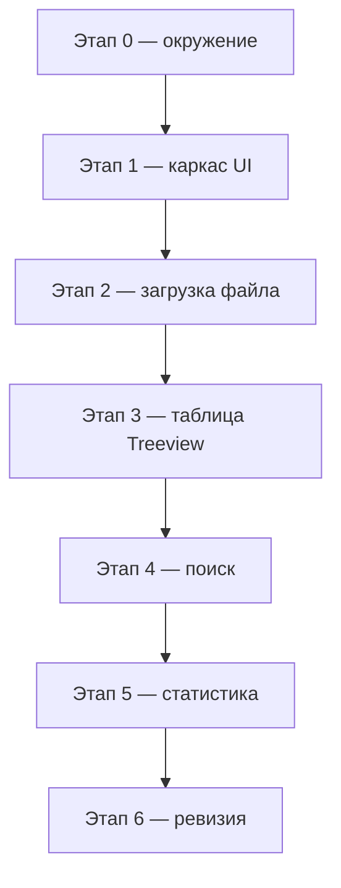
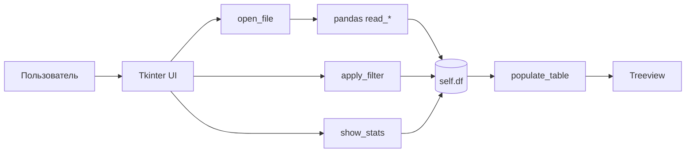

import ExternalCodeEmbed from '@site/src/components/ExternalCodeEmbed';


# Практикум — Pandas Data Viewer

<div class="article-tags">
  <span class="tag tag-required">ОБЯЗАТЕЛЬНО</span>
  <span class="tag tag-beginner">ДЛЯ НОВИЧКОВ</span>
</div>

<span class="complexity-badge">Разработчику</span>
<span class="complexity-badge">Начальный уровень</span>

---

## О практикуме

**Pandas Data Viewer** — учебное десктопное приложение: открыть таблицу из `.csv` или Excel, просмотреть строки, найти значение по всем столбцам и вывести описательную статистику. Всё в одном окне на **Tkinter** (входит в стандартную поставку Python) и **pandas** (библиотека для табличного анализа).

Зачем такой проект, если есть Excel и Jupyter? Потому что он связывает **два навыка**, которые в реальной работе идут рядом:

- **аналитика** — загрузка, фильтрация, `describe()`, типы столбцов;
- **интерфейс** — кнопки, диалоги, таблица на экране, обратная связь пользователю.

Аналог в духе «мини-Excel на Python» полезен для отчётов, проверки выгрузок из CRM или логов без запуска тяжёлого BI-стека. Теория таблиц — в [Анализ данных — pandas, NumPy, SciPy](./33.md); виджеты и цикл событий — в [Tkinter и GUI](./311.md) и [Первая программа на Tkinter](./3111.md). Скрипты без GUI — [Pandas — типовые операции](/lab/Примеры/1113). Образец для сверки — `F:\Projects\Python\TestPandas`.

<div class="callout callout--info">
  <div class="callout-title">Для кого материал</div>

  <div class="callout-body">
  Нужны Python 3.10+, базовые классы и списки, установленные <code>pandas</code> и <code>openpyxl</code>. Желательно пройти <a href="./3111.md">первую программу на Tkinter</a> и хотя бы раз открыть CSV в <a href="/lab/Примеры/1113#pandas-csv">Lab</a>.<br/>
  Маршрут раздела «Анализ данных» — <a href="/encyclopedia/3-data-markup/3-11-analiz-dannyh/intro">о разделе</a>, пункт 2 (Data Science).
  </div>
</div>

**Оценка времени** — 2–3 часа при прохождении всех этапов подряд с самопроверкой после каждого шага.

### Чему учит практикум

| Навык | Что именно тренируем | Где в коде |
|-------|----------------------|------------|
| Загрузка данных | `read_csv`, `read_excel`, обработка ошибок | `open_file` |
| EDA | `dtypes`, `describe()`, размер таблицы | `show_stats` |
| Фильтрация | булева маска, `str.contains` | `apply_filter` |
| GUI | `Treeview`, `filedialog`, `messagebox`, `StringVar` | `_build_ui`, `populate_table` |
| Архитектура | состояние (`self.df`) отдельно от отрисовки | класс `DataViewerApp` |

### Ключевые определения

- **DataFrame** — двумерная таблица pandas: строки — записи, столбцы — атрибуты с именами и типами. Подробнее — [обзор Pandas](./33.md#основные-структуры--series-и-dataframe).
- **EDA** (*Exploratory Data Analysis*, разведочный анализ) — первичный осмотр данных: сколько строк, какие типы, есть ли выбросы. В Excel это лист + сводные; здесь — `info`, `dtypes`, `describe()`. Контекст — [Data Science](/encyclopedia/3-data-markup/3-11-analiz-dannyh/12), [Pandas — типовые операции при анализе данных — типовые операции](/encyclopedia/3-data-markup/3-11-analiz-dannyh/428).
- **Булева маска** — столбец или Series из `True`/`False`; `df[mask]` оставляет только строки, где условие истинно. Тот же приём — в [фильтрации Pandas](./33.md#filtratsiya-transformatsiya-i-gruppirovka).
- **Treeview** — виджет Tkinter для табличного и древовидного вывода; мы используем режим «только заголовки» (`show="headings"`), без колонки-дерева.
- **Главный цикл** (`mainloop`) — бесконечное ожидание кликов и ввода; без него окно сразу закроется — см. [Первая программа на Tkinter](./3111.md).

### Карта этапов



| Этап | Фокус | Результат |
|------|--------|-----------|
| 0 | Окружение | venv, зависимости, пустое окно |
| 1 | Каркас UI | Панель кнопок, строка поиска, статус |
| 2 | Загрузка файла | `read_csv` / `read_excel`, обработка ошибок |
| 3 | Таблица | `Treeview` с колонками DataFrame |
| 4 | Поиск | Маска по всем столбцам, сброс |
| 5 | Статистика | `dtypes`, `describe()` в диалоге |
| 6 | Ревизия | Итоговая самопроверка |

**Правило прохождения** — после каждого этапа запускайте `python app.py`. Не переходите дальше, пока не отмечены пункты самопроверки — тот же подход, что в [отладке и разработке](/encyclopedia/4-code-dev/4-14-razrabotka-i-otladka/intro).

---

<span id="stage-0"></span>
## Этап 0 — окружение

**Цель** — отдельная папка проекта, виртуальное окружение, зафиксированные зависимости и пустое окно с заголовком.

### Зачем venv и requirements.txt

**Виртуальное окружение** изолирует пакеты проекта от системного Python: на одном компьютере могут жить разные версии `pandas` для разных задач. Файл `requirements.txt` фиксирует состав окружения — коллега или вы через месяц воспроизведёте те же версии одной командой `pip install -r requirements.txt`. Подробнее — [Зависимости Python](./39.md).

```bash
mkdir pandas-viewer && cd pandas-viewer
python -m venv .venv
.venv\Scripts\activate
pip install "pandas>=2.0.0" "openpyxl>=3.1.0"
```

`requirements.txt`:

```
pandas>=2.0.0
openpyxl>=3.1.0
```

**Разбор команд.**

- `python -m venv .venv` создаёт каталог `.venv` с копией интерпретатора и `pip`.
- `.venv\Scripts\activate` (Windows) подключает это окружение в текущей сессии терминала; в Linux/macOS — `source .venv/bin/activate`.
- `openpyxl` — движок для чтения `.xlsx`; без него `pd.read_excel()` завершится ошибкой импорта, хотя CSV будет работать.

### Тестовые данные

Создайте **`sample_data.csv`** — небольшая таблица сотрудников для проверки поиска и статистики:

```csv
name,age,city,salary
Анна,28,Москва,85000
Борис,34,Санкт-Петербург,92000
Виктория,25,Казань,71000
Григорий,41,Новосибирск,105000
Дарья,31,Москва,88000
Егор,29,Екатеринбург,79000
Жанна,36,Самара,83000
Иван,22,Москва,65000
```

В файле смешаны типы:

- `name`, `city` — строки (`object` в pandas);
- `age`, `salary` — целые числа (`int64`);
- в `city` три вхождения «Москва» — удобно проверить фильтр на этапе 4.

Чтение такого CSV без pandas — [модуль `csv` в stdlib](/lab/Примеры/1126#5-csv-стандартная-библиотека); здесь сразу переходим к DataFrame.

### Минимальное окно

`app.py`:

```python
import tkinter as tk


def main() -> None:
    root = tk.Tk()
    root.title("Pandas Data Viewer")
    root.geometry("900x600")
    root.mainloop()


if __name__ == "__main__":
    main()
```

**Разбор.**

- `tk.Tk()` — корневое окно приложения; один экземпляр на программу.
- `title(...)` — текст в заголовке окна ОС.
- `geometry("900x600")` — ширина × высота в пикселях; позже добавим `minsize`, чтобы окно не сжималось до нечитаемого размера.
- `if __name__ == "__main__"` — точка входа при прямом запуске; при импорте модуля `main()` не вызовется — см. [if __name__ == "__main__"](./40.md).
- `mainloop()` — цикл обработки событий; без него процесс завершится и окно исчезнет.

**Самопроверка**

- [ ] `python app.py` открывает пустое окно с заголовком «Pandas Data Viewer».
- [ ] `pip list` показывает `pandas` и `openpyxl`.
- [ ] Повторный запуск не выдаёт ошибок импорта.

---

<span id="stage-1"></span>
## Этап 1 — каркас интерфейса

**Цель** — собрать все зоны экрана до подключения pandas: панель действий, поиск, таблица, строка статуса.

### Слои интерфейса

Десктопное приложение удобно мыслить **слоями** — сверху вниз:

1. **Toolbar** — кнопки «Открыть файл» и «Статистика», метка с путём к файлу.
2. **Filter bar** — поле поиска и «Сбросить».
3. **Table area** — `Treeview` с вертикальной и горизонтальной прокруткой.
4. **Status bar** — краткое сообщение о состоянии (загружено N строк, найдено M).

Такое деление повторяет привычный Excel: лента → фильтр → сетка → строка состояния. Теория компоновки — [pack и grid в 3111](./3111.md#pack-и-grid).

Замените `app.py`:


<ExternalCodeEmbed example="python/py-502-334-001" title="Слои интерфейса" minHeight={720} />


### Разбор класса и виджетов

**Состояние приложения.**

- `self.df = None` — таблица ещё не загружена; `None` отличаем от пустого DataFrame.
- `self.file_path` — путь для метки в toolbar; пригодится, если добавите «перезагрузить файл».

**`ttk` против `tk`.**

- Модуль `ttk` (themed Tk) даёт виджеты в стиле ОС — кнопки и таблица выглядят аккуратнее классического Tk.
- `Frame` группирует виджеты; `padding=8` — внутренние отступы в пикселях.

**Компоновка.**

- В toolbar и filter bar — `pack(side=tk.LEFT)` — элементы в ряд слева направо.
- Область таблицы — `pack(fill=tk.BOTH, expand=True)` — растягивается на всё свободное место при ресайзе окна.
- Внутри `table_frame` — `grid`: таблица в (0,0), вертикальная полоса в (0,1), горизонтальная в (1,0).
- `rowconfigure(0, weight=1)` и `columnconfigure(0, weight=1)` — при увеличении окна растёт именно ячейка с таблицей, а не полосы прокрутки.
- `sticky="nsew"` — виджет «приклеен» ко всем сторонам ячейки (north-south-east-west).

**Treeview и прокрутка.**

- `show="headings"` скрывает служебную колонку `#0` с деревом; остаётся плоская таблица с именованными столбцами.
- `yscrollcommand` / `xscrollcommand` связывают полосы прокрутки с таблицей — стандартный паттерн Tkinter.

**Заглушки обработчиков.**

- `command=self.open_file` передаёт **ссылку на метод**, без скобок — иначе функция вызовется при создании кнопки, а не при клике (см. [Tkinter и GUI — пример кнопки](./311.md#пример-простого-приложения-с-кнопкой)).
- Заглушки меняют строку статуса — вы сразу видите, что кнопки подключены.

**Самопроверка**

- [ ] Окно показывает две кнопки, поле поиска, пустую таблицу и строку «Готово» внизу.
- [ ] Кнопки меняют текст в строке статуса.
- [ ] При сужении окна таблица сжимается, но не наезжает на toolbar.

---

<span id="stage-2"></span>
## Этап 2 — загрузка CSV и Excel

**Цель** — диалог выбора файла, чтение в `DataFrame`, сохранение в `self.df`, отображение пути и размера таблицы.

### Форматы и функции чтения

| Расширение | Функция pandas | Зависимость |
|------------|----------------|-------------|
| `.csv` | `pd.read_csv(path)` | только pandas |
| `.xlsx` | `pd.read_excel(path)` | `openpyxl` |
| `.xls` | `pd.read_excel(path)` | может потребоваться `xlrd` |

**CSV** (*Comma-Separated Values*) — текстовый формат: строка = запись, поля разделены запятой или точкой с запятой. **Excel** хранит листы в бинарном или XML-контейнере; pandas скрывает детали, но движок чтения нужно установить отдельно.

Типовые параметры `read_csv` (кодировка, разделитель, типы столбцов) — [загрузка данных в 428](/encyclopedia/3-data-markup/3-11-analiz-dannyh/428#zagruzka-dannyh) и [примеры в Lab](/lab/Примеры/1113#pandas-csv).

Добавьте импорты в начало `app.py`:

```python
from tkinter import filedialog, messagebox

import pandas as pd
```

Замените метод `open_file`:


<ExternalCodeEmbed example="python/py-502-334-002" title="Форматы и функции чтения" minHeight={552} />


### Разбор метода `open_file`

**Диалог выбора файла.**

- `filedialog.askopenfilename()` блокирует окно до выбора файла или «Отмена»; возвращает строку пути или пустую строку.
- `filetypes` — список пар «описание, шаблон»; пользователь может отфильтровать только CSV или только Excel.

**Ветвление по расширению.**

- `path.lower().endswith(".csv")` — простая эвристика; для продакшена иногда смотрят MIME-тип или пробуют оба читателя.
- `read_excel` без `sheet_name` берёт **первый лист** книги — для учебного проекта достаточно.

**Обработка ошибок.**

- `try/except` ловит битый CSV, отсутствие `openpyxl`, занятый Excel-файл, неверную кодировку.
- `messagebox.showerror` показывает текст исключения пользователю; приложение **не падает** — важный принцип GUI, см. [обработку исключений](./28.md).

**Обновление состояния.**

- `self.df = df` — единый источник правды для таблицы; поиск и статистика читают только его.
- `self.search_var.set("")` — сброс старого запроса при новом файле.
- `foreground="black"` у метки пути — визуальный сигнал «файл выбран» (на этапе 0 был серый «Файл не выбран»).

На следующем этапе добавим вызов `self.populate_table(df)` сразу после успешной загрузки.

**Самопроверка**

- [ ] «Открыть файл» → `sample_data.csv` → в статусе «Загружено: 8 строк, 4 столбца».
- [ ] Метка слева показывает полный путь к файлу.
- [ ] «Отмена» в диалоге не меняет состояние и не вызывает ошибку.
- [ ] Повреждённый или неподходящий файл даёт диалог с ошибкой, программа продолжает работать.

---

<span id="stage-3"></span>
## Этап 3 — вывод таблицы в Treeview

**Цель** — отобразить столбцы и строки `DataFrame` в `Treeview`, очистить таблицу при новой загрузке, ограничить число строк для отзывчивости GUI.

### Почему не выводить DataFrame напрямую

Pandas умеет `print(df)` и рендер в Jupyter, но в Tkinter нет встроенного «виджета DataFrame». Нужен мост:

1. взять имена столбцов → заголовки `Treeview`;
2. пройти по строкам → `insert` с списком значений;
3. `NaN` и нестандартные типы → строки для отображения.

Для очень больших файлов полный перебор в GUI-потоке **заморозит окно** — поэтому на первом проходе показываем не более 1000 строк и предлагаем поиск для сужения выборки. Пакетная обработка больших CSV — [Пакетная работа с данными — пакетная работа с данными](/encyclopedia/3-data-markup/3-11-analiz-dannyh/433).

Добавьте вызов в `open_file` после присвоения `self.df`:

```python
        self.populate_table(df)
        self.set_status(f"Загружено: {len(df)} строк, {len(df.columns)} столбцов")
```

Метод `populate_table`:


<ExternalCodeEmbed example="python/py-502-334-003" title="Почему не выводить DataFrame напрямую" minHeight={372} />


### Разбор `populate_table`

**Очистка.**

- `get_children()` возвращает id всех строк дерева; `delete(*...)` удаляет их перед новой отрисовкой.
- Без очистки при повторной загрузке или фильтре строки **накладывались бы** друг на друга.

**Заголовки и ширина.**

- `self.tree["columns"] = list(df.columns)` — динамический набор столбцов: разные файлы — разная схема.
- `heading(col, text=str(col))` — подпись в шапке; `str(col)` на случай нестандартных имён.
- `anchor=tk.W` — выравнивание ячеек по левому краю (удобно для текста и чисел).

**Строки данных.**

- `df.head(1000)` — срез первых 1000 строк; защита интерфейса от зависания.
- `iterrows()` возвращает пары `(индекс, Series)`; индекс `_` не используем.
- `pd.isna(v)` — пропуск (`NaN`, `NA`) показываем пустой ячейкой, а не текстом `nan`.
- `str(v)` приводит числа и даты к строке для единообразного вывода в Treeview.

**Ограничение учебного подхода.**

- `iterrows()` медленный на сотнях тысяч строк; в продакшене — `itertuples()`, порционная подгрузка или отдельный слой кэша. Для 8–1000 строк наш вариант достаточен.

**Самопроверка**

- [ ] После открытия `sample_data.csv` видны столбцы `name`, `age`, `city`, `salary` и 8 строк.
- [ ] Горизонтальная и вертикальная прокрутка работают при сужении окна.
- [ ] Повторное открытие того же файла не дублирует строки.

---

<span id="stage-4"></span>
## Этап 4 — поиск по всем столбцам

**Цель** — «живой» фильтр при вводе в поле «Поиск»: оставить строки, где запрос встречается **хотя бы в одном** столбце.

### Идея фильтра

В Excel — автофильтр по столбцу. Здесь — **глобальный поиск** по всей таблице, как строка поиска в почте или проводнике.

Алгоритм:

1. привести все ячейки к строкам (`astype(str)`);
2. для каждого столбца проверить `str.contains(query)`;
3. объединить столбцы через `any(axis=1)` — строка подходит, если хоть один столбец совпал;
4. `df[mask]` — отфильтрованный DataFrame;
5. снова `populate_table(filtered)`.

Тот же механизм **булевой маски**, что при `df[df["city"] == "Москва"]`, только условие сложнее — см. [фильтрацию в обзоре](./33.md#filtratsiya-transformatsiya-i-gruppirovka) и [примеры в Lab](/lab/Примеры/1113).

В `_build_ui` замените создание `search_var`:

```python
        self.search_var = tk.StringVar()
        self.search_var.trace_add("write", lambda *_: self.apply_filter())
```

Методы фильтрации:


<ExternalCodeEmbed example="python/py-502-334-004" title="Идея фильтра" minHeight={462} />


### Разбор поиска

**Привязка к полю ввода.**

- `StringVar` — переменная Tkinter, связанная с `Entry`; изменения текста видны и виджету, и коду.
- `trace_add("write", callback)` вызывает `apply_filter` при **каждом** символе — «живой» фильтр без кнопки «Найти».
- `lambda *_:` игнорирует служебные аргументы trace; обработчик можно было бы назвать `def _on_search_changed(self, *_):`.

**Нормализация запроса.**

- `strip().lower()` — поиск без учёта регистра и лишних пробелов; «Москва» и «москва» дают один результат.

**Построение маски.**

- `astype(str)` — число `92000` станет строкой `"92000"`, поэтому запрос `92` найдёт зарплату Бориса.
- `col.str.lower().str.contains(query, na=False)` — по каждому столбцу Series из True/False; `na=False` — пропуски не считаем совпадением.
- `.any(axis=1)` — по **строкам**: True, если хотя бы один столбец в строке True.
- `filtered = self.df[mask]` — классическая индексация DataFrame булевой маской.

**Сброс.**

- `reset_filter` очищает поле; пустой запрос в `apply_filter` восстанавливает полную таблицу.

**Самопроверка**

- [ ] Поиск `москва` оставляет три строки (Анна, Дарья, Иван).
- [ ] Поиск `92` находит Бориса (зарплата 92000).
- [ ] Поиск `борис` находит одну строку независимо от регистра.
- [ ] «Сбросить» возвращает все 8 строк.
- [ ] Пустое поле поиска показывает полную таблицу.

---

<span id="stage-5"></span>
## Этап 5 — описательная статистика

**Цель** — диалог с размером таблицы, типами столбцов и `describe()` для числовых полей — минимальный EDA в один клик.

### Что такое описательная статистика

**Описательная статистика** суммирует распределение значений без построения модели:

- **count** — сколько непустых значений;
- **mean** — среднее;
- **std** — разброс вокруг среднего;
- **min**, **25%**, **50%**, **75%**, **max** — минимум, квартили, медиана, максимум.

В Excel то же даёт «Описательная статистика» из надстройки «Анализ данных» — см. [Основы статистики — статистика](/encyclopedia/3-data-markup/3-11-analiz-dannyh/42). В pandas — один вызов `describe()`.

Перед статистикой всегда смотрят **типы** (`dtypes`): столбец с цифрами, прочитанный как строка, даст неверный `mean`. Чек-лист очистки — [Очистка и подготовка данных в Pandas — подготовка в Pandas](/encyclopedia/3-data-markup/3-11-analiz-dannyh/427#pandas-ochistka-dannyh).

Замените заглушку `show_stats`:


<ExternalCodeEmbed example="python/py-502-334-005" title="Что такое описательная статистика" minHeight={462} />


### Разбор `show_stats`

**Проверка данных.**

- Если `self.df is None`, пользователь ещё не открыл файл — показываем подсказку, а не пустой отчёт.

**Сбор текста отчёта.**

- Список `info` с f-строками и пустыми строками `""` для разделения блоков.
- `dtypes.to_string()` — компактная таблица «столбец → тип»; для `sample_data.csv` увидите `int64` у `age` и `salary`, `object` у `name` и `city`.

**Только числовые столбцы.**

- `select_dtypes(include="number")` отсекает строки вроде `name` — `describe()` для текста бессмысленен.
- `numeric.empty` — отдельное сообщение, если в файле нет чисел (например, только категории).

**Диалог.**

- `messagebox.showinfo` — модальное окно с кнопкой OK; для длинного текста в учебном проекте достаточно; для продакшена — отдельное окно с `Text` и прокруткой ([Справочник по Tkinter — элементы UI — справочник Tkinter](./3112.md)).

**Что проверить на `sample_data.csv`.**

- `age`: mean около 30.75, min 22, max 41;
- `salary`: mean около 84125, max 105000 у Григория;
- `name` и `city` в блоке `describe()` **не** появляются.

**Самопроверка**

- [ ] Без загруженного файла — сообщение «Сначала откройте файл с данными».
- [ ] Для `sample_data.csv` в статистике видны `age` и `salary` с mean, min, max.
- [ ] Столбец `name` не попадает в числовой блок `describe()`.
- [ ] После фильтрации статистика по-прежнему считается по **полному** `self.df` (так задумано; фильтр только для отображения).

---

<span id="stage-6"></span>
## Этап 6 — ревизия и дальнейшие шаги

**Цель** — убедиться, что приложение цельное; понять, куда развивать проект дальше.

### Итоговая архитектура



Полный `app.py` совпадает с образцом в `F:\Projects\Python\TestPandas\app.py`. Запуск:

```bash
python app.py
```

**Итоговая самопроверка**

- [ ] Открываются `.csv` и `.xlsx` (для Excel нужен `openpyxl`).
- [ ] Таблица, поиск и статистика работают на `sample_data.csv`.
- [ ] Ошибки чтения файла показываются в диалоге, программа не завершается.
- [ ] Код в одном файле `app.py` — для учебного проекта нормально; при росте логику можно вынести в `data_io.py` и `filters.py`.

### Что добавить самостоятельно

| Улучшение | Зачем | Подсказка |
|-----------|-------|-----------|
| Экспорт отфильтрованных данных | сохранить результат поиска | `filtered.to_csv(...)` в `apply_filter` |
| Сортировка по клику на заголовок | удобство как в Excel | `tree.heading(col, command=...)` + `df.sort_values` |
| График зарплат по городам | визуальный EDA | [Matplotlib — графики](./319.md), `groupby` + `bar` |
| Статистика по текущему фильтру | отчёт только по видимым строкам | отдельное поле `self.filtered_df` |
| Тесты логики фильтра | регрессии без GUI | вынести маску в функцию, [pytest](./37.md) |
| Кодировка CSV | файлы в cp1251 | `read_csv(path, encoding="cp1251")` — [Pandas — типовые операции при анализе данных](/encyclopedia/3-data-markup/3-11-analiz-dannyh/428#zagruzka-dannyh) |

### Связанные материалы

**Pandas и аналитика**

- [Анализ данных — pandas, NumPy, SciPy](./33.md) — теория DataFrame, масок, groupby.
- [Pandas — объединение таблиц, своды и временные ряды](./331.md) — merge, pivot, даты.
- [Pandas — типовые операции](/lab/Примеры/1113) — скрипты без GUI с построчным разбором.
- [Pandas — типовые операции при анализе данных — типовые операции при анализе](/encyclopedia/3-data-markup/3-11-analiz-dannyh/428) — шпаргалка EDA.
- [Data Science](/encyclopedia/3-data-markup/3-11-analiz-dannyh/12) — стек и роли в экосистеме данных.

**Интерфейс и десктоп**

- [Tkinter и GUI](./311.md) · [Первая программа на Tkinter](./3111.md) — виджеты, `pack`, `grid`, `mainloop`.
- [Справочник по Tkinter — элементы UI](./3112.md) — рецепты виджетов.
- [Десктопные приложения — о разделе](/encyclopedia/4-code-dev/4-11-desktopnye-prilozheniya/intro) — контекст жанра.

**Смежные инструменты**

- [NumPy — массивы и матрицы](/lab/Примеры/1129) — основа под pandas.
- [Matplotlib — графики](./319.md) — следующий шаг после таблицы.
- [Зависимости Python](./39.md) — venv, `pip`, `pyproject.toml`.

---

## В подборках

**Аналитика данных** — [Анализ данных — о разделе](/encyclopedia/3-data-markup/3-11-analiz-dannyh/intro), [Python — о разделе](./intro.md), [типовые операции Pandas](/encyclopedia/3-data-markup/3-11-analiz-dannyh/428), [практикум в пункте 2 Data Science](/encyclopedia/3-data-markup/3-11-analiz-dannyh/12#stek-analiza-dannyh).

**Десктоп на Python** — [Tkinter и GUI](./311.md), [десктопные приложения](/encyclopedia/4-code-dev/4-11-desktopnye-prilozheniya/intro), [Tkinter — примеры в Lab](/lab/Примеры/1124).
