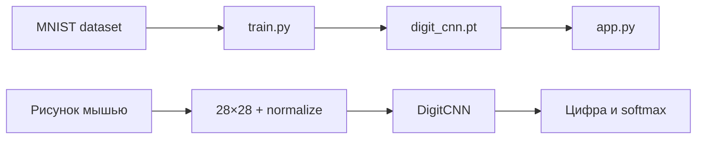
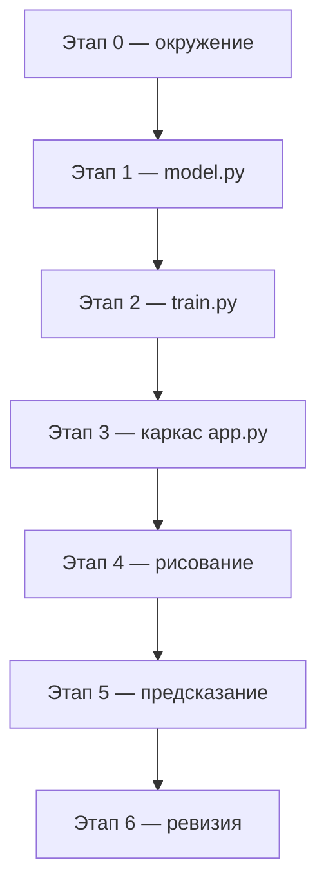
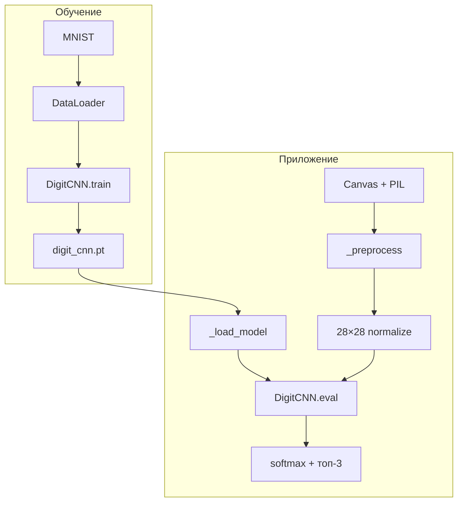

import ExternalCodeEmbed from '@site/src/components/ExternalCodeEmbed';


# Практикум — распознавание цифр на PyTorch

<div class="article-tags">
  <span class="tag tag-required">ОБЯЗАТЕЛЬНО</span>
  <span class="tag tag-beginner">ДЛЯ НОВИЧКОВ</span>
</div>

<span class="complexity-badge">Разработчику</span>
<span class="complexity-badge">Начальный уровень</span>

---

## О практикуме

**TestPyTorch** — учебное приложение из трёх модулей. Свёрточная нейросеть (**CNN**) обучается на **MNIST** (рукописные цифры 28×28), веса сохраняются на диск, а окно **Tkinter** принимает рисунок мышью и выводит предсказание с уверенностью.

Зачем такой проект после теории в [PyTorch для разработчика](./333.md)?

- **сквозной цикл ML** — данные → модель → `loss.backward()` → сохранение → инференс;
- **компьютерное зрение в миниатюре** — свёртки, пулинг, softmax, препроцессинг изображения;
- **GUI + фоновое обучение** — длинная задача уходит в поток, окно остаётся отзывчивым;
- **связка train и inference** — одни и те же `Normalize` и архитектура в `train.py` и `app.py`.

Следующий практикум для **текста** (без GUI) — [тональность отзывов на PyTorch](./336.md): TF-IDF baseline, `nn.Embedding`, бинарная классификация.

Образец для сверки — `F:\Projects\Python\TestPyTorch`. Теория CNN и backprop — [нейрон и слои](/encyclopedia/6-ai/6-03-neyroseti/1), [перцептрон на NumPy](/encyclopedia/6-ai/6-03-neyroseti/2). Аналог по формату "десктоп + данные" — [практикум Pandas Data Viewer](./334.md). Табличный ML до нейросетей — [scikit-learn](./332.md) и [маршрут машинного обучения](/encyclopedia/6-ai/6-02-mashinnoe-obuchenie/intro).

<div class="callout callout--info">
  <div class="callout-title">Для кого материал</div>

  <div class="callout-body">
  Нужны Python 3.10+, базовые классы, установленные <code>torch</code>, <code>torchvision</code>, <code>Pillow</code>. Желательно прочитать <a href="./333.md">обзор PyTorch</a>, один раз пройти <a href="./3111.md">первую программу на Tkinter</a> и по возможности — <a href="/lab/Примеры/1129">NumPy в Lab</a>. GPU не обязателен: на CPU обучение займёт 1–2 минуты.<br/>
  Маршрут раздела "ИИ" — <a href="/encyclopedia/6-ai/6-02-mashinnoe-obuchenie/intro">машинное обучение</a>, затем <a href="/encyclopedia/6-ai/6-03-neyroseti/intro">нейросети</a>.
  </div>
</div>

<div class="callout callout--tip">
  <div class="callout-title">Ментальная модель</div>

  <div class="callout-body">
  В [PyTorch для разработчика](./333.md) вы учитесь говорить на языке PyTorch — тензор, autograd, один батч. Здесь те же приёмы собраны в <strong>продукт</strong> — как в [Melbourne](/encyclopedia/6-ai/6-02-mashinnoe-obuchenie/7) для tabular ML, только задача — классификация изображений, а интерфейс — окно с canvas.
  </div>
</div>

**Оценка времени** — 2–4 часа при прохождении всех этапов подряд с самопроверкой после каждого шага.

### Чему учит практикум

| Навык | Что именно тренируем | Где в коде |
|-------|----------------------|------------|
| Архитектура CNN | `Conv2d`, `MaxPool2d`, `Linear`, `Dropout` | `model.py` |
| Цикл обучения | `DataLoader`, loss, backward, метрики | `train.py` |
| Работа с датасетом | MNIST, `transforms`, `Subset` | `train.py` |
| Сохранение модели | `state_dict`, `torch.save` / `load` | `train.py`, `_load_model` |
| Препроцессинг CV | invert, crop, resize 28×28, normalize | `_preprocess`, `_predict` |
| GUI | canvas, события мыши, `StringVar`, progressbar | `app.py` |
| Многопоточность | обучение без блокировки UI | `_start_training` |

### Ключевые определения

- **MNIST** — набор 70 000 изображений рукописных цифр 0–9 в градациях серого 28×28; стандартный "Hello, World" для компьютерного зрения. Контекст датасетов — [Data Science](/encyclopedia/3-data-markup/3-11-analiz-dannyh/12).
- **CNN** (*Convolutional Neural Network*, свёрточная нейросеть) — архитектура, где фильтры скользят по картинке и выделяют локальные признаки (штрихи, углы, дуги). Пулинг уменьшает разрешение карты признаков и даёт устойчивость к сдвигу.
- **Logits** — сырые выходы последнего слоя до softmax; модель возвращает именно их, а вероятности считают отдельно через `F.softmax`.
- **Эпоха** (*epoch*) — один полный проход по обучающей выборке. Две эпохи в учебном проекте — компромисс между временем и качеством.
- **Батч** (*batch*) — пачка примеров за один шаг градиента; `BATCH_SIZE = 128` ускоряет обучение на GPU и стабилизирует оценку loss.
- **CrossEntropyLoss** — функция потерь для многоклассовой классификации; внутри объединяет softmax и negative log-likelihood. Подробнее — [PyTorch для разработчика — loss и оптимизатор](./333.md).
- **Adam** — адаптивный оптимизатор; для прототипа удобнее ручной подбор learning rate, чем классический SGD.
- **Инференс** — предсказание на новых данных; режим `model.eval()` и контекст `torch.no_grad()` отключают Dropout и autograd.
- **state_dict** — словарь обученных весов и смещений; сохраняется через `torch.save`, загружается через `load_state_dict` в **ту же** архитектуру.
- **Train / eval** — `model.train()` включает Dropout и обучение; `model.eval()` — только предсказание. Смешивать режимы нельзя.

### Архитектура проекта

Проект сознательно разделён на **модель**, **обучение** и **интерфейс** — тот же приём, что в [Kivy-практикуме](./kivy-praktikum/intro.md) (логика отдельно от GUI):

```text
test-pytorch/
├── model.py          # класс DigitCNN (nn.Module)
├── train.py          # обучение на MNIST, сохранение весов
├── app.py            # GUI — рисование, предсказание
├── requirements.txt
├── data/             # MNIST (скачивается автоматически)
└── models/
    └── digit_cnn.pt  # веса после train()
```



### Карта этапов



| Этап | Фокус | Результат |
|------|--------|-----------|
| 0 | Окружение | venv, зависимости, структура папок |
| 1 | `model.py` | Класс `DigitCNN` |
| 2 | `train.py` | Цикл обучения, файл весов |
| 3 | `app.py`, каркас | Окно, кнопки, загрузка модели |
| 4 | Рисование | Canvas + PIL, препроцессинг под MNIST |
| 5 | Предсказание | Softmax, топ-3, фоновое обучение |
| 6 | Ревизия | Итоговая самопроверка |

---

## Как проходить практикум

1. Создайте папку `test-pytorch/`, venv и установите зависимости — [этап 0](#stage-0).
2. Идите этапы **1–5 по порядку** — после этапа 2 запускайте `python train.py`, после 3–5 — `python app.py`.
3. Копируйте код **целиком** из блока этапа; не пропускайте фрагменты вида `# ...`.
4. Отмечайте **Самопроверку**; читайте **Разбор** — там связь строк с теорией CNN и Tkinter.
5. Финал — [этап 6](#stage-6) и сверка с образцом `F:\Projects\Python\TestPyTorch`.

**Маршрут чтения**

1. [Ключевые определения](#ключевые-определения) и [архитектура](#архитектура-проекта) — до первой строки кода.
2. Этапы 0–2 — модель и обучение без GUI.
3. Этапы 3–5 — интерфейс и инференс.
4. Дальше — [PyTorch для разработчика](./333.md), [нейросети](/encyclopedia/6-ai/6-03-neyroseti/intro) или [применение CV](/encyclopedia/6-ai/6-06-primenenie-ii/120).

**Правило прохождения** — не переходите к следующему этапу, пока не отмечены пункты самопроверки. Тот же подход — в [отладке и разработке](/encyclopedia/4-code-dev/4-14-razrabotka-i-otladka/intro).

---

<span id="stage-0"></span>
## Этап 0 — окружение

**Цель** — отдельная папка проекта, виртуальное окружение, зафиксированные зависимости и каталоги под данные и веса.

### Зачем venv и requirements.txt

**Виртуальное окружение** изолирует пакеты проекта от системного Python: `torch` тянет тяжёлые зависимости, и их лучше не смешивать с другими задачами на том же компьютере. Файл `requirements.txt` фиксирует состав окружения — через месяц или на другой машине воспроизведёте установку одной командой. Подробнее — [Зависимости Python](./39.md).

```bash
mkdir test-pytorch && cd test-pytorch
python -m venv .venv
.venv\Scripts\activate
pip install "torch>=2.0.0" "torchvision>=0.15.0" "Pillow>=10.0.0"
```

`requirements.txt`:

```
torch>=2.0.0
torchvision>=0.15.0
Pillow>=10.0.0
```

### Разбор команд

- `python -m venv .venv` — каталог `.venv` с копией интерпретатора и `pip`.
- `.venv\Scripts\activate` (Windows) подключает окружение в текущей сессии терминала; в Linux/macOS — `source .venv/bin/activate`.
- `torch` — тензоры, `nn.Module`, autograd, оптимизаторы; см. [PyTorch для разработчика — установка и device](./333.md).
- `torchvision` — готовый MNIST и `transforms` для CV.
- `Pillow` — off-screen изображение для преобразования рисунка с canvas в массив 28×28.

С GPU-сборкой сверяйтесь с [официальным индексом PyTorch](https://pytorch.org/get-started/locally/); для этого практикума хватит CPU.

### Структура каталогов

Создайте пустые папки:

- `models/` — сюда попадёт `digit_cnn.pt` после обучения;
- `data/` — опционально; MNIST скачается в `data/MNIST` при первом `train()`.

Проверка окружения:

```bash
python -c "import torch; print(torch.__version__, torch.cuda.is_available())"
```

Вторая часть вывода — `True`, если доступна CUDA; для практикума обе ситуации нормальны.

**Самопроверка**

- [ ] `python -c "import torch; print(torch.__version__)"` выводит версию без ошибок.
- [ ] `pip list` содержит `torch`, `torchvision`, `Pillow`.
- [ ] Папка `models/` существует.

---

<span id="stage-1"></span>
## Этап 1 — модель DigitCNN

**Цель** — описать архитектуру CNN для десяти классов (цифры 0–9) и проверить форму выхода.

### Теория в двух абзацах

Полносвязная сеть на "сырых" 784 пикселях MNIST работает, но **не использует** пространственную структуру: соседние пиксели связаны смыслом (контур цифры), а не случайным порядком в векторе. Свёртка смотрит на локальное окно 3×3 и строит **карты признаков** — на ранних слоях это края, на поздних — фрагменты цифр. [Нейрон и слои](/encyclopedia/6-ai/6-03-neyroseti/1) объясняют идею; здесь — практическая сборка в PyTorch.

Создайте **`model.py`**:


<ExternalCodeEmbed example="python/py-502-335-001" title="Теория в двух абзацах" minHeight={570} />


### Разбор архитектуры

**Базовый контракт `nn.Module`.**

- `super().__init__()` — регистрация подмодулей в PyTorch.
- `forward` — что происходит при вызове `model(x)`; обучение и autograd идут через этот путь.
- Разделение на `features` (свёртки) и `classifier` (полносвязные слои) — привычный паттерн torchvision; удобно менять "голову" под другую задачу.

**Вход** — тензор формы `(batch, 1, 28, 28)`:

- `batch` — сколько картинок в пачке;
- `1` — один канал (оттенки серого, не RGB);
- `28 × 28` — размер MNIST.

**Блок `features` — размеры по шагам**

| Слой | Выходная форма | Комментарий |
|------|----------------|-------------|
| Вход | `(N, 1, 28, 28)` | N — размер батча |
| `Conv2d(1→32, 3, pad=1)` + ReLU | `(N, 32, 28, 28)` | padding сохраняет сторону |
| `MaxPool2d(2)` | `(N, 32, 14, 14)` | окно 2×2, шаг 2 |
| `Conv2d(32→64, 3, pad=1)` + ReLU | `(N, 64, 14, 14)` | больше фильтров — богаче признаки |
| `MaxPool2d(2)` | `(N, 64, 7, 7)` | финальная карта перед flatten |

**Блок `classifier`.**

- `Flatten()` — вектор длины `64 × 7 × 7 = 3136`.
- `Linear(3136, 128)` + `ReLU` — скрытый полносвязный слой.
- `Dropout(0.25)` — случайное "выключение" 25% нейронов **только в `model.train()`**; борется с переобучением — см. [смещение и дисперсия](/encyclopedia/6-ai/6-02-mashinnoe-obuchenie/8).
- `Linear(128, 10)` — по одному logit на каждый класс 0…9; softmax **не** внутри модели — его добавят при инференсе.

**Проверка формы** (добавьте в конец `model.py`):

```python
if __name__ == "__main__":
    model = DigitCNN()
    dummy = torch.randn(4, 1, 28, 28)
    out = model(dummy)
    assert out.shape == (4, 10)
    print("OK:", out.shape)
```

**Разбор проверки.**

- `torch.randn(4, 1, 28, 28)` — четыре случайных "картинки" для smoke-теста.
- `assert out.shape == (4, 10)` — на каждый образец десять logits.
- Такой тест не проверяет качество, только **согласованность размерностей** — первый шаг перед обучением.

**Самопроверка**

- [ ] `python model.py` печатает `OK: torch.Size([4, 10])`.
- [ ] Понимаете, откуда берётся число `64 * 7 * 7`.
- [ ] Можете словами объяснить разницу между `features` и `classifier`.

---

<span id="stage-2"></span>
## Этап 2 — обучение train.py

**Цель** — скачать MNIST, прогнать цикл обучения, сохранить веса в `models/digit_cnn.pt`.

### Гиперпараметры учебного запуска

| Константа | Значение | Зачем |
|-----------|----------|-------|
| `EPOCHS` | 2 | быстрый прототип; для продакшена — десятки эпох |
| `BATCH_SIZE` | 128 | баланс скорости и памяти |
| `LEARNING_RATE` | 1e-3 | типичный старт для Adam |
| `TRAIN_SAMPLES` | 20_000 | часть train MNIST; полный train — 60 000 |

Создайте **`train.py`**:


<ExternalCodeEmbed example="python/py-502-335-002" title="Гиперпараметры учебного запуска" minHeight={720} />


### Разбор цикла обучения

**Устройство и перенос данных.**

- `torch.device("cuda" if ... else "cpu")` — модель и батчи должны жить на **одном** device.
- `.to(device)` для `model`, `images`, `labels` — иначе будет ошибка смешения CPU/CUDA.

**Трансформации MNIST.**

- `ToTensor()` — PIL или ndarray → float-тензор `[0, 1]`.
- `Normalize((0.1307,), (0.3081,))` — вычитание среднего и деление на std **одного канала**; константы посчитаны для MNIST.
- **Критично:** те же числа должны быть в `app.py` при инференсе — иначе модель "видит" другой масштаб пикселей и accuracy падает.

**DataLoader и Subset.**

- `datasets.MNIST(..., download=True)` — первый запуск скачает архив (~10 МБ).
- `Subset(..., range(20_000))` — учебное ускорение; для соревнования качества уберите Subset.
- `shuffle=True` — каждую эпоху батчи в новом порядке; `num_workers=0` — проще на Windows (без fork-воркеров).

**Один шаг батча — мини-алгоритм обучения.**

1. `optimizer.zero_grad()` — градиенты **не накапливаются** между шагами.
2. `outputs = model(images)` — прямой проход (forward).
3. `loss = criterion(outputs, labels)` — scalar loss.
4. `loss.backward()` — backprop; цепное правило — [перцептрон на NumPy](/encyclopedia/6-ai/6-03-neyroseti/2).
5. `optimizer.step()` — обновление весов Adam.

**Метрики эпохи.**

- `loss.item()` — Python-float из scalar-тензора; `.item()` нужен, чтобы не держать граф autograd в истории.
- `outputs.argmax(dim=1)` — предсказанный класс по максимальному logit.
- `accuracy` здесь считается **на train** — оптимистичная оценка; честнее держать отложенный test MNIST (`train=False`) — см. [разбиение данных](/encyclopedia/6-ai/6-02-mashinnoe-obuchenie/6).

**Сохранение.**

- `model.state_dict()` — только веса, без архитектуры.
- `torch.save(..., MODEL_PATH)` — файл `digit_cnn.pt`; загрузка возможна только в **тот же** класс `DigitCNN`.

Запуск:

```bash
python train.py
```

Ожидаемый вывод (числа могут чуть отличаться):

```text
Устройство: cpu
Эпоха 1/2 — loss: 0.23xx, accuracy: 9x.xx%
Эпоха 2/2 — loss: 0.07xx, accuracy: 9x.xx%
Модель сохранена: ...\models\digit_cnn.pt
```

**Самопроверка**

- [ ] Две строки "Эпоха …" с падающим loss.
- [ ] Файл `models/digit_cnn.pt` создан.
- [ ] Папка `data/MNIST` появилась после первого запуска.
- [ ] Accuracy после 2-й эпохи обычно **>95%** на подвыборке.

---

<span id="stage-3"></span>
## Этап 3 — каркас GUI app.py

**Цель** — окно Tkinter, кнопки, загрузка сохранённых весов; рисование и предсказание добавим на следующих этапах.

### Слои интерфейса

Десктопное приложение удобно мыслить **сверху вниз**:

1. **Заголовок** — подсказка пользователю.
2. **Canvas** — область рисования 280×280 (масштаб для удобства; модель всё равно получит 28×28).
3. **Панель кнопок** — "Распознать" и "Очистить".
4. **Строка результата** — `StringVar` + Label.
5. **Служебная строка** — device PyTorch.

Компоновка через `grid` — см. [pack и grid в 3111](./3111.md). Контекст жанра — [десктопные приложения](/encyclopedia/4-code-dev/4-11-desktopnye-prilozheniya/intro).

Начните **`app.py`** (этапы 4–5 дополнят этот файл):


<ExternalCodeEmbed example="python/py-502-335-003" title="Слои интерфейса" minHeight={720} />


### Разбор каркаса

**Импорты и точка входа.**

- `ttk` — themed widgets; на Windows тема `vista` ближе к нативному виду.
- `MODEL_PATH` импортируется из `train.py`, чтобы путь к весам был **один** в проекте.
- `if __name__ == "__main__"` — см. [точку входа Python](./40.md).

**Состояние приложения.**

- `self.model` — `None`, пока веса не загружены; кнопка "Распознать" disabled.
- `self.device` — тот же выбор CPU/CUDA, что в `train.py`.
- `StringVar` — связка текста результата с Label; обновление через `.set()` без пересоздания виджета — [Первая программа на Tkinter — переменные Tkinter](./3111.md).

**Загрузка весов `_load_model`.**

- Сначала создаётся **пустая** архитектура `DigitCNN()`, затем в неё заливаются веса.
- `map_location=self.device` — файл, сохранённый на GPU, откроется на CPU и наоборот.
- `weights_only=True` (PyTorch 2.x) — не выполнять произвольный pickle, только тензоры весов.
- `model.eval()` — Dropout выключен; иначе предсказания будут **случайными**.

**Самопроверка**

- [ ] После `python train.py` запуск `python app.py` показывает чёрный canvas и активную кнопку "Распознать".
- [ ] Без файла весов — подсказка выполнить `train.py`.
- [ ] Внизу окна видно `PyTorch · cpu` или `cuda:0`.

---

<span id="stage-4"></span>
## Этап 4 — рисование и препроцессинг

**Цель** — рисовать белым по чёрному, дублировать штрих в PIL и готовить изображение 28×28 в стиле MNIST.

### Конвенция пикселей MNIST vs canvas

| | Фон | Цифра | Размер |
|---|-----|-------|--------|
| Наш canvas | чёрный (0) | белый (255) | 280×280 |
| MNIST | светлый (~белый) | тёмная (~чёрная) | 28×28 |

Поэтому перед подачей в сеть нужны **invert**, **crop по контуру** и **resize** — не "сырой" canvas.

Добавьте в начало `app.py` импорты:

```python
from PIL import Image, ImageDraw, ImageOps
```

В `__init__` после создания canvas:

```python
        self.image = Image.new("L", (CANVAS_SIZE, CANVAS_SIZE), 0)
        self.draw = ImageDraw.Draw(self.image)
        self.last_x: int | None = None
        self.last_y: int | None = None

        self.canvas.bind("<Button-1>", self._on_press)
        self.canvas.bind("<B1-Motion>", self._on_drag)
        self.canvas.bind("<ButtonRelease-1>", self._on_release)
```

Константы (рядом с `CANVAS_SIZE`):

```python
BRUSH_WIDTH = 18
DRAW_COLOR = 255
BACKGROUND_COLOR = 0
```

Методы рисования:


<ExternalCodeEmbed example="python/py-502-335-004" title="Конвенция пикселей MNIST vs canvas" minHeight={720} />


### Зачем два слоя — Canvas и PIL

- **Canvas** — то, что видит пользователь; Tkinter хранит примитивы (линии, овалы), а не готовую bitmap для numpy/torch.
- **PIL (`self.image`)** — off-screen растр того же рисунка; из него удобно делать `crop`, `resize`, `ToTensor`.

События мыши:

- `<Button-1>` — нажатие; `<B1-Motion>` — drag с зажатой левой кнопкой; `<ButtonRelease-1>` — отпускание.
- `last_x`, `last_y` — предыдущая точка для непрерывной линии.

### Препроцессинг `_preprocess`

Добавьте метод в класс:

```python
    def _preprocess(self) -> Image.Image | None:
        if self.image.getbbox() is None:
            return None
        processed = ImageOps.invert(self.image)
        bbox = processed.getbbox()
        if bbox is None:
            return None
        cropped = processed.crop(bbox)
        return ImageOps.fit(cropped, (28, 28), method=Image.Resampling.LANCZOS)
```

**Разбор по строкам.**

- `getbbox()` — прямоугольник непустых пикселей; `None` — canvas пуст.
- `ImageOps.invert` — белая цифра на чёрном → тёмная на светлом, как в MNIST.
- `crop(bbox)` — убираем лишние поля вокруг цифры.
- `ImageOps.fit(..., (28, 28), LANCZOS)` — вписать в квадрат MNIST с сохранением пропорций; качественнее, чем грубый `resize`.

Для отладки можно временно сохранять результат:

```python
resized.save("debug_28.png")
```

**Самопроверка**

- [ ] Линия мышью рисуется плавно на чёрном фоне.
- [ ] "Очистить" стирает и canvas, и PIL-слой.
- [ ] После рисования "7" файл `debug_28.png` (если добавили save) похож на MNIST-цифру.

---

<span id="stage-5"></span>
## Этап 5 — предсказание и автообучение

**Цель** — softmax и топ-3 классов; при отсутствии весов — обучение в фоновом потоке без заморозки окна.

### Train vs inference в одном приложении

На первом запуске файла `digit_cnn.pt` может не быть. Тогда GUI сам вызывает `train()` из `train.py` — пользователь не обязан помнить про отдельный скрипт. Долгая операция уходит в **daemon-поток**; UI обновляется через `root.after(0, ...)`.

Добавьте импорты:

```python

import threading

from tkinter import messagebox

import torch.nn.functional as F

from torchvision import transforms

from train import MODEL_PATH, train
```

Подключите кнопку в `_build_ui`:

```python
        self.predict_btn = ttk.Button(btn_frame, text="Распознать", command=self._predict, state=tk.DISABLED)
```

Добавьте progressbar после `result_var`:

```python
        self.progress = ttk.Progressbar(main, mode="indeterminate", length=280)
        self.progress.grid(row=4, column=0, columnspan=2, pady=(8, 0))
        self.progress.grid_remove()
```

Сдвиньте метку устройства на `row=5`.

Замените ветку "нет весов" в `__init__`:

```python
        if MODEL_PATH.exists():
            self._load_model()
        else:
            self._start_training()
```

Методы предсказания и фонового обучения:


<ExternalCodeEmbed example="python/py-502-335-005" title="Train vs inference в одном приложении" minHeight={720} />


### Разбор инференса

**Тензор на вход модели.**

- `transform(resized)` — PIL → tensor `[1, 28, 28]` после ToTensor + Normalize.
- `unsqueeze(0)` — добавляет размерность batch → `[1, 1, 28, 28]`, как в `train.py`.

**Softmax и уверенность.**

- Logits — любые вещественные числа; softmax переводит их в вероятности, сумма = 1.
- `confidence` — доля max-класса; 85% не значит "абсолютная истина", но помогает увидеть сомнение модели.
- `topk(3)` — полезно для пар вроде 3/8 или 4/9 — типичная путаница на MNIST.

**Режим без градиентов.**

- `torch.no_grad()` — не строить граф autograd; быстрее и меньше RAM.
- Вместе с `model.eval()` — каноничный инференс; подробнее — [PyTorch для разработчика — сохранение и загрузка](./333.md).

**Поток `threading`.**

- Обучение в главном потоке **заморозило бы** `mainloop`.
- `root.after(0, callback)` ставит обновление UI в очередь Tkinter — безопасно из worker-потока.
- `daemon=True` — поток не держит процесс после закрытия окна.
- Тот же паттерн — в [Tkinter и GUI — Tkinter и GUI](./311.md); теория потоков — [многопоточность Python](./26.md).

**Самопроверка**

- [ ] Удалите `models/digit_cnn.pt`, запустите `app.py` — идёт обучение с progressbar, затем можно рисовать.
- [ ] Нарисованная "7" распознаётся с confidence обычно >70%.
- [ ] Пустой canvas — "Сначала нарисуйте цифру".
- [ ] В топ-3 видны альтернативные цифры с процентами.

---

<span id="stage-6"></span>
## Этап 6 — ревизия и дальнейшие шаги

**Цель** — убедиться, что три модуля работают вместе; понять типичные ошибки и куда развивать проект.

### Итоговая архитектура



Полный код совпадает с образцом в `F:\Projects\Python\TestPyTorch`. Запуск:

```bash
python app.py
```

**Итоговая самопроверка**

- [ ] `model.py`, `train.py`, `app.py` в одной папке; импорты без ошибок.
- [ ] Обучение создаёт `models/digit_cnn.pt`; повторный запуск GUI грузит веса без переобучения.
- [ ] Рисование, "Очистить", "Распознать" и топ-3 работают.
- [ ] На CPU обучение укладывается в несколько минут.
- [ ] Можете объяснить, зачем invert и те же константы Normalize в train и predict.

### Частые ошибки

| Симптом | Вероятная причина | Что проверить |
|---------|------------------|---------------|
| Всегда одна цифра / случайный ответ | `model.train()` при predict | `_load_model` → `model.eval()` |
| Низкая confidence на нормальной цифре | другой Normalize или без invert | `_preprocess` и `transforms` |
| `RuntimeError` device | tensor на CPU, model на CUDA | `.to(self.device)` везде |
| Окно "висит" при первом запуске | `train()` в main thread | `_start_training` + `threading` |
| `size mismatch` при load | изменили архитектуру | удалите старый `.pt`, переобучите |

### Что добавить самостоятельно

| Улучшение | Зачем | Подсказка |
|-----------|-------|-----------|
| Больше эпох / полный MNIST | выше accuracy | убрать `Subset`, `EPOCHS = 5` |
| Валидация на test MNIST | честная метрика | `datasets.MNIST(..., train=False)` |
| Сохранение рисунка | отладка препроцессинга | `resized.save("debug.png")` |
| Экспорт ONNX | деплой без Python | `torch.onnx.export` — [применение ИИ](/encyclopedia/6-ai/6-06-primenenie-ii/113) |
| Unit-тесты `_preprocess` | регрессии | [pytest](./37.md) на синтетическом PIL |
| Data augmentation | устойчивость к сдвигу | `RandomAffine` в `train.py` |

### Связанные материалы

**PyTorch и нейросети**

- [PyTorch для разработчика](./333.md) — тензоры, autograd, Dataset, checkpoint.
- [Нейрон и слои](/encyclopedia/6-ai/6-03-neyroseti/1) · [перцептрон на NumPy](/encyclopedia/6-ai/6-03-neyroseti/2).
- [Keras и TensorFlow](/encyclopedia/6-ai/6-03-neyroseti/114) — альтернативный фреймворк.
- [Маршрут ML](/encyclopedia/6-ai/6-02-mashinnoe-obuchenie/intro) — от scikit-learn к глубокому обучению.
- [Распознавание лиц и объектов](/encyclopedia/6-ai/6-06-primenenie-ii/120) — куда растёт CV после MNIST.

**Данные и GUI**

- [NumPy — массивы и матрицы](/lab/Примеры/1129) — основа под torch.
- [практикум Pandas Data Viewer](./334.md) — другой сквозной Tkinter-проект.
- [Tkinter и GUI](./311.md) · [Первая программа на Tkinter — первая программа](./3111.md) · [Справочник по Tkinter — элементы UI — справочник виджетов](./3112.md).
- [Data Science](/encyclopedia/3-data-markup/3-11-analiz-dannyh/12) · [анализ данных — о разделе](/encyclopedia/3-data-markup/3-11-analiz-dannyh/intro).

---

## В подборках

**Аналитика данных** — [Анализ данных — о разделе](/encyclopedia/3-data-markup/3-11-analiz-dannyh/intro), [Data Science](/encyclopedia/3-data-markup/3-11-analiz-dannyh/12), [Python — о разделе](./intro.md).

**Нейросети и ИИ** — [Машинное обучение — о разделе](/encyclopedia/6-ai/6-02-mashinnoe-obuchenie/intro), [Нейросети — о разделе](/encyclopedia/6-ai/6-03-neyroseti/intro), [Введение в ИИ — о разделе](/encyclopedia/6-ai/6-01-vvedenie-v-ii/intro).
