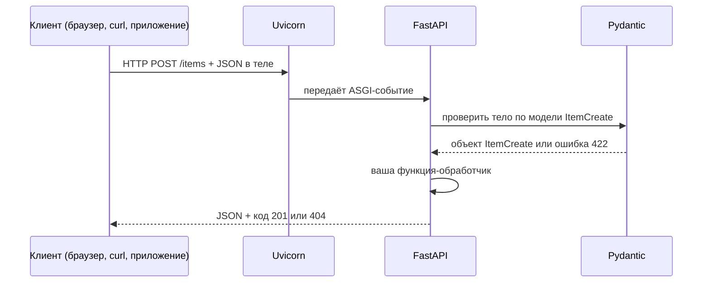

# FastAPI

<div class="article-tags">
  <span class="tag tag-required">ОБЯЗАТЕЛЬНО</span>
  <span class="tag tag-beginner">ДЛЯ НОВИЧКОВ</span>
</div>

<span class="complexity-badge">Разработчику</span>
<span class="complexity-badge">Архитектору</span>

---

## FastAPI

**FastAPI** — фреймворк для построения **HTTP API** на Python 3.8+. Под "API" здесь имеется в виду сервис, который принимает запросы по сети (обычно JSON) и отдаёт JSON — без готовых HTML-страниц "из коробки", как у классического сайта.

Типичные сценарии:

- REST/JSON-сервисы;
- микросервисы;
- бэкенд для SPA (React, Vue);
- мобильных приложений.

Пошаговый старт с кодом: [Первая программа на FastAPI](./3432.md) (включая JWT). Сравнение Flask, Django и FastAPI: [Создание собственного API на Python](./343.md), [Фреймворки и библиотеки Python](./12.md).

---

## Словарь перед чтением

| Термин | Простыми словами |
|--------|------------------|
| **HTTP** | Протокол "браузер ↔ сервер": метод (GET, POST…), URL, заголовки, тело |
| **REST** | Стиль API: ресурсы по URL (`/users/1`), ответы в JSON, коды статуса 200, 404, 422 |
| **JSON** | Текстовый формат данных: `{"title": "задача"}` — удобен для фронтенда |
| **ASGI** | Стандарт "как Python принимает HTTP" для async-серверов (Uvicorn, Hypercorn) |
| **WSGI** | Старый синхронный стандарт (Gunicorn + Flask/Django) |
| **Эндпоинт** | Один URL + метод: например `GET /health` |
| **OpenAPI** | Машиночитаемое описание всех эндпоинтов; из него рисуют Swagger |
| **Pydantic** | Библиотека: класс с полями → автоматическая проверка входящего JSON |
| **type hints** | Аннотации типов в Python: `def f(x: int) -> str:` |

FastAPI опирается на **Starlette** (маршрутизация, ASGI) и **Pydantic** (валидация). Вам чаще пишут только `FastAPI` и модели Pydantic — остальное подключается прозрачно.

---

## Чем FastAPI отличается от Flask и Django

| Критерий | Flask | Django | FastAPI |
|----------|-------|--------|---------|
| Фокус | Веб + API (собираете сами) | Полноценные сайты, админка | API в первую очередь |
| Валидация | Вручную или расширения | Forms / DRF | Аннотации + Pydantic |
| Документация API | Вручную / плагины | DRF + drf-spectacular | Swagger и ReDoc из коробки |
| Async | Quart / отдельные решения | async views с 4.1+ | Нативно (ASGI) |
| Админка | Нет | Встроенная | Нет |
| ORM | Подключаете сами | Встроенный | SQLAlchemy и др. отдельно |

**Flask** — минимальный каркас: маршрут, `request`, `jsonify`. Удобен, когда нужны и HTML-шаблоны, и API — см. [Первая программа на Flask](./3411.md).

**Django** — CMS, auth, админка, ORM, миграции в одном репозитории — см. [Django](./30.md) и [DRF](./3012.md).

**FastAPI** выбирают, когда клиент уже отдельное приложение (React, мобильное) и контракт — чистый JSON с автопроверкой типов и живой документацией на `/docs`.

---

## Как запрос проходит через приложение



1. **Клиент** отправляет HTTP-запрос (например `POST /notes` с телом `{"text": "привет"}`).
2. **Uvicorn** — процесс, который слушает порт 8000 и говорит с Python через ASGI.
3. **FastAPI** находит функцию, привязанную к пути `/notes` и методу POST.
4. **Pydantic** превращает JSON в объект Python и проверяет типы (строка не пустая, число ≥ 0 и т.д.).
5. Ваша функция работает с уже проверенными данными и возвращает dict или модель — FastAPI сериализует в JSON.

Если JSON неверный, до вашей функции выполнение **не доходит**: клиент получает **422 Unprocessable Entity** со списком полей и причин.

---

## Минимальное приложение — разбор по строкам

```python
from fastapi import FastAPI

app = FastAPI(title="Demo API")


@app.get("/health")
def health():
    return {"status": "ok"}
```

| Строка | Что происходит |
|--------|----------------|
| `FastAPI(...)` | Создаётся объект приложения; `title` попадёт в OpenAPI |
| `@app.get("/health")` | Декоратор: "на GET `/health` вызывай функцию ниже" |
| `def health():` | Обычная функция Python — это и есть **обработчик** (handler) |
| `return {"status": "ok"}` | Словарь → FastAPI отдаст как JSON с кодом 200 |

Запуск: `uvicorn main:app --reload` — модуль `main`, переменная `app`. Флаг `--reload` перезапускает сервер при сохранении файла (только для разработки).

---

## Модели Pydantic — зачем отдельный класс

Базовый обзор библиотеки (входящие данные, схема, `EmailStr`, `pydantic-settings`) — [Pydantic — валидация входящих данных](./41.md).

Без Pydantic вы вручную пишете проверки полей в каждом обработчике. С Pydantic описываете **ожидаемую форму** один раз:

```python
from pydantic import BaseModel, Field


class ItemCreate(BaseModel):
    title: str = Field(min_length=1, max_length=200)
    done: bool = False
```

Разбор фрагмента:

- `ItemCreate` описывает ожидаемое тело запроса для создания сущности.
- `Field(min_length=1, max_length=200)` задаёт валидацию длины заголовка.
- `done: bool = False` делает поле необязательным с безопасным значением по умолчанию.

В обработчике:

```python
@app.post("/items")
def create_item(body: ItemCreate):
    # body.title уже str, body.done уже bool
    ...
```

Разбор фрагмента:

- `body: ItemCreate` заставляет FastAPI валидировать и парсить JSON до входа в функцию.
- Внутри обработчика `body` уже типизированный объект, а не "сырой" словарь.

**`BaseModel`** — базовый класс Pydantic: поля класса = поля JSON.

**`Field(min_length=1)`** — ограничение: пустая строка → 422 с понятным сообщением.

**`done: bool = False`** — поле необязательное в JSON; если его нет, подставится `False`.

---

## Зависимости (`Depends`) — общая логика без копипаста

Повторяющиеся действия выносят в функции и подключают через **`Depends`**:

- открыть сессию БД на один запрос и закрыть в конце;
- прочитать JWT из заголовка и вернуть имя пользователя;
- общая пагинация `?skip=0&limit=10`.

```python
from fastapi import Depends

def get_db():
    db = SessionLocal()
    try:
        yield db
    finally:
        db.close()


@app.get("/users/{user_id}")
def get_user(user_id: int, db: Session = Depends(get_db)):
    return db.get(UserRow, user_id)
```

Разбор фрагмента:

- `Depends(get_db)` подключает зависимость и передаёт сессию БД в обработчик.
- `yield` в `get_db` обеспечивает корректное закрытие сессии после запроса.
- `db.get(...)` читает запись по первичному ключу.

**`yield`** в зависимости означает: код до `yield` — подготовка (открыли БД), код после — очистка (закрыли), даже если обработчик упал с ошибкой. Подробнее в [FastAPI и база данных](./3433.md).

---

## Документация без отдельного Word-файла

| URL | Назначение |
|-----|------------|
| `/docs` | **Swagger UI** — список эндпоинтов, кнопка "Try it out" |
| `/redoc` | **ReDoc** — та же схема, другой интерфейс |
| `/openapi.json` | Схема для генераторов клиентов и CI |

Схема строится из type hints и моделей Pydantic. Изменили поле в `ItemCreate` — документация обновилась автоматически.

---

## Экосистема вокруг FastAPI

| Компонент | Назначение |
|-----------|------------|
| **uvicorn** | ASGI-сервер: слушает порт, вызывает `app` |
| **SQLAlchemy 2** | ORM — [FastAPI и база данных](./3433.md), [Работа с базами данных в Python](./314.md) |
| **Alembic** | Версии схемы БД |
| **HTTPX** | HTTP-клиент для тестов |
| **pytest + TestClient** | Тесты API — [Тестирование на pytest](./37.md) |

Подробнее: [Экосистема Python-приложений](./121.md).

---

## Синхронные и async обработчики

```python
@app.get("/sync")
def read_sync():
    return {"mode": "sync"}


@app.get("/async")
async def read_async():
    return {"mode": "async"}
```

Разбор фрагмента:

- `def` создаёт синхронный обработчик для CPU-bound или простых операций.
- `async def` подходит для задач с `await` к сети или async-драйверам.
- Оба варианта возвращают JSON-ответ, но по-разному работают с event loop.

**`async def`** уместен при `await` к сети или async-БД. **Синхронный** SQLAlchemy внутри `async def` без async-драйвера блокирует event loop — см. [Асинхронность и многопоточность в Python](./29.md), [FastAPI и база данных](./3433.md).

---

## Когда выбирать FastAPI

Подходит, если нужен **чистый JSON API** с автодокументацией, type hints, WebSocket/async I/O, связка с React/Vue/мобильным клиентом.

Для учебного сайта с HTML и админкой чаще стартуют с [Django](./30.md) или [Flask](./341.md).

---

## Типичные ошибки новичка

| Симптом | Что проверить |
|---------|----------------|
| 422 на каждый POST | Тело не JSON или поле называется иначе, чем в модели |
| Пустой `/docs` | Uvicorn не запущен или другой модуль `app` |
| 401 после JWT | Заголовок `Authorization: Bearer <token>` |

---

## Связанные материалы

- [Первая программа на FastAPI](./3432.md)
- [FastAPI и база данных](./3433.md)
- [Асинхронность и многопоточность в Python](./29.md)
- [Веб-разработка и REST API на Python](./34.md)
- [Работа с базами данных в Python](./314.md)
- [Тестирование на pytest](./37.md)

---

## Границы применимости FastAPI

FastAPI особенно хорошо работает, когда команда поддерживает API-контракт как центральный артефакт продукта: внешние интеграции, мобильные клиенты, микросервисы.

Для контентного сайта с административной панелью чаще быстрее стартовать с Django. Для учебных и гибридных задач (HTML + небольшой API) удобен Flask. Выбор зависит от формы продукта и компетенций команды.

---

## Чек-лист выбора фреймворка

Если на большинство вопросов ответ "да", FastAPI обычно подходит:

- нужен JSON API с формальной схемой;
- важна автодокументация `/docs`;
- команда работает с type hints;
- планируются интеграционные тесты и CI;
- в roadmap есть async-операции и внешние HTTP-вызовы.

---

{/* http-basics-link  */}
<div class="callout callout--tip">
  <div class="callout-title">Основа по протоколу</div>

  <div class="callout-body">
  Базовый разбор HTTP и HTTPS находится в отдельной статье — [HTTP как основа веб-интеграций](/encyclopedia/2-system-network/2-09-osnovy-integratsionnogo-vzaimodeystviya/118).
</div>
  </div>


