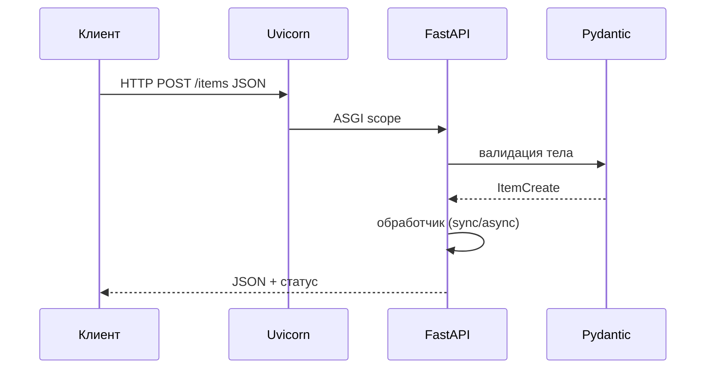

# FastAPI

<div class="article-tags">
  <span class="tag tag-required">ОБЯЗАТЕЛЬНО</span>
  <span class="tag tag-beginner">ДЛЯ НОВИЧКОВ</span>
</div>

<span class="complexity-badge">Разработчику</span>
<span class="complexity-badge">Архитектору</span>

## FastAPI

**FastAPI** — фреймворк для построения HTTP API на Python 3.8+. Он построен поверх **Starlette** (ASGI) и **Pydantic** (валидация данных). Типичные сценарии: REST/JSON-сервисы, микросервисы, бэкенд для SPA и мобильных клиентов.

Пошаговый старт: [Первая программа на FastAPI](./3432.md). Сравнение Flask/Django/FastAPI: [Создание собственного API на Python](./343.md), [Фреймворки и библиотеки Python](./12.md).

---

## Чем FastAPI отличается от Flask и Django

| Критерий | Flask | Django | FastAPI |
|----------|-------|--------|---------|
| Фокус | Веб + API (гибко) | Полноценные сайты | API в первую очередь |
| Валидация | Вручную / расширения | Forms / DRF | Аннотации типов + Pydantic |
| Документация API | Вручную / Swagger-плагины | DRF + drf-spectacular | Swagger UI и ReDoc из коробки |
| Async | Через Quart / 2.x | Django 4.1+ async views | Нативно (ASGI) |
| Админка | Нет | Встроенная | Нет |

FastAPI не заменяет Django там, где нужны админка, шаблоны и «батарейки» для CMS. Он выигрывает там, где контракт API и скорость разработки важнее готовой CMS.

---

## Архитектура запроса



1. **ASGI-сервер** (uvicorn, hypercorn) принимает соединение.
2. **FastAPI** сопоставляет путь с обработчиком.
3. **Pydantic** проверяет query, path, body по типам Python.
4. Ответ сериализуется в JSON; схема попадает в OpenAPI.

---

## Ключевые концепции

### Приложение и маршруты

```python
from fastapi import FastAPI

app = FastAPI(title="Demo API")


@app.get("/health")
def health():
    return {"status": "ok"}
```

### Модели Pydantic

```python
from pydantic import BaseModel, Field


class ItemCreate(BaseModel):
    title: str = Field(min_length=1, max_length=200)
    done: bool = False
```

Ошибки валидации возвращаются как `422 Unprocessable Entity` с понятным JSON — удобно для фронтенда.

### Зависимости (`Depends`)

Общая логика (БД-сессия, текущий пользователь, пагинация) выносится в функции-зависимости и подключается к эндпоинтам без наследования «бог-классов».

### Документация

После запуска доступны:

- `/docs` — Swagger UI;
- `/redoc` — ReDoc;
- `/openapi.json` — машиночитаемая схема.

---

## Экосистема

| Компонент | Назначение |
|-----------|------------|
| **uvicorn** | ASGI-сервер для разработки и production |
| **SQLAlchemy 2 + async** | ORM |
| **Alembic** | Миграции |
| **HTTPX** | Тесты и исходящие запросы |
| **pytest** | Тестирование через `TestClient` |

Подробнее об инструментах: [Экосистема Python-приложений](./121.md).

---

## Когда выбирать FastAPI

- Нужен **чистый JSON API** с автодокументацией.
- Команда уже использует **type hints** и хочет ловить ошибки до runtime.
- Важны **WebSocket** и async I/O (много параллельных запросов к БД и внешним сервисам).
- Планируется связка с **React / Vue / мобильным клиентом**.

Для учебного сайта с HTML-формами и админкой чаще проще [Django](./30.md) или [Flask](./341.md).

---

## Связанные материалы

- [Первая программа на FastAPI](./3432.md)
- [Асинхронность и многопоточность в Python](./29.md)
- [Веб-разработка и REST API на Python](./34.md)

---
