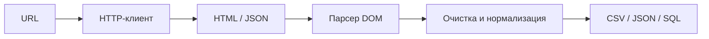
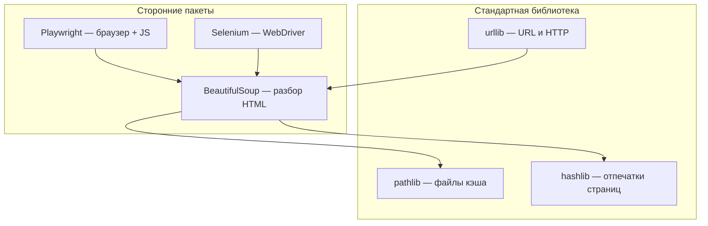
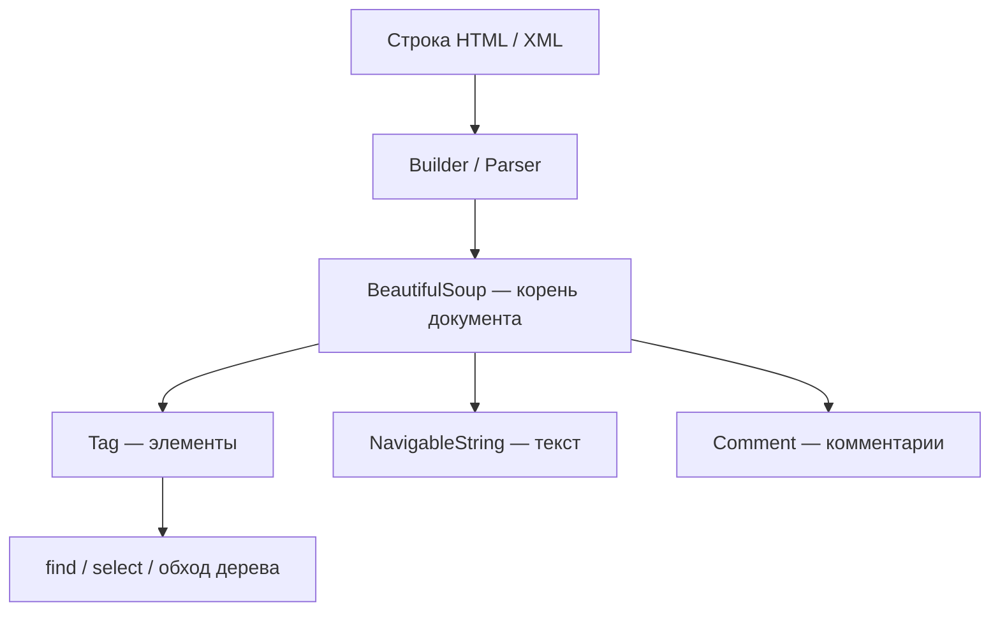
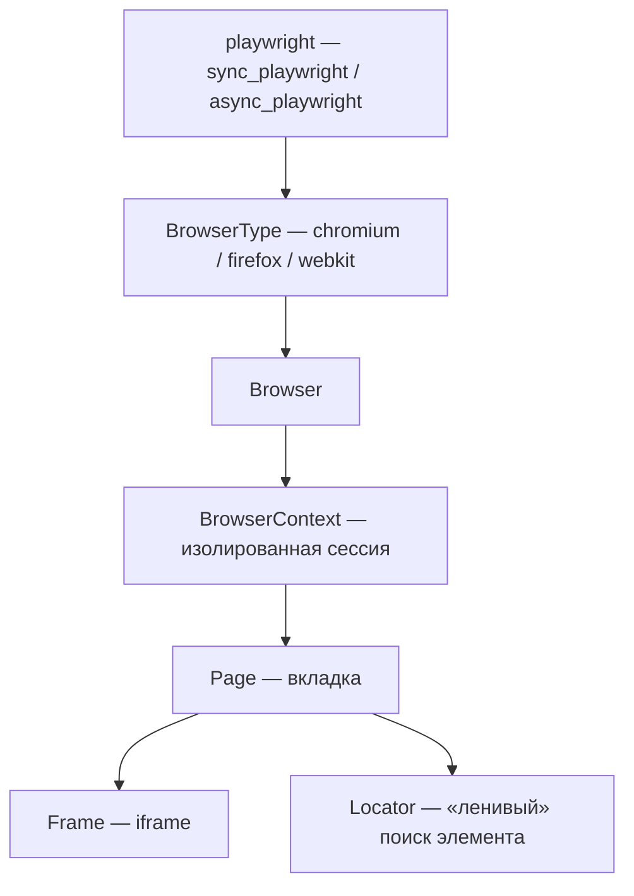
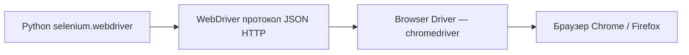

import ExternalCodeEmbed from '@site/src/components/ExternalCodeEmbed';


# Парсинг на Python

<div class="article-tags">
  <span class="tag tag-required">ОБЯЗАТЕЛЬНО</span>
  <span class="tag tag-beginner">ДЛЯ НОВИЧКОВ</span>
</div>

<span class="complexity-badge">Разработчику</span>
<span class="complexity-badge">Архитектору</span>

**Веб-парсинг** (web scraping, иногда говорят «скрапинг») — автоматизированное извлечение данных с веб-ресурсов: страниц, каталогов, лент новостей, маркетплейсов, государственных реестров. На Python это одно из самых популярных прикладных направлений: язык сочетает читаемый синтаксис, богатую экосистему HTTP-клиентов и HTML-парсеров, удобную работу с CSV, JSON и базами данных.

Эта статья — **единый путеводитель**: от теории «что происходит при запросе страницы» до Playwright, Selenium, дельта-парсинга и юридических ограничений. Крупный блок — [архитектура инструментов](#архитектура-инструментов-парсера): `urllib`, `pathlib`, `hashlib`, BeautifulSoup, Playwright и Selenium (модули, классы, методы). Для углублённой работы только с BeautifulSoup см. отдельную [главу про BeautifulSoup](./316.md); здесь — полный контекст вокруг парсинга.

---

## Что такое веб-парсинг и где он применяется

**Парсинг** в широком смысле — разбор структурированного или полуструктурированного текста в удобную для программы форму. **Веб-парсинг** сужает задачу до данных, доступных через HTTP(S): HTML-страницы, XML-ленты, иногда — ответы JSON, которые браузер получает «за кулисами».

Типичные сценарии:

| Область | Пример задачи |
|---------|---------------|
| Аналитика рынка | Сбор цен конкурентов, наличие товаров, история изменений |
| Мониторинг | Отслеживание новостей, вакансий, тендеров, изменений на сайте |
| Исследования | Агрегация открытых данных для отчётов и дашбордов |
| ML и NLP | Корпус текстов для обучения моделей (с соблюдением лицензий) |
| Внутренние инструменты | Миграция контента, инвентаризация ссылок, SEO-аудит |
| Тестирование | Проверка, что публичные страницы отдают ожидаемые данные |

Парсинг **не заменяет** полноценную интеграцию через API, если владелец ресурса предоставляет стабильный интерфейс. Но когда API нет, закрыт или дорог, а данные **публично отображаются** в HTML — парсинг остаётся рабочим инженерным инструментом.

Цепочка «от URL до таблицы в Python» выглядит так:



---

## База: HTTP, веб-страницы, HTML и DOM

Прежде чем писать скрипт, полезно понимать, **что именно** вы скачиваете и **как браузер** это интерпретирует.

| Тема | Где читать в энциклопедии |
|------|----------------------------|
| **HTTP** — методы, заголовки, коды ответа, cookies | [HTTP как основа веб-интеграций](/encyclopedia/2-system-network/2-09-osnovy-integratsionnogo-vzaimodeystviya/118), [HTTP и HTTPS](/encyclopedia/2-system-network/2-03-set-i-internet/11) |
| **Веб-страницы** — клиент, сервер, статика и динамика | [Сайты и веб-сайты](/encyclopedia/2-system-network/2-04-kak-rabotayut-sayty-i-veb-sayty/1), [раздел «Веб-сайты и веб-приложения»](/encyclopedia/2-system-network/2-04-kak-rabotayut-sayty-i-veb-sayty/intro) |
| **HTML** — теги, атрибуты, формы, ссылки | [HTML](/encyclopedia/3-data-markup/3-09-html/1), [раздел HTML](/encyclopedia/3-data-markup/3-09-html/intro) |
| **DOM** — дерево узлов документа | [DOM-дерево](/encyclopedia/3-data-markup/3-09-html/1#dom-derevo) |

Кратко для парсера:

1. **HTTP-запрос** (`GET`, реже `POST`) уходит на сервер с заголовками (`User-Agent`, `Accept`, `Cookie`…).
2. **Ответ** содержит статус (`200`, `404`, `429`…), заголовки и **тело** — чаще всего HTML-текст.
3. Браузер (или библиотека) **разбирает** HTML в **DOM** — иерархию узлов: `html` → `body` → `div` → `a` с атрибутом `href`.
4. **BeautifulSoup**, **lxml** и CSS-селекторы в Playwright работают с этой же логикой дерева, только вне полноценного рендеринга страницы.

<div class="callout callout--tip">
  <div class="callout-title">Основа по протоколу</div>

  <div class="callout-body">
  Базовый разбор HTTP и HTTPS находится в отдельной статье — <a href="/encyclopedia/2-system-network/2-09-osnovy-integratsionnogo-vzaimodeystviya/118">HTTP как основа веб-интеграций</a>.
  </div>
</div>

---

## Статика и динамика: как получить данные с сайта

Не все страницы одинаково «видны» простому `requests.get()`.

### Статический контент

**Статическая страница** — HTML, который сервер отдаёт **целиком** в первом ответе. Все нужные теги уже в `response.text`. Достаточно:

- `requests` или `httpx` — скачать;
- `BeautifulSoup` / `lxml` — разобрать;
- CSS-селекторы или `find` — извлечь поля.

```python
import requests
from bs4 import BeautifulSoup

resp = requests.get("https://httpbin.org/html", timeout=10)
resp.raise_for_status()

soup = BeautifulSoup(resp.text, "lxml")
heading = soup.find("h1")
print(heading.get_text(strip=True) if heading else "")
```

### Динамический контент (JavaScript)

**Динамическая страница** подгружает данные **после** загрузки HTML: через `fetch`/XHR, WebSocket, бесконечную прокрутку. В «сыром» HTML от `requests` карточек товаров может **не быть** — только пустой `<div id="app"></div>`.

Три стратегии:

| Подход | Когда выбирать |
|--------|----------------|
| **Найти скрытый API** | В DevTools → Network виден JSON с теми же данными; быстрее и стабильнее DOM |
| **Headless-браузер** | Нужны клики, скролл, SPA без публичного API — Playwright, Selenium |
| **Готовый рендер-сервис** | Редко; обычно избыточен для учебных проектов |

Признаки динамики: пустой контейнер в View Source, но данные есть во вкладке Elements после загрузки; в Network — запросы к `/api/...` с JSON.

---

## Работа с HTML-разметкой: поиск элементов и обход дерева

**BeautifulSoup** строит дерево объектов из HTML-строки. Пакет: `beautifulsoup4`, импорт `from bs4 import BeautifulSoup`. Подробнее — [BeautifulSoup — парсинг HTML](./316.md).

### Поиск элементов

```python
from bs4 import BeautifulSoup

html = """
<article class="news" data-id="42">
  <h2><a href="/post/1">Заголовок</a></h2>
  <p class="lead">Краткое описание</p>
</article>
"""
soup = BeautifulSoup(html, "lxml")

# По имени тега
title_link = soup.find("a", href=True)

# По классу (class — зарезервированное слово в Python → class_)
lead = soup.find("p", class_="lead")

# CSS-селекторы — как в браузере
headline = soup.select_one("article.news h2 a")
all_news = soup.select("article.news")
```

### Обход дерева

```python
article = soup.find("article")

# Родитель
parent = article.parent

# Прямые потомки
for child in article.children:
    if getattr(child, "name", None):
        print(child.name)

# Соседи
next_tag = article.find_next_sibling()

# Подъём и поиск внутри ветки
price = article.find("span", class_="price")
```

| Метод | Назначение |
|-------|------------|
| `find` / `find_all` | Тег + атрибуты, `class_`, `id` |
| `select` / `select_one` | CSS-селекторы |
| `.parent`, `.children` | Навигация по DOM |
| `find_next`, `find_all_next` | Поиск «вперёд» по документу |

**Совет:** селекторы привязывайте к **семантике** (`article`, `data-id`, роль в layout), а не к случайным классам вроде `css-1x2y3z`, которые меняются при каждой сборке фронтенда.

---

## Извлечение данных: текст, ссылки, изображения, таблицы

### Текст

```python
node = soup.select_one(".product-title")
title = node.get_text(strip=True, separator=" ") if node else ""
```

`strip=True` убирает пробелы по краям; `separator` задаёт разделитель между фрагментами из вложенных тегов.

### Ссылки и абсолютные URL

Относительные `href="/catalog/item"` нужно превратить в полный URL:

```python
from urllib.parse import urljoin

base = "https://shop.example/catalog/"
for a in soup.select("a.product-link"):
    href = a.get("href")
    if href:
        full_url = urljoin(base, href)
        print(full_url)
```

### Изображения

```python
for img in soup.select("img[src]"):
    src = urljoin("https://shop.example", img["src"])
    alt = img.get("alt", "")
```

Атрибут `srcset` и lazy-loading (`data-src`) встречаются на современных сайтах — проверяйте оба.

### Таблицы

```python
import csv

rows = []
table = soup.find("table", class_="prices")
if table:
    for tr in table.select("tbody tr"):
        cells = [td.get_text(strip=True) for td in tr.find_all("td")]
        if cells:
            rows.append(cells)

with open("prices.csv", "w", newline="", encoding="utf-8") as f:
    writer = csv.writer(f)
    writer.writerows(rows)
```

Для сложных таблиц удобнее сразу собирать список словарей и передавать в **pandas** — см. [Анализ данных — pandas](./33.md).

---

## Обработка полученных данных: очистка, преобразование, структурирование

Сырой текст с сайта редко готов к анализу. Типичный пайплайн:

1. **Очистка** — пробелы, неразрывные пробелы `\u00a0`, HTML-сущности.
2. **Нормализация** — цены в `Decimal`, даты в `datetime`, телефоны в единый формат.
3. **Структурирование** — список словарей или `DataFrame`.
4. **Дедупликация** — по URL, SKU, хешу содержимого.

```python
import re
from decimal import Decimal, InvalidOperation

def parse_price(raw: str) -> Decimal | None:
    if not raw:
        return None
    cleaned = re.sub(r"[^\d,.]", "", raw.replace("\u00a0", " "))
    cleaned = cleaned.replace(",", ".")
    try:
        return Decimal(cleaned)
    except InvalidOperation:
        return None

def normalize_record(item: dict) -> dict:
    return {
        "title": (item.get("title") or "").strip(),
        "price": parse_price(item.get("price", "")),
        "url": item.get("url", "").strip(),
    }
```

Регулярные выражения для типовых паттернов — [Regex — готовые паттерны](/lab/Примеры/615). Массовая обработка таблиц — [Pandas — типовые операции](/encyclopedia/3-data-markup/3-11-analiz-dannyh/428).

---

## Пагинация: сбор данных со множества страниц

Каталоги разбиты на страницы: `?page=2`, `/page/3/`, кнопка «Далее», бесконечный скролл.

### Параметр в URL

```python
import time
import requests
from bs4 import BeautifulSoup

BASE = "https://example.com/items"
session = requests.Session()
session.headers.update({"User-Agent": "MyResearchBot/1.0 (+mailto:you@example.com)"})

all_items = []
page = 1

while True:
    resp = session.get(BASE, params={"page": page}, timeout=15)
    resp.raise_for_status()
    soup = BeautifulSoup(resp.text, "lxml")
    cards = soup.select(".item-card")
    if not cards:
        break

    for card in cards:
        name = card.select_one(".name")
        all_items.append({"page": page, "name": name.get_text(strip=True) if name else ""})

    page += 1
    time.sleep(1.0)  # вежливая пауза
```

### Ссылка «Следующая страница»

```python
next_link = soup.select_one("a.pagination-next")
if not next_link or not next_link.get("href"):
    break
url = urljoin(resp.url, next_link["href"])
```

### Ограничения

- Задайте **максимум страниц** в учебных скриптах.
- Логируйте URL и номер страницы — проще воспроизвести сбой.
- При 429 (Too Many Requests) — увеличьте паузу или остановитесь.

---

## Обработка форм: логин, отправка данных, сессии, куки

Многие данные доступны только после входа. HTTP **сессия** сохраняет cookies между запросами — как вкладка браузера.

```python
import requests

session = requests.Session()
session.headers.update({
    "User-Agent": "MyApp/1.0",
    "Accept": "text/html,application/json",
})

# GET формы — иногда нужен CSRF-токен из скрытого input
login_page = session.get("https://example.com/login", timeout=10)
login_page.raise_for_status()

from bs4 import BeautifulSoup
soup = BeautifulSoup(login_page.text, "lxml")
token_input = soup.find("input", {"name": "csrf_token"})
csrf = token_input["value"] if token_input else ""

# POST логина
resp = session.post(
    "https://example.com/login",
    data={
        "username": "user",
        "password": "secret",
        "csrf_token": csrf,
    },
    timeout=10,
)
resp.raise_for_status()

# Дальнейшие запросы идут с cookie сессии
profile = session.get("https://example.com/account/orders", timeout=10)
```

| Понятие | Роль в парсинге |
|---------|-----------------|
| **Session** (`requests.Session`) | Общий jar cookies и заголовков |
| **Cookie** | Идентификатор сессии после логина |
| **CSRF-токен** | Скрытое поле формы — без него POST отклонят |
| **OAuth / JWT** | Часто проще получить токен через официальный API, чем эмулировать браузер |

Теория cookies в вебе — [Cookie](/encyclopedia/2-system-network/2-03-set-i-internet/7). **Никогда** не храните пароли в коде — используйте переменные окружения; см. [зависимости и venv](./39.md).

---

## Рендеринг JavaScript: работа с динамическим контентом

Когда `requests` возвращает пустой каркас, нужен **движок браузера**, который выполнит JS и построит итоговый DOM.

Общая схема:

1. Запустить Chromium/Firefox (headless или с UI).
2. Открыть URL, дождаться селектора или сетевого запроса.
3. Прочитать `page.content()` или данные из DOM / перехваченного API.
4. Закрыть браузер.

Сравнение инструментов — в разделах [Playwright](#playwright) и [Selenium](#selenium) ниже. Для крупных проектов смотрите также **Scrapy** + **scrapy-splash** в [экосистеме Python](./36.md).

**Альтернатива:** открыть DevTools → Network, найти XHR к `api.example.com/v1/products` и вызывать его напрямую через `requests` с теми же заголовками — часто быстрее headless-браузера.

---

## Имитация поведения пользователя: задержки, заголовки, прокси

Сайты различают ботов по частоте запросов, отсутствию `User-Agent`, подозрительным IP.

### Задержки и повторы

```python
import random
import time
import requests
from requests.adapters import HTTPAdapter
from urllib3.util.retry import Retry

def polite_get(url: str, session: requests.Session) -> requests.Response:
    time.sleep(random.uniform(0.8, 2.0))
    resp = session.get(url, timeout=15)
    if resp.status_code == 429:
        time.sleep(5)
        resp = session.get(url, timeout=15)
    resp.raise_for_status()
    return resp

session = requests.Session()
session.headers["User-Agent"] = (
    "ResearchBot/1.0 (educational; +https://yoursite.example/bot)"
)

retry = Retry(total=3, backoff_factor=1, status_forcelist=[502, 503, 504])
session.mount("https://", HTTPAdapter(max_retries=retry))
```

### Заголовки

Минимальный набор: осмысленный `User-Agent`, `Accept-Language`, при необходимости `Referer`. Подделка «чужого» браузера без необходимости — плохая практика и может нарушать правила площадки.

### Прокси

Прокси меняют исходящий IP — используют при легитимной распределённой нагрузке или доступе из нужного региона. Прокси **не отменяют** robots.txt и пользовательское соглашение.

---

## Работа с API: альтернатива парсингу HTML

Если у ресурса есть **документированный REST или GraphQL API**, предпочитайте его:

| Критерий | HTML-парсинг | API |
|----------|--------------|-----|
| Стабильность | Вёрстка меняется | Версионирование, схема |
| Скорость | Тяжелее (HTML) | Легче (JSON) |
| Легальность | Серая зона | Явное разрешение в ToS |
| Авторизация | Эмуляция форм | Ключи, OAuth |

```python
import requests

API_KEY = "..."  # из переменной окружения
resp = requests.get(
    "https://api.example.com/v1/products",
    headers={"Authorization": f"Bearer {API_KEY}"},
    params={"limit": 100, "offset": 0},
    timeout=10,
)
resp.raise_for_status()
products = resp.json()["items"]
```

Клиентский HTTP в Python — [Веб-разработка и REST API](./34.md), [глава 31](./31.md). Публичные open data часто отдают CSV/JSON без HTML вовсе.

---

## Асинхронный и многопоточный парсинг

Сетевой парсинг — типичная **I/O-bound** задача: процессор ждёт ответа сервера. Подробная теория — [Асинхронность и многопоточность](./29.md).

| Модель | Инструмент | Когда |
|--------|------------|-------|
| Последовательно | `requests` + цикл | Мало URL, учёба, вежливость к серверу |
| Потоки | `concurrent.futures.ThreadPoolExecutor` | Много синхронных `requests` (GIL отпускается на I/O) |
| Async | `httpx` / `aiohttp` + `asyncio` | Сотни одновременных запросов к разным хостам |
| Процессы | `multiprocessing` | Тяжёлый разбор HTML после загрузки (CPU-bound) |

```python
import asyncio
import httpx

URLS = [
    "https://httpbin.org/html",
    "https://httpbin.org/robots.txt",
]

async def fetch(client: httpx.AsyncClient, url: str) -> str:
    r = await client.get(url, timeout=10.0)
    r.raise_for_status()
    return r.text[:200]

async def main():
    async with httpx.AsyncClient() as client:
        tasks = [fetch(client, u) for u in URLS]
        results = await asyncio.gather(*tasks, return_exceptions=True)
        for url, result in zip(URLS, results):
            print(url, "OK" if isinstance(result, str) else result)

asyncio.run(main())
```

**Осторожно:** параллельные запросы к **одному** сайту умножают нагрузку. Ограничивайте concurrency (`asyncio.Semaphore(3)`) и соблюдайте паузы.

---

## Сохранение данных: CSV, JSON, базы данных (SQL)

### CSV

```python
import csv

with open("output.csv", "w", newline="", encoding="utf-8") as f:
    writer = csv.DictWriter(f, fieldnames=["title", "price", "url"])
    writer.writeheader()
    writer.writerows(records)
```

### JSON

```python
import json

with open("output.json", "w", encoding="utf-8") as f:
    json.dump(records, f, ensure_ascii=False, indent=2)
```

### SQL

```python
import sqlite3

conn = sqlite3.connect("scrape.db")
conn.execute("""
    CREATE TABLE IF NOT EXISTS products (
        id INTEGER PRIMARY KEY AUTOINCREMENT,
        title TEXT NOT NULL,
        price REAL,
        url TEXT UNIQUE,
        scraped_at TEXT
    )
""")
conn.executemany(
    "INSERT OR IGNORE INTO products (title, price, url, scraped_at) VALUES (?, ?, ?, ?)",
    [(r["title"], float(r["price"] or 0), r["url"], r["scraped_at"]) for r in records],
)
conn.commit()
conn.close()
```

PostgreSQL, ORM, миграции — [Работа с базами данных в Python](./314.md). Файлы и кодировки — [глава 31](./31.md), [примеры в Lab](/lab/Примеры/1126).

---

## Обработка ошибок и исключений при парсинге

Парсер живёт в «грязном» мире: таймауты, 500-е, обрыв разметки, смена вёрстки.

```python
import logging
import requests
from bs4 import BeautifulSoup

logging.basicConfig(level=logging.INFO)
log = logging.getLogger("scraper")

def scrape_page(url: str) -> list[dict]:
    try:
        resp = requests.get(url, timeout=15)
        resp.raise_for_status()
    except requests.Timeout:
        log.error("Таймаут: %s", url)
        return []
    except requests.HTTPError as e:
        log.error("HTTP %s: %s", e.response.status_code, url)
        return []
    except requests.RequestException as e:
        log.error("Сеть: %s — %s", url, e)
        return []

    soup = BeautifulSoup(resp.text, "lxml")
    items = []
    for card in soup.select(".item"):
        try:
            title_el = card.select_one(".title")
            price_el = card.select_one(".price")
            items.append({
                "title": title_el.get_text(strip=True) if title_el else "",
                "price": price_el.get_text(strip=True) if price_el else "",
            })
        except Exception as e:
            log.warning("Карточка пропущена на %s: %s", url, e)
    return items
```

| Ситуация | Действие |
|----------|----------|
| 404 | Не повторять бесконечно; пометить URL как мёртвый |
| 429 | Exponential backoff, снизить параллелизм |
| Изменился селектор | Пустые поля + алерт; версионируйте парсер |
| Невалидный HTML | Парсер `lxml` или `html5lib` |

Общая теория исключений — [обработка исключений](./28.md).

---

## Соблюдение правил сайта: robots.txt и ограничение нагрузки

**robots.txt** — файл на сайте с рекомендациями для роботов (какие пути обходить, задержка `Crawl-delay` у некоторых движков).

```python
from urllib import robotparser
from urllib.parse import urlparse

def allowed(url: str, user_agent: str = "MyBot") -> bool:
    parsed = urlparse(url)
    robots_url = f"{parsed.scheme}://{parsed.netloc}/robots.txt"
    rp = robotparser.RobotFileParser()
    rp.set_url(robots_url)
    try:
        rp.read()
        return rp.can_fetch(user_agent, url)
    except OSError:
        return False  # осторожно: при недоступности robots — не считать разрешением всего

if allowed("https://example.com/catalog"):
    # загрузка
    pass
```

Практики «вежливого» скрапинга:

- идентифицируйте бота в `User-Agent` (имя + контакт);
- пауза 1–3 с между запросами к одному хосту;
- кэшируйте уже скачанные страницы при разработке;
- не обходите CAPTCHA и paywall без явного права;
- при сомнении — запросите разрешение у владельца ресурса.

---

## Юридические и этические аспекты парсинга

Техническая возможность скачать страницу **не равна** праву использовать данные как угодно.

Учитывайте:

- **Пользовательское соглашение** (Terms of Service) — может запрещать автоматический сбор.
- **Авторское право** — тексты, фото, уникальные описания защищены; факты (цена, название) — в другой правовой категории, зависит от юрисдикции.
- **Персональные данные** (GDPR, 152-ФЗ и аналоги) — ФИО, email, телефоны без законного основания собирать нельзя.
- **Компьютерное мошенничество** — обход технических барьеров (взлом, подбор паролей) — уголовные риски в ряде стран.

Этичный подход: собирать **минимум** нужных полей, хранить безопасно, указывать источник в отчётах, для коммерции — получать лицензию или использовать API.

---

## Мониторинг изменений на сайте: дельта-парсинг

**Дельта-парсинг** — повторный обход с фиксацией **только изменений** с прошлого запуска.

```python
import hashlib
import json
from pathlib import Path

STATE_FILE = Path("state.json")

def content_hash(html: str) -> str:
    return hashlib.sha256(html.encode("utf-8")).hexdigest()

def load_state() -> dict:
    if STATE_FILE.exists():
        return json.loads(STATE_FILE.read_text(encoding="utf-8"))
    return {}

def save_state(state: dict) -> None:
    STATE_FILE.write_text(json.dumps(state, indent=2), encoding="utf-8")

def check_url(url: str, html: str) -> bool:
    state = load_state()
    h = content_hash(html)
    prev = state.get(url)
    changed = prev is not None and prev != h
    state[url] = h
    save_state(state)
    return changed
```

Уровни детализации:

- хеш всей страницы — грубо, срабатывает на баннеры;
- хеш блока `.main-content` — точечнее;
- сравнение полей в БД (`price`, `stock`) — для каталогов.

Уведомления об изменениях — email, Telegram, webhook; см. примеры интеграций в [главе 34](./34.md).

---

## Валидация и проверка качества собранных данных

После парсинга проверьте:

```python
from pydantic import BaseModel, HttpUrl, field_validator

class Product(BaseModel):
    title: str
    price: float | None = None
    url: HttpUrl

    @field_validator("title")
    @classmethod
    def title_not_empty(cls, v: str) -> str:
        v = v.strip()
        if len(v) < 2:
            raise ValueError("слишком короткий заголовок")
        return v

def validate_batch(raw: list[dict]) -> tuple[list[Product], list[dict]]:
    ok, bad = [], []
    for row in raw:
        try:
            ok.append(Product(**row))
        except Exception as e:
            bad.append({"row": row, "error": str(e)})
    return ok, bad
```

Метрики качества:

- доля пустых обязательных полей;
- число дубликатов по `url`;
- резкие скачки количества записей (сломался селектор);
- сравнение с эталонной выборкой вручную.

Pydantic в проектах — [Pydantic — входящие данные](./41.md).

---

## Сбор и анализ данных с веб-ресурса: сквозной пример

Соберём мини-проект: каталог → нормализация → CSV → простая аналитика.

```python
import csv
import time
from datetime import datetime, timezone
from urllib.parse import urljoin

import requests
from bs4 import BeautifulSoup

BASE = "https://httpbin.org/html"
session = requests.Session()
session.headers["User-Agent"] = "TutorialBot/1.0"

resp = session.get(BASE, timeout=10)
resp.raise_for_status()
soup = BeautifulSoup(resp.text, "lxml")

records = []
for heading in soup.find_all("h1"):
    records.append({
        "title": heading.get_text(strip=True),
        "source": resp.url,
        "scraped_at": datetime.now(timezone.utc).isoformat(),
    })

# Аналитика: сколько записей, уникальные заголовки
unique_titles = {r["title"] for r in records if r["title"]}
print(f"Записей: {len(records)}, уникальных заголовков: {len(unique_titles)}")

with open("scrape_result.csv", "w", newline="", encoding="utf-8") as f:
    writer = csv.DictWriter(f, fieldnames=["title", "source", "scraped_at"])
    writer.writeheader()
    writer.writerows(records)
```

На реальном каталоге добавьте пагинацию, валидацию, БД и расписание (**cron**, **Celery**, GitHub Actions). Анализ в pandas: группировки, динамика цен, визуализация — [Matplotlib](./319.md), [pandas](./33.md).

---

## Архитектура инструментов парсера

Ниже — **внутренности** библиотек, которые чаще всего составляют стек парсера: три модуля **стандартной библиотеки** (`urllib`, `pathlib`, `hashlib`) и три внешних пакета (`beautifulsoup4`, `playwright`, `selenium`). Понимание их слоёв помогает выбирать правильный инструмент на каждом этапе пайплайна.



| Библиотека | Тип | Роль в парсинге |
|------------|-----|-----------------|
| `urllib` | stdlib | URL, простой HTTP, robots.txt |
| `pathlib` | stdlib | Пути к кэшу, дампам, логам |
| `hashlib` | stdlib | Дельта-парсинг, дедупликация |
| `beautifulsoup4` | PyPI | DOM-дерево из HTML-строки |
| `playwright` | PyPI | Рендер JS, автоматизация браузера |
| `selenium` | PyPI | WebDriver, legacy и корпоративные стеки |

---

### urllib — URL, HTTP и robots.txt

Пакет **`urllib`** входит в стандартную библиотеку Python и разбит на подмодули. Для парсинга важны четыре из них.

#### `urllib.parse` — разбор и сборка URL

Функции работают со **строками**, не открывают сеть сами по себе.

| Функция / класс | Назначение |
|-----------------|------------|
| `urlparse(url)` | Разбивает URL на `scheme`, `netloc`, `path`, `params`, `query`, `fragment` |
| `urlunparse(parts)` | Собирает URL обратно из кортежа |
| `urljoin(base, relative)` | Превращает `/item/1` в полный URL относительно базы |
| `urlencode(query_dict)` | Строит строку запроса `a=1&b=2` |
| `quote(s)` / `unquote(s)` | Кодирование спецсимволов в path и query |
| `parse_qs(qs)` | Разбор `?page=2&sort=price` в словарь списков |

```python
from urllib.parse import urlparse, urljoin, urlencode, parse_qs

parsed = urlparse("https://shop.example/catalog/laptops?page=2&utm=ads#top")
print(parsed.scheme)   # https
print(parsed.netloc)   # shop.example
print(parsed.path)     # /catalog/laptops
print(parse_qs(parsed.query))  # {'page': ['2'], 'utm': ['ads']}

next_page = urljoin("https://shop.example/catalog/", "laptops?page=3")
print(next_page)  # https://shop.example/catalog/laptops?page=3

api_url = "https://api.example/search?" + urlencode({"q": "ноутбук", "limit": 50})
```

**`ParseResult`** — именованный кортель (`parsed.hostname`, `parsed.port`). Удобно извлекать домен для проверки robots.txt или ограничения crawl по хосту.

#### `urllib.request` — минимальный HTTP-клиент

Низкоуровневый слой: без сессий и cookies «из коробки», как у `requests`, но **без зависимостей**.

| Класс / функция | Назначение |
|----------------|------------|
| `urlopen(url, timeout=...)` | GET-запрос; возвращает объект с `.read()`, `.status`, `.headers` |
| `Request(url, data=..., headers=..., method=...)` | Настраиваемый запрос (POST, заголовки) |
| `build_opener()` + handlers | Цепочка обработчиков: редиректы, cookies, прокси |
| `HTTPCookieProcessor` | Хранение cookies между запросами в `CookieJar` |
| `ProxyHandler({'http': '...'})` | Прокси |

```python
import json
from urllib.request import Request, urlopen
from urllib.error import HTTPError, URLError

req = Request(
    "https://httpbin.org/get",
    headers={"User-Agent": "StdlibBot/1.0"},
    method="GET",
)

try:
    with urlopen(req, timeout=10) as resp:
        body = resp.read().decode(resp.headers.get_content_charset() or "utf-8")
        data = json.loads(body)
        print(data["headers"]["User-Agent"])
except HTTPError as e:
    print("HTTP", e.code, e.reason)
except URLError as e:
    print("Сеть:", e.reason)
```

POST с form-data:

```python
from urllib.parse import urlencode
from urllib.request import Request, urlopen

payload = urlencode({"username": "demo", "password": "secret"}).encode()
req = Request("https://httpbin.org/post", data=payload, method="POST")
with urlopen(req, timeout=10) as resp:
    print(resp.status)
```

В продакшене чаще берут **requests** или **httpx** — они удобнее. `urllib.request` полезен, когда нельзя ставить зависимости, или для узких задач внутри stdlib (например, только `robotparser` + один `urlopen`).

#### `urllib.robotparser` — разбор robots.txt

Класс **`RobotFileParser`**:

| Метод | Описание |
|-------|----------|
| `set_url(url)` | Адрес файла robots |
| `read()` | Загрузить и разобрать |
| `can_fetch(useragent, path)` | Разрешён ли путь для данного агента |
| `mtime()` | Время последнего чтения (если доступно) |

```python
from urllib import robotparser
from urllib.parse import urlparse

def crawl_allowed(url: str, agent: str = "MyBot") -> bool:
    p = urlparse(url)
    rp = robotparser.RobotFileParser()
    rp.set_url(f"{p.scheme}://{p.netloc}/robots.txt")
    rp.read()
    return rp.can_fetch(agent, p.path or "/")
```

#### `urllib.error` — исключения

- **`URLError`** — сеть недоступна, DNS, таймаут на уровне сокета.
- **`HTTPError`** — подкласс `URLError` с атрибутами `.code`, `.reason`, `.headers`; его можно ловить как HTTP 404/500.

---

### pathlib — пути к кэшу, дампам и состоянию

Модуль **`pathlib`** (Python 3.4+) даёт объект **`Path`** вместо конкатенации строк `os.path.join`. В парсере им описывают каталоги кэша HTML, файлы `state.json`, ротацию логов.

#### Класс `Path`

Создание:

```python
from pathlib import Path

root = Path("scraper_data")           # относительный путь
cache = Path("/var/cache/scraper")    # абсолютный (Unix)
here = Path(__file__).resolve().parent  # каталог текущего скрипта
```

| Метод / свойство | Назначение в парсинге |
|------------------|----------------------|
| `exists()`, `is_file()`, `is_dir()` | Проверка перед чтением кэша |
| `mkdir(parents=True, exist_ok=True)` | Создать `cache/2025/06/` |
| `read_text(encoding="utf-8")` | Прочитать сохранённый HTML |
| `write_text(text, encoding="utf-8")` | Сохранить страницу в кэш |
| `read_bytes()` / `write_bytes()` | Бинарные дампы, скриншоты |
| `glob("*.html")` | Все HTML в каталоге |
| `rglob("*.json")` | Рекурсивный поиск state-файлов |
| `iterdir()` | Обход соседних файлов |
| `with_name("out.csv")` | Тот же каталог, другое имя |
| `with_suffix(".bak")` | Смена расширения |
| `/` оператор | `root / "pages" / f"{page_id}.html"` |

Пример — кэш страниц и идемпотентный повторный запуск:

```python
from hashlib import sha256
from pathlib import Path

CACHE = Path("cache/pages")
CACHE.mkdir(parents=True, exist_ok=True)

def cache_path(url: str) -> Path:
    digest = sha256(url.encode()).hexdigest()[:16]
    return CACHE / f"{digest}.html"

def load_or_fetch(url: str, fetcher) -> str:
    path = cache_path(url)
    if path.exists():
        return path.read_text(encoding="utf-8")
    html = fetcher(url)
    path.write_text(html, encoding="utf-8")
    return html
```

**`PurePath`** / **`WindowsPath`** / **`PosixPath`** — логика пути без обращения к диску; полезно для unit-тестов.

---

### hashlib — отпечатки контента и дельта-парсинг

Модуль **`hashlib`** реализует криптографические хеш-функции. В парсинге они не для безопасности, а для **быстрого сравнения**: изменилась ли страница, видели ли мы этот URL, есть ли дубликат записи.

#### Основные функции и объекты

| Имя | Назначение |
|-----|------------|
| `hashlib.md5()` | 128 бит; быстрый, но слабый — только для некритичного кэша |
| `hashlib.sha256()` | 256 бит; стандарт для отпечатков контента |
| `hashlib.blake2b()` | Быстрый современный хеш |
| `hashlib.new("sha256")` | Фабрика по имени алгоритма |
| `.update(chunk)` | Подать данные по частям (большие файлы) |
| `.hexdigest()` | Строка из hex-символов |
| `.digest()` | Сырые байты |

```python
import hashlib

def fingerprint(text: str) -> str:
    h = hashlib.sha256()
    h.update(text.encode("utf-8"))
    return h.hexdigest()

# Потоковый хеш файла дампа
def file_hash(path) -> str:
    h = hashlib.sha256()
    with open(path, "rb") as f:
        for chunk in iter(lambda: f.read(65536), b""):
            h.update(chunk)
    return h.hexdigest()
```

Хеш **фрагмента DOM** (стабильнее, чем вся страница с баннерами):

```python
from bs4 import BeautifulSoup

def main_block_hash(html: str) -> str | None:
    soup = BeautifulSoup(html, "lxml")
    block = soup.select_one("main#content")
    if not block:
        return None
    normalized = block.get_text(" ", strip=True)
    return hashlib.sha256(normalized.encode()).hexdigest()
```

**`hashlib.compare_digest(a, b)`** — сравнение отпечатков без timing-атак (актуально для токенов, не для цен каталога).

---

### BeautifulSoup — объектная модель HTML

Пакет **`beautifulsoup4`** (импорт `bs4`) — самый распространённый парсер HTML в Python. Он **не качает** страницы: принимает строку или файл и строит **дерево Python-объектов**, похожее на DOM.

#### Слои архитектуры



1. **Builder** (парсер) — `html.parser` (stdlib), `lxml`, `html5lib` — превращает текст в дерево.
2. **`BeautifulSoup`** — корневой узел документа; на нём же вызывают `find` и `select`.
3. **`Tag`** — элемент с именем тега и атрибутами.
4. **`NavigableString`** — текстовый узел внутри тега.
5. **`Comment`** — узел `<!-- ... -->`.

#### Класс `BeautifulSoup`

```python
from bs4 import BeautifulSoup

soup = BeautifulSoup(markup, "lxml", from_encoding="utf-8")
```

| Параметр | Смысл |
|----------|--------|
| `markup` | str, bytes или открытый файл |
| второй аргумент | имя парсера: `"html.parser"`, `"lxml"`, `"html5lib"` |
| `from_encoding` | подсказка кодировки при bytes |

Полезные методы **корня** (`soup`):

| Метод | Возвращает |
|-------|------------|
| `find(name, attrs, **kwargs)` | Первый `Tag` или `None` |
| `find_all(..., limit=n)` | Список всех совпадений |
| `select("css")` | Список по CSS-селектору |
| `select_one("css")` | Один элемент или `None` |
| `get_text(separator, strip)` | Весь текст документа |
| `prettify()` | HTML с отступами — отладка |
| `decode()` | Сериализация обратно в строку |

#### Класс `Tag` — элемент разметки

```python
tag = soup.find("a", href=True)
```

| Атрибут / метод | Описание |
|-----------------|----------|
| `.name` | Имя тега: `"div"`, `"a"` |
| `.attrs` | Словарь атрибутов `{"class": ["item"], "href": "/x"}` |
| `tag["href"]` | Доступ к атрибуту (KeyError если нет) |
| `tag.get("href")` | Безопасный доступ |
| `.string` | Прямой текстовый потомок (если один) |
| `.text` / `.get_text()` | Конкатенация текста потомков |
| `.parent` | Родительский `Tag` |
| `.children` / `.descendants` | Прямые / все потомки |
| `.next_sibling` / `.previous_sibling` | Соседи в дереве |
| `.find()` / `.select()` | Поиск внутри поддерева |
| `tag.has_attr("class")` | Проверка атрибута |
| `tag.decompose()` | Удалить узел из дерева |

**`class_`** — в `find` слово `class` зарезервировано в Python, поэтому класс CSS ищут так:

```python
soup.find("div", class_="product-card")
soup.find("div", class_=["card", "featured"])  # оба класса
soup.find("div", {"data-sku": "42"})
```

#### `NavigableString` и фильтрация

```python
from bs4 import NavigableString, Comment

for node in soup.descendants:
    if isinstance(node, Comment):
        continue
    if isinstance(node, NavigableString):
        text = str(node).strip()
        if text:
            print(repr(text))
```

#### Поиск: `find` vs CSS

```python
# По имени и атрибутам
soup.find_all("a", href=True, limit=10)

# Регулярное выражение в имени тега
import re
soup.find_all(re.compile(r"^h[1-3]$"))

# CSS — как в DevTools
soup.select("article.post > h2 a[rel='bookmark']")
soup.select_one("#main .price")
```

#### Изменение дерева (редко в парсинге, чаще в генерации отчётов)

```python
new_tag = soup.new_tag("span", **{"class": "badge"})
new_tag.string = "NEW"
soup.find("h1").append(new_tag)
```

#### Пример — полный мини-парсер на BeautifulSoup

```python
from bs4 import BeautifulSoup
from urllib.parse import urljoin

def parse_catalog(html: str, base_url: str) -> list[dict]:
    soup = BeautifulSoup(html, "lxml")
    items = []
    for card in soup.select("div.product-card"):
        title_el = card.select_one("h3.title")
        price_el = card.select_one("[data-price]")
        link_el = card.select_one("a[href]")
        items.append({
            "title": title_el.get_text(strip=True) if title_el else "",
            "price": price_el.get("data-price") if price_el else None,
            "url": urljoin(base_url, link_el["href"]) if link_el and link_el.get("href") else None,
        })
    return [x for x in items if x["title"]]
```

Углублённая глава только по BeautifulSoup — [BeautifulSoup — парсинг HTML](./316.md).

---

### Playwright — браузерная автоматизация

**Playwright** (Microsoft) управляет **реальными** движками Chromium, Firefox и WebKit через собственный протокол (не классический WebDriver). Python-биндинги — пакет `playwright` с двумя фасадами API.

#### Модули Python

| Модуль | Когда использовать |
|--------|-------------------|
| `playwright.sync_api` | Скрипты, Jupyter, простые краулеры |
| `playwright.async_api` | `asyncio`, высокий параллелизм |

Точка входа:

```python
from playwright.sync_api import sync_playwright
from playwright.async_api import async_playwright
```

#### Иерархия объектов



| Класс | Ответственность |
|-------|-----------------|
| **`Playwright`** | Фабрика `chromium`, `firefox`, `webkit` |
| **`BrowserType`** | `.launch()`, `.launch_persistent_context()` |
| **`Browser`** | Процесс браузера; `.new_context()`, `.close()` |
| **`BrowserContext`** | Cookies, storage, permissions; `.new_page()` |
| **`Page`** | Навигация, DOM, сеть, скриншоты |
| **`Frame`** | Документ внутри iframe |
| **`Locator`** | Устойчивый поиск с авто-ожиданием |
| **`Request` / `Response`** | Объекты сетевого перехвата |

#### `BrowserType.launch()` — ключевые параметры

```python
browser = p.chromium.launch(
    headless=True,
    slow_mo=50,           # задержка между действиями, мс
    proxy={"server": "http://proxy:8080"},
    args=["--disable-dev-shm-usage"],
)
```

#### `BrowserContext` — сессия как у пользователя

```python
context = browser.new_context(
    user_agent="ResearchBot/1.0",
    locale="ru-RU",
    viewport={"width": 1280, "height": 720},
    storage_state="auth.json",  # загрузить cookies
)
page = context.new_page()
# после логина:
context.storage_state(path="auth.json")
```

#### Класс `Page` — основные методы для парсинга

| Метод | Назначение |
|-------|------------|
| `goto(url, wait_until=..., timeout=...)` | Переход; `wait_until`: `load`, `domcontentloaded`, `networkidle` |
| `content()` | HTML после выполнения JS |
| `title()` | Заголовок вкладки |
| `url` | Текущий URL (свойство) |
| `wait_for_selector(sel, state=...)` | Ждать элемент: `attached`, `visible`, `hidden` |
| `query_selector` / `query_selector_all` | Разовый поиск без retry |
| `locator("css")` | Рекомендуемый API с авто-ожиданием |
| `evaluate(js)` / `evaluate_handle` | Выполнить JS в странице |
| `eval_on_selector_all(sel, js)` | JS над списком узлов |
| `route(pattern, handler)` | Перехват запросов |
| `on("response", handler)` | Слушатель ответов API |
| `screenshot(path=...)` | Снимок страницы |
| `pdf(path=...)` | PDF (Chromium) |
| `close()` | Закрыть вкладку |

Синхронный пример парсинга:

```python
from playwright.sync_api import sync_playwright

with sync_playwright() as p:
    browser = p.chromium.launch(headless=True)
    page = browser.new_page()
    page.goto("https://example.com", wait_until="networkidle", timeout=30000)
    page.wait_for_selector(".product-list .item", timeout=15000)

    items = page.eval_on_selector_all(
        ".product-list .item",
        """els => els.map(el => ({
            title: el.querySelector('.title')?.innerText?.trim() ?? '',
            price: el.querySelector('.price')?.innerText?.trim() ?? ''
        }))""",
    )
    browser.close()
```

#### `Locator` — предпочтительный способ кликов и чтения

```python
page.locator(".product-list .item").first.wait_for()
for card in page.locator(".product-list .item").all():
    title = card.locator(".title").inner_text()
    price = card.locator(".price").inner_text()
```

Методы локатора: `.click()`, `.fill(text)`, `.inner_text()`, `.get_attribute(name)`, `.count()`.

#### Перехват API вместо DOM

```python
def handle(route, request):
    if "/api/products" in request.url:
        response = route.fetch()
        data = response.json()
        print(len(data.get("items", [])))
    route.continue_()

page.route("**/*", handle)
page.goto("https://spa-shop.example")
```

#### Асинхронный API

```python
import asyncio
from playwright.async_api import async_playwright

async def scrape(url: str) -> str:
    async with async_playwright() as p:
        browser = await p.chromium.launch()
        page = await browser.new_page()
        await page.goto(url, wait_until="domcontentloaded")
        html = await page.content()
        await browser.close()
        return html

asyncio.run(scrape("https://example.com"))
```

См. [основы asyncio](./291.md). Playwright обычно **стабильнее Selenium** на новых проектах: встроенные браузеры, авто-ожидания, единый API для Chromium/Firefox/WebKit.

---

### Selenium — W3C WebDriver

**Selenium** реализует стандарт **W3C WebDriver**: ваш Python-код отправляет команды драйверу (ChromeDriver, GeckoDriver), драйвер управляет браузером. Архитектура старше Playwright, но широко распространена в enterprise и тестовых фреймворках.

#### Слои



#### Пакет `selenium` — основные подмодули

| Подмодуль | Содержимое |
|-----------|------------|
| `selenium.webdriver` | `Chrome`, `Firefox`, `Edge`, `Remote` |
| `selenium.webdriver.common.by` | Enum **`By`**: `ID`, `CSS_SELECTOR`, `XPATH`, … |
| `selenium.webdriver.common.keys` | **`Keys`**: `ENTER`, `CONTROL`, … |
| `selenium.webdriver.support.ui` | **`WebDriverWait`**, **`Select`** (для `<select>`) |
| `selenium.webdriver.support` | **`expected_conditions`** (EC) |
| `selenium.webdriver.chrome.options` | **`Options`** для Chromium |
| `selenium.webdriver.chrome.service` | **`Service`** — путь к драйверу |
| `selenium.common.exceptions` | `TimeoutException`, `NoSuchElementException`, … |

#### Класс `WebDriver` (например, `webdriver.Chrome`)

| Метод | Назначение |
|-------|------------|
| `get(url)` | Открыть URL |
| `current_url` | Текущий адрес |
| `title` | Заголовок |
| `page_source` | HTML после JS (как `content()` в Playwright) |
| `find_element(By.CSS_SELECTOR, sel)` | Один элемент |
| `find_elements(...)` | Список элементов |
| `execute_script(js, *args)` | Выполнить JavaScript |
| `get_cookies()` / `add_cookie(...)` | Работа с cookies |
| `implicitly_wait(seconds)` | Неявное ожидание поиска (глобально) |
| `quit()` | Закрыть браузер и драйвер |
| `close()` | Закрыть текущую вкладку |

```python
from selenium import webdriver
from selenium.webdriver.common.by import By

driver = webdriver.Chrome()
driver.get("https://example.com")
html = driver.page_source
driver.quit()
```

#### Класс `WebElement`

Результат `find_element`:

| Атрибут / метод | Описание |
|-----------------|----------|
| `.text` | Видимый текст |
| `.get_attribute("href")` | Значение атрибута |
| `.is_displayed()`, `.is_enabled()` | Состояние |
| `.find_element(...)` | Поиск внутри элемента |
| `.click()`, `.send_keys("...")` | Действия пользователя |
| `.screenshot("el.png")` | Снимок элемента |

#### `By` — стратегии поиска

```python
from selenium.webdriver.common.by import By

driver.find_element(By.ID, "main")
driver.find_element(By.CSS_SELECTOR, ".product-list .item")
driver.find_element(By.XPATH, "//h2[@class='title']/a")
driver.find_element(By.LINK_TEXT, "Каталог")
driver.find_element(By.PARTIAL_LINK_TEXT, "Катал")
```

#### Явные ожидания — `WebDriverWait` + `expected_conditions`

В отличие от Playwright, **авто-ожидание не везде по умолчанию** — для динамики нужен явный wait:

```python
from selenium.webdriver.support.ui import WebDriverWait
from selenium.webdriver.support import expected_conditions as EC

wait = WebDriverWait(driver, 15)
items = wait.until(
    EC.presence_of_all_elements_located((By.CSS_SELECTOR, ".product-list .item"))
)
for card in items:
    title = card.find_element(By.CSS_SELECTOR, ".title").text
    print(title.strip())
```

Частые предикаты EC: `visibility_of_element_located`, `element_to_be_clickable`, `text_to_be_present_in_element`, `url_contains`.

#### `Options` и headless

```python
from selenium import webdriver
from selenium.webdriver.chrome.options import Options

options = Options()
options.add_argument("--headless=new")
options.add_argument("--window-size=1920,1080")
options.page_load_strategy = "eager"  # не ждать все картинки

driver = webdriver.Chrome(options=options)
```

Selenium 4+ через **Selenium Manager** часто сам подбирает драйвер; иначе задают `Service(executable_path=...)`.

#### Формы и `Select`

```python
from selenium.webdriver.support.ui import Select

select_el = driver.find_element(By.ID, "category")
select = Select(select_el)
select.select_by_visible_text("Ноутбуки")
```

#### Сравнение Playwright и Selenium

| Критерий | Playwright | Selenium |
|----------|------------|----------|
| Протокол | Собственный CDP-подобный | W3C WebDriver |
| Установка | `playwright install` | Драйвер + браузер |
| Ожидания | Locator auto-wait | `WebDriverWait` вручную |
| Перехват сети | `page.route`, события | Ограниченно (DevTools в Chrome) |
| Контексты / cookies | `BrowserContext` | `add_cookie`, профили |
| Скорость | Обычно выше | Зависит от драйвера |
| Экосистема | Растёт | Огромная, много legacy |

Для **нового** парсинга динамических сайтов чаще выбирают Playwright; Selenium оправдан при уже развёрнутой инфраструктуре, Grid, корпоративных политиках или совместимости с Java/.NET тестами.

---

### Как библиотеки стыкуются в одном проекте

```python
from hashlib import sha256
from pathlib import Path
from urllib.parse import urljoin, urlparse
from urllib.request import Request, urlopen

from bs4 import BeautifulSoup

CACHE = Path("data/cache")
CACHE.mkdir(parents=True, exist_ok=True)

def fetch_static(url: str) -> str:
    cache_file = CACHE / (sha256(url.encode()).hexdigest()[:16] + ".html")
    if cache_file.exists():
        return cache_file.read_text(encoding="utf-8")
    req = Request(url, headers={"User-Agent": "DemoBot/1.0"})
    with urlopen(req, timeout=15) as resp:
        html = resp.read().decode("utf-8", errors="replace")
    cache_file.write_text(html, encoding="utf-8")
    return html

def extract_links(html: str, base: str) -> list[str]:
    soup = BeautifulSoup(html, "lxml")
    links = []
    for a in soup.find_all("a", href=True):
        href = urljoin(base, a["href"])
        if urlparse(href).scheme in ("http", "https"):
            links.append(href)
    return links
```

Динамическая страница: Playwright/Selenium → `page.content()` / `page_source` → тот же **BeautifulSoup** для извлечения полей.

---

## Стек библиотек: краткая шпаргалка

| Задача | Библиотека |
|--------|------------|
| URL, простой HTTP, robots.txt | `urllib.parse`, `urllib.request`, `urllib.robotparser` |
| Пути к кэшу и дампам | `pathlib.Path` |
| Отпечатки страниц, дельта | `hashlib` |
| HTTP GET/POST (удобный API) | `requests`, `httpx` |
| Разбор HTML | `beautifulsoup4`, `lxml` |
| Крупный краулер | `Scrapy` |
| JS-рендеринг | `playwright`, `selenium` |
| Таблицы и анализ | `pandas` |
| Валидация | `pydantic` |
| Планировщик | `cron`, `APScheduler`, Celery |

Зависимости фиксируйте в `requirements.txt` — [Зависимости Python](./39.md). Сетевой контекст — [Сетевое программирование](./315.md).

---

## Частые ошибки

1. **Нет `timeout`** — скрипт зависает навсегда.
2. **Парсинг без проверки `None`** — `AttributeError` при смене вёрстки.
3. **`requests` внутри `async def`** без `httpx` — блокирует event loop.
4. **Игнорирование кодировки** — кракозябры вместо кириллицы; проверяйте `resp.encoding` и `apparent_encoding`.
5. **Слишком агрессивный параллелизм** — бан IP и 429.
6. **Хранение паролей в репозитории** — утечка учётных данных.

---

## Чек-лист перед продакшеном

- [ ] Проверены ToS и robots.txt.
- [ ] Есть идентифицируемый User-Agent и контакт.
- [ ] Настроены таймауты, retry, паузы, лимит concurrency.
- [ ] Логируются ошибки и аномалии (пустые страницы, 0 записей).
- [ ] Данные валидируются перед записью в БД.
- [ ] Секреты в переменных окружения, не в коде.
- [ ] Для динамики выбран Playwright/Selenium или прямой API.
- [ ] Есть план на изменение вёрстки (мониторинг, алерты).

---

## См. также

- [BeautifulSoup — парсинг HTML](./316.md) — углублённо по DOM и селекторам
- [Работа с файлами, сетью и внешними API](./31.md) — requests, файлы, интеграции
- [Веб-разработка и REST API на Python](./34.md) — HTTP-клиент и серверная сторона
- [Асинхронность и многопоточность](./29.md) — потоки, процессы, asyncio
- [Работа с базами данных в Python](./314.md) — SQLAlchemy, PostgreSQL
- [Анализ данных — pandas, NumPy](./33.md) — таблицы после сбора
- [Экосистема Python](./36.md) — Scrapy, Playwright в обзоре пакетов
- [HTML](/encyclopedia/3-data-markup/3-09-html/1) · [DOM-дерево](/encyclopedia/3-data-markup/3-09-html/1#dom-derevo)
- [HTTP как основа веб-интеграций](/encyclopedia/2-system-network/2-09-osnovy-integratsionnogo-vzaimodeystviya/118)
- [Сайты и веб-сайты](/encyclopedia/2-system-network/2-04-kak-rabotayut-sayty-i-veb-sayty/1)
