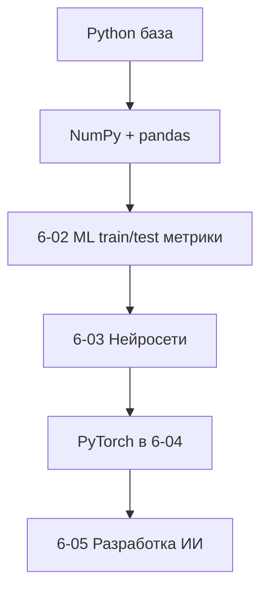

# Python для ML — мост к PyTorch

<div class="article-tags">
  <span class="tag tag-required">ОБЯЗАТЕЛЬНО</span>
  <span class="tag tag-beginner">ДЛЯ НОВИЧКОВ</span>
</div>

<span class="complexity-badge">Разработчику</span>
<span class="complexity-badge">Инженеру</span>

---

**PyTorch**, **scikit-learn** и ноутбуки из [раздела 6 — ИИ](/encyclopedia/6-ai/6-01-vvedenie-v-ii/intro) предполагают, что вы **уверенно пишете на Python**: синтаксис, модули, окружение, работа с таблицами и умение читать traceback. Эта статья — мост между базовым Python и нейросетями: что закрыть **до** PyTorch и в каком порядке читать материалы энциклопедии.

| Этап | Тема | Где в энциклопедии |
|------|------|-------------------|
| 0 | Синтаксис, функции, модули | [Python intro](./intro.md), [функции](./21.md) |
| 1 | venv, pip, pyproject | [39](./39.md), [391 Poetry/uv](./391.md) |
| 2 | NumPy, векторы | [426 NumPy](/encyclopedia/3-data-markup/3-11-analiz-dannyh/426) |
| 3 | pandas, таблицы | [427 Pandas](/encyclopedia/3-data-markup/3-11-analiz-dannyh/427) |
| 4 | ML-концепции | [6-02 ML](/encyclopedia/6-ai/6-02-mashinnoe-obuchenie/1) |
| 5 | Нейросети, PyTorch | [6-03](/encyclopedia/6-ai/6-03-neyroseti/intro), [333 PyTorch](/encyclopedia/5-languages/5-02-python/333), [335 MNIST](/encyclopedia/5-languages/5-02-python/335), [336 тональность](/encyclopedia/5-languages/5-02-python/336), [6-04](/encyclopedia/6-ai/6-04-modeli-i-instrumenty/intro) |

Практикум ниже идёт **по шагам** — от минимума Python до первого тензора с autograd.

| Шаг | Тема | Зачем |
|-----|------|-------|
| 1 | Структуры данных и функции | Читать батчи и пайплайны |
| 2 | Окружение и пакеты | PyTorch и CUDA тяжёлые |
| 3 | NumPy | Форма, срезы, broadcasting |
| 4 | pandas | CSV и подготовка признаков |
| 5 | Jupyter и seed | Эксперименты и воспроизводимость |
| 6 | sklearn baseline | train/test до deep learning |
| 7 | Первый PyTorch | autograd и градиенты |

<div class="callout callout--tip">
  <div class="callout-title">Не спешите в LLM</div>
  <div class="callout-body">
  Большие языковые модели — вершина стека. Без NumPy, split данных и понимания overfitting отладка сводится к копипасту. Сначала Iris или MNIST, потом трансформеры.
  </div>
</div>

---

## Шаг 1 — минимум Python для ML

### Структуры данных

Списки, словари, множества и comprehensions — без этого не читаются датасеты, конфиги и батчи.

```python
rows = [{"x": 1.0, "y": 0}, {"x": 2.5, "y": 1}, {"x": 0.5, "y": 0}]
positives = [r["x"] for r in rows if r["y"] == 1]
by_label = {r["y"]: r["x"] for r in rows}  # осторожно с дубликатами ключей
unique_ys = {r["y"] for r in rows}
```

Разбор:

- list comprehension фильтрует и преобразует за одно прохождение.
- dict comprehension удобен для маппинга id → объект.
- set даёт уникальные метки классов.

Подробнее:

- [типы и коллекции](./12.md)
- [управляющие конструкции](./23.md)

### Функции и модули

ML-код разбивают на функции `load_data`, `train_epoch`, `evaluate` — иначе ноутбук превращается в нечитаемую простыню.

```python
def accuracy(pred, target):
    """Доля совпадений pred и target (0/1 или bool)."""
    matches = (pred == target).sum()
    total = len(target)
    return matches / total if total else 0.0
```

Для PyTorch позже:

```python
def accuracy_torch(pred, target):
    return (pred == target).float().mean().item()
```

См. [функции](./21.md), [импорт и пакеты](./40.md).

### Type hints

Подсказки типов помогают IDE и коллегам:

```python
from typing import Sequence

def normalize(xs: Sequence[float]) -> list[float]:
    mean = sum(xs) / len(xs)
    return [x - mean for x in xs]
```

Полный курс типизации — в материалах по Python 3.10+; для ML достаточно базовых `list`, `dict`, `Optional`.

### Исключения и отладка

Обучение падает на NaN, shape mismatch, OOM GPU — нужно читать traceback до **своей** строки, а не только последнюю.

```python
try:
    result = risky_operation()
except ValueError as e:
    print(f"Неверные данные: {e}")
    raise
```

[Отладка](/encyclopedia/4-code-dev/4-14-razrabotka-i-otladka/intro) — breakpoints, логирование, `pdb`.

---

## Шаг 2 — виртуальное окружение

PyTorch, CUDA-пакеты и Jupyter **тяжёлые** — изолируйте каждый проект.

### Классический venv

```bash
python -m venv .venv
.venv\Scripts\activate          # Windows
# source .venv/bin/activate     # Linux/macOS
pip install --upgrade pip
pip install torch numpy pandas jupyter scikit-learn
```

### Poetry или uv

Современный вариант — [Poetry / uv](./391.md):

```bash
uv init ml-demo
cd ml-demo
uv add numpy pandas scikit-learn jupyter
uv add torch  # см. pytorch.org для CUDA-индекса
uv run jupyter lab
```

На Linux с PEP 668 следите за [externally-managed-environment](./998.md) — не ставьте ML-стек в системный Python.

| Пакет | Назначение |
|-------|------------|
| `numpy` | Массивы, линейная алгебра |
| `pandas` | Таблицы, CSV |
| `scikit-learn` | Классические модели, метрики |
| `torch` | Нейросети, GPU |
| `jupyterlab` | Интерактивные эксперimentы |
| `matplotlib` | Графики — [428](/encyclopedia/3-data-markup/3-11-analiz-dannyh/428) |

Установка PyTorch с CUDA — только с [pytorch.org](https://pytorch.org): индекс pip зависит от версии CUDA и ОС.

---

## Шаг 3 — NumPy как фундамент

Тензоры PyTorch похожи на **ndarray** NumPy: форма, срезы, broadcasting, операции по осям.

```python
import numpy as np

a = np.array([[1, 2, 3], [4, 5, 6]], dtype=np.float32)
print(a.shape)       # (2, 3)
b = a.mean(axis=0)   # среднее по строкам → shape (3,)
c = np.dot(a, a.T)   # (2, 2)
d = a[:, 0]          # первый столбец
```

| Операция | NumPy | Позже в PyTorch |
|----------|-------|-----------------|
| Форма | `a.shape` | `t.shape` |
| Срез | `a[:, 0]` | `t[:, 0]` |
| По оси | `a.mean(axis=1)` | `t.mean(dim=1)` |
| Тип | `dtype=float32` | `t.float()` |
| Случайность | `np.random.default_rng(42)` | `torch.manual_seed(42)` |

### Broadcasting

```python
x = np.array([[1], [2], [3]])   # (3, 1)
y = np.array([10, 20, 30])      # (3,)
z = x + y                        # (3, 3) без явных циклов
```

Понимание broadcasting обязательно для loss и нормализации батчей.

Глубже:

- [NumPy в анализе данных](/encyclopedia/3-data-markup/3-11-analiz-dannyh/426)
- [линейная алгебра](/encyclopedia/3-data-markup/3-12-matematicheskoe-programmirovanie/intro)

---

## Шаг 4 — pandas для табличных данных

CSV, пропуски, группировки — до подачи в модель.

```python
import pandas as pd

df = pd.read_csv("train.csv")
print(df.head())
print(df.info())

df = df.dropna(subset=["target"])
df["feature_a"] = df["feature_a"].fillna(df["feature_a"].median())

X = df[["feature_a", "feature_b"]].values   # ndarray для sklearn/torch
y = df["target"].values
```

| Метод | Зачем |
|-------|-------|
| `read_csv` | Загрузка датасета |
| `dropna` | Убрать строки без метки |
| `fillna` | Заполнить пропуски |
| `groupby` | Агрегации по категориям |
| `.values` / `.to_numpy()` | Переход в NumPy |

[427 Pandas](/encyclopedia/3-data-markup/3-11-analiz-dannyh/427), [SQL для выгрузок](/encyclopedia/3-data-markup/3-07-sql/101).

---

## Шаг 5 — Jupyter и воспроизводимость

Ноутбуки удобны для **исследования**; прод-код выносят в `.py` модули и пакеты.

```bash
pip install jupyterlab
jupyter lab
```

| Плюс notebook | Минус |
|---------------|-------|
| Графики inline | Порядок ячеек ломает воспроизводимость |
| Быстрые эксперименты | Сложнее code review |
| Документация рядом с кодом | Риск огромных бинарных diff |

### Фиксация seed

```python
import random
import numpy as np

SEED = 42
random.seed(SEED)
np.random.seed(SEED)

# после установки torch:
import torch
torch.manual_seed(SEED)
if torch.cuda.is_available():
    torch.cuda.manual_seed_all(SEED)
```

Версии пакетов — в `requirements.txt` или [uv.lock](./391.md). Перед публикацией результатов сохраняйте lock и seed в README.

### Структура учебного репозитория

```text
ml-demo/
  pyproject.toml
  data/           # или .gitignore для больших файлов
  notebooks/
    01_eda.ipynb
  src/
    ml_demo/
      data.py
      train.py
  tests/
```

---

## Шаг 6 — маршрут к разделу 6 (ИИ)



Рекомендуемый порядок чтения:

1. [Что такое ИИ](/encyclopedia/6-ai/6-01-vvedenie-v-ii/1)
2. [Машинное обучение — введение](/encyclopedia/6-ai/6-02-mashinnoe-obuchenie/1)
3. [Нейрон](/encyclopedia/6-ai/6-03-neyroseti/1)
4. [Трансформеры и NLP — о разделе](/encyclopedia/6-ai/6-09-transformery-i-nlp/intro)
5. [Модели и инструменты — о разделе](/encyclopedia/6-ai/6-04-modeli-i-instrumenty/intro)

---

## Шаг 7 — scikit-learn перед deep learning

Для табличных задач часто достаточно **sklearn** — быстрый baseline и понятные метрики.

```python
from sklearn.datasets import load_iris
from sklearn.linear_model import LogisticRegression
from sklearn.model_selection import train_test_split
from sklearn.metrics import accuracy_score

X, y = load_iris(return_X_y=True)
X_train, X_test, y_train, y_test = train_test_split(
    X, y, test_size=0.2, random_state=42
)

model = LogisticRegression(max_iter=200)
model.fit(X_train, y_train)
pred = model.predict(X_test)
print(accuracy_score(y_test, pred))
```

Разбор:

- `train_test_split` — отделить validation/test от train.
- `fit` / `predict` — универсальный API sklearn.
- `accuracy_score` — простая метрика для классификации.

Это закрепляет **train/test split**, **метрики**, **overfitting** — [6-02 ML](/encyclopedia/6-ai/6-02-mashinnoe-obuchenie/1).

---

## Шаг 8 — первый шаг к PyTorch

После NumPy — тензор и **autograd** (автоматическое дифференцирование).

```python
import torch

x = torch.tensor([1.0, 2.0, 3.0], requires_grad=True)
y = (x ** 2).sum()
y.backward()
print(x.grad)  # tensor([2., 4., 6.])
```

Разбор:

- `tensor` — многомерный массив с опциональным GPU.
- `requires_grad=True` — накапливать градиенты при `backward()`.
- `backward()` — обратное распространение; основа обучения нейросетей.

### Простая линейная модель

```python
import torch
import torch.nn as nn

X = torch.tensor([[1.0], [2.0], [3.0], [4.0]])
y = torch.tensor([[2.0], [4.0], [6.0], [8.0]])  # y ≈ 2*x

model = nn.Linear(1, 1)
loss_fn = nn.MSELoss()
optimizer = torch.optim.SGD(model.parameters(), lr=0.01)

for epoch in range(100):
    pred = model(X)
    loss = loss_fn(pred, y)
    optimizer.zero_grad()
    loss.backward()
    optimizer.step()

print(list(model.parameters()))
```

| Компонент | Роль |
|-----------|------|
| `nn.Linear` | Веса и смещение |
| `loss_fn` | Число, которое минимизируем |
| `optimizer` | Обновление весов по градиенту |
| `zero_grad` | Обнулить старые градиенты |

### CPU и GPU

```python
device = torch.device("cuda" if torch.cuda.is_available() else "cpu")
model = model.to(device)
X = X.to(device)
```

Полный курс — [PyTorch для разработчика](./333.md); практикумы — [MNIST](./335.md) (изображения), [тональность отзывов](./336.md) (текст); теория — [нейросети](/encyclopedia/6-ai/6-03-neyroseti/intro). Установка CUDA — [pytorch.org](https://pytorch.org).

---

## Чек-лист готовности к PyTorch

| # | Умею |
|---|------|
| 1 | Создать venv и установить пакет |
| 2 | Прочитать CSV через pandas |
| 3 | Объяснить shape `(N, C, H, W)` для батча изображений |
| 4 | Написать функцию с type hints |
| 5 | Прочитать traceback до своей строки |
| 6 | Понимать overfitting и validation split |
| 7 | Объяснить, что делает `loss.backward()` |

---

## Типичные ошибки новичков

| Ошибка | Что делать |
|--------|------------|
| Прыжок сразу в LLM | Пройти NumPy + 6-02 + [MNIST](./335.md) или [тональность](./336.md) |
| Глобальный pip без venv | [22](./22.md), [391](./391.md) |
| Копипаст ноутбука без seed | Фиксировать версии и SEED |
| Игнор CPU/GPU | Явный `device`, проверка `cuda.is_available()` |
| Shape mismatch | Печатать `.shape` на каждом шаге |
| NaN в loss | Проверить learning rate и нормализацию данных |
| OOM на GPU | Уменьшить batch size |

Осознанная работа с ИИ-инструментами — [генерация кода](/encyclopedia/6-ai/6-04-modeli-i-instrumenty/117); слепой копипаст — [вайб-кодинг](/encyclopedia/6-ai/6-07-vayb-koding-i-neurokontent/1).

---

## Учебный проект Iris — полный цикл

### Загрузка и EDA

```python
import pandas as pd
from sklearn.datasets import load_iris

iris = load_iris(as_frame=True)
df = iris.frame
df["species"] = df["target"].map(dict(enumerate(iris.target_names)))

print(df.describe())
print(df.groupby("species").size())
```

| Шаг | Действие |
|-----|----------|
| EDA | `describe`, `groupby`, пропуски |
| Features | столбцы `sepal length (cm)` … |
| Target | `species` или `target` |

### Baseline sklearn

```python
from sklearn.model_selection import train_test_split, cross_val_score
from sklearn.preprocessing import StandardScaler
from sklearn.pipeline import Pipeline
from sklearn.linear_model import LogisticRegression

X = iris.data
y = iris.target
X_train, X_test, y_train, y_test = train_test_split(
    X, y, test_size=0.2, random_state=42, stratify=y
)

pipe = Pipeline([
    ("scaler", StandardScaler()),
    ("clf", LogisticRegression(max_iter=200)),
])
pipe.fit(X_train, y_train)
print(pipe.score(X_test, y_test))
print(cross_val_score(pipe, X, y, cv=5).mean())
```

### Тот же эксперiment в PyTorch

```python
import torch
import torch.nn as nn
from torch.utils.data import TensorDataset, DataLoader

X_t = torch.tensor(X_train, dtype=torch.float32)
y_t = torch.tensor(y_train, dtype=torch.long)
loader = DataLoader(TensorDataset(X_t, y_t), batch_size=16, shuffle=True)

model = nn.Sequential(
    nn.Linear(4, 16),
    nn.ReLU(),
    nn.Linear(16, 3),
)
opt = torch.optim.Adam(model.parameters(), lr=0.01)
loss_fn = nn.CrossEntropyLoss()

for epoch in range(200):
    for xb, yb in loader:
        opt.zero_grad()
        loss = loss_fn(model(xb), yb)
        loss.backward()
        opt.step()
```

Сравните accuracy sklearn pipeline и PyTorch на `X_test`.

---

## DataLoader и батчи

```python
from torch.utils.data import Dataset, DataLoader

class TabularDataset(Dataset):
    def __init__(self, X, y):
        self.X = torch.tensor(X, dtype=torch.float32)
        self.y = torch.tensor(y, dtype=torch.long)

    def __len__(self):
        return len(self.y)

    def __getitem__(self, idx):
        return self.X[idx], self.y[idx]

train_ds = TabularDataset(X_train, y_train)
train_loader = DataLoader(train_ds, batch_size=32, shuffle=True)
```

| Параметр | Смысл |
|----------|--------|
| `batch_size` | Сколько примеров за шаг |
| `shuffle=True` | Перемешивание train |
| `num_workers` | Параллельная загрузка (осторожно на Windows) |

---

## Нормализация признаков

```python
mean = X_train.mean(axis=0)
std = X_train.std(axis=0) + 1e-8
X_train_n = (X_train - mean) / std
X_test_n = (X_test - mean) / std
```

Без нормализации градиентный спуск может сходиться медленно. `StandardScaler` в sklearn делает то же.

---

## Jupyter — дисциплина воспроизводимости

| Правило | Зачем |
|---------|-------|
| Restart kernel + Run All перед commit | Порядок ячеек |
| `%matplotlib inline` в первой ячейке | Графики |
| Версии в lock | Одинаковые libs |
| Seed в начале notebook | Сравнимые runs |
| Экспорт `.py` через jupyter nbconvert | Code review |

---

## Маршрут по разделу 6 после Python

| Порядок | Статья | Тема |
|---------|--------|------|
| 1 | [6-01 intro](/encyclopedia/6-ai/6-01-vvedenie-v-ii/intro) | Карта ИИ |
| 2 | [6-02 ML](/encyclopedia/6-ai/6-02-mashinnoe-obuchenie/1) | Supervised learning |
| 3 | [6-03 intro](/encyclopedia/6-ai/6-03-neyroseti/intro) | Нейросети |
| 4 | [6-04 intro](/encyclopedia/6-ai/6-04-modeli-i-instrumenty/intro) | PyTorch, HF |
| 5 | [6-05](/encyclopedia/6-ai/6-05-razrabotka-ii/intro) | Прикладная разработка |

---

## Расширенный чек-лист

| # | Умею | Проверка |
|---|------|----------|
| 8 | `train_test_split(..., stratify=y)` | Баланс классов |
| 9 | `CrossEntropyLoss` + logits | Shape `(N, C)` |
| 10 | `model.eval()` и `torch.no_grad()` | Inference |
| 11 | Сохранить `state_dict` | `torch.save` |
| 12 | Загрузить weights | `load_state_dict` |

---

## Навигация по блоку Python → ML

- Вы здесь: [392 — Python для ML](./392.md)
- Зависимости: [391 Poetry/uv](./391.md)
- NumPy: [426](/encyclopedia/3-data-markup/3-11-analiz-dannyh/426)
- Pandas: [427](/encyclopedia/3-data-markup/3-11-analiz-dannyh/427)
- ИИ: [6-01 intro](/encyclopedia/6-ai/6-01-vvedenie-v-ii/intro)

---

## Шаг 9 — matplotlib для EDA

```python
import matplotlib.pyplot as plt
from sklearn.datasets import load_iris

iris = load_iris()
plt.scatter(iris.data[:, 0], iris.data[:, 1], c=iris.target, cmap="viridis")
plt.xlabel(iris.feature_names[0])
plt.ylabel(iris.feature_names[1])
plt.colorbar()
plt.savefig("iris_scatter.png")
```

[428 — визуализация](/encyclopedia/3-data-markup/3-11-analiz-dannyh/428).

---

## Шаг 10 — train/val/test split

```python
X_train, X_temp, y_train, y_temp = train_test_split(
    X, y, test_size=0.3, random_state=42, stratify=y
)
X_val, X_test, y_val, y_test = train_test_split(
    X_temp, y_temp, test_size=0.5, random_state=42, stratify=y_temp
)
```

| Набор | Назначение |
|-------|------------|
| train | обучение весов |
| val | подбор hyperparams |
| test | финальная оценка один раз |

---

## Шаг 11 — overfitting на практике

```python
train_acc = model.score(X_train, y_train)
test_acc = model.score(X_test, y_test)
print(train_acc, test_acc)
```

Большой разрыв train >> test — overfitting. Решения: regularization, больше данных, проще модель.

---

## Шаг 12 — сохранение модели PyTorch

```python
torch.save(model.state_dict(), "model.pt")
model.load_state_dict(torch.load("model.pt", weights_only=True))
model.eval()
```

`weights_only=True` — безопасная загрузка weights (PyTorch 2.0+).

---

## Шаг 13 — type hints в ML-коде

```python
from typing import Tuple
import numpy as np

def split_xy(df) -> Tuple[np.ndarray, np.ndarray]:
    X = df.drop(columns=["target"]).to_numpy()
    y = df["target"].to_numpy()
    return X, y
```

---

## Шаг 14 — logging вместо print

```python
import logging
logging.basicConfig(level=logging.INFO)
log = logging.getLogger(__name__)

log.info("Epoch %s loss=%s", epoch, loss.item())
```

---

## Учебные датасеты без download

| Dataset | sklearn |
|---------|---------|
| Iris | `load_iris()` |
| Digits | `load_digits()` |
| Wine | `load_wine()` |

---

## Практический маршрут на Iris

1. **pandas** — загрузить Iris, посмотреть `describe()`.
2. **sklearn** — `LogisticRegression`, accuracy на test.
3. **PyTorch** — `nn.Linear(4, 3)`, тот же split, сравнить accuracy и время настройки.
4. Записать seed, версии пакетов и lock в git.

---

## Связанные материалы

| Тема | Материал |
|------|----------|
| Анализ данных | [раздел 3-11](/encyclopedia/3-data-markup/3-11-analiz-dannyh/intro) |
| Визуализация | [428 Matplotlib](/encyclopedia/3-data-markup/3-11-analiz-dannyh/428) |
| ML-сервис | [FastAPI для ML](./3432.md) |
| MLOps | [6-08 AgentOps](/encyclopedia/6-ai/6-08-agentops/intro) |
| Poetry/uv | [391](./391.md) |

<div class="callout callout--tip">
  <div class="callout-title">Практика</div>
  <div class="callout-body">
  На датасете Iris пройдите путь pandas → sklearn baseline → тот же tensor batch в PyTorch Linear. Сравните accuracy, время настройки и объём кода. Зафиксируйте <code>random_state=42</code> и lock-файл.
  </div>
</div>

---

## Второй проход — inference и отладка (черновик)

### Режим inference

```python
model.eval()
with torch.no_grad():
    logits = model(X_test_t)
    pred = logits.argmax(dim=1)
```

`eval()` отключает dropout; `no_grad()` экономит память без графа autograd.

### Сохранение весов

```python
torch.save(model.state_dict(), "iris_model.pt")
model.load_state_dict(torch.load("iris_model.pt", weights_only=True))
```

Для продакшена — версия torch в имени файла или MLflow — [6-08 AgentOps](/encyclopedia/6-ai/6-08-agentops/intro).

### Отладка NaN

```python
if torch.isnan(loss):
    raise RuntimeError("NaN loss — уменьшите lr или нормализуйте X")
```

Типичные причины: слишком большой learning rate, не нормализованные признаки, деление на ноль в кастомном loss.

### Jupyter → модуль

Вынесите `train_epoch(model, loader, opt, loss_fn)` в `src/ml_demo/train.py` и импортируйте в ноутбук — воспроизводимость и unit-тесты без ячеек out-of-order.

---

---
## FAQ — полный список

**1. С чего начать перед PyTorch?**

NumPy, pandas, train/test split — [6-02 ML](/encyclopedia/6-ai/6-02-mashinnoe-obuchenie/1).

**2. Нужен ли GPU?**

Для MNIST — CPU достаточно. Для больших моделей — CUDA с pytorch.org.

**3. venv или uv?**

[391 Poetry/uv](./391.md) для изоляции тяжёлых пакетов.

**4. Jupyter или .py модули?**

Notebook для EDA; prod-код — модули и пакеты.

**5. Что такое shape mismatch?**

Печатайте .shape на каждом шаге.

**6. NaN в loss?**

Learning rate, нормализация данных.

**7. OOM на GPU?**

Уменьшить batch size.

**8. random_state зачем?**

Воспроизводимость эксперiments — seed + lock.

**9. sklearn vs PyTorch?**

sklearn — табличные baseline. PyTorch — deep learning.

**10. autograd что делает?**

Автоматическое дифференцирование — основа обучения.

**11. device cpu/cuda?**

Явный device и torch.cuda.is_available().

**12. Iris датасет где?**

sklearn.datasets.load_iris.

**13. pandas к NumPy?**

.values или .to_numpy().

**14. Matplotlib?**

[428](/encyclopedia/3-data-markup/3-11-analiz-dannyh/428).

**15. MLOps дальше?**

[6-08 AgentOps](/encyclopedia/6-ai/6-08-agentops/intro).

**16. LLM сразу?**

Сначала MNIST/Iris — иначе отладка = копипаст.

**17. Traceback как читать?**

До своей строки — [отладка](/encyclopedia/4-code-dev/4-14-razrabotka-i-otladka/intro).

## Упражнения — расширенный набор

1. Iris: pandas describe → sklearn baseline → PyTorch Linear.
2. Зафиксировать SEED=42 и lock в git.
3. Написать normalize() с type hints.
4. Broadcasting exercise в NumPy.
5. train_test_split с random_state.
6. nn.MSELoss на синтетических данных.
7. Перенести notebook код в src/ml_demo/train.py.
8. Чек-лист готовности — все 7 пунктов.
9. Сравнить accuracy sklearn и PyTorch.
10. Документировать версии в README.

## Практикум — полный PyTorch Linear на Iris

```python
import torch
import torch.nn as nn
from sklearn.datasets import load_iris
from sklearn.model_selection import train_test_split

X, y = load_iris(return_X_y=True)
X_train, X_test, y_train, y_test = train_test_split(X, y, test_size=0.2, random_state=42)
X_train = torch.tensor(X_train, dtype=torch.float32)
y_train = torch.tensor(y_train, dtype=torch.long)

model = nn.Linear(4, 3)
loss_fn = nn.CrossEntropyLoss()
opt = torch.optim.Adam(model.parameters(), lr=0.01)

for epoch in range(200):
    opt.zero_grad()
    loss = loss_fn(model(X_train), y_train)
    loss.backward()
    opt.step()
```

## Практикум — дополнительный блок 1 (392)

| Шаг | Действие | Проверка |
|-----|----------|----------|
| 1 | Повторить базовый сценарий из начала статьи | Команда завершается без ошибок |
| 2 | Запустить тесты или curl smoke | Ожидаемый HTTP-код или green test |
| 3 | Зафиксировать результат в README | Шаги воспроизводимы на другой машине |

<div class="callout callout--tip">
  <div class="callout-title">Подсказка 1</div>
  <div class="callout-body">Сверьтесь с материалами энциклопедии по ссылкам /encyclopedia/ в начале статьи. При ошибке сначала читайте traceback или лог до своей строки — см. <a href="/encyclopedia/4-code-dev/4-14-razrabotka-i-otladka/111">отладку</a>.</div>
</div>

### Troubleshooting — мини-чеклист 1

| # | Вопрос | Если да |
|---|--------|---------|
| 1 | Версия runtime совпадает с таблицей требований? | Обновить или зафиксировать в документации |
| 2 | Зависимости установлены из lock-файла? | Переустановить без изменения lock |
| 3 | Порт не занят другим процессом? | Сменить порт или завершить процесс |
| 4 | Переменные окружения заданы? | Проверить .env и секреты на хостинге |
| 5 | Тесты проходят локально? | Только после green — деплой |

```bash
# Smoke — адаптируйте под свой стек (392)
echo "Smoke block 1"
```


## Практикум — дополнительный блок 2 (392)

| Шаг | Действие | Проверка |
|-----|----------|----------|
| 1 | Повторить базовый сценарий из начала статьи | Команда завершается без ошибок |
| 2 | Запустить тесты или curl smoke | Ожидаемый HTTP-код или green test |
| 3 | Зафиксировать результат в README | Шаги воспроизводимы на другой машине |

<div class="callout callout--tip">
  <div class="callout-title">Подсказка 2</div>
  <div class="callout-body">Сверьтесь с материалами энциклопедии по ссылкам /encyclopedia/ в начале статьи. При ошибке сначала читайте traceback или лог до своей строки — см. <a href="/encyclopedia/4-code-dev/4-14-razrabotka-i-otladka/111">отладку</a>.</div>
</div>

### Troubleshooting — мини-чеклист 2

| # | Вопрос | Если да |
|---|--------|---------|
| 1 | Версия runtime совпадает с таблицей требований? | Обновить или зафиксировать в документации |
| 2 | Зависимости установлены из lock-файла? | Переустановить без изменения lock |
| 3 | Порт не занят другим процессом? | Сменить порт или завершить процесс |
| 4 | Переменные окружения заданы? | Проверить .env и секреты на хостинге |
| 5 | Тесты проходят локально? | Только после green — деплой |

```bash
# Smoke — адаптируйте под свой стек (392)
echo "Smoke block 2"
```


## Практикум — дополнительный блок 3 (392)

| Шаг | Действие | Проверка |
|-----|----------|----------|
| 1 | Повторить базовый сценарий из начала статьи | Команда завершается без ошибок |
| 2 | Запустить тесты или curl smoke | Ожидаемый HTTP-код или green test |
| 3 | Зафиксировать результат в README | Шаги воспроизводимы на другой машине |

<div class="callout callout--tip">
  <div class="callout-title">Подсказка 3</div>
  <div class="callout-body">Сверьтесь с материалами энциклопедии по ссылкам /encyclopedia/ в начале статьи. При ошибке сначала читайте traceback или лог до своей строки — см. <a href="/encyclopedia/4-code-dev/4-14-razrabotka-i-otladka/111">отладку</a>.</div>
</div>

### Troubleshooting — мини-чеклист 3

| # | Вопрос | Если да |
|---|--------|---------|
| 1 | Версия runtime совпадает с таблицей требований? | Обновить или зафиксировать в документации |
| 2 | Зависимости установлены из lock-файла? | Переустановить без изменения lock |
| 3 | Порт не занят другим процессом? | Сменить порт или завершить процесс |
| 4 | Переменные окружения заданы? | Проверить .env и секреты на хостинге |
| 5 | Тесты проходят локально? | Только после green — деплой |

```bash
# Smoke — адаптируйте под свой стек (392)
echo "Smoke block 3"
```


## Практикум — дополнительный блок 4 (392)

| Шаг | Действие | Проверка |
|-----|----------|----------|
| 1 | Повторить базовый сценарий из начала статьи | Команда завершается без ошибок |
| 2 | Запустить тесты или curl smoke | Ожидаемый HTTP-код или green test |
| 3 | Зафиксировать результат в README | Шаги воспроизводимы на другой машине |

<div class="callout callout--tip">
  <div class="callout-title">Подсказка 4</div>
  <div class="callout-body">Сверьтесь с материалами энциклопедии по ссылкам /encyclopedia/ в начале статьи. При ошибке сначала читайте traceback или лог до своей строки — см. <a href="/encyclopedia/4-code-dev/4-14-razrabotka-i-otladka/111">отладку</a>.</div>
</div>

### Troubleshooting — мини-чеклист 4

| # | Вопрос | Если да |
|---|--------|---------|
| 1 | Версия runtime совпадает с таблицей требований? | Обновить или зафиксировать в документации |
| 2 | Зависимости установлены из lock-файла? | Переустановить без изменения lock |
| 3 | Порт не занят другим процессом? | Сменить порт или завершить процесс |
| 4 | Переменные окружения заданы? | Проверить .env и секреты на хостинге |
| 5 | Тесты проходят локально? | Только после green — деплой |

```bash
# Smoke — адаптируйте под свой стек (392)
echo "Smoke block 4"
```


## Практикум — дополнительный блок 5 (392)

| Шаг | Действие | Проверка |
|-----|----------|----------|
| 1 | Повторить базовый сценарий из начала статьи | Команда завершается без ошибок |
| 2 | Запустить тесты или curl smoke | Ожидаемый HTTP-код или green test |
| 3 | Зафиксировать результат в README | Шаги воспроизводимы на другой машине |

<div class="callout callout--tip">
  <div class="callout-title">Подсказка 5</div>
  <div class="callout-body">Сверьтесь с материалами энциклопедии по ссылкам /encyclopedia/ в начале статьи. При ошибке сначала читайте traceback или лог до своей строки — см. <a href="/encyclopedia/4-code-dev/4-14-razrabotka-i-otladka/111">отладку</a>.</div>
</div>

### Troubleshooting — мини-чеклист 5

| # | Вопрос | Если да |
|---|--------|---------|
| 1 | Версия runtime совпадает с таблицей требований? | Обновить или зафиксировать в документации |
| 2 | Зависимости установлены из lock-файла? | Переустановить без изменения lock |
| 3 | Порт не занят другим процессом? | Сменить порт или завершить процесс |
| 4 | Переменные окружения заданы? | Проверить .env и секреты на хостинге |
| 5 | Тесты проходят локально? | Только после green — деплой |

```bash
# Smoke — адаптируйте под свой стек (392)
echo "Smoke block 5"
```


## Практикум — дополнительный блок 6 (392)

| Шаг | Действие | Проверка |
|-----|----------|----------|
| 1 | Повторить базовый сценарий из начала статьи | Команда завершается без ошибок |
| 2 | Запустить тесты или curl smoke | Ожидаемый HTTP-код или green test |
| 3 | Зафиксировать результат в README | Шаги воспроизводимы на другой машине |

<div class="callout callout--tip">
  <div class="callout-title">Подсказка 6</div>
  <div class="callout-body">Сверьтесь с материалами энциклопедии по ссылкам /encyclopedia/ в начале статьи. При ошибке сначала читайте traceback или лог до своей строки — см. <a href="/encyclopedia/4-code-dev/4-14-razrabotka-i-otladka/111">отладку</a>.</div>
</div>

### Troubleshooting — мини-чеклист 6

| # | Вопрос | Если да |
|---|--------|---------|
| 1 | Версия runtime совпадает с таблицей требований? | Обновить или зафиксировать в документации |
| 2 | Зависимости установлены из lock-файла? | Переустановить без изменения lock |
| 3 | Порт не занят другим процессом? | Сменить порт или завершить процесс |
| 4 | Переменные окружения заданы? | Проверить .env и секреты на хостинге |
| 5 | Тесты проходят локально? | Только после green — деплой |

```bash
# Smoke — адаптируйте под свой стек (392)
echo "Smoke block 6"
```


## Практикум — дополнительный блок 7 (392)

| Шаг | Действие | Проверка |
|-----|----------|----------|
| 1 | Повторить базовый сценарий из начала статьи | Команда завершается без ошибок |
| 2 | Запустить тесты или curl smoke | Ожидаемый HTTP-код или green test |
| 3 | Зафиксировать результат в README | Шаги воспроизводимы на другой машине |

<div class="callout callout--tip">
  <div class="callout-title">Подсказка 7</div>
  <div class="callout-body">Сверьтесь с материалами энциклопедии по ссылкам /encyclopedia/ в начале статьи. При ошибке сначала читайте traceback или лог до своей строки — см. <a href="/encyclopedia/4-code-dev/4-14-razrabotka-i-otladka/111">отладку</a>.</div>
</div>

### Troubleshooting — мини-чеклист 7

| # | Вопрос | Если да |
|---|--------|---------|
| 1 | Версия runtime совпадает с таблицей требований? | Обновить или зафиксировать в документации |
| 2 | Зависимости установлены из lock-файла? | Переустановить без изменения lock |
| 3 | Порт не занят другим процессом? | Сменить порт или завершить процесс |
| 4 | Переменные окружения заданы? | Проверить .env и секреты на хостинге |
| 5 | Тесты проходят локально? | Только после green — деплой |

```bash
# Smoke — адаптируйте под свой стек (392)
echo "Smoke block 7"
```


## Практикум — дополнительный блок 8 (392)

| Шаг | Действие | Проверка |
|-----|----------|----------|
| 1 | Повторить базовый сценарий из начала статьи | Команда завершается без ошибок |
| 2 | Запустить тесты или curl smoke | Ожидаемый HTTP-код или green test |
| 3 | Зафиксировать результат в README | Шаги воспроизводимы на другой машине |

<div class="callout callout--tip">
  <div class="callout-title">Подсказка 8</div>
  <div class="callout-body">Сверьтесь с материалами энциклопедии по ссылкам /encyclopedia/ в начале статьи. При ошибке сначала читайте traceback или лог до своей строки — см. <a href="/encyclopedia/4-code-dev/4-14-razrabotka-i-otladka/111">отладку</a>.</div>
</div>

### Troubleshooting — мини-чеклист 8

| # | Вопрос | Если да |
|---|--------|---------|
| 1 | Версия runtime совпадает с таблицей требований? | Обновить или зафиксировать в документации |
| 2 | Зависимости установлены из lock-файла? | Переустановить без изменения lock |
| 3 | Порт не занят другим процессом? | Сменить порт или завершить процесс |
| 4 | Переменные окружения заданы? | Проверить .env и секреты на хостинге |
| 5 | Тесты проходят локально? | Только после green — деплой |

```bash
# Smoke — адаптируйте под свой стек (392)
echo "Smoke block 8"
```


## Практикум — дополнительный блок 9 (392)

| Шаг | Действие | Проверка |
|-----|----------|----------|
| 1 | Повторить базовый сценарий из начала статьи | Команда завершается без ошибок |
| 2 | Запустить тесты или curl smoke | Ожидаемый HTTP-код или green test |
| 3 | Зафиксировать результат в README | Шаги воспроизводимы на другой машине |

<div class="callout callout--tip">
  <div class="callout-title">Подсказка 9</div>
  <div class="callout-body">Сверьтесь с материалами энциклопедии по ссылкам /encyclopedia/ в начале статьи. При ошибке сначала читайте traceback или лог до своей строки — см. <a href="/encyclopedia/4-code-dev/4-14-razrabotka-i-otladka/111">отладку</a>.</div>
</div>

### Troubleshooting — мини-чеклист 9

| # | Вопрос | Если да |
|---|--------|---------|
| 1 | Версия runtime совпадает с таблицей требований? | Обновить или зафиксировать в документации |
| 2 | Зависимости установлены из lock-файла? | Переустановить без изменения lock |
| 3 | Порт не занят другим процессом? | Сменить порт или завершить процесс |
| 4 | Переменные окружения заданы? | Проверить .env и секреты на хостинге |
| 5 | Тесты проходят локально? | Только после green — деплой |

```bash
# Smoke — адаптируйте под свой стек (392)
echo "Smoke block 9"
```


## Практикум — дополнительный блок 10 (392)

| Шаг | Действие | Проверка |
|-----|----------|----------|
| 1 | Повторить базовый сценарий из начала статьи | Команда завершается без ошибок |
| 2 | Запустить тесты или curl smoke | Ожидаемый HTTP-код или green test |
| 3 | Зафиксировать результат в README | Шаги воспроизводимы на другой машине |

<div class="callout callout--tip">
  <div class="callout-title">Подсказка 10</div>
  <div class="callout-body">Сверьтесь с материалами энциклопедии по ссылкам /encyclopedia/ в начале статьи. При ошибке сначала читайте traceback или лог до своей строки — см. <a href="/encyclopedia/4-code-dev/4-14-razrabotka-i-otladka/111">отладку</a>.</div>
</div>

### Troubleshooting — мини-чеклист 10

| # | Вопрос | Если да |
|---|--------|---------|
| 1 | Версия runtime совпадает с таблицей требований? | Обновить или зафиксировать в документации |
| 2 | Зависимости установлены из lock-файла? | Переустановить без изменения lock |
| 3 | Порт не занят другим процессом? | Сменить порт или завершить процесс |
| 4 | Переменные окружения заданы? | Проверить .env и секреты на хостинге |
| 5 | Тесты проходят локально? | Только после green — деплой |

```bash
# Smoke — адаптируйте под свой стек (392)
echo "Smoke block 10"
```


## Практикум — дополнительный блок 11 (392)

| Шаг | Действие | Проверка |
|-----|----------|----------|
| 1 | Повторить базовый сценарий из начала статьи | Команда завершается без ошибок |
| 2 | Запустить тесты или curl smoke | Ожидаемый HTTP-код или green test |
| 3 | Зафиксировать результат в README | Шаги воспроизводимы на другой машине |

<div class="callout callout--tip">
  <div class="callout-title">Подсказка 11</div>
  <div class="callout-body">Сверьтесь с материалами энциклопедии по ссылкам /encyclopedia/ в начале статьи. При ошибке сначала читайте traceback или лог до своей строки — см. <a href="/encyclopedia/4-code-dev/4-14-razrabotka-i-otladka/111">отладку</a>.</div>
</div>

### Troubleshooting — мини-чеклист 11

| # | Вопрос | Если да |
|---|--------|---------|
| 1 | Версия runtime совпадает с таблицей требований? | Обновить или зафиксировать в документации |
| 2 | Зависимости установлены из lock-файла? | Переустановить без изменения lock |
| 3 | Порт не занят другим процессом? | Сменить порт или завершить процесс |
| 4 | Переменные окружения заданы? | Проверить .env и секреты на хостинге |
| 5 | Тесты проходят локально? | Только после green — деплой |

```bash
# Smoke — адаптируйте под свой стек (392)
echo "Smoke block 11"
```


## Практикум — дополнительный блок 12 (392)

| Шаг | Действие | Проверка |
|-----|----------|----------|
| 1 | Повторить базовый сценарий из начала статьи | Команда завершается без ошибок |
| 2 | Запустить тесты или curl smoke | Ожидаемый HTTP-код или green test |
| 3 | Зафиксировать результат в README | Шаги воспроизводимы на другой машине |

<div class="callout callout--tip">
  <div class="callout-title">Подсказка 12</div>
  <div class="callout-body">Сверьтесь с материалами энциклопедии по ссылкам /encyclopedia/ в начале статьи. При ошибке сначала читайте traceback или лог до своей строки — см. <a href="/encyclopedia/4-code-dev/4-14-razrabotka-i-otladka/111">отладку</a>.</div>
</div>

### Troubleshooting — мини-чеклист 12

| # | Вопрос | Если да |
|---|--------|---------|
| 1 | Версия runtime совпадает с таблицей требований? | Обновить или зафиксировать в документации |
| 2 | Зависимости установлены из lock-файла? | Переустановить без изменения lock |
| 3 | Порт не занят другим процессом? | Сменить порт или завершить процесс |
| 4 | Переменные окружения заданы? | Проверить .env и секреты на хостинге |
| 5 | Тесты проходят локально? | Только после green — деплой |

```bash
# Smoke — адаптируйте под свой стек (392)
echo "Smoke block 12"
```


## Практикум — дополнительный блок 13 (392)

| Шаг | Действие | Проверка |
|-----|----------|----------|
| 1 | Повторить базовый сценарий из начала статьи | Команда завершается без ошибок |
| 2 | Запустить тесты или curl smoke | Ожидаемый HTTP-код или green test |
| 3 | Зафиксировать результат в README | Шаги воспроизводимы на другой машине |

<div class="callout callout--tip">
  <div class="callout-title">Подсказка 13</div>
  <div class="callout-body">Сверьтесь с материалами энциклопедии по ссылкам /encyclopedia/ в начале статьи. При ошибке сначала читайте traceback или лог до своей строки — см. <a href="/encyclopedia/4-code-dev/4-14-razrabotka-i-otladka/111">отладку</a>.</div>
</div>

### Troubleshooting — мини-чеклист 13

| # | Вопрос | Если да |
|---|--------|---------|
| 1 | Версия runtime совпадает с таблицей требований? | Обновить или зафиксировать в документации |
| 2 | Зависимости установлены из lock-файла? | Переустановить без изменения lock |
| 3 | Порт не занят другим процессом? | Сменить порт или завершить процесс |
| 4 | Переменные окружения заданы? | Проверить .env и секреты на хостинге |
| 5 | Тесты проходят локально? | Только после green — деплой |

```bash
# Smoke — адаптируйте под свой стек (392)
echo "Smoke block 13"
```


## Практикум — дополнительный блок 14 (392)

| Шаг | Действие | Проверка |
|-----|----------|----------|
| 1 | Повторить базовый сценарий из начала статьи | Команда завершается без ошибок |
| 2 | Запустить тесты или curl smoke | Ожидаемый HTTP-код или green test |
| 3 | Зафиксировать результат в README | Шаги воспроизводимы на другой машине |

<div class="callout callout--tip">
  <div class="callout-title">Подсказка 14</div>
  <div class="callout-body">Сверьтесь с материалами энциклопедии по ссылкам /encyclopedia/ в начале статьи. При ошибке сначала читайте traceback или лог до своей строки — см. <a href="/encyclopedia/4-code-dev/4-14-razrabotka-i-otladka/111">отладку</a>.</div>
</div>

### Troubleshooting — мини-чеклист 14

| # | Вопрос | Если да |
|---|--------|---------|
| 1 | Версия runtime совпадает с таблицей требований? | Обновить или зафиксировать в документации |
| 2 | Зависимости установлены из lock-файла? | Переустановить без изменения lock |
| 3 | Порт не занят другим процессом? | Сменить порт или завершить процесс |
| 4 | Переменные окружения заданы? | Проверить .env и секреты на хостинге |
| 5 | Тесты проходят локально? | Только после green — деплой |

```bash
# Smoke — адаптируйте под свой стек (392)
echo "Smoke block 14"
```


## Практикум — дополнительный блок 15 (392)

| Шаг | Действие | Проверка |
|-----|----------|----------|
| 1 | Повторить базовый сценарий из начала статьи | Команда завершается без ошибок |
| 2 | Запустить тесты или curl smoke | Ожидаемый HTTP-код или green test |
| 3 | Зафиксировать результат в README | Шаги воспроизводимы на другой машине |

<div class="callout callout--tip">
  <div class="callout-title">Подсказка 15</div>
  <div class="callout-body">Сверьтесь с материалами энциклопедии по ссылкам /encyclopedia/ в начале статьи. При ошибке сначала читайте traceback или лог до своей строки — см. <a href="/encyclopedia/4-code-dev/4-14-razrabotka-i-otladka/111">отладку</a>.</div>
</div>

### Troubleshooting — мини-чеклист 15

| # | Вопрос | Если да |
|---|--------|---------|
| 1 | Версия runtime совпадает с таблицей требований? | Обновить или зафиксировать в документации |
| 2 | Зависимости установлены из lock-файла? | Переустановить без изменения lock |
| 3 | Порт не занят другим процессом? | Сменить порт или завершить процесс |
| 4 | Переменные окружения заданы? | Проверить .env и секреты на хостинге |
| 5 | Тесты проходят локально? | Только после green — деплой |

```bash
# Smoke — адаптируйте под свой стек (392)
echo "Smoke block 15"
```


## Практикум — дополнительный блок 16 (392)

| Шаг | Действие | Проверка |
|-----|----------|----------|
| 1 | Повторить базовый сценарий из начала статьи | Команда завершается без ошибок |
| 2 | Запустить тесты или curl smoke | Ожидаемый HTTP-код или green test |
| 3 | Зафиксировать результат в README | Шаги воспроизводимы на другой машине |

<div class="callout callout--tip">
  <div class="callout-title">Подсказка 16</div>
  <div class="callout-body">Сверьтесь с материалами энциклопедии по ссылкам /encyclopedia/ в начале статьи. При ошибке сначала читайте traceback или лог до своей строки — см. <a href="/encyclopedia/4-code-dev/4-14-razrabotka-i-otladka/111">отладку</a>.</div>
</div>

### Troubleshooting — мини-чеклист 16

| # | Вопрос | Если да |
|---|--------|---------|
| 1 | Версия runtime совпадает с таблицей требований? | Обновить или зафиксировать в документации |
| 2 | Зависимости установлены из lock-файла? | Переустановить без изменения lock |
| 3 | Порт не занят другим процессом? | Сменить порт или завершить процесс |
| 4 | Переменные окружения заданы? | Проверить .env и секреты на хостинге |
| 5 | Тесты проходят локально? | Только после green — деплой |

```bash
# Smoke — адаптируйте под свой стек (392)
echo "Smoke block 16"
```


## Практикум — дополнительный блок 17 (392)

| Шаг | Действие | Проверка |
|-----|----------|----------|
| 1 | Повторить базовый сценарий из начала статьи | Команда завершается без ошибок |
| 2 | Запустить тесты или curl smoke | Ожидаемый HTTP-код или green test |
| 3 | Зафиксировать результат в README | Шаги воспроизводимы на другой машине |

<div class="callout callout--tip">
  <div class="callout-title">Подсказка 17</div>
  <div class="callout-body">Сверьтесь с материалами энциклопедии по ссылкам /encyclopedia/ в начале статьи. При ошибке сначала читайте traceback или лог до своей строки — см. <a href="/encyclopedia/4-code-dev/4-14-razrabotka-i-otladka/111">отладку</a>.</div>
</div>

### Troubleshooting — мини-чеклист 17

| # | Вопрос | Если да |
|---|--------|---------|
| 1 | Версия runtime совпадает с таблицей требований? | Обновить или зафиксировать в документации |
| 2 | Зависимости установлены из lock-файла? | Переустановить без изменения lock |
| 3 | Порт не занят другим процессом? | Сменить порт или завершить процесс |
| 4 | Переменные окружения заданы? | Проверить .env и секреты на хостинге |
| 5 | Тесты проходят локально? | Только после green — деплой |

```bash
# Smoke — адаптируйте под свой стек (392)
echo "Smoke block 17"
```


## Практикум — дополнительный блок 18 (392)

| Шаг | Действие | Проверка |
|-----|----------|----------|
| 1 | Повторить базовый сценарий из начала статьи | Команда завершается без ошибок |
| 2 | Запустить тесты или curl smoke | Ожидаемый HTTP-код или green test |
| 3 | Зафиксировать результат в README | Шаги воспроизводимы на другой машине |

<div class="callout callout--tip">
  <div class="callout-title">Подсказка 18</div>
  <div class="callout-body">Сверьтесь с материалами энциклопедии по ссылкам /encyclopedia/ в начале статьи. При ошибке сначала читайте traceback или лог до своей строки — см. <a href="/encyclopedia/4-code-dev/4-14-razrabotka-i-otladka/111">отладку</a>.</div>
</div>

### Troubleshooting — мини-чеклист 18

| # | Вопрос | Если да |
|---|--------|---------|
| 1 | Версия runtime совпадает с таблицей требований? | Обновить или зафиксировать в документации |
| 2 | Зависимости установлены из lock-файла? | Переустановить без изменения lock |
| 3 | Порт не занят другим процессом? | Сменить порт или завершить процесс |
| 4 | Переменные окружения заданы? | Проверить .env и секреты на хостинге |
| 5 | Тесты проходят локально? | Только после green — деплой |

```bash
# Smoke — адаптируйте под свой стек (392)
echo "Smoke block 18"
```


## Практикум — дополнительный блок 19 (392)

| Шаг | Действие | Проверка |
|-----|----------|----------|
| 1 | Повторить базовый сценарий из начала статьи | Команда завершается без ошибок |
| 2 | Запустить тесты или curl smoke | Ожидаемый HTTP-код или green test |
| 3 | Зафиксировать результат в README | Шаги воспроизводимы на другой машине |

<div class="callout callout--tip">
  <div class="callout-title">Подсказка 19</div>
  <div class="callout-body">Сверьтесь с материалами энциклопедии по ссылкам /encyclopedia/ в начале статьи. При ошибке сначала читайте traceback или лог до своей строки — см. <a href="/encyclopedia/4-code-dev/4-14-razrabotka-i-otladka/111">отладку</a>.</div>
</div>

### Troubleshooting — мини-чеклист 19

| # | Вопрос | Если да |
|---|--------|---------|
| 1 | Версия runtime совпадает с таблицей требований? | Обновить или зафиксировать в документации |
| 2 | Зависимости установлены из lock-файла? | Переустановить без изменения lock |
| 3 | Порт не занят другим процессом? | Сменить порт или завершить процесс |
| 4 | Переменные окружения заданы? | Проверить .env и секреты на хостинге |
| 5 | Тесты проходят локально? | Только после green — деплой |

```bash
# Smoke — адаптируйте под свой стек (392)
echo "Smoke block 19"
```


## Практикум — дополнительный блок 20 (392)

| Шаг | Действие | Проверка |
|-----|----------|----------|
| 1 | Повторить базовый сценарий из начала статьи | Команда завершается без ошибок |
| 2 | Запустить тесты или curl smoke | Ожидаемый HTTP-код или green test |
| 3 | Зафиксировать результат в README | Шаги воспроизводимы на другой машине |

<div class="callout callout--tip">
  <div class="callout-title">Подсказка 20</div>
  <div class="callout-body">Сверьтесь с материалами энциклопедии по ссылкам /encyclopedia/ в начале статьи. При ошибке сначала читайте traceback или лог до своей строки — см. <a href="/encyclopedia/4-code-dev/4-14-razrabotka-i-otladka/111">отладку</a>.</div>
</div>

### Troubleshooting — мини-чеклист 20

| # | Вопрос | Если да |
|---|--------|---------|
| 1 | Версия runtime совпадает с таблицей требований? | Обновить или зафиксировать в документации |
| 2 | Зависимости установлены из lock-файла? | Переустановить без изменения lock |
| 3 | Порт не занят другим процессом? | Сменить порт или завершить процесс |
| 4 | Переменные окружения заданы? | Проверить .env и секреты на хостинге |
| 5 | Тесты проходят локально? | Только после green — деплой |

```bash
# Smoke — адаптируйте под свой стек (392)
echo "Smoke block 20"
```


## Практикум — дополнительный блок 21 (392)

| Шаг | Действие | Проверка |
|-----|----------|----------|
| 1 | Повторить базовый сценарий из начала статьи | Команда завершается без ошибок |
| 2 | Запустить тесты или curl smoke | Ожидаемый HTTP-код или green test |
| 3 | Зафиксировать результат в README | Шаги воспроизводимы на другой машине |

<div class="callout callout--tip">
  <div class="callout-title">Подсказка 21</div>
  <div class="callout-body">Сверьтесь с материалами энциклопедии по ссылкам /encyclopedia/ в начале статьи. При ошибке сначала читайте traceback или лог до своей строки — см. <a href="/encyclopedia/4-code-dev/4-14-razrabotka-i-otladka/111">отладку</a>.</div>
</div>

### Troubleshooting — мини-чеклист 21

| # | Вопрос | Если да |
|---|--------|---------|
| 1 | Версия runtime совпадает с таблицей требований? | Обновить или зафиксировать в документации |
| 2 | Зависимости установлены из lock-файла? | Переустановить без изменения lock |
| 3 | Порт не занят другим процессом? | Сменить порт или завершить процесс |
| 4 | Переменные окружения заданы? | Проверить .env и секреты на хостинге |
| 5 | Тесты проходят локально? | Только после green — деплой |

```bash
# Smoke — адаптируйте под свой стек (392)
echo "Smoke block 21"
```


## Практикум — дополнительный блок 22 (392)

| Шаг | Действие | Проверка |
|-----|----------|----------|
| 1 | Повторить базовый сценарий из начала статьи | Команда завершается без ошибок |
| 2 | Запустить тесты или curl smoke | Ожидаемый HTTP-код или green test |
| 3 | Зафиксировать результат в README | Шаги воспроизводимы на другой машине |

<div class="callout callout--tip">
  <div class="callout-title">Подсказка 22</div>
  <div class="callout-body">Сверьтесь с материалами энциклопедии по ссылкам /encyclopedia/ в начале статьи. При ошибке сначала читайте traceback или лог до своей строки — см. <a href="/encyclopedia/4-code-dev/4-14-razrabotka-i-otladka/111">отладку</a>.</div>
</div>

### Troubleshooting — мини-чеклист 22

| # | Вопрос | Если да |
|---|--------|---------|
| 1 | Версия runtime совпадает с таблицей требований? | Обновить или зафиксировать в документации |
| 2 | Зависимости установлены из lock-файла? | Переустановить без изменения lock |
| 3 | Порт не занят другим процессом? | Сменить порт или завершить процесс |
| 4 | Переменные окружения заданы? | Проверить .env и секреты на хостинге |
| 5 | Тесты проходят локально? | Только после green — деплой |

```bash
# Smoke — адаптируйте под свой стек (392)
echo "Smoke block 22"
```


## Практикум — дополнительный блок 23 (392)

| Шаг | Действие | Проверка |
|-----|----------|----------|
| 1 | Повторить базовый сценарий из начала статьи | Команда завершается без ошибок |
| 2 | Запустить тесты или curl smoke | Ожидаемый HTTP-код или green test |
| 3 | Зафиксировать результат в README | Шаги воспроизводимы на другой машине |

<div class="callout callout--tip">
  <div class="callout-title">Подсказка 23</div>
  <div class="callout-body">Сверьтесь с материалами энциклопедии по ссылкам /encyclopedia/ в начале статьи. При ошибке сначала читайте traceback или лог до своей строки — см. <a href="/encyclopedia/4-code-dev/4-14-razrabotka-i-otladka/111">отладку</a>.</div>
</div>

### Troubleshooting — мини-чеклист 23

| # | Вопрос | Если да |
|---|--------|---------|
| 1 | Версия runtime совпадает с таблицей требований? | Обновить или зафиксировать в документации |
| 2 | Зависимости установлены из lock-файла? | Переустановить без изменения lock |
| 3 | Порт не занят другим процессом? | Сменить порт или завершить процесс |
| 4 | Переменные окружения заданы? | Проверить .env и секреты на хостинге |
| 5 | Тесты проходят локально? | Только после green — деплой |

```bash
# Smoke — адаптируйте под свой стек (392)
echo "Smoke block 23"
```


## Практикум — дополнительный блок 24 (392)

| Шаг | Действие | Проверка |
|-----|----------|----------|
| 1 | Повторить базовый сценарий из начала статьи | Команда завершается без ошибок |
| 2 | Запустить тесты или curl smoke | Ожидаемый HTTP-код или green test |
| 3 | Зафиксировать результат в README | Шаги воспроизводимы на другой машине |

<div class="callout callout--tip">
  <div class="callout-title">Подсказка 24</div>
  <div class="callout-body">Сверьтесь с материалами энциклопедии по ссылкам /encyclopedia/ в начале статьи. При ошибке сначала читайте traceback или лог до своей строки — см. <a href="/encyclopedia/4-code-dev/4-14-razrabotka-i-otladka/111">отладку</a>.</div>
</div>

### Troubleshooting — мини-чеклист 24

| # | Вопрос | Если да |
|---|--------|---------|
| 1 | Версия runtime совпадает с таблицей требований? | Обновить или зафиксировать в документации |
| 2 | Зависимости установлены из lock-файла? | Переустановить без изменения lock |
| 3 | Порт не занят другим процессом? | Сменить порт или завершить процесс |
| 4 | Переменные окружения заданы? | Проверить .env и секреты на хостинге |
| 5 | Тесты проходят локально? | Только после green — деплой |

```bash
# Smoke — адаптируйте под свой стек (392)
echo "Smoke block 24"
```


## Практикум — дополнительный блок 25 (392)

| Шаг | Действие | Проверка |
|-----|----------|----------|
| 1 | Повторить базовый сценарий из начала статьи | Команда завершается без ошибок |
| 2 | Запустить тесты или curl smoke | Ожидаемый HTTP-код или green test |
| 3 | Зафиксировать результат в README | Шаги воспроизводимы на другой машине |

<div class="callout callout--tip">
  <div class="callout-title">Подсказка 25</div>
  <div class="callout-body">Сверьтесь с материалами энциклопедии по ссылкам /encyclopedia/ в начале статьи. При ошибке сначала читайте traceback или лог до своей строки — см. <a href="/encyclopedia/4-code-dev/4-14-razrabotka-i-otladka/111">отладку</a>.</div>
</div>

### Troubleshooting — мини-чеклист 25

| # | Вопрос | Если да |
|---|--------|---------|
| 1 | Версия runtime совпадает с таблицей требований? | Обновить или зафиксировать в документации |
| 2 | Зависимости установлены из lock-файла? | Переустановить без изменения lock |
| 3 | Порт не занят другим процессом? | Сменить порт или завершить процесс |
| 4 | Переменные окружения заданы? | Проверить .env и секреты на хостинге |
| 5 | Тесты проходят локально? | Только после green — деплой |

```bash
# Smoke — адаптируйте под свой стек (392)
echo "Smoke block 25"
```


## Практикум — дополнительный блок 26 (392)

| Шаг | Действие | Проверка |
|-----|----------|----------|
| 1 | Повторить базовый сценарий из начала статьи | Команда завершается без ошибок |
| 2 | Запустить тесты или curl smoke | Ожидаемый HTTP-код или green test |
| 3 | Зафиксировать результат в README | Шаги воспроизводимы на другой машине |

<div class="callout callout--tip">
  <div class="callout-title">Подсказка 26</div>
  <div class="callout-body">Сверьтесь с материалами энциклопедии по ссылкам /encyclopedia/ в начале статьи. При ошибке сначала читайте traceback или лог до своей строки — см. <a href="/encyclopedia/4-code-dev/4-14-razrabotka-i-otladka/111">отладку</a>.</div>
</div>

### Troubleshooting — мини-чеклист 26

| # | Вопрос | Если да |
|---|--------|---------|
| 1 | Версия runtime совпадает с таблицей требований? | Обновить или зафиксировать в документации |
| 2 | Зависимости установлены из lock-файла? | Переустановить без изменения lock |
| 3 | Порт не занят другим процессом? | Сменить порт или завершить процесс |
| 4 | Переменные окружения заданы? | Проверить .env и секреты на хостинге |
| 5 | Тесты проходят локально? | Только после green — деплой |

```bash
# Smoke — адаптируйте под свой стек (392)
echo "Smoke block 26"
```


## Практикум — дополнительный блок 27 (392)

| Шаг | Действие | Проверка |
|-----|----------|----------|
| 1 | Повторить базовый сценарий из начала статьи | Команда завершается без ошибок |
| 2 | Запустить тесты или curl smoke | Ожидаемый HTTP-код или green test |
| 3 | Зафиксировать результат в README | Шаги воспроизводимы на другой машине |

<div class="callout callout--tip">
  <div class="callout-title">Подсказка 27</div>
  <div class="callout-body">Сверьтесь с материалами энциклопедии по ссылкам /encyclopedia/ в начале статьи. При ошибке сначала читайте traceback или лог до своей строки — см. <a href="/encyclopedia/4-code-dev/4-14-razrabotka-i-otladka/111">отладку</a>.</div>
</div>

### Troubleshooting — мини-чеклист 27

| # | Вопрос | Если да |
|---|--------|---------|
| 1 | Версия runtime совпадает с таблицей требований? | Обновить или зафиксировать в документации |
| 2 | Зависимости установлены из lock-файла? | Переустановить без изменения lock |
| 3 | Порт не занят другим процессом? | Сменить порт или завершить процесс |
| 4 | Переменные окружения заданы? | Проверить .env и секреты на хостинге |
| 5 | Тесты проходят локально? | Только после green — деплой |

```bash
# Smoke — адаптируйте под свой стек (392)
echo "Smoke block 27"
```


## Практикум — дополнительный блок 28 (392)

| Шаг | Действие | Проверка |
|-----|----------|----------|
| 1 | Повторить базовый сценарий из начала статьи | Команда завершается без ошибок |
| 2 | Запустить тесты или curl smoke | Ожидаемый HTTP-код или green test |
| 3 | Зафиксировать результат в README | Шаги воспроизводимы на другой машине |

<div class="callout callout--tip">
  <div class="callout-title">Подсказка 28</div>
  <div class="callout-body">Сверьтесь с материалами энциклопедии по ссылкам /encyclopedia/ в начале статьи. При ошибке сначала читайте traceback или лог до своей строки — см. <a href="/encyclopedia/4-code-dev/4-14-razrabotka-i-otladka/111">отладку</a>.</div>
</div>

### Troubleshooting — мини-чеклист 28

| # | Вопрос | Если да |
|---|--------|---------|
| 1 | Версия runtime совпадает с таблицей требований? | Обновить или зафиксировать в документации |
| 2 | Зависимости установлены из lock-файла? | Переустановить без изменения lock |
| 3 | Порт не занят другим процессом? | Сменить порт или завершить процесс |
| 4 | Переменные окружения заданы? | Проверить .env и секреты на хостинге |
| 5 | Тесты проходят локально? | Только после green — деплой |

```bash
# Smoke — адаптируйте под свой стек (392)
echo "Smoke block 28"
```

