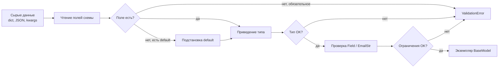

# Pydantic — валидация входящих данных

<div class="article-tags">
  <span class="tag tag-required">ОБЯЗАТЕЛЬНО</span>
  <span class="tag tag-beginner">ДЛЯ НОВИЧКОВ</span>
</div>

<span class="complexity-badge">Разработчику</span>
<span class="complexity-badge">Инженеру</span>

См. также: [Работа с типами](./21.md) · [FastAPI](./3431.md) · [Первая программа на FastAPI](./3432.md) · [Зависимости и pip](./39.md)

---

## О библиотеке

### Что такое входящие данные

**Входящие данные** — всё, что программа получает **извне** и ещё не контролирует полностью. Это не "внутренние переменные", которые вы сами создали в коде, а информация, пришедняя по границе приложения.

Типичные источники:

| Источник | Пример | Как выглядит в Python |
|----------|--------|------------------------|
| HTTP API | тело POST-запроса | `dict` после `request.json()` |
| Query-параметры | `?page=2&limit=10` | строки в словаре или аргументах |
| Ответ другого сервиса | JSON каталога товаров | `dict` / `list` |
| Файл конфигурации | `.env`, YAML | строки из окружения |
| Форма, CLI | аргументы командной строки | `str`, иногда `dict` |

Важная особенность: снаружи данные почти всегда **"грязные"**. JSON не знает про типы Python — число часто приходит строкой (`"30"`, `"99.5"`), поле может отсутствовать, быть `null`, иметь опечатку в ключе или неверный формат email. Query-параметры в HTTP — **всегда строки**, даже если по смыслу это число или дата.

Пока данные не проверены, безопасно считать их **недоверенными** — программа не может полагаться на то, что `age` — это именно `int`, а `email` — корректный адрес.

---

### Что такое валидация

**Валидация** — проверка, что данные **соответствуют ожидаемой схеме** — нужные поля есть, типы подходят, значения в допустимых пределах.

Валидация отвечает на вопросы:

- Есть ли обязательное поле `email`?
- Можно ли `age` интерпретировать как целое число?
- Не пустая ли строка `title`?
- Вложенный объект `address` содержит `city` и `zip_code`?

Валидация **не** отвечает на вопросы предметной области: "достаточно ли денег на счёте", "уникален ли логин в базе". Это уже **бизнес-логика** — она выполняется после того, как форма данных признана корректной.

Часто валидацию путают с **приведением типов** (coercion). Это разные шаги, но в Pydantic они идут вместе:

| Шаг | Смысл | Пример |
|-----|-------|--------|
| **Приведение** | Преобразовать значение к нужному типу, если это возможно | `"30"` → `30` |
| **Валидация** | Убедиться, что значение удовлетворяет правилам | `age` ≥ 0, email содержит `@` |

Если приведение или проверка не удались — данные **отклоняются**, и код получает явную ошибку (`ValidationError`), а не "тихий" сбой дальше по цепочке.

На старте проекта валидацию часто пишут вручную:

```python
def create_user(data: dict) -> None:
    if not isinstance(data.get("age"), int):
        raise ValueError("age должен быть int")
```

Такой подход быстро перестаёт масштабироваться — десятки полей, вложенные объекты, опциональные ключи, разные форматы на входе и на выходе. **Pydantic** как раз автоматизирует проверку и приведение по **одной описанной схеме**.

---

### Что такое Pydantic

**Pydantic** — библиотека Python для описания **схем данных**, **валидации** и **сериализации** на основе аннотаций типов (type hints).

Вы описываете ожидаемую форму данных классом:

```python
from pydantic import BaseModel


class User(BaseModel):
    name: str
    age: int
```

Класс `User` — это **контракт**: какие поля бывают и каких они типов. При создании объекта `User(...)` Pydantic:

1. принимает "сырые" значения (строки, словари, числа);
2. приводит их к типам полей, где это возможно;
3. проверяет ограничения;
4. возвращает **готовый объект** с нормализованными полями или выбрасывает `ValidationError`.

Pydantic **не является**:

- **ORM** — не ходит в базу и не мапит таблицы (для БД — SQLAlchemy, Django ORM; см. [Работа с базами данных в Python](./314.md));
- **статическим анализатором** — mypy проверяет код до запуска, Pydantic — **в рантайме** при создании модели (см. [Работа с типами — Работа с типами](./21.md));
- **заменой бизнес-логики** — только форма данных, не правила домена ([доменные объекты](/encyclopedia/7-project/7-06-proektirovanie-i-arhitektura/design-patterns/116)).

Pydantic v2 — отдельный пакет на PyPI; ядро валидации написано на Rust (`pydantic-core`), поэтому проверка быстрая. Библиотека de facto стандарт для [FastAPI](./3431.md), ETL, API-клиентов и конфигов.

---

### Как происходит обработка

Когда вы вызываете `User(name="Alex", age="30")` или `User(**json_dict)`, Pydantic проходит цепочку шагов. Упрощённо:

```text
АЛГОРИТМ СоздатьМодельPydantic(класс_модели, сырые_данные)
  схема := поля и типы из аннотаций класса_модели
  для каждого поля из схемы
    значение := взять из сырых_данных по имени поля
    если поле обязательное и значение отсутствует
      зафиксировать ошибку; перейти к следующему полю
    если задано значение_по_умолчанию и значение отсутствует
      подставить значение_по_умолчанию
    попытаться привести значение к типу поля        // "30" → 30
    если приведение не удалось
      зафиксировать ошибку
    применить ограничения Field                     // min_length, ge, EmailStr…
    если ограничение нарушено
      зафиксировать ошибку
    если тип поля — другая BaseModel
      рекурсивно СоздатьМодельPydantic(вложенная_модель, значение)
  если есть ошибки
    выбросить ValidationError со списком (поле, сообщение)
  иначе
    вернуть экземпляр класса_модели с нормализованными полями
КОНЕЦ
```



После — — $3.age` уже `int`, к нему можно применять арифметику и передавать дальше в сервис или ORM.

При ошибке Pydantic собирает **список проблем** — путь к полю (`loc`), текст (`msg`), код типа ошибки (`type`). В FastAPI это превращается в HTTP **422** с JSON `detail` — см. [Первая программа на FastAPI](./3432.md#curl).

---

## Установка

```bash
pip install pydantic
pip install "pydantic[email]"
```

Установка в venv и запись в `requirements.txt` — [Зависимости Python — requirements.txt, pyproject.toml и pip — зависимости и pip](./39.md).

| Пакет | Назначение |
|-------|------------|
| `pydantic` | Модели, валидация, `model_dump` |
| `pydantic[email]` | тип `EmailStr` |
| `pydantic-settings` | конфиг из `.env` — [ниже](#pydantic-settings) |

---

## Пример: от JSON к объекту

Типичный сценарий — тело запроса или ответ API:

```python
from pydantic import BaseModel


class Product(BaseModel):
    id: int
    title: str
    price: float


raw = {"id": "1", "title": "Keyboard", "price": "99.5"}
product = Product(**raw)
```

Что произошло:

- `**raw` распаковал словарь в аргументы конструктора.
- Pydantic **привёл** `"1"` → `1`, `"99.5"` → `99.5`.
- Поля `id`, `title`, `price` **провалидированы** по схеме.
- `product` — типизированный объект; дальше его можно использовать в коде без повторных проверок.

Некорректный ввод:

```python
from pydantic import ValidationError

try:
    Product(id="x", title="", price=-1)
except ValidationError as e:
    print(e.errors())
```

---

## Схема полей

### Обязательные, опциональные, значения по умолчанию

```python
from pydantic import BaseModel, EmailStr


class UserCreate(BaseModel):
    email: EmailStr
    nickname: str | None = None


class AppConfig(BaseModel):
    host: str = "localhost"
    port: int = 5432
```

| Запись | Поведение |
|--------|-----------|
| `email: EmailStr` | поле обязательно; формат email проверяется |
| `nickname: str \| None = None` | можно не передавать или передать `null` |
| `host: str = "localhost"` | если ключа нет — подставится default |

### Ограничения через Field

```python
from pydantic import BaseModel, Field


class NoteCreate(BaseModel):
    text: str = Field(min_length=1, max_length=500)
    priority: int = Field(default=0, ge=0, le=3)
```

`Field` добавляет правила поверх типа — длина строки, диапазон числа, описание для OpenAPI в FastAPI.

### Вложенные модели

```python
class Address(BaseModel):
    city: str
    zip_code: str


class User(BaseModel):
    name: str
    address: Address


user = User(name="Alex", address={"city": "Berlin", "zip_code": "10115"})
```

Вложенный `dict` обрабатывается **рекурсивно** той же цепочкой: приведение → проверка → вложенная модель. Ошибка в `zip_code` попадёт в `loc` как `('address', 'zip_code')`.

---

## Сериализация

Обратный путь — из модели наружу (ответ API, запись в лог):

```python
user.model_dump()       # dict
user.model_dump_json()  # JSON-строка
```

В Pydantic v2 методы `.dict()` и `.json()` из v1 заменены на `model_dump` / `model_dump_json`.

---

## Где используют Pydantic

| Сценарий | Зачем |
|----------|-------|
| [FastAPI](./3431.md) | проверка body, query, path; схема в `/docs` |
| API-клиент | убедиться, что ответ внешнего сервиса не "сломан" |
| ETL | схема строки до записи в БД |
| Конфиг | `BaseSettings` + переменные окружения |
| Граница с ORM | DTO отдельно от таблиц — [Работа с базами данных в Python](./314.md) |

---

<span id="pydantic-settings"></span>

## pydantic-settings

Для **входящих данных из окружения** (переменные OS, файл `.env`) в Pydantic v2 есть пакет **pydantic-settings**:

```bash
pip install pydantic-settings
```

```python
from pydantic_settings import BaseSettings, SettingsConfigDict


class Settings(BaseSettings):
    model_config = SettingsConfigDict(env_file=".env")

    database_url: str = "sqlite:///./app.db"
    debug: bool = False


settings = Settings()
```

Та же идея: при старте приложения Pydantic **валидирует** конфиг. Ошибка в `DEBUG=maybe` обнаружится сразу, а не в середине обработки запроса. Подробнее — [Рекомендации по разработке на Python — рекомендации по разработке](./101.md).

---

## Частые ошибки

| Симптом | Причина | Что сделать |
|---------|---------|-------------|
| `ImportError: email-validator` | не установлен extra `[email]` | `pip install "pydantic[email]"` |
| `.dict()` не работает | код под v1, стоит v2 | `model_dump()` |
| Поле всегда `None` | опечатка в ключе JSON | сверить имена с моделью |
| Проверки "не срабатывают" | класс без `BaseModel` | наследовать `BaseModel`, создавать экземпляр |
| Бизнес-правило в модели | смешали форму и домен | правило — в сервисный слой |

---

## Дальше по разделу Python

| Тема | Статья |
|------|--------|
| Аннотации типов | [Работа с типами — Работа с типами](./21.md) |
| FastAPI | [FastAPI — обзор](./3431.md) · [Первая программа на FastAPI — практикум](./3432.md) |
| БД и DTO | [FastAPI и база данных — FastAPI и SQLAlchemy](./3433.md) · [Работа с базами данных в Python — ORM](./314.md) |
| Безопасность API | [Безопасность приложений — валидация на границе](/encyclopedia/8-infra-security/8-07-informatsionnaya-bezopasnost/113) |
