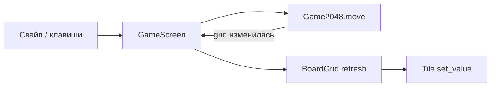

import ExternalCodeEmbed from '@site/src/components/ExternalCodeEmbed';


# Kivy — 2048

<span class="complexity-badge">Разработчику</span>
<span class="complexity-badge">Начальный уровень</span>

---

## О практикуме

**2048** — головоломка на поле 4×4: при сдвиге плитки с одинаковыми числами **сливаются** (2+2→4), на пустую клетку падает новая 2 или 4. Цель — плитка **2048**. Управление — **свайпы** на телефоне или стрелки / WASD на ПК.

**Почему 2048 первым в практикуме Kivy**

- ходы **дискретные** — не нужен постоянный `Clock` (в отличие от [Pong](./2.md));
- хорошо тренирует **свайп** — базовый жест мобильных игр ([Мобильные игры](/encyclopedia/9-spinoff/9-04-razrabotka-igr/122));
- логику легко вынести в отдельный файл без Kivy — чистая **модель**.

Проект разделён на **`game_logic.py`** (правила) и **`main.py`** (интерфейс) — тот же приём MVC, что в [SmallPong](/encyclopedia/5-languages/5-08-smalltalk/31) и [разделении логики в обзоре Kivy](../320.md).

**Оценка времени** — 2–3 часа.

### Карта этапов

| Этап | Фокус | Результат |
|------|--------|-----------|
| 0 | Окружение | Пустое окно Kivy |
| 1 | `Game2048` | Сдвиг и слияние без GUI |
| 2 | `Tile` | Цветная плитка с числом |
| 3 | `BoardGrid` | Сетка 4×4 |
| 4 | `GameScreen` | Заголовок, счёт, кнопка "Новая игра" |
| 5 | Свайп | Ходы по жесту |
| 6 | Клавиатура | Стрелки и `R` на десктопе |
| 7 | JsonStore | Сохранение рекорда |
| 8 | Ревизия | Итоговая самопроверка |

<div class="callout callout--info">
  <div class="callout-title">Для кого материал</div>
  <div class="callout-body">
  Нужны Python 3.10+, классы, списки и базовый Kivy (<code>App</code>, <code>Widget</code>, <code>GridLayout</code>). Теория фреймворка — <a href="../320.md">обзор Kivy</a>; Pygame-аналоги — <a href="/encyclopedia/9-spinoff/9-04-razrabotka-igr/praktikum-razrabotki-igr/intro">практикум игр</a> и <a href="/lab/Примеры/1132">мини-игры в Lab</a>.
  </div>
</div>

---

## Как проходить практикум

1. Создайте папку `kivy2048/`, venv и установите Kivy — [зависимости](#dependencies).
2. Идите этапы **0–8 по порядку** — после каждого запускайте `python main.py`.
3. Копируйте код **целиком** из блока этапа, без пропусков `# ...`.
4. Отмечайте **Самопроверку**; читайте **Разбор** — там связь строк с правилами 2048.
5. Финал — [этап 8](#stage-8) и сверка с суммой всех листингов.

**Маршрут чтения**

1. [Архитектура](#architecture) и [глоссарий](#glossary) — до первой строки кода.
2. [Зависимости](#dependencies) — окружение и структура файлов.
3. Этапы 0–8.
4. Переход к [Kivy — Pong](./2.md) или [сборке APK](../320.md#buildozer).

<span id="architecture"></span>

## Архитектура

Проект сознательно разделён на **модель** и **интерфейс** — тот же приём MVC, что в [SmallPong](/encyclopedia/5-languages/5-08-smalltalk/31) и [Match3](/encyclopedia/9-spinoff/9-04-razrabotka-igr/praktikum-razrabotki-igr/2):

```text
main.py
  Game2048App.build()
    └── GameScreen          ← свайп, клавиатура, JsonStore
          ├── ScoreBox      ← счёт и рекорд
          └── BoardGrid     ← 16 × Tile
                └── game: Game2048   ← game_logic.py, без import kivy
```



**Определение.** **Дискретный ход** — состояние меняется только после события (свайп, клавиша), а не каждый кадр. Поэтому здесь **не нужен** `Clock.schedule_interval` — в отличие от [Pong](./2.md) и [Snake](./3.md).

| Слой | Файл / класс | Ответственность |
|------|----------------|-----------------|
| Модель | `game_logic.py`, `Game2048` | Сетка 4×4, слияние, счёт, game over |
| Представление | `Tile`, `BoardGrid` | Цвета плиток, сетка на экране |
| Контроллер | `GameScreen` | Жесты, `refresh_ui()`, рекорд |

| Если смешать слои | Типичный баг |
|-------------------|--------------|
| Kivy в `game_logic.py` | Модель нельзя тестировать из REPL / pytest |
| `move()` внутри `draw()` | Двойные ходы за один жест |
| Обновление счёта в `Tile` | Рассинхрон UI и `game.score` |

<span id="glossary"></span>

## Глоссарий

| Термин | В этом практикуме |
|--------|-------------------|
| **Слияние (merge)** | Две соседние равные плитки в строке/столбце → одна с суммой; за ход каждая пара сливается **один раз** |
| **Сжатие (compress)** | Сдвиг всех ненулевых значений к краю без слияния |
| **Свайп** | Жест: `touch_down` → `touch_up`, порог `dp(30)` отсекает случайные тапы |
| **`refresh_ui()`** | Единая точка синхронизации модели и всех виджетов после `move()` |
| **`JsonStore`** | Простое key-value хранилище Kivy на JSON-файле для рекорда |
| **`sp` / `dp`** | Масштабируемые единицы Kivy — см. [обзор](../320.md) |

<span id="dependencies"></span>

## Зависимости

### Требования

- Python **3.10+**;
- pip;
- Kivy **2.3+** (OpenGL; на Android — через [Buildozer](../320.md#buildozer)).

### Окружение

```bash
mkdir kivy2048 && cd kivy2048
python -m venv .venv
```

Windows (PowerShell):

```powershell
.\.venv\Scripts\Activate.ps1
pip install "kivy>=2.3.0"
```

Linux / macOS:

```bash
source .venv/bin/activate
pip install "kivy>=2.3.0"
```

### Структура проекта

```text
kivy2048/
  game_logic.py   # с этапа 1 — правила без Kivy
  main.py         # App, экран, виджеты
  scores.json     # с этапа 7 — рекорд JsonStore
  requirements.txt   # опционально: kivy>=2.3.0
```

Подробнее про venv — [Зависимости Python](/encyclopedia/5-languages/5-02-python/39).

---

<span id="stage-0"></span>
## Этап 0 — окружение

**Цель.** Рабочее venv, установленный Kivy, пустое окно.

### Теория

**`App.build()`** — единственная точка, где Kivy ожидает корневой виджет. Пока это `Label`; на этапе 4 замените на `GameScreen`. Подробнее про жизненный цикл — [обзор Kivy](../320.md).

```bash
mkdir kivy2048 && cd kivy2048
python -m venv .venv && .venv\Scripts\activate
pip install "kivy>=2.3.0"
```

`main.py`:

```python
from kivy.app import App
from kivy.uix.label import Label


class Game2048App(App):
    def build(self):
        return Label(text="2048 — старт", font_size="32sp")


if __name__ == "__main__":
    Game2048App().run()
```

**Разбор.**

- `font_size="32sp"` — масштабируемый шрифт (аналог sp в Android, см. [обзор Kivy](../320.md)).
- `Game2048App` — имя класса по игре; позже `build()` вернёт полноценный экран.

**Самопроверка**

- [ ] `python main.py` открывает окно с текстом.
- [ ] Повторный запуск не выдаёт ошибок импорта.

---

<span id="stage-1"></span>
## Этап 1 — класс `Game2048`

**Цель.** Правила 2048 в чистом Python, без Kivy.

### Теория

Алгоритм одного хода (например, влево) — **три фазы** для каждой строки:

1. **Сжатие** — убрать нули, сдвинуть числа к краю.
2. **Слияние** — пройти слева направо; если `line[i] == line[i+1]`, сложить, записать сумму в `i`, обнулить `i+1` (каждая пара — **один раз** за ход).
3. **Повторное сжатие** — закрыть дыры после merge.

Для `_move_right` строку разворачивают, применяют left-merge, разворачивают обратно. Для up/down — обход **по столбцам** (транспонирование логики).

**Определение.** **`move(direction)`** возвращает `True`, только если сетка **изменилась** — тогда добавляется новая плитка 2/4 и проверяется `can_move()`. Иначе ход "пустой" и счёт не меняется.

Создайте **`game_logic.py`** — в нём **нет** `import kivy`. Такой модуль можно тестировать из REPL и [pytest](/encyclopedia/5-languages/5-02-python/37).

### Состояние игры

```python
class Game2048:
    SIZE = 4

    def reset(self):
        self.grid = [[0] * self.SIZE for _ in range(self.SIZE)]
        self.score = 0
        self.won = False
        self.game_over = False
        self._add_random_tile()
        self._add_random_tile()
```

**Разбор.**

- `grid` — двумерный список 4×4; `0` — пустая клетка.
- `won` — флаг "достигли 2048"; `game_over` — нет ходов.
- После сброса сразу две случайные плитки — как в оригинальной игре.

### Слияние строки

Метод `_compress_and_merge(line)`:

- убирает нули;
- объединяет соседние **равные** числа (один раз за ход на пару);
- дополняет нулями до длины 4;
- начисляет очки в `self.score`.

Направления:

- `_move_left` — построчно;
- `_move_right` — строка в обратном порядке, merge, снова reverse;
- `_move_up` / `_move_down` — обход по столбцам.

`move(direction)` возвращает `True`, если поле изменилось. Только тогда добавляется новая плитка и проверяется `can_move()`.

### Проверка без GUI

```python
from game_logic import Game2048
g = Game2048()
print(g.grid)
g.move("left")
print(g.score, g.grid)
```

**Самопроверка**

- [ ] После `reset` на поле ровно две ненулевые клетки.
- [ ] Повторный `move` в ту же сторону без эффекта возвращает `False`.
- [ ] При слиянии 2+2 счёт увеличивается на 4.
- [ ] `can_move()` возвращает `True`, пока есть пустые клетки или соседние равные.

---

<span id="stage-2"></span>
## Этап 2 — виджет `Tile`

**Цель.** одна ячейка поля — число на цветном фоне с закруглёнными углами.

Плитка — наследник `Widget` с дочерним `Label` и фоном `RoundedRectangle` в `canvas.before`:


<ExternalCodeEmbed example="python/py-502-kivy-praktikum-1-001" title="Этап 2 — виджет `Tile`" minHeight={390} />


**Разбор.**

- `canvas.before` — фон **под** текстом Label.
- Пустая клетка (`value == 0`) — без цифры, нейтральный фон.
- `tile_font_size(value)` — для 1024+ уменьшайте шрифт (`dp(42)` → `dp(22)`), иначе число не влезет.
- `bind(size=..., pos=...)` → `_redraw` — при ресайзе окна плитка остаётся на месте ([частая ошибка](../320.md#частые-ошибки)).

Палитра повторяет классическую схему веб-версии 2048.

**Самопроверка**

- [ ] Плитки с 2 и 128 визуально различаются цветом и размером цифры.
- [ ] При изменении размера окна плитка масштабируется.

---

<span id="stage-3"></span>
## Этап 3 — `BoardGrid`

**Цель.** 16 плиток в `GridLayout`, синхронизация с `game.grid`.

```python
class BoardGrid(GridLayout):
    def refresh(self):
        flat = [cell for row in self.game.grid for cell in row]
        for tile, value in zip(self.tiles, flat):
            tile.set_value(value)
```

**Разбор.**

- `cols=4` — фиксированная сетка; `spacing` и `padding` в `dp` — отступы между плитками.
- `refresh()` вызывается после **каждого** успешного `game.move()` — UI всегда отражает модель.
- Порядок `flat` — построчно слева направо, сверху вниз; должен совпадать с индексацией `grid[row][col]`.

**Самопроверка**

- [ ] Сетка 4×4 заполняет центральную область с отступами `dp(8)`.
- [ ] После тестового `move` в REPL и `refresh()` цифры на экране меняются.

---

<span id="stage-4"></span>
## Этап 4 — экран `GameScreen`

**Цель.** полный экран — заголовок, счёт, поле, кнопка, статус.

Соберите вертикальный `BoxLayout` (или `FloatLayout` с вложенным столбцом):

- заголовок "2048";
- блоки **СЧЁТ** и **РЕКОРД** (`ScoreBox` — `BoxLayout` с `RoundedRectangle` фоном);
- подсказка про свайпы;
- контейнер поля с фоном `BOARD_COLOR`;
- кнопка "Новая игра" → `game.reset()` + `refresh_ui()`;
- `status_label` — текст "Игра окончена!" / "Вы достигли 2048!".

```python
def refresh_ui(self):
    self.board.refresh()
    self.score_box.set_score(self.game.score)
    if self.game.game_over:
        self.status_label.text = "Игра окончена!"
    elif self.game.won:
        self.status_label.text = "Вы достигли 2048!"
    else:
        self.status_label.text = ""
```

**Разбор.**

- `refresh_ui()` — единая точка обновления UI после логики; не размазывайте обновление счёта по разным методам.
- Кнопка через `bind(on_press=self.new_game)` — стандартный паттерн Kivy ([обзор](../320.md)).

**Самопроверка**

- [ ] Кнопка "Новая игра" сбрасывает поле и счёт текущей партии.
- [ ] Счёт обновляется после ходов (временно — вызов `do_move` из кода или клавиатуры).

---

<span id="stage-5"></span>
## Этап 5 — свайп

**Цель.** ход по жесту — основной способ игры на телефоне.

В `GameScreen` сохраняйте `_touch_start` в `on_touch_down`, в `on_touch_up` вычисляйте смещение:

```python
SWIPE_THRESHOLD = dp(30)

if abs(dx) < self.SWIPE_THRESHOLD and abs(dy) < self.SWIPE_THRESHOLD:
    return  # короткий тап — не ход

if abs(dx) > abs(dy):
    direction = "right" if dx > 0 else "left"
else:
    direction = "up" if dy > 0 else "down"
self.do_move(direction)
```

`do_move` вызывает `game.move(direction)` и при `True` — `refresh_ui()`.

**Разбор.**

- **Порог** отсекает случайные тапы по кнопке "Новая игра".
- Сравнение `|dx|` и `|dy|` выбирает доминирующее направление — диагональный свайп станет горизонтальным или вертикальным.
- `collide_point` в `on_touch_down` — touch только внутри игрового экрана.

Тот же приём — в [Kivy — Snake](./3.md), этап 6, и в теории [сенсорного ввода](../320.md).

**Самопроверка**

- [ ] Свайп влево сдвигает плитки влево (мышью на ПК и пальцем на телефоне).
- [ ] Короткий тап не считается ходом.

---

<span id="stage-6"></span>
## Этап 6 — клавиатура

**Цель.** удобная отладка на десктопе без тачскрина.

```python
from kivy.core.window import Window

# в Game2048App.build():
screen = GameScreen()
Window.bind(on_key_down=screen.on_key_down)
return screen
```

Коды стрелок Kivy: 273–276. WASD: `w`=119, `a`=97, `s`=115, `d`=100. `R` — новая игра.

**Разбор.**

- Обработчик должен вернуть `True`, если клавиша обработана — иначе Kivy может передать её другим виджетам.
- На Android клавиатура в игре обычно не нужна; блок можно оставить только для десктопа.

**Самопроверка**

- [ ] Стрелки и WASD двигают плитки.
- [ ] `R` запускает новую партию.

---

<span id="stage-7"></span>
## Этап 7 — рекорд в JsonStore

**Цель.** сохранить лучший счёт между запусками приложения.

```python
from kivy.storage.jsonstore import JsonStore

self.store = JsonStore("scores.json")
self.best_score = (
    self.store.get("best")["score"] if self.store.exists("best") else 0
)
# в refresh_ui, при обновлении счёта:
if self.game.score > self.best_score:
    self.best_score = self.game.score
    self.store.put("best", score=self.best_score)
```

**Разбор.**

- `JsonStore` — простой key-value на JSON-файле; для одного рекорда достаточно.
- Для сложных сохранений смотрите SQLite ([работа с БД в Python](/encyclopedia/5-languages/5-02-python/314)) — здесь избыточно.

**Самопроверка**

- [ ] После перезапуска приложения рекорд отображается в блоке "РЕКОРД".
- [ ] Файл `scores.json` появляется в рабочей папке.

---

<span id="stage-8"></span>
## Этап 8 — полная ревизия

**Цель.** убедиться, что игра цельная и готова к следующему практикуму или сборке APK.

Сверьте проект с суммой листингов этапов 0–7 — вместе они дают полную реализацию.

**Управление в финальной версии**

| Ввод | Действие |
|------|----------|
| Свайп | Сдвиг плиток |
| Стрелки / WASD | То же на ПК |
| `R` | Новая игра |
| Кнопка "Новая игра" | Сброс партии |

**Итоговая самопроверка**

- [ ] Можно набрать 2048 (или проиграть при заполнении поля).
- [ ] Рекорд пишется в `scores.json`.
- [ ] `game_logic.py` не импортирует Kivy — модель тестируется отдельно.
- [ ] UI обновляется только через `refresh_ui()` / `board.refresh()`.

**Дальше** — [Kivy — Pong](./2.md) (непрерывная физика и `Clock`) или [сборка APK](../320.md#buildozer).

---
