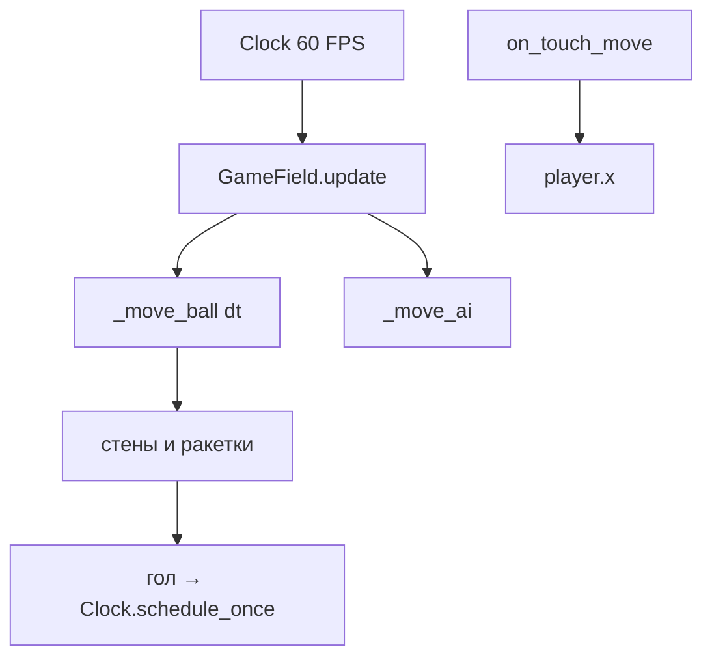

import ExternalCodeEmbed from '@site/src/components/ExternalCodeEmbed';


# Kivy — Pong

<span class="complexity-badge">Разработчику</span>
<span class="complexity-badge">Начальный уровень</span>

---

## О практикуме

**Pong** в **вертикальной** ориентации — удобной для телефона — ваша ракетка внизу, соперник (ИИ) сверху, мяч отскакивает от боковых стен и ракеток. Первый до **7 очков** побеждает. Управление — **перетаскивание пальцем** по полю (на ПК — зажатая мышь).

**Чему учит этот практикум**

- **Непрерывная физика** — позиция мяча обновляется каждый кадр через `Clock` ([обзор Kivy](../320.md));
- **canvas** — ракетки и мяч без PNG-спрайтов;
- **AABB-столкновения** — прямоугольники пересекаются или нет;
- **NumericProperty** — счёт обновляет Label автоматически;
- **адаптивные размеры** — `on_size` пересчитывает ракетки от долей поля.

Аналог на Pygame с клавиатурой и FSM — [Python — Ping Pong](/encyclopedia/9-spinoff/9-04-razrabotka-igr/praktikum-razrabotki-igr/3). Там классический горизонтальный корт; здесь — мобильный вертикальный и тач вместо WASD.

**Оценка времени** — 2–4 часа.

### Карта этапов

| Этап | Фокус | Результат |
|------|--------|-----------|
| 0 | Каркас App | Тёмное окно |
| 1 | `Paddle` | Цветная ракетка на canvas |
| 2 | `Ball` | Мяч с `serve()` |
| 3 | `GameField` | Фон, пунктир, дочерние виджеты |
| 4 | Движение мяча | `Clock.schedule_interval` |
| 5 | Стены | Отскок от левого и правого края |
| 6 | Ракетки | AABB и угол отскока |
| 7 | Тач | Ракетка следует за пальцем |
| 8 | Счёт и ИИ | Гол, подача, победа |
| 9 | Ревизия | Overlay "Tap to play again" |

<div class="callout callout--tip">
  <div class="callout-title">Как читать</div>
  <div class="callout-body">
  На каждом этапе — блок <strong>Разбор</strong> после кода. Застряли — сверьтесь с суммой листингов этапов 0–8 или перейдите к <a href="./3.md">Snake</a> после этапа 9.
  </div>
</div>

---

## Как проходить практикум

1. Создайте папку `kivypong/` и установите Kivy — см. [зависимости](#dependencies).
2. Весь код — в одном `main.py`; после каждого этапа запускайте `python main.py`.
3. Читайте **Разбор** — там связь `Clock`, `canvas` и AABB с мобильным UX.
4. Финал — [этап 9](#stage-9).

<span id="architecture"></span>

## Архитектура

В отличие от [2048](./1.md), здесь **непрерывная физика** — мяч обновляется каждый кадр через `Clock.schedule_interval`:

```text
PingPongApp
  └── BoxLayout (vertical)
        ├── Label — счёт You / CPU
        └── GameField (Widget)
              ├── canvas.before — фон, пунктир
              ├── opponent: Paddle
              ├── ball: Ball
              └── player: Paddle  ← on_touch_* drag
```



**Определение.** **AABB** (axis-aligned bounding box) — проверка пересечения двух `pygame.Rect`-подобных прямоугольников без поворота. Достаточно для Pong; подробнее о коллизиях — в [Pygame Pong, этап 9](/encyclopedia/9-spinoff/9-04-razrabotka-igr/praktikum-razrabotki-igr/3).

| Класс | Роль |
|-------|------|
| `Paddle` | Ракетка на `canvas`, `NumericProperty score` |
| `Ball` | Скорость, `serve()`, отскок |
| `GameField` | Поле, цикл, тач, ИИ, голы |
| `PingPongApp` | Компоновка, подписка на `score`, overlay |

<span id="dependencies"></span>

## Зависимости

```bash
mkdir kivypong && cd kivypong
python -m venv .venv && .venv\Scripts\activate   # Windows
pip install "kivy>=2.3.0"
```

Структура: один файл `main.py`. Сравните с пакетом `game/` в [Pygame Pong](/encyclopedia/9-spinoff/9-04-razrabotka-igr/praktikum-razrabotki-igr/3) — там к этапу 14 логику выносят в модули.

---

<span id="stage-0"></span>
## Этап 0 — каркас

**Цель.** `App`, тёмный фон окна, вертикальный layout.

### Теория

**`Window.clearcolor`** задаёт цвет **за** виджетами — полезно для letterbox на широких мониторах. **`BoxLayout(orientation="vertical")`** — типичный каркас мобильного экрана — HUD сверху, игровое поле растягивается через `size_hint=(1, 1)` на этапе 3.

```bash
mkdir kivypong && cd kivypong
pip install "kivy>=2.3.0"
```


<ExternalCodeEmbed example="python/py-502-kivy-praktikum-2-001" title="Теория" minHeight={354} />


**Разбор.**

- `Window.clearcolor` — цвет **вне** виджетов (поля за layout).
- `orientation="vertical"` — заголовок сверху, поле займёт оставшееся место на этапе 8.

**Самопроверка**

- [ ] Окно с тёмным фоном открывается.

---

<span id="stage-1"></span>
## Этап 1 — `Paddle`

**Цель.** виджет-ракетка, нарисованный `Rectangle` на `canvas`.


<ExternalCodeEmbed example="python/py-502-kivy-praktikum-2-002" title="Этап 1 — `Paddle`" minHeight={390} />


**Разбор.**

- `color` — кортеж RGBA `(r, g, b, a)` от 0 до 1.
- `score = NumericProperty(0)` — при изменении можно `bind(score=...)` ([Properties](../320.md)).
- Ракетка — обычный `Widget`, не `Button`; клики проходят к родителю `GameField`.

**Самопроверка**

- [ ] Две ракетки разного цвета видны на поле.

---

<span id="stage-2"></span>
## Этап 2 — `Ball`

**Цель.** мяч с начальной скоростью при подаче.


<ExternalCodeEmbed example="python/py-502-kivy-praktikum-2-003" title="Этап 2 — `Ball`" minHeight={498} />


**Разбор.**

- `Ellipse` в квадратном виджете выглядит как круг.
- `uniform(-0.35, 0.35)` — случайный небольшой горизонтальный компонент при подаче.
- `direction_y` — вниз к игроку (-1) или вверх к ИИ (+1) после гола.

**Самопроверка**

- [ ] Мяч отображается белым кругом.

---

<span id="stage-3"></span>
## Этап 3 — `GameField`

**Цель.** контейнер поля с фоном, центральной линией и тремя игровыми виджетами.

`GameField(Widget)` добавляет `player`, `opponent`, `ball` как дочерние элементы.

В `canvas.before`:

- тёмный `Rectangle` — фон поля;
- пунктирная `Line` по центру по вертикали (разделение кортов).

В `on_size` пересчитывайте размеры от **долей** поля — адаптивность без жёстких пикселей:

```python
paddle_w = min(self.width * 0.28, 220)
paddle_h = max(self.height * 0.025, 14)
ball_size = max(min(self.width, self.height) * 0.035, 16)
```

Позиции:

- игрок внизу — `y + height * 0.04`;
- соперник сверху — `top - paddle.height - height * 0.04`;
- мяч в центре при `reset_positions()`.

**Разбор.**

- `canvas.before` рисуется **под** ракетками и мячом.
- `center_line.points` обновляйте в `_update_background` при ресайзе.
- См. [адаптивный дизайн](/encyclopedia/9-spinoff/9-04-razrabotka-igr/122) — проценты вместо фиксированных px.

**Самопроверка**

- [ ] При изменении размера окна ракетки и мяч перестраиваются.
- [ ] Пунктир проходит по центру поля.

---

<span id="stage-4"></span>
## Этап 4 — игровой цикл

**Цель.** мяч движется плавно, ~60 кадров в секунду.


<ExternalCodeEmbed example="python/py-502-kivy-praktikum-2-004" title="Этап 4 — игровой цикл" minHeight={318} />


**Разбор.**

- В Pygame тот же приём — `ball.x += vx * dt` после `clock.tick()` ([практикум Pygame Pong](/encyclopedia/9-spinoff/9-04-razrabotka-igr/praktikum-razrabotki-igr/3)).
- `running = False` останавливает физику между подачами.
- `start_round()` вызывает `ball.serve()` и ставит `running = True`.

**Самопроверка**

- [ ] После `start_round()` мяч движется плавно.

---

<span id="stage-5"></span>
## Этап 5 — боковые стены

**Цель.** отскок от левого и правого края поля.

```python
if ball.right >= self.right:
    ball.x = self.right - ball.width
    ball.velocity_x *= -1
elif ball.x <= self.x:
    ball.x = self.x
    ball.velocity_x *= -1
```

**Разбор.**

- Сначала **выталкиваем** мяч из стены (`ball.x = ...`), иначе он "залипнет".
- Инверсия `velocity_x` — упругий отскок без потери скорости (пока без затухания).

**Самопроверка**

- [ ] Мяч отскакивает от левого и правого края.

---

<span id="stage-6"></span>
## Этап 6 — столкновение с ракеткой

**Цель.** мяч отскакивает от ракеток; угол зависит от точки удара.

### AABB (axis-aligned bounding box)

```python
def _collides_with_paddle(self, ball, paddle):
    return (
        ball.y < paddle.top
        and ball.top > paddle.y
        and ball.right > paddle.x
        and ball.x < paddle.right
    )
```

Прямоугольники пересекаются, если по обеим осям есть наложение.

### Угол отскока

```python
offset = (ball.center_x - paddle.center_x) / (paddle.width / 2)
offset = max(-1, min(1, offset))
speed = Vector(ball.velocity_x, ball.velocity_y).length()
speed = min(speed * 1.04, self.ball_speed * 1.6)
ball.velocity_x = speed * offset * 0.85
ball.velocity_y = speed * (1 if upward else -1)
ball.y = paddle.top if upward else paddle.y - ball.height
```

**Разбор.**

- Удар по **краю** ракетки (`offset` близок к ±1) — сильный горизонтальный компонент.
- Удар по **центру** — мяч летит почти вертикально.
- Коэффициент `1.04` слегка ускоряет мяч; `cap` не даёт бесконечно разогнаться.
- После отскока выставляем `ball.y` — мяч не остаётся внутри ракетки (иначе множественные столкновения).

Та же идея угла — в [Pygame Pong, этап 9](/encyclopedia/9-spinoff/9-04-razrabotka-igr/praktikum-razrabotki-igr/3).

**Самопроверка**

- [ ] Мяч отскакивает от обеих ракеток.
- [ ] Удар по краю меняет траекторию сильнее, чем по центру.

---

<span id="stage-7"></span>
## Этап 7 — сенсорное управление

**Цель.** нижняя ракетка следует за пальцем.


<ExternalCodeEmbed example="python/py-502-kivy-praktikum-2-005" title="Этап 7 — сенсорное управление" minHeight={444} />


`_clamp_paddle_x` ограничивает X ракетки границами поля.

**Разбор.**

- `return True` — событие не уходит к дочерним виджетам; поле "владеет" жестом.
- Центр ракетки под пальцем — `touch.x - width/2`; так привычнее на телефоне.
- На ПК работает зажатая **мышь** — удобно для отладки без устройства.

Свайп (короткий жест) здесь не нужен — важен **drag** ([типы ввода в мобильных играх](/encyclopedia/9-spinoff/9-04-razrabotka-igr/122)).

**Самопроверка**

- [ ] Ракетка следует за мышью при зажатой кнопке.
- [ ] Ракетка не выходит за края поля.

---

<span id="stage-8"></span>
## Этап 8 — счёт, ИИ, победа

**Цель.** голы, подача после паузы, победа до 7, overlay перезапуска.

### ИИ соперника

Плавное движение к проекции мяча на X ракетки:

```python
def _move_ai(self, dt):
    target_x = self.ball.center_x - self.opponent.width / 2
    diff = target_x - self.opponent.x
    step = self.ai_speed * dt
    # двигаться не больше step за кадр — не телепорт
```

`ai_speed` чуть меньше реакции идеального игрока — матч остаётся выигрываемым.

### Гол

- мяч ниже нижней ракетки → очко **сопернику**;
- выше верхней → очко **игроку**;
- `running = False`, `Clock.schedule_once(..., 0.8)` → `start_round(direction_y=...)`.

### UI счёта

В `PingPongApp.build()`:

- заголовок `You: N` / `CPU: N`;
- `self.field.player.bind(score=self._update_score_labels)`;
- при 7 очках — overlay `Label` "You win!" / "CPU wins!" и "Tap to play again";
- тап по overlay сбрасывает счёт и вызывает `start_round()`.

**Самопроверка**

- [ ] Счёт увеличивается при пропуске мяча.
- [ ] Партия заканчивается при 7 очках.
- [ ] После тапа по overlay начинается новая партия.

---

<span id="stage-9"></span>
## Этап 9 — ревизия

**Цель.** финальная проверка и переход к [Snake](./3.md).

Сверка с суммой листингов этапов 0–8.

**Управление**

| Ввод | Действие |
|------|----------|
| Перетаскивание по полю | Движение нижней ракетки |
| Тап на overlay | Новая партия после победы |

**Итоговая самопроверка**

- [ ] ИИ отбивает большинство мячей, но не непобедим.
- [ ] Скорость мяча слегка растёт после отскока (1.04, с ограничением).
- [ ] Весь код в одном `main.py` — для учебного проекта нормально; в [Pygame Pong](/encyclopedia/9-spinoff/9-04-razrabotka-igr/praktikum-razrabotki-igr/3) к этапу 14 выносят пакет `game/`.

**Дальше** — [Kivy — Snake](./3.md).

---
