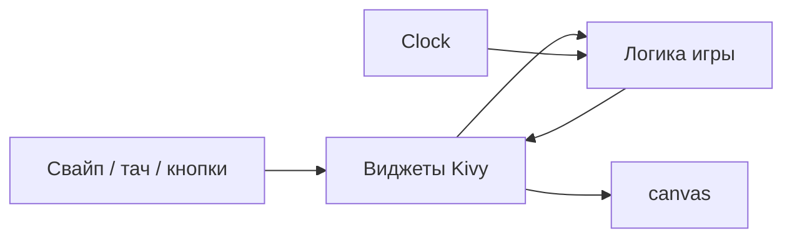

import DocCardList from '@theme/DocCardList';

# Практикум Kivy — о разделе

<span class="complexity-badge">Разработчику</span>
<span class="complexity-badge">Начальный уровень</span>

---

## О разделе

Здесь — **три сквозных учебных проекта** на **Python** и **Kivy**: классические мини-игры с **сенсорным управлением**. Каждый проект можно отладить на десктопе (`python main.py`), а затем упаковать в APK ([сборка APK](../320.md#buildozer)).

**Kivy** в этих практикумах — фреймворк, где UI и тач — первоклассные граждане. Вы потренируете:

- отрисовку на `canvas` (плитки, мяч, сегменты змейки);
- жесты — свайп и перетаскивание;
- игровой тик через `Clock.schedule_interval`;
- разделение логики и интерфейса.

Теория фреймворка — [Kivy — мобильные приложения и игры на Python](../320.md). Мобильный контекст (тач, экраны, публикация) — [раздел "Мобильные приложения"](/encyclopedia/4-code-dev/4-12-mobilnye-prilozheniya/intro).

<div class="callout callout--info">
  <div class="callout-title">Для кого материал</div>

  <div class="callout-body">
  Нужны Python 3.10+, базовые классы и списки, установленный <code>kivy>=2.3.0</code>. Желательно прочитать <a href="../320.md">обзор Kivy</a> (разделы про <code>Clock</code>, <code>canvas</code>, <code>on_touch_*</code>).<br/>
  Аналоги на Pygame (десктоп, клавиатура) — <a href="/encyclopedia/9-spinoff/9-04-razrabotka-igr/praktikum-razrabotki-igr/intro">Практикум разработки игр</a>, <a href="/lab/Примеры/1132">мини-игры в Lab</a>.
  </div>
</div>

---

## Три игры — три навыка

| Практикум | Чему учит | Управление | Ключевые API |
|-----------|-----------|------------|--------------|
| [Kivy — 2048](./1.md) | Дискретные ходы, модель без UI, JsonStore | Свайп / стрелки | `GridLayout`, свайп, `JsonStore` |
| [Kivy — Pong](./2.md) | Непрерывная физика, ИИ, счёт | Перетаскивание | `Clock`, `NumericProperty`, AABB |
| [Kivy — Snake](./3.md) | Тик по сетке, рост, ускорение | D-pad + свайп | `schedule_interval`, D-pad, `set` |

Локальные проекты-образцы не требуются — **полный код** собирается из листингов этапов в каждой статье; финальная версия 2048 — на [этапе 8](./1.md#stage-8), Pong — [этап 9](./2.md#stage-9), Snake — [этап 8](./3.md#stage-8).

---

## Словарь раздела

| Термин | Значение |
|--------|----------|
| **`App.build()`** | Корневая точка Kivy — возвращает дерево виджетов |
| **`canvas` / `canvas.before`** | Слой рисования OpenGL внутри `Widget` |
| **`Clock.schedule_interval`** | Игровой тик с фиксированным `dt` (Pong, Snake) |
| **`NumericProperty`** | Реактивное поле — UI обновляется через `bind` |
| **`dp` / `sp`** | Плотность-независимые пиксели — [обзор Kivy](../320.md) |
| **`JsonStore`** | Лёгкое сохранение на диск (рекорд в 2048) |
| **Свайп vs drag** | 2048/Snake — короткий жест; Pong — удержание и перетаскивание |

---

## Что общего у всех трёх проектов

Несмотря на разную механику, каркас одинаковый:

- **`App.build()`** возвращает корневой layout (`BoxLayout` / `FloatLayout`).
- **Состояние игры** живёт в отдельном классе или модуле, UI только отображает и передаёт ввод.
- **Ввод** — touch-события; на ПК те же обработчики работают с мышью.
- **Запуск после каждого этапа** — привычка из [отладки и разработки](/encyclopedia/4-code-dev/4-14-razrabotka-i-otladka/intro): маленькие шаги, частая проверка.



---

## Общая подготовка

Создайте отдельную папку под каждую игру (или один репозиторий с тремя подпапками).

```bash
mkdir my-kivy-game && cd my-kivy-game
python -m venv .venv
# Windows: .venv\Scripts\activate
pip install "kivy>=2.3.0"
```

Файл `requirements.txt`:

```
kivy>=2.3.0
```

Подробнее про venv — [Зависимости Python](/encyclopedia/5-languages/5-02-python/39).

Создайте `main.py` и запускайте после **каждого** этапа: `python main.py`. Если окно не открывается — не переходите к следующему шагу.

---

## Рекомендуемый порядок

1. **[2048](./1.md)** — проще всего: ходы дискретные, постоянный `Clock` не нужен. Хороший старт для свайпов и `GridLayout`.
2. **[Pong](./2.md)** — непрерывная физика, `schedule_interval`, столкновения. Ближе всего к [Pygame Pong](/encyclopedia/9-spinoff/9-04-razrabotka-igr/praktikum-razrabotki-igr/3), но с тачем вместо WASD.
3. **[Snake](./3.md)** — комбинирует тик, рост змейки и **два** способа ввода (свайп + D-pad), как в реальных мобильных играх.

После всех трёх:

- попробуйте [Buildozer](../320.md#buildozer) для APK;
- сравните с [Flutter](/encyclopedia/5-languages/5-22-dart/311), если нужен продуктовый мобильный UI;
- вернитесь к [Мобильным играм](/encyclopedia/9-spinoff/9-04-razrabotka-igr/122) за контекстом жестов и монетизации.

---

## Как проходить каждый практикум

1. Создайте папку проекта и `requirements.txt` с `kivy>=2.3.0`.
2. Идите по этапам **по порядку** — после каждого запускайте `python main.py`.
3. Отмечайте пункты **Самопроверка** в статье.
4. В конце сверьте проект с **суммой листингов всех этапов** статьи или пройдите этапы 0–N подряд ещё раз.

**Оценка времени на весь раздел** — 6–10 часов при прохождении всех трёх игр подряд; одну игру можно уложить в один вечер (2–4 ч).

<DocCardList />

{/* sidebar-collections */}

---

## В подборках

**Языки и первая программа** — [Python — о разделе](/encyclopedia/5-languages/5-02-python/intro), [Разработка игр на Python](/encyclopedia/5-languages/5-02-python/312), [Kivy — обзор](/encyclopedia/5-languages/5-02-python/320).

**Мобильная разработка** — [Мобильные приложения — о разделе](/encyclopedia/4-code-dev/4-12-mobilnye-prilozheniya/intro), [Мобильные игры](/encyclopedia/9-spinoff/9-04-razrabotka-igr/122), [Сборка мобильных приложений](/encyclopedia/4-code-dev/4-12-mobilnye-prilozheniya/112).

**Разработка видеоигр** — [Практикум разработки игр](/encyclopedia/9-spinoff/9-04-razrabotka-igr/praktikum-razrabotki-igr/intro), [Python — Ping Pong (Pygame)](/encyclopedia/9-spinoff/9-04-razrabotka-igr/praktikum-razrabotki-igr/3), [SmallPong (Pharo)](/encyclopedia/5-languages/5-08-smalltalk/31).

{/* /sidebar-collections */}

---
