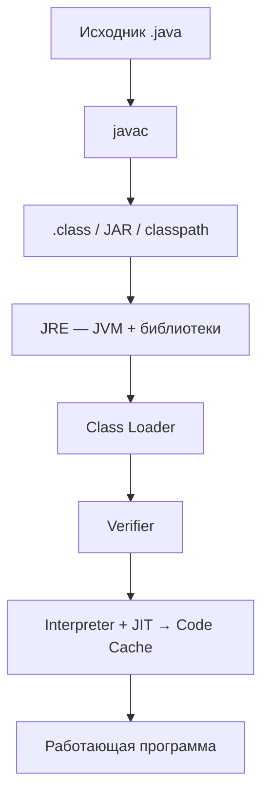

import ExternalPlayEmbed from '@site/src/components/ExternalPlayEmbed';


# Основы языка Java

<div class="article-tags">
  <span class="tag tag-required">ОБЯЗАТЕЛЬНО</span>
  <span class="tag tag-beginner">ДЛЯ НОВИЧКОВ</span>
</div>

<span class="complexity-badge">Разработчику</span>
<span class="complexity-badge">Архитектору</span>

<ExternalPlayEmbed example="data-markup/language-intro-play" title="Обзор языка разметки/данных" minHeight={520} playProps={{ topic: 'java' }} />

---

## О языке

### Что такое Java?

**Java** — это язык программирования со следующими особенностями:

- **Типизация** — статическая, сильная; вывод типов ограниченный (`var` для локальных переменных, diamond operator для дженериков).
- **Парадигма** — в первую очередь объектно-ориентированный; также императивный; с Java 8 — функциональные элементы (лямбды, Stream API).
- **Уровень** — высокоуровневый.
- **Выполнение** — компилируемый в байт-код (`javac` → `.class`); на JVM — интерпретация и JIT-компиляция "на лету" (HotSpot и др.).
- **Память** — автоматическая (сборщик мусора — G1, ZGC, Shenandoah и др.); ручного управления памятью в стандартном Java нет.
- **Платформа** — кроссплатформенный; управляемый runtime (JVM/JRE); байт-код один, нативный код генерирует JVM под конкретную ОС.
- **Формат разработки** — требует структуры проекта — пакеты, classpath, сборка (Maven, Gradle); с Java 11+ можно запустить один `.java` через `java Hello.java`, но для реальных приложений нужна организация каталогов и зависимостей.
- **Направление** — универсальный; сильнее всего — enterprise-бэкенд, Android (наряду с Kotlin), микросервисы, Big Data (Hadoop, Spark).
- **REPL** — есть: **JShell** (`jshell` в JDK 9+), интерактивные scratch-файлы в IntelliJ IDEA и других IDE.
- **Поколение** — классический (с 1995 года), активно развивающийся (релизы каждые 6 месяцев, LTS-ветки).
- **Параллелизм и асинхронность** — нативные потоки ОС (`Thread`, `ExecutorService`, `ForkJoinPool`, `java.util.concurrent`); асинхронность — `CompletableFuture`, реактивные библиотеки; с Java 21 — виртуальные потоки (Project Loom).
- **Безопасность** — относительно "безопасный" — проверка байт-кода (Verifier), отсутствие арифметики указателей, bounds checking, GC; типичные риски — `NullPointerException`, небезопасные приведения без дженериков, уязвимости в зависимостях.

Если какой-то пункт из списка непонятен — подробные определения и примеры в [Язык программирования](/encyclopedia/4-code-dev/4-02-chto-takoe-kod-i-kak-on-rabotaet/101).

## Как работает Java?

### Основы языка

> **Java** — это высокоуровневый, объектно-ориентированный язык программирования общего назначения.

★ **Java** – один из самых знаменитых объектно-ориентированных языков программирования, разработанный компанией Sun Microsystems, а нынче принадлежащий корпорации Oracle. Язык сочетает строгую типизацию, автоматическое управление памятью и кроссплатформенность за счёт выполнения байт-кода на виртуальной машине. Основная философия языка выражена в девизе "написал один раз — запускай где угодно".

Если спросить, чем Java особенная, то вот ответ - в Java исходный код компилируется не в машинный код для конкретной архитектуры процессора, а в промежуточный байт-код (`.class` файлы). Этот байт-код выполняется на виртуальной машине Java (**JVM** — Java Virtual Machine), которая является частью среды выполнения Java (**JRE**). JVM выступает в роли абстрактного слоя, интерпретирующего или компилирующего байт-код в нативный код под конкретную операционную систему (Windows, Linux, macOS, Android и др.).

```text
АЛГОРИТМ ЗапускJava(исходник.java)
  байткод := javac(исходник)              // файл .class
  JVM.загрузить(байткод)
  пока программа_работает
    если горячий_метод то
      нативный_код := JIT(байткод)        // ускорение "на лету"
    иначе
      интерпретировать(байткод)
    конец
  конец
КОНЕЦ
```

| Компонент | Роль |
|-----------|------|
| `javac` | Компилятор JDK: исходник → байт-код |
| `JVM` | Загрузка классов, память, GC, JIT |
| `JRE` | JVM + библиотеки для запуска без компилятора |

### Путь от исходника до запуска

<span id="put-isxodnika-do-zapuska"></span>

Упрощённая схема жизненного цикла Java-программы — от файла в редакторе до работающего процесса на конкретной ОС:

| Этап | Что происходит | Кто участвует |
|------|----------------|---------------|
| **Исходник** | Код пишут в `.java`, группируют по пакетам | редактор, IDE |
| **Компиляция** | `javac` переводит исходник в байт-код `.class` | компилятор JDK |
| **Артефакты** | Классы складывают в каталог, JAR или модули; для запуска нужен **classpath** и зависимости | Maven, Gradle, `jar` |
| **Загрузка** | JVM находит классы и подгружает их в runtime | **Class Loader** |
| **Выполнение** | **Verifier** проверяет байт-код; дальше **интерпретатор** и **JIT**; горячие методы попадают в **Code Cache** как нативный код | JVM, стандартные библиотеки `java.*` / `jdk.*` |
| **Запуск** | Процесс исполняет смесь интерпретируемого байт-кода и JIT-скомпилированного машинного кода | HotSpot и другие реализации JVM |



Разделение ролей — основа девиза **Write Once, Run Anywhere**: `javac` один раз готовит платформенно-независимый байт-код, а JVM под конкретную ОС и CPU переводит его в исполняемые действия.

<div class="callout callout--info">
  <div class="callout-title">Куда копать глубже</div>

  <div class="callout-body">
  Внутренности JVM (память, GC, потоки, C1/C2) — в [JVM, память и потоки](./23.md).

  Общая теория байт-кода, интерпретации и JIT — в [Исполнение байт-кода виртуальными машинами](/encyclopedia/4-code-dev/4-03-vypolnenie-koda/314).

  Первая программа с командами — в [Первая программа на Java](./13.md).
  </div>
</div>

<div class="callout callout--tip">
  <div class="callout-title">Как это выглядит</div>

  <div class="callout-body">
  Пошаговая таблица и схема — в разделе [Путь от исходника до запуска](#put-isxodnika-do-zapuska) выше.

  Первая программа с установкой JDK — в статье [Первая программа на Java](/encyclopedia/5-languages/5-03-java/13).
  </div>
</div>


<ExternalPlayEmbed example="about/compiler-simulator" title="Compiler Simulator" />

Sun Microsystems создала язык в рамках проекта Green для программирования бытовой электроники. Первоначальное название проекта — Oak. Позже команда переориентировала разработку на интернет-приложения, сменив название на Java. В 2010 году корпорация Oracle приобрела Sun Microsystems вместе со всеми её активами, включая права на Java.

Oracle Corporation — американская технологическая компания, специализирующаяся на разработке программного обеспечения, баз данных и облачных решений. После приобретения Sun Microsystems Oracle стала владельцем платформы Java, определяет стратегию развития языка и выпускает официальные дистрибутивы.

После изучения этой главы обязательно почитайте документацию Java: [Oracle Java SE](https://docs.oracle.com/en/java/), [OpenJDK](https://openjdk.org/), [Metanit: Java](https://metanit.com/java/). Для второго прохода по Core Java на русском — [конспект GitBook](https://andrey-ivantsov.gitbook.io/java) и [proglang.su](http://proglang.su/java); карта тем — в [о разделе](./intro.md). Для установки JDK, VS Code, Azure и CI смотрите навигатор [Документация и инструменты Java (Microsoft)](./294.md) — [хаб Microsoft](https://learn.microsoft.com/ru-ru/java/), [сборка OpenJDK](https://learn.microsoft.com/ru-ru/java/openjdk/download).

Чит-лист - https://cheatsheets.zip/java

### В рунет-дискурсе

В чатах и на форумах **Java** иногда смешивают с **JavaScript** — разные языки, разные экосистемы. Сокращения "джава" и "жабаскрипт" в шутках допустимы в [форумной культуре](/encyclopedia/9-spinoff/9-10-internet-kultura/120), в резюме и тикетах пишите полные имена. Репутация "тяжёлого enterprise" и мемы эпохи XML — в [истории Java](./11.md#в-рунет-дискурсе).

---

### Состав дистрибутива Java

Дистрибутивы Java поставляются в трёх основных вариантах:

**JDK (Java Development Kit)** — полный комплект разработчика. Включает:
- Компилятор javac для преобразования исходного кода в байт-код
- Виртуальную машину JVM для выполнения байт-кода
- Стандартные библиотеки классов (java.lang, java.util, java.io и другие)
- Отладчик jdb
- Утилиты для работы с архивами (jar), документацией (javadoc), профилированием
- Заголовочные файлы для нативной разработки

**JRE (Java Runtime Environment)** — среда выполнения. Содержит:
- Виртуальную машину JVM
- Стандартные библиотеки классов
- Поддержку безопасности и локализации
- Ресурсы для запуска готовых приложений

**JVM (Java Virtual Machine)** — программная машина, выполняющая байт-код Java. Состоит из:
- Загрузчика классов (Class Loader), отвечающего за поиск и загрузку .class-файлов
- Области памяти — кучи (Heap) для объектов, стека (Stack) для вызовов методов, метод-области (Method Area) для метаданных классов
- Механизма выполнения: интерпретатора для построчного выполнения и JIT-компилятора
- Сборщика мусора (Garbage Collector) для автоматического освобождения памяти
- Системы безопасности с проверкой байт-кода и управлением правами

Каждая операционная система имеет собственную реализацию JVM. Oracle предоставляет официальные сборки для Windows, Linux, macOS. Альтернативные реализации включают OpenJDK (открытое ядро), Adoptium, Amazon Corretto, Azul Zulu.

При установке дистрибутива Java создаётся корневая директория, содержащая подкаталоги:

- `bin` — исполняемые файлы (`java`, `javac`, `jar`, `jdb`)
- `lib` — библиотеки платформы
- `jmods` — модули для компиляции собственных runtime
- `conf` — конфигурационные файлы
- `legal` — лицензионная информация

Типичные пути установки:
- Windows: `C:\Program Files\Java\jdk-21`
- Linux: `/usr/lib/jvm/java-21-openjdk`
- macOS: `/Library/Java/JavaVirtualMachines/jdk-21.jdk/Contents/Home`

Для глобального использования команд java и javac требуется настроить переменную PATH. Пример для Linux/macOS в файле ~/.bashrc или ~/.zshrc:

```bash
export JAVA_HOME=/usr/lib/jvm/java-21-openjdk
export PATH=$JAVA_HOME/bin:$PATH
```

После изменения требуется перезагрузить оболочку или выполнить:

```bash
source ~/.bashrc
```

Проверка установки:

```bash
java -version
javac -version
```

Переменная JAVA_HOME используется сборочными системами (Maven, Gradle) и серверами приложений для определения расположения JDK.


---

### Как работает Java

Java представляет собой компилируемый язык программирования. Программа требует чёткой организации файлов и каталогов. Минимальная структура проекта:

```
my-project/
├── src/
│   └── main/
│       └── java/
│           └── com/
│               └── example/
│                   └── HelloWorld.java
├── bin/
│   └── com/
│       └── example/
│           └── HelloWorld.class
└── lib/
    └── dependencies.jar
```

Каждый класс размещается в файле с именем, совпадающим с именем класса. Каталоги отражают пакетную структуру. Например, класс `com.example.HelloWorld` должен находиться в файле `src/main/java/com/example/HelloWorld.java`.

Компиляция с сохранением структуры пакетов:

```
javac -d bin src/main/java/com/example/HelloWorld.java
```

Флаг `-d` указывает корневую директорию для размещения скомпилированных классов с сохранением иерархии пакетов.

Проект Java включает:

- Исходные файлы (.java) с реализацией классов и интерфейсов
- Ресурсы — конфигурации, шаблоны, статические файлы
- Файлы сборки: pom.xml для Maven или build.gradle для Gradle
- Описание зависимостей: перечень библиотек и их версий
- Скрипты запуска и развёртывания
- Документация в формате Javadoc
- Тесты в отдельной директории src/test/java

Современные проекты используют системы сборки для автоматизации компиляции, управления зависимостями и упаковки.

Для запуска программы требуется только наличие совместимой JVM на целевой платформе. Это позволяет запускать один и тот же скомпилированный код на разных операционных системах без перекомпиляции.

> Виртуальная машина Java — программная платформа, выполняющая байт-код независимо от операционной системы.

Программы на Java транслируются в байт-код, который выполняет **виртуальная машина Java (JVM)**. Сводная схема этапов — в разделе [Путь от исходника до запуска](#put-isxodnika-do-zapuska); здесь тот же путь в виде списка:
1. Исходный код пишется программистом и сохраняется в файлах `.java`;
2. Компилятор `javac` преобразует `.java` в байт-код — файлы `.class`;
3. JVM загружает классы, проверяет байт-код (verifier) и выполняет его: сначала часто через интерпретацию, затем через **JIT-компиляцию** "горячих" методов в машинный код;
4. Процессор выполняет уже сгенерированный нативный код (или интерпретируемые инструкции JVM — в зависимости от этапа).

Упакованный исполняемый файл генерируется в формате **.jar**. Он включает в себя **.class** и **ресурсы**. 


Файл с расширением .jar (Java ARchive) представляет собой архив в формате ZIP, содержащий:
- Скомпилированные классы (.class)
- Ресурсы — изображения, конфигурационные файлы, шрифты
- Метаданные в каталоге META-INF/, включая манифест MANIFEST.MF
- Зависимости и вложенные библиотеки

Манифест определяет точку входа приложения через атрибут Main-Class. Пример содержимого манифеста:

```
Manifest-Version: 1.0
Main-Class: com.example.MainApplication
Class-Path: lib/dependency1.jar lib/dependency2.jar
```

Архивы JAR упрощают распространение приложений. Для запуска используется команда:

```
java -jar приложение.jar
```

JIT-компиляция повышает производительность выполнения. Виртуальная машина отслеживает частоту вызова методов и участков кода. Горячие участки (hot spots) компилируются в нативный машинный код процессора. Результат кэшируется для повторного использования. Современные JVM используют адаптивную оптимизацию: чем чаще выполняется код, тем агрессивнее применяются оптимизации. Это позволяет достичь производительности, близкой к нативным языкам вроде C++.


---

### Возможности Java

Какие возможности предоставляет Java?
	- *писать программы, которые могут работать автономно, без необходимости переписывать логику под разные платформы*;
	- *создание игр, движков, IDE, утилит, билд-систем и других технически сложных продуктов*;
	- *строить сервисы, обрабатывающие тысячи запросов в секунду, такие как онлайн-магазины, платежные шлюзы, транспортные системы*;
	- *разрабатывать ERP, CRM, HRM, банковские системы, где важна надёжность и долгосрочная поддержка*;
	- *реализации бизнес-логики, алгоритмов обработки данных, аналитики, правил, проверок и других процессов, требующих точности и структуры*;
	- *обрабатывать большие объёмы информации благодаря оптимизациям JVM и богатым коллекциям*;
	- *создавать защищённые окружения для выполнения кода, особенно важное свойство в корпоративных и облачных системах*;
	- *выполнять несколько задач одновременно, используя все доступные ресурсы процессора*;
	- *взаимодействовать с базами данных, файлами, сетью, API, датчиками, внешними библиотеками*;
	- *разделение кода на модули, библиотеки, фреймворки, что позволяет строить сложные архитектуры с чёткими границами ответственности*;
	- *находить ошибки ещё на этапе компиляции, повышая надёжность и предсказуемость кода*;
	- *автоматическое освобождение памяти, что снижает риск утечек и ошибок управления ресурсами*.

### Сильные и слабые стороны

Честная оценка помогает понять, **когда Java — удачный выбор**, а когда стоит смотреть на другие языки.

| Сильные стороны | Почему это важно |
|-----------------|------------------|
| **Кроссплатформенность (JVM)** | Один байт-код на Windows, Linux, macOS — девиз Write Once, Run Anywhere |
| **Статическая типизация** | Многие ошибки ловятся на этапе компиляции, а не в продакшене |
| **Безопасность runtime** | Verifier, отсутствие арифметики указателей, GC — меньше класса ошибок C/C++ |
| **Зрелая экосистема** | Maven, Gradle, Spring, огромный набор библиотек и вакансий |
| **Многопоточность** | Нативные потоки, `java.util.concurrent`, virtual threads (Java 21+) |
| **Большое комьюнити** | Документация, курсы, Stack Overflow, долгая поддержка LTS-релизов |

| Слабые стороны / ограничения | На что обратить внимание |
|------------------------------|--------------------------|
| **Производительность "из коробки"** | JVM, JIT warm-up и GC добавляют накладные расходы; для микросекундной латентности часто смотрят на C++, Rust, Go |
| **Потребление памяти** | Объекты в куче, накладные расходы JVM; на слабом железе и в serverless это заметнее |
| **Многословный синтаксис** | Классы, типы, сборка — выше порог входа, чем у Python или JavaScript |
| **Медленный старт процесса** | Холодный JVM-процесс тяжелее нативного бинарника; для CLI-утилит иногда берут GraalVM Native Image или другой язык |
| **Не "лучший" для всего** | Системное программирование, встраиваемая электроника, игровые движки на C++ — не профиль Java |

<div class="callout callout--info">
  <div class="callout-title">Практический вывод</div>

  <div class="callout-body">
  Java особенно силён в <strong>корпоративном бэкенде</strong>, долгоживущих сервисах, Android-наследии и Big Data. Для учебного старта и серверной карьеры минусы редко перевешивают; для нативных утилик и embedded — сравнивайте с Go, Rust, C#.
  </div>
</div>

<div class="callout callout--tip">
  <div class="callout-title">Интересный факт</div>

  <div class="callout-body">
В начале 90-х годов группа инженеров в Sun Microsystems начала проект под названием Green Project с целью создать язык для умных бытовых устройств. Но рынок электроники был не готов. И вместо этого они адаптировали язык под интернет, сделав его безопасным, в отличие от C++.
</div>
  </div>


---

### Компоненты Java


★ **Основные компоненты Java**:
	- JDK (Java Development Kit) – набор инструментов для разработки (компилятор, JVM, библиотеки);
	- JRE (Java Runtime Environment) – набор инструментов для запуска программ (JVM + стандартные библиотеки);
	- JVM (Java Virtual Machine) – виртуальная машина, выполняющая байт-код.
	- javac – компилятор, который превращает .java в .class.


> **JVM (Java Virtual Machine)** - фундаментальный компонент, отвечающий за выполнение байт-кода Java. JVM — это абстрактный компьютер, реализованный программно для конкретной операционной системы и архитектуры процессора. Её единственная задача — читать скомпилированные `.class` файлы (байт-код) и выполнять их инструкции, преобразуя их в машинный код, понятный конкретному "железу" и ОС.

> **JRE (Java Runtime Environment)** - среда выполнения, необходимая пользователю для запуска готовых Java-приложений. JRE включает в себя **JVM** и набор стандартных библиотек Java (классы `java.lang`, `java.util`, `java.io` и др.), необходимые для работы программы.

> **JDK (Java Development Kit)** - полный комплект инструментов для разработчиков. JDK — это надстройка над JRE, которая включает в себя всё содержимое JRE плюс инструменты для создания, отладки и тестирования Java-программ.


Компиляция одного файла:

```
javac HelloWorld.java
```

Результат — файл HelloWorld.class в той же директории.

Файл `.class` — **бинарный байт-код**, нечитаемый в обычном редакторе. Посмотреть, что сгенерировал компилятор, можно дизассемблером **`javap`** (входит в JDK):

```bash
javap -c -p HelloWorld.class
```

Флаги: `-c` — байт-код инструкций, `-p` — показать и `private`-члены. Для класса в пакете укажите полное имя: `javap -c com.example.HelloWorld`. Подробнее об инструментах JDK — в [экосистеме Java-приложений](./20.md).

Компиляция с указанием выходной директории:

```
javac -d bin src/com/example/HelloWorld.java
```

Компиляция нескольких файлов:

```
javac src/com/example/*.java
```

Компиляция с зависимостями из JAR-архивов:

```
javac -cp "lib/*" src/com/example/App.java
```

После компиляции запуск программы:

```
java -cp bin com.example.HelloWorld
```

---

### Особенности синтаксиса

★ **Синтаксис Java** отличается явным объявлением типов, а сам язык является объектно-ориентированным (углубимся позднее). 

Главная особенность Java в том, что уже на старте вам нужно разбираться в классах и методах.

Основные черты синтаксиса:

| Особенность | Пример |
|-----|---------|
|Объявление переменной	|`int age = 25;`
|Метод	|`public void greet() &#123; System.out.println("Hello"); &#125;`
|Условия	|`if (age > 18) { ... }`
|Циклы	|`for (int i = 0; i < 5; i++) { ... }`
|Классы и объекты	|`class Person { }, Person p = new Person();`
|Интерфейсы	|`interface Runnable &#123; void run(); &#125;`
|Обобщения	|`List<String> names = new ArrayList<>();`

Каждая программа на Java состоит из классов и методов. Минимальная программа на Java **должна** иметь **один класс** и **метод main**. Java требует, чтобы каждая программа была внутри класса. Имя файла должно совпадать с именем публичного класса.
```java
public class HelloWorld {
    public static void main(String[] args) {
        System.out.println("Привет, мир!");
    }
}
```

В большинстве языков программирования код выполняется линейно:
- *Python:* Вы пишете скрипт, и интерпретатор просто выполняет строки сверху вниз. Классы создаются только - а, когда они нужны для структурирования данных.
- *C/C++:* Есть функция `main`, но глобальные переменные и функции могут существовать вне классов (хотя OOP там тоже есть).

**В Java:**
- **Вся исполняемая логика должна быть внутри класса.** Нельзя написать функцию или переменную "на улице", вне контекста класса.
- **Синтаксический барьер:** Если вы откроете редактор кода и напишете `System.out.println("Hello");` вне скобок `{}` и объявления класса, компилятор выдаст ошибку синтаксиса мгновенно.
- **Следствие:** Разработчик с первого шага должен мыслить категориями **объектно-ориентированной структуры**. Он не может просто "написать скрипт", он обязан спроектировать контейнер (класс), который этот скрипт будет содержать.

У Java строгий контракт:
- Программа начинается **только** с метода с точным именем `main`.
- Этот метод должен иметь строго определенный сигнатуру: `public static void main(String[] args)`.
- Любое отклонение (например, `void Main`, `public static int main`, отсутствие `String[]`) приведет к ошибке времени выполнения: `Error: Main method not found in class ...`.

**Что это требует от новичка:**
1.  **Понимание статичности (`static`):** Метод `main` должен быть статическим, потому что JVM вызывает его до создания какого-либо экземпляра класса. Новичок должен сразу понять разницу между методами объекта и методами класса.
2.  **Понимание массивов (`String[] args`):** Даже если программа ничего не принимает извне, сигнатура требует массив строк. Это вводит понятие аргументов командной строки на старте.
3.  **Жесткая структура:** Код не может быть "размазан" по файлу. Вся логика должна быть упакована внутрь этого метода или вызываться из него.

Соответствие имени файла и публичного класса, кстати, может стать первой "головной болью" при работе с IDE или командной строкой.
- Если класс объявлен как `public class MyApp`, то файл **должен** называться `MyApp.java`.
- В файле может быть только один `public` класс. Остальные классы могут быть `private` или без модификатора доступа, но их имена не влияют на имя файла.
- **Следствие:** Файловая система становится частью логики программы. Попытка сохранить файл с другим именем приведет к ошибке компиляции: `class MyClass is public, should be declared in a file named MyClass.java`.

Почему Java так жестко требует понимания этих концепций?
- Жесткая типизация и структура предотвращают ошибки, связанные с хаотичным кодом.
- Крупные системы требуют четкой модульности. Невозможность писать "сплошной" код заставляет разработчика сразу думать о разделении ответственности (Separation of Concerns).
- Java строится вокруг классов и объектов, но поддерживает и примитивные типы, `static`-члены, функциональный стиль (лямбды, Stream API) — то есть это **ООП-язык с дополнениями**, а не "только классы".

---

### Метод main

★ **Метод main** – точка входа в любую программу Java. Именно с него начинается выполнение программы.

> Точка входа — метод, с которого начинается выполнение программы. 

Синтаксис:
```java
public static void main(String[] args) {
    // код программы
}
```

Как можно заметить, у метода main есть ряд ключевых слов:
- `public` – метод доступен извне;
- `static` – метод может быть вызван без создания объекта;
- `void` – не возвращает значение;
- `String[] args` – параметры командной строки.

Пример минимальной программы:

```java
public class Application {
    public static void main(String[] args) {
        System.out.println("Запуск приложения");
        if (args.length > 0) {
            System.out.println("Первый аргумент: " + args[0]);
        }
    }
}
```

Запуск с аргументами:

```
java com.example.Application привет мир
```

В массиве `args` будут строки `"привет"` и `"мир"`.

> **`String[] args`** (или `args` — сокращение от *arguments*) — это параметр метода `main`, который представляет собой **массив строк**, содержащий данные, переданные программе при её запуске из командной строки (терминала).

Это единственный способ передать "внешний" контекст в Java-приложение без использования графического интерфейса или файлов конфигурации.

Когда вы запускаете программу через терминал, вы пишете:
```bash
java MyApp arg1 "arg with spaces" -flag
```

Компилятор и JVM разбивают эту команду на части и передают их в метод `main`:
- Имя класса (`MyApp`) игнорируется (это команда запуска).
- Всё, что идет после имени класса, попадает в массив `args`.

**Что окажется внутри массива:**
| Индекс | Значение | Описание |
| :--- | :--- | :--- |
| `args[0]` | `"arg1"` | Первый аргумент |
| `args[1]` | `"arg with spaces"` | Второй аргумент (пробелы сохраняются благодаря кавычкам) |
| `args[2]` | `"-flag"` | Третий аргумент |
| `args.length` | `3` | Количество переданных элементов |

Если запустить просто `java MyApp`, то массив будет пустым (`length = 0`).

В сигнатуре метода `main`:
```java
public static void main(String[] args)
```
- **Порядок не важен:** Можно писать `String args[]` (стиль C/C++), но стандарт Java предпочитает `String[] args`.
- **Имя переменной:** Можно назвать как угодно (`params`, `argv`, `arguments`), но по соглашению общепринято использовать `args`.
- **Изменяемость:** Переприсвоить сам параметр `args` нельзя (`args = new String[0]` внутри `main` не изменит массив снаружи), но **элементы массива изменять можно** — это обычные ссылки на строки: `args[0] = "override";`.

В корпоративной разработке `args` используется редко для передачи бизнес-логики, но важен для:
1.  **Настройки окружения:** Запуск приложения в режиме отладки (`java App -debug`) или продакшена (`java App -prod`).
2.  **Указание путей:** `java MyServer --config /etc/app/config.yml`.
3.  **Параметры подключения:** `java DBMigrator --url jdbc:postgresql://localhost/db --user admin`.
4.  **Скрипты автоматизации:** При запуске пакетных задач (batch jobs) скрипт может подставлять разные файлы или даты через аргументы.

---

### Библиотеки

★ **Библиотеки в Java** – преднастроенные модули, расширяющие функциональность Java. Они могут быть частью JDK или сторонними.

Библиотеки в Java поставляются в виде JAR-файлов. Подключение выполняется через:

**Ручное управление:**
1. Скачивание JAR-файла с официального сайта или репозитория
2. Размещение в директории `lib/` проекта
3. Указание в classpath при компиляции и запуске:

```
javac -cp "lib/*:bin" src/com/example/App.java
java -cp "lib/*:bin" com.example.App
```

**Системы сборки:**
Maven использует файл `pom.xml`:

```xml
<dependencies>
    <dependency>
        <groupId>com.google.code.gson</groupId>
        <artifactId>gson</artifactId>
        <version>2.10.1</version>
    </dependency>
</dependencies>
```

Gradle использует `build.gradle`:

```gradle
dependencies {
    implementation 'com.google.code.gson:gson:2.10.1'
}
```

Системы сборки автоматически загружают зависимости из центрального репозитория Maven Central и разрешают транзитивные зависимости.

Стандартные библиотеки (входят в JDK):

| Группа | Что включает |
|-----|---------|
|java.lang	|Базовые классы (Object, String, Math)
|java.util	|Коллекции (List, Map, Set), даты, генератор случайных чисел
|java.io / java.nio	|Работа с файлами и потоками
|java.net	|Работа с сетью
|java.time	|Новые даты и время (с Java 8+)
|javax.swing / java.awt	|Графические интерфейсы
|java.sql	|Работа с базами данных через JDBC

Примеры сторонних библиотек:

| Название | Назначение |
|-----|---------|
|Apache Commons	|Утилиты для работы со строками, коллекциями, IO и др.
|Guava (Google)	|Расширения стандартных возможностей
|Jackson / Gson	|Работа с JSON
|Log4j / SLF4J	|Логирование
|Lombok	|Автоматизация геттеров, сеттеров, конструкторов
|OkHttp / Retrofit	|HTTP-запросы
|RxJava	|Реактивное программирование
|Joda-Time	|Альтернатива java.util.Date (до Java 8)

Но о системах сборки будем говорить отдельно.

---

### Фреймворки

Фреймворки подключаются аналогично библиотекам — через системы управления зависимостями. Например, подключение Spring Boot в Maven:

```xml
<parent>
    <groupId>org.springframework.boot</groupId>
    <artifactId>spring-boot-starter-parent</artifactId>
    <version>3.2.0</version>
</parent>

<dependencies>
    <dependency>
        <groupId>org.springframework.boot</groupId>
        <artifactId>spring-boot-starter-web</artifactId>
    </dependency>
</dependencies>
```

Фреймворк предоставляет готовую архитектуру, шаблоны проектирования и инструменты для ускорения разработки. Приложение наследует структуру и правила фреймворка, реализуя только бизнес-логику.


★ **Фреймворки в Java** – готовые архитектурные решения, которые упрощают разработку приложений. В Java существуют множество популярных фреймворков для разных задач:

| Название | Назначение |
|-----|---------|
|Spring	|Полный набор решений для enterprise-приложений (Spring Boot, Spring MVC, Spring Security, Spring Data и др.)
|Hibernate / JPA	|ORM (объектно-реляционное отображение), работа с БД
|Vaadin / JavaFX	|Разработка GUI-приложений
|Apache Struts / Play Framework	|Web-разработка
|Micronaut / Quarkus	|Легковесные фреймворки для микросервисов и облачных приложений
|JUnit / TestNG	|Юнит-тестирование
|Jakarta EE / Jakarta EE 9+	|Платформа для корпоративной разработки (ранее Java EE)

---

### Инструменты

★ **Инструменты в Java** – специальные средства для разработки, сборки, тестирования и деплоя (развёртывания):

| Инструмент | Назначение |
|-----|---------|
|JDK (Java Development Kit)	|Комплект разработчика, включающий компилятор, JVM, библиотеки
|JRE (Java Runtime Environment)	|Среда выполнения, содержит JVM и стандартные библиотеки
|JVM (Java Virtual Machine)	|Виртуальная машина, которая выполняет Java-байткод
|IDE (IntelliJ IDEA, Eclipse, NetBeans)	|Интегрированные среды разработки
|Maven / Gradle	|Системы управления зависимостями и сборки проекта
|JUnit / Mockito	|Инструменты для тестирования
|SonarQube	|Анализ качества кода
|Docker / Kubernetes	|Контейнеризация и оркестрация микросервисов
|Tomcat / Jetty / WildFly	|Серверы приложений для запуска Java-веб-приложений

---

### Применение Java

★ **Сфера применения**

Java – универсальный язык, и применяется во множестве областей:

| Сфера | Примеры |
|-----|---------|
|Backend-разработка	|Серверные приложения, REST API, микросервисы
|Android-разработка	|Мобильные приложения (раньше — JVM/Dalvik; сейчас в основном Kotlin и ART)
|Web-приложения	|Сервлеты, JSP, JSF, Spring MVC
|Корпоративные системы (Enterprise)	|Банки, страховые компании, ERP-системы
|Big Data & Analytics	|Apache Hadoop, Spark, Flink
|Научные вычисления и моделирование	|Распределённые вычисления, численные методы
|Игры	|Minecraft — [теория](/encyclopedia/9-spinoff/9-04-razrabotka-igr/21), [команды и datapack в Lab](/lab/Примеры/1142)
|IoT (Интернет вещей)	|Устройства с ограниченными ресурсами, управление датчиками
|Облачные сервисы	|AWS, Google Cloud, Azure поддерживают Java-сервисы

Учитывая, что Java при появлении сразу сделал акцент на безопасности, за него сразу "ухватился" почти весь финансовый сектор, и поэтому в серьёзных организациях, в том числе сфере финтеха, можно встретить многолетние тонны кода на Java.

<div class="callout callout--tip">
  <div class="callout-title">Интересный факт</div>

  <div class="callout-body">
Изначально язык назывался Oak (Дуб) – в честь дерева, которое росло за окном Джеймса Гослинга, но позднее выяснилось, что Oak уже зарегистрирован торговой маркой другой компании. Название выбрали заново, прогуливаясь возле кафе – кто-то пил кофе "Ява", и название всплыло само собой – Java. 
</div>
  </div>


---

{/* http-basics-link  */}
<div class="callout callout--tip">
  <div class="callout-title">Основа по протоколу</div>

  <div class="callout-body">
  Базовый разбор HTTP и HTTPS находится в отдельной статье — [HTTP как основа веб-интеграций](/encyclopedia/2-system-network/2-09-osnovy-integratsionnogo-vzaimodeystviya/118).
</div>
  </div>


