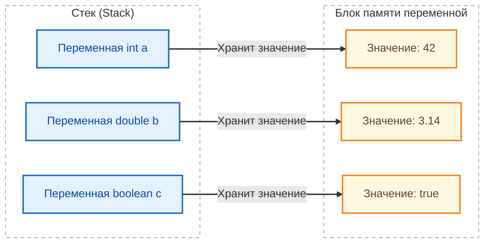
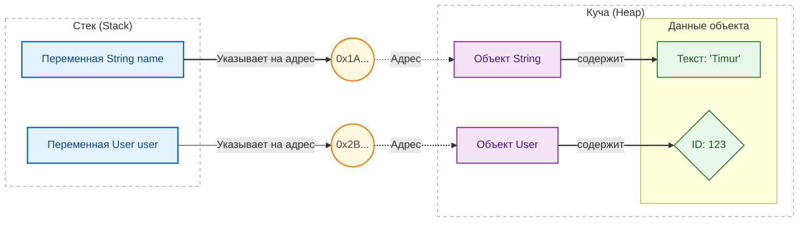

import TypingPlay from '@site/src/components/TypingPlay';
import DataTypesPlay from '@site/src/components/DataTypesPlay';
import DataStructureLinear from '@site/src/components/DataStructureLinear.jsx';
import DataStructureKeyValue from '@site/src/components/DataStructureKeyValue.jsx';

# Типы данных и переменные в Java

<div class="article-tags">
  <span class="tag tag-required">ОБЯЗАТЕЛЬНО</span>
  <span class="tag tag-beginner">ДЛЯ НОВИЧКОВ</span>
</div>

<span class="complexity-badge">Разработчику</span>
<span class="complexity-badge">Архитектору</span>

**Дальше:** [Коллекции в Java](./24.md) — сводка операций `List` / `Map` / `Set` / `Queue` · [Справочник Java](./3.md)

---

## Типы данных и переменные в Java

### Переменные

> **Переменная** — это именованная область памяти, предназначенная для хранения данных определенного типа. В Java все переменные строго типизированы: тип должен быть объявлен явно (за исключением случая с `var`), и изменить тип переменной после объявления нельзя.

В прикладном коде переменная обычно отражает смысл предметной области: `userAge`, `orderStatus`, `retryCount`. Чем точнее имя и тип, тем ниже риск логических ошибок и тем проще поддерживать код.

Стандартный формат объявления:
```java
[модификатор доступа] [тип данных] [имя_переменной] [= значение];
```

Разбор:
- Шаблон показывает общий синтаксис объявления переменной в Java.
- `[тип данных]` определяет, какие значения допустимы и какие операции разрешены.
- `[имя_переменной]` — идентификатор, по которому код обращается к значению.
- Блок `[= значение]` отвечает за инициализацию; без неё локальную переменную нельзя читать.
- Модификатор доступа используется для полей и методов класса, а не для локальных переменных внутри метода.

- **Модификаторы доступа** (опциональны): `public`, `private`, `protected`, или по умолчанию (если не указано).
- **Тип данных**: Должен соответствовать значению (`int`, `double`, `String`, `boolean`, `char` и т.д.).
- **Инициализация**: Присвоение значения при создании (обязательно перед использованием).

```java
String name = "Тимур"; 
```

Разбор:
- `String` — ссылочный тип, представляющий строковые данные.
- `name` — имя переменной, которое используется дальше в коде.
- `"Тимур"` — строковый литерал, начальное значение переменной.
- Оператор `=` выполняет присваивание, а `;` завершает инструкцию.

Жизненный цикл и доступность переменной зависят от места её объявления:

**Локальная переменная:** Объявляется внутри метода, блока кода `{}` или цикла. Видна только внутри этого блока.
```java
public void calculate() {
    int result = 10 + 5; // Видна только здесь
}
```

Разбор:
- `result` объявлена внутри метода, значит это локальная переменная.
- Её область видимости ограничена телом метода `calculate()`.
- Значение вычисляется выражением `10 + 5` во время выполнения метода.
- После выхода из метода переменная перестаёт существовать в текущем стеке вызова.

**Поле класса (Instance Variable):** Объявляется внутри класса, но вне методов. Видно всем методам этого экземпляра.
```java
public class Person {
    String name; // Видно всем методам объекта Person
}
```

Разбор:
- `name` объявлено на уровне класса, поэтому это поле экземпляра.
- У каждого объекта `Person` будет собственное значение этого поля.
- Без явной инициализации ссылочное поле получает значение `null` по умолчанию.
- Доступ к полю происходит через объект: например, `person.name`.

**Статическое поле (Static Variable):** Объявляется с ключевым словом `static`. Принадлежит классу, а не экземпляру.
```java
public class MathUtils {
    static final double PI = 3.14; // Одна константа на весь класс
}
```

Разбор:
- `static` делает поле общим для всего класса, а не для отдельных объектов.
- `final` фиксирует значение после инициализации, поэтому `PI` — константа.
- Тип `double` выбран для вещественного числа.
- К такому полю обычно обращаются через имя класса: `MathUtils.PI`.

Но можно и проще. Для этого есть `var`:

```java
var message = "Привет, мир!"; // Тип определяется как String
var count = 42;               // Тип определяется как int
var pi = 3.14159;             // Тип определяется как double
```

Разбор:
- `var` включает локальный вывод типа: компилятор сам определяет тип по правой части.
- `message` становится `String`, `count` — `int`, `pi` — `double`.
- Тип всё равно фиксируется статически и не меняется после объявления.
- `var` работает только для локальных переменных с инициализатором.

Но `var` - только для локальных переменных. Это ключевое слово можно использовать только внутри методов или блоков кода. Нельзя объявлять поля класса (`class My { var x; }` — ошибка). И переменная остается строго типизированной. Если вы присвоите `String`, позже попытка присвоить `int` вызовет ошибку компиляции.

Согласно стандартам Java, все имена переменных пишутся с маленькой буквы, каждое новое слово начинается с заглавной (например, `userName`, `totalPrice`). **Запрещены пробелы и спецсимволы** (кроме подчеркивания `_`, которое используется редко, обычно для констант в старых проектах).

---

### Типизация в Java

**Тип данных** — фундаментальное понятие, определяющее множество допустимых значений, операций над ними и способ их представления в памяти. В языке Java тип переменной фиксируется на этапе компиляции, что делает его **статически типизированным**. Это означает, что компилятор проверяет корректность всех операций с данными до запуска программы, предотвращая множество потенциальных ошибок времени выполнения. Нарушение типовой дисциплины (например, попытка вызвать метод у переменной числового типа) приведёт к ошибке компиляции и остановит сборку.

Система типов Java разделяет все типы на две большие категории: **примитивные** и **ссылочные**.

Примитивные типы реализованы на уровне виртуальной машины Java (JVM) и имеют фиксированный размер, не зависящий от платформы. 



Разбор:
- Диаграмма показывает модель примитивов: переменная хранит само значение напрямую.
- Блок `Stack` отражает локальные переменные выполнения, где лежат `int`, `double`, `boolean`.
- Связи `"Хранит значение"` подчёркивают отсутствие промежуточной ссылки на объект.
- Такой способ хранения минимизирует накладные расходы и ускоряет простые вычисления.

Ссылочные типы реализуются как объекты, размещаемые в куче (heap), и манипулируются через ссылки — специальные дескрипторы, указывающие на область памяти, где хранится объект. 



Разбор:
- Здесь показана модель ссылочных типов: переменная хранит адрес, а не данные объекта.
- Переменные (`name`, `user`) лежат в `Stack`, а сами объекты (`String`, `User`) — в `Heap`.
- Промежуточные узлы адресов (`0x1A...`, `0x2B...`) иллюстрируют ссылочную природу доступа.
- Одна и та же ссылка может быть переназначена, а объект может разделяться несколькими переменными.


Разделение на примитивы и ссылки — отражение архитектурных решений JVM и компромисса между производительностью (примитивы) и выразительной мощью (объекты).


---


<TypingPlay />


<DataTypesPlay />

---

## Примитивные типы данных

В Java существует ровно восемь примитивных типов. Ни один из них не является классом, ни один не наследует от `java.lang.Object`, и ни к одному из них нельзя применить оператор `new`. 

Все примитивные значения хранятся **непосредственно** в памяти, в том месте, где размещена переменная: 
- в стеке — если это локальная переменная метода, 
- или в теле объекта — если это поле класса. 

Такая организация обеспечивает предсказуемое время доступа и минимизирует накладные расходы, что критично для вычислительно интенсивных задач.

Объявление переменной примитивного типа:
```
<тип> <имя> = <значение>;
```

Примеры:
- `int age = 25;`
- `double price = 199.99;`
- `boolean isActive = true;`
- `char symbol = 'A';`


---

### Целочисленные типы

Целочисленные примитивы предназначены для представления значений из дискретного множества целых чисел. Все они знаковые (то есть могут хранить как положительные, так и отрицательные числа), за исключением специального беззнакового типа `char`, который рассматривается отдельно. Внутренне целые числа хранятся в формате *дополнительный код* (two’s complement), что обеспечивает единообразную обработку арифметических операций и упрощает реализацию процессорных инструкций.

```java
// byte — 1 байт, диапазон -128 до 127
byte temperature = -10;          // температура в градусах Цельсия
byte pixelValue = 255;           // значение пикселя в оттенках серого
byte[] rawData = {0x48, 0x65, 0x6C, 0x6C, 0x6F}; // байтовый массив "Hello"

// short — 2 байта, диапазон -32768 до 32767
short portNumber = 8080;         // номер сетевого порта
short year = 2026;               // год (всегда помещается в short)
short[] sensorReadings = new short[100]; // показания датчиков

// int — 4 байта, диапазон -2_147_483_648 до 2_147_483_647
int userId = 429496729;          // идентификатор пользователя
int arrayIndex = 0;              // индекс в массиве
int population = 1_400_000_000;  // население страны (Китай)
int[] scores = {95, 87, 92, 78}; // массив оценок

// long — 8 байт, диапазон -9_223_372_036_854_775_808 до 9_223_372_036_854_775_807
long timestamp = System.currentTimeMillis(); // текущее время в миллисекундах
long bigNumber = 9_223_372_036_854_775_807L; // максимальное значение
long fileSize = 5_000_000_000L;  // размер файла в байтах (5 ГБ)
long[] transactionIds = new long[10]; // идентификаторы транзакций
```

Разбор:
- Блок демонстрирует четыре целочисленных типа `byte`, `short`, `int`, `long` и их практические сценарии.
- Суффикс `L` обязателен для `long`-литералов, которые выходят за пределы `int`.
- `new short[100]` и `new long[10]` создают массивы фиксированной длины с нулевой инициализацией элементов.
- Вызов `System.currentTimeMillis()` возвращает `long`, потому что временная метка не помещается в 32-битный диапазон.
- Подчёркивания в числах (`1_400_000_000`) улучшают читаемость и не влияют на значение литерала.

Пояснения:
- `byte` применяется для экономии памяти при работе с бинарными данными и потоками
- `short` редко используется в современном коде, так как экономия памяти незначительна
- `int` — стандартный тип для всех целочисленных операций, циклов и индексации
- `long` требует суффикса `L` в литералах для избежания ошибок компиляции
- Подчёркивания в числовых литералах (`1_000_000`) улучшают читаемость без влияния на значение


| Тип | Размер (байт) | Диапазон значений | Типичное применение |
|-----|----------------|-------------------|----------------------|
| `byte` | 1 | от −128 до +127 | Экономия памяти при работе с большими объёмами числовых данных (например, байтовые потоки, изображения в сыром виде, сетевые пакеты). |
| `short` | 2 | от −32 768 до +32 767 | Случаи, когда `int` избыточен по диапазону и память критична. Редко используется в современных приложениях, так как экономия незначительна, а стоимость ошибки из-за переполнения выше. |
| `int` | 4 | от −2 147 483 648 до +2 147 483 647 | **Стандартный тип** для всех целочисленных вычислений. Литералы без суффикса (`42`, `−1000`) интерпретируются как `int`. Используется в циклах, индексации массивов, идентификаторах, перечислениях. |
| `long` | 8 | от −9 223 372 036 854 775 808 до +9 223 372 036 854 775 807 | Там, где диапазона `int` недостаточно: временные метки в миллисекундах (см. `System.currentTimeMillis()`), идентификаторы сущностей в распределённых системах, финансовые операции с большими суммами. Литералы требуют суффикса `L` или `l` (предпочтительно `L`, так как `l` легко спутать с цифрой `1`). Например: `9_223_372_036_854_775_807L`. |

Выбор между `int` и `long` — вопрос не столько производительности (на большинстве современных архитектур разница минимальна), сколько семантики и будущей расширяемости. Если есть хоть малая вероятность выхода за пределы 32-битного диапазона — безопаснее сразу использовать `long`. Переполнение целочисленного типа в Java **не вызывает исключений** — оно происходит "тихо", по модулю 2<sup>n</sup>, где *n* — разрядность типа. Например, прибавление единицы к максимальному `int` даёт минимальное отрицательное значение. Для критичных случаев следует использовать методы из класса `Math`, такие как `Math.addExact()`, которые выбрасывают `ArithmeticException` при переполнении.

---

### Вещественные (с плавающей точкой) типы

Вещественные типы предназначены для приближённого представления действительных чисел. Они реализуют стандарт IEEE 754 и, как следствие, подвержены ограничениям, свойственным двоичной арифметике с плавающей точкой: невозможность точно представить многие десятичные дроби (например, 0,1), накопление погрешности при последовательных операциях, особые значения — *положительная и отрицательная бесконечность*, *не число* (NaN).

```java
// float — 4 байта, одинарная точность
float piApprox = 3.14159265f;    // приближение числа Пи
float temperatureCelsius = 36.6f; // температура тела
float[] vertexCoordinates = {1.0f, 2.5f, -3.7f}; // координаты вершины в 3D

// double — 8 байт, двойная точность (стандартный выбор)
double pi = 3.141592653589793;   // более точное значение Пи
double balance = 12345.67;       // баланс счёт (для отображения, не для расчётов!)
double speedOfLight = 299_792_458.0; // скорость света в м/с
double[] sensorData = {1.23456789, 2.34567890, 3.45678901}; // данные датчиков

// Особые значения в соответствии со стандартом IEEE 754
double positiveInfinity = Double.POSITIVE_INFINITY;
double negativeInfinity = Double.NEGATIVE_INFINITY;
double notANumber = Double.NaN;

// Проверка особых значений
boolean isFinite = Double.isFinite(123.45); // true
boolean isNaN = Double.isNaN(notANumber);   // true
```

Разбор:
- В примере показаны оба типа с плавающей точкой: `float` (меньше точность) и `double` (стандартный выбор).
- Для `float` используется суффикс `f`, иначе литерал трактуется как `double`.
- Константы `Double.POSITIVE_INFINITY`, `Double.NEGATIVE_INFINITY`, `Double.NaN` представляют специальные значения IEEE 754.
- Методы `Double.isFinite(...)` и `Double.isNaN(...)` помогают безопасно проверять результат вычислений.
- Такой набор особенно полезен в научных и численных задачах, где возможны деление на ноль или неопределённые результаты.

Пояснения:
- `float` требует суффикса `f` или `F` в литералах, иначе компилятор интерпретирует число как `double`
- `double` используется по умолчанию для всех вещественных вычислений
- Сравнение `double` значений требует осторожности из-за погрешности представления
- Для денежных расчётов применяется `BigDecimal`, а не `float` или `double`


| Тип | Размер (байт) | Мантисса (бит) | Экспонента (бит) | Типичное применение |
|-----|----------------|----------------|------------------|----------------------|
| `float` | 4 | 23 | 8 | Вычисления, где важна память и скорость, а погрешность допустима: графика (OpenGL, обработка изображений), физические симуляции реального времени. Литералы должны иметь суффикс `F` или `f`: `3.14159265f`. |
| `double` | 8 | 52 | 11 | **Стандартный тип** для всех вещественных вычислений в бизнес-логике, научных расчётах, финансовой аналитике (но не бухгалтерии!). Литералы без суффикса (`3.14`, `1e−5`) интерпретируются как `double`. Обеспечивает примерно 15–17 значащих десятичных цифр точности. |

Важно подчеркнуть: **никогда не следует использовать `float` или `double` для точных денежных расчётов**. Из-за двоичного представления десятичные суммы вроде 0,10 рублей или 0,01 доллара хранятся с погрешностью, что недопустимо в финансовых системах. Для таких случаев в Java предусмотрен класс `java.math.BigDecimal`, обеспечивающий произвольную точность и строгий контроль округлений.

Сравнение значений типа `float` и `double` требует осторожности. Прямое равенство (`==`) часто даёт неожиданный результат из-за погрешности. Рекомендуется сравнивать с заданной точностью ("эпсилон") или использовать метод `Double.compare()` / `Float.compare()` для учёта специальных значений.

```java
// Неправильный подход — использование double для денег
double price1 = 0.1;
double price2 = 0.2;
double total = price1 + price2;
System.out.println(total); // 0.30000000000000004 — погрешность!

// Правильный подход — BigDecimal
BigDecimal a = new BigDecimal("0.1");
BigDecimal b = new BigDecimal("0.2");
BigDecimal sum = a.add(b);
System.out.println(sum); // 0.3 — точный результат

// Операции с округлением
BigDecimal quantity = new BigDecimal("3");
BigDecimal unitPrice = new BigDecimal("1.333");
BigDecimal totalPrice = unitPrice.multiply(quantity)
    .setScale(2, RoundingMode.HALF_UP); // 4.00

// Сравнение значений
BigDecimal x = new BigDecimal("10.00");
BigDecimal y = new BigDecimal("10.0");
System.out.println(x.equals(y));   // false — scale различается
System.out.println(x.compareTo(y) == 0); // true — числовое равенство

// Создание из примитивов и строк
BigDecimal fromInt = BigDecimal.valueOf(100);      // 100
BigDecimal fromDouble = BigDecimal.valueOf(123.45); // 123.45
BigDecimal fromString = new BigDecimal("999.99");   // 999.99
```

Пояснения:
- `BigDecimal` обеспечивает произвольную точность и контролируемое округление
- Создавайте экземпляры из строковых литералов, а не из `double`, чтобы избежать наследования погрешности
- Метод `setScale()` задаёт количество знаков после запятой и стратегию округления
- Для сравнения числовых значений используйте `compareTo()`, а не `equals()` — последний учитывает масштаб (количество знаков после запятой)
- `RoundingMode.HALF_UP` — стандартное банковское округление (0.5 округляется вверх)


---

### Символьный тип `char`

Тип `char` занимает ровно 2 байта и предназначен для представления **одного символа** в кодировке UTF-16. В силу этого он способен охватить весь базовый многоязычный диапазон Unicode (BMP, от U+0000 до U+FFFF), но не все символы из дополнительных плоскостей (например, эмодзи), которые требуют *суррогатной пары* — двух значений типа `char`. В современных приложениях, сталкивающихся с расширенным Unicode, целесообразно работать со строками (`String`) целиком и использовать методы, учитывающие суррогатные пары, например `String.codePointAt()`.

```java
// Буквенные символы
char letter = 'A';               // латинская буква
char cyrillic = 'Я';             // кириллическая буква
char digit = '7';                // цифра как символ

// Управляющие символы
char newline = '\n';             // символ новой строки
char tab = '\t';                 // символ табуляции
char backspace = '\b';           // символ возврата на шаг

// Unicode escape-последовательности
char euro = '\u20AC';            // символ евро €
char copyright = '\u00A9';       // символ авторского права ©
char heart = '\u2665';           // символ сердца ♥

// Арифметические операции с char (преобразование в число)
char nextLetter = (char)('A' + 1); // 'B'
int charCode = 'A';              // 65 — код символа в UTF-16
char fromCode = (char)66;        // 'B'

// Массив символов
char[] word = {'H', 'e', 'l', 'l', 'o'};
String fromCharArray = new String(word); // "Hello"
```

Пояснения:
- Литералы `char` заключаются в одинарные кавычки `'`
- Тип `char` занимает 2 байта и представляет символ в кодировке UTF-16
- Символы могут участвовать в арифметических операциях как 16-битные целые числа
- Для работы с расширенным Unicode (эмодзи, суррогатные пары) предпочтительнее использовать `String`


Литералы `char` записываются в одинарных кавычках: `'A'`, `'я'`, `'\n'` (управляющий символ), `'\u0041'` (Unicode escape). Несмотря на то, что `char` хранится как 16-битное беззнаковое целое, в арифметических операциях он ведёт себя как число (например, `'A' + 1` даёт `'B'`), но семантически его следует рассматривать именно как символ, а не как число.

---

### Булев тип `boolean`

Тип `boolean` — единственный примитив, не имеющий числового представления. Он принимает ровно два значения: `true` и `false`. В отличие от некоторых языков (например, C), в Java не существует неявного преобразования между `boolean` и целочисленными типами: выражение `if (1)` **не скомпилируется**. Это сознательное ограничение, направленное на повышение надёжности — условие должно быть логическим по своей природе, а не зависеть от побочных свойств чисел.

```java
// Прямое присваивание значений
boolean isActive = true;         // пользователь активен
boolean isAdmin = false;         // пользователь не администратор
boolean hasPermission = true;    // разрешение предоставлено

// Результат логических операций
boolean andResult = true && false;   // false — логическое И
boolean orResult = true || false;    // true — логическое ИЛИ
boolean notResult = !true;           // false — логическое НЕ
boolean xorResult = true ^ false;    // true — исключающее ИЛИ

// Результат сравнений
boolean isEqual = (10 == 10);        // true
boolean isGreater = (15 > 10);       // true
boolean isLessOrEqual = (5 <= 5);    // true
boolean isNotEqual = (7 != 8);       // true

// Использование в условных конструкциях
if (isActive && hasPermission) {
    System.out.println("Доступ разрешён");
}

// Массив булевых значений
boolean[] flags = {true, false, true, false};
boolean allTrue = flags[0] && flags[2]; // true

// Обёртка Boolean с разделяемыми константами
Boolean boxedTrue = Boolean.TRUE;    // ссылка на разделяемый объект
Boolean boxedFalse = Boolean.FALSE;  // ссылка на разделяемый объект
Boolean parsed = Boolean.parseBoolean("true"); // true
```

Пояснения:
- `boolean` принимает только два значения: `true` и `false`
- В Java отсутствует неявное преобразование между `boolean` и числовыми типами
- Операторы `&&` и `||` являются короткозамкнутыми — правый операнд не вычисляется, если результат определён левым
- Обёртка `Boolean` предоставляет полезные статические методы и разделяемые константы


Размер типа `boolean` в байтах **не определён** спецификацией языка и остаётся на усмотрение реализации JVM. В стеке или регистрах процессора значение может занимать полный машинный слово (например, 4 или 8 байт), но в массивах (`boolean[]`) многие JVM упаковывают элементы по одному биту на значение, экономя память. Программисту эта деталь не должна быть видна — важно лишь то, что переменная `boolean` гарантирует хранение одного из двух логических состояний.

Операции над булевыми значениями включают:
- логическое **И** (`&&`) и **ИЛИ** (`||`) — *короткозамкнутые* (short-circuit), то есть правый операнд не вычисляется, если результат определён левым;
- побитовое **И** (`&`) и **ИЛИ** (`|`) — вычисляют оба операнда, применяются редко, чаще в битовой арифметике с масками;
- **исключающее ИЛИ** (`^`);
- **отрицание** (`!`).

Результат вычисления любого логического выражения (включая сравнения `==`, `!=`, `<`, `>`, `<=`, `>=`) имеет тип `boolean`. Этот тип лежит в основе условных конструкций (`if`, `while`, `for`), обеспечивая управление потоком выполнения на основе чётко определённых предикатов.

Важно отметить, что `boolean` не имеет *обёртки* с методами, аналогичными числовым классам (`Integer`, `Double`), но существует класс `java.lang.Boolean`, предоставляющий полезные статические методы: `parseBoolean()`, `valueOf()`, а также константы `TRUE` и `FALSE`. При автоматической упаковке (`Boolean b = true`) создаётся объект, ссылающийся на одну из этих разделяемых констант, что экономит память.

---


<DataStructureKeyValue defaultLang="java" />

---

## Ссылочные типы

Всё, что не является одним из восьми примитивов, относится к **ссылочным типам**. Это включает:
- классы (встроенные, такие как `String`, `ArrayList`, и пользовательские);
- интерфейсы;
- перечисления (`enum`);
- массивы любого типа (в том числе массивы примитивов);
- аннотации.

Переменная ссылочного типа не содержит самого объекта, а хранит **ссылку** на него — абстрактный дескриптор, позволяющий JVM найти объект в куче. Ссылка может принимать специальное значение `null`, означающее *отсутствие объекта*. Это ключевое отличие от примитивов: переменная примитивного типа всегда содержит *некое* значение (инициализированное явно или по умолчанию: `0`, `0.0`, `false`, `'\u0000'`), тогда как ссылка может указывать "никуда".

Размер ссылки фиксирован на данной JVM (обычно 4 или 8 байт, в зависимости от разрядности и настроек сжатия указателей), но размер *объекта*, на который она указывает, динамичен и определяется его классом: сумма размеров всех полей (с учётом выравнивания), плюс заголовок объекта (metadata, включающий ссылку на класс, флаги синхронизации и т.п.).

Передача аргументов в методы для ссылочных типов происходит **по значению ссылки**. Это часто ошибочно называют "передачей по ссылке", но технически это не так: копируется не объект, и не ссылка как таковая, а *значение*, содержащее адрес объекта. В результате метод может изменять состояние объекта (через полученную ссылку), но не может изменить саму ссылку в вызывающем коде (например, присвоить ей `null` или новый объект — такие изменения останутся локальными).

---

### Строка — `java.lang.String`

Класс `String` заслуживает отдельного рассмотрения из-за повсеместного использования и благодаря своей уникальной семантике — **неизменяемости** (immutability). После создания объект `String` не может быть изменён: все его методы (`substring()`, `toUpperCase()`, `replace()`) возвращают *новый* объект строки, оставляя исходный нетронутым. Это обеспечивает:
- потокобезопасность: один и тот же `String` можно безопасно использовать во многих потоках без синхронизации;
- кэширование хэш-кода (поле `hash` вычисляется один раз и сохраняется);
- эффективное использование пула строк (string pool).

**Пул строк** — область памяти в куче (с Java 7+ — в куче, а не в PermGen), где JVM хранит *интернированные* строковые литералы и строки, явно помещённые туда через метод `intern()`. При создании литерала (`String s = "hello";`) JVM проверяет пул: если такая строка уже есть — возвращается ссылка на неё; если нет — строка создаётся и добавляется в пул. Это позволяет экономить память и ускорять сравнение через `==` (хотя для содержательного сравнения всегда следует использовать `equals()`).

Важно различать два способа создания строки:
```java
String a = "hello";                 // литерал — интернируется
String b = new String("hello");     // явный вызов конструктора — создаёт *новый* объект вне пула
```
Здесь `a == b` будет `false`, хотя `a.equals(b)` — `true`.

Класс `String` предоставляет богатый API для форматирования, поиска, сравнения, преобразования регистра. Метод `String.format()` — это Java-аналог `printf`, поддерживающий сложные шаблоны с позиционными спецификаторами (`%1$s`, `%2$d`) и повторным использованием (`%<`). Для частых или тяжеловесных операций конкатенации (особенно в циклах) следует использовать `StringBuilder` (для однопоточных сценариев) или `StringBuffer` (потокобезопасный, но медленнее), так как оператор `+` для строк компилируется в цепочку созданий `StringBuilder`, что может привести к избыточным аллокациям.

```java
// Создание строк разными способами
String literal = "Привет, мир!";          // строковый литерал (интернируется)
String constructor = new String("Привет"); // новый объект вне пула строк
String fromCharArray = new String(new char[]{'J', 'a', 'v', 'a'}); // из массива символов
String empty = "";                        // пустая строка
String nullString = null;                 // отсутствие строки

// Неизменяемость строк
String original = "hello";
String upper = original.toUpperCase();    // "HELLO" — новая строка
String replaced = original.replace('l', 'L'); // "heLLo" — новая строка
// original остаётся "hello"

// Конкатенация
String firstName = "Иван";
String lastName = "Иванов";
String fullName = firstName + " " + lastName; // "Иван Иванов"
String withAge = "Возраст: " + 25;           // "Возраст: 25" — число преобразуется в строку

// Форматирование
String formatted = String.format("Пользователь %s, возраст %d", "Анна", 30);
// "Пользователь Анна, возраст 30"

// Работа с пулом строк
String s1 = "pool";               // литерал — помещается в пул
String s2 = "pool";               // тот же объект из пула
String s3 = new String("pool");   // новый объект вне пула
String s4 = s3.intern();          // явное интернирование — возвращает объект из пула

System.out.println(s1 == s2); // true — один объект
System.out.println(s1 == s3); // false — разные объекты
System.out.println(s1 == s4); // true — после интернирования

// Полезные методы
String text = "  Java Programming  ";
String trimmed = text.trim();           // "Java Programming" — удаление пробелов по краям
String lower = text.toLowerCase();      // "  java programming  "
String upper = text.toUpperCase();      // "  JAVA PROGRAMMING  "
boolean contains = text.contains("Java"); // true
int index = text.indexOf('P');          // 7 — позиция первого 'P'
String substring = text.substring(2, 6); // "Java"
```

Пояснения:
- Строки в Java неизменяемы — все методы возвращают новые объекты
- Строковые литералы автоматически помещаются в пул строк для экономии памяти
- Для частой конкатенации в циклах используйте `StringBuilder`
- Сравнение содержимого строк выполняется методом `equals()`, а не оператором `==`

---

#### Mutable и immutable объекты

| | Mutable | Immutable |
|---|---------|-----------|
| Состояние после создания | Можно менять (`ArrayList`, `StringBuilder`) | Нельзя изменить "изнутри" (`String`, `Integer`, `LocalDate`) |
| Потокобезопасность | Нужна синхронизация при общем доступе | Безопаснее раздавать ссылки без копий |
| Использование в `HashMap` как ключ | Опасно — смена полей ломает корзину | Предпочтительно |

Стандартные **immutable** типы: `String`, обёртки примитивов, `BigInteger`/`BigDecimal`, классы `java.time`, `Optional`, enum-константы.

**Как написать immutable-класс** (классический чек-лист для собеседования):

1. Класс `final` (или sealed с одним наследником по необходимости).
2. Все поля `private final`.
3. Нет сеттеров; состояние задаётся только в конструкторе.
4. Для изменяемых полей (`List`, `Date` в legacy) — **защитное копирование** при приёме и при возврате из геттера (`List.copyOf`, `Collections.unmodifiableList`).
5. При необходимости — `equals` / `hashCode` / `toString`.

С Java 16+ для DTO часто достаточно **record** — см. [Современные конструкции](./300.md).

```java
public final class ImmutableUser {
    private final String name;
    private final List<String> roles;

    public ImmutableUser(String name, List<String> roles) {
        this.name = name;
        this.roles = List.copyOf(roles);
    }

    public String name() { return name; }
    public List<String> roles() { return roles; } // неизменяемая копия
}
```


---


<DataStructureLinear defaultLang="java" />

---

### Массивы

Полная сводка операций с `List`, `Set`, `Map`, `Queue` — в статье [Коллекции в Java](./24.md#сводка-операций-по-типам).

Массив в Java — ссылочный тип фиксированной длины, хранящий элементы одного и того же типа (примитивного или ссылочного) в непрерывном блоке памяти. Длина массива определяется при создании и не может быть изменена — это фундаментальное ограничение. Для динамических коллекций используются классы из `java.util` (`ArrayList`, `LinkedList` и др.).

Объявление массива синтаксически допускает размещение квадратных скобок как после типа (`int[] arr`), так и после имени (`int arr[]`), но первый вариант предпочтителен: он подчёркивает, что "массив целых" — это *тип* `int[]`, а не свойство переменной.


Объявление массива:
```
<тип>[] <имя> = new <тип>[<размер>];
<тип>[] <имя> = {<значение>, <значение>, ...};
```

Примеры:
- `int[] numbers = new int[10];`
- `String[] names = {"Иван", "Мария", "Анна"};`
- `double[][] matrix = new double[3][3];`

При создании массива (через `new`) все его элементы инициализируются значениями по умолчанию:
- `0` для числовых примитивов;
- `false` для `boolean`;
- `'\u0000'` для `char`;
- `null` для ссылочных типов.

Массивы сами являются объектами и наследуют от `java.lang.Object`. У каждого массива есть публичное поле `length`, содержащее его длину (в отличие от метода `size()` у коллекций). Массивы поддерживают многомерность, но в Java это реализуется как *массив массивов* (jagged arrays), а не как единый блок памяти. Например, `int[][] matrix = new int[3][]` создаёт массив из трёх ссылок, каждая из которых может указывать на массив разной длины.

Попытка доступа к элементу за пределами `[0, length)` вызывает исключение `ArrayIndexOutOfBoundsException` — типичная ошибка при некорректной индексации.

```java
// Одномерные массивы примитивов
int[] numbers = new int[5];      // массив из 5 целых чисел, все 0
numbers[0] = 10;                 // присваивание значения первому элементу
numbers[1] = 20;

int[] initialized = {1, 2, 3, 4, 5}; // инициализация при объявлении
int length = initialized.length;     // 5 — длина массива

// Массивы ссылочных типов
String[] names = new String[3];  // массив из 3 ссылок, все null
names[0] = "Алексей";
names[1] = "Мария";
names[2] = "Дмитрий";

String[] cities = {"Москва", "Санкт-Петербург", "Казань"};

// Двумерные массивы (массивы массивов)
int[][] matrix = new int[3][3];  // матрица 3x3
matrix[0][0] = 1;
matrix[0][1] = 2;
matrix[0][2] = 3;

int[][] jagged = new int[3][];   // зубчатый массив
jagged[0] = new int[2];          // первая строка длиной 2
jagged[1] = new int[4];          // вторая строка длиной 4
jagged[2] = new int[3];          // третья строка длиной 3

// Итерация по массиву
for (int i = 0; i < numbers.length; i++) {
    System.out.println(numbers[i]);
}

// Улучшенный цикл for
for (String name : names) {
    System.out.println(name);
}

// Копирование массива
int[] source = {1, 2, 3, 4, 5};
int[] destination = new int[5];
System.arraycopy(source, 0, destination, 0, source.length);
// destination теперь содержит {1, 2, 3, 4, 5}
```

Пояснения:
- Длина массива фиксируется при создании и не может быть изменена
- Все элементы массива примитивов инициализируются значениями по умолчанию (`0`, `false`, `'\u0000'`)
- Элементы массива ссылочных типов инициализируются значением `null`
- Двумерные массивы в Java реализованы как массивы массивов, что позволяет создавать зубчатые структуры
- Доступ к элементу за пределами диапазона вызывает `ArrayIndexOutOfBoundsException`

**Операции** массива (длина фиксирована при создании):

| Действие | Синтаксис |
|----------|-----------|
| Прочитать | `arr[index]` |
| Заменить | `arr[index] = value` |
| Длина | `arr.length` |
| Копировать фрагмент | `System.arraycopy(...)` |

Динамические списки и словари — `ArrayList`, `HashMap` и др.: [Коллекции в Java](./24.md).

---

### Объекты и методы

Всякий объект в Java — экземпляр некоторого класса. Даже массив — экземпляр специального синтетического класса, сгенерированного JVM. Все классы неявно или явно наследуют от `java.lang.Object`, что даёт каждому объекту набор базовых методов: `equals()`, `hashCode()`, `toString()`, `getClass()`, `clone()`, `finalize()`.

Корректная реализация `equals()` и `hashCode()` — критически важна для работы коллекций на основе хэширования (`HashMap`, `HashSet`). Если два объекта равны по `equals()`, их `hashCode()` **должны совпадать**. Некорректная реализация нарушает инварианты коллекций и приводит к трудноуловимым ошибкам (например, объект не находится в `HashMap`, несмотря на "равенство" ключей).

Методы в Java всегда принадлежат классу — отдельно стоящих функций не существует. Метод определяет поведение объекта или класса (статический метод). Он характеризуется:
- именем;
- списком параметров (включая их типы и имена);
- возвращаемым типом (`void`, если ничего не возвращается);
- модификаторами доступа (`public`, `private`, `protected`, package-private);
- сигнатурой (комбинация имени и типов параметров — определяет перегрузку);
- телом (реализация).

Современный стиль Java поощряет возврат *объектных обёрток* или *монадических типов* (например, `Optional<T>`) вместо `null`. Это делает сигнатуру метода более информативной: `Optional<Double>` явно говорит, что результат может отсутствовать, и заставляет вызывающего обработать оба случая, снижая вероятность `NullPointerException`.

Создание объекта (ссылочного типа):
```
<имя_класса> <переменная> = new <имя_класса>(<аргументы>);
```

Примеры:
- `String text = new String("Привет");`
- `ArrayList<String> list = new ArrayList<>();`
- `BigDecimal amount = new BigDecimal("100.50");`

Доступ к свойству объекта:
```
<объект>.<поле>
```

Примеры:
- `array.length`
- `person.name`
- `point.x`

Вызов метода объекта:
```
<объект>.<метод>(<аргументы>);
```

Примеры:
- `list.add("элемент");`
- `text.toUpperCase();`
- `number.compareTo(otherNumber);`

---

### Сравнение примитивов и ссылочных типов

```java
// Примитивы сравниваются по значению оператором ==
int a = 100;
int b = 100;
System.out.println(a == b); // true — значения равны

// Ссылочные типы: сравнение ссылок оператором ==
String s1 = "hello";
String s2 = "hello";
System.out.println(s1 == s2); // true — один объект из пула строк

String s3 = new String("hello");
String s4 = new String("hello");
System.out.println(s3 == s4); // false — разные объекты
System.out.println(s3.equals(s4)); // true — содержимое одинаково

// Автоматическая упаковка и кэширование
Integer boxed1 = 100;
Integer boxed2 = 100;
System.out.println(boxed1 == boxed2); // true — кэшированные объекты

Integer boxed3 = 200;
Integer boxed4 = 200;
System.out.println(boxed3 == boxed4); // false — разные объекты вне кэша
System.out.println(boxed3.equals(boxed4)); // true — значения равны

// Сравнение примитива и обёртки
int primitive = 42;
Integer wrapper = 42;
System.out.println(primitive == wrapper); // true — wrapper распаковывается автоматически
```

Пояснения:
- Примитивы всегда сравниваются по значению оператором `==`
- Ссылочные типы сравниваются оператором `==` по ссылке (адресу в памяти), а не по содержимому
- Для сравнения содержимого объектов используйте метод `equals()`
- Обёртки в диапазоне -128..127 кэшируются — сравнение через `==` может дать `true`
- При сравнении примитива и обёртки происходит автоматическая распаковка обёртки

---

## Преобразования типов

В Java допускаются определённые преобразования значений между типами. Эти преобразования делятся на **неявные** (автоматические, выполняемые компилятором без участия программиста) и **явные** (требующие прямого указания оператора приведения — *cast*). Некорректное приведение приводит либо к ошибке компиляции, либо — при выполнении — к исключению.

Практическое правило: если преобразование может потерять данные (`double -> int`, `long -> int`) или привести к ошибке времени выполнения (каст ссылочного типа), делайте его рядом с проверкой и поясняющим названием переменной.

```java
// Расширение (widening) — неявное, безопасное
byte b = 10;
int i = b;                       // byte → int
long l = i;                      // int → long
double d = l;                    // long → double

char c = 'A';
int charCode = c;                // char → int (65)

// Сужение (narrowing) — явное, потенциально опасное
double pi = 3.14159;
int truncated = (int) pi;        // 3 — дробная часть отброшена

long big = 3_000_000_000L;
int overflow = (int) big;        // -1294967296 — переполнение

int negative = -1;
char unsignedChar = (char) negative; // '\uffff' (65535)

// Расширение при арифметических операциях
byte a = 10;
byte b2 = 20;
// byte sum = a + b2; // ошибка компиляции — результат имеет тип int
byte sum = (byte)(a + b2);       // 30 — требуется явное приведение

// Приведение ссылочных типов в иерархии наследования
Object obj = "Строка";
String str = (String) obj;       // безопасное приведение

Object number = 42;
// String text = (String) number; // ClassCastException при выполнении

// Проверка типа перед приведением
if (obj instanceof String) {
    String s = (String) obj;
    System.out.println(s.length());
}

// Современный синтаксис с паттерн-матчингом (Java 16+)
if (obj instanceof String s) {
    System.out.println(s.length()); // переменная s доступна здесь
}
```

Пояснения:
- Расширение происходит автоматически при присваивании значения типа с меньшим диапазоном типу с большим диапазоном
- Сужение требует явного оператора приведения `(TargetType)` и может привести к потере данных
- При арифметических операциях с `byte`, `short`, `char` происходит неявное расширение до `int`
- Приведение ссылочных типов проверяется во время выполнения — несоответствие типов вызывает `ClassCastException`
- Используйте `instanceof` для безопасной проверки типа перед приведением

---

### Расширение (widening conversion)

Расширение — это неявное преобразование значения из типа с меньшим диапазоном представления в тип с большим. Такое преобразование **гарантированно безопасно**: оно увеличивает разрядную сетку, в которую значение помещается с сохранением семантики.

Цепочка числовых расширений строго фиксирована и следует иерархии:
```
byte → short → int → long → float → double
```
Обратите внимание, что `char` формально не входит в эту цепочку, но может расширяться до `int`, `long`, `float`, `double` (как беззнаковое 16-битное целое). Например:
```java
char c = 'A';   // 65
int i = c;      // i == 65 — безопасное расширение
```

Важные нюансы:
- Преобразование `long` → `float` технически является расширением по стандарту языка, но **не сохраняет точность всех целых значений**, так как `float` имеет лишь 23 бита мантиссы, а `long` — 64. Целые числа свыше 2²⁴ могут быть округлены при таком преобразовании. Это компромисс стандарта IEEE 754, и разработчик должен быть осведомлён об этом.
- При арифметических операциях с примитивами младше `int` (`byte`, `short`, `char`) происходит **неявное расширение до `int`** перед вычислением. Например:
  ```java
  byte a = 10, b = 20;
  byte c = (byte)(a + b); // без приведения — ошибка компиляции: a + b имеет тип int
  ```
  Это правило называется *binary numeric promotion* и применяется ко всем бинарным числовым операциям.

---

### Сужение (narrowing conversion)

Сужение — явное преобразование из типа с большим диапазоном в тип с меньшим. Оно **потенциально опасно**: может привести к потере старших битов, переполнению или искажению значения. Требует оператора приведения вида `(TargetType) value`.

```
<целевой_тип> <имя> = (<целевой_тип>) <исходное_значение>;
```

Примеры:
- `int truncated = (int) 3.14159;`
- `byte small = (byte) 200;`


```java
double d = 123.999;
int i = (int) d;      // i == 123 — дробная часть отброшена (усечение, не округление)

long big = 3_000_000_000L;
int small = (int) big; // small == -1294967296 — переполнение: старшие 32 бита отброшены

int negative = -1;
char ch = (char) negative; // ch == '\uffff' (65535) — интерпретация как беззнакового
```

Сужение допустимо между:
- числовыми типами (в обратном порядке цепочки расширения);
- `int` и `char` (в обе стороны);
- ссылочными типами в пределах иерархии наследования (например, `(String) obj`), но при несоответствии типов во время выполнения будет выброшено `ClassCastException`.

---

### Упаковка и распаковка (boxing / unboxing)

Каждому примитивному типу соответствует **обёрточный класс** (`wrapper class`) из пакета `java.lang`:
- `byte` ↔ `Byte`
- `short` ↔ `Short`
- `int` ↔ `Integer`
- `long` ↔ `Long`
- `float` ↔ `Float`
- `double` ↔ `Double`
- `boolean` ↔ `Boolean`
- `char` ↔ `Character`

Эти классы не являются подтипами `Object` *вместо* примитивов — они существуют параллельно и служат для интеграции примитивов в объектную модель: передачи в generic-коллекции, использования в рефлексии, сериализации и т.п.

```
<обёртка> <имя> = <примитив>;
<примитив> <имя> = <обёртка>;
```

Примеры:
- `Integer boxed = 42;`
- `int unboxed = boxed;`


Начиная с Java 5, компилятор автоматически вставляет вызовы методов `valueOf()` (для упаковки) и `xxxValue()` (для распаковки), что называется **автоматической упаковкой/распаковкой**:
```java
Integer boxed = 42;           // эквивалентно Integer.valueOf(42)
int unboxed = boxed;          // эквивалентно boxed.intValue()
```

```java
// Явная упаковка через конструкторы (устаревший подход)
Integer boxedInt = new Integer(42);      // устаревшее, предпочтительно valueOf()
Double boxedDouble = new Double(3.14);   // устаревшее

// Явная упаковка через valueOf (рекомендуется)
Integer a = Integer.valueOf(100);        // из кэша для значений -128..127
Integer b = Integer.valueOf(100);        // тот же объект из кэша
Integer c = Integer.valueOf(200);        // новый объект (вне кэша)
Integer d = Integer.valueOf(200);        // новый объект

System.out.println(a == b); // true — кэшированные объекты
System.out.println(c == d); // false — разные объекты

// Автоматическая упаковка (с Java 5)
Integer autoBoxed = 42;                  // компилятор вставляет Integer.valueOf(42)
Double autoBoxedDouble = 3.14;           // Double.valueOf(3.14)
Boolean autoBoxedBoolean = true;         // Boolean.valueOf(true)

// Автоматическая распаковка
int unboxedInt = autoBoxed;              // компилятор вставляет autoBoxed.intValue()
double unboxedDouble = autoBoxedDouble;  // autoBoxedDouble.doubleValue()

// Опасность распаковки null
Integer nullable = null;
// int dangerous = nullable; // NullPointerException при распаковке!

// Безопасная распаковка с проверкой
int safeValue = (nullable != null) ? nullable : 0;

// Использование в коллекциях
List<Integer> numbers = new ArrayList<>();
numbers.add(10);        // автоматическая упаковка
numbers.add(20);
int first = numbers.get(0); // автоматическая распаковка

// Сравнение через equals для корректности
Integer x = 200;
Integer y = 200;
System.out.println(x.equals(y)); // true — корректное сравнение значений
System.out.println(x == y);      // false — разные объекты
```

Пояснения:
- Автоматическая упаковка/распаковка упрощает работу с обёртками, но скрывает аллокации объектов
- Значения в диапазоне -128..127 кэшируются для `Integer`, что позволяет использовать `==` безопасно в этом диапазоне
- Распаковка `null` вызывает `NullPointerException` — частая ошибка при работе с базами данных
- Для сравнения значений всегда используйте `equals()`, а не `==`


---

### Важнейшие особенности обёрток


1. **Кэширование**: для `Boolean`, `Byte`, `Character` (от `\u0000` до `\u007f`), а также `Short` и `Integer` в диапазоне от −128 до +127, метод `valueOf()` возвращает *разделяемые* экземпляры. Это позволяет безопасно сравнивать такие значения через `==`:
   ```java
   Integer a = 100, b = 100;
   System.out.println(a == b); // true — один и тот же объект из кэша
   Integer c = 200, d = 200;
   System.out.println(c == d); // false — создаются новые объекты
   ```
   Однако полагаться на это в коде **не рекомендуется** — семантически сравнение числовых значений должно выполняться через `equals()`.

2. **Null и распаковка**: если ссылка на обёртку равна `null`, попытка распаковки вызовет `NullPointerException`:
   ```java
   Integer x = null;
   int y = x; // NPE при распаковке
   ```
   Это частая ошибка при работе с базами данных (NULL ↔ `null` в `Integer`) или слабо типизированными API.

3. **Производительность**: упаковка требует аллокации объекта, распаковка — вызова метода. В циклах или горячих участках кода чрезмерное использование boxing/unboxing может существенно снизить производительность. Следует избегать операций вроде:
   ```java
   List<Integer> numbers = ...;
   long sum = 0;
   for (Integer n : numbers) {
       sum += n; // распаковка на каждой итерации
   }
   ```

---

## Типы в контексте современных языковых конструкций

### Обобщения (generics) и примитивы

Система обобщений в Java реализована через *стирание типов* (type erasure). На этапе компиляции все параметры типа заменяются их границами (обычно `Object`), а проверки вставляются в виде приведений. Важное следствие: **в качестве аргумента типа нельзя использовать примитив**. Следующее не скомпилируется:
```java
List<int> numbers; // ошибка: unexpected type, required: reference, found: int
```

Вместо этого используются обёртки:
```java
List<Integer> numbers = new ArrayList<>();
```
Это неизбежно влечёт boxing/unboxing при вставке и извлечении значений. Для высокопроизводительных числовых вычислений существуют сторонние библиотеки (например, Eclipse Collections, FastUtil), предоставляющие специализированные коллекции для примитивов (`IntArrayList`, `LongSet` и т.п.).

---

### Тип `var` и вывод типов

Начиная с Java 10, введён *локальный вывод типа* через ключевое слово `var`. Оно позволяет компилятору вывести тип локальной переменной из инициализатора:
```java
var name = "Тимур";          // String
var count = 42;              // int
var list = new ArrayList<String>(); // ArrayList<String>
var result = calculate();    // тип возвращаемого значения calculate()
```

Важно:
- `var` **не делает Java динамически типизированной**. Тип выводится *статически* и фиксируется на этапе компиляции.
- `var` допустим только для *локальных переменных с инициализатором* (не для полей, параметров, возвращаемых типов).
- Инициализатор должен иметь *чётко выраженный тип*. Например, `var x = null;` не скомпилируется — `null` не имеет собственного типа.
- Использование `var` уместно, когда правая часть делает тип очевидным (как в примерах выше), или когда полное имя типа громоздко (`var stream = someObject.getNested().process().stream();`). Избегайте `var`, если это снижает читаемость (`var data = fetchData();` — что возвращает `fetchData()`?).

```java
// Вывод для примитивов
var count = 42;                  // int
var price = 199.99;              // double
var isActive = true;             // boolean
var initial = 'A';               // char

// Вывод для ссылочных типов
var name = "Java";               // String
var list = new ArrayList<String>(); // ArrayList<String>
var map = new HashMap<String, Integer>(); // HashMap<String, Integer>

// Вывод для массивов
var numbers = new int[]{1, 2, 3, 4, 5}; // int[]
var strings = new String[]{"a", "b", "c"}; // String[]

// Вывод для сложных типов
var entrySet = map.entrySet();   // Set<Map.Entry<String, Integer>>
var stream = list.stream();      // Stream<String>

// Вывод для результатов методов
var result = calculateSum(10, 20); // тип возвращаемого значения метода
var optional = findUserById(123);  // Optional<User>

// Ограничения использования var
// var x; // ошибка — требуется инициализатор
// var y = null; // ошибка — null не имеет типа
// поле класса: 
//   var field = "value"; // ошибка — var допустим только для локальных переменных

// Плохой пример использования (снижает читаемость)
var data = fetchData(); // что возвращает метод? тип неочевиден

// Хороший пример (тип очевиден из правой части)
var users = new ArrayList<User>();
var config = loadConfigurationFromFile("app.properties");
```

---

### Записи (`record`) как типы данных

Начиная с Java 14 (в статусе preview), а с Java 16 — как стабильная функция, введены **записи** (`record`). Это компактный синтаксис для объявления *классов-носителей данных*, у которых состояние полностью определяется фиксированным набором значений (компонентов):
```java
public record Person(String name, int age) {}
```
Компилятор автоматически генерирует:
- приватные `final` поля для каждого компонента;
- публичный конструктор с параметрами в порядке объявления;
- геттеры с именами, совпадающими с именами компонентов (`name()`, `age()`);
- `equals()`, `hashCode()` и `toString()` на основе всех компонентов.

Записи **неизменяемы** по замыслу: компоненты — `final`, а методы изменения не генерируются. Это делает их идеальными для представления *значений* (value types), а не сущностей с идентичностью. Записи наследуются от `java.lang.Record`, который, в свою очередь, наследуется от `Object`.

```java
// Простая запись с двумя компонентами
record Point(int x, int y) {}

// Использование записи
Point p1 = new Point(10, 20);
int x = p1.x();                  // 10 — геттер с именем компонента
int y = p1.y();                  // 20
Point p2 = new Point(10, 20);
System.out.println(p1.equals(p2)); // true — сравнение по значениям компонентов
System.out.println(p1);          // Point[x=10, y=20] — сгенерированный toString()

// Запись с дополнительным конструктором
record Person(String name, int age) {
    // Компактный конструктор для валидации
    Person {
        if (age < 0 || age > 150) {
            throw new IllegalArgumentException("Некорректный возраст");
        }
    }
}

Person valid = new Person("Анна", 30); // успешно создаётся
// Person invalid = new Person("Борис", -5); // исключение

// Запись с несколькими компонентами разных типов
record Product(String id, String name, double price, boolean inStock) {}

Product laptop = new Product("P123", "Ноутбук", 59999.99, true);
String id = laptop.id();         // "P123"
double price = laptop.price();   // 59999.99

// Вложенные записи
record Address(String street, String city, String postalCode) {}
record Customer(String name, Address address, String email) {}

Address addr = new Address("Ленина, 10", "Москва", "123456");
Customer customer = new Customer("Иван Петров", addr, "ivan@example.com");
String city = customer.address().city(); // "Москва"

// Запись как возвращаемый тип метода
record CalculationResult(double sum, double average, int count) {}

CalculationResult calculate(int[] values) {
    double sum = 0;
    for (int v : values) sum += v;
    return new CalculationResult(sum, sum / values.length, values.length);
}

CalculationResult result = calculate(new int[]{10, 20, 30});
System.out.println(result.average()); // 20.0
```

Пояснения:
- Записи автоматически получают приватные `final` поля, геттеры, конструктор, `equals()`, `hashCode()` и `toString()`
- Записи неизменяемы по замыслу — компоненты являются `final`
- Дополнительные конструкторы позволяют добавлять валидацию при создании
- Записи идеально подходят для представления значений (value types) в DTO, результатах вычислений, ключах словарей


---

## Частые ошибки новичков

1. Сравнение строк через `==` вместо `equals()`.
2. Использование `double` для денег вместо `BigDecimal`.
3. Распаковка `null`-обёртки (`Integer x = null; int y = x;`).
4. Ожидание, что `var` делает язык динамически типизированным.
5. Попытка хранить примитив в generic-типе (`List<int>`).

---

## Связанные статьи

- Синтаксис условий и выражений: [Операторы и циклы в Java](./17.md)
- Структуры хранения и операции: [Коллекции в Java](./24.md)
- Базовая архитектура классов: [Основные конструкции языка Java](./16.md)
