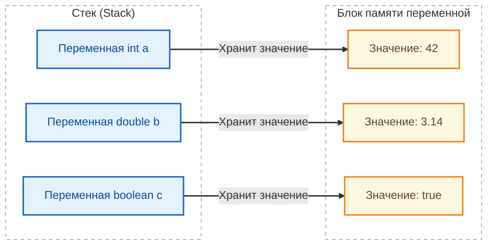
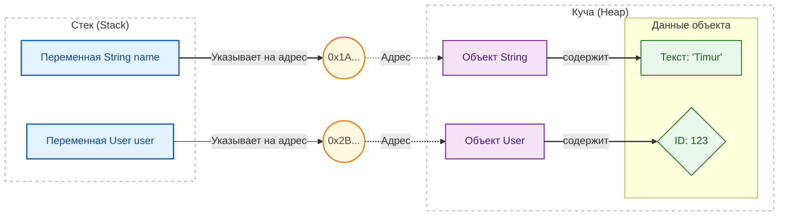

import ExternalCodeEmbed from '@site/src/components/ExternalCodeEmbed';


import ExternalPlayEmbed from '@site/src/components/ExternalPlayEmbed';


# Типы данных и переменные в Java

<div class="article-tags">
  <span class="tag tag-required">ОБЯЗАТЕЛЬНО</span>
  <span class="tag tag-beginner">ДЛЯ НОВИЧКОВ</span>
</div>

<span class="complexity-badge">Разработчику</span>
<span class="complexity-badge">Архитектору</span>

**Дальше:** [Коллекции в Java](./24.md) — сводка операций `List` / `Map` / `Set` / `Queue` · [Справочник Java](./3.md)

---

## Типы данных и переменные в Java

<div class="callout callout--info">
  <div class="callout-title">Система типов</div>

  <div class="callout-body">
  Java — **статически** типизированный язык:

  - тип переменной;
  - параметра;
  - возвращаемого значения фиксируется при объявлении и проверяется компилятором.

  Модель **сильная** — несовместимые типы без явного приведения не смешивают.

  Общая теория — [типы данных](/encyclopedia/1-basics/1-09-dannye-i-informatsiya/3), [типизация](/encyclopedia/1-basics/1-09-dannye-i-informatsiya/4), [переменные и области видимости (4.03)](/encyclopedia/4-code-dev/4-03-vypolnenie-koda/115).

  Пакеты Java — пространства имён (см. тот же материал 4.03).
</div>
  </div>

### Переменные

> **Переменная** — это именованная область памяти, предназначенная для хранения данных определенного типа. В Java все переменные строго типизированы: тип должен быть объявлен явно (за исключением случая с `var`), и изменить тип переменной после объявления нельзя.

В прикладном коде переменная обычно отражает смысл предметной области: `userAge`, `orderStatus`, `retryCount`. Чем точнее имя и тип, тем ниже риск логических ошибок и тем проще поддерживать код.

Стандартный формат объявления:
```java
[модификатор доступа] [тип данных] [имя_переменной] [= значение];
```

Разбор:
- Шаблон показывает общий синтаксис объявления переменной в Java.
- `[тип данных]` определяет, какие значения допустимы и какие операции разрешены.
- `[имя_переменной]` — идентификатор, по которому код обращается к значению.
- Блок `[= значение]` отвечает за инициализацию; без неё локальную переменную нельзя читать.
- Модификатор доступа используется для полей и методов класса, а не для локальных переменных внутри метода.

- **Модификаторы доступа** (опциональны): `public`, `private`, `protected`, или по умолчанию (если не указано).
- **Тип данных**: Должен соответствовать значению (`int`, `double`, `String`, `boolean`, `char` и т.д.).
- **Инициализация**: Присвоение значения при создании (обязательно перед использованием).

```java
String name = "Тимур"; 
```

Разбор:
- `String` — ссылочный тип, представляющий строковые данные.
- `name` — имя переменной, которое используется дальше в коде.
- `"Тимур"` — строковый литерал, начальное значение переменной.
- Оператор `=` выполняет присваивание, а `;` завершает инструкцию.

Жизненный цикл и доступность переменной зависят от места её объявления:

**Локальная переменная:** Объявляется внутри метода, блока кода `{}` или цикла. Видна только внутри этого блока.
```java
public void calculate() {
    int result = 10 + 5; // Видна только здесь
}
```

Разбор:
- `result` объявлена внутри метода, значит это локальная переменная.
- Её область видимости ограничена телом метода `calculate()`.
- Значение вычисляется выражением `10 + 5` во время выполнения метода.
- После выхода из метода переменная перестаёт существовать в текущем стеке вызова.

**Поле класса (Instance Variable):** Объявляется внутри класса, но вне методов. Видно всем методам этого экземпляра.
```java
public class Person {
    String name; // Видно всем методам объекта Person
}
```

Разбор:
- `name` объявлено на уровне класса, поэтому это поле экземпляра.
- У каждого объекта `Person` будет собственное значение этого поля.
- Без явной инициализации ссылочное поле получает значение `null` по умолчанию.
- Доступ к полю происходит через объект: например, `person.name`.

**Статическое поле (Static Variable):** Объявляется с ключевым словом `static`. Принадлежит классу, а не экземпляру.
```java
public class MathUtils {
    static final double PI = 3.14; // Одна константа на весь класс
}
```

Разбор:
- `static` делает поле общим для всего класса, а не для отдельных объектов.
- `final` фиксирует значение после инициализации, поэтому `PI` — константа.
- Тип `double` выбран для вещественного числа.
- К такому полю обычно обращаются через имя класса: `MathUtils.PI`.

Но можно и проще. Для этого есть `var`:

```java
var message = "Привет, мир!"; // Тип определяется как String
var count = 42;               // Тип определяется как int
var pi = 3.14159;             // Тип определяется как double
```

Разбор:
- `var` включает локальный вывод типа: компилятор сам определяет тип по правой части.
- `message` становится `String`, `count` — `int`, `pi` — `double`.
- Тип всё равно фиксируется статически и не меняется после объявления.
- `var` работает только для локальных переменных с инициализатором.

Но `var` - только для локальных переменных. Это ключевое слово можно использовать только внутри методов или блоков кода. Нельзя объявлять поля класса (`class My &#123; var x; &#125;` — ошибка). И переменная остается строго типизированной. Если вы присвоите `String`, позже попытка присвоить `int` вызовет ошибку компиляции.

Согласно стандартам Java, все имена переменных пишутся с маленькой буквы, каждое новое слово начинается с заглавной (например, `userName`, `totalPrice`). **Запрещены пробелы и спецсимволы** (кроме подчеркивания `_`, которое используется редко, обычно для констант в старых проектах).

---

### Типизация в Java

**Тип данных** — фундаментальное понятие, определяющее множество допустимых значений, операций над ними и способ их представления в памяти. В языке Java тип переменной фиксируется на этапе компиляции, что делает его **статически типизированным**. Это означает, что компилятор проверяет корректность всех операций с данными до запуска программы, предотвращая множество потенциальных ошибок времени выполнения. Нарушение типовой дисциплины (например, попытка вызвать метод у переменной числового типа) приведёт к ошибке компиляции и остановит сборку.

Система типов Java разделяет все типы на две большие категории: **примитивные** и **ссылочные**.

Примитивные типы реализованы на уровне виртуальной машины Java (JVM) и имеют фиксированный размер, не зависящий от платформы. 



Разбор:
- Диаграмма показывает модель примитивов: переменная хранит само значение напрямую.
- Блок `Stack` отражает локальные переменные выполнения, где лежат `int`, `double`, `boolean`.
- Связи `"Хранит значение"` подчёркивают отсутствие промежуточной ссылки на объект.
- Такой способ хранения минимизирует накладные расходы и ускоряет простые вычисления.

Ссылочные типы реализуются как объекты, размещаемые в куче (heap), и манипулируются через ссылки — специальные дескрипторы, указывающие на область памяти, где хранится объект. 



Разбор:
- Здесь показана модель ссылочных типов: переменная хранит адрес, а не данные объекта.
- Переменные (`name`, `user`) лежат в `Stack`, а сами объекты (`String`, `User`) — в `Heap`.
- Промежуточные узлы адресов (`0x1A...`, `0x2B...`) иллюстрируют ссылочную природу доступа.
- Одна и та же ссылка может быть переназначена, а объект может разделяться несколькими переменными.


Разделение на примитивы и ссылки — отражение архитектурных решений JVM и компромисса между производительностью (примитивы) и выразительной мощью (объекты).


---


<ExternalPlayEmbed example="basics/typing-play" title="Typing" />


<ExternalPlayEmbed example="about/data-types-play" title="Data Types" />

---

## Примитивные типы данных

В Java **восемь примитивных типов** — от `byte` до `boolean`. Каждый имеет **фиксированный размер**, **диапазон значений** и своё назначение. Ни один из них не является классом, не наследует от `java.lang.Object`, и к ни одному нельзя применить оператор `new`.

Все примитивные значения хранятся **непосредственно** в памяти, в том месте, где размещена переменная:

- в стеке — если это локальная переменная метода;
- в теле объекта — если это поле класса.

Такая организация даёт предсказуемое время доступа и минимизирует накладные расходы — это важно для вычислительно интенсивных задач.

По назначению типы делятся на четыре группы:

- **целые числа** — `byte`, `short`, `int`, `long`;
- **вещественные числа** — `float`, `double`;
- **символ** — `char`;
- **логическое значение** — `boolean`.

### Сводная таблица

| Тип | Размер, байт | Диапазон значений | Назначение | Пример | По умолчанию |
|-----|--------------|-------------------|------------|--------|--------------|
| `byte` | 1 | от −128 до 127 | целое число | `byte b = -5;` | `0` |
| `short` | 2 | от −32 768 до 32 767 | целое число | `short s = 42;` | `0` |
| `int` | 4 | от −2³¹ до 2³¹ − 1 | целое число | `int i = -12345;` | `0` |
| `long` | 8 | от −2⁶³ до 2⁶³ − 1 | целое число | `long l = 1_122_334_455L;` | `0L` |
| `float` | 4 | ±1,4×10⁻⁴⁵ … ±3,4×10³⁸ | вещественное число | `float f = 3.141592f;` | `0.0f` |
| `double` | 8 | ±4,9×10⁻³²⁴ … ±1,8×10³⁰⁸ | вещественное число двойной точности | `double d = 3.141592653589d;` | `0.0d` |
| `char` | 2 | от 0 до 65 535 (UTF-16) | символ | `char c = 'Z';` | `'\u0000'` |
| `boolean` | не фиксирован* | `true` или `false` | логическое значение | `boolean b = true;` | `false` |

\* Размер `boolean` в спецификации Java **не задан**. В массивах `boolean[]` JVM часто упаковывает значения по одному биту; в стеке переменная может занимать целое машинное слово. Программисту эта деталь не видна — важны только два допустимых значения.

Объявление переменной примитивного типа:

```
<тип> <имя> = <значение>;
```

<div class="callout callout--tip">
  <div class="callout-title">Какой тип выбрать</div>

  <div class="callout-body">
  Для целых чисел по умолчанию берите <code>int</code>, для вещественных — <code>double</code>. <code>byte</code> и <code>short</code> — когда важна экономия памяти в больших массивах; <code>long</code> — для временных меток и идентификаторов за пределами 32 бит. Литералы <code>float</code> и <code>long</code> требуют суффиксов <code>f</code> и <code>L</code>.
</div>
  </div>

---

### Целочисленные типы

Целочисленные примитивы предназначены для представления значений из дискретного множества целых чисел. Все они знаковые (то есть могут хранить как положительные, так и отрицательные числа), за исключением специального беззнакового типа `char`, который рассматривается отдельно. Внутренне целые числа хранятся в формате *дополнительный код* (two’s complement), что обеспечивает единообразную обработку арифметических операций и упрощает реализацию процессорных инструкций.


<ExternalCodeEmbed example="java/java-503-15-001" title="Целочисленные типы" minHeight={444} />


Разбор:
- Блок демонстрирует четыре целочисленных типа `byte`, `short`, `int`, `long` и их практические сценарии.
- Суффикс `L` обязателен для `long`-литералов, которые выходят за пределы `int`.
- `new short[100]` и `new long[10]` создают массивы фиксированной длины с нулевой инициализацией элементов.
- Вызов `System.currentTimeMillis()` возвращает `long`, потому что временная метка не помещается в 32-битный диапазон.
- Подчёркивания в числах (`1_400_000_000`) улучшают читаемость и не влияют на значение литерала.

Пояснения:
- `byte` применяется для экономии памяти при работе с бинарными данными и потоками
- `short` редко используется в современном коде, так как экономия памяти незначительна
- `int` — стандартный тип для всех целочисленных операций, циклов и индексации
- `long` требует суффикса `L` в литералах для избежания ошибок компиляции
- Подчёркивания в числовых литералах (`1_000_000`) улучшают читаемость без влияния на значение


| Тип | Размер (байт) | Диапазон значений | Типичное применение |
|-----|----------------|-------------------|----------------------|
| `byte` | 1 | от −128 до +127 | Экономия памяти при работе с большими объёмами числовых данных (например, байтовые потоки, изображения в сыром виде, сетевые пакеты). |
| `short` | 2 | от −32 768 до +32 767 | Случаи, когда `int` избыточен по диапазону и память критична. Редко используется в современных приложениях, так как экономия незначительна, а стоимость ошибки из-за переполнения выше. |
| `int` | 4 | от −2 147 483 648 до +2 147 483 647 | **Стандартный тип** для всех целочисленных вычислений. Литералы без суффикса (`42`, `−1000`) интерпретируются как `int`. Используется в циклах, индексации массивов, идентификаторах, перечислениях. |
| `long` | 8 | от −9 223 372 036 854 775 808 до +9 223 372 036 854 775 807 | Там, где диапазона `int` недостаточно: временные метки в миллисекундах (см. `System.currentTimeMillis()`), идентификаторы сущностей в распределённых системах, финансовые операции с большими суммами. Литералы требуют суффикса `L` или `l` (предпочтительно `L`, так как `l` легко спутать с цифрой `1`). Например: `9_223_372_036_854_775_807L`. |

Выбор между `int` и `long` — вопрос не столько производительности (на большинстве современных архитектур разница минимальна), сколько семантики и будущей расширяемости. Если есть хоть малая вероятность выхода за пределы 32-битного диапазона — безопаснее сразу использовать `long`. Переполнение целочисленного типа в Java **не вызывает исключений** — оно происходит "тихо", по модулю 2<sup>n</sup>, где *n* — разрядность типа. Например, прибавление единицы к максимальному `int` даёт минимальное отрицательное значение. Для критичных случаев следует использовать методы из класса `Math`, такие как `Math.addExact()`, которые выбрасывают `ArithmeticException` при переполнении.

---

### Вещественные (с плавающей точкой) типы

Вещественные типы предназначены для приближённого представления действительных чисел. Они реализуют стандарт IEEE 754 и, как следствие, подвержены ограничениям, свойственным двоичной арифметике с плавающей точкой: невозможность точно представить многие десятичные дроби (например, 0,1), накопление погрешности при последовательных операциях, особые значения — *положительная и отрицательная бесконечность*, *не число* (NaN).


<ExternalCodeEmbed example="java/java-503-15-002" title="Вещественные (с плавающей точкой) типы" minHeight={408} />


Разбор:
- В примере показаны оба типа с плавающей точкой: `float` (меньше точность) и `double` (стандартный выбор).
- Для `float` используется суффикс `f`, иначе литерал трактуется как `double`.
- Константы `Double.POSITIVE_INFINITY`, `Double.NEGATIVE_INFINITY`, `Double.NaN` представляют специальные значения IEEE 754.
- Методы `Double.isFinite(...)` и `Double.isNaN(...)` помогают безопасно проверять результат вычислений.
- Такой набор особенно полезен в научных и численных задачах, где возможны деление на ноль или неопределённые результаты.

Пояснения:
- `float` требует суффикса `f` или `F` в литералах, иначе компилятор интерпретирует число как `double`
- `double` используется по умолчанию для всех вещественных вычислений
- Сравнение `double` значений требует осторожности из-за погрешности представления
- Для денежных расчётов применяется `BigDecimal`, а не `float` или `double`


| Тип | Размер (байт) | Мантисса (бит) | Экспонента (бит) | Диапазон (порядок) | Типичное применение |
|-----|----------------|----------------|------------------|--------------------|----------------------|
| `float` | 4 | 23 | 8 | ±1,4×10⁻⁴⁵ … ±3,4×10³⁸ | Графика, симуляции в реальном времени, когда важна память. Литерал с суффиксом `f`: `3.14159265f`. |
| `double` | 8 | 52 | 11 | ±4,9×10⁻³²⁴ … ±1,8×10³⁰⁸ | **Стандартный тип** для вещественных вычислений. Литерал без суффикса: `3.14`, `1e-5`. Около 15–17 значащих десятичных цифр. |

Важно подчеркнуть: **никогда не следует использовать `float` или `double` для точных денежных расчётов**. Из-за двоичного представления десятичные суммы вроде 0,10 рублей или 0,01 доллара хранятся с погрешностью, что недопустимо в финансовых системах. Для таких случаев в Java предусмотрен класс `java.math.BigDecimal`, обеспечивающий произвольную точность и строгий контроль округлений.

Сравнение значений типа `float` и `double` требует осторожности. Прямое равенство (`==`) часто даёт неожиданный результат из-за погрешности. Рекомендуется сравнивать с заданной точностью ("эпсилон") или использовать метод `Double.compare()` / `Float.compare()` для учёта специальных значений.


<ExternalCodeEmbed example="java/java-503-15-003" title="Вещественные (с плавающей точкой) типы" minHeight={570} />


Пояснения:
- `BigDecimal` обеспечивает произвольную точность и контролируемое округление
- Создавайте экземпляры из строковых литералов, а не из `double`, чтобы избежать наследования погрешности
- Метод `setScale()` задаёт количество знаков после запятой и стратегию округления
- Для сравнения числовых значений используйте `compareTo()`, а не `equals()` — последний учитывает масштаб (количество знаков после запятой)
- `RoundingMode.HALF_UP` — стандартное банковское округление (0.5 округляется вверх)


---

### Символьный тип `char`

Тип `char` занимает ровно 2 байта и предназначен для представления **одного символа** в кодировке UTF-16. В силу этого он способен охватить весь базовый многоязычный диапазон Unicode (BMP, от U+0000 до U+FFFF), но не все символы из дополнительных плоскостей (например, эмодзи), которые требуют *суррогатной пары* — двух значений типа `char`. В современных приложениях, сталкивающихся с расширенным Unicode, целесообразно работать со строками (`String`) целиком и использовать методы, учитывающие суррогатные пары, например `String.codePointAt()`.


<ExternalCodeEmbed example="java/java-503-15-004" title="Символьный тип `char`" minHeight={480} />


Пояснения:
- Литералы `char` заключаются в одинарные кавычки `'`
- Тип `char` занимает 2 байта и представляет символ в кодировке UTF-16
- Символы могут участвовать в арифметических операциях как 16-битные целые числа
- Для работы с расширенным Unicode (эмодзи, суррогатные пары) предпочтительнее использовать `String`


Литералы `char` записываются в одинарных кавычках: `'A'`, `'я'`, `'\n'` (управляющий символ), `'\u0041'` (Unicode escape). Несмотря на то, что `char` хранится как 16-битное беззнаковое целое, в арифметических операциях он ведёт себя как число (например, `'A' + 1` даёт `'B'`), но семантически его следует рассматривать именно как символ, а не как число.

---

### Булев тип `boolean`

Тип `boolean` — единственный примитив, не имеющий числового представления. Он принимает ровно два значения: `true` и `false`. В отличие от некоторых языков (например, C), в Java не существует неявного преобразования между `boolean` и целочисленными типами: выражение `if (1)` **не скомпилируется**. Это сознательное ограничение, направленное на повышение надёжности — условие должно быть логическим по своей природе, а не зависеть от побочных свойств чисел.


<ExternalCodeEmbed example="java/java-503-15-005" title="Булев тип `boolean`" minHeight={606} />


Пояснения:
- `boolean` принимает только два значения: `true` и `false`
- В Java отсутствует неявное преобразование между `boolean` и числовыми типами
- Операторы `&&` и `||` являются короткозамкнутыми — правый операнд не вычисляется, если результат определён левым
- Обёртка `Boolean` предоставляет полезные статические методы и разделяемые константы


Размер типа `boolean` в байтах **не определён** спецификацией языка и остаётся на усмотрение реализации JVM. В стеке или регистрах процессора значение может занимать полный машинный слово (например, 4 или 8 байт), но в массивах (`boolean[]`) многие JVM упаковывают элементы по одному биту на значение, экономя память. Программисту эта деталь не должна быть видна — важно лишь то, что переменная `boolean` гарантирует хранение одного из двух логических состояний.

Операции над булевыми значениями включают:
- логическое **И** (`&&`) и **ИЛИ** (`||`) — *короткозамкнутые* (short-circuit), то есть правый операнд не вычисляется, если результат определён левым;
- побитовое **И** (`&`) и **ИЛИ** (`|`) — вычисляют оба операнда; работают с **битами** целых или с двумя `boolean` без короткого замыкания. Что такое побитовый оператор — [Операторы, побитовые операторы](/encyclopedia/4-code-dev/4-02-chto-takoe-kod-i-kak-on-rabotaet/33#pobitovye-operatory);
- **исключающее ИЛИ** (`^`);
- **отрицание** (`!`).

Результат вычисления любого логического выражения (включая сравнения `==`, `!=`, `<`, `>`, `<=`, `>=`) имеет тип `boolean`. Этот тип лежит в основе условных конструкций (`if`, `while`, `for`), обеспечивая управление потоком выполнения на основе чётко определённых предикатов.

Важно отметить, что `boolean` не имеет *обёртки* с методами, аналогичными числовым классам (`Integer`, `Double`), но существует класс `java.lang.Boolean`, предоставляющий полезные статические методы: `parseBoolean()`, `valueOf()`, а также константы `TRUE` и `FALSE`. При автоматической упаковке (`Boolean b = true`) создаётся объект, ссылающийся на одну из этих разделяемых констант, что экономит память.

---


<ExternalPlayEmbed example="data-markup/data-structure-key-value" title="Key-Value структуры" minHeight={420} playProps={{ defaultLang: 'java' }} />

---

## Ссылочные типы

Всё, что не является одним из восьми примитивов, относится к **ссылочным типам**. Это включает:
- классы (встроенные, такие как `String`, `ArrayList`, и пользовательские);
- интерфейсы;
- перечисления (`enum`);
- массивы любого типа (в том числе массивы примитивов);
- аннотации.

Переменная ссылочного типа не содержит самого объекта, а хранит **ссылку** на него — абстрактный дескриптор, позволяющий JVM найти объект в куче. Ссылка может принимать специальное значение `null`, означающее *отсутствие объекта*. Это ключевое отличие от примитивов: переменная примитивного типа всегда содержит *некое* значение (инициализированное явно или по умолчанию: `0`, `0.0`, `false`, `'\u0000'`), тогда как ссылка может указывать "никуда".

Размер ссылки фиксирован на данной JVM (обычно 4 или 8 байт, в зависимости от разрядности и настроек сжатия указателей), но размер *объекта*, на который она указывает, динамичен и определяется его классом: сумма размеров всех полей (с учётом выравнивания), плюс заголовок объекта (metadata, включающий ссылку на класс, флаги синхронизации и т.п.).

Передача аргументов в методы для ссылочных типов происходит **по значению ссылки**. Это часто ошибочно называют "передачей по ссылке", но технически это не так: копируется не объект, и не ссылка как таковая, а *значение*, содержащее адрес объекта. В результате метод может изменять состояние объекта (через полученную ссылку), но не может изменить саму ссылку в вызывающем коде (например, присвоить ей `null` или новый объект — такие изменения останутся локальными).

---

### Строка — `java.lang.String`

Класс `String` заслуживает отдельного рассмотрения из-за повсеместного использования и благодаря своей уникальной семантике — **неизменяемости** (immutability). После создания объект `String` не может быть изменён: все его методы (`substring()`, `toUpperCase()`, `replace()`) возвращают *новый* объект строки, оставляя исходный нетронутым. Это обеспечивает:
- потокобезопасность: один и тот же `String` можно безопасно использовать во многих потоках без синхронизации;
- кэширование хэш-кода (поле `hash` вычисляется один раз и сохраняется);
- эффективное использование пула строк (string pool).

**Пул строк** — область памяти в куче (с Java 7+ — в куче, а не в PermGen), где JVM хранит *интернированные* строковые литералы и строки, явно помещённые туда через метод `intern()`. При создании литерала (`String s = "hello";`) JVM проверяет пул: если такая строка уже есть — возвращается ссылка на неё; если нет — строка создаётся и добавляется в пул. Это позволяет экономить память и ускорять сравнение через `==` (хотя для содержательного сравнения всегда следует использовать `equals()`).

Важно различать два способа создания строки:
```java
String a = "hello";                 // литерал — интернируется
String b = new String("hello");     // явный вызов конструктора — создаёт *новый* объект вне пула
```
Здесь `a == b` будет `false`, хотя `a.equals(b)` — `true`.

Класс `String` предоставляет богатый API для форматирования, поиска, сравнения, преобразования регистра. Метод `String.format()` — это Java-аналог `printf`, поддерживающий сложные шаблоны с позиционными спецификаторами (`%1$s`, `%2$d`) и повторным использованием (`%<`). Для частых или тяжеловесных операций конкатенации (особенно в циклах) следует использовать `StringBuilder` (для однопоточных сценариев) или `StringBuffer` (потокобезопасный, но медленнее), так как оператор `+` для строк компилируется в цепочку созданий `StringBuilder`, что может привести к избыточным аллокациям.


<ExternalCodeEmbed example="java/java-503-15-006" title="Строка — `java.lang.String`" minHeight={720} />


Пояснения:
- Строки в Java неизменяемы — все методы возвращают новые объекты
- Строковые литералы автоматически помещаются в пул строк для экономии памяти
- Для частой конкатенации в циклах используйте `StringBuilder`
- Сравнение содержимого строк выполняется методом `equals()`, а не оператором `==`

---

#### Mutable и immutable объекты

| | Mutable | Immutable |
|---|---------|-----------|
| Состояние после создания | Можно менять (`ArrayList`, `StringBuilder`) | Нельзя изменить "изнутри" (`String`, `Integer`, `LocalDate`) |
| Потокобезопасность | Нужна синхронизация при общем доступе | Безопаснее раздавать ссылки без копий |
| Использование в `HashMap` как ключ | Опасно — смена полей ломает корзину | Предпочтительно |

Стандартные **immutable** типы: `String`, обёртки примитивов, `BigInteger`/`BigDecimal`, классы `java.time`, `Optional`, enum-константы.

**Как написать immutable-класс** (классический чек-лист для собеседования):

1. Класс `final` (или sealed с одним наследником по необходимости).
2. Все поля `private final`.
3. Нет сеттеров; состояние задаётся только в конструкторе.
4. Для изменяемых полей (`List`, `Date` в legacy) — **защитное копирование** при приёме и при возврате из геттера (`List.copyOf`, `Collections.unmodifiableList`).
5. При необходимости — `equals` / `hashCode` / `toString`.

С Java 16+ для DTO часто достаточно **record** — см. [Современные конструкции](./300.md).

```java
public final class ImmutableUser {
    private final String name;
    private final List<String> roles;

    public ImmutableUser(String name, List<String> roles) {
        this.name = name;
        this.roles = List.copyOf(roles);
    }

    public String name() { return name; }
    public List<String> roles() { return roles; } // неизменяемая копия
}
```


---


<ExternalPlayEmbed example="data-markup/data-structure-linear" title="Линейные структуры данных" minHeight={420} playProps={{ defaultLang: 'java' }} />

---

### Массивы

Полная сводка операций с `List`, `Set`, `Map`, `Queue` — в статье [Коллекции в Java](./24.md#сводка-операций-по-типам).

Массив в Java — ссылочный тип фиксированной длины, хранящий элементы одного и того же типа (примитивного или ссылочного) в непрерывном блоке памяти. Длина массива определяется при создании и не может быть изменена — это фундаментальное ограничение. Для динамических коллекций используются классы из `java.util` (`ArrayList`, `LinkedList` и др.).

Объявление массива синтаксически допускает размещение квадратных скобок как после типа (`int[] arr`), так и после имени (`int arr[]`), но первый вариант предпочтителен: он подчёркивает, что "массив целых" — это *тип* `int[]`, а не свойство переменной.


Объявление массива:
```
<тип>[] <имя> = new <тип>[<размер>];
<тип>[] <имя> = {<значение>, <значение>, ...};
```

Примеры:
- `int[] numbers = new int[10];`
- `String[] names = &#123;"Иван", "Мария", "Анна"&#125;;`
- `double[][] matrix = new double[3][3];`

При создании массива (через `new`) все его элементы инициализируются значениями по умолчанию:
- `0` для числовых примитивов;
- `false` для `boolean`;
- `'\u0000'` для `char`;
- `null` для ссылочных типов.

Массивы сами являются объектами и наследуют от `java.lang.Object`. У каждого массива есть публичное поле `length`, содержащее его длину (в отличие от метода `size()` у коллекций). Массивы поддерживают многомерность, но в Java это реализуется как *массив массивов* (jagged arrays), а не как единый блок памяти. Например, `int[][] matrix = new int[3][]` создаёт массив из трёх ссылок, каждая из которых может указывать на массив разной длины.

Попытка доступа к элементу за пределами `[0, length)` вызывает исключение `ArrayIndexOutOfBoundsException` — типичная ошибка при некорректной индексации.


<ExternalCodeEmbed example="java/java-503-15-007" title="Массивы" minHeight={720} />


Пояснения:
- Длина массива фиксируется при создании и не может быть изменена
- Все элементы массива примитивов инициализируются значениями по умолчанию (`0`, `false`, `'\u0000'`)
- Элементы массива ссылочных типов инициализируются значением `null`
- Двумерные массивы в Java реализованы как массивы массивов, что позволяет создавать зубчатые структуры
- Доступ к элементу за пределами диапазона вызывает `ArrayIndexOutOfBoundsException`

**Операции** массива (длина фиксирована при создании):

| Действие | Синтаксис |
|----------|-----------|
| Прочитать | `arr[index]` |
| Заменить | `arr[index] = value` |
| Длина | `arr.length` |
| Копировать фрагмент | `System.arraycopy(...)` |

Динамические списки и словари — `ArrayList`, `HashMap` и др.: [Коллекции в Java](./24.md).

<div class="callout callout--tip">
  <div class="callout-title">Практика на массивах</div>

  <div class="callout-body">
  Сумма элементов, минимум, разворот, линейный поиск — с построчным разбором в [Lab — консольные задачи на Java](/lab/Примеры/1131) ([раздел «Массивы»](/lab/Примеры/1131#1-массивы-и-списки)

  [популярные запросы](/lab/Примеры/1131#8-популярные-запросы-из-google)).
</div>
</div>

---

### Объекты и методы

Всякий объект в Java — экземпляр некоторого класса. Даже массив — экземпляр специального синтетического класса, сгенерированного JVM. Все классы неявно или явно наследуют от `java.lang.Object`, что даёт каждому объекту набор базовых методов: `equals()`, `hashCode()`, `toString()`, `getClass()`, `clone()`, `finalize()`.

Корректная реализация `equals()` и `hashCode()` — критически важна для работы коллекций на основе хэширования (`HashMap`, `HashSet`). Если два объекта равны по `equals()`, их `hashCode()` **должны совпадать**. Некорректная реализация нарушает инварианты коллекций и приводит к трудноуловимым ошибкам (например, объект не находится в `HashMap`, несмотря на "равенство" ключей).

Методы в Java всегда принадлежат классу — отдельно стоящих функций не существует. Метод определяет поведение объекта или класса (статический метод). Он характеризуется:
- именем;
- списком параметров (включая их типы и имена);
- возвращаемым типом (`void`, если ничего не возвращается);
- модификаторами доступа (`public`, `private`, `protected`, package-private);
- сигнатурой (комбинация имени и типов параметров — определяет перегрузку);
- телом (реализация).

Современный стиль Java поощряет возврат *объектных обёрток* или *монадических типов* (например, `Optional<T>`) вместо `null`. Это делает сигнатуру метода более информативной: `Optional<Double>` явно говорит, что результат может отсутствовать, и заставляет вызывающего обработать оба случая, снижая вероятность `NullPointerException`.

Создание объекта (ссылочного типа):
```
<имя_класса> <переменная> = new <имя_класса>(<аргументы>);
```

Примеры:
- `String text = new String("Привет");`
- `ArrayList<String> list = new ArrayList<>();`
- `BigDecimal amount = new BigDecimal("100.50");`

Доступ к свойству объекта:
```
<объект>.<поле>
```

Примеры:
- `array.length`
- `person.name`
- `point.x`

Вызов метода объекта:
```
<объект>.<метод>(<аргументы>);
```

Примеры:
- `list.add("элемент");`
- `text.toUpperCase();`
- `number.compareTo(otherNumber);`

---

### Сравнение примитивов и ссылочных типов


<ExternalCodeEmbed example="java/java-503-15-008" title="Сравнение примитивов и ссылочных типов" minHeight={588} />


Пояснения:
- Примитивы всегда сравниваются по значению оператором `==`
- Ссылочные типы сравниваются оператором `==` по ссылке (адресу в памяти), а не по содержимому
- Для сравнения содержимого объектов используйте метод `equals()`
- Обёртки в диапазоне -128..127 кэшируются — сравнение через `==` может дать `true`
- При сравнении примитива и обёртки происходит автоматическая распаковка обёртки

---

## Преобразования типов

В Java допускаются определённые преобразования значений между типами. Эти преобразования делятся на **неявные** (автоматические, выполняемые компилятором без участия программиста) и **явные** (требующие прямого указания оператора приведения — *cast*). Некорректное приведение приводит либо к ошибке компиляции, либо — при выполнении — к исключению.

Практическое правило: если преобразование может потерять данные (`double -> int`, `long -> int`) или привести к ошибке времени выполнения (каст ссылочного типа), делайте его рядом с проверкой и поясняющим названием переменной.


<ExternalCodeEmbed example="java/java-503-15-009" title="Преобразования типов" minHeight={720} />


Пояснения:
- Расширение происходит автоматически при присваивании значения типа с меньшим диапазоном типу с большим диапазоном
- Сужение требует явного оператора приведения `(TargetType)` и может привести к потере данных
- При арифметических операциях с `byte`, `short`, `char` происходит неявное расширение до `int`
- Приведение ссылочных типов проверяется во время выполнения — несоответствие типов вызывает `ClassCastException`
- Используйте `instanceof` для безопасной проверки типа перед приведением

---

### Расширение (widening conversion)

Расширение — это неявное преобразование значения из типа с меньшим диапазоном представления в тип с большим. Такое преобразование **гарантированно безопасно**: оно увеличивает разрядную сетку, в которую значение помещается с сохранением семантики.

Цепочка числовых расширений строго фиксирована и следует иерархии:
```
byte → short → int → long → float → double
```
Обратите внимание, что `char` формально не входит в эту цепочку, но может расширяться до `int`, `long`, `float`, `double` (как беззнаковое 16-битное целое). Например:
```java
char c = 'A';   // 65
int i = c;      // i == 65 — безопасное расширение
```

Важные нюансы:
- Преобразование `long` → `float` технически является расширением по стандарту языка, но **не сохраняет точность всех целых значений**, так как `float` имеет лишь 23 бита мантиссы, а `long` — 64. Целые числа свыше 2²⁴ могут быть округлены при таком преобразовании. Это компромисс стандарта IEEE 754, и разработчик должен быть осведомлён об этом.
- При арифметических операциях с примитивами младше `int` (`byte`, `short`, `char`) происходит **неявное расширение до `int`** перед вычислением. Например:
```java
  byte a = 10, b = 20;
  byte c = (byte)(a + b); // без приведения — ошибка компиляции: a + b имеет тип int
```
  Это правило называется *binary numeric promotion* и применяется ко всем бинарным числовым операциям.

---

### Сужение (narrowing conversion)

Сужение — явное преобразование из типа с большим диапазоном в тип с меньшим. Оно **потенциально опасно**: может привести к потере старших битов, переполнению или искажению значения. Требует оператора приведения вида `(TargetType) value`.

```
<целевой_тип> <имя> = (<целевой_тип>) <исходное_значение>;
```

Примеры:
- `int truncated = (int) 3.14159;`
- `byte small = (byte) 200;`


```java
double d = 123.999;
int i = (int) d;      // i == 123 — дробная часть отброшена (усечение, не округление)

long big = 3_000_000_000L;
int small = (int) big; // small == -1294967296 — переполнение: старшие 32 бита отброшены

int negative = -1;
char ch = (char) negative; // ch == '\uffff' (65535) — интерпретация как беззнакового
```

Сужение допустимо между:
- числовыми типами (в обратном порядке цепочки расширения);
- `int` и `char` (в обе стороны);
- ссылочными типами в пределах иерархии наследования (например, `(String) obj`), но при несоответствии типов во время выполнения будет выброшено `ClassCastException`.

---

<span id="priminitiv-i-klass-obertka"></span>

### Примитив и класс-обёртка — в чём разница

Java хранит **примитивы** (`int`, `double`, `boolean`, …) как **значения** в стеке или внутри объекта. **Классы-обёртки** (`Integer`, `Double`, `Boolean`, …) — **объекты в куче**, на которые указывает ссылка. Один и тот же смысл «целое число 42» может существовать в двух формах:

```java
int age = 42;           // примитив — 4 байта значения
Integer boxedAge = 42;  // объект Integer в куче, ссылка в переменной
```

| | `int` (примитив) | `Integer` (обёртка) |
|---|------------------|---------------------|
| Что хранит переменная | Само число | Ссылку на объект |
| `null` | Невозможен | Допустим (`Integer x = null`) |
| Коллекции `List<…>` | `List<int>` **нельзя** | `List<Integer>` — стандартный вариант |
| Сравнение значений | `==` | `equals()`, не `==` (кроме кэша −128…127) |
| Методы | Нет | `parseInt`, `compareTo`, `toBinaryString`, … |
| Производительность | Быстрее, без аллокаций | Упаковка создаёт объект в куче |

**Зачем нужны обёртки:** generics (`List<Integer>`), nullable-поля из БД, API, ожидающие `Object`, рефлексия, коллекции из `java.util`. В «горячих» циклах и счётчиках предпочитайте примитивы.

Полная таблица соответствий и boxing/unboxing — ниже в разделе [Упаковка и распаковка](#upakovka-i-raspakovka-boxing--unboxing). Сравнение с C# — [Типы данных в C#](/encyclopedia/5-languages/5-05-csharp/18#znachimye-tipy-i-boxing).

---

<span id="upakovka-i-raspakovka-boxing--unboxing"></span>

### Упаковка и распаковка (boxing / unboxing)

Каждому примитивному типу соответствует **обёрточный класс** (`wrapper class`) из пакета `java.lang`:
- `byte` ↔ `Byte`
- `short` ↔ `Short`
- `int` ↔ `Integer`
- `long` ↔ `Long`
- `float` ↔ `Float`
- `double` ↔ `Double`
- `boolean` ↔ `Boolean`
- `char` ↔ `Character`

Эти классы не являются подтипами `Object` *вместо* примитивов — они существуют параллельно и служат для интеграции примитивов в объектную модель: передачи в generic-коллекции, использования в рефлексии, сериализации и т.п.

```
<обёртка> <имя> = <примитив>;
<примитив> <имя> = <обёртка>;
```

Примеры:
- `Integer boxed = 42;`
- `int unboxed = boxed;`


Начиная с Java 5, компилятор автоматически вставляет вызовы методов `valueOf()` (для упаковки) и `xxxValue()` (для распаковки), что называется **автоматической упаковкой/распаковкой**:
```java
Integer boxed = 42;           // эквивалентно Integer.valueOf(42)
int unboxed = boxed;          // эквивалентно boxed.intValue()
```


<ExternalCodeEmbed example="java/java-503-15-010" title="Упаковка и распаковка (boxing / unboxing)" minHeight={720} />


Пояснения:
- Автоматическая упаковка/распаковка упрощает работу с обёртками, но скрывает аллокации объектов
- Значения в диапазоне -128..127 кэшируются для `Integer`, что позволяет использовать `==` безопасно в этом диапазоне
- Распаковка `null` вызывает `NullPointerException` — частая ошибка при работе с базами данных
- Для сравнения значений всегда используйте `equals()`, а не `==`


---

### Важнейшие особенности обёрток


1. **Кэширование**: для `Boolean`, `Byte`, `Character` (от `\u0000` до `\u007f`), а также `Short` и `Integer` в диапазоне от −128 до +127, метод `valueOf()` возвращает *разделяемые* экземпляры. Это позволяет безопасно сравнивать такие значения через `==`:
```java
   Integer a = 100, b = 100;
   System.out.println(a == b); // true — один и тот же объект из кэша
   Integer c = 200, d = 200;
   System.out.println(c == d); // false — создаются новые объекты
```
   Однако полагаться на это в коде **не рекомендуется** — семантически сравнение числовых значений должно выполняться через `equals()`.

2. **Null и распаковка**: если ссылка на обёртку равна `null`, попытка распаковки вызовет `NullPointerException`:
```java
   Integer x = null;
   int y = x; // NPE при распаковке
```
   Это частая ошибка при работе с базами данных (NULL ↔ `null` в `Integer`) или слабо типизированными API.

3. **Производительность**: упаковка требует аллокации объекта, распаковка — вызова метода. В циклах или горячих участках кода чрезмерное использование boxing/unboxing может существенно снизить производительность. Следует избегать операций вроде:
```java
   List<Integer> numbers = ...;
   long sum = 0;
   for (Integer n : numbers) {
       sum += n; // распаковка на каждой итерации
   }
```

---

## Типы в контексте современных языковых конструкций

### Обобщения (generics) и примитивы

Система обобщений в Java реализована через *стирание типов* (type erasure). На этапе компиляции все параметры типа заменяются их границами (обычно `Object`), а проверки вставляются в виде приведений. Важное следствие: **в качестве аргумента типа нельзя использовать примитив**. Следующее не скомпилируется:
```java
List<int> numbers; // ошибка: unexpected type, required: reference, found: int
```

Вместо этого используются обёртки:
```java
List<Integer> numbers = new ArrayList<>();
```
Это неизбежно влечёт boxing/unboxing при вставке и извлечении значений. Для высокопроизводительных числовых вычислений существуют сторонние библиотеки (например, Eclipse Collections, FastUtil), предоставляющие специализированные коллекции для примитивов (`IntArrayList`, `LongSet` и т.п.).

---

### Тип `var` и вывод типов

Начиная с Java 10, введён *локальный вывод типа* через ключевое слово `var`. Оно позволяет компилятору вывести тип локальной переменной из инициализатора:
```java
var name = "Тимур";          // String
var count = 42;              // int
var list = new ArrayList<String>(); // ArrayList<String>
var result = calculate();    // тип возвращаемого значения calculate()
```

Важно:
- `var` **не делает Java динамически типизированной**. Тип выводится *статически* и фиксируется на этапе компиляции.
- `var` допустим только для *локальных переменных с инициализатором* (не для полей, параметров, возвращаемых типов).
- Инициализатор должен иметь *чётко выраженный тип*. Например, `var x = null;` не скомпилируется — `null` не имеет собственного типа.
- Использование `var` уместно, когда правая часть делает тип очевидным (как в примерах выше), или когда полное имя типа громоздко (`var stream = someObject.getNested().process().stream();`). Избегайте `var`, если это снижает читаемость (`var data = fetchData();` — что возвращает `fetchData()`?).


<ExternalCodeEmbed example="java/java-503-15-011" title="Тип `var` и вывод типов" minHeight={696} />


---

### Записи (`record`) как типы данных

Начиная с Java 14 (в статусе preview), а с Java 16 — как стабильная функция, введены **записи** (`record`). Это компактный синтаксис для объявления *классов-носителей данных*, у которых состояние полностью определяется фиксированным набором значений (компонентов):
```java
public record Person(String name, int age) {}
```
Компилятор автоматически генерирует:
- приватные `final` поля для каждого компонента;
- публичный конструктор с параметрами в порядке объявления;
- геттеры с именами, совпадающими с именами компонентов (`name()`, `age()`);
- `equals()`, `hashCode()` и `toString()` на основе всех компонентов.

Записи **неизменяемы** по замыслу: компоненты — `final`, а методы изменения не генерируются. Это делает их идеальными для представления *значений* (value types), а не сущностей с идентичностью. Записи наследуются от `java.lang.Record`, который, в свою очередь, наследуется от `Object`.


<ExternalCodeEmbed example="java/java-503-15-012" title="Записи (`record`) как типы данных" minHeight={720} />


Пояснения:
- Записи автоматически получают приватные `final` поля, геттеры, конструктор, `equals()`, `hashCode()` и `toString()`
- Записи неизменяемы по замыслу — компоненты являются `final`
- Дополнительные конструкторы позволяют добавлять валидацию при создании
- Записи идеально подходят для представления значений (value types) в DTO, результатах вычислений, ключах словарей


---

## Частые ошибки новичков

1. Сравнение строк через `==` вместо `equals()`.
2. Использование `double` для денег вместо `BigDecimal`.
3. Распаковка `null`-обёртки (`Integer x = null; int y = x;`).
4. Ожидание, что `var` делает язык динамически типизированным.
5. Попытка хранить примитив в generic-типе (`List<int>`).

---

## Связанные статьи

- Синтаксис условий и выражений: [Операторы и циклы в Java](./17.md)
- Структуры хранения и операции: [Коллекции в Java](./24.md)
- Базовая архитектура классов: [Основные конструкции языка Java](./16.md)
