import ExternalPlayEmbed from '@site/src/components/ExternalPlayEmbed';


# Иерархия классов исключений в Java

<div class="article-tags">
  <span class="tag tag-required">ОБЯЗАТЕЛЬНО</span>
  <span class="tag tag-beginner">ДЛЯ НОВИЧКОВ</span>
</div>

<span class="complexity-badge">Разработчику</span>
<span class="complexity-badge">Архитектору</span>

---

## Корневая структура иерархии исключений

> **Интерактивное демо** — часть сценариев на **Python** (`try` / `except`); в Java — `try` / `catch` / `finally`, но стек вызовов и раскрутка те же. Подробнее: [ошибки и исключения](/encyclopedia/4-code-dev/4-06-arhitektura-vypolneniya/111).

<ExternalPlayEmbed example="code-dev/exception-handling-demo" title="Обработка исключений" minHeight={420} />

<div class="callout callout--info">
  <div class="callout-title">Связь с теорией</div>

  <div class="callout-body">
  Ветви `Error` и `Exception` отражают разделение "фатальный сбой JVM" и "сбой, который приложение может обработать".

  Практика `try` / `catch` — [Обработка исключений в Java](./21.md); термины — [ошибки и исключения](/encyclopedia/4-code-dev/4-06-arhitektura-vypolneniya/111).
</div>
  </div>

Все исключения в Java представляют собой объекты, наследуемые от корневой системы `java.lang.Throwable`. Эта система обеспечивает централизованную обработку ошибок на уровне виртуальной машины. 

Композитная структура включает две фундаментальные ветви наследования:
- **исключения** (`Exception`)
- **ошибки** (`Error`).

```
Throwable
    ├── Error
    │   ├── OutOfMemoryError
    │   ├── StackOverflowError
    │   └── NoClassDefFoundError
    └── Exception
        ├── RuntimeException (непроверяемые)
        │   ├── ArithmeticException
        │   ├── NullPointerException
        │   ├── ArrayIndexOutOfBoundsException
        │   ├── ClassCastException
        │   └── IllegalArgumentException
        └── (проверяемые исключения)
            ├── IOException
            ├── SQLException
            └── ClassNotFoundException
```

Обе категории унаследованы непосредственно от класса `Throwable`.

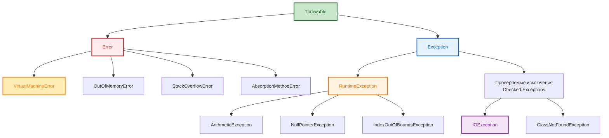

---

### Класс Throwable

**`java.lang.Throwable`** — корневой класс всей системы исключений в Java. Все объекты, представляющие ошибки или отклонения от нормального выполнения программы, должны наследовать именно этот класс. Конструкторы класса позволяют передавать сообщение об ошибке и ссылку на исключение-причину.

**Поля класса:**
- `detailMessage` — текстовое описание состояния возникновения ошибки
- `cause` — ссылка на исходное исключение, вызвавшее текущую ошибку

**Методы класса:**
- `printStackTrace()` — выводит стек вызовов в стандартный поток ошибок
- `getMessage()` — возвращает текстовую форму сообщения ошибки
- `getCause()` — возвращает объект исключения-причины
- `toString()` — строковое представление объекта исключения

**Пример использования:**
```java
try {
    // оперируем ресурсом
} catch (Throwable t) {
    System.out.println(t.getMessage());
    t.printStackTrace();
}
```

---

### Класс Error

**`java.lang.Error`** — базовый класс для проблем серьёзного уровня, которые обычно возникают на уровне виртуальной машины. Разработчик программного кода не должен пытаться перехватывать эти случаи программно, поскольку они указывают на критические проблемы среды выполнения.

**Характеристики класса:**
- Не предназначена для обработки операторами try-catch
- Возникают при исчерпании системных ресурсов
- Требуют вмешательства оператора или администратора системы

---

### Класс Exception

**`java.lang.Exception`** — базовый класс для всех ситуаций, которые программа может обработать программным путём. Компилятор Java проверяет наличие обработки этих исключений перед сборкой проекта. Это гарантирует что разработчик осознаёт возможные ситуации отклонения от нормального хода программы.

---

## Полный справочник по классам java.lang.Error

Этот раздел содержит полные описания каждого класса из семейства Error. Все они наследуются от корня иерархии ошибок и указывают на состояния, которые среда выполнения Java не способна обработать самостоятельно.

---

### AssertionError

**Пакет:** `java.lang`

**Наследование:**
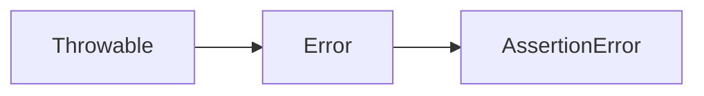

**Предназначение:** Указывает на отказ проверки утверждений в коде. Используется директивами assert для внутренней верификации логических условий внутри программы.

**Сценарии возникновения:**
- Проверка внутренних предположений программы не пройдена
- Нарушение контрактов методов или классов
- Состояние объекта не соответствует ожиданиям разработчика

**Пример появления:**
```java
assert x >= 0 : "Значение должно быть положительным";
// Если условие ложно, выбрасывается AssertionError
```

**Рекомендации:**
- Используйте только для внутренней диагностики логики программы
- Не перекладывайте ответственность за валидацию входных данных на утверждения
- Отключайте проверку утверждений с помощью флага `-disableassertions` в режиме production

---

### LinkageError

**Пакет:** `java.lang`

**Наследование:**
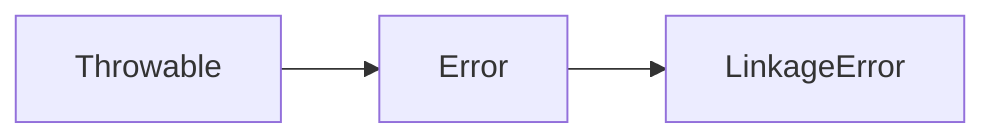

**Предназначение:** Сообщает о проблемах при загрузке классов в рантайме. Возникает при несоответствии между кодом и загружаемыми классами.

**Подклассы:**

| Подкласс | Описание |
|----------|----------|
| BootstrapMethodError | Ошибка при выполнении bootstrap методов |
| ClassCircularityError | Класс ссылается сам на себя через цепочку наследования |
| ClassFormatError | Нарушена структура байт-кода класса |
| IncompatibleClassChangeError | Изменены сигнатуры методов или полей класса |
| NoSuchFieldError | Класс запрашивает поле, которого нет |
| NoSuchMethodError | Класс запрашивает метод, которого нет |
| VerifyError | Валидация байт-кода завершена неудачей |

**Сценарии возникновения:**
- Версионные конфликты библиотек
- Модификация классов во время работы приложения
- Несовместимость компиляции и исполнения

**Пример появления:**
```java
// Класс был перекомпилирован после загрузки другого
String s = new SomeClass().nonExistentMethod();
// Вызовет NoSuchMethodError если метод удалён в новой версии
```

---

### NoClassDefFoundError

**Пакет:** `java.lang`

**Наследование:**
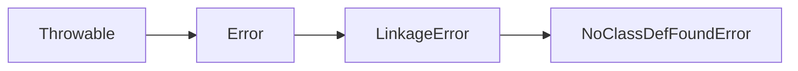

**Предназначение:** Возникает когда JVM пытается использовать класс, но не может найти его определение в пути загрузки классов.

**Отличие от ClassNotFoundException:**
- ClassNotFoundException возникает программно при попытке загрузить класс через Reflection
- NoClassDefFoundError возникает автоматически во время выполнения кода

**Причины возникновения:**
- Отсутствует JAR файл в библиотеках проекта
- Класс определён в другом модуле или проекте
- Проблемы с маршрутом загрузки классов

**Пример проявления:**
```java
// При запуске без указания класса в classpath
SomeClass obj = new SomeClass();
// Вызовет NoClassDefFoundError
```

---

### OutOfMemoryError

**Пакет:** `java.lang`

**Наследование:**
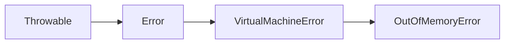

**Предназначение:** Сообщает о невозможности выделить память для новых объектов.

**Типы памяти, связанные с ошибкой:**

| Тип | Описание |
|-----|----------|
| Heap space | Основная куча JVM для объектов |
| Metaspace | Хранилище метаданных классов |
| Thread stacks | Память стеков потоков |
| Code cache | Кэш машинного кода JIT компилятора |

**Стратегии обработки:**
- Увеличение параметров -Xmx и -Xms для JVM
- Оптимизация использования памяти в коде
- Мониторинг потребления памяти профилями
- Перезапуск приложения при критической ошибке

**Пример проявления:**
```java
List<byte[]> objects = new ArrayList<>();
while (true) {
    objects.add(new byte[10 * 1024 * 1024]); // 10 МБ на каждый элемент
}
// Вызовет OutOfMemoryError при исчерпании памяти
```

---

### StackOverflowError

**Пакет:** `java.lang`

**Наследование:**


**Предназначение:** Сообщает о превышении допустимого размера стека вызовов потоками программы.

**Основные причины возникновения:**
- Бесконечная рекурсия функций
- Циклические вызовы методов между классами
- Слишком глубокая вложенность вызовов
- Недостаточный размер параметра -Xss

**Пример проявления:**
```java
void recursiveCall() {
    recursiveCall(); // Бесконечная рекурсия
}
recursiveCall(); // Вызовет StackOverflowError
```

**Стратегии профилактики:**
- Анализ глубины рекурсии перед реализацией
- Использование итерационных подходов вместо рекурсивных
- Увеличение лимита стека через JVM параметры
- Рефакторинг кода для уменьшения вложенности

---

### VirtualMachineError

**Пакет:** `java.lang`

**Наследование:**
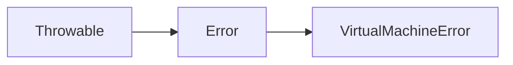

**Предназначение:** Базовый класс для ошибок самой виртуальной машины Java. Эти ошибки указывают на внутренние неполадки среды выполнения.

**Подклассы:**

| Подкласс | Описание |
|----------|----------|
| InternalError | Внутренняя ошибка JVM |
| OutOfMemoryError | Исчерпание выделенной памяти |
| StackOverflowError | Превышение размеров стека потока |
| UnknownError | Неопределённая ошибка виртуальной машины |

**Рекомендации:**
- Не обрабатывать программно
- Логируйте полную информацию об инциденте
- Обращайтесь к документации JVM для диагностики
- Применяйте мониторинг производительности

---

## Полный справочник по проверяемым исключениям (checked exceptions)

Проверяемые исключения требуют обязательной обработки или объявления в сигнатуре метода. Компилятор Java контролирует их наличие и выдаст ошибку сборки без правильной обработки.

---

### ClassNotFoundException

**Пакет:** `java.lang`

**Наследование:**
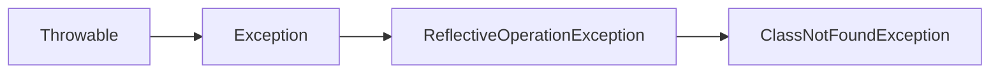

**Предназначение:** Возникает когда код ищет класс по имени, но не может найти его определение в доступных путях.

**Основные сценарии:**
- Отсутствие JAR файла в classpath
- Опечатка в полном названии класса
- Класс доступен только в другой версии библиотеки

**Пример применения:**
```java
try {
    Class<?> cls = Class.forName("com.example.SomeClass");
} catch (ClassNotFoundException e) {
    // Класс отсутствует в системе
    System.err.println("Класс не найден: SomeClass");
}
```

**Варианты обработки:**
- Проверка существования файлов в директории проекта
- Валидация конфигурационных настроек
- Динамическая загрузка классов из внешних источников

---

### CloneNotSupportedException

**Пакет:** `java.lang`

**Наследование:**
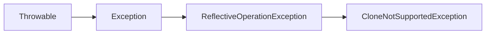

**Предназначение:** Возникает когда класс не поддерживает клонирование через интерфейс Cloneable.

**Условия возникновения:**
- Класс не реализует интерфейс Cloneable
- Переопределение метода clone() без объявления throws
- Запрет клонирования на уровне бизнес-логики

**Пример реализации:**
```java
public class NotCloneable implements Cloneable {
    @Override
    protected Object clone() throws CloneNotSupportedException {
        throw new CloneNotSupportedException("Клонирование запрещено");
    }
}
```

---

### IllegalAccessException

**Пакет:** `java.lang`

**Наследование:**
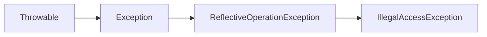

**Предназначение:** Указывает на попытку доступа к компоненту с ограниченной видимостью.

**Основные варианты:**
- Доступ к приватным полям или методам
- Попытка создания экземпляра закрытого класса
- Нарушение ограничений пакета

**Пример использования:**
```java
PrivateClass obj = new PrivateClass();
obj.setField(publicAccess); // Нарушает инкапсуляцию
```

**Стратегии решения:**
- Использование публичных API вместо рефлексии
- Открытие классов через модульную систему Java
- Применение методов setter/getter

---

### InstantiationException

**Пакет:** `java.lang`

**Наследование:**
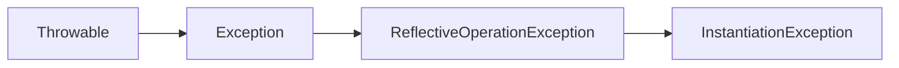

**Предназначение:** Возникает при попытке создать экземпляр абстрактного класса или интерфейса.

**Причины возникновения:**
- Попытка инстанцировать абстрактный тип
- Отсутствует конструктор без параметров
- Конструктор объявлен как private

**Пример проявления:**
```java
AbstractClass obj = (AbstractClass) Class.newInstance();
// Вызовет InstantiationException если абстрактный
```

**Рекомендации:**
- Создавайте экземпляры конкретных подклассов
- Используйте фабричные методы или DI контейнеры
- Применяйте паттерн Factory Method

---

### InterruptedException

**Пакет:** `java.lang`

**Наследование:**
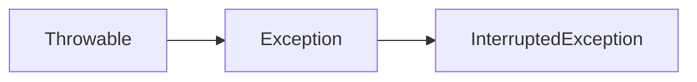

**Предназначение:** Возникает когда поток прерван во время ожидания. Сигнализирует о необходимости прекратить выполнение текущей операции.

**Основные источники:**
- Методы sleep(), wait(), join()
- Операторы блокировки потоков
- Сервисы планировщики задач

**Правильная обработка:**
```java
try {
    Thread.sleep(1000);
} catch (InterruptedException e) {
    Thread.currentThread().interrupt();
    // Сохраняем состояние прерывания
    return;
}
```

**Важные аспекты:**
- Всегда сохраняйте флаг прерывания потока
- Прекращайте выполнение немедленно после перехвата
- Не игнорируйте это исключение

---

### NoSuchFieldException

**Пакет:** `java.lang`

**Наследование:**
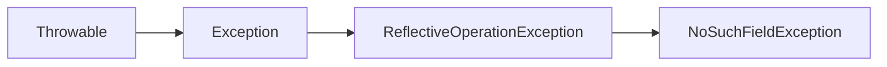

**Предназначение:** Возникает при попытке получить доступ к полю, которого не существует в классе.

**Сценарии возникновения:**
- Опечатка в имени поля
- Поле удалено в обновлении версии
- Поле доступно только в родительском классе

**Пример использования:**
```java
try {
    Field f = MyClass.class.getDeclaredField("nonexistent");
} catch (NoSuchFieldException e) {
    System.err.println("Поле не найдено");
}
```

---

### NoSuchMethodException

**Пакет:** `java.lang`

**Наследование:**


**Предназначение:** Сообщает что запрошенный метод не найден в классе.

**Варианты применения:**
- Поиск метода по именному идентификатору
- Вызов метода через рефлексию
- Интеграция с динамическими API

**Пример применения:**
```java
try {
    Method m = MyClass.class.getMethod("nonexistentMethod");
} catch (NoSuchMethodException e) {
    System.err.println("Метод отсутствует");
}
```

---

### IOException

**Пакет:** `java.io`

**Наследование:**
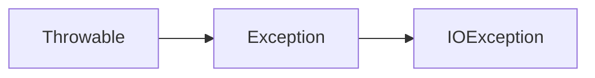

**Предназначение:** Базовый класс для всех исключений ввода-вывода. Покрытие операций чтения и записи файлов, сетевых подключений.

**Основные подклассы:**

| Подкласс | Описание |
|----------|----------|
| EOFException | Достигнут конец файла преждевременно |
| FileNotFoundException | Файл не обнаружен |
| InterruptedIOException | Операция прервана |
| MalformedURLException | Некорректный URL адрес |
| ProtocolException | Ошибка протокола сети |
| SocketTimeoutException | Таймаут сетевого соединения |
| SyncFailedException | Синхронизация ресурса не удалась |
| UnknownHostException | Узел сети недоступен |
| URISyntaxException | Неверный формат URI |

**Пример обработки:**
```java
try (FileReader reader = new FileReader("data.txt")) {
    int charData = reader.read();
} catch (FileNotFoundException e) {
    System.err.println("Файл не найден");
} catch (IOException e) {
    System.err.println("Ошибка чтения");
}
```

**Рекомендации:**
- Всегда используйте try-with-resources
- Логгируйте детали ошибки
- Предусматривайте альтернативные пути

---

### ReflectiveOperationException

**Пакет:** `java.lang`

**Наследование:**
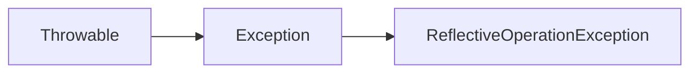

**Предназначение:** Базовый класс для всех исключений связанных с рефлексией. Группирует ошибки при работе с мета-данными классов во время выполнения.

**Дочерние исключения:**
- ClassNotFoundException
- IllegalAccessException
- InstantiationException
- InvocationTargetException
- NoSuchFieldException
- NoSuchMethodException

**Сценарии использования:**
- Метапрограммирование во время выполнения
- Динамическое создание объектов
- Анализ структуры классов
- Автоматическое тестирование компонентов

---

### InvocationTargetException

**Пакет:** `java.lang`

**Наследование:**
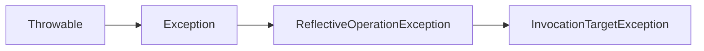

**Предназначение:** Возникает когда метод вызывает другую операцию и происходит ошибка внутри этого метода.

**Особенности обработки:**
- Получение исходной ошибки через getCause()
- Определение причины исключения в методе
- Воспроизведение результата в основном потоке

**Пример использования:**
```java
try {
    method.invoke(obj, args);
} catch (InvocationTargetException e) {
    Throwable cause = e.getCause();
    System.err.println("Ошибка в целевом методе: " + cause);
}
```

---

## Полный справочник по непроверяемым исключениям (unchecked exceptions)

Непроверяемые исключения не требуют обязательной обработки. Они наследуются от RuntimeException и указывают на программные ошибки, которые следует предотвращать через валидацию кода.

---

### ArithmeticException

**Пакет:** `java.lang`

**Наследование:**
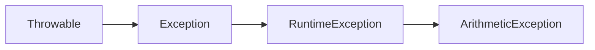

**Предназначение:** Сообщает об арифметической ошибке вычисления.

**Основные типы ошибок:**
- Деление на ноль для целых чисел
- overflow целочисленных операций
- недопустимые математические операции

**Пример появления:**
```java
int result = 10 / 0; // Вызовет ArithmeticException
```

**Стратегии предотвращения:**
- Валидация делителя перед операцией
- Использование проверок границ значений
- Применение больших типов данных при необходимости

---

### ArrayIndexOutOfBoundsException

**Пакет:** `java.lang`

**Наследование:**
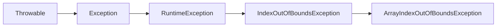

**Предназначение:** Возникает при обращении к индексу массива вне допустимых границ.

**Допустимые диапазоны:**
| Условие | Значение |
|---------|----------|
| Правый индекс | [0...length-1] |
| Нижний предел | 0 включительно |
| Верхний предел | length-1 включительно |

**Пример проявления:**
```java
int[] data = new int[5];
System.out.println(data[5]); // Вызовет исключение
```

**Превентивные меры:**
- Проверка границ перед доступом
- Использование циклов с правильными условиями
- Применение коллекций вместо массивов

---

### ClassCastException

**Пакет:** `java.lang`

**Наследование:**
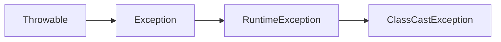

**Предназначение:** Возникает при попытке привести объект к типу который он не является.

**Основные причины:**
- Неправильное приведение типов после получения объекта
- Потеря информации при приведении
- Изменение иерархии классов

**Пример появления:**
```java
Object o = new String();
Integer i = (Integer) o; // Вызовет ClassCastException
```

**Стратегии профилактики:**
- Проверка instanceof перед кастом
- Использование дженериков в коллекциях
- Применение безопасных методов приведения

---

### ConcurrentModificationException

**Пакет:** `java.util`

**Наследование:**
```mermaid
flowchart LR
    Throwable --> Exception --> RuntimeException --> ConcurrentModificationException
```

**Предназначение:** Возникает когда коллекция модифицируется одновременно с итерацией.

**Основные условия возникновения:**
- Прямое изменение коллекции во время forEach
- Параллельное удаление элементов
- Одновременная модификация нескольким потоком

**Пример проявления:**
```java
for (String s : list) {
    if (s.isEmpty()) {
        list.remove(s); // Вызовет исключение
    }
}
```

**Решения проблемы:**
- Iterator.remove() вместо list.remove()
- Создание копии для изменения
- Использование ConcurrentHashMap

---

### IllegalArgumentException

**Пакет:** `java.lang`

**Наследование:**
```mermaid
flowchart LR
    Throwable --> Exception --> RuntimeException --> IllegalArgumentException
```

**Предназначение:** Возникает когда метод получает запрещённый аргумент.

**Типы некорректных аргументов:**
- Отрицательные значения там где нельзя
- Пустые строки в критических местах
- Несоответствие формата входа
- Недопустимый диапазон параметров

**Пример использования:**
```java
public void setAge(int age) {
    if (age < 0 || age > 150) {
        throw new IllegalArgumentException("Неверный возраст");
    }
}
```

**Рекомендации:**
- Валидация в начале метода
- Чёткие сообщения об ошибке
- Документирование допустимых значений

---

### NumberFormatException

**Пакет:** `java.lang`

**Наследование:**
```mermaid
flowchart LR
    Throwable --> Exception --> RuntimeException --> IllegalArgumentException --> NumberFormatException
```

**Предназначение:** Возникает при попытке преобразовать строку не являющуюся числом.

**Варианты некорректных вводов:**
- Строки с буквами вместо цифр
- Неправильный формат десятичных знаков
- Знаки валют в числовых операциях

**Пример проявления:**
```java
int value = Integer.parseInt("abc"); // Вызовет исключение
```

**Стратегии обработки:**
- Предварительная проверка символами
- Использование try-catch блоков
- Замена на null или значение по умолчанию

---

### NullPointerException

**Пакет:** `java.lang`

**Наследование:**
```mermaid
flowchart LR
    Throwable --> Exception --> RuntimeException --> NullPointerException
```

**Предназначение:** Возникает при обращению к методу или полю объекта равного null.

**Типичные сценарии:**
- Вызов метода на неинициализированном объекте
- Доступ к свойству нулевого поля
- Автоматический unboxing null значения
- Метод возврата null в потоковой цепочке

**Пример появления:**
```java
String text = null;
int length = text.length(); // Вызовет NPE
```

**Современные подходы:**
- Применение Optional для возвращения значений
- Валидация параметров в начале метода
- Использование null-safe операторов в Java 9+

---

### SecurityException

**Пакет:** `java.lang`

**Наследование:**
```mermaid
flowchart LR
    Throwable --> Exception --> RuntimeException --> SecurityException
```

**Предназначение:** Возникает когда нарушаются политики безопасности Java.

**Основные причины:**
- Попытки несанкционированного доступа к файлам
- Выполнение запретных операций в песочнице
- Нарушение разрешений в модульной системе
- Несовместимость подписи кода

**Пример проявления:**
```java
System.setProperty("user.dir", "/etc/"); // Может вызвать
```

**Стратегии защиты:**
- Проверка прав доступа перед действиями
- Конфигурация Security Manager
- Отказ от опасных методов

---

## Полный справочник по дополнительным важным исключениям

Существуют специальные исключения для специфических областей работы и узкоспециализированных задач. Эти исключения дополняют основную структуру и покрывают специфические сценарии разработки.

---

### IllegalStateException

**Пакет:** `java.lang`

**Наследование:**
```mermaid
flowchart LR
    Throwable --> Exception --> RuntimeException --> IllegalStateException
```

**Предназначение:** Возникает когда метод вызывается в неподходящем состоянии объекта.

**Типичные примеры:**
- Вызов метода до инициализации
- Попытка открытия уже открытого ресурса
- Нарушение последовательности вызовов
- Изменение неизменяемых структур

**Пример использования:**
```java
public void process() {
    if (!initialized) {
        throw new IllegalStateException("Объект не инициализирован");
    }
}
```

---

### UnsupportedOperationException

**Пакет:** `java.lang`

**Наследование:**
```mermaid
flowchart LR
    Throwable --> Exception --> RuntimeException --> UnsupportedOperationException
```

**Предназначение:** Возникает когда метод не поддерживается реализацией.

**Основные сценарии:**
- Реализация интерфейса с фиксированным функционалом
- Жёстко заданная архитектура типа
- Защита от несанкционированных изменений

**Пример применения:**
```java
public class ReadOnlyCollection implements List<String> {
    public void add(String s) {
        throw new UnsupportedOperationException("Нельзя добавлять");
    }
}
```

---

### ContinuationException (для контекста)

В более поздних версиях Java вводятся новые механизмы для контроля продолжения операций. Эти инструменты помогают управлять длительными задачами и предоставляют механизмы прерывания.

**Новые возможности:**
- Возможность отмены долгой задачи
- Явное управление состоянием операций
- Прозрачность для пользователя системы

**Рекомендации:**
- Применяйте при работе с сетевыми запросами
- Используйте при обработке пользовательских действий
- Реализуйте в долгосрочных сервисах

---

## Сравнительная таблица категорий исключений

| Характеристика | checked | unchecked | error |
|---------------|---------|-----------|-------|
| Обработка обязательна | Да | Нет | Нет |
| Компиляция | Требует try/catch | Не требуется | Не требуется |
| Примеры | IOException, SQLException | NullPointerException | OutOfMemoryError |
| Причина | Внешние ресурсы | Программная логика | Сбой среды |
| Рекомендация | Обрабатывать всегда | Исправлять код | Логировать |

---

## Рекомендации по проектированию обработки исключений

### Стратегия определения собственных исключений

| Уровень | Тип исключения | Когда использовать |
|--------|----------------|--------------------|
| Критический | CustomException | Бизнес ошибки |
| Средний | ServiceException | Сервисные сбои |
| Низкий | ApplicationError | Ошибки приложений |

---

### Принципы формирования сообщений

1. Текст сообщения должен быть понятным для читателя
2. Информация должна содержать идентификаторы для логирования
3. Сообщение не должно раскрывать внутреннюю структуру системы
4. Следует избегать технических терминов в пользовательских сообщениях

---

### Практические советы по использованию

- Не скрывайте исходную причину через generic Exception
- Всегда добавляйте context в кастомные исключения
- Документируйте все возможные исключения в javadoc
- Используйте наследование для категоризации исключений

---

## Инструменты анализа и обработки исключений

### Логирование и трекинг

| Инструмент | Назначение | Область применения |
|-----------|------------|-------------------|
| SLF4J | Универсальный API | Все слои архитектуры |
| Logback | Реализация | Production окружение |
| Console | Отладка | Разработка окружение |

---

### Профилирование и диагностика

**Встроенные средства:**
- printStackTrace() для вывода стека
- getMessage() для извлечения текста
- getCause() для получения причины
- getSuppressed() для множественных причин

**Внешние инструменты:**
- IDE встроенные отладчики
- JVM профилеры для анализа
- Мониторинговые панели observability

---
