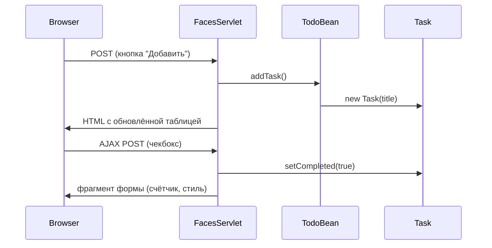

import ExternalCodeEmbed from '@site/src/components/ExternalCodeEmbed';


# Практикум JSF — список задач

<span class="complexity-badge">Разработчику</span>
<span class="complexity-badge">Начальный уровень</span>

---

## О практикуме

Соберём **веб-приложение "Список задач"** на **JavaServer Faces (JSF) 4** и **Jakarta EE 10**. Пользователь сможет добавлять задачи, отмечать их выполненными, удалять строки и видеть статистику — всё через браузер, без перезагрузки страницы при смене чекбокса.

Стек проекта:

- **Maven WAR** — упаковка web-приложения для servlet-контейнера ([структура и сборки](./12.md));
- **Facelets** — XHTML-разметка с тегами `h:` и `f:` ([теория Facelets](./25.md));
- **CDI (Weld)** — создание и внедрение managed beans ([JavaBeans и CDI](./26.md));
- **Jetty Maven Plugin** — локальный запуск без установки Tomcat.

<div class="callout callout--info">
  <div class="callout-title">Legacy, но учебно ценно</div>

  <div class="callout-body">
  В новых backend-проектах чаще берут <a href="./271.md">Spring Boot</a>, а JSF встречается в корпоративных порталах и системах, которые поддерживают годами. Этот практикум не про "модный стек", а про понимание <strong>серверного MVC</strong>, <strong>postback</strong> и <strong>состояния формы на сервере</strong> — навыков, полезных и при чтении legacy-кода.
  </div>
</div>

### Что такое JSF в контексте этого проекта

**JavaServer Faces (JSF)** — спецификация Jakarta EE для построения пользовательского интерфейса **на сервере**. Браузер получает обычный HTML, но каждый клик по кнопке JSF-компонента отправляет **postback** — POST-запрос, который проходит через **жизненный цикл JSF** (шесть фаз от Restore View до Render Response). Подробно — в [JavaServer Faces — фреймворк для веб-интерфейсов](./25.md).

В нашем приложении три слоя MVC:

| Слой MVC | Роль в проекте | Файлы |
|----------|----------------|-------|
| **Model** | Данные задачи | `Task.java` |
| **View** | Разметка и компоненты UI | `index.xhtml`, `styles.css` |
| **Controller** | Обработка действий пользователя | `TodoBean.java`, `FacesServlet` |

Связь View ↔ Model идёт через **Expression Language (EL)** — выражения вида `#{todoBean.newTaskTitle}`. JSF читает и записывает свойства bean по JavaBean-конвенции ([ООП и классы](./18.md)).

### Ключевые термины

- **Managed bean** — Java-класс, живущий в определённой **области видимости** (request, session, view); в JSF 2.2+ это CDI-бины с `@Named` и `@SessionScoped`.
- **Postback** — повторный POST на ту же страницу после действия пользователя (кнопка, чекбокс); типичный паттерн JSF, в отличие от REST, где каждый URL — отдельный ресурс ([HTTP и веб-интеграции](/encyclopedia/2-system-network/2-09-osnovy-integracionnogo-vzaimodeystviya/118)).
- **Facelets** — шаблонизатор для `.xhtml`; теги `h:inputText`, `h:commandButton` превращаются в HTML на этапе Render Response.
- **WAR (Web Application Archive)** — JAR-подобный архив с `WEB-INF`, `classes` и статикой; разворачивается в Tomcat, Jetty, Payara.
- **FacesServlet** — единственная точка входа для всех `*.xhtml`; без него контейнер отдал бы файл как статику, минуя JSF.

### Почему именно этот проект

- охватывает типичный legacy-сценарий — **форма + таблица + серверное состояние**;
- показывает связку **managed bean ↔ EL ↔ компоненты JSF** без сторонних UI-библиотек (PrimeFaces — в [первой программе на JSF](./251.md));
- компактен для одного вечера (2–3 часа), но близок к реальной поддержке старых порталов;
- после прохождения легче читать [теорию JSF](./25.md) — вы уже видели lifecycle "вживую".

**Предварительные знания:** JDK 17+, Maven 3.8+, классы и коллекции ([ООП](./18.md), [коллекции](./24.md), при желании [Stream API](./295.md) для `getCompletedCount`). Желательно пройти [первую программу на JSF](./251.md). Готовый проект для сверки: `F:\Projects\JVM\Java\JavaServerFacesSimple`.

### Что получится

| Действие пользователя | Компонент JSF | Метод / свойство bean |
|-----------------------|---------------|------------------------|
| Ввести текст и нажать "Добавить" | `h:inputText`, `h:commandButton` | `TodoBean.addTask()` |
| Отметить "выполнено" | `h:selectBooleanCheckbox`, `f:ajax` | `Task.setCompleted()` |
| Удалить строку | `h:commandButton` | `TodoBean.removeTask(task)` |
| Отправить пустое поле | `h:messages` | `FacesMessage` в `addTask()` |
| Увидеть статистику | EL в разметке | `tasks.size()`, `completedCount` |

### Карта этапов

| Этап | Фокус | Результат |
|------|--------|-----------|
| [0](#stage-0) | Каркас Maven WAR | Пустая структура каталогов |
| [1](#stage-1) | `pom.xml` | Зависимости JSF, CDI, Jetty |
| [2](#stage-2) | `web.xml`, `beans.xml` | FacesServlet и CDI |
| [3](#stage-3) | `Task` | Модель задачи |
| [4](#stage-4) | `TodoBean` | Логика списка, `@SessionScoped` |
| [5](#stage-5) | `index.xhtml`, форма | Добавление и сообщения |
| [6](#stage-6) | Таблица и AJAX | `h:dataTable`, `f:ajax` |
| [7](#stage-7) | CSS | Оформление страницы |
| [8](#stage-8) | Запуск | `mvn jetty:run`, проверка в браузере |

После каждого этапа имеет смысл **собрать или запустить** проект — привычка из [разработки и отладки](/encyclopedia/4-code-dev/4-14-razrabotka-i-otladka/intro): маленькие шаги, частая проверка.

---

<span id="stage-0"></span>
## Этап 0 — каркас проекта

**Цель этапа** — создать стандартную структуру **WAR**-проекта Maven.

Web-приложение на Java не начинается с `public static void main` ([точка входа JVM](./40.md)). Точку входа задаёт **servlet-контейнер**: он читает `WEB-INF/web.xml`, поднимает сервлеты и слушатели, затем ждёт HTTP-запросы. Maven для таких проектов использует **`packaging` war** и каталог `src/main/webapp` — см. [Структура и сборки Java-проектов](./12.md).

Создайте корневую папку:

```bash
mkdir jsf-simple && cd jsf-simple
```

Каталоги (Windows PowerShell):

```powershell
New-Item -ItemType Directory -Force -Path `
  src/main/java/com/example/bean, `
  src/main/java/com/example/model, `
  src/main/webapp/WEB-INF, `
  src/main/webapp/resources/css
```

Итоговая схема:

```text
jsf-simple/
├── pom.xml
└── src/main/
    ├── java/com/example/
    │   ├── bean/          ← TodoBean (controller)
    │   └── model/         ← Task (model)
    └── webapp/
        ├── index.xhtml    ← view
        ├── WEB-INF/
        │   ├── web.xml
        │   └── beans.xml
        └── resources/css/
            └── styles.css
```

**Разбор структуры**

- **`src/main/java`** — компилируемый Java-код; пакеты повторяют путь папок (`com.example.bean`).
- **`src/main/webapp`** — корень web-приложения; отсюда контейнер раздаёт страницы и статику.
- **`WEB-INF`** — защищённая зона: файлы внутри не доступны по прямому URL из браузера.
- **`resources/css/`** — соглашение JSF для статических ресурсов; `library="css"` в `h:outputStylesheet` указывает на эту папку.

---

<span id="stage-1"></span>
## Этап 1 — `pom.xml`

**Цель этапа** — подключить **Jakarta Faces 4**, **CDI (Weld)** и плагин **Jetty** для локального запуска.

Файл **`pom.xml`** (Project Object Model) описывает координаты артефакта, версии Java, зависимости и плагины сборки. Для JSF нужны три группы библиотек:

1. **Servlet API** — контракт HTTP-сервлета (реализацию даёт Jetty/Tomcat).
2. **JSF API + реализация (Mojarra)** — компоненты, lifecycle, EL-интеграция.
3. **CDI (Weld)** — `@Named`, `@SessionScoped`, discovery бинов.

Создайте `pom.xml` в корне проекта:


<ExternalCodeEmbed example="xml/java-503-252-001" title="Этап 1 — `pom.xml`" minHeight={720} />


**Разбор зависимостей**

| Зависимость | Назначение |
|-------------|------------|
| `jakarta.servlet-api` (provided) | Типы `HttpServlet`, `ServletContext`; в WAR не кладётся — их даёт контейнер |
| `jakarta.faces-api` | Интерфaces JSF — `UIComponent`, `FacesContext` |
| `jakarta.faces` (Mojarra) | Реализация спецификации — парсер Facelets, рендереры HTML |
| `weld-servlet-core` | CDI в "голом" servlet-контейнере без полного Java EE-сервера |
| `jakarta.enterprise.cdi-api` | Аннотации `@Named`, `@SessionScoped` |
| `jakarta.inject-api` | `@Inject` для будущего расширения |

**Разбор сборки**

- `<packaging>war</packaging>` — итог `mvn package` → `target/jsf-simple.war`.
- `maven-war-plugin` — упаковывает `webapp` и скомпилированные классы.
- `jetty-maven-plugin` — команда `mvn jetty:run` поднимает приложение на [http://localhost:8080/](http://localhost:8080/) без отдельной установки Tomcat.

Проверка:

```bash
mvn -q validate
```

Если Maven не находит артефакты — проверьте интернет и зеркала репозитория ([первая программа на Java](./13.md), раздел про Maven).

---

<span id="stage-2"></span>
## Этап 2 — `web.xml` и `beans.xml`

**Цель этапа** — зарегистрировать **FacesServlet**, включить **CDI** и указать стартовую страницу.

Два конфигурационных файла в `WEB-INF` задают поведение контейнера и CDI. Без них страница `index.xhtml` либо отдастся как статический XML, либо bean `todoBean` не будет найден в EL.

### `web.xml` — дескриптор web-приложения

`src/main/webapp/WEB-INF/web.xml`:


<ExternalCodeEmbed example="xml/java-503-252-002" title="`web.xml` — дескриптор web-приложения" minHeight={720} />


**Разбор `web.xml`**

- **`<listener>` Weld** — при старте приложения инициализирует CDI-контейнер; без него `@Named` не сработает.
- **`FacesServlet`** — центральный **контроллер** JSF ([раздел про FacesServlet](./25.md)); `load-on-startup` грузит его при деплое, а не при первом запросе.
- **`url-pattern` `*.xhtml`** — любой запрос к `index.xhtml` проходит через lifecycle JSF, а не через default servlet.
- **`welcome-file-list`** — при обращении к `/` контейнер перенаправит на `index.xhtml`.
- **`PROJECT_STAGE=Development`** — подробные сообщения об ошибках в логах; в production ставят `Production`.
- **`FACELETS_SKIP_COMMENTS=true`** — HTML-комментарии `<!-- -->` в `.xhtml` не попадают в вывод (удобно для учебных пометок в разметке).

### `beans.xml` — активация CDI

`src/main/webapp/WEB-INF/beans.xml`:

```xml
<?xml version="1.0" encoding="UTF-8"?>
<beans xmlns="https://jakarta.ee/xml/ns/jakartaee"
       xmlns:xsi="http://www.w3.org/2001/XMLSchema-instance"
       xsi:schemaLocation="https://jakarta.ee/xml/ns/jakartaee
       https://jakarta.ee/xml/ns/jakartaee/beans_4_0.xsd"
       bean-discovery-mode="all">
</beans>
```

**Разбор `beans.xml`**

- Файл может быть **пустым по содержанию**, но его наличие говорит Weld сканировать классы приложения.
- `bean-discovery-mode="all"` — CDI видит все классы с scope-аннотациями, не только с `@Named`.
- Связь с [JavaBeans — компонентная модель](./26.md): managed bean в JSF 2.2+ — это CDI-бин с EL-именем.

```mermaid
flowchart LR
  HTTP[HTTP-запрос к index.xhtml] --> FacesServlet
  FacesServlet --> Lifecycle[JSF Lifecycle]
  Lifecycle --> EL[EL #{todoBean...}]
  EL --> Weld[CDI / Weld]
  Weld --> TodoBean[TodoBean @SessionScoped]
```

---

<span id="stage-3"></span>
## Этап 3 — модель `Task`

**Цель этапа** — описать **сущность задачи** — заголовок, момент создания, флаг "выполнено".

**Model** в MVC — данные и правила предметной области. `Task` не знает про HTTP, XHTML и JSF; это обычный Java-класс. Такое разделение упрощает тесты и последующее подключение JPA ([Hibernate и JPA — практический старт](./293.md)).

`src/main/java/com/example/model/Task.java`:


<ExternalCodeEmbed example="java/java-503-252-003" title="Этап 3 — модель `Task`" minHeight={720} />


**Разбор класса `Task`**

- **`implements Serializable`** — `@SessionScoped` bean и объекты в сессии могут сериализоваться между запросами; без `serialVersionUID` при изменении класса сессии "ломаются" после redeploy.
- **`title` и `createdAt` — `final`** — после создания задачи заголовок и время не меняются; меняется только `completed`. Так проще рассуждать о состоянии строки таблицы.
- **`LocalDateTime`** — современный API даты/времени ([`java.time`](./28.md)); форматирование вынесено в `getFormattedCreatedAt()`, чтобы XHTML не вызывал `DateTimeFormatter` напрямую.
- **`isCompleted` / `setCompleted`** — JavaBean-имена для **boolean**-свойства; JSF и EL обращаются к нему как `#{task.completed}`.
- **`getFormattedCreatedAt()`** — "вычисляемое свойство" для View: в EL пишем `#{task.formattedCreatedAt}`, без скобок и без знания формата на странице.

---

<span id="stage-4"></span>
## Этап 4 — managed bean `TodoBean`

**Цель этапа** — инкапсулировать **список задач** и действия "добавить" / "удалить".

**Controller** в нашем приложении — `TodoBean`. Он хранит коллекцию `Task`, принимает текст новой задачи, валидирует ввод и отдаёт данные представлению через getters. Это **managed bean** в области **session** — один экземпляр на пользователя, пока жива HTTP-сессия ([сессия и postback](/encyclopedia/2-system-network/2-09-osnovy-integracionnogo-vzaimodeystviya/118)).

`src/main/java/com/example/bean/TodoBean.java`:


<ExternalCodeEmbed example="java/java-503-252-004" title="Этап 4 — managed bean `TodoBean`" minHeight={720} />


**Разбор аннотаций**

- **`@Named("todoBean")`** — регистрирует бин в CDI и задаёт имя для EL; на странице пишем `#{todoBean...}`, не полное имя класса.
- **`@SessionScoped`** — бин создаётся при первом обращении и живёт в HTTP-сессии; список задач сохраняется между postback-запросами и перезагрузками страницы (F5), пока не истечёт сессия.
- Альтернативы из [теории JSF](./25.md): `@RequestScoped` (новый бин на каждый запрос), `@ViewScoped` (на одну JSF-страницу) — для todo-списка логична именно session.

**Разбор методов**

| Метод | Тип в JSF | Поведение |
|-------|-----------|-----------|
| `addTask()` | **Action method** | Вызывается кнопкой; `void` — остаёмся на той же странице |
| `removeTask(Task)` | Action method с параметром | JSF сопоставляет строку `dataTable` с объектом `Task` |
| `getTasks()` | Свойство `tasks` | Питает `h:dataTable value="#{todoBean.tasks}"` |
| `getCompletedCount()` | Свойство `completedCount` | EL опускает `get` и `()` |
| `get/setNewTaskTitle` | Двусторонняя привязка | `h:inputText value="#{todoBean.newTaskTitle}"` |

**Разбор `addTask()`**

- `newTaskTitle.isBlank()` — проверка пустого ввода ([строки в Java](./296.md)); при ошибке добавляется **`FacesMessage`** с уровнем `WARN`.
- Первый аргумент `addMessage(null, ...)` — **глобальное** сообщение; его покажет `h:messages globalOnly="true"`.
- После успешного добавления `newTaskTitle = null` — поле ввода очистится при следующем Render Response.

**Разбор `getCompletedCount()`**

- Использует [Stream API](./295.md): `filter(Task::isCompleted).count()`.
- Вызывается при каждом рендере блока статистики — для учебного списка это нормально; в больших таблицах счётчик кешируют или пересчитывают по событию.

Сборка:

```bash
mvn -q compile
```

---

<span id="stage-5"></span>
## Этап 5 — страница `index.xhtml`, форма

**Цель этапа** — сверстать **форму добавления** и вывод сообщений. Таблицу добавим на [следующем этапе](#stage-6).

**View** — Facelets-страница `.xhtml`. Теги с префиксом **`h:`** — HTML-компоненты JSF (`inputText`, `commandButton`, `form`); **`f:`** — ядро (валидаторы, AJAX, facet'ы заголовков колонок). Пространства имён Jakarta Faces 4: `xmlns:h="jakarta.faces.html"`, `xmlns:f="jakarta.faces.core"` ([Facelets и префиксы](./25.md)).

Создайте `src/main/webapp/index.xhtml`:


<ExternalCodeEmbed example="xml/java-503-252-005" title="Этап 5 — страница `index.xhtml`, форма" minHeight={660} />


**Разбор разметки**

- **`<h:form>`** — обязательная обёртка для интерактивных компонентов. При submit браузер отправляет POST (**postback**) с скрытыми полями `javax.faces.ViewState` — сериализованное состояние дерева компонентов.
- **`value="#{todoBean.newTaskTitle}"`** — **двусторонняя привязка (two-way binding)**:
  - на фазе **Apply Request Values** JSF записывает текст из input в bean;
  - на **Render Response** — подставляет значение из bean в HTML.
- **`action="#{todoBean.addTask}"`** — на фазе **Invoke Application** вызывается метод без аргументов.
- **`h:messages globalOnly="true"`** — выводит только сообщения, добавленные с `clientId = null` (наши предупреждения о пустом поле).
- **`styleClass`** — JSF-аналог HTML-атрибута `class`; рендерер превратит его в `class="task-input"`.

**Что происходит при нажатии "Добавить"**

1. **Restore View** — восстановление дерева компонентов (из ViewState или первичное построение).
2. **Apply Request Values** — `newTaskTitle` ← текст из поля.
3. **Process Validations** — в этом примере валидаторов нет.
4. **Update Model Values** — подтверждение значений в bean.
5. **Invoke Application** — `todoBean.addTask()`.
6. **Render Response** — HTML страницы с обновлённым полем и сообщением (если было).

Подробная таблица фаз — в [теории JSF](./25.md).

Запуск:

```bash
mvn jetty:run
```

Откройте [http://localhost:8080/](http://localhost:8080/). Задачу можно добавить, но **список пока не виден** — модель и bean уже работают; не хватает только `h:dataTable` на следующем этапе.

---

<span id="stage-6"></span>
## Этап 6 — таблица, статистика и AJAX

**Цель этапа** — вывести список в `h:dataTable` и обновлять "выполнено" **без полной перезагрузки** страницы.

**`h:dataTable`** — итератор по коллекции: атрибут `value` указывает на `List`, `var` задаёт имя строки для EL. **`f:ajax`** встроен в JSF 2+ ([AJAX в JSF](./25.md)) и запускает сокращённый lifecycle только для указанных компонентов.

Замените содержимое `<h:form>...</h:form>` в `index.xhtml`:


<ExternalCodeEmbed example="xml/java-503-252-006" title="Этап 6 — таблица, статистика и AJAX" minHeight={720} />


**Разбор таблицы и EL**

- **`#{todoBean.tasks.size()}`** — в EL можно вызывать методы без аргументов; `size()` списка обновляется после каждого add/remove.
- **`rendered="#{not empty todoBean.tasks}"`** — компонент **не рендерится**, если список пуст; это JSF-way условного UI (предпочтительнее JSTL `<c:if>` внутри формы — см. [JSTL и JSF](./25.md)).
- **`var="task"`** — внутри строк таблицы `#{task.title}` ссылается на текущий элемент `List<Task>`.
- **`value="#{task.completed}"` на чекбоксе** — двусторонняя привязка к `Task.setCompleted()`; при AJAX postback JSF найдёт тот же объект в session-scoped списке.

**Разбор AJAX**

```xml
<f:ajax event="change" render="@form"/>
```

- **`event="change"`** — AJAX срабатывает при переключении чекбокса.
- **`render="@form"`** — после Invoke Application перерисовать **всю форму** — статистику "Выполнено", зачёркивание текста, счётчик "Всего".
- Без `f:ajax` пользователю пришлось бы нажимать отдельную кнопку "Обновить" — полный postback.

**Разбор удаления**

- `action="#{todoBean.removeTask(task)}"` — JSF передаёт в метод объект строки, с которой связана кнопка.
- После удаления lifecycle доходит до Render Response — таблица перестраивается без удалённой строки.



**Разбор пустого состояния**

- **`h:panelGroup layout="block"`** — рендерит `<div>` с текстом-подсказкой.
- **`rendered="#{empty todoBean.tasks}"`** — виден только когда таблица скрыта; пользователь не видит пустую `<table>`.

---

<span id="stage-7"></span>
## Этап 7 — стили CSS

**Цель этапа** — оформить страницу и подключить таблицу стилей **через JSF**, а не жёстким `<link>`.

Статические ресурсы JSF лежат в **`src/main/webapp/resources/<library>/`**. Компонент **`h:outputStylesheet`** генерирует URL с хешем версии — браузер корректно кеширует CSS при redeploy.

В `<h:head>` добавьте сразу после `<title>`:

```xml
    <h:outputStylesheet library="css" name="styles.css"/>
```

Создайте `src/main/webapp/resources/css/styles.css`:


<ExternalCodeEmbed example="css/java-503-252-007" title="Этап 7 — стили CSS" minHeight={720} />


**Разбор CSS и JSF**

- Класс **`.completed`** связан с EL на span: `class="#{task.completed ? 'completed' : ''}"` — при AJAX-обновлении формы зачёркивание появляется без F5.
- **`.messages`** — стилизует `<ul>`, который рендерит `h:messages`.
- **`h:outputStylesheet`** отдаёт URL вида `/javax.faces.resource/styles.css.xhtml?ln=css` — не путайте с прямым путём `/resources/css/styles.css`, который в JSF может не сработать без resource handler.

Общие принципы вёрстки форм — в [веб-разделе](/encyclopedia/2-system-network/2-04-kak-rabotayut-sayty-i-veb-sayty/intro); здесь CSS минимален и не претендует на дизайн-систему.

---

<span id="stage-8"></span>
## Этап 8 — запуск и проверка

**Цель этапа** — убедиться, что WAR собирается и все пользовательские сценарии работают.

```bash
mvn clean package
mvn jetty:run
```

### Чек-лист ручного тестирования

1. [http://localhost:8080/](http://localhost:8080/) открывается **без 404** — значит, `welcome-file` и `FacesServlet` настроены верно.
2. Кнопка "Добавить" с **пустым полем** — жёлтое предупреждение "Введите название задачи".
3. Текст задачи **появляется в таблице** с датой в формате `dd.MM.yyyy HH:mm`.
4. **Чекбокс** зачёркивает текст и увеличивает "Выполнено" **без мигания всей страницы** — работает `f:ajax`.
5. **"Удалить"** убирает строку; при пустом списке видна подсказка "Список пуст…".
6. **F5** — задачи **остаются** — подтверждение `@SessionScoped` и HTTP-сессии.
7. Новая вкладка браузера (или другой браузер) — **отдельная сессия**, список пуст (ожидаемо).

### Альтернатива Jetty — Tomcat

После `mvn package` скопируйте `target/jsf-simple.war` в `webapps` **Tomcat 10.1+** (Jakarta EE, не Tomcat 9 с `javax.*`). Приложение будет на [http://localhost:8080/jsf-simple/](http://localhost:8080/jsf-simple/) — контекст совпадает с именем WAR.

<div class="callout callout--tip">
  <div class="callout-title">Отладка в IDE</div>

  <div class="callout-body">
  Импортируйте Maven-проект в IntelliJ IDEA, запустите конфигурацию "Jetty" или "Tomcat Local" и поставьте breakpoint в <code>addTask()</code> — на postback выполнение остановится в bean. Общие приёмы — <a href="./132.md">Отладка Java-кода в IDE</a>.
  </div>
</div>

---

## Частые ошибки

| Симптом | Вероятная причина | Что проверить |
|---------|-------------------|---------------|
| 404 на `/index.xhtml` | Нет `servlet-mapping` для FacesServlet | `web.xml`, шаблон `*.xhtml` |
| EL `todoBean` not found | CDI не инициализирован | `beans.xml`, Weld listener, `@Named` |
| `PropertyNotFoundException` | Нет getter/setter или опечатка в EL | JavaBean-имена, [ООП и инкапсуляция](./18.md) |
| `ViewExpiredException` | Истекла HTTP-сессия на сервере | Увеличить timeout или `@SessionScoped` + redirect |
| Стили не применяются | Неверный `library` или путь файла | `resources/css/styles.css`, `library="css"` |
| Чекбокс не обновляет счётчик | Нет `f:ajax` или узкий `render` | `render="@form"` или явный список id |
| `package jakarta.faces does not exist` | JDK &lt; 17 или не скачались зависимости | JDK 17+, `mvn dependency:resolve` |
| Кракозябры в тексте | Нет UTF-8 в проекте | `project.build.sourceEncoding`, заголовок ответа |

---

## Куда развивать дальше

1. **Bean Validation** — `@NotBlank` на `newTaskTitle`, `<f:validateBean/>`, сообщения рядом с полем ([валидация в JSF](./25.md)).
2. **JPA и БД** — сущность `@Entity Task`, `@PersistenceContext`, список переживает перезапуск сервера ([Hibernate и JPA](./293.md), [работа с БД](./22.md)).
3. **Навигация** — страницы `edit.xhtml`, `faces-config.xml` или implicit navigation по outcome.
4. **PrimeFaces** — богатые таблицы, диалоги, фильтры ([первая программа с PrimeFaces](./251.md)).
5. **Сервисный слой** — вынести логику из bean в `@ApplicationScoped TodoService` (разделение UI и домена).
6. **Современный REST-стек** — для greenfield-проектов чаще [Spring Boot](./271.md); JSF остаётся навыком сопровождения legacy.

---

## Связанные статьи

- [JavaServer Faces — фреймворк для веб-интерфейсов](./25.md) — lifecycle, CDI, AJAX, PrimeFaces
- [Первая программа на JavaServer Faces](./251.md) — счётчик, Maven-каркас, PrimeFaces
- [JavaBeans — компонентная модель](./26.md) — свойства, события, связь с CDI
- [Структура и сборки Java-проектов](./12.md) — WAR, Maven, плагины
- [Stream API в Java](./295.md) — `filter`, `count` в `getCompletedCount`
- [Ключевые классы — `java.time`](./28.md) — `LocalDateTime`, форматирование
- [HTTP как основа веб-интеграций](/encyclopedia/2-system-network/2-09-osnovy-integracionnogo-vzaimodeystviya/118) — POST, сессия, postback
- [Отладка Java-кода в IDE](./132.md) — breakpoint на action method

---

{/* sidebar-collections */}

**Legacy и веб на Java** — [JavaServer Faces — теория](./25.md), [Первая программа на JSF](./251.md), [Практикум "Список задач"](./252.md), [Spring Framework](./27.md), [Первая программа на Spring Boot](./271.md).

{/* /sidebar-collections */}
