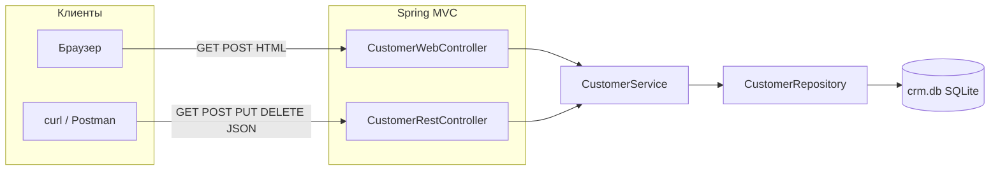

import ExternalCodeEmbed from '@site/src/components/ExternalCodeEmbed';


# Практикум Spring Boot — Simple CRM

<span class="complexity-badge">Разработчику</span>
<span class="complexity-badge">Начальный уровень</span>

---

## О практикуме

Соберём **Simple CRM** — учебное веб-приложение на **Spring Boot 3** с **SQLite**, **Thymeleaf** и **REST API**. Пользователь сможет просматривать клиентов в браузере, добавлять и редактировать записи, удалять строки; параллельно тот же набор операций доступен через JSON-эндпоинты для интеграций.

**CRM** (Customer Relationship Management) в нашем случае — компактный **справочник клиентов** с полями имя, email, телефон, компания и заметки. Такой сценарий встречается в реальных проектах как первый модуль внутренней админки или как учебный прототип перед подключением PostgreSQL и авторизации.

Стек проекта:

- **Spring Boot 3.4** — встроенный Tomcat, автонастройка, один JAR ([первая программа на Spring](./271.md), [обзор Spring](./27.md));
- **Spring Data JPA** + **Hibernate** — ORM, сущности, репозитории без ручного SQL ([JPA](./293.md), [работа с БД](./22.md));
- **SQLite** — файловая БД `crm.db`, без отдельного сервера СУБД ([SQLite в разделе SQL](/encyclopedia/3-data-markup/3-07-sql/887));
- **Thymeleaf** — серверный HTML, формы и таблица рендерятся на JVM;
- **Bean Validation** — декларативные правила `@NotBlank`, `@Email` на полях модели;
- **REST** — CRUD по `/api/customers`, JSON через Jackson, единый формат ошибок ([ошибки REST](./303.md), [HTTP и интеграции](/encyclopedia/2-system-network/2-09-osnovy-integracionnogo-vzaimodeystviya/118)).

<div class="callout callout--info">
  <div class="callout-title">Эталонный проект</div>

  <div class="callout-body">
  Готовый код для сверки — <code>F:\Projects\JVM\Java\SpringBootSimple</code>. Статья повторяет его структуру и содержимое файлов по этапам; после каждого шага можно сравнить diff с эталоном или запустить <code>mvn compile</code>.
  </div>
</div>

### Что такое Spring Boot в контексте этого проекта

**Spring Boot** — надстройка над [Spring Framework](./27.md). В классическом Spring вы вручную собираете контекст, XML или Java-конфигурацию, отдельно ставите Tomcat. Boot делает обратное — вы описываете классы с аннотациями, а **автоконфигурация** подключает DataSource, JPA, MVC, Jackson, если в classpath есть нужные стартеры.

Одна команда `mvn spring-boot:run`:

- компилирует проект;
- поднимает **встроенный Tomcat** на порту **8080**;
- сканирует пакет `com.example.crm` и создаёт **beans**;
- связывает зависимости через **DI** — внедрение в конструктор ([ООП и инкапсуляция](./18.md)).

Точка входа — обычный `public static void main` ([точка входа JVM](./40.md)). Это принципиально иной старт, чем у JSF WAR ([практикум "Список задач"](./252.md)), где приложение разворачивают в уже запущенном servlet-контейнере.

### Как запрос проходит через приложение

Один и тот же **сервисный слой** обслуживает и браузер, и API. Контроллеры — тонкие: они принимают HTTP, вызывают `CustomerService` и возвращают view или JSON.



В приложении четыре слоя:

| Слой | Роль в проекте | Файлы | Не должен знать о |
|------|----------------|-------|-------------------|
| **Model** | JPA-сущность, валидация полей | `Customer.java` | HTTP, URL, HTML |
| **Repository** | Чтение и запись в БД | `CustomerRepository.java` | бизнес-правила, JSON |
| **Service** | CRUD, транзакции, исключения | `CustomerService.java` | Thymeleaf, статусы HTTP |
| **Controller** | Маршруты HTML и JSON | `CustomerWebController`, `CustomerRestController` | SQL, детали Hibernate |

Веб-контроллер возвращает **имя шаблона** (`"customers/list"`) — Spring MVC передаёт его в Thymeleaf. REST-контроллер возвращает **объекты Java** — **Jackson** сериализует их в JSON в теле ответа.

### Ключевые термины

- **CRUD** — Create, Read, Update, Delete; четыре базовые операции над сущностью "клиент".
- **Bean** — объект, жизненным циклом которого управляет Spring-контейнер (`@Service`, `@Controller`, `@RestController`, `@Configuration`). Обычно один экземпляр на тип в рамках приложения ([аннотации Spring Boot](./304.md)).
- **Стартер** (`spring-boot-starter-web`) — Maven-зависимость, которая тянет согласованный набор библиотек; версии задаёт `spring-boot-starter-parent`.
- **JPA Entity** — класс, строка которого хранится в таблице БД; аннотации `@Entity`, `@Table`, `@Column` описывают маппинг объект ↔ SQL.
- **Repository** — интерфейс Spring Data; реализацию и SQL для `findById`, `save` генерирует фреймворк.
- **Query method** — метод репозитория с именем вроде `findAllByOrderByNameAsc`; Spring Data строит JPQL по конвенции имени.
- **`@Transactional`** — граница транзакции БД; либо все изменения коммитятся, либо откатываются при исключении.
- **DTO vs Entity** — здесь REST отдаёт ту же сущность `Customer`; в проде часто отделяют модель API от JPA ([паттерны проектирования](/encyclopedia/7-project/7-06-proektirovanie-i-arhitektura/design-patterns/intro)).
- **Thymeleaf** — шаблонизатор "natural templates": HTML валиден и без сервера; атрибуты `th:text`, `th:each`, `th:field` подставляют данные из `Model`.
- **Model** — контейнер атрибутов для view; контроллер кладёт `customers`, `customer`, `formTitle`.
- **Post-Redirect-Get (PRG)** — после успешного POST браузер перенаправляют GET-ом, чтобы F5 не повторял отправку формы.
- **Flash attribute** — одноразовое сообщение в сессии после redirect (например, "Клиент добавлен").
- **`@RestControllerAdvice`** — перехват исключений REST-слоя и ответ JSON вместо HTML-страницы ошибки.
- **Whitelabel Error Page** — стандартная страница Spring Boot при необработанном исключении; наш `RestExceptionHandler` заменяет её для API.

### Почему именно этот проект

- показывает **типичный корпоративный каркас** controller → service → repository — тот же, что в [лабораторном кейсе Spring Boot](/lab/Кейсы/4), но с веб-UI;
- **два фронта на одном сервисе** — браузер (HTML) и интеграции (JSON) без дублирования логики;
- **SQLite** — нулевая настройка инфраструктуры; файл `crm.db` рядом с JAR;
- **демо-данные** при первом запуске — сразу видно таблицу, не пустой экран;
- **валидация и обработка ошибок** — и в форме, и в REST;
- укладывается в **один–два вечера**, но архитектурно близок к реальным внутренним CRUD-сервисам.

**Предварительные знания:**

- JDK 17+, Maven 3.9+ ([первая программа на Java](./13.md), [структура и сборки](./12.md));
- классы, коллекции, исключения ([ООП](./18.md), [коллекции](./24.md), [исключения](./21.md));
- желательно — [первую программу на Spring Boot](./271.md) с простым REST без БД;
- для дат в сущности — [`java.time`](./28.md) (`LocalDateTime`).

### Что получится

Полный набор **CRUD** для сущности "клиент" — в браузере и через API.

| Действие | Веб (браузер) | REST API | HTTP-метод REST |
|----------|---------------|----------|-----------------|
| Список | `/customers` | `/api/customers` | GET |
| Один клиент | `/customers/{id}/edit` (форма) | `/api/customers/{id}` | GET |
| Создать | `/customers/new` → `POST /customers` | `POST /api/customers` | POST |
| Обновить | `POST /customers/{id}` | `PUT /api/customers/{id}` | PUT |
| Удалить | `POST /customers/{id}/delete` | `DELETE /api/customers/{id}` | DELETE |

Обратите внимание — в HTML удаление идёт через **POST** (ограничение форм в браузере), а в REST — через **DELETE**, как принято в API ([HTTP-методы](/encyclopedia/2-system-network/2-09-osnovy-integracionnogo-vzaimodeystviya/118)).

### Карта этапов

| Этап | Фокус | Результат |
|------|--------|-----------|
| [0](#stage-0) | Каркас Maven JAR | Пустая структура каталогов |
| [1](#stage-1) | `pom.xml` | Spring Boot, JPA, Thymeleaf, SQLite |
| [2](#stage-2) | `application.properties` | Подключение SQLite, порт 8080 |
| [3](#stage-3) | `CrmApplication` | Точка входа, `@SpringBootApplication` |
| [4](#stage-4) | `Customer` | JPA-сущность и валидация |
| [5](#stage-5) | `CustomerRepository` | Spring Data репозиторий |
| [6](#stage-6) | `CustomerService` | CRUD и транзакции |
| [7](#stage-7) | `CustomerRestController` | JSON API |
| [8](#stage-8) | `RestExceptionHandler` | 404 и ошибки валидации |
| [9](#stage-9) | `DataInitializer` | Демо-клиенты при первом запуске |
| [10](#stage-10) | `CustomerWebController` | Маршруты HTML |
| [11](#stage-11) | `list.html` | Таблица клиентов |
| [12](#stage-12) | `form.html` | Форма создания и редактирования |
| [13](#stage-13) | `style.css` | Оформление страниц |
| [14](#stage-14) | Запуск | `mvn spring-boot:run`, браузер и curl |

После каждого этапа имеет смысл **`mvn compile`** или полный запуск — привычка из [разработки и отладки](/encyclopedia/4-code-dev/4-14-razrabotka-i-otladka/intro). Не обязательно проходить все 15 этапов за один сеанс — логичные точки остановки — после **этапа 3** (пустой Boot), **7** (REST без UI), **10** (контроллеры без CSS), **14** (полный продукт).

<div class="callout callout--tip">
  <div class="callout-title">Два интерфейса — один сервис</div>

  <div class="callout-body">
  Веб и REST делят <code>CustomerService</code>. Если исправите логику обновления в сервисе — изменится и форма, и API. Так и задумано в слоистой архитектуре: HTTP-адаптеры тонкие, правила — в одном месте.
  </div>
</div>

---

<span id="stage-0"></span>
## Этап 0 — каркас проекта

**Цель этапа** — создать стандартную структуру **Spring Boot JAR**-проекта Maven.

В [структуре Java-проектов](./12.md) Maven разделяет **исходники**, **ресурсы** и **тесты**. Spring Boot по умолчанию собирает **executable JAR** (`java -jar`), а не WAR для внешнего Tomcat.

Отличие от [практикума JSF](./252.md):

- **WAR** — вы кладёте архив в уже установленный servlet-контейнер; точка входа — `web.xml` и сервлеты.
- **Boot JAR** — внутри лежит встроенный Tomcat; точка входа — `main` в `CrmApplication`.

Пакет **`com.example.crm`** — учебный префикс. В реальных проектах это обычно домен компании в обратном порядке (`ru.company.product`). Spring Boot сканирует **только пакет главного класса и вложенные** — поэтому все наши классы живут под `com.example.crm.*`.

Создайте корневую папку:

```bash
mkdir simple-crm && cd simple-crm
```

Каталоги (Windows PowerShell):

```powershell
New-Item -ItemType Directory -Force -Path `
  src/main/java/com/example/crm/config, `
  src/main/java/com/example/crm/controller, `
  src/main/java/com/example/crm/model, `
  src/main/java/com/example/crm/repository, `
  src/main/java/com/example/crm/service, `
  src/main/resources/static/css, `
  src/main/resources/templates/customers
```

Итоговая схема:

```text
simple-crm/
├── pom.xml
└── src/main/
    ├── java/com/example/crm/
    │   ├── CrmApplication.java
    │   ├── config/          ← DataInitializer, RestExceptionHandler
    │   ├── controller/      ← Web и REST
    │   ├── model/           ← Customer
    │   ├── repository/
    │   └── service/
    └── resources/
        ├── application.properties
        ├── static/css/
        │   └── style.css
        └── templates/customers/
            ├── list.html
            └── form.html
```

**Разбор структуры**

- **`src/main/java`** — компилируемый код; путь `com/example/crm/controller` = пакет `com.example.crm.controller` ([ООП, пакеты](./18.md)).
- **`src/main/resources`** — всё, что попадает в JAR "как есть" — properties, шаблоны, статика; не компилируется javac.
- **`config/`** — `@Configuration`, обработчики ошибок, инициализация данных; не HTTP-слой.
- **`controller/`** — только маппинг URL → вызов сервиса; без SQL и без разметки HTML в Java.
- **`static/`** — публичные файлы; URL `/css/style.css` → `classpath:/static/css/style.css`.
- **`templates/`** — Thymeleaf; возврат `"customers/list"` из контроллера → `templates/customers/list.html`.

На этом этапе `pom.xml` ещё нет — каталоги можно создать вручную или сгенерировать через [start.spring.io](https://start.spring.io/) (Dependencies: Web, JPA, Thymeleaf, Validation), затем сверить с этапом 1.

---

<span id="stage-1"></span>
## Этап 1 — `pom.xml`

**Цель этапа** — подключить **Spring Boot parent**, стартеры Web, Data JPA, Thymeleaf, Validation и драйвер **SQLite**.

**`pom.xml`** (Project Object Model) — сердце Maven-проекта ([структура и сборки](./12.md)). Блок `<parent>` с `spring-boot-starter-parent` даёт:

- **BOM** (Bill of Materials) — согласованные версии Hibernate, Jackson, Tomcat;
- настройки компилятора под `<java.version>17</java.version>`;
- defaults для `spring-boot-maven-plugin`.

Без parent пришлось бы вручную подбирать совместимые версии десятка библиотек.

Создайте `pom.xml` в корне проекта:


<ExternalCodeEmbed example="xml/java-503-254-001" title="Этап 1 — `pom.xml`" minHeight={720} />


**Разбор зависимостей**

| Зависимость | Что подтягивает транзитивно | Зачем в CRM |
|-------------|----------------------------|-------------|
| `spring-boot-starter-web` | Tomcat, Spring MVC, Jackson | REST + встроенный HTTP-сервер |
| `spring-boot-starter-data-jpa` | Hibernate, JDBC, транзакции | `Customer` ↔ таблица `customers` |
| `spring-boot-starter-thymeleaf` | Thymeleaf + интеграция с MVC | HTML-страницы списка и формы |
| `spring-boot-starter-validation` | Hibernate Validator | `@NotBlank` на имени, `@Email` |
| `sqlite-jdbc` | драйвер JDBC | файл `crm.db` без сервера БД |
| `hibernate-community-dialects` | `SQLiteDialect` | Hibernate 6 не включает SQLite в core |
| `spring-boot-starter-test` | JUnit 5, AssertJ, MockMvc | тесты API (следующий шаг после практикума) |

**Разбор ключевых элементов POM**

- **`<parent>` … `3.4.5`** — фиксирует линейку Spring Boot; при обновлении меняют одну версию.
- **`<artifactId>simple-crm</artifactId>`** — имя JAR: `target/simple-crm-1.0.0.jar`.
- **`spring-boot-maven-plugin`** — собирает **fat JAR** (все зависимости внутри) и цель `spring-boot:run`.
- **`<java.version>17</java.version>`** — LTS; Boot 3.x требует минимум Java 17 ([основы Java](./1.md)).

Проверка — Maven должен разрешить дерево зависимостей без ошибок:

```bash
mvn -q validate
mvn -q dependency:resolve
```

---

<span id="stage-2"></span>
## Этап 2 — `application.properties`

**Цель этапа** — указать порт, URL SQLite и параметры JPA/Thymeleaf.

Spring Boot читает **`application.properties`** из classpath при старте. Свойства вида `spring.datasource.*` и `spring.jpa.*` участвуют в **автоконфигурации** DataSource и EntityManagerFactory — отдельный `@Bean` для подключения к БД писать не нужно ([JPA](./293.md)).

Файл `src/main/resources/application.properties`:

```properties
spring.application.name=simple-crm

server.port=8080

spring.datasource.url=jdbc:sqlite:crm.db
spring.datasource.driver-class-name=org.sqlite.JDBC

spring.jpa.database-platform=org.hibernate.community.dialect.SQLiteDialect
spring.jpa.hibernate.ddl-auto=update
spring.jpa.show-sql=false

spring.thymeleaf.cache=false
```

**Разбор настроек**

| Свойство | Значение | Смысл |
|----------|----------|-------|
| `spring.application.name` | `simple-crm` | имя в логах и Actuator (если подключите позже) |
| `server.port` | `8080` | HTTP-порт встроенного Tomcat; занят — смените на `8081` |
| `spring.datasource.url` | `jdbc:sqlite:crm.db` | относительный путь: файл рядом с процессом JVM |
| `spring.datasource.driver-class-name` | `org.sqlite.JDBC` | класс драйвера из `sqlite-jdbc` |
| `spring.jpa.database-platform` | `SQLiteDialect` | как Hibernate генерирует DDL и SQL |
| `spring.jpa.hibernate.ddl-auto` | `update` | создать/дополнить таблицы по `@Entity`; **не** для prod без миграций |
| `spring.jpa.show-sql` | `false` | при `true` SQL виден в консоли — удобно на этапе 4 |
| `spring.thymeleaf.cache` | `false` | в dev шаблоны не кешируются; в prod обычно `true` |

**Значения `ddl-auto` (справочно)**

- `create-drop` — пересоздаёт схему при каждом старте, удаляет при остановке (только тесты).
- `update` — добавляет таблицы/колонки, **не удаляет** лишнее (учебный режим).
- `validate` — только проверка схемы; для prod с Flyway/Liquibase.

<div class="callout callout--tip">
  <div class="callout-title">SQLite в учебном проекте</div>

  <div class="callout-body">
  Для production чаще PostgreSQL или MySQL — см. <a href="./273.md">Testcontainers</a> и <a href="./22.md">работу с БД</a>. SQLite здесь — нулевая настройка: один файл, без сервера. Ограничение — один писатель в момент времени; для CRM на десятках пользователей это не модель prod.
  </div>
</div>

---

<span id="stage-3"></span>
## Этап 3 — `CrmApplication.java`

**Цель этапа** — точка входа и включение автонастройки Spring Boot.

Класс в **корневом пакете** `com.example.crm` — важно для component scan. Если бы `CrmApplication` лежал в `com.example`, а контроллеры в `com.other.app`, Spring их **не увидел** бы без `@ComponentScan`.

`src/main/java/com/example/crm/CrmApplication.java`:

```java
package com.example.crm;

import org.springframework.boot.SpringApplication;
import org.springframework.boot.autoconfigure.SpringBootApplication;

@SpringBootApplication
public class CrmApplication {

    public static void main(String[] args) {
        SpringApplication.run(CrmApplication.class, args);
    }
}
```

**Разбор аннотации `@SpringBootApplication`**

- **`@Configuration`** — класс может объявлять `@Bean` (как `DataInitializer` на этапе 9).
- **`@EnableAutoConfiguration`** — включает автонастройку по classpath (видит JPA → настраивает DataSource).
- **`@ComponentScan`** — ищет `@Service`, `@Controller`, `@Repository` в текущем пакете и ниже.

**Что делает `SpringApplication.run`**

1. Создаёт **ApplicationContext** — контейнер beans.
2. Запускает автоконфигурацию (Tomcat, JPA, Thymeleaf).
3. Поднимает встроенный Tomcat на `server.port`.
4. Вызывает `CommandLineRunner` beans после готовности контекста.

На этом этапе приложение **запустится**, но ответит **404** на все URL — контроллеров ещё нет. В логе должны быть строки про `Tomcat started on port 8080` и `Started CrmApplication`.

```bash
mvn spring-boot:run
```

Остановка — `Ctrl+C`. Первый запуск скачает зависимости Maven — это нормально ([первая программа](./13.md)).

---

<span id="stage-4"></span>
## Этап 4 — сущность `Customer`

**Цель этапа** — описать таблицу `customers` и правила валидации полей.

**JPA** (Java Persistence API) — стандарт ORM на JVM. **Hibernate** — реализация, которую использует Spring Data JPA. Класс с `@Entity` — **сущность**, строка которой синхронизируется с таблицей.

Один класс `Customer` выполняет три роли:

- **модель БД** — колонки через `@Column`;
- **модель формы** — Thymeleaf `th:field` биндит поля;
- **модель JSON** — Jackson сериализует в REST.

В production часто разделяют Entity и DTO; для учебного CRM допустимо объединение.

`src/main/java/com/example/crm/model/Customer.java`:


<ExternalCodeEmbed example="java/java-503-254-002" title="Этап 4 — сущность `Customer`" minHeight={720} />


**Разбор полей и аннотаций**

| Элемент | Назначение |
|---------|------------|
| `@Entity` | класс участвует в persistence context Hibernate |
| `@Table(name = "customers")` | имя таблицы; без аннотации было бы `customer` |
| `@Id` + `@GeneratedValue(IDENTITY)` | первичный ключ; SQLite autoincrement |
| `@NotBlank` на `name` | пустая строка и пробелы — ошибка валидации |
| `@Email` | формат email; пустое значение допустимо (не `@NotBlank`) |
| `@Size(max = …)` | ограничение длины; согласовано с `@Column(length)` |
| `@Column(nullable = false)` | NOT NULL в DDL для `name`, timestamps |
| `LocalDateTime` | [`java.time`](./28.md); Hibernate 6 маппит в SQLite TEXT/NUMERIC |
| `@PrePersist` / `@PreUpdate` | колбэки **жизненного цикла** entity перед INSERT/UPDATE |

**Почему геттеры и сеттеры обязательны**

- **JPA/Hibernate** — доступ к полям через свойства JavaBean ([JavaBeans](./26.md));
- **Thymeleaf** `th:field="*{name}"` — вызывает `getName` / `setName`;
- **Jackson** при десериализации JSON — `setName`, при сериализации — `getName`.

**Поведение при старте**

После перезапуска в рабочей директории появится **`crm.db`**. Hibernate выполнит `CREATE TABLE IF NOT EXISTS customers (...)`. Таблица пока пуста — данные добавит `DataInitializer` на этапе 9.

---

<span id="stage-5"></span>
## Этап 5 — `CustomerRepository`

**Цель этапа** — слой доступа к данным без SQL вручную.

**Spring Data JPA** генерирует реализацию интерфейса в runtime — вы пишете только сигнатуру. Это сокращает шаблонный JDBC-код из [работы с БД](./22.md) — `Connection`, `PreparedStatement`, маппинг `ResultSet` в объект.

`src/main/java/com/example/crm/repository/CustomerRepository.java`:

```java
package com.example.crm.repository;

import com.example.crm.model.Customer;
import org.springframework.data.jpa.repository.JpaRepository;

import java.util.List;

public interface CustomerRepository extends JpaRepository<Customer, Long> {

    List<Customer> findAllByOrderByNameAsc();
}
```

**Разбор интерфейса**

- **`JpaRepository<Customer, Long>`** — generic: сущность `Customer`, тип id `Long`.
- Унаследованные методы — `save`, `findById`, `findAll`, `deleteById`, `existsById`, `count` — готовы без объявления.
- **`findAllByOrderByNameAsc`** — **query method**; Spring Data парсит имя → `ORDER BY name ASC` ([JPA](./293.md)).
- Spring создаёт **proxy**-реализацию и регистрирует bean; `@Service` получит его через конструктор.

**Конвенция имен query methods (фрагменты)**

- `find…By…` — выборка;
- `…OrderBy…Asc/Desc` — сортировка;
- `countBy…` — агрегация (используем `count()` из базового интерфейса).

Если имя метода некорректно — ошибка при **старте** контекста, не при первом запросе.

---

<span id="stage-6"></span>
## Этап 6 — `CustomerService` и исключение

**Цель этапа** — бизнес-логика CRUD и единая точка для веб- и REST-контроллеров.

**Сервисный слой** — место для правил предметной области — "нельзя создать клиента с чужим id", "обновление только существующей записи", единый `CustomerNotFoundException`. Контроллеры остаются **тонкими** — только HTTP и маппинг DTO/view ([паттерн слоёв](/encyclopedia/7-project/7-06-proektirovanie-i-arhitektura/design-patterns/intro)).

Сначала доменное исключение `src/main/java/com/example/crm/service/CustomerNotFoundException.java`:

```java
package com.example.crm.service;

public class CustomerNotFoundException extends RuntimeException {

    public CustomerNotFoundException(Long id) {
        super("Customer not found: " + id);
    }
}
```

Затем сервис `src/main/java/com/example/crm/service/CustomerService.java`:


<ExternalCodeEmbed example="java/java-503-254-003" title="Этап 6 — `CustomerService` и исключение" minHeight={720} />


**Разбор `CustomerNotFoundException`**

- Наследник **`RuntimeException`** — не обязан объявляться в `throws` ([исключения](./21.md)).
- Сообщение `"Customer not found: " + id` попадёт в JSON ответа на этапе 8.
- Отдельный тип исключения позволяет `@ExceptionHandler` отличить 404 от других ошибок.

**Разбор `CustomerService`**

| Элемент | Зачем |
|---------|-------|
| `@Service` | стереотип `@Component` для бизнес-логики ([аннотации Boot](./304.md)) |
| Конструктор с `CustomerRepository` | **constructor injection** — зависимости явные, поля `final` |
| `@Transactional` на классе | запись по умолчанию в транзакции |
| `@Transactional(readOnly = true)` на чтении | hint Hibernate: без flush, оптимизация |
| `orElseThrow` в `findById` | `Optional` → исключение вместо `null` |
| `customer.setId(null)` в `create` | защита от подстановки id из JSON/формы |
| `update` копирует поля в **managed** entity | `createdAt` не затирается с формы |

**Поток `update`**

1. `findById` загружает строку из БД в persistence context.
2. Сеттеры меняют поля managed-объекта.
3. `@PreUpdate` обновляет `updatedAt`.
4. При коммите транзакции Hibernate выполняет `UPDATE`.

---

<span id="stage-7"></span>
## Этап 7 — `CustomerRestController`

**Цель этапа** — REST API с JSON-телом и корректными HTTP-статусами.

**REST** (Representational State Transfer) здесь — ресурс `/api/customers`, операции через HTTP-методы, тело **JSON**. Клиент — `curl`, Postman, фронт на React или другой сервис ([HTTP](/encyclopedia/2-system-network/2-09-osnovy-integracionnogo-vzaimodeystviya/118)).

Контроллер **не содержит** SQL и не решает, что такое "клиент не найден" — только делегирует в `CustomerService`.

`src/main/java/com/example/crm/controller/CustomerRestController.java`:


<ExternalCodeEmbed example="java/java-503-254-004" title="Этап 7 — `CustomerRestController`" minHeight={720} />


**Разбор маппингов**

| Метод HTTP | Путь | Действие | Статус ответа |
|------------|------|----------|---------------|
| GET | `/api/customers` | список | 200 OK |
| GET | `/api/customers/{id}` | один клиент | 200 или 404 через advice |
| POST | `/api/customers` | создание | **201 Created** |
| PUT | `/api/customers/{id}` | обновление | 200 OK |
| DELETE | `/api/customers/{id}` | удаление | **204 No Content** |

**Разбор аннотаций**

- **`@RestController`** — `@Controller` + `@ResponseBody` на каждом методе; возврат `Customer` → JSON в теле.
- **`@RequestMapping("/api/customers")`** — общий префикс; версионирование API часто дают `/api/v1/...`.
- **`@PathVariable Long id`** — сегмент URL `{id}` → параметр метода.
- **`@RequestBody`** — Jackson десериализует JSON в `Customer`.
- **`@Valid`** — запускает Bean Validation **до** входа в метод; при ошибке — `MethodArgumentNotValidException`.
- **`@ResponseStatus(HttpStatus.CREATED)`** — POST возвращает 201, не 200.

**Пример тела JSON для POST/PUT**

```json
{
  "name": "Иван Сидоров",
  "email": "ivan@example.com",
  "phone": "+7 900 000-00-00",
  "company": "ООО Бета",
  "notes": "Новый лид"
}
```

Поля `id`, `createdAt`, `updatedAt` можно не передавать при создании — сервис и JPA заполнят их сами.

Проверка после этапа 9 (когда есть демо-данные):

```bash
curl -s http://localhost:8080/api/customers
```

---

<span id="stage-8"></span>
## Этап 8 — `RestExceptionHandler`

**Цель этапа** — единый JSON при 404 и ошибках валидации вместо HTML Whitelabel ([ошибки REST](./303.md)).

Без обработчика необработанное `CustomerNotFoundException` дало бы **500 Internal Server Error** и HTML-страницу — неприемлемо для API-клиентов. **`@RestControllerAdvice`** перехватывает исключения из `@RestController` и формирует `ResponseEntity` с нужным статусом.

`src/main/java/com/example/crm/config/RestExceptionHandler.java`:


<ExternalCodeEmbed example="java/java-503-254-005" title="Этап 8 — `RestExceptionHandler`" minHeight={720} />


**Разбор методов обработки**

| Обработчик | Исключение | HTTP | Тело ответа |
|------------|------------|------|-------------|
| `handleNotFound` | `CustomerNotFoundException` | 404 | `{"error":"Customer not found: 99"}` |
| `handleValidation` | `MethodArgumentNotValidException` | 400 | `error` + `fields` с ошибками по полям |

**Детали реализации**

- **`Collectors.toMap`** собирает ошибки полей; merge-функция `(first, second) -> first` — на случай дубликатов ключей.
- **`LinkedHashMap`** сохраняет порядок полей в JSON — удобно читать в логах.
- Веб-контроллер **не** использует этот advice — там ошибки показываются в форме через `BindingResult` и `th:errors`.

**Проверка 404**

```bash
curl -s -w "\nHTTP %{http_code}\n" http://localhost:8080/api/customers/9999
```

**Проверка 400** — POST с пустым именем:

```bash
curl -s -X POST http://localhost:8080/api/customers -H "Content-Type: application/json" -d "{\"name\":\"\"}"
```

---

<span id="stage-9"></span>
## Этап 9 — `DataInitializer`

**Цель этапа** — два демо-клиента при первом запуске, если таблица пуста.

Пустая таблица после этапа 4 неудобна для проверки UI. **`CommandLineRunner`** — функциональный интерфейс с методом `run(String... args)`, вызываемым Spring **после** готовности контекста, но **до** приёма HTTP-запросов.

`src/main/java/com/example/crm/config/DataInitializer.java`:


<ExternalCodeEmbed example="java/java-503-254-006" title="Этап 9 — `DataInitializer`" minHeight={720} />


**Разбор `DataInitializer`**

- **`@Configuration`** — класс источник bean-определений.
- **`@Bean CommandLineRunner`** — Spring регистрирует лямбду как bean; можно несколько runner'ов с `@Order`.
- **`customerRepository.count() > 0`** — идемпотентность: второй запуск не дублирует Алису и Бориса.
- **`save`** вместо `customerService.create` — seed напрямую в репозиторий; для демо допустимо, в prod — через сервис.
- **`@PrePersist`** на `Customer` проставит `createdAt`/`updatedAt` при insert.

**Альтернативы seed-данных**

- `data.sql` в resources + `spring.sql.init.mode=always` — чистый SQL;
- Flyway/Liquibase — миграции с INSERT для prod;
- фикстуры только в `@SpringBootTest` ([JUnit](./291.md)).

Перезапустите приложение и проверьте API:

```bash
curl -s http://localhost:8080/api/customers
```

В JSON должны быть два объекта — **Алиса Иванова** и **Борис Петров**.

---

<span id="stage-10"></span>
## Этап 10 — `CustomerWebController`

**Цель этапа** — HTML-маршруты, список, формы, redirect после POST.

**Spring MVC** для браузера — классический **Model-View-Controller**:

- **Model** — `Customer`, список `customers` в `Model`;
- **View** — Thymeleaf `list.html` / `form.html`;
- **Controller** — `CustomerWebController`, маппинг URL.

Отличие от REST в том же проекте: здесь **`@Controller`**, методы возвращают **строку** — имя view или `redirect:...`, а не JSON.

`src/main/java/com/example/crm/controller/CustomerWebController.java`:


<ExternalCodeEmbed example="java/java-503-254-007" title="Этап 10 — `CustomerWebController`" minHeight={720} />


**Разбор маршрутов**

| URL | Метод | Метод контроллера | Результат |
|-----|-------|-------------------|-----------|
| `/` | GET | `home()` | redirect на `/customers` |
| `/customers` | GET | `list()` | таблица |
| `/customers/new` | GET | `createForm()` | пустая форма |
| `/customers` | POST | `create()` | сохранение или форма с ошибками |
| `/customers/{id}/edit` | GET | `editForm()` | форма с данными |
| `/customers/{id}` | POST | `update()` | обновление |
| `/customers/{id}/delete` | POST | `delete()` | удаление |

**Разбор ключевых приёмов**

- **`Model model`** — контейнер атрибутов для Thymeleaf; `addAttribute("customers", …)` → `${customers}` в HTML.
- **`@ModelAttribute("customer")`** — биндинг полей формы к объекту `Customer` из request parameters.
- **`BindingResult`** — сразу после `@Valid` модели; `hasErrors()` → вернуть форму без сохранения.
- **`return "customers/form"`** — ViewResolver → `templates/customers/form.html`.
- **Post-Redirect-Get** — `redirect:/customers` после успеха; браузер делает GET, F5 не дублирует POST.
- **`RedirectAttributes.addFlashAttribute("message", …)`** — flash в HTTP-сессии на один следующий запрос.
- **Удаление через POST** — HTML `<form method="post">` не умеет DELETE; REST-слой использует `DELETE` для API.

**Почему два POST-маппинга не конфликтуют**

- `POST /customers` — создание (нет `{id}` в пути).
- `POST /customers/{id}` — обновление существующего.
- `POST /customers/{id}/delete` — отдельный суффикс `/delete` для удаления.

---

<span id="stage-11"></span>
## Этап 11 — шаблон `list.html`

**Цель этапа** — таблица клиентов, пустое состояние, кнопки "Изменить" и "Удалить".

Thymeleaf — **серверный** рендеринг: JVM собирает HTML и отдаёт готовую страницу. Браузер не вызывает API за JSON — данные уже в разметке. Для SPA позже останется только REST-слой ([первая программа Spring](./271.md) — только JSON).

`src/main/resources/templates/customers/list.html`:


<ExternalCodeEmbed example="html/java-503-254-008" title="Этап 11 — шаблон `list.html`" minHeight={720} />


**Разбор Thymeleaf по блокам**

| Конструкция | Что делает |
|-------------|------------|
| `xmlns:th="http://www.thymeleaf.org"` | включает атрибуты `th:*` в HTML |
| `th:href="@{/css/style.css}"` | URL статики с учётом context path |
| `th:if="${message}"` | блок виден только при flash-сообщении |
| `th:if="${#lists.isEmpty(customers)}"` | пустое состояние без записей |
| `th:each="customer : ${customers}"` | итерация по списку из `Model` |
| `th:text="${customer.name}"` | экранированный текст в ячейке |
| `th:text="${customer.email ?: '—'}"` | Elvis — `null`/пусто → прочерк |
| `@{/customers/{id}/edit(id=${customer.id})}` | URL с подстановкой id |
| `<form method="post">` на удаление | отдельная форма на строку; `onsubmit` confirm |

**Natural templates**

Внутри тегов оставлен fallback-текст (`Name`, `email`) — файл можно открыть в браузере **без сервера** и увидеть вёрстку; при рендере Thymeleaf подставит данные.

Откройте [http://localhost:8080/customers](http://localhost:8080/customers) — таблица с демо-клиентами (стили подключатся на этапе 13).

---

<span id="stage-12"></span>
## Этап 12 — шаблон `form.html`

**Цель этапа** — одна форма для создания и редактирования с привязкой полей и ошибками валидации.

Контроллер передаёт **`formTitle`** и **`formAction`** — шаблон универсален. При создании action = `/customers`, при редактировании = `/customers/3`. Это уменьшает дублирование разметки по сравнению с двумя отдельными `.html`.

`src/main/resources/templates/customers/form.html`:


<ExternalCodeEmbed example="html/java-503-254-009" title="Этап 12 — шаблон `form.html`" minHeight={720} />


**Разбор формы**

- **`th:object="${customer}"`** — выбранный объект для `*{…}` селекторов.
- **`th:field="*{name}"`** — генерирует `name="name"`, `id`, `value` из свойства; двусторонний биндинг при POST.
- **`<input type="hidden" th:field="*{id}">`** — при edit передаёт id; при create поле пустое.
- **`th:errors="*{name}"`** — вывод сообщения Bean Validation рядом с полем.
- **`#fields.hasErrors('name')`** — условие показа блока ошибки.

**Сценарий валидации в браузере**

1. Пользователь отправляет форму с пустым именем.
2. `@Valid` + `@NotBlank` → `BindingResult.hasErrors() == true`.
3. Контроллер снова возвращает `customers/form` **без redirect**.
4. Thymeleaf показывает красный текст ошибки у поля "Имя".

Проверьте [http://localhost:8080/customers/new](http://localhost:8080/customers/new) — пустое имя должно оставить вас на форме с сообщением об ошибке.

---

<span id="stage-13"></span>
## Этап 13 — `style.css`

**Цель этапа** — оформление списка, формы и адаптивная таблица на узких экранах.

Spring Boot по соглашению раздаёт **`src/main/resources/static`** как корень веб-статики. Ссылка `th:href="@{/css/style.css}"` в шаблоне → файл `static/css/style.css`. Отдельный `WebMvcConfigurer` не нужен.

`src/main/resources/static/css/style.css`:


<ExternalCodeEmbed example="css/java-503-254-010" title="Этап 13 — `style.css`" minHeight={720} />


**Разбор CSS (основные идеи)**

- **CSS-переменные** в `:root` — единая палитра; смена `--primary` перекрашивает кнопки.
- **`.card` + `.table`** — карточка-контейнер для таблицы клиентов.
- **`.btn-primary` / `.btn-danger`** — визуальная иерархия действий.
- **`.alert-success`** — зелёный блок для flash `message`.
- **`@media (max-width: 768px)`** — таблица превращается в карточки строк на мобильном.

Проверьте прямую ссылку [http://localhost:8080/css/style.css](http://localhost:8080/css/style.css) — должен вернуться текст CSS, не 404.

---

<span id="stage-14"></span>
## Этап 14 — запуск и проверка

**Цель этапа** — убедиться, что JAR собирается, веб-интерфейс и REST работают вместе, а сценарии CRUD проходят с обеих сторон.

Полный цикл сборки и старта:

```bash
mvn clean package
mvn spring-boot:run
```

Приложение: [http://localhost:8080/](http://localhost:8080/) → редирект на `/customers`.

### Чек-лист веб-интерфейса

1. `/customers` — таблица с **Алисой** и **Борисом** (демо-данные из `DataInitializer`).
2. Кнопка "+ Добавить" → форма; **пустое имя** → ошибка валидации у поля, остаётесь на форме.
3. Новый клиент → зелёное сообщение "Клиент добавлен", строка появляется в таблице.
4. "Изменить" → правка полей → "Клиент обновлён".
5. "Удалить" → `confirm` в браузере → "Клиент удалён", строка исчезает.
6. **F5** на списке после redirect — запись **не** дублируется (Post-Redirect-Get).
7. Пустая БД (удалите `crm.db` и перезапустите) → блок "Пока нет клиентов" с кнопкой добавления.

### Чек-лист REST API

```bash
curl -s http://localhost:8080/api/customers
```

```bash
curl -s http://localhost:8080/api/customers/1
```

Создание клиента:

```bash
curl -X POST http://localhost:8080/api/customers ^
  -H "Content-Type: application/json" ^
  -d "{\"name\":\"Иван Сидоров\",\"email\":\"ivan@example.com\",\"phone\":\"+7 900 000-00-00\",\"company\":\"ООО Бета\",\"notes\":\"Новый лид\"}"
```

На Linux/macOS замените `^` на `\` для переноса строк.

Обновление (подставьте свой `id`):

```bash
curl -X PUT http://localhost:8080/api/customers/3 ^
  -H "Content-Type: application/json" ^
  -d "{\"name\":\"Иван Сидоров\",\"email\":\"ivan@example.com\",\"phone\":\"+7 900 000-00-01\",\"company\":\"ООО Бета\",\"notes\":\"Обновлено\"}"
```

Удаление:

```bash
curl -X DELETE http://localhost:8080/api/customers/3
```

Ошибка 404:

```bash
curl -s http://localhost:8080/api/customers/9999
```

### Запуск JAR без Maven

```bash
java -jar target/simple-crm-1.0.0.jar
```

Файл `crm.db` создаётся в каталоге, откуда запущен процесс — не внутри JAR. Для переноса на другой компьютер копируют и JAR, и `crm.db` (или настраивают внешнюю БД).

### Ожидаемые фрагменты ответов

**GET `/api/customers`** — массив JSON, у каждого объекта есть `id`, `name`, `email`, `createdAt` (ISO-8601).

**POST с пустым `name`** — HTTP 400, тело вида:

```json
{
  "error": "Validation failed",
  "fields": {
    "name": "must not be blank"
  }
}
```

**DELETE успешный** — HTTP 204, тело пустое.

<div class="callout callout--tip">
  <div class="callout-title">Отладка в IDE</div>

  <div class="callout-body">
  Импортируйте Maven-проект в IntelliJ IDEA, запустите <code>CrmApplication</code> и поставьте breakpoint в <code>CustomerService.create()</code>. Общие приёмы — <a href="./132.md">Отладка Java-кода в IDE</a>.
  </div>
</div>

---

## Частые ошибки

| Симптом | Вероятная причина | Что проверить |
|---------|-------------------|---------------|
| `Failed to configure a DataSource` | нет драйвера или неверный JDBC URL | `sqlite-jdbc`, `application.properties` |
| `SQLiteDialect` not found | нет `hibernate-community-dialects` | `pom.xml`, этап 1 |
| `Port 8080 was already in use` | порт занят другим процессом | остановите старый `spring-boot:run`, смените `server.port` |
| 404 на `/customers` | нет шаблона или опечатка в `return` | `templates/customers/list.html`, строка `customers/list` |
| Whitelabel Error Page на REST | контроллер вне component scan | пакет `com.example.crm.*`, главный класс в корне |
| Пустой список без демо-данных | `crm.db` уже существовал пустым | удалить `crm.db`, перезапустить |
| Демо-клиенты дублируются | убрали проверку `count() > 0` | `DataInitializer`, этап 9 |
| Стили не грузятся | файл не в `static/` | `src/main/resources/static/css/style.css` |
| `Validation failed` в JSON | пустое `name` или неверный `email` | тело запроса, аннотации на `Customer` |
| Форма без ошибок при пустом имени | нет `@Valid` или `BindingResult` не рядом с моделью | `CustomerWebController.create` |
| `crm.db` не там, где ждёте | относительный путь SQLite | каталог запуска `java -jar` = место файла БД |
| Кракозябры в curl Windows | кодировка консоли | UTF-8 в терминале или Postman |

---

## Куда развивать дальше

Собранный каркас — база для типичного backend на Spring:

- **PostgreSQL + Testcontainers** — реальная СУБД и интеграционные тесты без ручного Docker ([Testcontainers — интеграционные тесты с реальной БД](./273.md), [SQLite → PostgreSQL](/encyclopedia/3-data-markup/3-07-sql/888)).
- **Spring Security** — Basic Auth, роли, закрытие `/api` ([Spring Security — практический старт](./272.md), [безопасность в prod](./275.md)).
- **JWT** — stateless API для SPA и мобильных клиентов ([JWT и OAuth2 Resource Server в Spring Boot](./274.md)).
- **DTO и MapStruct** — не отдавать JPA-сущность напрямую; скрыть `createdAt` или внутренние поля.
- **Пагинация и поиск** — `Pageable`, `findByNameContainingIgnoreCase` в репозитории.
- **OpenAPI / springdoc** — интерактивная документация Swagger UI для `/api/customers`.
- **MockMvc-тесты** — `@WebMvcTest` для контроллеров, `@DataJpaTest` для репозитория ([JUnit](./291.md)).
- **Фронт на React/Vue** — оставить REST, UI вынести в отдельный проект; CORS и JWT по мере необходимости.

---

## Связанные статьи

**Spring и веб**

- [Первая программа на Spring Framework](./271.md) — DI, минимальный REST, `mvn spring-boot:run`
- [Spring Framework — обзор](./27.md) — модули экосистемы
- [Аннотации Spring Boot](./304.md) — `@SpringBootApplication`, стереотипы слоёв

**Данные и ошибки**

- [Hibernate и JPA — практический старт](./293.md) — сущности, репозитории, транзакции
- [Работа с БД в Java](./22.md) — JDBC и связка с JPA
- [Ошибки REST — @Valid и @ControllerAdvice](./303.md) — единый формат ошибок API

**База Java и инструменты**

- [Структура и сборки Java-проектов](./12.md) — Maven, JAR, каталоги
- [Первая программа на Java](./13.md) — JDK, Maven, IDE
- [ООП в Java](./18.md) — классы, инкапсуляция, JavaBean-свойства
- [Исключения в Java](./21.md) — checked vs unchecked, `RuntimeException`
- [`java.time`](./28.md) — `LocalDateTime` в сущности
- [Отладка Java-кода в IDE](./132.md) — breakpoint в `CustomerService`

**Смежные практикумы и HTTP**

- [Практикум JSF — "Список задач"](./252.md) — серверный UI другим стеком (legacy)
- [HTTP как основа веб-интеграций](/encyclopedia/2-system-network/2-09-osnovy-integracionnogo-vzaimodeystviya/118) — методы, статусы, тело запроса

---

{/* sidebar-collections */}

**Spring Boot и веб на Java** — [Первая программа на Spring](./271.md), [Практикум Simple CRM](./254.md), [Spring Security](./272.md), [Hibernate и JPA](./293.md), [Ошибки REST](./303.md).

{/* /sidebar-collections */}
