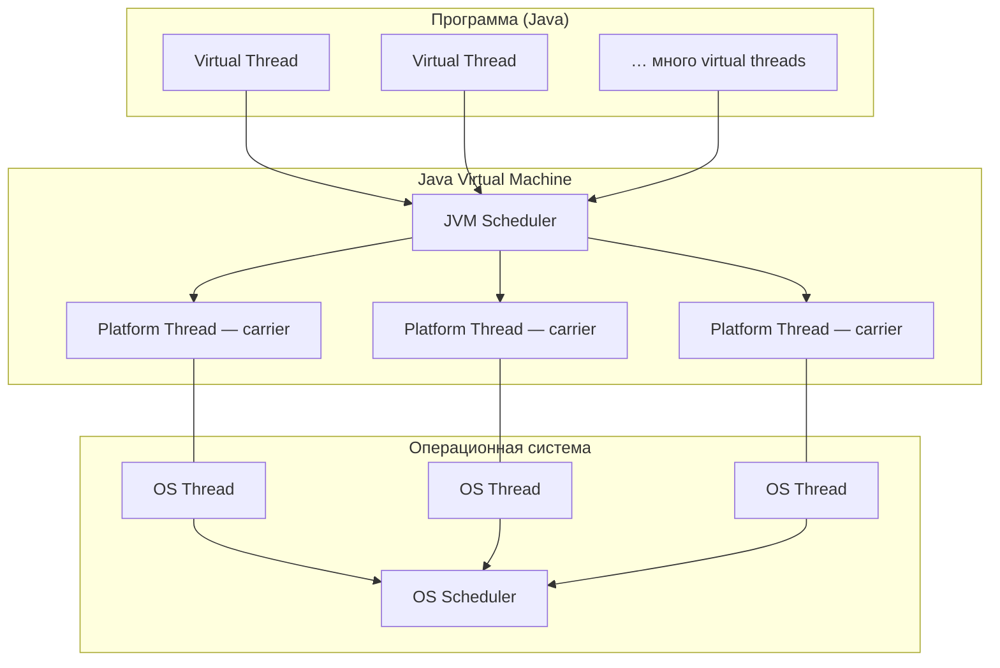

# Virtual Threads в Java (Java 21+)

<div class="article-tags">
  <span class="tag tag-required">ОБЯЗАТЕЛЬНО</span>
  <span class="tag tag-beginner">ДЛЯ НОВИЧКОВ</span>
</div>

<span class="complexity-badge">Разработчику</span>
<span class="complexity-badge">Архитектору</span>

---

## Virtual Threads (Project Loom)

**Виртуальные потоки** (*virtual threads*, Project Loom) стабилизированы в **Java 21 (LTS)**. Они позволяют запускать огромное количество задач параллельно с минимальными накладными расходами по сравнению с обычными потоками ОС.

Исторический контекст — в [истории Java](./11.md). Практический выбор между `ExecutorService`, `CompletableFuture` и virtual threads — в [асинхронности](./298.md). Краткая шпаргалка API — в [справочнике](./3.md#31-virtual-threads--api-дополнение).

Общая теория процессов и потоков — [процессы и потоки](/encyclopedia/4-code-dev/4-05-asinhronnost/1); там же virtual threads упомянуты как лёгкие сущности **над** потоками ядра.

---

### Зачем они появились

Классический `java.lang.Thread` — это **platform thread** (поток платформы): обёртка над **нативным потоком ОС**. На каждый такой поток уходит заметный стек (порядка мегабайта) и слот в планировщике ядра. Модель «один HTTP-запрос — один `Thread`» упирается в тысячи соединений, а не в миллионы.

Виртуальный поток — **лёгкая задача**, которую создаёт и планирует **JVM**, а не операционная система. Типичный сценарий — массовый **блокирующий I/O** (HTTP, JDBC, файлы): код остаётся синхронным (`read`, `sleep`, JDBC), а масштабирование достигается за счёт дешёвого создания потоков и умного переключения при ожидании.

| | Platform thread | Virtual thread |
|---|-----------------|----------------|
| Кто создаёт | JVM → поток ОС | JVM (continuations) |
| Память на поток | ~1 МБ стека (типично) | Килобайты |
| Планировщик | ОС + JVM | **JVM Scheduler** поверх небольшого пула carriers |
| Лучше всего для | CPU-bound, legacy, `synchronized` без pinning | Много одновременных блокирующих I/O |
| С Java | 1.0 | **21+** (стабильно) |

Virtual threads **не ускоряют** чистые вычисления на CPU: для них по-прежнему нужен ограниченный пул platform threads или `ForkJoinPool`.

---

### Три уровня — как это устроено

Виртуальные потоки создаются в **прикладном коде** (`Thread.ofVirtual()`, `Executors.newVirtualThreadPerTaskExecutor()`). Дальше работа идёт в три слоя:



1. **Virtual Thread** — единица работы в коде (запрос, задача, соединение). Их может быть сотни тысяч и больше.
2. **Platform Thread (carrier)** — «носитель»: реальный поток JVM, на котором **в данный момент** выполняется виртуальный поток. Пул carriers обычно сопоставим с числом ядер или чуть больше.
3. **OS Thread** — то, что видит ядро Linux, Windows или macOS. Связь platform thread ↔ OS thread **1:1**.

Связь virtual ↔ platform — **M:N** (много виртуальных на несколько carriers). ОС **не знает** о virtual threads: для планировщика ядра существуют только OS threads.

---

### Mount и unmount при блокировке

Пока виртуальный поток **выполняется** на carrier, он в состоянии **mounted** (смонтирован).

При **блокирующей** операции (сокет, диск, `Thread.sleep`, большинство JDBC) JVM может **размонтировать** (*unmount*) virtual thread с carrier и отдать carrier другому virtual thread. Первый поток ждёт I/O «в стороне», не занимая поток ОС.

Когда I/O завершился, scheduler снова **монтирует** (*mount*) virtual thread на свободный carrier. Именно поэтому десятки тысяч «спящих» запросов не превращаются в десятки тысяч потоков ядра.

<div class="callout callout--warning">
  <div class="callout-title">Pinning</div>

  <div class="callout-body">
  Долгий блокирующий код внутри <code>synchronized</code> на virtual thread может <strong>закрепить</strong> поток на carrier (<em>pinning</em>) и снизить выигрыш. Для нового кода предпочтительны <code>ReentrantLock</code> и короткие критические секции. Подробности — в JEP и release notes Java 21.
  </div>
</div>

---

### API — минимальный набор

**Executor на каждую задачу** (типично для сервисов):

```java
try (var executor = Executors.newVirtualThreadPerTaskExecutor()) {
    IntStream.range(0, 10_000).forEach(i ->
        executor.submit(() -> handleRequest(i))
    );
}
```

**Один поток без пула**:

```java
Thread.startVirtualThread(() -> process(connection));
```

**Явное создание**:

```java
Thread vt = Thread.ofVirtual().name("worker-", 0).start(() -> doWork());
```

Разбор построчно и сравнение с `CompletableFuture` — в [асинхронности](./298.md#virtual-threads-java-21).

---

### Когда выбирать virtual threads

| Сценарий | Рекомендация |
|----------|----------------|
| Массовый блокирующий I/O (REST, JDBC, файлы) | virtual threads |
| CPU-bound расчёты | фиксированный пул platform threads |
| Смешанный сервис | отдельные пулы I/O и CPU + таймауты |
| End-to-end reactive стек | WebFlux / Project Reactor — [Spring](./27.md) |

**Spring Boot 3.2+** — флаг `spring.threads.virtual.enabled=true` на совместимом стеке (Tomcat, часть библиотек).

---

### Эксплуатация

- **Таймауты** на все внешние вызовы (`orTimeout`, HTTP client timeouts).
- **Метрики** p95/p99, размер очередей, thread dump под нагрузкой — [диагностика JVM](./302.md).
- **Graceful shutdown** — `executor.close()` / `shutdown()` при остановке контейнера.
- Не смешивайте без нужды reactive и blocking-модели в одном запросе.

---

### Сравнение с корутинами Kotlin

В Kotlin похожую модель дают [корутины](/encyclopedia/5-languages/5-09-kotlin/222.md): лёгкие задачи и cooperative scheduling. Virtual threads ближе к **привычным потокам** (`Thread`, stack traces, отладчики) без переписывания всего API на `suspend`. На JVM 21+ можно комбинировать оба подхода в одном проекте, но для Java-кода virtual threads — стандартный путь масштабирования blocking I/O.

---

### Дальше

[Асинхронность](./298.md) · [JVM и потоки](./23.md) · [Справочник — virtual threads](./3.md#31-virtual-threads--api-дополнение) · [История Loom](./11.md) · [dev.java — Virtual Threads](https://dev.java/learn/new-features/virtual-threads/)

---

{/* http-basics-link  */}
<div class="callout callout--tip">
  <div class="callout-title">Основа по протоколу</div>

  <div class="callout-body">
  Базовый разбор HTTP и HTTPS находится в отдельной статье — <a href="/encyclopedia/2-system-network/2-09-osnovy-integratsionnogo-vzaimodeystviya/118">HTTP как основа веб-интеграций</a>.
</div>
  </div>

{/* /http-basics-link  */}
