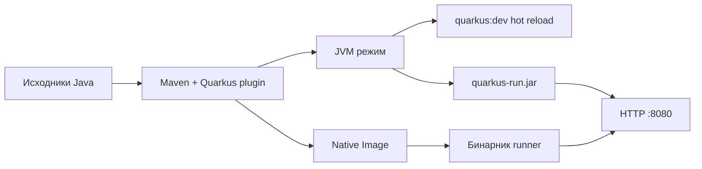
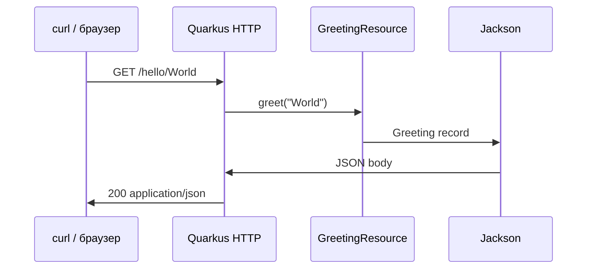

# Quarkus — первая программа

<div class="article-tags">
  <span class="tag tag-required">ОБЯЗАТЕЛЬНО</span>
  <span class="tag tag-beginner">ДЛЯ НОВИЧКОВ</span>
</div>

<span class="complexity-badge">Разработчику</span>
<span class="complexity-badge">Архитектору</span>

---

Для читателей, которые уже прошли [первую программу на Java](./13.md) и базовое [ООП](./18.md). **Quarkus** — фреймворк для [JVM](/encyclopedia/4-code-dev/4-02-chto-takoe-kod-i-kak-on-rabotaet/618) и **GraalVM Native Image**: быстрый старт процесса, низкое потребление памяти, удобный **dev-режим** с hot reload.

Практикум идёт **по шагам** — генерация проекта, REST-ресурс, dev-режим, конфигурация, упаковка JAR, опционально native-сборка и учебный CRUD "Заметки".

| Шаг | Тема | Зачем |
|-----|------|-------|
| 0 | JDK, Maven wrapper | Убедиться, что среда готова |
| 1 | code.quarkus.io | Скелет проекта с extensions |
| 2 | REST-ресурс | HTTP GET и JSON-ответ |
| 3 | `./mvnw quarkus:dev` | Hot reload без полного рестарта |
| 4 | `application.properties` | Порт, профили, логи |
| 5 | `./mvnw package` | Fast-jar для деплоя |
| 6 | `-Pnative` | Бинарник без отдельной JVM (опционально) |
| 7 | CRUD "Заметки" | Закрепить REST на in-memory store |

| Материал | Зачем |
|----------|-------|
| [Maven и Gradle в Java](./12.md) | Структура `pom.xml`, wrapper |
| [Records в Java](./312.md) | Компактные DTO для JSON |
| [REST API — теория](/encyclopedia/4-code-dev/4-17-veb-razrabotka/2) | Методы HTTP, коды ответов |
| [Micronaut — первая программа](./310.md) | Другой cloud-native стек на JVM |
| [Virtual Threads](./308.md) | Параллельные запросы на Java 21+ |
| [Экосистема Java](./110.md) | Обзор фреймворков |

### Навигация по разделу Java

- Вы здесь: [Quarkus — первая программа](./309.md)
- База: [Первая программа на Java](./13.md), [Структура и сборки](./12.md)
- Соседний фреймворк: [Micronaut — первая программа](./310.md)
- Модели данных: [Records в Java — практическое руководство](./312.md)
- Spring-маршрут: [Spring Boot](./271.md)

| Термин | Значение |
|--------|----------|
| **Quarkus** | Java-фреймворк от Red Hat (Jakarta EE + MicroProfile) |
| **Extension** | Модуль зависимостей (`resteasy-reactive`, `jdbc`, …) |
| **Dev mode** | `./mvnw quarkus:dev` — перезагрузка при изменении кода |
| **Native image** | Бинарник без отдельной JVM (опционально) |
| **Fast-jar** | Layout `quarkus-run.jar` + `lib/` + `app/` |



<div class="callout callout--tip">
  <div class="callout-title">Редактор и терминал</div>

  <div class="callout-body">
  Команды удобно выполнять во вкладке <strong>Терминал</strong> VS Code (<code>Ctrl+`</code>) или во встроенном терминале IntelliJ IDEA. Отладка — <a href="/encyclopedia/4-code-dev/4-14-razrabotka-i-otladka/111">статья "Отладка"</a>, настройка Java — <a href="/encyclopedia/5-languages/5-03-java/103">IntelliJ IDEA</a>.
</div>
</div>

---

## Шаг 0 — проверка окружения

| Компонент | Версия |
|-----------|--------|
| JDK | 17+ (рекомендуется 21 LTS) |
| Maven | В проекте есть `mvnw` wrapper — отдельная установка не обязательна |
| IDE | IntelliJ IDEA / VS Code + Extension Pack for Java |

Проверка в терминале:

```bash
java -version
./mvnw -v
```

Разбор:

- `java -version` показывает версию JDK. Для новых Quarkus-проектов берите **17** или **21 LTS**.
- `./mvnw -v` проверяет Maven wrapper — он скачает нужную версию Maven при первом запуске.
- На Windows используйте `mvnw.cmd` вместо `./mvnw`, если shell не понимает `./`.

<div class="callout callout--info">
  <div class="callout-title">JDK и JVM</div>

  <div class="callout-body">
  Общая теория — <a href="/encyclopedia/4-code-dev/4-03-vypolnenie-koda/314">байт-код и виртуальные машины</a>, <a href="/encyclopedia/5-languages/5-03-java/1">основы языка Java</a>. Quarkus работает поверх JVM; native-сборка компилирует приложение заранее через GraalVM.
</div>
</div>

Создайте рабочую папку, например `projects`, и откройте её в редакторе — дальше все команды выполняются из каталога распакованного проекта.

---

## Шаг 1 — генерация проекта

Откройте [code.quarkus.io](https://code.quarkus.io) — онлайн-генератор с выбором extensions.

1. **Group:** `com.example`
2. **Artifact:** `hello-quarkus`
3. **Build tool:** Maven (или Gradle — команды ниже для Maven)
4. **Extensions:** RESTEasy Reactive, REST Jackson (JSON)
5. Нажмите **Generate your application** → скачайте ZIP
6. Распакуйте архив и откройте каталог в IDE

Структура после распаковки:

```text
hello-quarkus/
  src/
    main/
      java/com/example/
      resources/
    test/java/com/example/
  pom.xml
  mvnw
  mvnw.cmd
  README.md
```

Разбор каталогов:

- `src/main/java` — исходники приложения; пакет `com.example` совпадает с Group/Artifact на генераторе.
- `src/main/resources` — конфигурация (`application.properties`), статика.
- `src/test/java` — модульные и интеграционные тесты.
- `pom.xml` — зависимости и Quarkus Maven plugin.
- `mvnw` / `mvnw.cmd` — wrapper, фиксирует версию Maven для команды.

Подробнее про Maven — [структура проектов Java](./12.md).

<div class="callout callout--warning">
  <div class="callout-title">Extensions выбирайте сразу</div>

  <div class="callout-body">
  Extension добавляет зависимости и автоконфигурацию. Без <code>rest-jackson</code> JSON-ответы могут не сериализоваться. После изменения <code>pom.xml</code> в dev-режиме нужен полный рестарт <code>quarkus:dev</code>.
</div>
</div>

### Что Quarkus добавляет в pom.xml

Типичные блоки (сокращённо):

```xml
<properties>
  <quarkus.platform.version>3.x.x</quarkus.platform.version>
</properties>

<dependencies>
  <dependency>
    <groupId>io.quarkus</groupId>
    <artifactId>quarkus-resteasy-reactive-jackson</artifactId>
  </dependency>
</dependencies>

<build>
  <plugins>
    <plugin>
      <groupId>io.quarkus.platform</groupId>
      <artifactId>quarkus-maven-plugin</artifactId>
    </plugin>
  </plugins>
</build>
```

Разбор:

- Версия платформы Quarkus задаётся одним property — все extensions согласованы.
- `quarkus-maven-plugin` обрабатывает dev-режим, сборку и native-профиль.
- BOM (Bill of Materials) в `dependencyManagement` фиксирует совместимые версии библиотек.

---

## Шаг 2 — REST-ресурс

Создайте файл `src/main/java/com/example/GreetingResource.java`:

```java
package com.example;

import jakarta.ws.rs.GET;
import jakarta.ws.rs.Path;
import jakarta.ws.rs.Produces;
import jakarta.ws.rs.core.MediaType;

@Path("/hello")
public class GreetingResource {

    @GET
    @Produces(MediaType.TEXT_PLAIN)
    public String hello() {
        return "Hello from Quarkus";
    }

    @GET
    @Path("/{name}")
    @Produces(MediaType.APPLICATION_JSON)
    public Greeting greet(String name) {
        return new Greeting("Привет, " + name + "!");
    }

    public record Greeting(String message) {}
}
```

Разбор построчно:

- `@Path("/hello")` — JAX-RS аннотация: префикс URL для всех методов класса.
- `@GET` — обработчик HTTP GET.
- `@Produces(MediaType.TEXT_PLAIN)` — ответ в виде обычного текста.
- `@Path("/{name}")` на втором методе — path-параметр; Quarkus передаёт его в аргумент `name`.
- `@Produces(MediaType.APPLICATION_JSON)` — Jackson сериализует объект в JSON.
- `record Greeting` — компактная модель ответа ([Records в Java](./312.md)).

### Как запрос доходит до метода



Теория REST — [REST API](/encyclopedia/4-code-dev/4-17-veb-razrabotka/2), [HTTP как основа веб-интеграций](/encyclopedia/2-system-network/2-09-osnovy-integratsionnogo-vzaimodeystviya/118).

### Валидация path-параметра (опционально)

Для учебного API можно отклонять пустые имена:

```java
@GET
@Path("/{name}")
@Produces(MediaType.APPLICATION_JSON)
public Greeting greet(@jakarta.ws.rs.PathParam("name") String name) {
    if (name == null || name.isBlank()) {
        throw new jakarta.ws.rs.BadRequestException("Имя не может быть пустым");
    }
    return new Greeting("Привет, " + name.trim() + "!");
}
```

Разбор:

- `@PathParam("name")` явно связывает сегмент URL с параметром.
- `BadRequestException` даёт HTTP **400** — см. таблицу кодов в [REST API](/encyclopedia/4-code-dev/4-17-veb-razrabotka/2).

---

## Шаг 3 — dev-режим

Из корня проекта:

```bash
./mvnw quarkus:dev
```

Windows:

```bash
mvnw.cmd quarkus:dev
```

Первый запуск скачивает зависимости — это нормально. В консоли появится строка вроде `Listening on: http://0.0.0.0:8080`.

| URL | Ожидаемый ответ |
|-----|-----------------|
| `http://localhost:8080/hello` | `Hello from Quarkus` (текст) |
| `http://localhost:8080/hello/Аня` | `{"message":"Привет, Аня!"}` |

Проверка через curl:

```bash
curl http://localhost:8080/hello
curl http://localhost:8080/hello/World
curl -i http://localhost:8080/hello/World
```

Разбор curl:

- Без `-i` печатается только тело ответа.
- С `-i` видны заголовки — `Content-Type: application/json` для второго запроса.
- `Connection refused` — сервер не запущен или другой порт.

### Hot reload

1. Оставьте `quarkus:dev` работать.
2. Измените строку в методе `hello()`, например на `"Привет из Quarkus"`.
3. Сохраните файл — Quarkus перезагрузит класс **без полного рестарта** JVM.
4. Повторите `curl` — текст изменится.

<div class="callout callout--info">
  <div class="callout-title">Dev UI</div>

  <div class="callout-body">
  Если на code.quarkus.io добавлен extension <strong>quarkus-dev-ui</strong>, откройте <code>http://localhost:8080/q/dev/</code> — список эндпоинтов, конфигурация, health. Без extension страница может быть недоступна.
</div>
</div>

Остановка dev-сервера — `Ctrl+C` в терминале.

---

## Шаг 4 — конфигурация

Файл `src/main/resources/application.properties`:

```properties
quarkus.http.port=8080
quarkus.application.name=hello-quarkus
quarkus.log.console.enable=true
quarkus.log.console.format=%d{HH:mm:ss} %-5p [%c{2.}] (%t) %s%e%n
```

Разбор:

- `quarkus.http.port` — порт HTTP-сервера (по умолчанию 8080).
- `quarkus.application.name` — имя в логах и метриках.
- Формат лога настраивается отдельно для dev и prod.

### Профили

Quarkus поддерживает профили `%dev`, `%test`, `%prod`:

```properties
%dev.quarkus.log.console.enable=true
%dev.quarkus.http.port=8080

%prod.quarkus.log.console.enable=false
%prod.quarkus.http.port=8080
```

Активация prod-профиля при запуске JAR:

```bash
java -jar target/quarkus-app/quarkus-run.jar -Dquarkus.profile=prod
```

Переменные окружения с префиксом `QUARKUS_` переопределяют properties:

```bash
export QUARKUS_HTTP_PORT=9090
./mvnw quarkus:dev
```

Конфигурации приложений — [конфигурации и данные](/encyclopedia/3-data-markup/3-04-konfiguratsii-i-dannye/intro), [переменные окружения](/encyclopedia/3-data-markup/3-04-konfiguratsii-i-dannye/98).

---

## Шаг 5 — упаковка JAR

Сборка production-артефакта:

```bash
./mvnw package
```

Запуск:

```bash
java -jar target/quarkus-app/quarkus-run.jar
```

Quarkus собирает **fast-jar** layout:

```text
target/quarkus-app/
  quarkus-run.jar    # точка входа
  lib/               # зависимости
  app/               # ваш код и resources
  quarkus/           # метаданные Quarkus
```

Разбор:

- `quarkus-run.jar` — тонкий launcher; основной код в `app/`.
- Такой layout быстрее стартует, чем один fat-jar со всем внутри.
- Для Docker часто копируют весь каталог `quarkus-app/`.

Проверка после запуска:

```bash
curl http://localhost:8080/hello
```

<div class="callout callout--warning">
  <div class="callout-title">Production</div>

  <div class="callout-body">
  Для боевого сервера — process manager (systemd, Kubernetes), секреты в переменных окружения, HTTPS за reverse proxy (Nginx, Caddy). Пример прокси — <a href="/lab/Примеры/11112">Nginx — конфиги под задачу</a>.
</div>
</div>

---

## Шаг 6 — native-сборка (опционально)

Требуется GraalVM или **Mandrel** (дистрибутив Red Hat):

```bash
./mvnw package -Pnative
./target/hello-quarkus-1.0.0-SNAPSHOT-runner
```

Разбор:

- Профиль `-Pnative` запускает компиляцию Native Image — процесс **долгий** (минуты).
- Итог — один исполняемый файл без отдельной JVM на сервере.
- Cold start — миллисекунды; RAM ниже, чем у JVM-режима.

| Режим | Плюс | Минус |
|-------|------|-------|
| JVM (`quarkus:dev`, `quarkus-run.jar`) | Быстрая разработка, полная совместимость reflection | Нужна JVM на сервере, выше RAM |
| Native | Быстрый cold start, меньше RAM | Долгая сборка, ограничения reflection и dynamic class loading |

Для учебного REST достаточно JVM-режима. Native имеет смысл в serverless (AWS Lambda, Knative) и контейнерах с жёстким лимитом памяти.

---

## Шаг 7 — учебный REST API "Заметки"

Расширим проект до минимального CRUD в памяти — тот же сценарий, что в [первой программе на Node.js](/encyclopedia/5-languages/5-01-javascript/3-ecosystem/1-runtime-node/262) и [Gin](/encyclopedia/5-languages/5-10-go/2412.md).

### Что получится

| Метод | Путь | Действие |
|-------|------|----------|
| GET | `/notes` | Список заметок |
| POST | `/notes` | Создать заметку (JSON) |
| DELETE | `/notes/{id}` | Удалить по id |
| GET | `/health` | Сервер жив |

### Record для заметки

```java
package com.example;

public record Note(long id, String text) {}
```

### Сервис in-memory

```java
package com.example;

import jakarta.enterprise.context.ApplicationScoped;
import java.util.ArrayList;
import java.util.List;
import java.util.Optional;
import java.util.concurrent.atomic.AtomicLong;

@ApplicationScoped
public class NoteStore {

    private final AtomicLong seq = new AtomicLong(1);
    private final List<Note> notes = new ArrayList<>();

    public List<Note> findAll() {
        return List.copyOf(notes);
    }

    public Note add(String text) {
        if (text == null || text.isBlank()) {
            throw new IllegalArgumentException("text пустой");
        }
        Note note = new Note(seq.getAndIncrement(), text.trim());
        notes.add(note);
        return note;
    }

    public boolean delete(long id) {
        return notes.removeIf(n -> n.id() == id);
    }

    public Optional<Note> findById(long id) {
        return notes.stream().filter(n -> n.id() == id).findFirst();
    }
}
```

Разбор:

- `@ApplicationScoped` — один экземпляр на приложение (CDI).
- `AtomicLong` выдаёт уникальные id без блокировок в учебном примере.
- `List.copyOf` возвращает неизменяемую копию наружу.

### REST-ресурс

```java
package com.example;

import jakarta.inject.Inject;
import jakarta.ws.rs.*;
import jakarta.ws.rs.core.MediaType;
import jakarta.ws.rs.core.Response;
import java.util.List;

@Path("/notes")
@Produces(MediaType.APPLICATION_JSON)
@Consumes(MediaType.APPLICATION_JSON)
public class NoteResource {

    @Inject
    NoteStore store;

    @GET
    public List<Note> list() {
        return store.findAll();
    }

    @POST
    public Response create(CreateNoteRequest body) {
        try {
            Note created = store.add(body.text());
            return Response.status(Response.Status.CREATED).entity(created).build();
        } catch (IllegalArgumentException ex) {
            return Response.status(Response.Status.BAD_REQUEST)
                .entity(new ErrorBody(ex.getMessage()))
                .build();
        }
    }

    @DELETE
    @Path("/{id}")
    public Response delete(@PathParam("id") long id) {
        if (store.delete(id)) {
            return Response.noContent().build();
        }
        return Response.status(Response.Status.NOT_FOUND)
            .entity(new ErrorBody("id не найден"))
            .build();
    }

    public record CreateNoteRequest(String text) {}
    public record ErrorBody(String error) {}
}
```

### Health-check

```java
package com.example;

import jakarta.ws.rs.GET;
import jakarta.ws.rs.Path;
import jakarta.ws.rs.Produces;
import jakarta.ws.rs.core.MediaType;

@Path("/health")
public class HealthResource {

    @GET
    @Produces(MediaType.TEXT_PLAIN)
    public String ok() {
        return "ok";
    }
}
```

### Проверка curl

```bash
curl http://localhost:8080/health
curl http://localhost:8080/notes
curl -X POST http://localhost:8080/notes \
  -H "Content-Type: application/json" \
  -d "{\"text\": \"Изучить Quarkus\"}"
curl http://localhost:8080/notes
curl -X DELETE http://localhost:8080/notes/1
curl http://localhost:8080/notes
```

Разбор кодов:

- **201 Created** — заметка создана, тело содержит объект с `id`.
- **204 No Content** — успешное DELETE без тела.
- **400** — пустой `text`.
- **404** — id не существует.

Данные в памяти теряются при перезапуске — для persistence подключите JDBC и Panache ([Hibernate и JPA](./293.md)).

---

## Типичные ошибки и troubleshooting

| Симптом | Причина | Что сделать |
|---------|---------|-------------|
| Port 8080 busy | Другой сервис на порту | `quarkus.http.port=8081` в properties |
| 404 на `/hello` | Неверный `@Path` или класс вне сканирования | Пакет `com.example`, аннотации на классе и методах |
| JSON не сериализуется | Нет Jackson extension | Добавьте `rest-jackson` на code.quarkus.io |
| Dev mode не перезагружает | Редактировали `pom.xml` | Полный рестарт `quarkus:dev` |
| `Connection refused` | Сервер не запущен | `./mvnw quarkus:dev` или `java -jar ...` |
| Пустой POST body | Нет `@Consumes(APPLICATION_JSON)` | Добавьте аннотацию на ресурс или метод |
| `java` не найден | JDK не в PATH | Переустановить JDK — [первая программа](./13.md) |
| Native build failed | Нет GraalVM/Mandrel | Установить Mandrel или собирать только JVM |
| Кириллица в JSON | Кодировка терминала | UTF-8 в IDE и терминале |

<div class="callout callout--tip">
  <div class="callout-title">Логи dev-режима</div>

  <div class="callout-body">
  При 404 Quarkus печатает зарегистрированные маршруты при старте. Ищите строки <code>Registered JAX-RS resource</code> — там список путей.
</div>
</div>

---

## Упражнения

1. Добавьте `GET /hello/{name}/formal` — JSON с полем `formal: true` и текстом «Уважаемый(ая), `{name}`!».
2. Расширьте `Note` полем `createdAt` типа `Instant` — сериализация в ISO-8601.
3. Напишите тест `GreetingResourceTest` с `@QuarkusTest` — проверка `/hello` через REST Assured.
4. Вынесите порт в переменную окружения и запустите два экземпляра на разных портах.
5. Добавьте extension `quarkus-smallrye-openapi` — откройте Swagger UI на `/q/swagger-ui`.

<details>
<summary>Подсказка к упражнению 3</summary>

```java
import io.quarkus.test.junit.QuarkusTest;
import org.junit.jupiter.api.Test;

import static io.restassured.RestAssured.given;
import static org.hamcrest.CoreMatchers.is;

@QuarkusTest
class GreetingResourceTest {

    @Test
    void testHello() {
        given()
          .when().get("/hello")
          .then()
             .statusCode(200)
             .body(is("Hello from Quarkus"));
    }
}
```

Запуск: `./mvnw test`. JUnit — [тестирование в Java](./26.md).

</details>

---

## FAQ

**Quarkus заменяет Spring Boot?**

Нет. Это альтернативный стек на Jakarta EE и MicroProfile. Spring остаётся самым распространённым выбором в enterprise — см. [Spring Boot](./271.md). Quarkus выбирают за dev-опыт, native и низкое потребление памяти.

**Нужен ли Spring для Quarkus?**

Нет. Quarkus использует CDI (Contexts and Dependency Injection), JAX-RS, Hibernate через свои extensions.

**Можно ли писать на Kotlin?**

Да. На code.quarkus.io выберите Kotlin как язык — структура та же.

**Чем Quarkus отличается от Micronaut?**

Оба ориентированы на cloud-native и native image. Quarkus теснее связан с экосистемой Red Hat и Jakarta EE; Micronaut делает акцент на compile-time DI — см. [Micronaut — первая программа](./310.md).

**Когда собирать native?**

Когда важны cold start и RAM (Kubernetes scale-to-zero, serverless). Для локальной разработки достаточно JVM.

**Где хранить секреты?**

Не в `application.properties` в git. Используйте переменные окружения или vault — [конфигурации и данные](/encyclopedia/3-data-markup/3-04-konfiguratsii-i-dannye/98).

---

## Как превратить учебный API в рабочий сервис

### План эволюции

1. In-memory store для отладки маршрутов (вы здесь).
2. Подключение PostgreSQL через `quarkus-jdbc-postgresql` и Panache.
3. Миграции Flyway или Liquibase.
4. Единый формат ошибок и валидация Bean Validation (`@NotBlank`).
5. Тесты `@QuarkusTest` + Testcontainers ([Testcontainers](./273.md)).
6. Метрики Micrometer, health SmallRye, логи в JSON.

### Базовые контракты API

| Эндпоинт | Успех | Ошибка клиента | Ошибка сервера |
|---|---|---|---|
| `GET /notes` | `200` + массив | — | `500` |
| `POST /notes` | `201` + объект | `400` при пустом `text` | `500` |
| `DELETE /notes/{id}` | `204` | `404`, если id не найден | `500` |

---

## Шаг 8 — тесты с @QuarkusTest

Quarkus интегрируется с JUnit 5 и REST Assured. Файл `src/test/java/com/example/GreetingResourceTest.java`:

```java
package com.example;

import io.quarkus.test.junit.QuarkusTest;
import org.junit.jupiter.api.Test;

import static io.restassured.RestAssured.given;
import static org.hamcrest.CoreMatchers.*;

@QuarkusTest
class GreetingResourceTest {

    @Test
    void helloPlainText() {
        given()
          .when().get("/hello")
          .then()
             .statusCode(200)
             .contentType("text/plain")
             .body(is("Hello from Quarkus"));
    }

    @Test
    void helloJsonWithName() {
        given()
          .when().get("/hello/Quarkus")
          .then()
             .statusCode(200)
             .contentType("application/json")
             .body("message", containsString("Quarkus"));
    }
}
```

Запуск:

```bash
./mvnw test
```

Разбор:

- `@QuarkusTest` поднимает приложение на random port — REST Assured ходит in-process.
- Отдельный `@QuarkusIntegrationTest` использует упакованный артеfact — ближе к prod.
- Тесты для `NoteResource` проверяют цепочку POST → GET → DELETE.

Тестирование — [JUnit в Java](./26.md), [разработка и отладка](/encyclopedia/4-code-dev/4-14-razrabotka-i-otladka/111).

### Таблица сценариев NoteResourceTest

| Тест | Запрос | Ожидание |
|------|--------|----------|
| listEmpty | GET /notes | 200, `[]` |
| createOk | POST body | 201, id в JSON |
| createBad | POST `{}` | 400 |
| deleteOk | DELETE /notes/1 | 204 |
| deleteMissing | DELETE /notes/999 | 404 |

---

## Шаг 9 — OpenAPI и документация API

На [code.quarkus.io](https://code.quarkus.io) добавьте extension **SmallRye OpenAPI**.

После перезапуска dev-режима:

| URL | Содержимое |
|-----|------------|
| `/q/openapi` | Спецификация YAML/JSON |
| `/q/swagger-ui` | Интерактивная документация |

Аннотации на ресурсе (опционально):

```java
import org.eclipse.microprofile.openapi.annotations.Operation;
import org.eclipse.microprofile.openapi.annotations.responses.APIResponse;

@GET
@Operation(summary = "Список заметок")
@APIResponse(responseCode = "200", description = "OK")
public List<Note> list() { ... }
```

Теория контрактов — [REST API](/encyclopedia/4-code-dev/4-17-veb-razrabotka/2).

---

## Шаг 10 — Docker и деплой

### JVM-образ (упрощённо)

`src/main/docker/Dockerfile.jvm` часто генерируется Quarkus. Сборка:

```bash
./mvnw package
docker build -f src/main/docker/Dockerfile.jvm -t hello-quarkus-jvm .
docker run -i --rm -p 8080:8080 hello-quarkus-jvm
```

Проверка:

```bash
curl http://localhost:8080/health
```

Разбор:

- В образ копируется каталог `quarkus-app/`, не один fat-jar.
- Переменные окружения `QUARKUS_HTTP_PORT` работают так же, как локально.
- Для Kubernetes добавьте liveness probe на `/health` — [контейнеры и оркестрация](/encyclopedia/8-infra-security/8-01-konteynery-i-orkestratsiya/intro).

### Native-образ

С профилем native и `Dockerfile.native` cold start минимален — подходит для scale-to-zero. Сборка дольше — используйте CI cache.

<div class="callout callout--info">
  <div class="callout-title">Секреты в Docker</div>

  <div class="callout-body">
  Не копируйте пароли БД в образ. Передавайте через secrets Kubernetes или переменные окружения runtime — <a href="/encyclopedia/3-data-markup/3-04-konfiguratsii-i-dannye/98">конфигурации и данные</a>.
</div>
</div>

---

## Шаг 11 — health, metrics и логи

Extension **SmallRye Health** добавляет:

| Endpoint | Назначение |
|----------|------------|
| `/q/health/live` | Процесс жив |
| `/q/health/ready` | Готов принимать трафик |

Extension **Micrometer** экспортирует метрики Prometheus на `/q/metrics`.

Структурированные логи в prod — JSON через `quarkus.log.console.json=true` в профиле `%prod`.

Мониторинг в проде — [логирование и observability](/encyclopedia/8-infra-security/8-03-monitoring-i-logirovanie/intro).

---

## Quarkus и Spring Boot — ориентиры выбора

| Критерий | Quarkus | Spring Boot |
|----------|---------|-------------|
| Стандарты | Jakarta EE, JAX-RS, CDI | Spring собственный стек |
| Dev experience | quarkus:dev, Dev UI | spring-boot-devtools |
| Экосystem | Red Hat, KNative | Широчайшая база вакансий |
| Native | Зрелая поддержка | Spring Native / AOT |

Spring остаётся default во многих компаниях — [Spring Boot](./271.md). Quarkus выбирают за память, native и dev-режим.

---

## Работа в IntelliJ IDEA

1. **File → Open** — каталог проекта с `pom.xml`.
2. Дождитесь индексации Maven.
3. Run Configuration: Maven goal `quarkus:dev`.
4. Breakpoint в `GreetingResource` — Debug вместо Run.

Подробнее — [IntelliJ IDEA для Java](./103.md), [отладка в IDEA](./132.md).

---

## Gradle-команды (если выбрали Gradle на генераторе)

| Maven | Gradle |
|-------|--------|
| `./mvnw quarkus:dev` | `./gradlew quarkusDev` |
| `./mvnw package` | `./gradlew build` |
| `./mvnw test` | `./gradlew test` |
| `-Pnative` | `-Dquarkus.package.type=native` |

Структура `src/main/java` та же — [Maven и Gradle](./12.md).

---

## Virtual Threads (Java 21+) в Quarkus

Quarkus 3.x поддерживает virtual threads для REST:

```properties
quarkus.virtual-threads.enabled=true
```

Подробнее — [Virtual Threads в Java](./308.md), [JVM и потоки](./23.md). Для учебного REST достаточно platform threads; virtual threads помогают при большом числе одновременных блокирующих запросов к БД.

---

## Расширенный troubleshooting

| Симптом | Причина | Что сделать |
|---------|---------|-------------|
| `BUILD FAILURE` compile | JDK 11 в PATH | Переключить на JDK 17+ |
| CORS в браузере | Фронт на другом порту | Extension `quarkus-http-cors` |
| Hibernate schema error | Нет БД | URL JDBC в `%dev` или Testcontainers |
| OutOfMemory dev | Много extensions | Убрать лишние из pom |
| Тест flaky | Порт занят | `@QuarkusTest` random port |
| Кириллица в curl Windows | Кодировка консоли | `chcp 65001` или PowerShell UTF-8 |

### Диагностика 404

1. Откройте лог старта — список `Registered endpoints`.
2. Проверьте `@ApplicationPath` если меняли JAX-RS prefix.
3. Убедитесь, что класс в `src/main/java`, не в `test`.

---

## Дополнительные упражнения

6. Подключите `quarkus-resteasy-reactive-qute` — HTML-страница `/hello-page` с шаблоном.
7. Добавьте фильтр `ContainerRequestFilter` — логировать method + path каждого запроса.
8. Сохраните заметки в файл JSON при shutdown через `@PreDestroy` в `NoteStore` (учебный persistence).
9. Настройте GitHub Actions — workflow `mvnw test` на push.
10. Сравните время старта JVM JAR и native binary — `time` в терминале.

---

## Расширенный FAQ

**Работает ли Quarkus с Kotlin?**

Да — выберите Kotlin на code.quarkus.io. Синтаксис ресурсов тот же через JAX-RS аннотации.

**Нужен ли application server типа WildFly?**

Нет. Quarkus embeds HTTP (Vert.x / RESTEasy Reactive) — standalone JAR.

**Как версионировать API?**

Префикс `/v1/notes` или header `Accept-Version` — см. [версионирование REST](/encyclopedia/4-code-dev/4-17-veb-razrabotka/2).

**Panache vs чистый JPA?**

Panache сокращает boilerplate репозиториев — [Hibernate и JPA](./293.md).

**Где смотреть примеры Red Hat?**

Репозиторий [quarkus-quickstarts](https://github.com/quarkusio/quarkus-quickstarts) на GitHub.

---

## Каталог популярных extensions

| Extension | Назначение |
|-----------|------------|
| `quarkus-resteasy-reactive-jackson` | REST + JSON |
| `quarkus-hibernate-orm-panache` | JPA без boilerplate |
| `quarkus-jdbc-postgresql` | PostgreSQL datasource |
| `quarkus-flyway` | Миграции схемы |
| `quarkus-smallrye-openapi` | Swagger / OpenAPI |
| `quarkus-smallrye-health` | Liveness / readiness |
| `quarkus-micrometer-registry-prometheus` | Метрики |
| `quarkus-oidc` | OpenID Connect auth |
| `quarkus-redis-client` | Кэш и pub/sub |
| `quarkus-scheduler` | Cron-задачи |

Добавление extension в существующий проект:

```bash
./mvnw quarkus:add-extension -Dextensions="jdbc-postgresql,hibernate-orm-panache"
```

Или через [code.quarkus.io](https://code.quarkus.io) — regenerate pom фрагмент.

---

## Безопасность REST — обзор

Для учебного API auth не обязателен. В prod — extension **quarkus-oidc** или **quarkus-smallrye-jwt**:

```properties
quarkus.oidc.auth-server-url=https://keycloak.example/realms/demo
quarkus.oidc.client-id=hello-quarkus
```

Аннотация на ресурсе:

```java
import io.quarkus.security.Authenticated;

@GET
@Path("/admin/notes")
@Authenticated
public List<Note> adminList() { ... }
```

Подробнее — [Spring Security Basic](./272.md) (концепции JWT схожи), [JWT в Java](./274.md).

---

## Интеграционный тест упакованного JAR

```java
@QuarkusIntegrationTest
class NoteResourceIT {

    @Test
    void healthOk() {
        given().when().get("/health").then().statusCode(200);
    }
}
```

`@QuarkusIntegrationTest` запускает собранный artifact — дольше, но ближе к CI pipeline.

Pipeline CI (фрагмент GitHub Actions):

```yaml
jobs:
  test:
    runs-on: ubuntu-latest
    steps:
      - uses: actions/checkout@v4
      - uses: actions/setup-java@v4
        with:
          distribution: temurin
          java-version: '21'
      - run: ./mvnw test
```

См. [Git — основы](/encyclopedia/4-code-dev/4-13-osnovy-raboty-s-git/112), [CI/CD intro](/encyclopedia/8-infra-security/8-04-ci-cd/intro).

---

## Справочник application.properties (частые ключи)

| Ключ | Пример | Смысл |
|------|--------|-------|
| `quarkus.http.port` | `8080` | HTTP порт |
| `quarkus.http.host` | `0.0.0.0` | Bind address |
| `quarkus.application.name` | `hello-quarkus` | Имя в логах |
| `quarkus.log.level` | `INFO` | Root log level |
| `quarkus.log.category."com.example".level` | `DEBUG` | Лог пакета |
| `quarkus.datasource.jdbc.url` | `jdbc:postgresql://...` | URL БД |
| `quarkus.hibernate-orm.database.generation` | `drop-and-create` | DDL в dev |
| `quarkus.swagger-ui.always-include` | `true` | Swagger в prod (осторожно) |

Профиль в имени файла: `application-dev.properties` активируется в dev автоматически.

---

## Пошаговая отладка первого 404

1. Запустите `./mvnw quarkus:dev`.
2. В логе найдите `Listening on`.
3. Выполните `curl -v http://localhost:8080/hello`.
4. Если 404 — проверьте `@Path` на классе (не только на методе).
5. Убедитесь, что класс в `src/main/java`, package совпадает с `quarkus.index-dependency` если monorepo.
6. `./mvnw clean compile` — пересборка после смены extensions.

---

## Чек-лист первого успешного деплоя

- [ ] `./mvnw test` зелёный
- [ ] `./mvnw package` без ошибок
- [ ] `java -jar target/quarkus-app/quarkus-run.jar` локально
- [ ] `/health` отвечает 200
- [ ] Порт и секреты через env, не в git
- [ ] Docker image собирается (если нужен)
- [ ] Логи не содержат паролей

---

## Связанные материалы

| Тема | Мaterial |
|------|----------|
| Records | [Records в Java — практическое руководство](./312.md) |
| Micronaut | [Micronaut — первая программа](./310.md) |
| Virtual Threads | [Virtual Threads (Java 21+)](./308.md) |
| REST теория | [REST API](/encyclopedia/4-code-dev/4-17-veb-razrabotka/2) |
| Экосистема | [Экосистема Java-приложений](./110.md) |
| JVM | [Основы языка Java](./1.md) |

<div class="callout callout--tip">
  <div class="callout-title">Практика</div>
  <div class="callout-body">
  Добавьте extension <code>quarkus-hibernate-orm-panache</code> и сущность <code>Note</code> с CRUD — закрепите связь REST и БД без ручного JDBC. Следующий шаг — [работа с БД в Java](./22.md).
</div>
</div>

{/* sidebar-collections */}

---

## В подборках

Статья дополняет cloud-native маршрут Java рядом с [Micronaut — первая программа](./310.md) и [Spring Boot](./271.md).

{/* /sidebar-collections */}

---

## Второй проход — Panache и персистентность (черновик)

Следующий шаг после in-memory CRUD — **Panache** (Hibernate ORM упрощённый слой). На [code.quarkus.io](https://code.quarkus.io) добавьте `quarkus-hibernate-orm-panache` и `quarkus-jdbc-postgresql`.

Сущность:

```java
package com.example;

import io.quarkus.hibernate.orm.panache.PanacheEntity;
import jakarta.persistence.Entity;

@Entity
public class NoteEntity extends PanacheEntity {
    public String text;
}
```

Репозиторий:

```java
package com.example;

import io.quarkus.hibernate.orm.panache.PanacheRepository;
import jakarta.enterprise.context.ApplicationScoped;

@ApplicationScoped
public class NoteRepository implements PanacheRepository<NoteEntity> {}
```

Ресурс использует `NoteRepository` вместо `NoteStore` — те же HTTP-контракты, данные переживают рестарт. Миграции — extension `quarkus-flyway` с SQL в `db/migration/`. Подробнее — [Hibernate и JPA](./293.md), [работа с БД](./22.md).

### Security headers (учебный фильтр)

```java
package com.example;

import jakarta.ws.rs.container.ContainerRequestContext;
import jakarta.ws.rs.container.ContainerResponseContext;
import jakarta.ws.rs.container.ContainerResponseFilter;
import jakarta.ws.rs.ext.Provider;

@Provider
public class SecurityHeadersFilter implements ContainerResponseFilter {
    @Override
    public void filter(ContainerRequestContext req, ContainerResponseContext res) {
        res.getHeaders().add("X-Content-Type-Options", "nosniff");
    }
}
```

Для production — OAuth2, JWT (`quarkus-oidc`), rate limiting за reverse proxy.

### Профилирование dev-режима

Quarkus Dev UI (extension) показывает время запросов. В логах ищите `Request handled` при DEBUG. Native binary сравните с JVM по RSS через `ps` или контейнерные метрики — закрепление шага 6 практикумом.

---

## Контрольный список перед production

| Пункт | Действие |
|-------|----------|
| Конфигурация | Секреты в env, не в `application.properties` в Git |
| Health | `/q/health/live` и `/q/health/ready` в Kubernetes probes |
| Метрики | `/q/metrics` + Prometheus scrape |
| Логи | JSON-формат через `quarkus-logging-json` |
| Native | Сборка `-Dquarkus.package.type=native` в CI после интеграционных тестов |
| OpenAPI | `/q/openapi` доступен только в dev/staging |

<div class="callout callout--tip">
  <div class="callout-title">Kubernetes probe</div>
  <div class="callout-body">
  Liveness проверяет, что процесс жив; readiness — что приложение готово принимать трафик (БД подключена, migrations применены). Не путайте их — иначе pod будет перезапускаться при долгом старте БД.
  </div>
</div>

---

## Дополнительные упражнения

1. Добавьте `GET /notes?tag=work` с query-параметром и фильтрацией в Panache.
2. Подключите `quarkus-smallrye-openapi` и опишите DTO в аннотациях `@Schema`.
3. Напишите `@QuarkusTest` с `RestAssured` для POST + GET цепочки.
4. Соберите native-образ и сравните время cold start с JVM (`time ./notes-api-1.0.0-SNAPSHOT-runner`).
5. Добавьте `@Transactional` на метод сервиса и проверьте rollback при исключении.

---

## FAQ — Quarkus

**Quarkus или Spring Boot для нового REST?**
Quarkus — быстрый старт, низкая память, native-friendly. Spring — больше вакансий и библиотек enterprise. См. [Micronaut](./310.md) как третий вариант.

**Нужен ли Gradle?**
Maven достаточно для учебного проекта; Quarkus поддерживает оба. Команда выбирает один build tool.

**Как дебажить native binary?**
Сложнее JVM — используйте `-Dquarkus.native.debug.enabled=true` и gdb. На dev оставайтесь на JVM.

**Где хранить `application.properties` для prod?**
Mount ConfigMap/Secret в Kubernetes или переменные окружения с префиксом `QUARKUS_`.

---

## Связанные материалы (расширенный список)

| Тема | Статья |
|------|--------|
| Micronaut | [310 — первая программа](./310.md) |
| Java Records | [312 — практическое руководство](./312.md) |
| Spring (классика) | [271 — Spring Framework](./271.md) |
| REST основы | [21 — HTTP и REST](/encyclopedia/2-system-network/2-03-set-i-internet/21) |
| Docker | [контейнеры — о разделе](/encyclopedia/2-system-network/2-04-konteynery/intro) |
| Менеджеры версий Java | [620 — sdkman, jabba](/encyclopedia/4-code-dev/4-02-chto-takoe-kod-i-kak-on-rabotaet/620) |

---

## Мини-шпаргалка команд Quarkus

```bash
./mvnw quarkus:dev              # dev с hot reload
./mvnw test                     # unit + @QuarkusTest
./mvnw package                  # JVM jar
./mvnw package -Pnative         # native (GraalVM)
curl localhost:8080/q/health    # health check
curl localhost:8080/q/openapi   # OpenAPI (dev)
```

Перед коммитом: `curl` на все CRUD-маршруты, `mvn test`, проверка `application.properties` без секретов.

Следующий шаг после этого практикума — [Micronaut](./310.md) для сравнения DI-подхода или [Records](./312.md) для типобезопасных DTO в REST.

| Критерий | Quarkus | Micronaut |
|----------|---------|-----------|
| Hot reload | Dev mode | Live reload |
| Native | GraalVM first-class | GraalVM first-class |
| Экосystem | Red Hat / CNCF | Oracle community |

---
