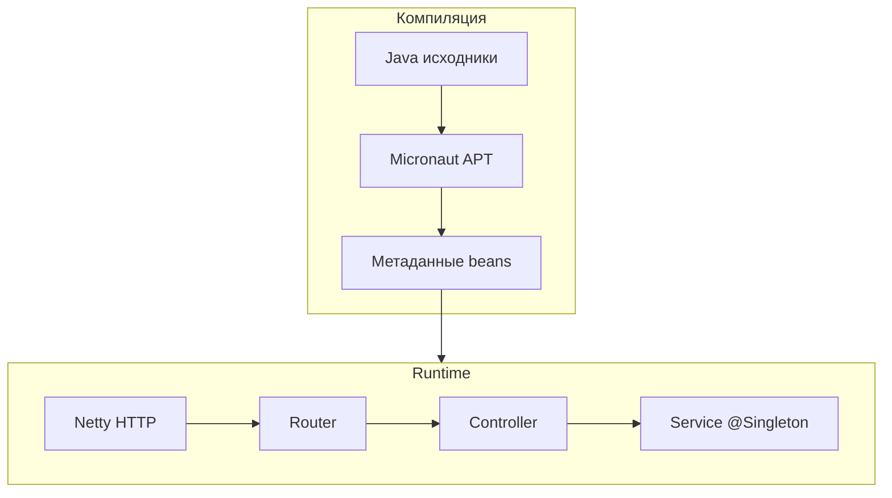
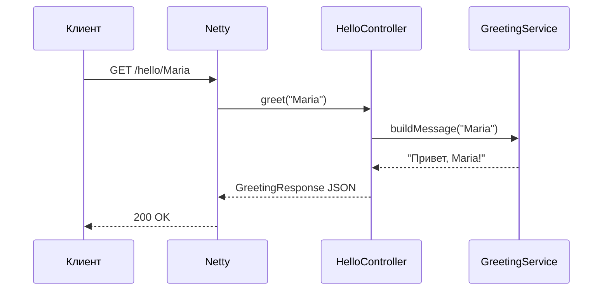

# Micronaut — первая программа

<div class="article-tags">
  <span class="tag tag-required">ОБЯЗАТЕЛЬНО</span>
  <span class="tag tag-beginner">ДЛЯ НОВИЧКОВ</span>
</div>

<span class="complexity-badge">Разработчику</span>
<span class="complexity-badge">Архитектору</span>

---

**Micronaut** — Java/Kotlin-фреймворк с **compile-time DI** (Dependency Injection, внедрение зависимостей): зависимости разрешаются при компиляции, без тяжёлого runtime-сканирования classpath. Подходит для микросервисов, serverless и GraalVM native.

Практикум идёт **по шагам** — генерация проекта, сервис и контроллер, запуск, конфигурация, тесты, JAR и native.

| Шаг | Тема | Зачем |
|-----|------|-------|
| 0 | JDK, launch.micronaut.io | Скелет с features |
| 1 | `GreetingService` + `HelloController` | DI через конструктор |
| 2 | `./mvnw mn:run` | Dev-сервер на Netty |
| 3 | `application.yml` | Порт, имя приложения |
| 4 | `@MicronautTest` | HTTP-тест без поднятия порта вручную |
| 5 | `./mvnw package` | Fat JAR для деплоя |
| 6 | `-Dpackaging=native` | Бинарник GraalVM (опционально) |
| 7 | CRUD "Заметки" | Закрепить слои controller → service → store |

Предполагается базовый Java:

- [первая программа](./13.md)
- [ООП](./18.md)
- [Maven/Gradle](./12.md)

| Материал | Зачем |
|----------|-------|
| [Quarkus — первая программа](./309.md) | Соседний cloud-native стек |
| [Records в Java](./312.md) | DTO для JSON |
| [REST API](/encyclopedia/4-code-dev/4-17-veb-razrabotka/2) | HTTP-методы и коды |
| [JUnit в Java](./26.md) | Запуск `./mvnw test` |
| [Асинхронность в Java](./298.md) | Reactive при росте нагрузки |

### Навигация по разделу Java

- Вы здесь: [Micronaut — первая программа](./310.md)
- База: [Первая программа на Java](./13.md)
- Альтернатива: [Quarkus — первая программа](./309.md)
- Spring-маршрут: [Spring Boot](./271.md)

| Термин | Значение |
|--------|----------|
| **Micronaut** | Фреймворк от Micronaut Foundation (Apache 2) |
| **@Controller** | HTTP-обработчик (аналог JAX-RS resource) |
| **@Singleton** | Bean с одним экземпляром на контекст |
| **Netty** | Встроенный HTTP-сервер по умолчанию |
| **Annotation processor** | Генерирует метаданные DI на этапе компиляции |



<div class="callout callout--info">
  <div class="callout-title">Compile-time DI</div>

  <div class="callout-body">
  Micronaut не сканирует весь classpath при старте — граф зависимостей известен заранее. Это ускоряет cold start и упрощает native-сборку. Подробнее про DI — <a href="/encyclopedia/4-code-dev/4-08-oop/1">ООП</a>, паттерны — <a href="/encyclopedia/7-project/7-06-proektirovanie-i-arhitektura/design-patterns/intro">проектирование</a>.
</div>
</div>

---

## Шаг 0 — проверка окружения

| Компонент | Версия |
|-----------|--------|
| JDK | 17 или 21 LTS |
| Build | Maven или Gradle (ниже — Maven) |
| IDE | IntelliJ IDEA с annotation processing |

```bash
java -version
```

На Windows после генерации проекта:

```bash
mvnw.cmd -v
```

<div class="callout callout--tip">
  <div class="callout-title">Annotation processing в IDE</div>

  <div class="callout-body">
  В IntelliJ включите <strong>Enable annotation processing</strong> (Settings → Build → Compiler → Annotation Processors). Без этого IDE может подсвечивать ошибки в сгенерированном коде, хотя <code>mvnw compile</code> проходит.
</div>
</div>

---

## Шаг 1 — создать проект

Откройте [launch.micronaut.io](https://launch.micronaut.io):

1. **Name:** `hello-micronaut`
2. **Package:** `com.example`
3. **Java:** 17 или 21
4. **Features:** `http-server`, `jackson-databind`
5. Build tool: **Maven** (или Gradle)
6. **Generate** → скачайте ZIP, распакуйте, откройте в IDE

Структура:

```text
hello-micronaut/
  src/main/java/com/example/
  src/main/resources/
  src/test/java/com/example/
  pom.xml
  mvnw
  micronaut-cli.yml
```

Разбор:

- `Application.java` — точка входа с `Micronaut.run`.
- `micronaut-cli.yml` — метаданные для CLI `mn`.
- Features из launch добавляют зависимости в `pom.xml` автоматически.

---

## Шаг 2 — сервис и контроллер

Паттерн **controller → service** отделяет HTTP от бизнес-логики — см. [REST API](/encyclopedia/4-code-dev/4-17-veb-razrabotka/2).

### GreetingService

`src/main/java/com/example/GreetingService.java`:

```java
package com.example;

import jakarta.inject.Singleton;

@Singleton
public class GreetingService {

    public String buildMessage(String name) {
        if (name == null || name.isBlank()) {
            return "Hello from Micronaut";
        }
        return "Привет, " + name.trim() + "!";
    }

    public String buildFormalMessage(String name) {
        if (name == null || name.isBlank()) {
            return buildMessage(null);
        }
        return "Уважаемый(ая), " + name.trim() + "!";
    }
}
```

Разбор:

- `@Singleton` — один экземпляр на контекст приложения.
- Сервис не знает про HTTP — его проще тестировать unit-тестами.

### HelloController

`src/main/java/com/example/HelloController.java`:

```java
package com.example;

import io.micronaut.http.annotation.Controller;
import io.micronaut.http.annotation.Get;
import io.micronaut.http.MediaType;

@Controller("/hello")
public class HelloController {

    private final GreetingService greetingService;

    public HelloController(GreetingService greetingService) {
        this.greetingService = greetingService;
    }

    @Get(produces = MediaType.TEXT_PLAIN)
    public String index() {
        return greetingService.buildMessage(null);
    }

    @Get("/{name}")
    public GreetingResponse greet(String name) {
        return new GreetingResponse(greetingService.buildMessage(name));
    }

    @Get(uri = "/{name}/formal", produces = MediaType.APPLICATION_JSON)
    public GreetingResponse greetFormal(String name) {
        return new GreetingResponse(greetingService.buildFormalMessage(name));
    }

    public record GreetingResponse(String message) {}
}
```

Разбор:

- Конструктор с `GreetingService` — **DI**: Micronaut создаст bean и передаст его при создании контроллера.
- `@Controller("/hello")` регистрирует маршруты с префиксом `/hello`.
- `@Get("/{name}")` маппит path-параметр на аргумент `name`.
- `record GreetingResponse` — JSON через Jackson ([Records](./312.md)).



---

## Шаг 3 — запуск

Maven:

```bash
./mvnw mn:run
```

Gradle:

```bash
./gradlew run
```

Windows:

```bash
mvnw.cmd mn:run
```

| Запрос | Ответ |
|--------|-------|
| `GET http://localhost:8080/hello` | `Hello from Micronaut` (text/plain) |
| `GET http://localhost:8080/hello/Борис` | `{"message":"Привет, Борис!"}` |
| `GET http://localhost:8080/hello/Anna/formal` | `{"message":"Уважаемый(ая), Anna!"}` |

Проверка curl:

```bash
curl http://localhost:8080/hello
curl http://localhost:8080/hello/Maria
curl -i http://localhost:8080/hello/Maria
```

Разбор:

- `mn:run` поднимает embedded Netty и включает **restart** при изменении классов.
- `-i` показывает заголовок `Content-Type`.
- Остановка — `Ctrl+C`.

<div class="callout callout--tip">
  <div class="callout-title">Hot reload</div>

  <div class="callout-body">
  При <code>mn:run</code> изменения в <code>.java</code> подхватываются быстрым restart контекста. Изменения в <code>application.yml</code> иногда требуют ручного рестарта.
</div>
</div>

---

## Шаг 4 — конфигурация

`src/main/resources/application.yml`:

```yaml
micronaut:
  application:
    name: hello-micronaut
  server:
    port: 8080

logger:
  levels:
    com.example: DEBUG
    io.micronaut: INFO
```

Профиль dev — файл `application-dev.yml`:

```yaml
micronaut:
  server:
    port: 8080
logger:
  levels:
    com.example: TRACE
```

Активация:

```bash
./mvnw mn:run -Dmicronaut.environments=dev
```

Переменные окружения:

| Property | Переменная окружения |
|----------|----------------------|
| `micronaut.server.port` | `MICRONAUT_SERVER_PORT` |
| `micronaut.application.name` | `MICRONAUT_APPLICATION_NAME` |

См. [конфигурации и данные](/encyclopedia/3-data-markup/3-04-konfiguratsii-i-dannye/intro).

---

## Шаг 5 — тест контроллера

Micronaut генерирует тестовый каркас. Пример `src/test/java/com/example/HelloControllerTest.java`:

```java
package com.example;

import io.micronaut.http.client.HttpClient;
import io.micronaut.http.client.annotation.Client;
import io.micronaut.test.extensions.junit5.annotation.MicronautTest;
import jakarta.inject.Inject;
import org.junit.jupiter.api.Test;

import static org.junit.jupiter.api.Assertions.assertTrue;
import static org.junit.jupiter.api.Assertions.assertEquals;

@MicronautTest
class HelloControllerTest {

    @Inject
    @Client("/")
    HttpClient client;

    @Test
    void helloContainsMicronaut() {
        String body = client.toBlocking()
            .retrieve("/hello", String.class);
        assertTrue(body.contains("Micronaut"));
    }

    @Test
    void greetReturnsJsonMessage() {
        GreetingResponse response = client.toBlocking()
            .retrieve("/hello/Test", GreetingResponse.class);
        assertEquals("Привет, Test!", response.message());
    }

    public record GreetingResponse(String message) {}
}
```

Запуск:

```bash
./mvnw test
```

Разбор:

- `@MicronautTest` поднимает минимальный контекст приложения в тесте.
- `@Client("/")` — HTTP-клиент Micronaut, base URL — embedded server.
- `toBlocking()` — синхронный вызов; для reactive есть `retrieve` с `Publisher`.

Unit-тест сервиса **без** HTTP:

```java
package com.example;

import org.junit.jupiter.api.Test;
import static org.junit.jupiter.api.Assertions.assertEquals;

class GreetingServiceTest {

    private final GreetingService service = new GreetingService();

    @Test
    void blankNameReturnsDefault() {
        assertEquals("Hello from Micronaut", service.buildMessage("  "));
    }
}
```

Тестирование — [JUnit](./26.md), [разработка и отладка](/encyclopedia/4-code-dev/4-14-razrabotka-i-otladka/111).

---

## Шаг 6 — JAR и native

Сборка:

```bash
./mvnw package
java -jar target/hello-micronaut-0.1.jar
```

| Артефакт | Назначение |
|----------|------------|
| `*-all.jar` | Fat JAR — один файл для деплоя |
| native binary | Без JVM на хосте |

Native (GraalVM):

```bash
./mvnw package -Dpackaging=native
```

Исполняемый файл появится в `target/` — имя зависит от artifactId.

<div class="callout callout--warning">
  <div class="callout-title">Native ограничения</div>

  <div class="callout-body">
  Reflection и dynamic proxies нужно объявлять в <code>native-image.properties</code> или через Micronaut metadata. Для учебного REST достаточно JVM-режима — см. также <a href="./309.md">Quarkus native</a>.
</div>
</div>

---

## Шаг 7 — учебный CRUD "Заметки"

### Record Note

```java
package com.example;

public record Note(long id, String text) {}
```

### NoteService

```java
package com.example;

import jakarta.inject.Singleton;
import java.util.ArrayList;
import java.util.List;
import java.util.Optional;
import java.util.concurrent.atomic.AtomicLong;

@Singleton
public class NoteService {

    private final AtomicLong seq = new AtomicLong(1);
    private final List<Note> notes = new ArrayList<>();

    public List<Note> findAll() {
        return List.copyOf(notes);
    }

    public Note create(String text) {
        if (text == null || text.isBlank()) {
            throw new IllegalArgumentException("text пустой");
        }
        Note note = new Note(seq.getAndIncrement(), text.trim());
        notes.add(note);
        return note;
    }

    public boolean delete(long id) {
        return notes.removeIf(n -> n.id() == id);
    }

    public Optional<Note> findById(long id) {
        return notes.stream().filter(n -> n.id() == id).findFirst();
    }
}
```

### NoteController

```java
package com.example;

import io.micronaut.http.HttpResponse;
import io.micronaut.http.annotation.*;
import io.micronaut.http.MediaType;
import java.util.List;

@Controller("/notes")
public class NoteController {

    private final NoteService noteService;

    public NoteController(NoteService noteService) {
        this.noteService = noteService;
    }

    @Get(produces = MediaType.APPLICATION_JSON)
    public List<Note> list() {
        return noteService.findAll();
    }

    @Post(consumes = MediaType.APPLICATION_JSON, produces = MediaType.APPLICATION_JSON)
    public HttpResponse<?> create(@Body CreateNoteRequest body) {
        try {
            Note created = noteService.create(body.text());
            return HttpResponse.created(created);
        } catch (IllegalArgumentException ex) {
            return HttpResponse.badRequest(new ErrorBody(ex.getMessage()));
        }
    }

    @Delete("/{id}")
    public HttpResponse<?> delete(long id) {
        if (noteService.delete(id)) {
            return HttpResponse.noContent();
        }
        return HttpResponse.notFound(new ErrorBody("id не найден"));
    }

    public record CreateNoteRequest(String text) {}
    public record ErrorBody(String error) {}
}
```

### HealthController

```java
package com.example;

import io.micronaut.http.annotation.Controller;
import io.micronaut.http.annotation.Get;

@Controller("/health")
public class HealthController {

    @Get
    public String ok() {
        return "ok";
    }
}
```

### Проверка

```bash
curl http://localhost:8080/health
curl http://localhost:8080/notes
curl -X POST http://localhost:8080/notes \
  -H "Content-Type: application/json" \
  -d '{"text":"Изучить Micronaut"}'
curl http://localhost:8080/notes
curl -X DELETE http://localhost:8080/notes/1
```

Сценарий совпадает с [Quarkus CRUD](./309.md#шаг-7--учебный-rest-api-заметки) и [Node REST API](/encyclopedia/5-languages/5-01-javascript/3-ecosystem/1-runtime-node/262).

---

## Типичные ошибки и troubleshooting

| Ошибка | Симптом | Решение |
|--------|---------|---------|
| Bean not found | `No bean of type ... exists` | Класс в пакете `com.example`, аннотация `@Singleton` / `@Controller` |
| 404 | Путь не найден | Проверьте `@Controller` path и HTTP-метод (`@Get`, `@Post`) |
| Port in use | Address already in use | `micronaut.server.port` в yml |
| Kotlin или Java | Смешанные артефакты | На launch выберите один язык генерации |
| Тест падает на JSON | Нет jackson | Feature `jackson-databind` при генерации |
| IDE не видит beans | APT выключен | Enable annotation processing |
| POST body null | Нет `@Body` | Добавьте `@Body CreateNoteRequest` |
| Native build fail | GraalVM не установлен | JVM JAR достаточно для обучения |

<div class="callout callout--info">
  <div class="callout-title">Логирование маршрутов</div>

  <div class="callout-body">
  При уровне DEBUG для <code>io.micronaut</code> в логах видны зарегистрированные routes — удобно при отладке 404.
</div>
</div>

---

## Micronaut и Quarkus — когда что выбрать

| Критерий | Micronaut | Quarkus |
|----------|-----------|---------|
| DI | Compile-time APT | CDI + build steps |
| Стандарты | Свои аннотации + Jakarta inject | Jakarta EE, JAX-RS |
| Dev UI | Меньше встроенного | Quarkus Dev UI |
| Native | Поддерживается | Поддерживается |
| Экосистема | Oracle, Apache | Red Hat |

Оба фреймворка подходят для микросервисов. Выбор часто зависит от команды и хостинга — [Экосистема Java](./110.md).

---

## Упражнения

1. Добавьте `PATCH /notes/{id}` — обновление текста заметки.
2. Напишите `@MicronautTest` для `POST /notes` с пустым телом — ожидайте 400.
3. Вынесите `NoteService` в интерфейс `NoteRepository` + реализацию `InMemoryNoteRepository` — отработайте подмену в тестах.
4. Подключите feature `jdbc-hikari` + H2 — сохраните заметки в таблицу.
5. Добавьте `@Header` `X-Request-Id` в лог через фильтр `HttpServerFilter`.

<details>
<summary>Подсказка к упражнению 2</summary>

```java
@Test
void createEmptyTextReturnsBadRequest() {
    HttpResponse<String> response = client.toBlocking()
        .exchange(HttpRequest.POST("/notes", "{}"), String.class);
    assertEquals(HttpStatus.BAD_REQUEST, response.getStatus());
}
```

</details>

---

## FAQ

**Micronaut требует Spring?**

Нет. Это самостоятельный фреймворк. Spring и Micronaut не смешивают в одном приложении.

**Можно ли использовать JAX-RS?**

Micronaut имеет модуль `micronaut-jaxrs` — для новых проектов обычно достаточно `@Controller`.

**Как передать query-параметр?**

`@QueryValue String q` в сигнатуре метода — `GET /search?q=java`.

**Reactive стек?**

Micronaut поддерживает Project Reactor — см. [асинхронность](./298.md).

**Где документация?**

[docs.micronaut.io](https://docs.micronaut.io/) — guides и API reference.

---

## Шаг 8 — обработка ошибок и HTTP-ответы

Централизованный обработчик исключений — `@Error` controller:

```java
package com.example;

import io.micronaut.http.HttpRequest;
import io.micronaut.http.HttpResponse;
import io.micronaut.http.annotation.Produces;
import io.micronaut.http.server.exceptions.ExceptionHandler;
import io.micronaut.http.MediaType;
import jakarta.inject.Singleton;

@Produces(MediaType.APPLICATION_JSON)
@Singleton
public class IllegalArgumentHandler
    implements ExceptionHandler<IllegalArgumentException, HttpResponse<ErrorBody>> {

    @Override
    public HttpResponse<ErrorBody> handle(HttpRequest request, IllegalArgumentException ex) {
        return HttpResponse.badRequest(new ErrorBody(ex.getMessage()));
    }

    public record ErrorBody(String error) {}
}
```

Разбор:

- Micronaut автоматически регистрирует `ExceptionHandler` beans.
- `NoteService` бросает `IllegalArgumentException` — клиент получает **400** с JSON.
- Для необработанных ошибок настройте `@Error(status = INTERNAL_SERVER_ERROR)`.

Коды HTTP — [REST API](/encyclopedia/4-code-dev/4-17-veb-razrabotka/2), [ошибки REST в Spring](./303.md) (параллель по идее единого формата).

---

## Шаг 9 — фильтры и middleware

`HttpServerFilter` перехватывает запрос до контроллера:

```java
package com.example;

import io.micronaut.http.HttpRequest;
import io.micronaut.http.MutableHttpResponse;
import io.micronaut.http.annotation.Filter;
import io.micronaut.http.filter.HttpServerFilter;
import io.micronaut.http.filter.ServerFilterChain;
import org.reactivestreams.Publisher;
import org.slf4j.Logger;
import org.slf4j.LoggerFactory;

@Filter("/hello/**")
public class RequestLoggingFilter implements HttpServerFilter {

    private static final Logger LOG = LoggerFactory.getLogger(RequestLoggingFilter.class);

    @Override
    public Publisher<MutableHttpResponse<?>> doFilter(HttpRequest<?> request, ServerFilterChain chain) {
        long start = System.currentTimeMillis();
        LOG.info("{} {}", request.getMethod(), request.getPath());
        return chain.proceed(request);
    }
}
```

Аналог middleware в Express — [Express middleware](/encyclopedia/5-languages/5-01-javascript/3-ecosystem/1-runtime-node/263.md).

---

## Шаг 10 — reactive HTTP (обзор)

Micronaut построен на reactive core. Блокирующий контроллер выше — простой путь. Reactive signature:

```java
@Get("/reactive")
public Publisher<String> reactive() {
    return Publishers.just("ok");
}
```

При росте нагрузки и интеграции с reactive БД — [асинхронность в Java](./298.md). Для первого REST достаточно blocking API.

---

## Шаг 11 — Kotlin на Micronaut

На [launch.micronaut.io](https://launch.micronaut.io) выберите **Kotlin** — контроллер:

```kotlin
package com.example

import io.micronaut.http.annotation.*
import io.micronaut.http.MediaType
import jakarta.inject.Singleton

@Singleton
class GreetingService {
    fun buildMessage(name: String?) =
        if (name.isNullOrBlank()) "Hello from Micronaut"
        else "Привет, ${name.trim()}!"
}

@Controller("/hello")
class HelloController(private val greetingService: GreetingService) {

    @Get(produces = [MediaType.TEXT_PLAIN])
    fun index() = greetingService.buildMessage(null)

    @Get("/{name}")
    fun greet(name: String) = mapOf("message" to greetingService.buildMessage(name))
}
```

Kotlin в JVM — [Kotlin — о разделе](/encyclopedia/5-languages/5-09-kotlin/intro). Compile-time DI работает так же через KAPT или KSP.

---

## Шаг 12 — JDBC и H2 (слой данных)

Features на launch: `jdbc-hikari`, `h2`.

`application.yml`:

```yaml
datasources:
  default:
    url: jdbc:h2:mem:devDb;DB_CLOSE_DELAY=-1
    driverClassName: org.h2.Driver
    username: sa
    password: ''
```

Repository с `@JdbcRepository` или plain JDBC — данные переживут restart только если file-based H2.

Следующий шаг ORM — [Hibernate и JPA](./293.md), [работа с БД](./22.md).

---

## Шаг 13 — Docker и production

Fat JAR:

```bash
./mvnw package
java -Dmicronaut.environments=prod -jar target/hello-micronaut-0.1.jar
```

Health для orchestrator — endpoint `/health` из учебного контроллера или extension **micronaut-management**.

Process manager — systemd unit с `Restart=on-failure`. HTTPS — reverse proxy [Nginx](/lab/Примеры/11112).

---

## Compile-time DI — как это устроено


На этапе **`mvn compile`** процессор генерирует классы `*$Definition` в `target/generated-sources`. Runtime читает метаданные — отсюда быстрый старт.

| Runtime DI (Spring classic) | Compile-time (Micronaut) |
|-----------------------------|---------------------------|
| Сканирование @Component | Генерация метаданных |
| Дольше cold start | Быстрее cold start |
| Больше reflection | Меньше reflection |

---

## Работа в IntelliJ IDEA

1. Open project → `pom.xml`.
2. Settings → Annotation Processors → Enable.
3. Maven tool window → `mn:run`.
4. Тесты — правый клик на `HelloControllerTest` → Run.

См. [IntelliJ IDEA](./103.md), [отладка](./132.md).

---

## Расширенный troubleshooting

| Симптом | Причина | Решение |
|---------|---------|---------|
| `BeanDefinition` missing | Не скомпилировался APT | `mvn clean compile` |
| Circular dependency | Два @Singleton ссылаются друг на друга | Refactor или `@Lazy` |
| YAML not applied | Неверный indent | Пробелы, не табы в yml |
| Gradle vs Maven | Смешаны команды | Одна build system |
| 415 Unsupported Media | POST без Content-Type | Header `application/json` |
| SSL errors в test client | Self-signed | Trust store или HTTP локально |

### Логи Netty

```yaml
logger:
  levels:
    io.netty: INFO
    io.micronaut.http.server: DEBUG
```

---

## Дополнительные упражнения

6. Добавьте `@Header("X-App-Version")` в ответ health-check.
7. Реализуйте pagination `GET /notes?page=0&size=10` на in-memory списке.
8. Напишите `@MicronautTest` с `RxHttpClient` (если подключён reactive).
9. Сгенерируйте OpenAPI через feature `openapi` — сравните с Quarkus Swagger UI.
10. Замерьте время старта `mn:run` и `java -jar` — запишите в README проекта.

---

## Расширенный FAQ

**Micronaut и Spring Boot в одном JAR?**

Не стоит — разные DI и embedded servers.

**Есть ли аналог Spring Data?**

Micronaut Data — декларативные реpositories, compile-time queries.

**Поддержка GraalVM native на Windows?**

Ограничена — native часто собирают в Linux CI.

**Как inject конфиг в bean?**

`@Value("${micronaut.application.name}") String appName`.

**Где примеры Oracle?**

[micronaut-guides](https://guides.micronaut.io/) — пошаговые tutorials.

**Serverless?**

Micronaut Function AWS — отдельный feature; cold start помогает compile-time DI.

---

## Micronaut Data — обзор реpositories

Feature `micronaut-data-jdbc` на launch:

```java
package com.example;

import io.micronaut.data.annotation.Repository;
import io.micronaut.data.jdbc.annotation.JdbcRepository;
import io.micronaut.data.model.query.builder.sql.Dialect;
import io.micronaut.data.repository.CrudRepository;

@JdbcRepository(dialect = Dialect.H2)
public interface NoteEntityRepository extends CrudRepository<NoteEntity, Long> {}
```

Entity остаётся **class** (не record) — см. [Records](./312.md). Repository генерируется на compile-time — в духе Micronaut DI.

---

## WebSocket endpoint (обзор)

Feature `websocket`:

```java
@Controller("/ws/chat")
public class ChatController {
    @MessageMapping("/send")
    public String echo(String message) {
        return "echo: " + message;
    }
}
```

Для real-time UI — [асинхронность](./298.md). REST учебник WebSocket не требует.

---

## Management endpoints

Feature `micronaut-management`:

```yaml
endpoints:
  health:
    enabled: true
    sensitive: false
  info:
    enabled: true
```

| Path | Смысл |
|------|-------|
| `/health` | Health check |
| `/info` | Версия приложения |

Kubernetes probes — GET `/health` каждые N секунд.

---

## Полный pom.xml фрагмент (reference)

```xml
<dependencyManagement>
  <dependencies>
    <dependency>
      <groupId>io.micronaut.platform</groupId>
      <artifactId>micronaut-platform</artifactId>
      <version>${micronaut.version}</version>
      <type>pom</type>
      <scope>import</scope>
    </dependency>
  </dependencies>
</dependencyManagement>

<dependencies>
  <dependency>
    <groupId>io.micronaut</groupId>
    <artifactId>micronaut-http-server-netty</artifactId>
  </dependency>
  <dependency>
    <groupId>io.micronaut.serde</groupId>
    <artifactId>micronaut-serde-jackson</artifactId>
  </dependency>
</dependencies>
```

BOM фиксирует версии — аналог Quarkus platform — [Maven и Gradle](./12.md).

---

## Сравнение hello-world на трёх JVM-фреймворках

| Шаг | Micronaut | Quarkus | Spring Boot |
|-----|-----------|---------|-------------|
| Генератор | launch.micronaut.io | code.quarkus.io | start.spring.io |
| HTTP API | `@Controller` | `@Path` JAX-RS | `@RestController` |
| Dev | `mn:run` | `quarkus:dev` | `spring-boot:run` |
| DI | Compile-time | CDI | Runtime Spring |

Spring — [Spring Boot](./271.md), Quarkus — [309](./309.md).

---

## Разбор каждого файла в сгенерированном проекте

| Файл | Роль |
|------|------|
| `Application.java` | `public static void main` → `Micronaut.run` |
| `application.yml` | Конфигурация по умолчанию |
| `logback.xml` | Формат логов (если есть) |
| `pom.xml` | BOM, annotation processor path |
| `micronaut-cli.yml` | Имя app для CLI |

`Application.java`:

```java
package com.example;

import io.micronaut.runtime.Micronaut;

public class Application {
    public static void main(String[] args) {
        Micronaut.run(Application.class, args);
    }
}
```

Micronaut стартует Netty до выхода из `main` — процесс остаётся живым.

---

## Gradle build.gradle (фрагмент)

```kotlin
plugins {
    id("com.github.johnrengelman.shadow") version "8.1.1"
    id("io.micronaut.application") version "4.4.2"
}

micronaut {
    runtime("netty")
    processing {
        incremental(true)
    }
}

application {
    mainClass.set("com.example.Application")
}
```

Команды: `./gradlew run`, `./gradlew shadowJar`.

---

## NoteControllerTest полный пример

```java
@MicronautTest
class NoteControllerTest {

    @Inject
    @Client("/")
    HttpClient client;

    @Test
    void crudFlow() {
        client.toBlocking().retrieve("/notes", Argument.listOf(Note.class)).size();

        Note created = client.toBlocking().retrieve(
            HttpRequest.POST("/notes", new NoteController.CreateNoteRequest("Test")),
            Note.class
        );
        assertNotNull(created.id());

        HttpResponse<?> del = client.toBlocking()
            .exchange(HttpRequest.DELETE("/notes/" + created.id()));
        assertEquals(HttpStatus.NO_CONTENT, del.getStatus());
    }
}
```

---

## application.yml — справочник

| Ключ | Пример |
|------|--------|
| `micronaut.server.port` | `8080` |
| `micronaut.server.cors.enabled` | `true` |
| `micronaut.security.enabled` | `false` (dev) |
| `datasources.default.url` | JDBC URL |
| `logger.levels.com.example` | `DEBUG` |

---

## CORS для браузерного фронтенда

Если Flutter Web или React на `localhost:5173` ходит на API `localhost:8080`, браузер проверяет CORS.

```yaml
micronaut:
  server:
    cors:
      enabled: true
      configurations:
        web:
          allowed-origins:
            - http://localhost:5173
          allowed-methods:
            - GET
            - POST
            - DELETE
          allowed-headers:
            - Content-Type
```

Перезапустите `mn:run` после изменения yml. Аналог в Node — [Fullstack на JavaScript](/encyclopedia/5-languages/5-01-javascript/3-ecosystem/1-runtime-node/264.md).

---

## Multipart upload (обзор)

Feature `micronaut-http-server`:

```java
@Post(value = "/upload", consumes = MediaType.MULTIPART_FORM_DATA)
public String upload(@Body("file") CompletedFileUpload file) {
    return "received " + file.getFilename();
}
```

Для JSON REST учебника upload не обязателен — знайте, что Micronaut поддерживает файлы.

---

## Micronaut Security — JWT (обзор)

Feature `security-jwt`:

```yaml
micronaut:
  security:
    enabled: true
    token:
      jwt:
        signatures:
          secret:
            generator:
              secret: ${JWT_SECRET:pleaseChangeMepleaseChangeMe1234567890}
```

```java
@Secured(SecurityRule.IS_AUTHENTICATED)
@Get("/secure/hello")
public String secureHello() {
    return "authenticated";
}
```

Концепции — [JWT в Java](./274.md), [Spring Security Basic](./272.md).

---

## Профили окружений

| Файл | Когда активен |
|------|----------------|
| `application.yml` | Всегда (base) |
| `application-dev.yml` | `-Dmicronaut.environments=dev` |
| `application-prod.yml` | `prod` |

```yaml
# application-prod.yml
micronaut:
  server:
    port: 8080
logger:
  levels:
    root: WARN
    com.example: INFO
```

Секреты prod — только env vars — [конфигурации](/encyclopedia/3-data-markup/3-04-konfiguratsii-i-dannye/98).

---

## Локализация сообщений ошибок

`src/main/resources/messages.properties`:

```properties
error.text.empty=Текст заметки не может быть пустым
```

```java
@Inject
MessageSource messageSource;

String msg = messageSource.getMessage("error.text.empty", MessageSource.MessageContext.DEFAULT);
```

Клиент получает стабильный `code`, UI переводит — [i18n практики](/encyclopedia/4-code-dev/4-17-veb-razrabotka/intro).

---

## Мониторинг и metrics

Feature `micronaut-management` + `micrometer-registry-prometheus`:

```yaml
endpoints:
  prometheus:
    enabled: true
    sensitive: false
```

Scrape URL `/prometheus` — Grafana dashboard. Observability — [мониторинг](/encyclopedia/8-infra-security/8-03-monitoring-i-logirovanie/intro).

---

## Учебный timeline "Первый день с Micronaut"

| Час | Действие |
|-----|----------|
| 0–1 | launch.micronaut.io, `mn:run`, curl `/hello` |
| 1–2 | Service + Controller, DI |
| 2–3 | Note CRUD, curl сценарии |
| 3–4 | `@MicronautTest`, `./mvnw test` |
| 4–5 | `application-dev.yml`, логи DEBUG |
| 5–6 | package JAR, `java -jar` |

На второй день — JDBC H2 и [Hibernate](./293.md).

---

## Куда дальше

1. [Quarkus — первая программа](./309.md) — REST на JVM с dev UI.
2. [Records в Java](./312.md) — DTO и value-типы.
3. [Асинхронность в Java](./298.md) — reactive streams при росте нагрузки.
4. [Экосистема Java-приложений](./110.md).
5. [Веб-разработка — о разделе](/encyclopedia/4-code-dev/4-17-veb-razrabotka/intro).

<div class="callout callout--tip">
  <div class="callout-title">Практика</div>
  <div class="callout-body">
  Подключите feature <code>jdbc-hikari</code> + H2 и сохраните сообщения приветствия в таблицу — отработайте слой данных без ORM. Дальше — <a href="./293.md">Hibernate и JPA</a>.
</div>
</div>

{/* sidebar-collections */}

---

## В подборках

Статья входит в cloud-native маршрут Java вместе с [Quarkus](./309.md) и [Spring Boot](./271.md).

{/* /sidebar-collections */}

---

## Второй проход — Reactive и HTTP client (черновик)

Micronaut поддерживает **Project Reactor** для неблокирующих цепочек. Feature `reactor` при генерации на launch.micronaut.io.

Контроллер возвращает `Mono`:

```java
import reactor.core.publisher.Mono;
import io.micronaut.http.annotation.Get;

@Get("/hello-async")
public Mono<GreetingResponse> helloAsync() {
    return Mono.fromCallable(() ->
        new GreetingResponse(greetingService.buildMessage("async")));
}
```

Для учебного REST достаточно blocking Netty threads; reactive помогает при тысячах одновременных I/O-bound запросов — [асинхронность](./298.md).

### Declarative HTTP client

```java
import io.micronaut.http.client.annotation.Client;
import io.micronaut.http.annotation.Get;

@Client("/")
public interface HelloClient {
    @Get("/hello")
    String hello();
}
```

В тесте `@MicronautTest` инжектируйте `HelloClient` — проверка API без `HttpClient` boilerplate. Для внешних сервисов — `@Client(id = "external", url = "${external.url}")`.

### GraalVM hints

Micronaut генерирует `META-INF/native-image` metadata при компиляции. Если native build падает на reflection — проверьте `reflect-config.json` в `src/main/resources/META-INF/native-image/`. Сравните cold start с [Quarkus native](./309.md#шаг-6--native-сборка-опционально).

---

## Micronaut Data и JDBC

```java
@JdbcRepository(dialect = Dialect.POSTGRES)
public interface UserRepository extends CrudRepository<User, Long> {
    List<User> findByActiveTrue();
}
```

Micronaut Data генерирует SQL на compile time — меньше runtime reflection, чем classic JPA. Для сложных запросов — `@Query` или native SQL.

---

## Security: JWT и filters

```java
@Filter("/api/**")
public class JwtFilter implements HttpServerFilter {
    @Override
    public Publisher<MutableHttpResponse<?>> doFilter(
            HttpRequest<?> request, ServerFilterChain chain) {
        // validate Bearer token
        return chain.proceed(request);
    }
}
```

Секреты JWT — только ENV или Kubernetes secrets, не в `application.yml` в git.

---

## Observability

Micronaut интегрируется с **Micrometer** и **OpenTelemetry**:

```yaml
# application.yml
endpoints:
  prometheus:
    enabled: true
    sensitive: false
```

Метрики `/prometheus` для Grafana; trace context в HTTP headers для distributed tracing.

---

## Тестирование REST

```java
@MicronautTest
class HelloControllerTest {
    @Inject
    @Client("/")
    HttpClient client;

    @Test
    void hello() {
        HttpRequest<?> req = HttpRequest.GET("/hello");
        String body = client.toBlocking().retrieve(req, String.class);
        assertEquals("Hello", body);
    }
}
```

Сравните с [JUnit](./26.md) и [Quarkus testing](./309.md).

---

## Deployment checklist Micronaut

| Шаг | Действие |
|-----|----------|
| 1 | `micronaut.application.name` задан |
| 2 | Health `/health` exposed для k8s probes |
| 3 | JDBC pool limits под нагрузку |
| 4 | Native image протестирован, если используется |
| 5 | Secrets через env, не в образе |

---

## FAQ Micronaut (дополнение)

**Micronaut или Spring Boot?** Micronaut — compile-time DI, быстрый старт; Spring — экосystem и hiring.

**Graal native обязателен?** Нет — JVM JAR достаточен для большинства REST.

**Reactive когда?** Высокий I/O concurrency без блокировки threads.

**Kotlin с Micronaut?** Поддерживается официально.

**Record в REST?** Да — см. [Record types](./312.md).

---

## Связанные материалы

| Тема | Статья |
|------|--------|
| Quarkus | [309.md](./309.md) |
| Record | [312.md](./312.md) |
| JUnit | [26.md](./26.md) |
| Maven structure | [12.md](./12.md) |

---

## Micronaut Launch и старт проекта

```bash
mn create-app example --features=graalvm,http-client,reactor
cd example
./mvnw mn:run
```

Launch генерирует skeleton с `application.yml`, sample controller и test — быстрее ручного `pom.xml`.

---

## Configuration layers

| Источник | Приоритет |
|----------|-----------|
| `application.yml` | default |
| `application-{env}.yml` | profile |
| ENV variables | override |
| Kubernetes ConfigMap | deploy |

Micronaut maps `DATASOURCE_URL` → `datasources.default.url` автоматически.

---

## Connection pool tuning

```yaml
datasources:
  default:
    maximum-pool-size: 20
    minimum-idle: 5
```

Undersized pool — timeouts под нагрузкой; oversized — лишние connections к Postgres.

---

## Readiness и liveness

```yaml
endpoints:
  health:
    enabled: true
    details-visible: ANONYMOUS
```

Kubernetes: liveness `/health/liveness`, readiness `/health/readiness` после Micronaut 3.x health groups.

---

## Итог Micronaut

Micronaut даёт compile-time DI, быстрый старт и native-image path — для сравнения с [Quarkus](./309.md) соберите один REST на обоих фреймворках и замерьте cold start.

---

## Ссылка на record в REST

DTO в Micronaut controllers часто оформляют как [Java record](./312.md) — immutable JSON boundary без Lombok.

---
