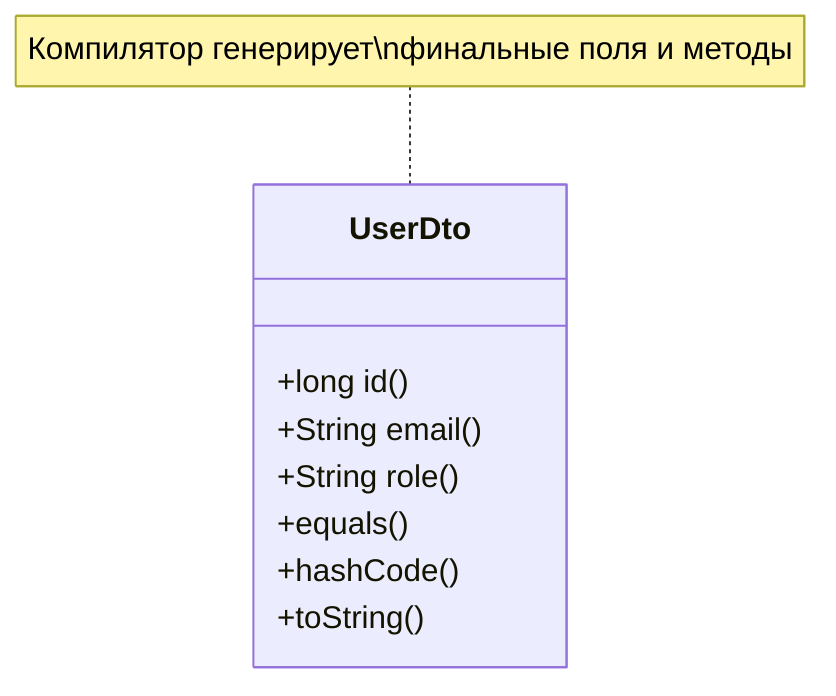
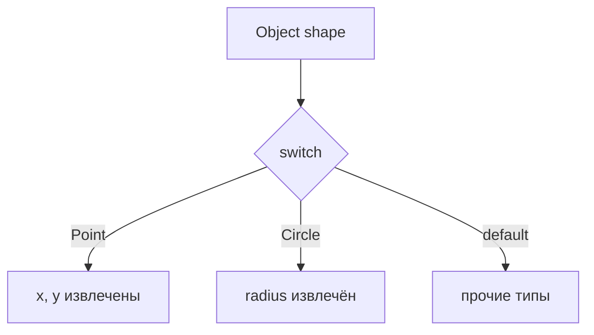

# Records в Java — практическое руководство

<div class="article-tags">
  <span class="tag tag-required">ОБЯЗАТЕЛЬНО</span>
  <span class="tag tag-beginner">ДЛЯ НОВИЧКОВ</span>
</div>

<span class="complexity-badge">Разработчику</span>
<span class="complexity-badge">Архитектору</span>

---

**Record** (Java 16+, стабильно с Java 16, улучшения в 17–21) — класс, который **явно несёт данные**. Компилятор генерирует финальные поля, канонический конструктор, аксессоры, `equals`, `hashCode`, `toString`.

Практикум идёт **по шагам** — синтаксис, compact constructor, методы, коллекции, pattern matching, REST DTO, миграция с POJO.

| Шаг | Тема | Зачем |
|-----|------|-------|
| 1 | Минимальный record | Понять компоненты и accessors |
| 2 | Compact constructor | Валидация и нормализация |
| 3 | Методы и static factory | Поведение без mutable полей |
| 4 | equals / hashCode | Value semantics в Map и Set |
| 5 | Stream и коллекции | Фильтрация и группировка |
| 6 | Pattern matching | Декonstruktion в switch |
| 7 | REST и Jackson | JSON API без Lombok |
| 8 | Миграция POJO → record | Чек-лист и учебный diff |

Обзор рядом с `sealed` и pattern matching — в [современных конструкциях](./300.md). Базовое ООП — [раздел Java](./18.md).

```java
public record Point(int x, int y) {}
```

Эквивалент десяткам строк boilerplate в обычном классе.

| record | Обычный класс с полями |
|--------|------------------------|
| Неизменяемость по умолчанию | Можно менять поля |
| Нет наследования классов | `extends` разрешён |
| Семантика **значения** | Сущность с поведением |
| Мало кода | Больше гибкости |



<div class="callout callout--info">
  <div class="callout-title">JDK 17+</div>

  <div class="callout-body">
  На новых проектах record — стандарт для DTO и value-типов. Требуется JDK 16+. Pattern matching для record в <code>switch</code> — Java 21+ — см. <a href="./300.md">современные конструкции</a>.
</div>
</div>

---

## Шаг 1 — минимальный пример

```java
public record UserDto(long id, String email, String role) {}

var user = new UserDto(1L, "a@example.com", "admin");
System.out.println(user.email()); // a@example.com
System.out.println(user);       // UserDto[id=1, email=..., role=admin]
```

Разбор:

- Компоненты `id`, `email`, `role` — private final поля.
- `user.email()` — публичный accessor по имени компонента (не `getEmail()`).
- `toString` читаемый без `@Override`.
- Класс **final** — record нельзя наследовать.

### Явный canonical constructor

Обычно достаточно заголовка record. Явный конструктор допустим:

```java
public record Range(int from, int to) {
    public Range(int from, int to) {
        this.from = from;
        this.to = to;
    }
}
```

Компилятор всё равно требует присвоения всем компонентам.

---

## Шаг 2 — compact constructor — валидация

```java
public record EmailAddress(String value) {
    public EmailAddress {
        if (value == null || !value.contains("@")) {
            throw new IllegalArgumentException("Invalid email");
        }
        value = value.trim().toLowerCase();
    }
}
```

Разбор:

- Блок `public EmailAddress { ... }` — **compact constructor**: тело выполняется до присвоения полям.
- Можно нормализовать `value` (trim, lower case).
- Явный `public EmailAddress(String value) { this.value = value; }` писать не нужно — компилятор допишет присвоения.

### Ещё пример — Money

```java
import java.math.BigDecimal;
import java.util.Currency;

public record Money(BigDecimal amount, Currency currency) {
    public Money {
        if (amount == null || amount.signum() < 0) {
            throw new IllegalArgumentException("amount >= 0");
        }
        if (currency == null) {
            throw new IllegalArgumentException("currency обязателен");
        }
        amount = amount.setScale(currency.getDefaultFractionDigits());
    }

    public Money add(Money other) {
        if (!currency.equals(other.currency)) {
            throw new IllegalArgumentException("разные валюты");
        }
        return new Money(amount.add(other.amount), currency);
    }
}
```

Разбор:

- Record **immutable** — `add` возвращает новый экземпляр.
- Валидация в одном месте — инварианты не обходятся через reflection без хаков.

Проверка входных данных — [разработка и отладка](/encyclopedia/4-code-dev/4-14-razrabotka-i-otladka/118).

---

## Шаг 3 — статические члены и методы экземпляра

Record **может** содержать:

```java
public record Range(int from, int to) {
    public Range {
        if (from > to) throw new IllegalArgumentException("from > to");
    }

    public boolean contains(int x) {
        return x >= from && x <= to;
    }

    public static Range of(int from, int to) {
        return new Range(from, to);
    }

    public static final Range ZERO = new Range(0, 0);
}
```

| Разрешено | Запрещено |
|-----------|-----------|
| Статические поля/методы | Наследование другого **класса** |
| Методы экземпляра | Дополнительные **instance**-поля (кроме компонентов) |
| `implements` интерфейсы | abstract record (record всегда final) |
| Generic record `Box<T>` | extends другой record |

### Generic record

```java
public record Box<T>(T value) {
    public Box {
        if (value == null) {
            throw new IllegalArgumentException("value null");
        }
    }

    public <U> Box<U> map(java.util.function.Function<T, U> fn) {
        return new Box<>(fn.apply(value));
    }
}
```

### with-методы (обновление одного поля)

```java
public record Config(String host, int port) {
    public Config withPort(int newPort) {
        return new Config(host, newPort);
    }

    public Config withHost(String newHost) {
        return new Config(newHost, port);
    }
}
```

Immutable обновление — создаём новый экземпляр, старый не меняется.

---

## Шаг 4 — equals и hashCode — value semantics

```java
public record Point(int x, int y) {}

var a = new Point(1, 2);
var b = new Point(1, 2);
System.out.println(a.equals(b)); // true
System.out.println(a.hashCode() == b.hashCode()); // true
```

Два record с одинаковыми компонентами **равны** — удобно для `Map`, `Set`, тестов.

### Осторожно с mutable-компонентами

```java
public record Wrapper(List<String> tags) {}
```

Список внутри можно изменить снаружи — нарушится immutability и equals:

```java
var w = new Wrapper(new ArrayList<>(List.of("a")));
w.tags().add("b"); // мутирует внутренний список
```

Исправление — defensive copy в compact constructor:

```java
public record Wrapper(List<String> tags) {
    public Wrapper {
        tags = List.copyOf(tags);
    }
}
```

| Тип компонента | Рекомендация |
|----------------|--------------|
| `String`, примитивы | Без доп. действий |
| `List`, `Set`, `Map` | `List.copyOf`, `Set.copyOf`, `Map.copyOf` |
| Массивы | `Arrays.copyOf` |
| Вложенный mutable объект | Immutable тип или копия |

---

## Шаг 5 — record в коллекциях и Stream

```java
record Product(String sku, int priceRub) {}

List<Product> catalog = List.of(
    new Product("A1", 100),
    new Product("B2", 250),
    new Product("B3", 180)
);

int total = catalog.stream()
    .filter(p -> p.priceRub() > 150)
    .mapToInt(Product::priceRub)
    .sum();

Map<String, List<Product>> byPrefix = catalog.stream()
    .collect(java.util.stream.Collectors.groupingBy(p -> p.sku().substring(0, 1)));
```

[Stream API](./295.md) — method reference `Product::priceRub` работает с accessor-компонента.

### Set и Map как ключ

```java
record CacheKey(String tenant, String resource) {}

Map<CacheKey, byte[]> cache = new java.util.HashMap<>();
cache.put(new CacheKey("t1", "users"), new byte[0]);
```

Equals по значению — ключи с одинаковыми tenant/resource совпадают.

---

## Шаг 6 — pattern matching (Java 21+)

```java
record Point(int x, int y) {}
record Circle(int radius) {}

static String describe(Object shape) {
    return switch (shape) {
        case Point(int x, int y) when x == y -> "Диагональ " + x;
        case Point(int x, int y) -> "Точка " + x + "," + y;
        case Circle(int r) when r <= 0 -> "Некорректный круг";
        case Circle(int r) -> "Круг r=" + r;
        default -> "Другое";
    };
}
```

Record в `switch` **декonstruirет** компоненты — см. [sealed](./300.md).

### Sealed hierarchy

```java
public sealed interface Shape permits Circle, Rectangle {
    record Circle(double radius) implements Shape {}
    record Rectangle(double w, double h) implements Shape {}
}

static double area(Shape s) {
    return switch (s) {
        case Circle(var r) -> Math.PI * r * r;
        case Rectangle(var w, var h) -> w * h;
    };
}
```

Компилятор проверяет исчерпывающий switch — все permits покрыты.



---

## Шаг 7 — record в REST и Jackson

В [Quarkus](./309.md) и [Micronaut](./310.md) record используют как JSON DTO:

```java
public record GreetingResponse(String message) {}

public record Page<T>(List<T> items, int page, int totalPages) {
    public Page {
        items = List.copyOf(items);
    }
}
```

Jackson (2.12+) сериализует record через компоненты:

```java
// JSON: {"id":1,"email":"a@example.com","role":"admin"}
public record UserJson(long id, String email, String role) {}
```

Десериализация:

```java
import com.fasterxml.jackson.databind.ObjectMapper;

var mapper = new ObjectMapper();
UserJson u = mapper.readValue("{\"id\":1,\"email\":\"a@example.com\",\"role\":\"user\"}", UserJson.class);
```

| Сценарий | Пример record |
|----------|---------------|
| REST DTO | `UserResponse(long id, String name)` |
| Событие домена | `OrderPlaced(UUID orderId, Instant at)` |
| Ключ Map | `CacheKey(String tenant, String resource)` |
| Результат операции | `Result<T>` через generic record |
| Координаты / деньги | `Money(BigDecimal amount, Currency currency)` |
| Пагинация | `Page<T>(List<T> items, int page, int totalPages)` |

### Generic Result

```java
public record Result<T>(boolean ok, T data, String error) {
    public static <T> Result<T> success(T data) {
        return new Result<>(true, data, null);
    }

    public static <T> Result<T> failure(String error) {
        return new Result<>(false, null, error);
    }
}
```

JPA-сущности с lazy-полями и прокси Hibernate **обычно остаются классами**; record — для DTO слоя [API](/encyclopedia/4-code-dev/4-17-veb-razrabotka/2), см. [Hibernate и JPA](./293.md).

---

## Шаг 8 — миграция POJO → record

### Было (класс)

```java
public class UserResponse {
    private final long id;
    private final String name;

    public UserResponse(long id, String name) {
        this.id = id;
        this.name = name;
    }

    public long getId() { return id; }
    public String getName() { return name; }

    @Override
    public boolean equals(Object o) { /* ... */ }

    @Override
    public int hashCode() { /* ... */ }

    @Override
    public String toString() { /* ... */ }
}
```

### Стало

```java
public record UserResponse(long id, String name) {}
```

### Чек-лист миграции

1. Все поля можно сделать **final**?
2. Нужно **наследование** класса? → оставить class.
3. Есть **валидация**? → compact constructor.
4. Коллекции внутри? → `List.copyOf` / immutable copies.
5. JSON (Jackson)? → record поддерживается в современных версиях.
6. Framework ожидает `getXxx()`? → Jackson понимает `xxx()`; для старых библиотек проверьте тестом.
7. Serializable? → `implements Serializable` допустимо на record.

---

## Сравнение record и Lombok @Value

| | record (язык) | Lombok @Value |
|---|---------------|---------------|
| Зависимости | JDK 16+ | Annotation processor |
| Рефакторинг IDE | Нативный | Зависит от плагина |
| Serializable | Явно implements | Настраивается |
| Pattern matching | Да (Java 21+) | Нет |

На новых проектах JDK 17+ предпочтительнее **record**.

---

## Ограничения и антипаттерны

| Антипаттерн | Почему плохо |
|-------------|--------------|
| Record с 20+ полями | Сложно читать — разбить или builder |
| Mutable поля внутри | Ломает equals/hashCode |
| Record как JPA Entity | Прокси и lazy не дружат с final |
| Setter-ожидания | Record неизменяем — создавайте новый экземпляр |
| Бизнес-логика в DTO | DTO только перенос данных — логика в сервисе |

---

## Типичные ошибки и troubleshooting

| Симптом | Причина | Решение |
|---------|---------|---------|
| Jackson не десериализует | Старая версия Jackson | 2.12+ |
| `getEmail()` not found | Accessor — `email()` | Обновить клиентский код |
| equals неожиданно false | Mutable list внутри | `List.copyOf` в constructor |
| Нельзя extends MyClass | Record final, без extends class | Комposition или interface |
| Hibernate entity record | Unsupported proxy | Оставить class для entity |
| Pattern match error | JDK &lt; 21 | Обновить JDK или if/instanceof |

<div class="callout callout--warning">
  <div class="callout-title">Entity и DTO</div>

  <div class="callout-body">
  JPA entity — класс с mutable состоянием и lazy-связями. Record — для ответов API и команд. Не смешивайте роли в одном типе.
</div>
</div>

---

## Упражнения

1. Создайте `record Temperature(double celsius)` с методом `fahrenheit()` и compact constructor (не ниже -273.15).
2. Реализуйте `sealed interface Command` с record `CreateUser`, `DeleteUser` — switch с обработкой.
3. Замените один Lombok `@Value` в учебном проекте на record — сравните diff в git.
4. Напишите `Page<UserDto>` с валидацией `page >= 0` и `totalPages >= 1`.
5. Serializуйте record через Jackson в JSON и обратно — unit-тест в [JUnit](./26.md).

<details>
<summary>Решение упражнения 1 (фрагмент)</summary>

```java
public record Temperature(double celsius) {
    public Temperature {
        if (celsius < -273.15) {
            throw new IllegalArgumentException("ниже абсолютного нуля");
        }
    }

    public double fahrenheit() {
        return celsius * 9.0 / 5.0 + 32.0;
    }
}
```

</details>

---

## FAQ

**Record — это класс?**

Да, record — специальный kind класса. Наследует `java.lang.Record`.

**Можно ли добавить поле не из заголовка?**

Нет instance-полей кроме компонентов. Static поля разрешены.

**Работает ли reflection?**

Да — `getDeclaredRecordComponents()`, доступ к полям. Для framework это прозрачно.

**Record и Kotlin data class?**

Похожая идея value-типа. Kotlin data class гибче (copy, component functions).

**Когда оставить обычный class?**

Entity, сервисы с состоянием, наследование от базового класса, mutable модель.

---

## Шаг 9 — локальные и вложенные record

### Local record в методе

```java
void processUsers(List<UserDto> users) {
    record Stats(int count, long maxId) {}

    Stats stats = new Stats(
        users.size(),
        users.stream().mapToLong(UserDto::id).max().orElse(0L)
    );
    System.out.println(stats);
}
```

Local record виден только внутри метода — удобно для промежуточных результатов без загрязнения пакета.

### Вложенный record

```java
public record Order(long id, Customer customer, List<Line> lines) {

    public record Customer(String name, String email) {
        public Customer {
            if (email == null || !email.contains("@")) {
                throw new IllegalArgumentException("email");
            }
        }
    }

    public record Line(String sku, int qty) {
        public Line {
            if (qty <= 0) throw new IllegalArgumentException("qty");
        }
    }

    public Order {
        lines = List.copyOf(lines);
    }
}
```

JSON Jackson сериализует вложенные record как вложенные объекты.

---

## Шаг 10 — record implements интерфейс

```java
public sealed interface Identifiable permits UserDto, GuestDto {
    long id();
}

public record UserDto(long id, String email) implements Identifiable {}

public record GuestDto(long id, String sessionToken) implements Identifiable {}

static String label(Identifiable who) {
    return switch (who) {
        case UserDto(long id, String email) -> "user " + id + " " + email;
        case GuestDto(long id, String token) -> "guest " + id;
    };
}
```

Sealed + record — мощная комбинация для доменных моделей — [современные конструкции](./300.md).

---

## Шаг 11 — Jackson и JSON edge cases

### Имена полей

```java
import com.fasterxml.jackson.annotation.JsonProperty;

public record UserJson(
    @JsonProperty("user_id") long id,
    String email
) {}
```

### Игнорирование unknown properties

```java
import com.fasterxml.jackson.annotation.JsonIgnoreProperties;

@JsonIgnoreProperties(ignoreUnknown = true)
public record ApiEnvelope(String status, UserJson data) {}
```

### Optional компоненты

```java
import java.util.Optional;

public record Profile(String name, Optional<String> bio) {}
```

Проверяйте десериализацию тестом — [JUnit](./26.md).

---

## Шаг 12 — Serializable и persistence

Record может implement `Serializable`:

```java
public record SessionId(String value) implements java.io.Serializable {
    @java.io.Serial
    private static final long serialVersionUID = 1L;
}
```

Для **JPA entity** record не подходит — Hibernate создаёт subclass proxy, final поля ломают lazy loading. Entity — class; API response — record.

| Слой | Тип |
|------|-----|
| JPA Entity | class + getters/setters или bytecode enhancement |
| REST request/response | record |
| Domain event | record |
| Kafka message DTO | record + Jackson |

См. [Hibernate и JPA](./293.md), [работа с БД](./22.md).

---

## Шаг 13 — builder при большом числе полей

Record не имеет built-in builder. При 8+ полях — static factory или отдельный builder class:

```java
public record Address(
    String country,
    String city,
    String street,
    String building,
    String apartment
) {
    public static Builder builder() { return new Builder(); }

    public static final class Builder {
        private String country, city, street, building, apartment;

        public Builder country(String v) { country = v; return this; }
        public Builder city(String v) { city = v; return this; }
        public Builder street(String v) { street = v; return this; }
        public Builder building(String v) { building = v; return this; }
        public Builder apartment(String v) { apartment = v; return this; }

        public Address build() {
            return new Address(country, city, street, building, apartment);
        }
    }
}
```

Альтернатива — разбить на несколько record (`Geo`, `StreetAddress`).

---

## Шаг 14 — учебный REST целиком на record

Согласовано с [Quarkus](./309.md) и [Micronaut](./310.md):

```java
// Domain
public record Note(long id, String text, java.time.Instant createdAt) {}

// Commands / queries
public record CreateNoteCommand(String text) {
    public CreateNoteCommand {
        if (text == null || text.isBlank()) {
            throw new IllegalArgumentException("text пустой");
        }
        text = text.trim();
    }
}

public record NoteListResponse(java.util.List<Note> items, int total) {
    public NoteListResponse {
        items = java.util.List.copyOf(items);
    }
}

public record ErrorResponse(String code, String message) {}
```

Сервис возвращает record — контроллер отдаёт их как JSON без mapper boilerplate.

```mermaid
flowchart LR
  HTTP --> Controller
  Controller --> Service
  Service --> Record DTO
  Record DTO --> Jackson JSON
```

---

## Шаг 15 — тестирование record

```java
import org.junit.jupiter.api.Test;
import static org.junit.jupiter.api.Assertions.*;

class UserDtoTest {

    @Test
    void equalsByValue() {
        var a = new UserDto(1L, "a@x.com", "admin");
        var b = new UserDto(1L, "a@x.com", "admin");
        assertEquals(a, b);
    }

    @Test
    void compactConstructorValidates() {
        assertThrows(IllegalArgumentException.class,
            () -> new EmailAddress("invalid"));
    }
}
```

AssertJ:

```java
assertThat(new Point(1, 2))
    .extracting(Point::x, Point::y)
    .containsExactly(1, 2);
```

---

## Миграция Lombok — пошаговый сценарий

### Шаг A — найти @Value class

```java
@Value
public class OldDto {
    long id;
    String name;
}
```

### Шаг B — заменить на record

```java
public record OldDto(long id, String name) {}
```

### Шаг C — обновить вызовы

| Lombok | record |
|--------|--------|
| `dto.getId()` | `dto.id()` |
| `dto.getName()` | `dto.name()` |
| `new OldDto(1, "x")` | без изменений |

### Шаг D — прогнать тесты и компиляцию

```bash
./mvnw test
```

Удалите Lombok dependency, если больше не используется.

---

## Record и MapStruct / mappers

MapStruct 1.5+ поддерживает record как target:

```java
@Mapper
public interface UserMapper {
    UserDto toDto(User entity);
}
```

Если mapper не нужен — entity → record вручную в одну строку:

```java
UserDto toDto(User u) { return new UserDto(u.getId(), u.getEmail(), u.getRole()); }
```

---

## Антипаттерны — развёрнутые примеры

### Слишком много логики в record

```java
// Плохо: record как сервис
public record PaymentProcessor(BigDecimal amount) {
    public void chargeCreditCard() { /* JDBC, HTTP ... */ }
}
```

Логику — в `@Service` class; record хранит только `amount` и `currency`.

### Mutable array

```java
public record Buffer(byte[] data) {
    public Buffer {
        data = data.clone(); // defensive copy
    }

    public byte[] data() {
        return data.clone(); // не отдавать внутренний массив
    }
}
```

---

## Расширенный troubleshooting

| Симптом | Причина | Решение |
|---------|---------|---------|
| `Could not resolve type` in IDE | JDK project level &lt; 16 | Project SDK 17+ |
| Record component clash | Имя компонента = method | Переименовать компонент |
| JSON null для field | Missing constructor param | Default via `@JsonCreator` |
| Kotlin data from Java | Interop OK | Вызывайте как Java record |
| Serialization warning | serialVersionUID | `@Serial private static final long` |

---

## Дополнительные упражнения

6. Реализуйте `record Interval(Instant from, Instant to)` с проверкой `from.isBefore(to)`.
7. Sealed `Result<T>` с `Ok(T)` и `Err(String)` — map flatMap на record.
8. Конвертируйте CSV строку в `record CsvRow(String... cells)` — parser в static method.
9. Benchmark: создайте 1_000_000 `Point` record vs class — [JMH обзор](/encyclopedia/4-code-dev/4-14-razrabotka-i-otladka/intro).
10. OpenAPI schema from record в Quarkus — проверьте `/q/openapi`.

---

## Расширенный FAQ

**Record в Android?**

Desugaring и D8 на новых AGP поддерживают record для Android API с ограничениями — проверьте minSdk.

**Можно ли аннотировать компоненты?**

Да — `@NotNull String email` в заголовке record (Bean Validation).

**Record в generic collections raw type?**

Избегайте raw types — `List<UserDto>`.

**copy method как Kotlin?**

Вручную `withXxx` или IDE generate; Java 24+ может иметь улучшения — следите за JDK release notes.

**Record в Java 8 codebase?**

Нельзя — нужен JDK 16+. Миграция JDK сначала — [основы Java](./1.md).

---

## Record и модульная система (JPMS)

В `module-info.java` record экспортируется как обычный public class:

```java
module com.example.app {
    exports com.example.dto;
}
```

```java
package com.example.dto;

public record PublicDto(String name) {}
```

Reflective frameworks (Hibernate, некоторые serializers) на JPMS требуют `opens` packages — в модульных apps проверяйте тестами.

---

## Конкурентность и record

Record **immutable** — безопасно делиться между потоками без синхронизации:

```java
public record CounterSnapshot(long value, Instant at) {}

// поток 1
CounterSnapshot s1 = new CounterSnapshot(counter.get(), Instant.now());

// поток 2 читает s1 — видит stable snapshot
```

Для mutable счётчика используйте `AtomicLong`; snapshot публикуйте как record.

См. [JVM и потоки](./23.md), [Virtual Threads](./308.md).

---

## Record в логах и observability

```java
LOG.info("order placed {}", new OrderPlaced(orderId, Instant.now()));
```

`toString()` record читаем — structured logging (JSON) через Jackson:

```java
mapper.writeValueAsString(new OrderPlaced(id, Instant.now()));
```

---

## Учебный проект "Магазин" — все DTO на record

| Record | Поля |
|--------|------|
| `ProductDto` | sku, title, priceRub |
| `CartLineDto` | sku, qty |
| `CheckoutRequest` | lines, customerEmail |
| `CheckoutResponse` | orderId, totalRub |
| `ApiError` | code, message |

Сервисный слой — classes; граница API — только record. Так проще версионировать JSON контракт.

Пошаговый REST — [Quarkus Notes](./309.md), [Micronaut Notes](./310.md).

---

## Таблица решений "class или record"

| Вопрос | Да → record | Нет → class |
|--------|-------------|-------------|
| Только данные? | ✓ | |
| Нужен setter? | | ✓ |
| JPA entity? | | ✓ |
| Наследование class? | | ✓ |
| Lazy поля? | | ✓ |
| Value object в domain? | ✓ | |

---

## Примеры из стандартной библиотеки

Java использует record в JDK:

| Record | Пакет | Назначение |
|--------|-------|------------|
| `ClassFile` (preview) | `java.lang.classfile` | API ClassFile |
| Внутренние | `jdk.*` | Implementation detail |

В своём коде следуйте тем же правилам immutability.

---

## Компактный учебник "10 record за 10 минут"

```java
record A(int x) {}
record B(String name, int age) { public B { if (age < 0) throw new IllegalArgumentException(); } }
record C(List<String> tags) { public C { tags = List.copyOf(tags); } }
record D(int w, int h) { public int area() { return w * h; } }
record E<T>(T value) {}
sealed interface F permits G, H { record G(int n) implements F {} record H(String s) implements F {} }
record I(long id) implements Serializable { @java.io.Serial private static final long serialVersionUID = 1L; }
record J(String a, String b) { public J withA(String na) { return new J(na, b); } }
public record K() {} // без компонентов — редко нужно
record L(int x, int y) {
    static L origin() { return new L(0, 0); }
    double distance(L other) {
        return Math.hypot(x - other.x, y - other.y);
    }
}
```

Скопируйте в один `.java` файл с `public record L` и запустите `main` с экспериментами — [первая программа](./13.md).

---

## Record и JavaDoc

```java
/**
 * Ответ API с одним полем сообщения.
 *
 * @param message текст для клиента
 */
public record GreetingResponse(String message) {}
```

IDE генерирует `@param` для компонентов record автоматически.

---

## Pattern matching — расширенные примеры

### Вложенный switch

```java
sealed interface Expr permits Lit, Add {
    record Lit(int v) implements Expr {}
    record Add(Expr left, Expr right) implements Expr {}
}

static int eval(Expr e) {
    return switch (e) {
        case Lit(int v) -> v;
        case Add(var l, var r) -> eval(l) + eval(r);
    };
}
```

### Guard и null

```java
static String describeString(Object o) {
    return switch (o) {
        case null -> "null";
        case String s when s.isBlank() -> "blank";
        case String s -> "string: " + s;
        default -> o.toString();
    };
}
```

Java 21+ — [современные конструкции](./300.md).

---

## Record + Optional в REST

```java
public record UserProfile(
    String username,
    Optional<String> bio,
    Optional<URI> avatar
) {
    public UserProfile {
        username = username.trim();
    }
}
```

JSON без поля `bio` → `Optional.empty()`.

---

## Копирование из PostgreSQL row (JdbcTemplate)

```java
public record CityRow(long id, String name, int population) {}

List<CityRow> rows = jdbcTemplate.query(
    "SELECT id, name, population FROM cities",
    (rs, rowNum) -> new CityRow(
        rs.getLong("id"),
        rs.getString("name"),
        rs.getInt("population")
    )
);
```

Без ORM — record как row mapper. SQL — [раздел SQL](/encyclopedia/3-data-markup/3-07-sql/intro).

---

## Record в unit-тестах assert

```java
@Test
void orderTotal() {
    var line = new Order.Line("SKU1", 2, 100);
    var order = new Order(List.of(line));
    assertEquals(new Money(200, Currency.getInstance("RUB")), order.total());
}
```

Value equality упрощает assertions — не сравнивайте поля по одному.

---

## Учебный diff POJO → record (полный)

**До** — 45 строк Lombok + manual equals.

**После**:

```java
public record ClientDto(
    UUID id,
    String name,
    String email,
    Instant registeredAt
) {
    public ClientDto {
        Objects.requireNonNull(id);
        Objects.requireNonNull(name);
        email = email == null ? "" : email.trim().toLowerCase();
    }
}
```

Экономия строк + явная валидация в compact constructor.

---

## Version matrix JDK / record features

| Функция | Минимальный JDK |
|---------|-----------------|
| record | 16 |
| local record | 16 |
| sealed + record | 17 |
| pattern matching for switch | 21 |
| unnamed patterns (preview) | 22+ |

Проверяйте `--release` в Maven — [структура проектов](./12.md).

---

## Куда дальше

1. [Современные конструкции Java](./300.md) — sealed, var, switch.
2. [Quarkus](./309.md) / [Micronaut](./310.md) — record в REST.
3. [Hibernate и JPA](./293.md) — когда entity остаётся class.
4. [Ключевые слова Java](./141.md) — `final`, `record` в таблице.
5. [Stream API](./295.md) — обработка коллекций record.

<div class="callout callout--tip">
  <div class="callout-title">Практика</div>
  <div class="callout-body">
  Замените один Lombok DTO в учебном REST на <code>record</code> и сравните diff в git — обычно минус 15–30 строк без потери поведения. Запустите тесты — <a href="./26.md">JUnit</a>.
</div>
</div>

{/* sidebar-collections */}

---

## В подборках

Record — ключевая тема [современного синтаксиса Java](./300.md) и REST-практикумов [Quarkus](./309.md), [Micronaut](./310.md).

{/* /sidebar-collections */}

---

## Record и Jackson (JSON)

**Jackson 2.12+** десериализует record без Lombok:

```java
public record ProductDto(UUID id, String name, BigDecimal price) {}

// ObjectMapper
ProductDto p = mapper.readValue(json, ProductDto.class);
```

Для Java 16+ record Jackson использует canonical constructor. Поля `final` по умолчанию — immutability на уровне DTO.

| Настройка | Зачем |
|-----------|-------|
| `@JsonIgnoreProperties(ignoreUnknown = true)` | Устойчивость к лишним полям API |
| `@JsonProperty("product_name")` | Маппинг snake_case |
| `@JsonInclude(NON_NULL)` | Компактный JSON на выходе |

---

## Record как JPA projection (не entity)

**Entity** остаётся `class` — JPA требует no-args constructor и mutable state для persistence context. **Record** подходит для:

- DTO результата native query;
- Spring Data interface projection;
- Blaze-Persistence DTO mapping.

```java
public interface UserSummary {
    UUID id();
    String email();
}
// Spring Data генерирует implementation или использует record-класс
```

Не помечайте record как `@Entity` — Hibernate не поддерживает record как managed entity в типичных конфигурациях.

---

## Миграция Lombok DTO на record

| Lombok | Record |
|--------|--------|
| `@Data` | Авто accessor, equals, hashCode |
| `@Builder` | Компактный constructor + static factory |
| `@Value` | Ближе всего к record |

Шаги миграции:

1. Заменить class на record с теми же полями.
2. Удалить Lombok annotations.
3. Обновить тесты — `equals`/`hashCode` совпадают при тех же компонентах.
4. Проверить Jackson/Feign clients — regression test на JSON roundtrip.

Экономия: 15–40 строк на DTO в типичном REST-микросервисе.

---

## Record и Bean Validation

```java
public record CreateUserRequest(
    @NotBlank @Size(max = 100) String name,
    @Email String email,
    @Min(0) @Max(150) int age
) {}
```

Jakarta Validation 3.0+ валидирует компоненты record при `@Valid` в controller ([Micronaut](./310.md), [Quarkus](./309.md)).

---

## Sealed hierarchy + record

```java
public sealed interface PaymentResult permits Success, Failure {
    record Success(String transactionId) implements PaymentResult {}
    record Failure(String code, String message) implements PaymentResult {}
}

// switch 21+
String msg = switch (result) {
    case Success s -> "ok " + s.transactionId();
    case Failure f -> "err " + f.code();
};
```

Exhaustive switch без `default` — компилятор проверяет все permits.

---

## Record в Stream API

```java
List<OrderLineDto> lines = orders.stream()
    .map(o -> new OrderLineDto(o.id(), o.sku(), o.qty()))
    .toList();
```

Record — value object для map/collect; см. [Stream API](./295.md).

---

## Serialization edge cases

| Сценарий | Решение |
|----------|---------|
| Циклические ссылки | Record не помогает — DTO без back-ref |
| Полиморфный JSON | `@JsonSubTypes` на sealed interface |
| Sensitive поля | `@JsonIgnore` на компоненте |
| Default значения | Compact constructor нормализует null → "" |

---

## Record и MapStruct

MapStruct 1.5+ генерирует mapper в record:

```java
@Mapper
public interface UserMapper {
    UserDto toDto(User entity);
}
// UserDto record — mapping по именам компонентов
```

Альтернатива ручному конструктору в service layer.

---

## Антипаттерны

| Антипаттерн | Почему плохо |
|-------------|--------------|
| Record как JPA Entity | Persistence context, lazy loading |
| Mutable компоненты (массивы/lists без copy) | Нарушение immutability |
| Record с 20+ полями | Split на nested record |
| Business logic в record | Вынести в domain service |

---

## Сравнение с class для REST layer

| Критерий | class + Lombok | record |
|----------|----------------|--------|
| Строк кода | Больше | Меньше |
| Immutability | Зависит от `@Value` | По умолчанию |
| Наследование | Да | Запрещено |
| JPA entity | Да | Нет |
| JDK | 8+ с Lombok | 16+ |

Для новых REST DTO на JDK 17+ record — default choice в greenfield [Micronaut](./310.md)/Spring 6.

---

## Упражнение: refactor endpoint

1. Взять `UserResponse` class с Lombok `@Data`.
2. Заменить на `record UserResponse(UUID id, String name, Instant createdAt)`.
3. Запустить [JUnit](./26.md) и contract test JSON.
4. Замерить diff — ожидайте удаление boilerplate.

---

## JDK roadmap (record-related)

| Версия | Фича |
|--------|------|
| 16 | record GA |
| 17 | sealed + record |
| 21 | pattern matching switch |
| 22+ | unnamed patterns (preview) |

Следите за `--release` в Maven — [структура проектов](./12.md).

---

## Второй проход — serialization, JDBC и sealed (черновик)

### Jackson и record в API

Кастомное имя поля в JSON:

```java
import com.fasterxml.jackson.annotation.JsonProperty;

public record UserResponse(
    @JsonProperty("user_id") long id,
    String email
) {}
```

Для `Optional` в record — `Optional<String> middleName` сериализуется как `null` или отсутствие — проверьте тестом.

### Record как projection из JPA

Entity остаётся class; record — только read model:

```java
public record UserSummary(long id, String email) {}

// В repository (JPQL constructor expression)
// SELECT new com.example.UserSummary(u.id, u.email) FROM User u
```

Так разделяют persistence и API без Lombok DTO.

### Record и Serializable

```java
public record SessionToken(String value, Instant expiresAt) implements java.io.Serializable {}
```

Убедитесь, что все компоненты Serializable. Для кэша Redis/Jackson JSON предпочтительнее Java serialization.

### Sealed + record иерархия команд

```java
public sealed interface ApiCommand permits CreateNote, DeleteNote {
    record CreateNote(String text) implements ApiCommand {}
    record DeleteNote(long id) implements ApiCommand {}
}

public Response handle(ApiCommand cmd) {
    return switch (cmd) {
        case CreateNote(var text) -> create(text);
        case DeleteNote(var id) -> delete(id);
    };
}
```

Компилятор проверяет исчерпывающий switch — см. [современные конструкции](./300.md).

### Ограничение: record в Kafka/Rabbit payload

При schema evolution record жёстче class — добавление поля ломает старых consumer. Для event bus иногда оставляют class + версия схемы (Avro, Protobuf).

---

## Record и equals/hashCode в коллекциях

```java
Set<UserDto> unique = Set.copyOf(
    users.stream().map(u -> new UserDto(u.id(), u.email())).toList()
);
```

Record equality по компонентам — удобно для dedup DTO; для entity с identity используйте `class` + business key.

---

## Nested record для группировки полей

```java
public record Address(String city, String street, String zip) {}
public record Customer(UUID id, String name, Address address) {}
```

Компактная структура без inner static class boilerplate.

---

## Record и immutability collections

```java
public record Team(String name, List<String> members) {
    public Team {
        members = List.copyOf(members);
    }
}
```

Compact constructor защищает от внешней мутации списка после создания record.

---

## Миграция checklist (Lombok → record)

1. Inventory всех `@Data` DTO в модуле.
2. Заменить по одному с regression JSON tests.
3. Удалить lombok dependency, если больше не нужен.
4. Обновить документацию API (OpenAPI schema unchanged if field names same).

---

## Record в OpenAPI / Swagger

Springdoc и Micronaut OpenAPI генерируют schema из record components автоматически при JDK 16+. Проверьте `components.schemas` после миграции.

---

## Антипаттерн: mutable array в record

```java
// Плохо: массив мутируем снаружи
public record Bad(int[] data) {}

// Лучше: List.copyOf или clone в compact constructor
```

---

## Упражнения

1. Замените три Lombok DTO на record в учебном REST.
2. Добавьте sealed `ApiCommand` + record variants (см. выше).
3. Property test: `equals` symmetric для random record instances.
4. Benchmark serialization record vs class (Jackson) — обычно паритет.

---

## FAQ record (дополнение)

**Record thread-safe?** Immutable components → safe publish if no escape of mutable refs.

**Serialization JSON unknown field?** `@JsonIgnoreProperties(ignoreUnknown = true)`.

**JPA projection record?** Interface or class projection; not `@Entity`.

**Can record extend class?** No — only implements interfaces.

**Kotlin data class same?** Similar; interop via JVM bytecode.

---

## Record и compact constructor validation

```java
public record Email(String value) {
    public Email {
        Objects.requireNonNull(value);
        if (!value.contains("@")) throw new IllegalArgumentException("invalid email");
        value = value.trim().toLowerCase();
    }
}
```

Validation в compact constructor — idiom JDK 16+ вместо Lombok builder checks.

---

## Когда оставить class вместо record

| Случай | Тип |
|--------|-----|
| JPA `@Entity` | class |
| Mutable `@ConfigurationProperties` | class |
| REST immutable response | record |

---

## Упражнение: OpenAPI diff

После замены Lombok DTO на record сравните generated OpenAPI schema — поля должны совпасть; clients не ломаются.

---

## Итог

Record — default для immutable REST DTO на JDK 17+; entity и mutable config остаются `class`.

---

## Связанные материалы

| Тема | Материал |
|------|----------|
| Micronaut REST | [310.md](./310.md) |
| Quarkus | [309.md](./309.md) |
| Modern Java | [300.md](./300.md) |
| Stream API | [295.md](./295.md) |

{/* sidebar-collections */}

---

## В подборках

Record — ключевая тема [современного синтаксиса Java](./300.md) и REST-практикумов [Quarkus](./309.md), [Micronaut](./310.md).

{/* /sidebar-collections */}

---
