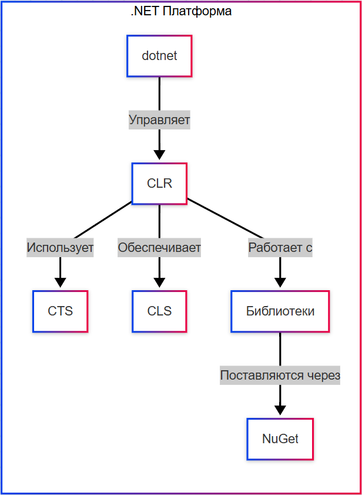

import LanguageIntroPlay from '@site/src/components/LanguageIntroPlay.jsx';
import DotNetEcosystemPlay from '@site/src/components/DotNetEcosystemPlay.jsx';

# Платформа .NET

<div class="article-tags">
  <span class="tag tag-required">ОБЯЗАТЕЛЬНО</span>
  <span class="tag tag-beginner">ДЛЯ НОВИЧКОВ</span>
</div>

<span class="complexity-badge">Разработчику</span>
<span class="complexity-badge">Архитектору</span>

<LanguageIntroPlay topic="dotnet" />

<DotNetEcosystemPlay variant="platform" />

---

## Платформа .NET

### Что такое .NET?

Платформа **.NET** (произносится как *"дотнет"*) — это целостная программная платформа, предназначенная для создания, компиляции, развертывания и выполнения приложений. Она охватывает все необходимые уровни инфраструктуры: от компиляторов и среды выполнения до стандартных библиотек и инструментов сборки. Главной её особенностью является поддержка множества языков при сохранении единообразного подхода к архитектуре, безопасности, управлению памятью и взаимодействию между компонентами.

В отличие от простых наборов библиотек или фреймворков, .NET задаёт фундаментальные правила того, *как* код должен быть организован, *как* он должен компилироваться, *как* исполняться и *как* обеспечивать совместимость между различными частями системы и различными языками. Это делает .NET **архитектурной основой**, на которой строятся приложения любого масштаба — от консольных утилит и веб-сервисов до распределённых корпоративных систем и микросервисных архитектур.

Существует несколько реализаций платформы, но современная — и рекомендуемая к использованию — это **.NET 5 и выше** (сейчас актуальна версия .NET 10, но обозначение версий после .NET 5 сохраняется в формате ".NET X", где X — номер). Эта реализация объединила в себе лучшие черты предыдущих поколений — .NET Framework и .NET Core — и представляет собой единую, открытую, кроссплатформенную, высокопроизводительную и масштабируемую платформу.

Для понимания масштаба и возможностей, стоит кратко упомянуть основные технологические блоки, которые традиционно ассоциируются с .NET и которые продолжают развиваться в рамках современного стека:

- **WinForms** и **WPF** — фреймворки для построения настольных приложений с графическим интерфейсом под Windows. WinForms — это упрощённая, но проверенная временем модель с событийно-ориентированной архитектурой; WPF — более мощная система, основанная на XAML и поддерживающая сложные визуальные сценарии, привязки данных и шаблоны.
- **ASP.NET Core** — центральный фреймворк для создания веб-приложений и сервисов. Он поддерживает как классические MVC-приложения с HTML-рендерингом, так и RESTful API, gRPC-сервисы, реального времени через SignalR, а также интеграцию с современными фронтенд-фреймворками.
- **Entity Framework Core** — объектно-реляционный маппер (ORM), позволяющий работать с реляционными базами данных через объектную модель. Он освобождает разработчика от ручного написания SQL-запросов в большинстве типовых сценариев, обеспечивая при этом строгую типизацию, проверку на этапе компиляции и миграции структуры базы.
- **gRPC** — современный фреймворк удалённых вызовов процедур, встроенный в .NET. Он использует HTTP/2 и Protocol Buffers, обеспечивая высокую производительность и строгую контрактную модель взаимодействия между сервисами. В отличие от устаревшего WCF, gRPC проектируется под распределённые системы и облачные среды.
- **MAUI (.NET Multi-platform App UI)** — развившийся из Xamarin фреймворк для кроссплатформенной разработки мобильных и настольных приложений с единым кодом. Позволяет создавать нативные по внешнему виду и поведению приложения для Windows, macOS, Android и iOS.

Все эти технологии — *компоненты*, встроенные в единую экосистему .NET и опирающиеся на её ядро: среду выполнения, систему типов, стандартные библиотеки и инструменты сборки.

---

### Архитектура платформы .NET

Архитектура .NET построена по принципу **многоуровневой инкапсуляции**, где каждый уровень отвечает за чётко определённую задачу и скрывает сложность от вышестоящих уровней. В основе этой иерархии лежит **Common Language Infrastructure (CLI)** — открытая спецификакация, описывающая, как код должен быть представлен, компилирован и выполнен независимо от языка и операционной системы.

CLI — это практическая основа реализации. Она определяет формат исполняемых файлов (.exe и .dll в виде *сборок*), модель метаданных, промежуточный язык и правила взаимодействия между компонентами.

```text
язык (C#, F#, VB) → компилятор → CIL в сборке (.dll/.exe)
                              ↓
                         CLR: загрузка, GC, JIT → машинный код ОС
```

<div class="callout callout--info">
  <div class="callout-title">Среда выполнения .NET</div>

  <div class="callout-body">
  CLR — <a href="https://ru.wikipedia.org/wiki/%D0%A1%D1%80%D0%B5%D0%B4%D0%B0_%D0%B2%D1%8B%D0%BF%D0%BE%D0%BB%D0%BD%D0%B5%D0%BD%D0%B8%D1%8F">среда выполнения</a> в смысле платформы: загрузка сборок, JIT, <a href="/encyclopedia/4-code-dev/4-06-arhitektura-vypolneniya/1">сборка мусора</a>, BCL как <a href="https://ru.wikipedia.org/wiki/%D0%91%D0%B8%D0%B1%D0%BB%D0%B8%D0%BE%D1%82%D0%B5%D0%BA%D0%B0_%D1%81%D1%80%D0%B5%D0%B4%D1%8B_%D0%B2%D1%8B%D0%BF%D0%BE%D0%BB%D0%BD%D0%B5%D0%BD%D0%B8%D1%8F">библиотека среды выполнения</a>. CIL — <a href="/encyclopedia/4-code-dev/4-03-vypolnenie-koda/314">промежуточное представление</a>; AOT — <a href="https://ru.wikipedia.org/wiki/AOT-%D0%BA%D0%BE%D0%BC%D0%BF%D0%B8%D0%BB%D1%8F%D1%86%D0%B8%D1%8F">Native AOT</a> и ReadyToRun в современных SDK.
</div>
</div>

| Слой | Что даёт разработчику |
|------|------------------------|
| CIL | Один формат для всех .NET-языков |
| CLR | Память, потоки, безопасность типов, JIT | Именно благодаря CLI разные языки — C#, F#, visual-basic, даже Rust через проекты вроде *C# for Rust* — могут компилироваться в один и тот же формат и совместно использоваться в одном приложении.

Ключевым элементом CLI является **Common Intermediate Language (CIL)** — платформенно-независимый байткод, в который транслируется исходный код на любом поддерживаемом .NET-языке. Ранее этот язык назывался MSIL (Microsoft Intermediate Language), но после открытия исходного кода и стандартизации под ECMA название было унифицировано до CIL. Код на CIL не является машинным: он не привязан ни к конкретному процессору, ни к операционной системе. Это позволяет одной и той же сборке выполняться на Windows, Linux или macOS без перекомпиляции.

Выполнение CIL-кода обеспечивает **Common Language Runtime (CLR)** — ядро среды выполнения .NET. CLR запускается вместе с приложением и управляет всем жизненным циклом программы. Его обязанности включают:

- Загрузку и проверку сборок (в том числе проверку цифровых подписей и разрешений);
- Управление памятью через механизм **сборки мусора (Garbage Collection)**, исключающий необходимость ручного освобождения памяти и предотвращающий большинство классических ошибок, таких как утечки или использование освобождённой памяти;
- Безопасное исполнение кода — изоляция доменов приложений (хотя в современном .NET домены приложений упразднены в пользу процессной изоляции), проверка типобезопасности, поддержка кодового доступа (Code Access Security, хотя в .NET Core+ этот механизм упрощён);
- Поддержку параллелизма и асинхронности через пулы потоков, async/await и высокоуровневые абстракции вроде `Task` и `ValueTask`;
- JIT-компиляцию — ключевой процесс, при котором CIL-код преобразуется *в момент выполнения* в нативный машинный код, оптимизированный под текущую архитектуру процессора и режим работы приложения.

JIT (Just-In-Time) — это не просто транслятор. Он проводит анализ использования кода, применяет профилирование методов (Tiered Compilation), кэширует скомпилированный результат и может даже выполнять *перекомпиляцию* "горячих" методов с более агрессивными оптимизациями во время работы приложения. В некоторых сценариях (например, в AOT-сборке через Native AOT или в Xamarin/iOS) JIT заменяется на AOT (Ahead-Of-Time) компиляцию — CIL преобразуется в нативный код *до* запуска, что уменьшает задержки старта и объём используемой памяти.

Важно отметить, что в современном .NET среда выполнения носит название **CoreCLR**, но для разработчика различия между CLR и CoreCLR прозрачны — поведение стандартизировано, и API остаётся стабильным.

---

### Система типов и совместимость

Платформа .NET опирается на **Common Type System (CTS)** — формальную модель, описывающую, какие типы могут существовать, как они устроены, как взаимодействуют и как преобразуются. CTS обеспечивает единообразие: целое число `int` в C# — это тот же `Int32`, что и `Integer` в visual-basic или `int` в F#. Все они представляют один и тот же тип в CLR и хранятся в памяти одинаково.

CTS выделяет два основных класса типов:

- **Значимые типы (value types)** — структуры фиксированного размера, которые хранятся непосредственно в стеке (или в составе объекта, если являются полями ссылочного типа). К ним относятся примитивы (`int`, `bool`, `char`), перечисления и пользовательские `struct`.
- **Ссылочные типы (reference types)** — объекты, размещаемые в управляемой куче. Переменная такого типа содержит *ссылку* (аналог указателя, но безопасную и контролируемую CLR) на область памяти, где лежат данные. К ним относятся классы, массивы, строки, делегаты.

CTS гарантирует, что любые два типа, совместимые по структуре и поведению, могут быть использованы взаимозаменяемо независимо от языка, на котором они определены. Это делает возможной разработку, скажем, доменной логики на F#, интерфейса — на C#, а тестов — на visual-basic, без потери типобезопасности.

Для обеспечения межъязыковой совместимости существует также **Common Language Specification (CLS)** — подмножество CTS, определяющее минимальный набор правил, которым должен следовать код, чтобы быть *гарантированно* используемым из любого CLS-совместимого языка. Например, CLS запрещает перегрузку методов только по регистру возвращаемого типа или использованию не-CLS-совместимых примитивов вроде `unsigned int` в публичных API. Большинство библиотек .NET и .NET SDK строго следуют CLS в публичных интерфейсах.

---

### Библиотеки и экосистема

Ядро платформы — это лишь основа. Реальная выразительность и производительность достигаются за счёт **стандартных библиотек**, поставляемых вместе с .NET. В современном .NET они объединены в **.NET Standard Library**, которая эволюционировала в **.NET 5+ Base Class Library (BCL)**.

BCL охватывает десятки тысяч классов, организованных в пространства имён: `System`, `System.Collections`, `System.IO`, `System.Net`, `System.Threading`, `System.Linq`, `System.Text.Json` и многие другие. Это *фундаментальная инфраструктура*, сквозь которую проходит почти каждый .NET-проект. Например, работа с файлами — использование `FileStream`, `StreamReader`, `DirectoryInfo` — унифицированных абстракций, одинаковых на всех поддерживаемых ОС.

Кроме BCL, платформа включает **расширенные библиотеки**, такие как `System.Text.Json` для сериализации, `Microsoft.Extensions` для расширяемости и внедрения зависимостей, `System.Net.Http` для HTTP-клиентов и т. д. Эти компоненты поставляются как часть SDK и не требуют дополнительной установки.

Для расширения функциональности за пределы стандартного набора используется **NuGet** — официальный менеджер пакетов .NET. Это централизованный репозиторий, содержащий миллионы библиотек: от логгеров (Serilog, NLog) и ORM (Dapper, NHibernate) до UI-фреймворков (Avalonia), тестовых фреймворков (xUnit, NUnit) и инструментов DevOps (Spectre.Console, CommandLineUtils). Установка пакета — это декларативное указание зависимости в файле проекта (`*.csproj`). Система сборки сама разрешает транзитивные зависимости, проверяет версии и гарантирует воспроизводимость сборки.

---



На схеме выше отражена логическая структура платформы. 

- Исходный код на любом CLS-совместимом языке компилируется в CIL и метаданные, упакованные в сборку (EXE или DLL);
- Сборка загружается средой выполнения (CLR/CoreCLR);
- CLR использует JIT-компилятор для преобразования CIL в нативный код;
- Нативный код исполняется под управлением CLR, который обеспечивает сборку мусора, безопасность, обработку исключений и интеграцию с ОС;
- Приложение использует BCL и сторонние библиотеки из NuGet для реализации бизнес-логики.

Таким образом, платформа .NET — это **целостная вычислительная среда**, спроектированная для обеспечения производительности, безопасности, переносимости и долгосрочной поддержки. Её сила — в стандартизации, открытости и глубокой интеграции всех компонентов, позволяющей разработчику сосредоточиться на решении предметной задачи, не отвлекаясь на инфраструктурные сложности.

---

## Жизненный цикл приложения в .NET

Разработка на .NET начинается с формирования **проекта** — описания программной единицы в виде XML-файла (обычно `*.csproj` для C#). Этот файл содержит метаданные, определяющие:

- какая версия .NET используется (`TargetFramework` или `TargetFrameworks`);
- какие зависимости подключены — как из BCL, так и из NuGet;
- какие ресурсы включены (изображения, локализованные строки, конфигурации);
- какие шаги выполняются при сборке (pre-build/post-build события);
- как приложение будет развёрнуто (тип развёртывания, целевая ОС и архитектура).

Сборка (build) — это централизованный, детерминированный процесс, управляемый **.NET SDK** (Software Разработка Kit). SDK включает в себя:

- компиляторы (Roslyn для C# и VB, F# Compiler);
- инструменты сборки (`dotnet build`, `dotnet publish`);

```bash
dotnet build
```
- генераторы кода (source generators);
- средства для тестирования (`dotnet test`);
- утилиты для управления пакетами и проектами (`dotnet add package`, `dotnet new`);

```bash
dotnet add package
```
- интеграцию с системами CI/CD.

Важно понимать: **SDK ≠ runtime**.  
- **SDK** требуется только разработчику — для компиляции, тестирования и публикации.  
- **Runtime** (например, `Microsoft.NETCore.App`) — это минимальный набор компонентов, необходимых для *выполнения* уже собранного приложения: CLR, BCL, JIT/AOT-движки.

Это разделение позволяет, например, установить на сервер только runtime и развернуть туда приложение без всей инфраструктуры разработки.

Процесс сборки в .NET состоит из нескольких фаз:

1. **Восстановление зависимостей** (`dotnet restore` — хотя сейчас он обычно запускается автоматически при сборке). Система загружает все указанные пакеты NuGet и их транзитивные зависимости, проверяя совместимость версий и целостность.

```bash
dotnet restore
```

2. **Компиляция в CIL**. Код на языке высокого уровня транслируется в CIL и упаковывается в сборку (`.dll`). Каждый проект даёт одну сборку. При этом метаданные (типы, методы, атрибуты, зависимости) записываются рядом с CIL-кодом в едином двоичном формате — PE/COFF (для Windows) или ELF (для Linux/macOS).

3. **Оптимизация и анализ**. Roslyn проводит статический анализ: проверку типов, обнаружение неиспользуемых переменных, анализ null-безопасности (если включено), и генерацию предупреждений/ошибок. Это происходит *до* выполнения и повышает надёжность кода.

4. **Генерация итогового выходного артефакта** — либо отладочного (`.dll` + `.pdb`), либо готового к развёртыванию (при `dotnet publish`).

```bash
dotnet publish
```

Публикация (`dotnet publish`) — ключевой этап, определяющий, *как* приложение будет доставлено и запущено. Здесь проявляется одно из главных архитектурных преимуществ .NET: гибкость развёртывания.

```bash
dotnet publish
```

---

### Модели развёртывания — Framework-Dependent и Self-Contained

Существует два основных режима публикации приложения:

---

#### 1. Framework-Dependent Deployment (FDD)

Приложение компилируется только в CIL-сборку (`.dll`) и требует наличия совместимой версии .NET runtime на целевой машине.  

Преимущества:
- минимальный размер артефакта (обычно от 50 КБ до нескольких МБ);
- обновления runtime (включая исправления безопасности и производительности) доставляются отдельно через системные механизмы;
- общая память runtime может совместно использоваться несколькими приложениями.

Недостатки:
- требуется предварительная установка runtime нужной версии;
- возможны конфликты, если на машине несколько runtime-версий, а приложение не указало явно, какую использовать.

В FDD режиме исполняемый файл (`.exe` на Windows) — это лишь *запускатель*: лёгкая обёртка, которая инициирует загрузку `dotnet.exe` и передаёт ему путь к `.dll` сборке.

---

#### 2. Self-Contained Deployment (SCD)

Приложение публикуется *вместе с полной копией нужного .NET runtime*, специфичного для целевой операционной системы и архитектуры процессора.

Преимущества:
- полная изоляция: приложение не зависит от установленных на машине runtime-версий;
- гарантия совместимости: разработчик точно знает, с какой версией runtime будет работать приложение;
- упрощённое развёртывание в изолированных средах (Docker, air-gapped сети, embedded-устройства).

Недостатки:
- значительный размер (обычно от 50 до 150 МБ);
- необходимость отдельных сборок для каждой ОС/архитектуры;
- обновления безопасности требуют пересборки и переразвёртывания всего приложения.

SCD особенно важен в контейнеризации. Например, в Dockerfile для .NET-приложения часто используется двухступенчатая сборка: на первом этапе — сборка с SDK, на втором — копирование только SCD-артефакта в минимальный образ `scratch` или `alpine`.

Для управления целевой платформой используется **RID (Runtime Identifier)** — строковый идентификатор вида `win-x64`, `linux-arm64`, `osx-x64`. RID указывается явно при публикации:  
```bash
dotnet publish -r linux-arm64 --self-contained true
```

Платформа .NET поддерживает десятки RID, включая специфичные (например, `linux-musl-x64` для Alpine Linux).

---

### Целевые фреймворки и совместимость

Ключевой элемент проекта — `TargetFramework` (или `TargetFrameworks` для мультицелевой сборки). Это не просто версия — это *контракт совместимости*.

Примеры:
- `net8.0` — приложение, ориентированное на .NET 8, использует весь доступный API;
- `net8.0-windows` — то же, но с доступом к Windows-специфичным API (WinForms, WPF, P/Invoke в Win32);
- `netstandard2.0` — библиотека, совместимая со всеми реализациями, которые поддерживают .NET Standard 2.0 (.NET Framework 4.6.1+, .NET Core 2.0+, Mono и др.).

`.NET Standard` — это *интерфейс*, а не реализация. Он определяет минимальный набор API, который должна поддерживать любая платформа, претендующая на совместимость. Благодаря ему можно писать библиотеки один раз — и использовать их в .NET Framework, Unity, Xamarin, .NET и т.д.

Однако с выходом .NET 5+ необходимость в .NET Standard постепенно снижается: современный .NET сам по себе кроссплатформенен, и большинство библиотек теперь ориентируются на `netX.0` напрямую. .NET Standard остаётся важным только для поддержки устаревших сред (в первую очередь — .NET Framework).

Мультитаргетинг (`TargetFrameworks`) позволяет одной и той же кодовой базой собирать несколько версий библиотеки:
```xml
<TargetFrameworks>net6.0;net8.0;netstandard2.1</TargetFrameworks>
```
Внутри кода можно использовать условную компиляцию:
```csharp
#if NET8_0_OR_GREATER
    // Современный API, например, System.Text.Json source generators
#elif NETSTANDARD2_1
    // Совместимый, но менее эффективный вариант
#endif
```

Это обеспечивает постепенный переход и поддержку широкого круга потребителей без дублирования проектов.

---

### Взаимодействие с операционной системой

Несмотря на высокий уровень абстракции, .NET не изолирует приложение от ОС полностью. Наоборот — он *облегчает* безопасное и переносимое взаимодействие.

---

#### Уровни интеграции —

1. **Через BCL** — стандартные классы (`File`, `Process`, `Environment`, `HttpClient`) уже инкапсулируют различия между ОС. Например, `Path.Combine("a", "b")` выдаст `a\b` на Windows и `a/b` на Linux — без участия разработчика.

2. **Через RuntimeInformation** — класс `System.Runtime.InteropServices.RuntimeInformation` позволяет программно определить ОС, архитектуру и версию runtime:
```csharp
   if (RuntimeInformation.IsOSPlatform(OSPlatform.Linux))
   {
       // Запустить специфичную логику
   }
```

3. **Через P/Invoke (Platform Invocation Services)** — механизм вызова нативных функций из динамических библиотек ОС (`kernel32.dll`, `libc.so`, `libSystem.dylib`). .NET генерирует необходимые маршаллинги автоматически или позволяет задать их вручную через атрибуты `[DllImport]`. Это используется, например, для доступа к низкоуровневым API: мониторинга ресурсов, работы с шинами (USB, I2C), специфичных криптографических операций.

4. **Через Source Generators и интероп-библиотеки** — современный подход. Вместо ручного написания P/Invoke-сигнатур можно использовать такие проекты, как:
   - `Microsoft.Windows.CsWin32` — генерирует безопасные C#-обёртки для Win32 API на основе метаданных;
   - `Tmds.LibC` — предоставляет типизированные вызовы libc;
   - `Avalonia` или `SkiaSharp` — кроссплатформенные UI/графические библиотеки, скрывающие нативные детали.

.NET не препятствует доступу к "железу" — он делает его *управляемым*. Даже при работе с указателями (`unsafe`-код, `Span<T>`, `Memory<T>`) среда выполнения сохраняет контроль: проверяет границы, предотвращает доступ к чужой памяти и интегрирует такие участки в общий цикл сборки мусора.

---

### Безопасность и изоляция

Безопасность в .NET реализована на нескольких уровнях:

- **Типобезопасность** — проверяется на этапе компиляции (Roslyn) и при загрузке сборки (CLR). Невозможно, например, привести `string` к `FileStream` без явного приведения или рефлексии.
- **Песочница (sandboxing)** — хотя в .NET Core+ упразднены домены приложений, изоляция достигается через:
  - отдельные процессы (часто — в Docker-контейнерах);
  - ограниченные права пользователя ОС;
  - использование `AssemblyLoadContext` для динамической загрузки и выгрузки сборок с контролем зависимостей.
- **Защита от переполнения буфера** — `Span<T>`, `Memory<T>`, `ArrayPool<T>` и другие конструкции позволяют работать с памятью эффективно, но без риска выхода за границы.
- **Криптография** — встроенные классы (`Aes`, `Rsa`, `CertificateRequest`) используют нативные провайдеры ОС (CNG на Windows, Security Framework на macOS, OpenSSL на Linux), обеспечивая соответствие стандартам и защиту от side-channel атак.

---

## Производительность и модели выполнения в .NET

Производительность в .NET — это результат продуманной архитектуры, охватывающей всё: от компилятора и runtime до библиотек и инструментов профилирования. Платформа предоставляет *диапазон стратегий* выполнения, позволяя выбирать оптимальный баланс между временем запуска, потреблением памяти, скоростью выполнения и предсказуемостью поведения.

Ключевой принцип — **адаптивность**. Среда выполнения не предполагает единого сценария для всех приложений. Веб-сервис, ожидающий тысячи запросов в секунду, требует иной стратегии, чем утилита командной строки, запускаемая раз в день, или встраиваемое приложение с ограничениями по памяти. .NET поддерживает эту гибкость через несколько взаимодополняющих механизмов.

---

### JIT-компиляция и Tiered Compilation

Как уже упоминалось, стандартный режим выполнения — **Just-In-Time (JIT) компиляция**: CIL-код преобразуется в нативный *в момент первого вызова метода*. Это даёт два главных преимущества:

1. **Оптимизация под конкретное "железо"** — JIT знает точную модель CPU, поддерживаемые инструкции (AVX2, BMI2 и т.д.), и может генерировать максимально эффективный код.
2. **Адаптация под профиль нагрузки** — среда может наблюдать, какие методы вызываются часто ("горячие"), а какие — редко ("холодные"), и применять разные уровни оптимизации.

Этот подход реализован в виде **Tiered Compilation (многоуровневой компиляции)**, введённой в .NET Core 3.0 и усовершенствованной в .NET 5+.

Механизм работает следующим образом:

- При первом вызове метода JIT генерирует **Tier 0** — быстро скомпилированный, но минимально оптимизированный код. Цель — снизить задержку старта (time-to-first-request в веб-приложениях).
- Если метод вызывается многократно (порог задаётся эвристически или через настройки), JIT *перекомпилируёт* его в **Tier 1** — с полным набором оптимизаций: встраивание (inlining), развёртывание циклов, оптимизация регистров, векторизация.
- В .NET 7+ появился **Quick JIT** — ещё более лёгкий режим для *очень* холодных методов (например, обработка исключений), позволяющий снизить overhead JIT-компиляции почти до нуля.

Это означает, что .NET *сам* адаптируется под нагрузку: при старте — быстро, при устойчивой работе — максимально эффективно. Разработчику не нужно вручную решать, "оптимизировать ли ради скорости старта или ради пиковой производительности" — платформа делает это динамически.

Для контроля над поведением используются параметры хостинга (через `DOTNET_`-переменные окружения или `runtimeconfig.json`):
- `DOTNET_TieredCompilation` — включить/выключить многоуровневую компиляцию (по умолчанию `true`);
- `DOTNET_TC_QuickJit` — включить быструю JIT для Tier 0 (по умолчанию `true`);
- `DOTNET_TC_QuickJitForLoops` — расширить Quick JIT на методы с циклами (по умолчанию `false`, т.к. может снизить оптимизацию "горячих" циклов).

---

### Предварительная компиляция — NGen, ReadyToRun и Native AOT

По умолчанию IL компилируется **JIT** при первом вызове метода. Чтобы сократить задержку старта, платформа предлагает компиляцию **до** или **во время** публикации:

| Подход | Платформа | Суть |
|--------|-----------|------|
| **NGen** (`ngen.exe`, native images) | .NET Framework | IL заранее переводится в машинный код в кэш ОС; для новых проектов не используется |
| **ReadyToRun** (R2R, `PublishReadyToRun`) | .NET Core 3+ | при `dotnet publish` часть сборок получает нативные образы; JIT остаётся для остального кода |
| **Native AOT** (`PublishAot`) | .NET 7+ | статический исполняемый файл без JIT; ограничения на рефлексию и динамическую генерацию |

Цепочка эволюции: ускорение cold start в Framework (NGen) → гибрид R2R в кроссплатформенном .NET → полный AOT для serverless, CLI и embedded. См. [Версии C# и .NET](../5-05-csharp/48.md) и `PublishReadyToRun` в [справочнике конфигураций](../5-05-csharp/101.md).

---

### Native AOT

Для сценариев, где время старта и потребление памяти критичны (мобильные приложения, serverless-функции, IoT, CLI-утилиты), .NET предлагает **Native AOT (Ahead-Of-Time)** — компиляцию *всего* приложения в статически связанный нативный исполняемый файл *до* его запуска.

В отличие от JIT (или даже от SCD с JIT), Native AOT:

- **Полностью исключает этап JIT-компиляции** — приложение запускается как обычный нативный бинарник;
- **Уменьшает потребление памяти** — нет необходимости хранить CIL, метаданные, JIT-код кэш;
- **Ускоряет холодный старт** — от 10 мс до `<`1 мс в типичных случаях;
- **Повышает предсказуемость** — нет "пауз" JIT во время выполнения.

Однако Native AOT накладывает ограничения, вытекающие из природы статической компиляции:

- **Недоступна динамическая генерация кода** — `System.Reflection.Emit`, `Expression.Compile()`, большинство source generator’ов работают только на этапе *сборки*, но не во время выполнения;
- **Ограниченная поддержка рефлексии** — только статически анализируемые вызовы (те, которые можно обнаружить при компиляции). Динамическое `Type.GetType("SomeType")` требует явного указания в конфигурации;
- **Нет поддержки некоторых библиотек**, опирающихся на runtime-кодогенерацию (например, старые версии Newtonsoft.Json без source generator’ов).

Эти ограничения отражают *другую модель проектирования*: Native AOT ориентирован на приложения с чётко определённой структурой, где вся логика известна на этапе сборки — что характерно для большинства современных архитектур (чистые функции, DI-контейнеры с compile-time binding, генерация сериализаторов в source generator’ах).

Microsoft активно инвестирует в Native AOT: начиная с .NET 7, он вышел из экспериментального статуса, а в .NET 8 получил поддержку в ASP.NET Core (ограниченную, но достаточную для многих микросервисов), Blazor WebAssembly и MAUI. Проекты вроде **.NET Aspire** используют его для снижения затрат на запуск сервисов в облачных окружениях.

Компиляция в Native AOT осуществляется через `dotnet publish` с флагом:
```bash
dotnet publish -r win-x64 --self-contained true /p:PublishAot=true
```

Результат — один исполняемый файл (без зависимостей), запускаемый даже без установленного .NET runtime.

---

### Управление памятью

Сборка мусора (Garbage Collection, GC) — один из столпов .NET. Она реализует сложную, самоадаптирующуюся стратегию, учитывающую тип приложения, объём памяти и шаблон использования.

В современном .NET GC поддерживает три режима:

| Режим | Используется в | Особенности |
|------|----------------|-------------|
| **Workstation GC** | Настольные приложения, CLI-утилиты | Оптимизирован для отклика: короткие паузы, фоновая сборка поколения 2 |
| **Server GC** | Веб-сервисы, серверные приложения | Несколько потоков GC (по одному на ядро), агрессивная сборка, большие кучи, минимизация overhead’а в ущерб latency |
| **Concurrent GC** | По умолчанию в Workstation | Сборка поколения 2 в фоновом потоке, без полной остановки приложения |

Начиная с .NET 6, GC получил **динамическую адаптацию**: при увеличении нагрузки Server GC может автоматически переключаться в более агрессивные стратегии (например, ускорять частоту сборок при обнаружении быстрого заполнения поколения 0).

Но производительность — это не только GC. Критически важен **allocation pressure** — объём памяти, выделяемой за единицу времени. Каждое распределение — это потенциальный триггер GC, даже если объект живёт недолго.

Для снижения этого давления .NET предоставляет мощные инструменты:

- `Span<T>` и `ReadOnlySpan<T>` — стековые (или на основе существующего массива) представления непрерывных областей памяти. Они позволяют работать с буферами, строками, байтами — без выделения кучи. Например, `Span<byte> buffer = stackalloc byte[256]` создаёт буфер *в стеке*, а не в куче.
- `Memory<T>` и `ReadOnlyMemory<T>` — аналог для случаев, когда данные должны жить дольше, чем стековый фрейм (например, передача в async-методы).
- `ArrayPool<T>` — пул массивов, позволяющий переиспользовать буферы вместо постоянного создания новых.
- Source generators для сериализации — например, в `System.Text.Json` можно сгенерировать сериализатор *во время сборки*, устранив рефлексию и выделение памяти при каждом вызове.

Эти механизмы позволяют писать **allocation-free** (или near-allocation-free) код — особенно важно для hot path’ов: сетевых обработчиков, парсеров, игровых циклов.

---

### Диагностика и профилирование

Производительность нельзя улучшить, не измерив. .NET включает в себя богатый набор встроенных инструментов диагностики — без необходимости подключения внешних профайлеров.

---

#### Встроенные события и метрики

- **EventCounters** — лёгковесные счётчики производительности (CPU, GC, потоки, исключения), доступные через `dotnet-counters`:
```bash
  dotnet-counters monitor --process-id 12345 System.Runtime
```

- **DiagnosticSource и Activity** — механизм трассировки кода "изнутри". Любой компонент (HTTP-клиент, EF Core, ASP.NET) может генерировать события: начало/конец запроса, SQL-запрос, зависимость. Эти события собираются трейсерами (OpenTelemetry, Application Insights) для построения distributed tracing.

- **EventPipe** — высокопроизводительный канал телеметрии, заменивший устаревший ETW/PerfView на Linux/macOS. Используется `dotnet-trace`, `dotnet-monitor`, `dotnet-dump`.

---

#### Инструменты командной строки

- `dotnet-trace` — запись событий runtime и приложения в `.nettrace`-файл для последующего анализа в PerfView или VS.
- `dotnet-dump` — создание дампа управляемой памяти (даже без отладчика), анализ объектов, стеков, блокировок.
- `dotnet-gcdump` — дамп *только* графа достижимых объектов для анализа утечек памяти.
- `dotnet-monitor` — HTTP-сервер, предоставляющий метрики, трассировки и дампы по запросу (идеален для Kubernetes).

---

#### Интеграция с OpenTelemetry

.NET имеет нативную поддержку OpenTelemetry — отраслевого стандарта для наблюдаемости. `ActivitySource`, `Meter`, `ILogger` интегрируются с `OpenTelemetry.Exporter.Console`, `Jaeger`, `Zipkin`, `Prometheus`, `Grafana`, позволяя собирать:

- Логи (structured logging через `ILogger<T>`);
- Метрики (например, `Histogram<double>` для времени ответа);
- Трассировки (цепочки вызовов между микросервисами).

Это превращает .NET-приложение в "наблюдаемое из коробки", без кастомных решений.

---

{/* http-basics-link  */}
<div class="callout callout--tip">
  <div class="callout-title">Основа по протоколу</div>

  <div class="callout-body">
  Базовый разбор HTTP и HTTPS находится в отдельной статье — [HTTP как основа веб-интеграций](/encyclopedia/2-system-network/2-09-osnovy-integratsionnogo-vzaimodeystviya/118).
</div>
  </div>


