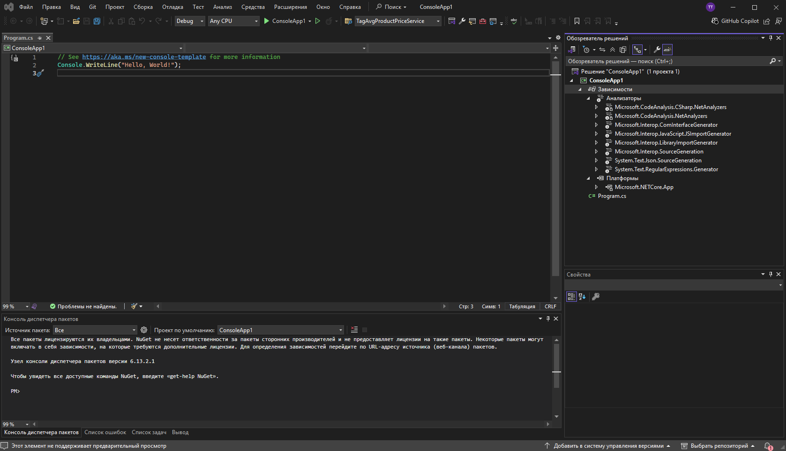

# Инструменты разработки для .NET

<div class="article-tags">
  <span class="tag tag-required">ОБЯЗАТЕЛЬНО</span>
  <span class="tag tag-beginner">ДЛЯ НОВИЧКОВ</span>
  <span class="tag tag-inprogress">В РАЗРАБОТКЕ</span>
</div>

<span class="complexity-badge">Разработчику</span>
<span class="complexity-badge">Архитектору</span>

## Инструменты и среда разработки .NET  

### Часть 1. Обзор инструментария и архитектурные основы

Разработка программного обеспечения на платформе .NET возможна в самых разных условиях: от лёгкого редактирования в терминале до создания многокомпонентных корпоративных решений с визуальными проектировщиками, отладкой в реальном времени и интеграцией с облачными сервисами. Ключевым фактором, определяющим выбор инструментов, является техническая природа задачи и контекст: размер команды, этап жизненного цикла продукта, требования к документированию, поддержке и развёртыванию. В этой главе рассматривается комплекс инструментов, формирующих современную среду разработки .NET, с акцентом на их взаимосвязь, историческую эволюцию и практическое применение.

#### Три уровня инструментария .NET

Все доступные средства разработки можно условно разделить на три уровня:

1. **Командная строка и кроссплатформенные CLI-инструменты** — минимальный, но достаточный набор, реализованный в виде `dotnet` SDK. Этот уровень не зависит от операционной системы, не требует установки тяжёлой IDE и поддерживает полный цикл: создание проекта, сборку, запуск, тестирование, пакетирование и публикацию. Он лежит в основе всех других инструментов и является единой точкой согласования поведения во всей экосистеме.

2. **Редакторы кода с расширениями** — такие как Visual Studio Code (VS Code) и JetBrains Rider. Это компромисс между лёгкостью и функциональностью. Они не предоставляют визуальных дизайнеров, но за счёт интеллектуальных расширений (IntelliSense, анализ кода, поддержка отладки, интеграция с Git и NuGet) позволяют эффективно работать с любыми типами приложений — от микросервисов до мобильных решений.

3. **Полнофункциональные интегрированные среды разработки (IDE)** — прежде всего Microsoft Visual Studio. Это наиболее мощный слой, объединяющий в едином интерфейсе средства проектирования, отладки, тестирования, развёртывания, управления зависимостями, интеграции с системами контроля версий и CI/CD-инфраструктурой. Visual Studio остаётся центральным инструментом для разработки под Windows, особенно в случаях, где важна визуальная составляющая: десктопные приложения с GUI, сложные веб-интерфейсы, игры на Unity, нативные мобильные приложения через MAUI или Xamarin.

Ни один из уровней не отменяет другой. Напротив, они дополняют друг друга. Разработчик может начинать проект в терминале, перейти к редактированию в VS Code, а затем открыть его в Visual Studio для проектирования интерфейса и отладки производительности — всё это без конфликтов, поскольку форматы проектов стандартизированы.

#### Visual Studio

Microsoft Visual Studio — не просто редактор или отладчик. Это платформа, спроектированная как расширяемая контейнерная среда. С момента выхода Visual Studio .NET (2002 год) архитектура среды была построена вокруг понятий *решение* (solution) и *проект* (project), что позволило организовать работу над сложными системами, включающими десятки и сотни компонентов с различными языками, платформами и зависимостями.

В основе Visual Studio лежит так называемая *shell*-архитектура — ядро среды предоставляет общие сервисы (управление окнами, редактором, отладчиком, настройками), а конкретные технологии (C#, F#, VB.NET, Python, TypeScript) подключаются как *пакеты расширений* (VS Packages). Это означает, что поддержка, например, .NET MAUI или Azure Functions реализуется в виде подключаемых модулей. Такой подход обеспечивает:

- **Гибкость обновлений**: новые языки и фреймворки появляются без необходимости полной пересборки IDE.
- **Изолированность компонентов**: сбой в одном расширении не приводит к остановке всей среды.
- **Модульность установки**: пользователь может выбрать только нужные рабочие нагрузки (workloads), экономя дисковое пространство и время установки.

Visual Studio существует в нескольких редакциях: Community (бесплатная для индивидуальных разработчиков, обучения и открытых проектов), Professional и Enterprise (с расширенными инструментами тестирования, моделирования, архитектурного анализа и интеграции с Azure DevOps). Все они используют единый движок, но различаются набором включённых компонентов и лицензионными ограничениями.

#### Поддерживаемые платформы и технологии

Visual Studio исторически развивалась вместе с платформой .NET, и её возможности напрямую отражают эволюцию экосистемы:

- **.NET Framework** — первая реализация платформы (2002), тесно интегрированная с Windows. Visual Studio долгое время была единственной средой, способной эффективно работать с ним, особенно в части Windows Forms, WPF, ASP.NET Web Forms и WCF.
- **.NET Core** — кроссплатформенное переосмысление .NET (2016). Visual Studio 2017 стала первой версией, полноценно поддерживающей .NET Core, включая отладку на удалённых Linux-хостах.
- **.NET 5+** — унификация .NET Core и .NET Framework в единую платформу. Начиная с Visual Studio 2019 16.8, среда полностью перешла на работу с единой кодовой базой `dotnet` и стандартными SDK-стилями проектов.
- **MAUI (Multi-platform App UI)** — преемник Xamarin.Forms, позволяет создавать нативные приложения для Windows, macOS, iOS и Android из единой кодовой базы. Visual Studio предоставляет редактор XAML и симуляторы устройств, профилировщики потребления памяти и инструменты подписи приложений.
- **UWP (Universal Windows Platform)** — модель приложений для современных версий Windows. Visual Studio включает визуальные конструкторы манифестов, инструменты локализации, проверки соответствия требованиям Microsoft Store.
- **Xbox и .NET для игр** — через интеграцию с Unity и собственные SDK (Xbox Live Creators Program), Visual Studio поддерживает разработку и отладку игр с прямым развёртыванием на консолях.
- **Web-разработка** — от классического ASP.NET до современного Blazor (WebAssembly и Server), включая полную поддержку Razor Pages, SignalR, gRPC и интеграцию с npm, Webpack, Babel через встроенные терминалы и задачи.

Поддержка «родных» (native) и «управляемых» (managed) сценариев в Visual Studio не является формальной. Среда позволяет свободно комбинировать управляемый C#-код с нативными библиотеками на C++, вызывать COM-объекты, использовать P/Invoke, а также разрабатывать смешанные решения через C++/CLI. Отладчик умеет переключаться между уровнями: от исходного C#-кода до машинных инструкций, включая просмотр регистров и стека вызовов на уровне ассемблера.

#### Архитектура проекта

Одним из ключевых достижений экосистемы .NET Core стало радикальное упрощение формата проекта. Старые проекты (на основе .NET Framework) использовали многословный MSBuild-XML с явным перечислением каждого файла и ссылки. Современные `.csproj`-файлы (начиная с .NET Core 1.0, устоялись в .NET 5+) построены по *SDK-style* — они наследуют поведение от общего SDK (`Microsoft.NET.Sdk`), а разработчик указывает лишь отклонения от стандартов.

Пример минимального `.csproj`:

```xml
<Project Sdk="Microsoft.NET.Sdk">
  <PropertyGroup>
    <OutputType>Exe</OutputType>
    <TargetFramework>net8.0</TargetFramework>
    <ImplicitUsings>enable</ImplicitUsings>
    <Nullable>enable</Nullable>
  </PropertyGroup>
</Project>
```

Этот файл говорит:  
— используй стандартный .NET SDK,  
— соберёшь исполняемое приложение (`Exe`),  
— цель — .NET 8,  
— включи неявные `using`-директивы (например, `System`, `System.Collections.Generic`),  
— активируй поддержку nullable-ссылочных типов.

Всё остальное — компиляция, включение всех `.cs`-файлов из папки, резолвинг зависимостей — происходит автоматически. Это чётко определённое поведение MSBuild-целей, включённых из `Microsoft.NET.Sdk`. При необходимости разработчик может явно управлять включением файлов (`<Compile Remove="..." />`), кастомизировать сборку через `<Target>`, настраивать публикацию, ресурсы, локализацию — но по умолчанию всё работает «из коробки».

Такой подход делает проекты легко читаемыми, переносимыми и совместимыми с CLI. Файл `.csproj` — это *декларативное описание жизненного цикла компонента*. Он определяет:
- целевую платформу и версию;
- тип выходного артефакта (библиотека, exe, модуль ASP.NET);
- зависимости от NuGet-пакетов и других проектов;
- условия сборки (Debug/Release);
- поведение при публикации (self-contained, framework-dependent, RID-специфичная сборка);
- параметры генерации документации, XML-сериализации, локализации.

Visual Studio предоставляет графический интерфейс для редактирования `.csproj`. Все изменения, внесённые через UI (добавление ссылки, смена целевой платформы), мгновенно отражаются в XML. И наоборот: редактирование `.csproj` вручную немедленно обновляет состояние в IDE. Это обеспечивает стабильность работы в команде, где часть разработчиков использует IDE, а часть — CLI или VS Code.

### Часть 2. Архитектура интерфейса, управление проектами и редактор кода в Visual Studio

#### Структура интерфейса

Visual Studio — одна из немногих современных IDE, сохранивших *модульно-оконную архитектуру*. В отличие от однооконных редакторов (например, VS Code), где панели фиксированы или складываются в боковые области, Visual Studio строится вокруг *документной области* и *плавающих панелей инструментов*, каждая из которых представляет собой автономный сервис. Это не дань ретроградству — такой подход обусловлен масштабом задач: разработчик может одновременно редактировать XAML-макет, отлаживать фоновый поток в отдельном окне, просматривать диаграмму зависимостей в третьем и смотреть логи в четвёртом — причём все эти окна могут быть развёрнуты на нескольких мониторах.



Ключевые компоненты интерфейса:

- **Обозреватель решений (Solution Explorer)** — *логическое представление* артефактов сборки. Он отображает физические файлы и виртуальные узлы: зависимости NuGet, проектные ссылки, SDK-цели, встроенные ресурсы. Двойной клик по пакету `Newtonsoft.Json` раскроет дерево его содержимого (DLL, XML-документация, содержимое `contentFiles`). Контекстное меню каждого узла предоставляет действия, релевантные его типу: обновление пакета, переход к исходникам (если доступны), анализ использования.

- **Свойства (Properties Window)** — динамически меняется в зависимости от выделенного объекта. При выборе проекта отображает `TargetFramework`, `OutputType`, `PlatformTarget`; при выборе файла `.resx` — локализованные строки; при выборе элемента управления в дизайнере форм — его публичные свойства с поддержкой редактирования через дропдауны, цветовые пикеры, селекторы шрифтов. Все изменения немедленно синхронизируются с исходным кодом (например, `InitializeComponent()` в WinForms или `x:Name` в XAML).

- **Командная панель (Command Window) и окно немедленного выполнения (Immediate Window)** — наследие отладчика уровня исходного кода. В Immediate Window можно вызывать методы, читать и изменять переменные *в процессе остановки отладчика*, в том числе с побочными эффектами. Это мощный инструмент исследования состояния приложения без перезапуска.

- **Вывод (Output)** и **Командная строка разработчика (Developer PowerShell / Terminal)** — *единая шина событий сборки*. Все команды `dotnet build`, `msbuild`, `nuget restore`, вызовы компилятора `csc.exe` — всё попадает сюда с цветовой и временнóй разметкой. Ошибки компиляции кликабельны: щелчёк переходит к строке кода.

Интерфейс Visual Studio конфигурируем через меню и через импорт/экспорт *профилей параметров* (Tools → Import and Export Settings). Это позволяет стандартизировать окружение в команде: единые горячие клавиши, схемы цветов, правила форматирования — без ручной настройки каждого рабочего места.

#### Решения и проекты

В Visual Studio **проект** — это единица сборки: он определяет, *что* и *как* компилируется. Проект содержит `.csproj`, исходные файлы, ресурсы и метаданные зависимостей.

**Решение** (`.sln`) — это *организационная и координационная единица*. Оно не участвует в сборке напрямую, но управляет:

- порядком построения проектов (Build Order);
- конфигурациями сборки на уровне нескольких проектов (например, `Debug-LocalDB` vs `Release-Azure`);
- общими свойствами (например, `SolutionDir`, используемый в MSBuild-скриптах);
- состоянием открытия файлов (какие документы были активны при последнем закрытии).

Файл `.sln` — текстовый, но его структура устарела и не рекомендуется для редактирования вручную. Однако понимание его содержимого полезно: каждая строка `Project("{FAE04EC0…}") = "MyApp", "MyApp\MyApp.csproj", "{GUID}"` связывает GUID проекта с путём. Именно по этим GUID строятся межпроектные ссылки в `.csproj` (`<ProjectReference Include="..\MyLib\MyLib.csproj" />`), что обеспечивает стабильность при переименовании.

Практическая рекомендация:  
— Для библиотек и микросервисов — отдельные решения.  
— Для монолитов или тесно связанных компонентов (например, ядро + хост + тесты) — единое решение с тремя проектами.  
— Никогда не включайте в решение проекты с разными целевыми фреймворками без явной необходимости (например, `.NET 6` и `.NET Framework 4.8` в одном решении требуют отдельных конфигураций и усложняют CI).

#### Редактор кода

Редактор Visual Studio — не блокнот с подсветкой. Это *интерактивная проекция абстрактного синтаксического дерева (AST)*. Каждая лексема кода привязана к семантической модели компилятора Roslyn. Это позволяет:

- **Мгновенно отображать ошибки** ещё до запуска компиляции («красные волнистые линии» — это полноценная проверка типов, доступности членов, потоков данных).
- **Поддерживать сложные рефакторинги**: «извлечение метода» понимает замыкания, захват переменных, тип возвращаемого значения; «переименование» работает по семантической привязке — даже в строковых литералах, если включена опция *Rename in comments and strings*.
- **Визуализировать структуру**: серые пунктирные линии обозначают области свёртки (`#region`, классы, методы); цветные метки в поле навигации (слева от текста) показывают тип члена (метод — фиолетовый, свойство — синий, поле — серый); значки в маргинале — точки останова, предупреждения, TODO-комментарии.

Особое внимание — **навигации по коду**. Помимо классических `Ctrl+Click` (переход к определению) и `Ctrl+Alt+F12` (просмотр без перехода), Visual Studio предоставляет:

- **Go To All (`Ctrl+,`)** — семантический поиск по *именам*, *файлам*, *типам*, *строкам*, *символам*, *ссылкам* — с фильтрами через префиксы (`t:` — типы, `m:` — методы, `f:` — файлы).
- **Call Hierarchy (`Ctrl+K, Ctrl+T`)** — построение дерева вызовов *вглубь* (кто вызывает метод) и *вширь* (кого вызывает метод), с учётом виртуальных переопределений и интерфейсных реализаций.
- **Peek Definition (`Alt+F12`)** — встраивание фрагмента кода определения прямо в текущее окно, без потери контекста.

Эти инструменты не требуют предварительного индексирования — данные берутся из текущей модели Roslyn, обновляемой в фоне по мере редактирования.

#### Управление стилем кода

Visual Studio (начиная с 2017 v15.7) полностью интегрирует поддержку `.editorconfig` — файла, определяющего правила форматирования и анализа кода *на уровне репозитория*. Это  часть кодовой базы, проверяемая на CI.

Пример `.editorconfig`:

```ini
root = true

[*.cs]
indent_style = space
indent_size = 4
csharp_new_line_before_open_brace = all
csharp_prefer_braces = true:suggestion
csharp_style_var_for_built_in_types = false:suggestion
dotnet_diagnostic.CA1001.severity = warning
```

Здесь:
- `indent_style`, `indent_size` — базовые правила отступов (применяются при `Ctrl+K, Ctrl+D` — форматировании документа).
- `csharp_*` — правила стиля C#, реализованные через Roslyn-анализаторы.
- `dotnet_diagnostic.*.severity` — управление уровнем правил из встроенных анализаторов качества кода (FxCop, .NET SDK Analyzers).

Ключевой момент: правила с суффиксом `:suggestion` отображаются как серые пунктирные подчёркивания и предложения в лампочке (`Ctrl+.`), `:warning` — как жёлтые волны, `:error` — как красные (и ломают сборку, если включено `TreatWarningsAsErrors`). Это позволяет постепенно внедрять стандарты: сначала как рекомендации, затем — как обязательные требования.

Visual Studio также поддерживает *кастомные анализаторы* через NuGet-пакеты (например, `StyleCop.Analyzers`, `SonarAnalyzer.CSharp`). После установки они автоматически подключаются к проекту и начинают работать в редакторе и при сборке — без дополнительной настройки.

#### Интеллектуальные средства: IntelliSense, IntelliCode и Copilot

Современный редактор в Visual Studio объединяет три уровня помощи:

1. **IntelliSense (с 1996, для visual-basic)** — контекстное предложение членов, параметров, ключевых слов. Работает на основе:
   - текущего AST (актуальное состояние кода, даже без сохранения);
   - сигнатур методов из метаданных сборок;
   - XML-документации (если подключена);
   - шаблонов фрагментов кода (snippets).

   Особенность: предсказание *семантически корректных* продолжений, а не просто строковых совпадений. Например, после `string.Join(", ", ` IntelliSense предложит только `IEnumerable<string>` или `string[]`, игнорируя `int[]`, если нет неявного преобразования.

2. **IntelliCode (с 2018)** — надстройка на основе машинного обучения. Анализирует миллионы открытых репозиториев и *ваш код*, чтобы:
   - сортировать предложения IntelliSense по *вероятности использования в данном контексте* (часто используемые API — выше);
   - предлагать *целые шаблоны* (например, после `if (list != null && ` — автоматически добавляется `list.Count > 0`);
   - обнаруживать потенциальные антипаттерны (например, `async void` в не-event-обработчиках).

   IntelliCode не требует облачного подключения — обученные модели поставляются в составе расширения.

3. **GitHub Copilot (интеграция через расширение)** — генерация кода на основе комментариев и контекста. В Visual Studio работает как *ассистент реального времени*: при вводе `// parse JSON to User object` Copilot может предложить реализацию с `System.Text.Json`. Важно: Copilot не заменяет IntelliSense — он *дополняет* его, предлагая начальный черновик, который затем уточняется с помощью семантических средств.

Эти слои не конкурируют. Они последовательно активируются: сначала — базовый IntelliSense, поверх — ранжирование IntelliCode, поверх — предложения Copilot. Разработчик сохраняет полный контроль: любое предложение можно принять, отклонить или отредактировать.

#### Создание и исправление кода

Visual Studio предоставляет два подхода к написанию кода:

- **Сверху вниз (top-down)**: начинаем с вызова несуществующего метода или свойства — лампочка (`Ctrl+.`) предложит *сгенерировать заглушку* (с правильной сигнатурой, в нужном классе, с учётом модификаторов доступа). Это позволяет проектировать API до реализации.
- **Снизу вверх (bottom-up)**: пишем логику, затем выделяем фрагмент и через `Ctrl+.` → *Extract Method* создаём метод, автоматически подбирая параметры и возвращаемый тип.

Для исправления ошибок используется *диагностическая модель*: каждая ошибка или предупреждение сопровождается *кодом* (например, `CS0103` — неизвестный идентификатор) и *фиксом* (Fix). Фиксы бывают:
- **Автоматические**: добавление `using`, изменение модификатора доступа, преобразование `var` в явный тип.
- **Полуавтоматические**: «создать поле», «создать метод» — с предзаполнением диалога.
- **Рекомендательные**: «заменить `ArrayList` на `List<T>`», «использовать шаблон `IDisposable`».

Особую ценность представляют *рефакторинги на уровне решения*: «переместить тип в отдельный файл», «синхронизировать имя файла с именем класса», «заменить все вхождения `DateTime.Now` на `DateTime.UtcNow`» — с предварительным просмотром изменений во всех проектах.

---

### Часть 3. Отладка, тестирование, базы данных и развёртывание

#### Отладка

Отладчик Visual Studio — не единственный в своём роде, но единственный, поддерживающий *единый пользовательский интерфейс* для трёх уровней отладки:

1. **Уровень исходного кода (managed debugging)** — для приложений на C#, F#, VB.NET.  
2. **Уровень промежуточного языка (IL debugging)** — редко используется напрямую, но доступен через расширения (например, при анализе сгенерированного кода).  
3. **Уровень машинного кода (native debugging)** — для C++, COM, P/Invoke, смешанных сборок.

Эта трёхслойность реализована через компонент **Visual Studio Debugger (VSD)**, который в реальном времени переключается между *диспетчерами отладки* (debug engines):  
- **Managed Debug Engine** — для .NET, работает через интерфейс ICorDebug из CLR.  
- **Native Debug Engine** — для Win32/64, использует Windows Debug API.  
- **Script Debug Engine** — для JavaScript в браузере или Node.js (включая отладку Blazor WebAssembly через прокси-сервер).

Ключевые возможности, выходящие за рамки «точка останова — шаг — просмотр переменных»:

- **Условные точки останова и действия** — останов только при выполнении условия (`i > 1000`), либо выполнение *действия без останова*: запись в окно вывода (`i = {i}`), вызов макроса, профилирование стека.
- **Историческая отладка (IntelliTrace, Enterprise Edition)** — запись ключевых событий (исключения, вход/выход из методов, изменения переменных) во время выполнения. Позволяет «перемотать назад» после возникновения ошибки, не перезапуская приложение.
- **Отладка параллельных потоков и асинхронного кода** — окна *Threads*, *Parallel Stacks*, *Задачи* визуализируют состояние потоков, стеков вызовов и `async`-цепочек. Можно «закрепить» поток для наблюдения или переключиться на контекст конкретного `Task`.
- **Отладка в удалённых и изолированных средах** — через **Remote Debugger** (отдельный сервис `msvsmon.exe`) возможно подключиться к:
  - Linux-хосту (с отладкой .NET-приложений под .NET 6+);
  - Docker-контейнеру (автоматическое сопоставление путей хоста и контейнера);
  - Azure App Service / VM / AKS (через расширения Cloud Explorer);
  - Xbox / HoloLens / Android-устройству (для MAUI/Xamarin).

Важно: отладка библиотек из NuGet-пакетов возможна, если:
- включена опция *Enable Just My Code* (по умолчанию — да), иначе отладчик зайдёт в чужой код;
- пакет содержит PDB-файлы с *source link* или *embedded sources*;
- настроены серверы символов (например, `https://msdl.microsoft.com/download/symbols` для Microsoft-сборок).

Тогда при входе в метод из `Newtonsoft.Json` можно будет увидеть *реальный исходный код* с GitHub, поставить точки останова и изучить логику — без необходимости скачивать репозиторий вручную.

#### Тестирование

Visual Studio интегрирует тестирование на уровне проекта и решения через **Test Explorer** — централизованный интерфейс для обнаружения, запуска и анализа тестов. Поддержка реализована через *адаптеры тестовых фреймворков*, подключаемые как NuGet-пакеты:

- `MSTest.TestAdapter` — для встроенного MSTest (входит в шаблоны проектов по умолчанию);
- `NUnit3TestAdapter` — для NUnit;
- `xunit.runner.visualstudio` — для xUnit.net.

Адаптеры работают как *посредники* между Test Explorer и фреймворком: они сканируют сборку на наличие тестов, запускают их через `dotnet test`, передают результаты в UI. Это означает, что `dotnet test` и Test Explorer дают идентичные результаты — нет «магии IDE».

Продвинутые сценарии:

- **Покрытие кода (Enterprise Edition)** — *ветвистость* (branch coverage), *влияние на сборку* (impact analysis). Результаты можно экспортировать в Cobertura/ JaCoCo для интеграции в CI.
- **Тесты на основе данных** — `DataRow`, `DynamicData` (xUnit), `TestCaseSource` (NUnit) позволяют параметризовать тесты. Test Explorer отображает каждый запуск как отдельный элемент с входными данными.
- **Производительностные и нагрузочные тесты** — через инструменты *Performance Profiler* (CPU, память, .NET object allocation) и *Load Test* (устаревший, заменён Azure Load Тестирование). Для микросервисов рекомендуется использовать `Microsoft.AspNetCore.Mvc.Тестирование` + `TestServer`.

Тестовые проекты в .NET 6+ создаются с `<Project Sdk="Microsoft.NET.Sdk">`, потому что они — *хосты для запуска тестируемого кода*. Зависимость от тестируемого проекта указывается через `<ProjectReference>` — чтобы обеспечить прямой доступ к internal-членам (при использовании `InternalsVisibleTo`).

#### Работа с базами данных

Visual Studio предоставляет два независимых, но совместимых подхода к работе с БД:

1. **Дизайнеры и инструменты времени разработки**  
   - **SQL Server Object Explorer** — аналог SSMS в составе IDE: просмотр схем, выполнение запросов, профилирование планов.  
   - **Database Project (.sqlproj)** — позволяет описать схему в виде DDL-скриптов, проверить её на ошибки, сгенерировать diff-скрипты для развёртывания.  
   - **Entity Data Model (EDMX)** — устаревший, но поддерживаемый визуальный конструктор для Entity Framework 6 (Database First и Model First).  

2. **Интеграция с Entity Framework Core**  
   EF Core не требует дизайнеров — миграции управляются через CLI (`dotnet ef migrations add`), но Visual Studio добавляет удобство:
   - Команды `Add → New Scaffolded Item` → *EF Core DbContext* генерируют контекст и модели по существующей БД.
   - Окно **Package Manager Console** (PowerShell-хост) позволяет выполнять `Update-Database` без переключения в терминал.
   - При изменении модели и создании миграции Visual Studio автоматически предлагает обновить БД на локальном экземпляре.

Visual Studio обеспечивает *швы между разработкой приложения и управлением схемой*. Например, при генерации контроллера MVC с представлениями (Add → Controller → MVC with views) среда автоматически подключает `DbContext`, создаёт CRUD-запросы и внедряет зависимость — но только если `DbContext` уже зарегистрирован в `Program.cs`.

#### Публикация и развёртывание

Публикация в Visual Studio — это не просто компиляция. Это *процесс преобразования проекта в развёрнутый артефакт*, управляемый через профили публикации (`.pubxml`), хранящиеся в `Properties/PublishProfiles/`.

Типы развёртывания:

- **Framework-Dependent Deployment (FDD)** — приложение публикуется без runtime. Требует предустановленного .NET на целевом хосте. Минимальный размер, общая память для нескольких приложений.
- **Self-Contained Deployment (SCD)** — приложение включает runtime. Гарантирует совместимость версий, но увеличивает размер (≈140 МБ для консольного приложения на .NET 8).
- **Single-file deployment** — упаковка всех DLL, runtime и ресурсов в один EXE. Позволяет распространять «как установщик» без инсталлятора.

Профиль публикации задаёт:
- `RuntimeIdentifier` (например, `win-x64`, `linux-arm64`);
- `PublishSingleFile`, `PublishReadyToRun` (AOT-компиляция для ускорения запуска);
- `SelfContained` (`true`/`false`);
- целевой путь: локальная папка, FTP, Azure App Service, Docker Registry.

##### Развёртывание в Docker

Visual Studio (2019+) поддерживает Docker напрямую:
1. При добавлении поддержки Docker (`Add → Docker Support`) генерируется `Dockerfile`, оптимизированный для многоступенчатой сборки:
   ```dockerfile
   # этап сборки
   FROM mcr.microsoft.com/dotnet/sdk:8.0 AS build
   WORKDIR /src
   COPY ["MyApp.csproj", "./"]
   RUN dotnet restore
   COPY . .
   RUN dotnet publish -c Release -o /app/publish

   # этап запуска
   FROM mcr.microsoft.com/dotnet/aspnet:8.0
   WORKDIR /app
   COPY --from=build /app/publish .
   ENTRYPOINT ["dotnet", "MyApp.dll"]
   ```
2. При запуске в режиме *Docker (Debug)* Visual Studio:
   - собирает образ через `docker build`;
   - запускает контейнер с пробросом портов;
   - подключает отладчик через `vsdbg` (отладчик .NET в контейнере);
   - монтирует том с исходным кодом для *hot reload*.

Это не «эмуляция» — это полноценный контейнер, идентичный production-образу. Команда `Publish` → *Container Registry* может напрямую отправить образ в Docker Hub, Azure Container Registry или GitHub Packages.

#### NuGet

NuGet — не просто хранилище библиотек. Это *модель управления зависимостями*, встроенная в SDK и Visual Studio.

##### Как работать с пакетами

- **Через UI**: в обозревателе решений — ПКМ по проекту → *Manage NuGet Packages*. Вкладки *Browse*, *Installed*, *Updates* позволяют искать, устанавливать, обновлять. При установке:
  - в `.csproj` добавляется `<PackageReference Include="Newtonsoft.Json" Version="13.0.3" />`;
  - в `obj/project.assets.json` фиксируется *полное дерево зависимостей* (как `package-lock.json` в npm);
  - при сборке пакеты скачиваются в глобальный кэш (`%userprofile%\.nuget\packages`).

- **Через Package Manager Console** (PowerShell):
  ```powershell
  Install-Package Newtonsoft.Json -Version 13.0.3
  Update-Package -Reinstall  # переустановить все пакеты (например, после смены TF)
  Get-Package -Project MyApp # список пакетов проекта
  ```

- **Через CLI** (универсально):
  ```bash
  dotnet add package Newtonsoft.Json --version 13.0.3
  dotnet list package --outdated
  dotnet remove package Newtonsoft.Json
  ```

##### Продвинутые сценарии

- **Локальные источники** — для внутренних библиотек: `nuget sources add -name "Local" -source "C:\nuget"`. Пакеты можно копировать вручную или публиковать через `nuget add`.
- **PackageReference vs packages.config** — `PackageReference` (современный) включает транзитивные зависимости, поддерживает `PrivateAssets`/`ExcludeAssets`; `packages.config` (устаревший) требует явного указания всех зависимостей.
- **Central Package Management (CPM)** — экспериментальная возможность (в .NET 8) вынести версии пакетов в `Directory.Packages.props`, чтобы избежать дублирования в каждом `.csproj`.

##### Публикация собственных пакетов

1. Подготовка:
   - в `.csproj` задаются метаданные:
     ```xml
     <PropertyGroup>
       <PackageId>MyCompany.Utils</PackageId>
       <Version>1.0.0</Version>
       <Authors>Timur Tagirov</Authors>
       <Description>Utility helpers for logging and validation</Description>
       <PackageProjectUrl>https://github.com/...</PackageProjectUrl>
       <RepositoryUrl>https://github.com/...</RepositoryUrl>
       <PackageLicenseExpression>MIT</PackageLicenseExpression>
     </PropertyGroup>
     ```
2. Сборка `.nupkg`:
   ```bash
   dotnet pack -c Release
   # → bin/Release/MyCompany.Utils.1.0.0.nupkg
   ```
3. Публикация:
   ```bash
   dotnet nuget push bin/Release/*.nupkg --api-key YOUR_KEY --source https://api.nuget.org/v3/index.json
   ```

Для приватных репозиториев (Azure Artifacts, GitHub Packages) указывается соответствующий `--source` и аутентификация через `nuget.config` или токены.

---

### Часть 4. Сравнение сред, CLI, расширения

#### Visual Studio, VS Code и Rider

Выбор среды — результат анализа *типа задачи*, *контекста работы* и *ограничений инфраструктуры*. Рассмотрим три основных варианта не как конкурентов, а как инструменты, оптимизированные под разные режимы.

##### Visual Studio

**Сильные стороны**:
- Поддержка *визуального проектирования*: Windows Forms, WPF, MAUI, UWP, ASP.NET Web Forms (через Designer), Entity Framework (EDMX).
- Единая точка управления *инфраструктурой*: отладка в Azure, развёртывание в Docker, профилирование производительности, анализ покрытия кода, нагрузочное тестирование.
- Глубокая интеграция с *MSBuild и SDK*: все этапы сборки (restore, build, publish) доступны через UI с визуализацией логов, зависимостей и времени выполнения задач.
- Расширенные средства *архитектурного анализа* (Enterprise): диаграммы зависимостей, проверка слоёв, анализ нарушений SOLID.

**Когда выбирать**:
- Разработка Windows-десктопных приложений с GUI.
- Корпоративные ASP.NET-решения с интеграцией в Active Directory, SQL Server, Azure Services.
- Проекты, требующие визуального моделирования (например, workflow-движки, отчёты, конструкторы форм).
- Работа в команде, где часть разработчиков использует legacy-технологии (.NET Framework, COM, C++/CLI).

**Ограничения**:
- Тяжёлая установка (10–50 ГБ в зависимости от workload'ов).
- Не работает на Linux/macOS (кроме удалённой отладки).
- Высокое потребление памяти (2–4 ГБ в простое, до 8+ ГБ при отладке).

##### Visual Studio Code — среда для кроссплатформенной, лёгкой и автоматизированной разработки

**Сильные стороны**:
- Минимальный вес (≈300 МБ установка, `<`500 МБ RAM в простое).
- Кроссплатформенность (Windows, macOS, Linux — одинаковый UX).
- Гибкая расширяемость через Marketplace: поддержка .NET достигается через официальное расширение **C# Dev Kit** (включает OmniSharp, Roslyn, интеграцию с `dotnet` CLI).
- Встроенный терминал, Git-интеграция, настройка через `settings.json`, `Задачи.json`, `launch.json`.

**Ключевые файлы конфигурации**:
- `Задачи.json` — описание сборочных задач (`dotnet build`, `dotnet watch`).
- `launch.json` — профили отладки: консольное приложение, веб-хост, присоединение к процессу, Docker.
- `extensions.json` — рекомендуемые расширения для workspace (например, `ms-dotnettools.csharp`, `ms-vscode.csharp`, `ms-azuretools.vscode-docker`).

**Когда выбирать**:
- Разработка кроссплатформенных библиотек, микросервисов, консольных утилит.
- Работа в WSL2, контейнерах, удалённых хостах (через Remote-SSH, Dev Containers).
- Проекты с CI/CD, где сборка и тестирование должны повторять CLI-поведение *точно*.
- Обучение: минимальный порог входа, прозрачная структура.

**Ограничения**:
- Нет визуальных дизайнеров (все UI — кодом: XAML, Razor, WinUI 3).
- Ограниченные средства профилирования (только базовые метрики CPU/памяти через `dotnet-counters`).
- Отладка нативного кода требует ручной настройки `launch.json`.

##### JetBrains Rider — среда для аналитической разработки на .NET

**Сильные стороны**:
- Высокая производительность парсинга и анализа (собственный парсер, не OmniSharp).
- Продвинутые рефакторинги: «переместить в базовый класс», «внедрить интерфейс», «заменить условие полиморфизмом».
- Единый UI для .NET, Unity, Angular, Docker, Kubernetes, SQL — без переключения между IDE.
- Встроенные инструменты баз данных (аналог DataGrip), HTTP-клиент, профилировщик (на основе dotTrace).

**Архитектурная особенность**: Rider — это кроссплатформенное приложение на базе IntelliJ Platform, но *не эмулятор Visual Studio*. Он использует `dotnet` CLI для сборки и отладки, но предоставляет собственный frontend. Это означает:
- Совместимость с `.csproj`, `.sln`, `global.json`.
- Отладка через `dotnet` debugger (не VSD), но с расширенной визуализацией (например, «инлайн-значения» переменных в коде).
- Поддержка MAUI/Xamarin, но без визуального конструктора — только просмотр XAML и редактирование свойств.

**Когда выбирать**:
- Разработка кросс-платформенных приложений (MAUI, ASP.NET Core) без привязки к дизайнерам Windows.
- Проекты, где важна *аналитика кода*: долгосрочная поддержка, модернизация legacy, рефакторинг.
- Команды, использующие несколько стеков (например, .NET + TypeScript + Python) — единый UI снижает когнитивную нагрузку.

**Ограничения**:
- Платная лицензия (бесплатно — только для open-source и обучения).
- Нет поддержки legacy-технологий: Web Forms, WCF (кроме базового синтаксиса), Entity Framework 6 Designer.
- Ограниченная интеграция с Azure DevOps (по сравнению с Visual Studio).

Таблица соответствия ключевых задач:

| Задача | Visual Studio | VS Code | Rider |
|--------|---------------|---------|-------|
| Создание WinForms/WPF-приложения с дизайнером | ✅ Полная поддержка | ❌ Только код | ❌ Только код |
| Отладка в Linux-контейнере | ✅ Через Remote Debugger | ✅ Через `launch.json` | ✅ Встроенно |
| Профилирование памяти | ✅ Diagnostic Tools | ⚠️ Через `dotnet-dump` | ✅ dotMemory интеграция |
| Работа с Azure Functions | ✅ Шаблоны, эмулятор, publish | ✅ Azure Functions Core Tools | ✅ Шаблоны, но без эмулятора |
| Поддержка .NET Framework 4.8 | ✅ Полная | ❌ Только через Mono (ограниченно) | ⚠️ Только сборка/анализ, без отладки |

---

#### CLI: `dotnet` как единая точка входа в экосистему

Команда `dotnet` — это *канонический интерфейс платформы*. Все IDE (включая Visual Studio) используют её под капотом. Знание CLI критично для CI/CD, автоматизации и отладки проблем сборки.

##### Основные команды и их архитектурная роль

- `dotnet new` — генерация проекта из *шаблона*.  
  Шаблоны — это NuGet-пакеты (`Microsoft.DotNet.Web.ProjectTemplates.8.0` и др.).  
  Можно создавать кастомные шаблоны: `dotnet new install MyTemplate.nupkg`.

- `dotnet build` — компиляция через `MSBuild`.  
  По умолчанию использует `Release` конфигурацию, но можно указать:  
  `dotnet build -c Debug -r win-x64 --no-restore`.

- `dotnet run` — сборка + запуск (для исполняемых проектов).  
  Не работает для библиотек. Автоматически восстанавливает зависимости.

- `dotnet publish` — создание развёрнутого артефакта.  
  Ключевые флаги:  
  `--self-contained true` — включить runtime;  
  `--no-self-contained` — только приложение;  
  `-p:PublishSingleFile=true` — упаковка в один файл;  
  `-p:PublishTrimmed=true` — обрезка неиспользуемого кода (Tree Shaking).

- `dotnet test` — запуск тестов через зарегистрированный адаптер.  
  Позволяет фильтровать:  
  `dotnet test --filter "Category=Integration"`.

- `dotnet sln` — управление решениями:  
  `dotnet sln add src/MyApp/MyApp.csproj` — добавить проект в `.sln`.

- `dotnet nuget` — работа с репозиториями:  
  `dotnet nuget list source`, `dotnet nuget push`.

##### Конфигурация CLI

- `global.json` — фиксация версии SDK для проекта:  
  ```json
  { "sdk": { "version": "8.0.100", "rollForward": "disable" } }
  ```
  Без этого — используется последняя установленная SDK.

- `Directory.Build.props` / `Directory.Build.targets` — глобальные настройки MSBuild для всех проектов в поддереве. Используются для единых правил:  
  ```xml
  <Project>
    <PropertyGroup>
      <Nullable>enable</Nullable>
      <ImplicitUsings>enable</ImplicitUsings>
      <TreatWarningsAsErrors>true</TreatWarningsAsErrors>
    </PropertyGroup>
  </Project>
  ```

CLI гарантирует воспроизводимость: если `dotnet build` работает в терминале, он заработает в CI, в контейнере, на другом компьютере — без зависимости от состояния IDE.

---

#### Расширения

Visual Studio поддерживает три типа расширений:

1. **VSIX (Visual Studio Extension)** — пакеты установки, распространяемые через Marketplace.  
   - Пишутся на C# с использованием **Visual Studio SDK**.  
   - Могут добавлять: команды в меню, окна инструментов, шаблоны проектов, анализаторы кода, поддержку языков.  
   - Пример: **ReSharper** — полная замена движка анализа (отключает встроенный Roslyn).

2. **Analyzer Packages** — NuGet-пакеты, реализующие `DiagnosticAnalyzer`.  
   - Работают на уровне компилятора: подсвечивают ошибки, предлагают фиксы.  
   - Не требуют перезапуска IDE.  
   - Пример: `Microsoft.CodeAnalysis.NetAnalyzers` — правила качества кода от Microsoft.

3. **MSBuild Custom Задачи/Targets** — расширения сборки.  
   - Подключаются через `<Import>` в `.csproj`.  
   - Выполняются на этапе `dotnet build`.  
   - Пример: `GitVersion.MsBuild` — генерация версий на основе Git-тегов.

Популярные расширения и их назначение:

| Расширение | Тип | Функционал |
|------------|-----|------------|
| **ReSharper** | VSIX | Расширенный анализ, рефакторинги, навигация, шаблоны кода. Заменяет встроенные средства, требует лицензии. |
| **Visual Assist** | VSIX | Аналог ReSharper, но с акцентом на C++ и legacy-код. |
| **AnkhSVN** | VSIX | Поддержка Subversion (актуально для госсектора, где SVN всё ещё используется). |
| **GitHub Extension for VS** | VSIX | Просмотр PR, управление issues, checkout веток — без открытия браузера. |
| **EditorConfig Language Service** | Analyzer | Валидация `.editorconfig` в редакторе. |
| **SonarLint** | Analyzer | Онлайн-анализ на Безопасность bugs и code smells. |

Важно: расширения могут конфликтовать (например, ReSharper и IntelliCode одновременно дают дублирующие подсказки). Рекомендуется использовать не более одного «тяжёлого» анализатора (ReSharper *или* встроенные средства + кастомные анализаторы).

---

#### Персонализация и организация workspace

Долгосрочная продуктивность зависит от *устойчивости окружения*. Вот проверенные практики:

##### 1. Версионирование настроек
- Экспортируйте профиль параметров (`Tools → Import and Export Settings`) в репозиторий.
- Используйте `.editorconfig`, `Directory.Build.props`, `global.json` — они должны быть в Git.
- Для Rider/VS Code: коммитьте `.vscode/` и `.idea/` (но исключите `workspace.xml`, `Задачи.json` с локальными путями).

##### 2. Разделение окружений
- **Локальное** — для разработки (Debug, LocalDB, `launchSettings.json` с `applicationUrl`).
- **Интеграционное** — для тестирования (Release, внешняя БД, включённые логи).
- **Production-like** — для финальной проверки (Docker, HTTPS, Azure-подобные параметры).

Visual Studio позволяет создавать *кастомные конфигурации сборки* (Build → Configuration Manager), а не только Debug/Release.

##### 3. Управление зависимостями
- Используйте `Directory.Packages.props` для Central Package Management (начиная с .NET 8).
- Регулярно обновляйте пакеты через `dotnet list package --outdated`.
- Для внутренних библиотек — приватный NuGet-репозиторий (Azure Artifacts, GitHub Packages), а не DLL в `/lib`.

##### 4. Резервное копирование workspace
- Не храните проекты в `C:\Users\...` — используйте `D:\dev\` или `~/code/`.
- Включите папку проекта в резервную синхронизацию (OneDrive, Backblaze), но исключите `bin/`, `obj/`, `.vs/`.

---