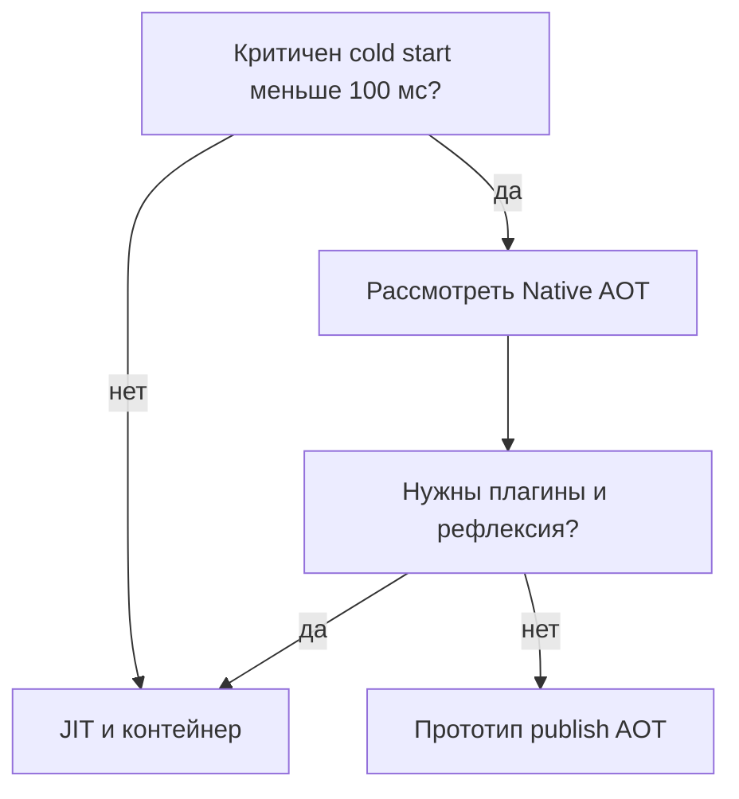

# Native AOT в .NET

<div class="article-tags">
  <span class="tag tag-notrequired">НЕ ОБЯЗАТЕЛЬНО</span>
</div>

<span class="complexity-badge">Разработчику</span>
<span class="complexity-badge">Архитектору</span>

**Native AOT** (Ahead-of-Time) — режим публикации, при котором приложение компилируется в **нативный исполняемый файл** до запуска. Обычный .NET при старте использует **JIT** (Just-In-Time) — компилятор превращает IL в машинный код уже во время работы программы.

Обзор цепочки IL → CLR → JIT — [Платформа .NET](./1), [архитектура](./12). Таблица версий — [48](../5-05-csharp/48). Сборка и деплой — [14](./14).

---

## Словарь

| Термин | Значение |
|--------|----------|
| **IL** (Intermediate Language) | Промежуточный байт-код .NET после компиляции C#. |
| **JIT** | Компиляция IL в машинный код при запуске. |
| **AOT** | Компиляция в машинный код до запуска. |
| **Trimming** | Удаление неиспользуемого кода из сборки при публикации. |
| **Рефлексия** | Чтение метаданных типов в runtime (`typeof`, `GetProperty`). |
| **Cold start** | Время от старта процесса до первого полезного ответа. |

---

## Когда Native AOT уместен

| Сценарий | AOT |
|----------|-----|
| CLI-утилита, cron, sidecar | Обычно да |
| Serverless с жёстким cold start | Обычно да |
| IoT, контейнер с малым RAM | Обычно да |
| Крупный ASP.NET + EF + Swagger | Часто нет на текущем этапе |
| Плагины из DLL в runtime | Нет |

**ReadyToRun** (R2R) — промежуточный вариант: IL + частично готовый нативный код, JIT остаётся. Сравнение — [14](./14).

---

## Минимальный проект

Файл `MyTool.csproj`:

```xml
<Project Sdk="Microsoft.NET.Sdk">
  <PropertyGroup>
    <OutputType>Exe</OutputType>
    <TargetFramework>net10.0</TargetFramework>
    <PublishAot>true</PublishAot>
    <InvariantGlobalization>true</InvariantGlobalization>
  </PropertyGroup>
</Project>
```

Публикация:

```bash
dotnet publish -c Release -r linux-x64 --self-contained
```

На выходе — бинарник, который можно запустить **без установленного .NET** на машине (self-contained).

`InvariantGlobalization` уменьшает размер, если приложению не нужны локали всех культур.

---

## Ограничения

| Возможность | В Native AOT |
|-------------|--------------|
| `Reflection.Emit`, динамические сборки | Недоступно |
| Рефлексия без аннотаций | Может быть вырезана trimmer |
| Newtonsoft.Json без source generator | Часто проблемно |
| `Expression.Compile()` | Ограничено |
| Загрузка плагинов из произвольных DLL | Практически нет |

**Что помогает**

- [Source generators](../5-05-csharp/471) для JSON (`System.Text.Json` + `JsonSerializerContext`)
- Явные контракты DI без рефлексии "по имени"
- Минимум динамической генерации кода

---

## Trimming и анализаторы

При AOT и trim анализатор предупреждает о коде, который зависит от рефлексии, но не помечен для сохранения.

- `DynamicallyAccessedMembers` — подсказка компилятору, какие члены типа нужны.
- `RequiresUnreferencedCode` — пометка API, несовместимого с trimming.

Тестируйте **опубликованный** артефакт (`dotnet publish`), а не только `dotnet run` в Debug — ошибки часто проявляются только после trim.

---

## ASP.NET Core и AOT

С .NET 8+ поддержка AOT для части стека ASP.NET расширяется, но не всё из экосистемы NuGet совместимо.

Перед выбором AOT для веб-приложения:

1. Прочитайте [документацию Microsoft](https://learn.microsoft.com/dotnet/core/deploying/native-aot/) для вашей версии SDK.
2. Проверьте зависимости на совместимость.
3. Для типичного LOB API с EF чаще достаточно обычного publish в контейнер — [контейнеризация](/encyclopedia/8-infra-security/8-06-konteynerizatsiya-i-orkestratsiya/intro).

CLI и edge-сценарии — [выбор архитектуры](../5-05-csharp/476).

---

## Схема выбора



---

## Частые ошибки

- Тест только в Debug — AOT-ошибки в Release/publish.
- Игнорирование trim warnings — `MissingMethodException` в продакшене.
- AOT без измеримой выгоды — лишняя сложность разработки.

---

## Краткая шпаргалка

| Цель | Действие |
|------|----------|
| Включить AOT | `<PublishAot>true</PublishAot>` |
| Self-contained | `dotnet publish -r linux-x64 --self-contained` |
| Меньше globalization | `<InvariantGlobalization>true</InvariantGlobalization>` |
| JSON без рефлексии | `JsonSerializerContext` (source generator) |

---

## См. также

- [Производительность C#](../5-05-csharp/41)
- [История платформы — Native AOT](./11)
- [Справочник C# — source generators](../5-05-csharp/471)
