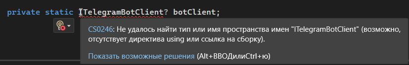

import LanguageIntroPlay from '@site/src/components/LanguageIntroPlay.jsx';
import FirstProgramPlay from '@site/src/components/FirstProgramPlay.jsx';

# C# - язык программирования платформы .NET

<div class="article-tags">
  <span class="tag tag-required">ОБЯЗАТЕЛЬНО</span>
  <span class="tag tag-beginner">ДЛЯ НОВИЧКОВ</span>
</div>

<span class="complexity-badge">Разработчику</span>
<span class="complexity-badge">Архитектору</span>

<LanguageIntroPlay topic="csharp" />

<FirstProgramPlay language="csharp" />

## Основы C#

### Возможности C#


Какие возможности предоставляет C#?
	- *писать код один раз и запускать его на разных платформах: Windows, Linux, macOS, iOS, Android*;
	- *разработка desktop-приложений (WinForms, WPF), мобильных (.NET MAUI), веб-приложений (ASP.NET Core), микросервисов*;
	- *совместимость с обширной библиотекой классов .NET, что даёт доступ к готовым решениям для работы с файлами, сетью, базами данных, графикой и многим другим*;
	- *строгая система типов снижает риск ошибок времени выполнения*;
	- *автоматическое управление памятью (Garbage Collection)*;
	- *работать с лямбдами, неизменяемыми коллекциями, функциями высшего порядка*;
	- *ключевые слова async/await для неблокирующего кода при ожидании I/O (сеть, диск, БД)*;
	- *компиляция в IL с JIT или в нативный код через Native AOT; выполнение на .NET Runtime; деплой в контейнерах и облаке*;
	- *интеграция с одной из самых мощных экосистем, включающей ASP.NET, Entity Framework, WPF, WinForms, MAUI и другие технологии*;
	- *работа с SQL через ADO.NET и Entity Framework Core*;
	- *разработка корпоративных систем - ERP, CRM, HRM, банковские системы, где важна надёжность и долгосрочная поддержка*;
	- *создание 2D и 3D игр с использованием Unity, Godot и других движков*.

### Как работать с C#?

С чего начать?

Ну, во-первых, сначала отметим, что документация у C# широкая и доступна на сайте Microsoft - https://learn.microsoft.com/ru/dotnet/csharp/

Чит-лист  - https://cheatsheets.zip/cs

Во-вторых, представим, что вы уже понимаете, какую программу хотите написать. Тогда ваши шаги будут следующими:
1.	Установить .NET.
2.	Установить Visual Studio или другую IDE.
3.	Определить технологию:
	- общий тип – консоль или пользовательский интерфейс;
	- работа приложений – WinForms/WPF/ASP.NET Core;
	- работа с данными – EF Core или ADO.NET.
4.	Установить необходимые библиотеки через NuGet.
5.	Приступить к написанию кода.

Поговорим о библиотеках.

Путь от `.cs` до запуска на .NET:

```text
АЛГОРИТМ ЗапускCSharp(Program.cs)
  IL := компилятор.скомпилировать(Program.cs)    // CIL / MSIL
  сборка := упаковать(IL, метаданные)            // .dll или .exe
  CLR.загрузить(сборка)
  нативный := JIT(IL)                            // или AOT заранее
  выполнить(точка_входа Main)
КОНЕЦ
```

Код компилируется в два основных формата – DLL и EXE.
	- EXE – исполняемый файл, который и запускает программу.
	- DLL – библиотека, не исполняемый файл, который содержит уже «упакованный» набор классов и методов.

Эти файлы содержат в себе:
	- скомпилированный код;
	- метаданные (информация о типах, методах, свойствах);
	- манифест (список зависимостей, версии, автор и т.д.).

Эти файлы образуют собой сборку – готовое приложение.

Итоговая сборка может быть Debug и Release (отладочное и финальное). Сборки пакуются в каталог `bin/` в решении. Пример:
```
C:/MyApp/bin/Debug/MyApp.exe
```
DLL-файл предоставляет методы, которые можно вызывать из других программ. К примеру, если вам нужно осуществить математическую операцию, вы добавляете библиотеку к своему коду, используя ключевое слово `using`. Это всё равно, что сказать: «Здравствуй. Сейчас мы будем с тобой работать. Нам понадобится учебник №1 и учебник №2». Это и будет некая установка для программы, что мы будем ссылаться на эти «учебники». И если сразу не договориться с программой, то это будет равнозначно тому, что ученик придёт на урок, забыв учебники дома, и не сможет учиться – он не поймёт, о чем будет идти речь. И тогда Visual Studio намекнёт – «братишка, я не понимаю о чём ты – я не знаю никакого ITelegramBotClient»:



Но стоит установить из NuGet библиотеку `Telegram.Bot`, и добавить в код:
```
using Telegram.Bot;
```
И вуаля – ошибок нет


Отсюда ключевая фишка – API в .NET позволяет ссылаться на сборки через **using** на пространства имён – **namespace**. Подробнее: [Пространства имён в C#](/encyclopedia/5-languages/5-05-csharp/12).

Исходный код хранится в файлах `.cs` для C#. Там пишется логика приложения. В проекте можно создавать новые файлы, и через внутреннее API платформы будет взаимодействие между ними. Допустим, можно сделать, что логика для работы с базой данных будет в одном файле, а логика для вывода данных на интерфейс – в другом.

Файлы проекта – это не `.cs`. 

**Проект** – это набор файлов, который при сборке превращается в *.dll* или *.exe*. Сведения о структуре проекта хранятся в файле **.csproj** – это XML-файл, описывающий структуру проекта. 

Там указывается:
	- какие .cs файлы входят в проект;
	- какие NuGet-пакеты подключены (зависимости);
	- какая версия .NET используется (допустим, 8.0);
	- настройки компиляции (Debug/Release).

Файлы **решения** - **.sln (solution file)**. Он объединяет несколько .csproj в один проект. 

Приложение – это готовое решение. Можно собирать всё решение целиком. 

Структура решения может быть такой:

```
MySolution/
  src/
    MyApp/
      MyApp.csproj
      Program.cs
      appsettings.json
```

Конфигурация хранится в файле **appsettings.json** (допустим, строки подключения, содержащие путь к базе данных).

### Точка входа и консольный ввод-вывод

В современных шаблонах .NET точка входа — файл `Program.cs` с **top-level statements** (без обязательного класса `Program` и метода `Main`):

```csharp
Console.WriteLine("Приложение запущено");
```

Классический вариант с `static void Main(string[] args)` по-прежнему допустим. Аргументы командной строки приходят в массив `args`.

Взаимодействие программы с пользователем – одна из основных задач любого приложения. В C# стандартный ввод и вывод осуществляются через класс `Console`.
	- Вывод данных: Console.WriteLine(), Console.Write();
	- Ввод данных: Console.ReadLine().
	- Чтение одного символа: Console.ReadKey().

Пример:

```csharp
string name = Console.ReadLine();
Console.WriteLine($"Здравствуйте, {name}!");
```

---
