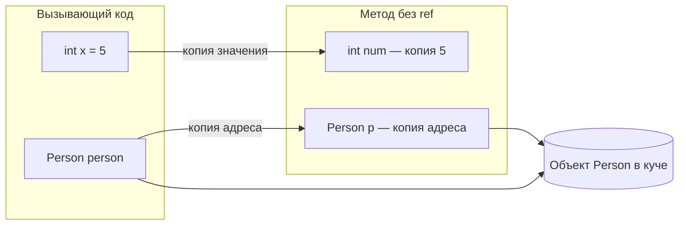

import ExternalPlayEmbed from '@site/src/components/ExternalPlayEmbed';

---
tags: [engineer, developer, architector, required, beginner]
title: "Передача параметров в C# — числа, объекты, ref, out, in"
description: "Как аргумент попадает в метод для int и class, когда нужны ref, out и in, и чем отличается смена поля объекта от присвоения new внутри метода."
---

### Смежные статьи

- [Типы данных в C#](/encyclopedia/5-languages/5-05-csharp/18)
- [Стек и куча](/encyclopedia/5-languages/5-05-csharp/19)
- [Переменные и их области видимости](/encyclopedia/5-languages/5-05-csharp/17)
- [Объектно-ориентированное программирование в C#](/encyclopedia/5-languages/5-05-csharp/25)
- [Коллекции и структуры данных](/encyclopedia/5-languages/5-05-csharp/28)
- [Справочник по синтаксису C#](/encyclopedia/5-languages/5-05-csharp/471)


# Передача параметров в C# — числа, объекты, ref, out, in

<ExternalPlayEmbed example="data-markup/memory-addressing-demo" title="ref, out и память" minHeight={420} />


<div class="article-tags">
  <span class="tag tag-required">ОБЯЗАТЕЛЬНО</span>
  <span class="tag tag-beginner">ДЛЯ НОВИЧКОВ</span>
</div>

<span class="complexity-badge">Разработчику</span>

**Дальше**

- [Типы данных](./18.md)
- [Стек и куча](./19.md)
- [Модификаторы `ref`, `out`, `in`, `params`](./17.md#модификаторы-параметров)
- [Анонимные типы и кортежи](./24.md) — альтернатива нескольким `out`

---

## Термины

Перед примерами полезно зафиксировать слова, которые встретятся дальше.

**Аргумент и параметр**

- **Параметр** — имя в объявлении метода (`void M(int x)` → `x` — параметр).
- **Аргумент** — конкретное значение при вызове (`M(5)` → `5` — аргумент).

**Значимый тип (value type)**

- В переменной лежит **само значение** (число, символ, байты структуры).
- Примеры: `int`, `bool`, `char`, `decimal`, [`struct`](./18.md#struct-i-class), [`enum`](./18.md).
- При присваивании и при обычном вызове метода значение **копируется** целиком.

**Ссылочный тип (reference type)**

- В переменной лежит **адрес объекта** в [куче](./19.md) (управляемой области памяти CLR).
- Сам объект хранится отдельно; переменная указывает на него.
- Примеры: [`class`](./25.md), [`string`](./21.md), [массив](./23.md), [`List<T>`](./28.md), [`delegate`](./33.md).

**Куча и стек**

- [Стек](./19.md) — область для локальных переменных и параметров метода; доступ быстрый, lifetime привязан к вызову.
- [Куча](./19.md) — область для объектов ссылочных типов; память освобождает [сборщик мусора (GC)](./41.md).

**Инициализация**

- Переменной присвоено начальное значение до первого чтения. Подробнее — [Переменные](./17.md).

**Модификатор параметра**

- Ключевое слово перед типом (`ref`, `out`, `in`), которое меняет способ передачи аргумента. Синтаксис вызова — в [статье про переменные](./17.md#модификаторы-параметров).

---

## Как устроена передача по умолчанию

При вызове `SomeMethod(argument)` компилятор **копирует** аргумент в параметр метода. Содержимое копии зависит от категории типа.

| Категория | Примеры типов | Что оказывается в параметре |
|-----------|---------------|----------------------------|
| Значимый тип | `int`, `bool`, `struct`, `enum` | Копия числа или всей структуры |
| Ссылочный тип | `class`, `string`, массив, `List<T>` | Копия адреса (ссылки) на объект в куче |

После копирования параметр и исходная переменная **живут отдельно**. Исключение — обе переменные-ссылки могут указывать на **один и тот же объект** в куче, поэтому изменение полей через параметр видно снаружи.

<div class="callout callout--info">
  <div class="callout-title">Про слово "ссылка"</div>

  <div class="callout-body">
  В C# у ссылочного типа переменная хранит адрес объекта. При обычном вызове метода копируется этот адрес. Модификатор <code>ref</code> передаёт адрес <strong>самой переменной</strong> в стеке вызывающего кода, чтобы метод мог переписать, что в ней лежит.
</div>
</div>

**Два типичных сценария**

- Вызов `void M(int x) { x = 10; }` оставляет внешнюю переменную без изменений, потому что в метод попала копия числа.
- Вызов `void M(Person p) { p.Name = "Ivan"; }` меняет имя у исходного объекта, потому что параметр и аргумент указывают на один объект в куче.

---

## Схема при вызове метода



---

## Числа и другие значимые типы

### Обычный параметр

```csharp
void ModifyNumber(int num)
{
    num = 10;
}

int x = 5;
ModifyNumber(x);
Console.WriteLine(x); // 5
```

Разбор

- `num` — отдельная локальная переменная с копией `5`.
- Строка `num = 10` меняет только эту копию.
- Переменная `x` в вызывающем коде остаётся `5`.

Так же ведут себя `bool`, `char`, `decimal`, [`enum`](./18.md) и любой [`struct`](./18.md#struct-i-class).

### Параметр с `ref`

```csharp
void ModifyNumberRef(ref int num)
{
    num = 10;
}

int x = 5;
ModifyNumberRef(ref x);
Console.WriteLine(x); // 10
```

Разбор

- `ref` связывает параметр с переменной `x` в вызывающем коде (метод пишет прямо в неё).
- Ключевое слово `ref` пишут и в объявлении метода, и в месте вызова.
- Переменная должна быть [инициализирована](./17.md) до вызова.

### Структура (`struct`)

У структуры та же семантика, что у `int`: без `ref` в метод уходит **полная копия** всех полей.

```csharp
public struct Point
{
    public int X;
    public int Y;
}

void MoveRight(Point p) => p.X++;

var origin = new Point { X = 0, Y = 0 };
MoveRight(origin);
Console.WriteLine(origin.X); // 0

void MoveRightRef(ref Point p) => p.X++;

MoveRightRef(ref origin);
Console.WriteLine(origin.X); // 1
```

Для небольших **неизменяемых** структур обычно возвращают новое значение из метода:

```csharp
public readonly record struct Point(int X, int Y)
{
    public Point MoveRight() => this with { X = X + 1 };
}
```

Когда выбирать [`struct` или `class`](./18.md#struct-i-class) — в [Типах данных](./18.md). Про копирование больших структур — [производительность](./41.md).

---

## Объекты и другие ссылочные типы

### Обычный параметр

```csharp
class Person
{
    public string Name { get; set; } = "";
}

void ModifyObj(Person p)
{
    p.Name = "Ivan";
    p = new Person { Name = "Anna" };
}

var person = new Person { Name = "Alex" };
ModifyObj(person);
Console.WriteLine(person.Name); // Ivan
```

Разбор

- `person` и `p` — разные переменные в памяти.
- До строки с `new` обе хранят один и тот же адрес объекта в куче.
- `p.Name = "Ivan"` меняет поле **общего** объекта — результат виден через `person`.
- `p = new Person { ... }` записывает новый адрес **только** в локальный параметр `p`. Переменная `person` по-прежнему указывает на первый объект (имя там стало `Ivan`).

Создание экземпляра `new Person()` и поля класса — в [ООП в C#](./25.md).

### Параметр с `ref`

Если метод должен **переназначить** переменную вызывающего кода (другой объект, другой список), нужен `ref`.

```csharp
void ReplacePerson(ref Person p)
{
    p = new Person { Name = "Anna" };
}

var person = new Person { Name = "Alex" };
ReplacePerson(ref person);
Console.WriteLine(person.Name); // Anna
```

Разбор

- `ref Person p` — ссылка на переменную `person` в стеке вызывающего кода.
- Присваивание `p = new ...` меняет адрес, который хранит `person`.

### Списки и массивы

[`List<T>`](./28.md) и [массивы](./23.md) — ссылочные типы. Логика та же, что у `Person`.

```csharp
void ClearList(List<int> items) => items.Clear();

void ReplaceList(List<int> items) => items = new List<int>();

var numbers = new List<int> { 1, 2, 3 };
ClearList(numbers);
// numbers пуст — Clear() изменил тот же объект в куче

ReplaceList(numbers);
// numbers по-прежнему пуст — ReplaceList переписал только локальную копию ссылки
```

Чтобы метод подменил саму переменную-список

- объявите `ref List<int> items`, или
- верните новый список из метода через `return`.

### Строки

[`string`](./21.md) — ссылочный **неизменяемый** тип. Переприсваивание параметра `s` внутри метода не затрагивает переменную вызывающего кода.

```csharp
void TryChange(string s) => s = "changed";

string text = "hello";
TryChange(text);
Console.WriteLine(text); // hello
```

Любая операция вроде `Replace` или конкатенации создаёт **новую** строку в куче. Исходная переменная `text` остаётся прежней, пока ей явно не присвоить результат.

---

## Модификаторы `ref`, `out`, `in`

Краткая таблица. Полный список ключевых слов — [Справочник C#](./471.md).

| Модификатор | Что передаётся | Инициализация до вызова | Обязанности метода | Где встречается |
|-------------|----------------|-------------------------|--------------------|-----------------|
| *(нет)* | Копия значения или копии адреса | Любая | Работа с локальной копией | Большинство методов |
| `ref` | Переменная вызывающего кода | Обязательна | Можно читать и писать | Обновление аргумента на месте |
| `out` | Переменная вызывающего кода | Не требуется | Присвоить значение перед выходом | `TryParse`, `TryGetValue` |
| `in` | Переменная только для чтения | Любая | Читать можно, менять нельзя | Крупные `struct` |

### `out` — дополнительный результат через параметр

Паттерн **Try** в стандартной библиотеке .NET ([BCL](./473.md))

- метод возвращает `bool` (успех или неудача);
- полезное значение отдаёт через `out`-параметр.

```csharp
bool TryDivide(int a, int b, out double result)
{
    if (b == 0)
    {
        result = 0;
        return false;
    }

    result = (double)a / b;
    return true;
}

if (TryDivide(10, 4, out double quotient))
    Console.WriteLine(quotient); // 2.5

if (int.TryParse("42", out int value))
    Console.WriteLine(value); // 42
```

Разбор

- Компилятор требует присвоить `out`-параметр **на каждой ветке** метода.
- В вызове можно объявить переменную сразу: `out int value`.
- Примеры в BCL: [`int.TryParse`](./21.md), [`Dictionary.TryGetValue`](./28.md), [`Guid.TryParse`](./493.md).

Вернуть несколько значений можно и через [кортеж](./24.md) — `return (true, quotient)` — без `out`.

### `in` — передать структуру без полного копирования

Модификатор `in` (C# 7.2+) передаёт адрес `struct`, но запрещает менять поля параметра.

```csharp
public readonly struct Matrix3x3
{
    public double M11, M12, M13;
    public double M21, M22, M23;
    public double M31, M32, M33;
}

double Trace(in Matrix3x3 m)
{
    // m.M11 = 0; // ошибка компиляции
    return m.M11 + m.M22 + m.M33;
}
```

Разбор

- Девять полей `double` — 72 байта; при обычном параметре структура копируется целиком на каждый вызов.
- `in` экономит копирование и фиксирует контракт "только чтение".
- Для `class` выигрыш обычно незаметен — копируется только адрес (8 байт на 64-битной платформе).

---

## Как выбрать способ передачи

| Задача | Подход |
|--------|--------|
| Прочитать данные и вернуть результат | Обычный параметр + [`return`](./11.md) |
| Изменить поля существующего объекта | Обычный параметр ссылочного типа |
| Изменить число или `struct` у вызывающего | `ref` или `return` нового значения |
| Сообщить успех и значение (как `TryParse`) | `bool` + `out` или [кортеж](./24.md) |
| Принять большую `struct` без копии | `in` |
| Подменить ссылку (другой объект, другой список) | `ref` или `return` |

<div class="callout callout--tip">
  <div class="callout-title">Стиль в новых проектах</div>

  <div class="callout-body">
  Для нескольких результатов часто используют <code>return</code>, <a href="./24.md">кортежи</a> и <code>record</code>. <code>out</code> остаётся стандартом для API в духе <code>TryParse</code>. <code>ref</code> уместен в буферах, <code>Span&lt;T&gt;</code> и горячих участках — см. <a href="./471.md">справочник</a> и <a href="./41.md">производительность</a>.
</div>
</div>

---

## Частые ошибки

| Симптом | Причина | Решение |
|---------|---------|---------|
| `void M(int x) { x++; }` не увеличивает аргумент | В метод попала копия `int` | `ref int x` или `return x + 1` |
| `p = new Person()` внутри метода не меняет переменную снаружи | Скопирован только адрес; `new` пишет в локальный параметр | `ref Person p` или вернуть объект |
| `void M(Point p) { p.X++; }` не двигает точку снаружи | Скопирована вся структура | `ref Point p`, `readonly struct` + `return` |
| Ошибка компиляции на `out`-параметре | Не все ветки `if` присваивают `out` | Присвоить во всех ветках или `result = default` |
| Лишний `ref` везде | Усложняется чтение и сопровождение API | `ref` только там, где аргумент должен измениться |

Типичные вопросы на собеседовании — [474](./474.md).

---

## Все варианты в одном примере

```csharp
class Counter
{
    public int Value;
}

void A(int n) => n = 0;              // копия int
void B(ref int n) => n = 0;          // переменная int снаружи
void C(Counter c) => c.Value = 0;    // общий объект в куче
void D(Counter c) => c = new();      // новый адрес только в параметре
void E(ref Counter c) => c = new(); // переменная-ссылка снаружи

int num = 42;
A(num); Console.WriteLine(num);           // 42
B(ref num); Console.WriteLine(num);       // 0

var ctr = new Counter { Value = 42 };
C(ctr); Console.WriteLine(ctr.Value);     // 0
D(ctr); Console.WriteLine(ctr.Value);     // 0, тот же объект
E(ref ctr); Console.WriteLine(ctr.Value); // 0, уже другой объект
```

---

## Шпаргалка

- **Без модификатора** — копия значения (`int`, `struct`) или копия адреса (`class`, массив, список).
- **`ref`** — метод работает с исходной переменной; она должна быть инициализирована.
- **`out`** — метод обязан записать значение в параметр; удобно для `Try*`-методов.
- **`in`** — адрес `struct` без права изменения; для тяжёлых структур.

**Документация Microsoft**

- [Параметры методов](https://learn.microsoft.com/ru-ru/dotnet/csharp/language-reference/keywords/method-parameters)
- [Различие между значимыми и ссылочными типами](https://learn.microsoft.com/ru-ru/dotnet/csharp/language-reference/builtin-types/value-types)
