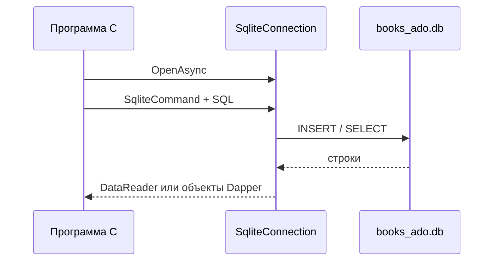

import FirstProgramPlay from '@site/src/components/FirstProgramPlay.jsx';

# ADO.NET и Dapper — первая программа

<div class="article-tags">
  <span class="tag tag-required">ОБЯЗАТЕЛЬНО</span>
  <span class="tag tag-beginner">ДЛЯ НОВИЧКОВ</span>
</div>

<span class="complexity-badge">Разработчику</span>

<FirstProgramPlay language="csharp" />

---

## ADO.NET и Dapper — первая программа

### Где применяют прямой SQL

В [EF Core](./441.md) вы описываете классы, а фреймворк строит SQL. Иногда нужен **полный контроль** над текстом запроса: сложные отчёты, оконные функции SQL, массовая загрузка, legacy-база со странной схемой, микросервис "только чтение" с жёсткими требованиями к производительности.

Для этого в .NET есть два уровня:

| Уровень | Что это |
|---------|---------|
| **ADO.NET** | Низкоуровневый API: открыть соединение, выполнить команду, прочитать строки по одной. |
| **Dapper** | Тонкая обёртка над ADO.NET: вы по-прежнему пишете SQL, но результат сразу маппится в объекты C#. |

Обзор всех способов: [44](./44.md). Высокоуровневый путь: [EF Core — первая программа](./441.md). Историческая модель COM-ADO: [ADO.NET (платформа .NET)](../5-04-platforma-dotnet/171.md). Полный API LINQ для SQL-пайплайнов и коллекций: [291](./291.md).

<div class="callout callout--tip">
  <div class="callout-title">Когда выбирать ADO.NET и Dapper</div>

  <div class="callout-body">
  Если вам важны точный SQL, прозрачные планы запросов и минимальный "магический" слой ORM, начинайте с этого подхода. Для доменной логики с большим количеством сущностей чаще удобнее EF Core.
</div>
  </div>


---

### Словарь

| Термин | Простыми словами |
|--------|------------------|
| **Соединение (connection)** | Канал к файлу БД или серверу SQL; открывается перед запросом, закрывается после. |
| **Команда (command)** | Текст SQL + параметры; выполняется через `ExecuteNonQuery` (без строк) или `ExecuteReader` (с выборкой). |
| **Параметр** | Значение `@title`, `@year` — подставляется драйвером безопасно, отдельно от текста SQL. |
| **DataReader** | Поток строк результата; читается в цикле `ReadAsync()`. |
| **Строка подключения** | Строка вида `Data Source=books_ado.db` — адрес и опции БД. |
| **Маппинг** | Превращение колонок SQL в свойства класса `Book`. |

---

### Что получится

| Этап | Технология | Действие |
|------|------------|----------|
| 1 | ADO.NET + `Microsoft.Data.Sqlite` | Создать таблицу, `INSERT` с параметрами, `SELECT` в цикле |
| 2 | Dapper | Те же операции короче: `ExecuteAsync`, `QueryAsync<Book>` |



---

## Требования

- .NET SDK 8+
- Базовый SQL (что такое `SELECT`, `INSERT`, `WHERE`): [Основы БД](/encyclopedia/3-data-markup/3-05-osnovy-baz-dannyh/2)

---

## Проект

```bash
dotnet new console -n BooksAdo -o BooksAdo
cd BooksAdo
dotnet add package Microsoft.Data.Sqlite
dotnet add package Dapper
```

`Microsoft.Data.Sqlite` — современный драйвер SQLite от Microsoft (для SQL Server используют `Microsoft.Data.SqlClient` — другой пакет, другая строка подключения).

---

## Модель

`Models/Book.cs`:

```csharp
namespace BooksAdo.Models;

public class Book
{
    public int Id { get; set; }
    public string Title { get; set; } = "";
    public int Year { get; set; }
}
```

Тот же класс, что в [441](./441.md): три поля соответствуют трём колонкам таблицы. Dapper сопоставит их **по имени** (регистр не важен: `Title` ↔ `title`).

---

## ADO.NET — создать таблицу и записать данные

`Program.cs` (фрагмент):

```csharp
using Microsoft.Data.Sqlite;
using BooksAdo.Models;

const string cs = "Data Source=books_ado.db";

await using (var conn = new SqliteConnection(cs))
{
    await conn.OpenAsync();

    var create = """
        CREATE TABLE IF NOT EXISTS Books (
            Id INTEGER PRIMARY KEY AUTOINCREMENT,
            Title TEXT NOT NULL,
            Year INTEGER NOT NULL
        );
        """;
    await using (var cmd = new SqliteCommand(create, conn))
        await cmd.ExecuteNonQueryAsync();

    const string insert = "INSERT INTO Books (Title, Year) VALUES (@title, @year);";
    await using var insertCmd = new SqliteCommand(insert, conn);
    insertCmd.Parameters.AddWithValue("@title", "Clean Code");
    insertCmd.Parameters.AddWithValue("@year", 2008);
    await insertCmd.ExecuteNonQueryAsync();
}
```

---

### Построчный разбор

| Строка | Смысл |
|--------|--------|
| `const string cs = "Data Source=books_ado.db"` | Строка подключения: файл БД в текущей папке. |
| `new SqliteConnection(cs)` | Объект соединения (ещё закрыт). |
| `await conn.OpenAsync()` | Открыть канал к файлу; без этого команды не выполнятся. |
| `""" ... """` | Raw string literal в C# — многострочный SQL без экранирования кавычек. |
| `CREATE TABLE IF NOT EXISTS` | Создать таблицу, если её ещё нет (повторный запуск безопасен). |
| `AUTOINCREMENT` | SQLite сам увеличивает `Id` для новых строк. |
| `ExecuteNonQueryAsync()` | Выполнить SQL без возврата таблицы (`CREATE`, `INSERT`, `UPDATE`, `DELETE`). |
| `@title`, `@year` в SQL | **Именованные параметры** — плейсхолдеры для значений. |
| `Parameters.AddWithValue("@title", "Clean Code")` | Подставить значение в параметр; драйвер экранирует спецсимволы. |

**Почему параметры обязательны**

Если склеивать SQL из строк пользователя (`$"INSERT ... '{userInput}'"`), злоумышленник может вставить свой фрагмент SQL (**SQL-инъекция**). С `@параметрами` текст запроса и данные разделены: СУБД получает готовый шаблон и значения отдельно.

**`await using`**

Автоматически вызывает `Dispose` у соединения и команд — освобождает файл и сокеты. В ASP.NET соединение держат **коротко**: открыли → один-два запроса → закрыли; пул соединений на сервере переиспользует физические подключения.

---

## ADO.NET — чтение `DbDataReader`

```csharp
await using var conn = new SqliteConnection(cs);
await conn.OpenAsync();

await using var cmd = new SqliteCommand(
    "SELECT Id, Title, Year FROM Books WHERE Year >= @y ORDER BY Title;",
    conn);
cmd.Parameters.AddWithValue("@y", 2000);

await using var reader = await cmd.ExecuteReaderAsync();
while (await reader.ReadAsync())
{
    var id = reader.GetInt32(0);
    var title = reader.GetString(1);
    var year = reader.GetInt32(2);
    Console.WriteLine($"{id}: {title} ({year})");
}
```

| Шаг | Объяснение |
|-----|------------|
| `ExecuteReaderAsync()` | Запрос с возвратом **набора строк** (курсор). |
| `ReadAsync()` | Перейти к следующей строке; `false` — строк больше нет. |
| `GetInt32(0)`, `GetString(1)` | Взять значение колонки по **индексу** (0 — первая колонка в `SELECT`). |

Индексы хрупки: если в `SELECT` поменять порядок колонок, код сломается. В продакшене чаще:

```csharp
var titleOrdinal = reader.GetOrdinal("Title");
var title = reader.GetString(titleOrdinal);
```

---

## Dapper — тот же сценарий короче

После создания таблицы (как выше):

```csharp
await using var conn = new SqliteConnection(cs);
await conn.OpenAsync();

await conn.ExecuteAsync(
    "INSERT INTO Books (Title, Year) VALUES (@Title, @Year);",
    new { Title = "CLR via C#", Year = 2012 });

var books = await conn.QueryAsync<Book>(
    "SELECT Id, Title, Year FROM Books WHERE Year >= @minYear ORDER BY Title;",
    new { minYear = 2010 });

foreach (var b in books)
    Console.WriteLine($"{b.Id}: {b.Title}");
```

| Вызов | Что делает |
|-------|------------|
| `ExecuteAsync(sql, obj)` | Выполняет команду без чтения строк; свойства анонимного объекта `new { Title = ..., Year = ... }` становятся параметрами `@Title`, `@Year`. |
| `QueryAsync<Book>(sql, obj)` | Выполняет `SELECT` и для **каждой строки** создаёт `Book`, заполняя свойства по именам колонок. |

Имена в SQL (`@minYear`) и в объекте (`minYear`) должны совпадать (без `@` в свойстве). Если колонка называется `book_title`, в SQL можно alias: `SELECT book_title AS Title`.

Dapper **не** отслеживает изменения: чтобы обновить книгу, пишете отдельный `UPDATE` (или переходите на EF Core).

---

## Транзакция (два INSERT "всё или ничего")

Если второй `INSERT` упадёт, первый откатится:

```csharp
await using var conn = new SqliteConnection(cs);
await conn.OpenAsync();
await using var tx = await conn.BeginTransactionAsync();

try
{
    await conn.ExecuteAsync(
        "INSERT INTO Books (Title, Year) VALUES (@Title, @Year);",
        new { Title = "Book A", Year = 2020 },
        transaction: tx);
    await conn.ExecuteAsync(
        "INSERT INTO Books (Title, Year) VALUES (@Title, @Year);",
        new { Title = "Book B", Year = 2021 },
        transaction: tx);
    await tx.CommitAsync();
}
catch
{
    await tx.RollbackAsync();
    throw;
}
```

**Транзакция** — группа команд с общим исходом: либо все применились, либо ни одна.

---

## Когда что выбирать

| Критерий | ADO.NET | Dapper | EF Core |
|----------|---------|--------|---------|
| Скорость старта CRUD | Средняя | Быстрая | Быстрая |
| Контроль SQL | Полный | Полный | Частичный (LINQ → SQL) |
| Миграции схемы | Вручную / скрипты | Вручную | Встроены |
| Отслеживание изменений | Нет | Нет | Да |
| Типичное применение | ETL, отчёты, тонкая настройка | High-load read API | Доменные приложения, CRUD |

---

## Частые ошибки

| Ошибка | Решение |
|--------|---------|
| Склейка пользовательского ввода в SQL | Только `@параметры` |
| Соединение открыто часами | Короткие `using`; в вебе — на время запроса |
| Путаница `SqlClient` и `Sqlite` | SQLite → `Microsoft.Data.Sqlite`; SQL Server → `Microsoft.Data.SqlClient` |
| Dapper: поле `null` / не маппится | Имя колонки = имя свойства или `AS Alias` в SQL |
| "database is locked" | Закрыть reader и connection; в тестах — не держать два writer’а на один файл |

---

### Что попробовать

1. Добавьте операции `UPDATE` и `DELETE` с параметрами.

```sql
UPDATE Books SET Year = @year WHERE Id = @id
```
2. Прочитайте список через ADO.NET, тот же список — через Dapper; сравните строки кода.
3. Перепишите сценарий на [EF Core](./441.md) и сравните, где появляются миграции и `SaveChanges`.

---

### Мини-чеклист качества SQL-кода

- Все переменные пользователя передаются через параметры.
- У запросов есть явная сортировка, если порядок важен.
- Для массовых операций есть транзакция и контроль ошибок.
- В логах фиксируется текст операции без секретных данных.

---

## Дальше

- [Работа с БД и ORM](./44.md)
- [Entity Framework Core — первая программа](./441.md)
- [Продвинутый Web API + PostgreSQL](./453.md)

---
