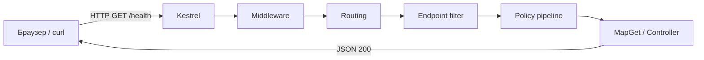

import ExternalCodeEmbed from '@site/src/components/ExternalCodeEmbed';


import ExternalPlayEmbed from '@site/src/components/ExternalPlayEmbed';


# Первая программа на ASP.NET Core

<div class="article-tags">
  <span class="tag tag-required">ОБЯЗАТЕЛЬНО</span>
  <span class="tag tag-beginner">ДЛЯ НОВИЧКОВ</span>
</div>

<span class="complexity-badge">Разработчику</span>
<span class="complexity-badge">Архитектору</span>

<ExternalPlayEmbed example="lab/first-program-play" title="Первая программа" minHeight={420} playProps={{ language: 'aspnet' }} />

---

## Первая программа на ASP.NET Core

### Модель HTTP для первого проекта

При переходе из консольного C# в веб достаточно цепочки: приложение **слушает порт** → клиент шлёт HTTP-запрос → обработчик возвращает статус и тело → результат виден в браузере или `curl`.

| Что | Где | Зачем |
|-----|-----|-------|
| Маршруты и пайплайн | `Program.cs` | Какие URL существуют |
| Контракты | `record`/DTO | Формат JSON |
| Проверка живости | `/health` | Сервер отвечает |

---

### Что такое ASP.NET Core

Консольная программа общается с пользователем через терминал. **Веб-приложение** общается по сети по протоколу **HTTP**: клиент (браузер, мобильное приложение, другой сервер) отправляет **запрос** (URL, метод, заголовки, иногда тело), сервер возвращает **ответ** (код статуса, заголовки, тело — часто JSON или HTML).

**ASP.NET Core** — фреймворк Microsoft для таких серверов на C#:

- принимает HTTP (встроенный сервер **Kestrel**);
- направляет запрос по **маршруту** к нужному коду;
- собирает ответ (JSON, файл, редирект);
- подключает **DI** (внедрение зависимостей) — общие сервисы в одном месте.

Мы соберём минимальный **REST API "Заметки"** без базы данных: список хранится в памяти, зато проходим полный цикл **запрос → маршрут → обработчик → ответ**. Углубление без контроллеров: [Minimal API и OpenAPI](./4517.md). Пример с PostgreSQL: [Приложение с S3, PostgreSQL и ASP.NET Core Web API](./453.md). Теория: [ASP.NET](./451.md). HTML: [Razor Pages](./4514.md). Auth: [Identity — JWT и cookie](./4515.md). Тесты: [Тесты ASP.NET Core — юнит и интеграция](./4516.md). UI: [Blazor](./4512.md) · [MAUI](./4513.md).

---

### Словарь HTTP и API

| Термин | Простыми словами |
|--------|------------------|
| **HTTP-метод** | Действие: `GET` — прочитать, `POST` — создать, `PUT`/`PATCH` — изменить, `DELETE` — удалить. |
| **URL / маршрут** | Адрес ресурса, например `/api/notes` или `/hello/World`. |
| **REST API** | Стиль API: ресурсы — существительные в URL, операции — HTTP-методы; ответ часто JSON. |
| **JSON** | Текстовый формат `{ "text": "заметка" }` — удобен для программ. |
| **Контроллер** | Класс с методами, привязанными к маршрутам (`[HttpGet]`, `[HttpPost]`). |
| **Minimal API** | Те же маршруты, но объявлены в `Program.cs` через `MapGet` / `MapPost`. |
| **Swagger / OpenAPI** | Страница в браузере со списком эндпоинтов и кнопкой "Try it out". |
| **DI** | Контейнер создаёт сервисы (`IGreetingService`) и подставляет их в обработчики. |

---

### Что получится

| Метод | URL | Действие |
|-------|-----|----------|
| GET | `/health` | Проверка "сервер жив" |
| GET | `/hello/{name}` | JSON-приветствие |
| GET/POST | `/api/notes` | Список и создание заметок (вариант с контроллером) |

После `dotnet run` откройте **Swagger UI** — интерактивную документацию API в браузере.



Разбор:
- Диаграмма показывает полный путь запроса от клиента к серверу и обратно.
- `Kestrel` принимает HTTP-соединение и создаёт контекст запроса.
- `Middleware` — инфраструктура для **всех** запросов: HTTPS, auth, логи, глобальные ошибки.
- `Routing` выбирает endpoint; только после этого имеет смысл логика, завязанная на конкретный маршрут.
- `Endpoint filter` и **policy pipeline** на первом проекте могут отсутствовать — их добавляют, когда проверок становится много (см. [ASP.NET - фреймворк для веб-приложений — где жить логике](./451.md#где-жить-логике-middleware-endpoint-filters-policy-pipeline)).
- `Handler` — сценарий: `MapGet`, Minimal API delegate или метод контроллера.
- `JSON 200` — успешный ответ с телом.

<div class="callout callout--info">
  <div class="callout-title">Куда класть проверки</div>

  <div class="callout-body">
  Не смешивайте инфраструктуру (middleware), привязку к маршруту (endpoint filter) и бизнес-регуляции (policy pipeline) в одном handler. Критерии выбора и примеры — в <a href="./451.md#где-жить-логике-middleware-endpoint-filters-policy-pipeline">обзоре ASP.NET (451)</a>.
</div>
  </div>

---

## Требования

- [.NET SDK](https://dotnet.microsoft.com/download) 8 или 9 (`dotnet --version`)

```bash
dotnet --version
```

Разбор:
- `dotnet --version` выводит текущую версию установленного .NET SDK.
- Команда подтверждает, что окружение готово к созданию и запуску проекта.
- Проверка версии особенно важна, когда вы повторяете материал на другой машине или в CI.

- Редактор: Visual Studio, Rider или VS Code + C# Dev Kit

---

## Создание проекта

```bash
dotnet new webapi -n HelloApi -o HelloApi --use-controllers
cd HelloApi
dotnet run
```

Разбор:
- `dotnet new webapi` создаёт проект из шаблона ASP.NET Core Web API.
- `-n HelloApi` задаёт имя проекта, `-o HelloApi` — папку вывода.
- `--use-controllers` включает контроллерный стиль и готовую MVC-инфраструктуру.
- `cd HelloApi` переводит терминал в каталог созданного проекта.
- `dotnet run` собирает приложение и запускает Kestrel с локальными URL.

| Часть команды | Смысл |
|---------------|--------|
| `webapi` | Шаблон веб-API с контроллерами и Swagger. |
| `--use-controllers` | Явно включить классические контроллеры. |

В консоли появятся адреса вроде `https://localhost:7xxx` и `http://localhost:5xxx`. Откройте **`https://localhost:7xxx/swagger`** — шаблон уже содержит sample controller.

**HTTPS** — шифрованное соединение; в разработке браузер может предупредить о самоподписанном сертификате. `curl` с флагом `-k` игнорирует проверку сертификата.

---

## Минимальный API (без контроллеров)

Удалите папку `Controllers` (или sample-контроллер) и замените `Program.cs`:


<ExternalCodeEmbed example="csharp/csharp-505-4511-001" title="Минимальный API (без контроллеров)" minHeight={408} />


Разбор:
- `WebApplication.CreateBuilder(args)` формирует основу приложения: конфигурацию, логирование и DI-контейнер.
- `AddEndpointsApiExplorer()` добавляет метаданные endpoint-ов для генерации OpenAPI.
- `AddSwaggerGen()` подключает генератор Swagger-документации.
- `builder.Build()` собирает pipeline обработки запросов.
- Проверка `app.Environment.IsDevelopment()` ограничивает Swagger режимом разработки.
- `MapGet("/health", ...)` регистрирует endpoint для health-check.
- `MapGet("/hello/{name}", ...)` демонстрирует параметр маршрута и его биндинг в `string name`.
- `Results.Ok(...)` отправляет `200 OK` и JSON-тело.
- `app.Run()` запускает веб-сервер и начинает приём HTTP-запросов.

---

### Разбор `Program.cs`

| Строка | Смысл |
|--------|--------|
| `WebApplication.CreateBuilder(args)` | Создать "строитель" приложения: конфиг, логи, DI. |
| `AddEndpointsApiExplorer()` | Собрать метаданные маршрутов для OpenAPI. |
| `AddSwaggerGen()` | Подключить генерацию документации Swagger. |
| `var app = builder.Build()` | Собрать pipeline и хост. |
| `IsDevelopment()` | В режиме разработки включаем Swagger. |
| `MapGet("/health", ...)` | На `GET /health` вернуть JSON `{ "status": "ok" }`. |
| `MapGet("/hello/{name}", ...)` | Сегмент `{name}` из URL попадает в параметр `string name`. |
| `Results.Ok(...)` | Ответ с кодом **200** и телом (сериализуется в JSON). |

Проверка из терминала (порт замените на свой):

```bash
dotnet run
curl https://localhost:5001/health -k
curl https://localhost:5001/hello/World -k
```

Разбор:
- `dotnet run` стартует приложение и открывает локальные HTTP/HTTPS-адреса.
- `curl .../health` проверяет, что endpoint жив и отвечает корректно.
- `curl .../hello/World` тестирует маршрут с сегментом `{name}`.
- Ключ `-k` отключает строгую проверку локального self-signed HTTPS-сертификата.

---

## Вариант с контроллером

`Controllers/NotesController.cs`:


<ExternalCodeEmbed example="csharp/csharp-505-4511-002" title="Вариант с контроллером" minHeight={498} />


Разбор:
- `[ApiController]` включает API-соглашения: автопривязку входных данных и автопроверку модели.
- `[Route("api/[controller]")]` задаёт базовый путь контроллера по его имени.
- `ControllerBase` подходит для API без HTML-представлений.
- `static List<Note>` хранит данные в памяти процесса и подходит для учебного примера.
- `[HttpGet]` помечает метод чтения коллекции, `[HttpPost]` — метод создания.
- `CreatedAtAction(...)` возвращает `201 Created` и сообщает клиенту адрес созданного ресурса.
- `record`-типы описывают DTO компактно и удобно сериализуются в JSON.

| Атрибут / элемент | Смысл |
|-------------------|--------|
| `[ApiController]` | Соглашения Web API: привязка JSON из тела, валидация. |
| `[Route("api/[controller]")]` | Базовый путь `api/Notes`. |
| `: ControllerBase` | API без HTML-представлений. |
| `static List<Note>` | Учебное хранилище в памяти. |
| `CreatedAtAction` | Ответ **201 Created** + заголовок `Location`. |
| `record` | Компактный DTO для JSON. |

`Program.cs` для контроллеров:

```csharp
builder.Services.AddControllers();
// ...
app.MapControllers();
```

Разбор:
- `AddControllers()` регистрирует MVC-компоненты: роутинг контроллеров, model binding и JSON-форматтеры.
- `MapControllers()` подключает к pipeline все маршруты, описанные атрибутами в контроллерах.
- Вместе эти строки включают контроллерный стиль поверх базового хоста ASP.NET Core.

---

## Внедрение зависимостей

`Services/IGreetingService.cs`:

```csharp
public interface IGreetingService
{
    string Greet(string name);
}

public class GreetingService : IGreetingService
{
    public string Greet(string name) => $"Hello, {name}!";
}
```

Разбор:
- `interface IGreetingService` задаёт контракт сервиса, который можно подменять в тестах или в других реализациях.
- `GreetingService` реализует этот контракт и изолирует логику приветствия.
- Метод `Greet` принимает имя и возвращает готовую строку для API-ответа.
- Такой сервис статичен по поведению и подходит для регистрации как singleton.

`Program.cs`:

```csharp
builder.Services.AddSingleton<IGreetingService, GreetingService>();

app.MapGet("/greet/{name}", (string name, IGreetingService svc) =>
    Results.Ok(new { message = svc.Greet(name) }));
```

Разбор:
- `AddSingleton<IGreetingService, GreetingService>()` создаёт единственный экземпляр сервиса на всё время работы приложения.
- В `MapGet` зависимость `IGreetingService svc` подставляется контейнером DI автоматически.
- Вызов `svc.Greet(name)` отделяет бизнес-логику от инфраструктурного кода endpoint-а.
- `Results.Ok(...)` формирует стандартный JSON-ответ с кодом `200`.

| Регистрация | Когда использовать |
|-------------|-------------------|
| `AddSingleton` | Один экземпляр на всё приложение. |
| `AddScoped` | Один экземпляр на HTTP-запрос (`DbContext`). |
| `AddTransient` | Новый экземпляр при каждом разрешении. |

---

## Тестирование

В конце `Program.cs` добавьте `public partial class Program { }` — для `WebApplicationFactory<Program>`.

Полный разбор: [интеграционные тесты ASP.NET Core](./4516.md).

```bash
dotnet test
```

Разбор:
- `dotnet test` запускает автоматические тесты проекта и выводит результат по каждому тест-кейсу.
- Это быстрая проверка, что изменения не сломали маршруты, сервисы и контракты.
- Команду обычно запускают перед коммитом и перед публикацией.

---

## Публикация

```bash
dotnet publish -c Release -o ./publish
```

Разбор:
- `dotnet publish` готовит артефакт для развёртывания на сервере или в контейнере.
- `-c Release` включает оптимизированную сборку для production-сценариев.
- `-o ./publish` складывает все выходные файлы в отдельный каталог, удобный для деплоя.

Запуск на сервере: `dotnet HelloApi.dll` или Docker-образ на базе `mcr.microsoft.com/dotnet/aspnet`.

```bash
dotnet HelloApi.dll
```

Разбор:
- Команда запускает уже опубликованное приложение из DLL.
- Этот способ типичен для framework-dependent развёртывания, где runtime установлен на сервере.
- Перед запуском обычно задают окружение и конфигурацию через переменные среды.

---

## Частые ошибки

| Симптом | Причина |
|---------|---------|
| Swagger не открывается | Окружение не `Development` или не подключён `UseSwagger` |
| 404 на маршруте | Опечатка в URL; для контроллера — нет `MapControllers()` |
| DI не резолвит сервис | Нет `AddSingleton` / `AddScoped` в `Program.cs` |
| Пустое тело POST | Нет `Content-Type: application/json` |

---

### Что попробовать

1. `MapPost` с телом `{ "text": "..." }` и `record`.
2. [Minimal API и OpenAPI](./4517.md).
3. Клиент из [MAUI](./4513.md): `HttpClient.GetFromJsonAsync`.

---

### Мини-практикум — довести API до "полезного минимума"

После первой версии обычно делают четыре коротких шага:

1. Добавляют `CreatedAtAction` на `POST` для корректного `201`.
2. Проверяют входные данные (`string.IsNullOrWhiteSpace`, `StringLength`).
3. Выносят логику в сервис и подключают DI.
4. Добавляют интеграционный тест на ключевой маршрут ([Тесты ASP.NET Core — юнит и интеграция](./4516.md)).

Так вы быстро переходите от "демо работает" к "минимальный production-подход".

---

## Дальше

- [Entity Framework Core — первая программа](./441.md) · [обзор БД и ORM](./44.md)
- [ADO.NET и Dapper — первая программа](./442.md)
- [Minimal API и OpenAPI](./4517.md) · [интеграционные тесты](./4516.md)
- [Razor Pages](./4514.md) · [Identity и JWT](./4515.md)
- [Веб-разработка и API на C#](./45.md)
- [Справочник по ASP.NET](./452.md)

---

{/* http-basics-link  */}
<div class="callout callout--tip">
  <div class="callout-title">Основа по протоколу</div>

  <div class="callout-body">
  Базовый разбор HTTP и HTTPS находится в отдельной статье — [HTTP как основа веб-интеграций](/encyclopedia/2-system-network/2-09-osnovy-integratsionnogo-vzaimodeystviya/118).
</div>
  </div>

{/* sidebar-collections */}

---

## В подборках

Статья входит в [тематические подборки](/about/collections) и блок «С чего начать?» на [главной](/). Соседние шаги того же маршрута:

**Первые шаги** ([маршрут подборки](/about/collections/pervye-shagi)) — [ADO.NET / Dapper — первая программа](/encyclopedia/5-languages/5-05-csharp/442), [Blazor — первая программа](/encyclopedia/5-languages/5-05-csharp/4512), [EF Core — первая программа](/encyclopedia/5-languages/5-05-csharp/441), [.NET MAUI — первая программа](/encyclopedia/5-languages/5-05-csharp/4513), [Первая программа на JavaFX](/encyclopedia/5-languages/5-03-java/3111), [Razor Pages — первая программа](/encyclopedia/5-languages/5-05-csharp/4514).

{/* /sidebar-collections */}

---
