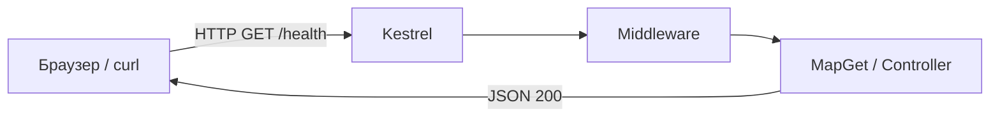

import FirstProgramPlay from '@site/src/components/FirstProgramPlay.jsx';

# Первая программа на ASP.NET Core

<div class="article-tags">
  <span class="tag tag-required">ОБЯЗАТЕЛЬНО</span>
  <span class="tag tag-beginner">ДЛЯ НОВИЧКОВ</span>
</div>

<span class="complexity-badge">Разработчику</span>
<span class="complexity-badge">Архитектору</span>

<FirstProgramPlay language="aspnet" />

---

## Первая программа на ASP.NET Core

### Что такое ASP.NET Core

Консольная программа общается с пользователем через терминал. **Веб-приложение** общается по сети по протоколу **HTTP**: клиент (браузер, мобильное приложение, другой сервер) отправляет **запрос** (URL, метод, заголовки, иногда тело), сервер возвращает **ответ** (код статуса, заголовки, тело — часто JSON или HTML).

**ASP.NET Core** — фреймворк Microsoft для таких серверов на C#:

- принимает HTTP (встроенный сервер **Kestrel**);
- направляет запрос по **маршруту** к нужному коду;
- собирает ответ (JSON, файл, редирект);
- подключает **DI** (внедрение зависимостей) — общие сервисы в одном месте.

Мы соберём минимальный **REST API "Заметки"** без базы данных: список хранится в памяти, зато проходим полный цикл **запрос → маршрут → обработчик → ответ**. Углубление без контроллеров: [Minimal API и OpenAPI](./4517.md). Пример с PostgreSQL: [453](./453.md). Теория: [ASP.NET](./451.md). HTML: [Razor Pages](./4514.md). Auth: [Identity и JWT](./4515.md). Тесты: [4516](./4516.md). UI: [Blazor](./4512.md) · [MAUI](./4513.md).

---

### Словарь HTTP и API

| Термин | Простыми словами |
|--------|------------------|
| **HTTP-метод** | Действие: `GET` — прочитать, `POST` — создать, `PUT`/`PATCH` — изменить, `DELETE` — удалить. |
| **URL / маршрут** | Адрес ресурса, например `/api/notes` или `/hello/World`. |
| **REST API** | Стиль API: ресурсы — существительные в URL, операции — HTTP-методы; ответ часто JSON. |
| **JSON** | Текстовый формат `{ "text": "заметка" }` — удобен для программ. |
| **Контроллер** | Класс с методами, привязанными к маршрутам (`[HttpGet]`, `[HttpPost]`). |
| **Minimal API** | Те же маршруты, но объявлены в `Program.cs` через `MapGet` / `MapPost`. |
| **Swagger / OpenAPI** | Страница в браузере со списком эндпоинтов и кнопкой "Try it out". |
| **DI** | Контейнер создаёт сервисы (`IGreetingService`) и подставляет их в обработчики. |

---

### Что получится

| Метод | URL | Действие |
|-------|-----|----------|
| GET | `/health` | Проверка "сервер жив" |
| GET | `/hello/{name}` | JSON-приветствие |
| GET/POST | `/api/notes` | Список и создание заметок (вариант с контроллером) |

После `dotnet run` откройте **Swagger UI** — интерактивную документацию API в браузере.



---

## Требования

- [.NET SDK](https://dotnet.microsoft.com/download) 8 или 9 (`dotnet --version`)

```bash
dotnet --version
```
- Редактор: Visual Studio, Rider или VS Code + C# Dev Kit

---

## Создание проекта

```bash
dotnet new webapi -n HelloApi -o HelloApi --use-controllers
cd HelloApi
dotnet run
```

| Часть команды | Смысл |
|---------------|--------|
| `webapi` | Шаблон веб-API с контроллерами и Swagger. |
| `--use-controllers` | Явно включить классические контроллеры. |

В консоли появятся адреса вроде `https://localhost:7xxx` и `http://localhost:5xxx`. Откройте **`https://localhost:7xxx/swagger`** — шаблон уже содержит sample controller.

**HTTPS** — шифрованное соединение; в разработке браузер может предупредить о самоподписанном сертификате. `curl` с флагом `-k` игнорирует проверку сертификата.

---

## Минимальный API (без контроллеров)

Удалите папку `Controllers` (или sample-контроллер) и замените `Program.cs`:

```csharp
var builder = WebApplication.CreateBuilder(args);

builder.Services.AddEndpointsApiExplorer();
builder.Services.AddSwaggerGen();

var app = builder.Build();

if (app.Environment.IsDevelopment())
{
    app.UseSwagger();
    app.UseSwaggerUI();
}

app.MapGet("/health", () => Results.Ok(new { status = "ok" }));

app.MapGet("/hello/{name}", (string name) =>
    Results.Ok(new { message = $"Hello, {name}!" }));

app.Run();
```

---

### Разбор `Program.cs`

| Строка | Смысл |
|--------|--------|
| `WebApplication.CreateBuilder(args)` | Создать "строитель" приложения: конфиг, логи, DI. |
| `AddEndpointsApiExplorer()` | Собрать метаданные маршрутов для OpenAPI. |
| `AddSwaggerGen()` | Подключить генерацию документации Swagger. |
| `var app = builder.Build()` | Собрать pipeline и хост. |
| `IsDevelopment()` | В режиме разработки включаем Swagger. |
| `MapGet("/health", ...)` | На `GET /health` вернуть JSON `{ "status": "ok" }`. |
| `MapGet("/hello/{name}", ...)` | Сегмент `{name}` из URL попадает в параметр `string name`. |
| `Results.Ok(...)` | Ответ с кодом **200** и телом (сериализуется в JSON). |

Проверка из терминала (порт замените на свой):

```bash
dotnet run
curl https://localhost:5001/health -k
curl https://localhost:5001/hello/World -k
```

---

## Вариант с контроллером

`Controllers/NotesController.cs`:

```csharp
using Microsoft.AspNetCore.Mvc;

namespace HelloApi.Controllers;

[ApiController]
[Route("api/[controller]")]
public class NotesController : ControllerBase
{
    private static readonly List<Note> Notes = new();

    [HttpGet]
    public ActionResult<IEnumerable<Note>> GetAll() => Ok(Notes);

    [HttpPost]
    public ActionResult<Note> Create(NoteCreate dto)
    {
        var note = new Note { Id = Notes.Count + 1, Text = dto.Text };
        Notes.Add(note);
        return CreatedAtAction(nameof(GetAll), new { id = note.Id }, note);
    }
}

public record Note(int Id, string Text);
public record NoteCreate(string Text);
```

| Атрибут / элемент | Смысл |
|-------------------|--------|
| `[ApiController]` | Соглашения Web API: привязка JSON из тела, валидация. |
| `[Route("api/[controller]")]` | Базовый путь `api/Notes`. |
| `: ControllerBase` | API без HTML-представлений. |
| `static List<Note>` | Учебное хранилище в памяти. |
| `CreatedAtAction` | Ответ **201 Created** + заголовок `Location`. |
| `record` | Компактный DTO для JSON. |

`Program.cs` для контроллеров:

```csharp
builder.Services.AddControllers();
// ...
app.MapControllers();
```

---

## Внедрение зависимостей

`Services/IGreetingService.cs`:

```csharp
public interface IGreetingService
{
    string Greet(string name);
}

public class GreetingService : IGreetingService
{
    public string Greet(string name) => $"Hello, {name}!";
}
```

`Program.cs`:

```csharp
builder.Services.AddSingleton<IGreetingService, GreetingService>();

app.MapGet("/greet/{name}", (string name, IGreetingService svc) =>
    Results.Ok(new { message = svc.Greet(name) }));
```

| Регистрация | Когда использовать |
|-------------|-------------------|
| `AddSingleton` | Один экземпляр на всё приложение. |
| `AddScoped` | Один экземпляр на HTTP-запрос (`DbContext`). |
| `AddTransient` | Новый экземпляр при каждом разрешении. |

---

## Тестирование (кратко)

В конце `Program.cs` добавьте `public partial class Program { }` — для `WebApplicationFactory<Program>`.

Полный разбор: [интеграционные тесты ASP.NET Core](./4516.md).

```bash
dotnet test
```

---

## Публикация

```bash
dotnet publish -c Release -o ./publish
```

Запуск на сервере: `dotnet HelloApi.dll` или Docker-образ на базе `mcr.microsoft.com/dotnet/aspnet`.

```bash
dotnet HelloApi.dll
```

---

## Частые ошибки

| Симптом | Причина |
|---------|---------|
| Swagger не открывается | Окружение не `Development` или не подключён `UseSwagger` |
| 404 на маршруте | Опечатка в URL; для контроллера — нет `MapControllers()` |
| DI не резолвит сервис | Нет `AddSingleton` / `AddScoped` в `Program.cs` |
| Пустое тело POST | Нет `Content-Type: application/json` |

---

### Что попробовать

1. `MapPost` с телом `{ "text": "..." }` и `record`.
2. [Minimal API и OpenAPI](./4517.md).
3. Клиент из [MAUI](./4513.md): `HttpClient.GetFromJsonAsync`.

---

## Дальше

- [Entity Framework Core — первая программа](./441.md) · [обзор БД и ORM](./44.md)
- [ADO.NET и Dapper — первая программа](./442.md)
- [Minimal API и OpenAPI](./4517.md) · [интеграционные тесты](./4516.md)
- [Razor Pages](./4514.md) · [Identity и JWT](./4515.md)
- [Веб-разработка и API на C#](./45.md)
- [Справочник по ASP.NET](./452.md)

---
