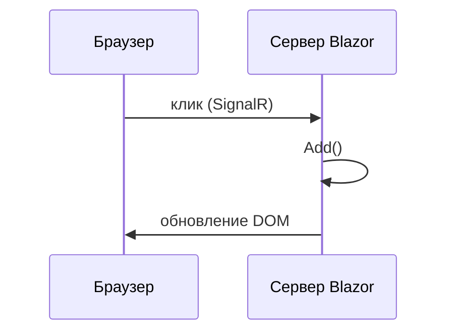

import ExternalCodeEmbed from '@site/src/components/ExternalCodeEmbed';


# Blazor — первая программа

<div class="article-tags">
  <span class="tag tag-required">ОБЯЗАТЕЛЬНО</span>
  <span class="tag tag-beginner">ДЛЯ НОВИЧКОВ</span>
</div>

<span class="complexity-badge">Разработчику</span>
<span class="complexity-badge">Архитектору</span>

---

## Blazor — первая программа

### Порядок освоения Blazor

1. Один компонент: кнопка и счётчик.
2. Ввод текста и список (`List<string>`).
3. HTTP-запрос к API из [Первая программа на ASP.NET Core](./4511.md).
4. Вынос в переиспользуемые компоненты.

Так каждый шаг даёт видимый результат в браузере.

---

### Где применяют Blazor

Обычный сайт: HTML рисует браузер, логику кнопок часто пишут на **JavaScript**. **Blazor** позволяет строить интерактивный веб-интерфейс на **C#** и разметке **Razor** (файлы `.razor`): списки, формы, валидация — теми же типами и коллекциями, что в консоли или API.

Blazor **дополняет** [ASP.NET Core Web API](./4511.md): API отдаёт JSON, Blazor рисует страницы и обрабатывает клики. Типичная схема: Blazor → `HttpClient` → ваш REST API.

Обзор платформы: [ASP.NET](./451.md).

---

### Словарь

| Термин | Простыми словами |
|--------|------------------|
| **Компонент** | Файл `.razor` — кусок UI + код. |
| **Razor** | Смесь HTML и C# (`@`, `@code`, `@foreach`). |
| **Маршрут `@page`** | URL страницы, например `/notes`. |
| **Привязка `@bind`** | Связь поля ввода с полем C#. |
| **SignalR** | Real-time канал; в **Blazor Server** через него уходят клики. |
| **WebAssembly (WASM)** | .NET выполняется в браузере после загрузки DLL. |

---

### Что получится

Страница **"Заметки"**: поле ввода, кнопка "Добавить", список строк. Шаблон `dotnet new blazor` уже содержит счётчик — добавим свой маршрут.

```bash
dotnet new blazor
```

Разбор:
- Команда создаёт новый проект Blazor из стандартного шаблона .NET.
- Шаблон уже включает базовые страницы, маршрутизацию и пример интерактивного компонента.
- Это самый быстрый способ получить рабочую отправную точку для практики.

---

### Требования

- [.NET SDK](https://dotnet.microsoft.com/download) 8 или 9
- Редактор: Visual Studio, Rider или VS Code + C# Dev Kit

---

### Создание проекта

```bash
dotnet new blazor -n HelloBlazor -int Server
cd HelloBlazor
dotnet run
```

Разбор:
- `dotnet new blazor` создаёт проект Blazor с указанной конфигурацией интерактивности.
- `-n HelloBlazor` задаёт имя проекта и корневую папку.
- `-int Server` включает серверный режим интерактива, где обработка событий идёт на сервере через SignalR.
- `cd HelloBlazor` переводит вас в папку проекта для следующих команд.
- `dotnet run` компилирует проект и запускает приложение локально.

| Флаг `-int` | Смысл |
|-------------|--------|
| **Server** | UI на сервере, diff DOM по SignalR — проще для старта. |
| **WebAssembly** | .NET в браузере — больше первый download. |
| **Auto** | Server + WASM в одном шаблоне. |

---

### Модель компонента Razor

`Components/Pages/Notes.razor`:


<ExternalCodeEmbed example="text/csharp-505-4512-001" title="Модель компонента Razor" minHeight={516} />


Разбор:
- `@page "/notes"` привязывает компонент к маршруту `/notes`.
- `@bind="newText"` создаёт двустороннюю связь между полем ввода и переменной `newText`.
- `@onclick="Add"` связывает клик по кнопке с методом `Add`.
- `@foreach (var note in items)` рендерит список заметок из коллекции `items`.
- `@code { ... }` содержит состояние компонента и обработчики событий.
- `string.IsNullOrWhiteSpace(newText)` защищает от добавления пустых записей.
- `items.Add(newText.Trim())` сохраняет очищенный текст в список.
- `newText = ""` очищает поле после добавления и обновляет UI через реактивный ререндер.

---

### Разбор построчно

| Фрагмент | Что происходит |
|----------|----------------|
| `@page "/notes"` | Маршрут `/notes`. |
| `@bind="newText"` | Двусторонняя связь input ↔ поле C#. |
| `@onclick="Add"` | Клик вызывает `Add()` без `addEventListener`. |
| `@foreach` | Цикл по `items` в разметке. |
| `@code { ... }` | Поля и методы компонента. |

Ссылка в `Components/Layout/NavMenu.razor`:

```html
<div class="nav-item px-3">
    <NavLink class="nav-link" href="notes">Заметки</NavLink>
</div>
```

Разбор:
- `NavLink` добавляет пункт в меню и работает как маршрутизируемая ссылка внутри Blazor-приложения.
- Атрибут `href="notes"` ведёт на страницу, объявленную как `@page "/notes"`.
- Классы `nav-item` и `nav-link` отвечают за визуальное оформление в боковом меню.

---

### Как это выполняется (Blazor Server)



Разбор:
- Диаграмма описывает цикл события в Blazor Server.
- Браузер отправляет событие клика по каналу SignalR на сервер.
- Сервер вызывает метод `Add()` и изменяет состояние компонента.
- После пересчёта UI сервер отправляет diff DOM обратно в браузер.
- Такой подход уменьшает объём JS-кода на клиенте и централизует логику в C#.

Состояние `items` живёт в памяти сервера до перезапуска. Для постоянства — API или БД ([Entity Framework Core — первая программа](./441.md), [Первая программа на ASP.NET Core](./4511.md)).

---

### Частые ошибки

| Симптом | Причина |
|---------|---------|
| 404 на `/notes` | Нет `@page` |
| Список не обновляется | Метод не меняет `items` |
| `@bind` "отстаёт" | `@bind:event="oninput"` |

---

### Что попробовать

1. Кнопка "Очистить список".
2. `@items.Count` над списком.
3. Загрузка с API через `HttpClient`.

---

### Практические ориентиры по выбору режима Blazor

| Сценарий | Режим | Почему |
|----------|-------|--------|
| Внутренняя корпоративная система с стабильной сетью | Blazor Server | Быстрый старт и доступ к серверным ресурсам |
| Публичный интерфейс с упором на CDN и клиентский рендер | Blazor WebAssembly | Масштабирование как статического фронтенда |
| Пошаговый переход с Razor Pages | Blazor Auto | Можно постепенно увеличивать долю интерактива |

Связанные материалы:

- [Razor Pages](./4514.md) — серверный HTML и формы.
- [Identity и JWT](./4515.md) — вход пользователей и роли.
- [ASP.NET обзор архитектуры](./451.md) — где Blazor находится в общей картине.

---

### Дальше

- [MAUI — первая программа](./4513.md)
- [/encyclopedia/4-code-dev/4-12-mobilnye-prilozheniya/1133](/encyclopedia/4-code-dev/4-12-mobilnye-prilozheniya/1133)
- [Blazor на Microsoft Learn](https://learn.microsoft.com/ru-ru/aspnet/core/blazor/)

{/* sidebar-collections */}

---

## В подборках

Статья входит в [тематические подборки](/about/collections) и блок «С чего начать?» на [главной](/). Соседние шаги того же маршрута:

**Первые шаги** ([маршрут подборки](/about/collections/pervye-shagi)) — [Первая программа на ASP.NET Core](/encyclopedia/5-languages/5-05-csharp/4511), [.NET MAUI — первая программа](/encyclopedia/5-languages/5-05-csharp/4513), [ADO.NET / Dapper — первая программа](/encyclopedia/5-languages/5-05-csharp/442), [Razor Pages — первая программа](/encyclopedia/5-languages/5-05-csharp/4514), [EF Core — первая программа](/encyclopedia/5-languages/5-05-csharp/441), [CMake — первая программа](/encyclopedia/5-languages/5-06-cpp/1006).

{/* /sidebar-collections */}

---
