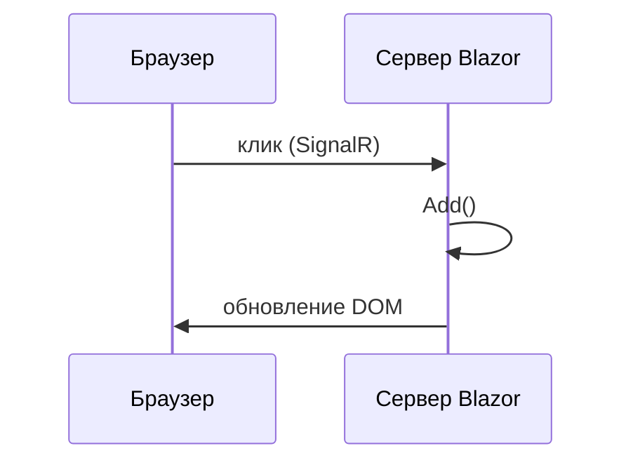

# Blazor — первая программа

<div class="article-tags">
  <span class="tag tag-required">ОБЯЗАТЕЛЬНО</span>
  <span class="tag tag-beginner">ДЛЯ НОВИЧКОВ</span>
</div>

<span class="complexity-badge">Разработчику</span>
<span class="complexity-badge">Архитектору</span>

## Blazor — первая программа

### Где применяют Blazor

Обычный сайт: HTML рисует браузер, логику кнопок часто пишут на **JavaScript**. **Blazor** позволяет строить интерактивный веб-интерфейс на **C#** и разметке **Razor** (файлы `.razor`): списки, формы, валидация — теми же типами и коллекциями, что в консоли или API.

Blazor **дополняет** [ASP.NET Core Web API](./4511.md): API отдаёт JSON, Blazor рисует страницы и обрабатывает клики. Типичная схема: Blazor → `HttpClient` → ваш REST API.

Обзор платформы: [ASP.NET](./451.md).

---

### Словарь

| Термин | Простыми словами |
|--------|------------------|
| **Компонент** | Файл `.razor` — кусок UI + код. |
| **Razor** | Смесь HTML и C# (`@`, `@code`, `@foreach`). |
| **Маршрут `@page`** | URL страницы, например `/notes`. |
| **Привязка `@bind`** | Связь поля ввода с полем C#. |
| **SignalR** | Real-time канал; в **Blazor Server** через него уходят клики. |
| **WebAssembly (WASM)** | .NET выполняется в браузере после загрузки DLL. |

---

### Что получится

Страница **"Заметки"**: поле ввода, кнопка "Добавить", список строк. Шаблон `dotnet new blazor` уже содержит счётчик — добавим свой маршрут.

---

### Требования

- [.NET SDK](https://dotnet.microsoft.com/download) 8 или 9
- Редактор: Visual Studio, Rider или VS Code + C# Dev Kit

---

### Создание проекта

```bash
dotnet new blazor -n HelloBlazor -int Server
cd HelloBlazor
dotnet run
```

| Флаг `-int` | Смысл |
|-------------|--------|
| **Server** | UI на сервере, diff DOM по SignalR — проще для старта. |
| **WebAssembly** | .NET в браузере — больше первый download. |
| **Auto** | Server + WASM в одном шаблоне. |

---

### Модель компонента Razor

`Components/Pages/Notes.razor`:

```razor
@page "/notes"

<h1>Заметки</h1>

<input @bind="newText" placeholder="Текст" />
<button @onclick="Add">Добавить</button>

<ul>
    @foreach (var note in items)
    {
        <li>@note</li>
    }
</ul>

@code {
    private string newText = "";
    private List<string> items = new();

    private void Add()
    {
        if (string.IsNullOrWhiteSpace(newText)) return;
        items.Add(newText.Trim());
        newText = "";
    }
}
```

### Разбор построчно

| Фрагмент | Что происходит |
|----------|----------------|
| `@page "/notes"` | Маршрут `/notes`. |
| `@bind="newText"` | Двусторонняя связь input ↔ поле C#. |
| `@onclick="Add"` | Клик вызывает `Add()` без `addEventListener`. |
| `@foreach` | Цикл по `items` в разметке. |
| `@code { ... }` | Поля и методы компонента. |

Ссылка в `Components/Layout/NavMenu.razor`:

```html
<div class="nav-item px-3">
    <NavLink class="nav-link" href="notes">Заметки</NavLink>
</div>
```

---

### Как это выполняется (Blazor Server)



Состояние `items` живёт в памяти сервера до перезапуска. Для постоянства — API или БД ([441](./441.md), [4511](./4511.md)).

---

### Частые ошибки

| Симптом | Причина |
|---------|---------|
| 404 на `/notes` | Нет `@page` |
| Список не обновляется | Метод не меняет `items` |
| `@bind` "отстаёт" | `@bind:event="oninput"` |

---

### Что попробовать

1. Кнопка "Очистить список".
2. `@items.Count` над списком.
3. Загрузка с API через `HttpClient`.

---

### Дальше

- [MAUI — первая программа](./4513.md)
- [/encyclopedia/4-code-dev/4-12-mobilnye-prilozheniya/1133](/encyclopedia/4-code-dev/4-12-mobilnye-prilozheniya/1133)
- [Blazor на Microsoft Learn](https://learn.microsoft.com/ru-ru/aspnet/core/blazor/)

---
