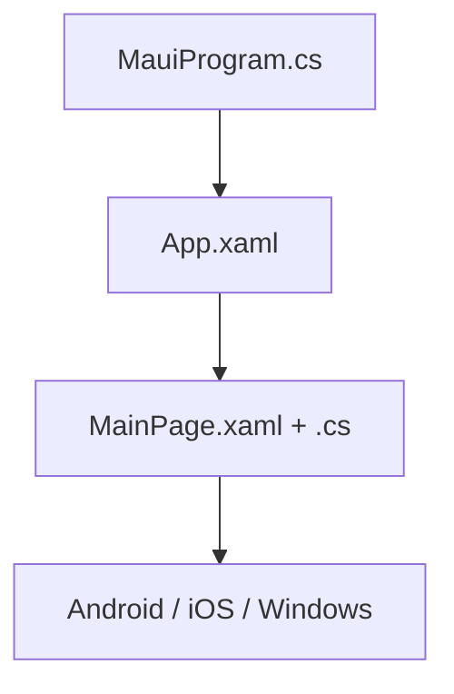

import ExternalCodeEmbed from '@site/src/components/ExternalCodeEmbed';


# .NET MAUI — первая программа

<div class="article-tags">
  <span class="tag tag-required">ОБЯЗАТЕЛЬНО</span>
  <span class="tag tag-beginner">ДЛЯ НОВИЧКОВ</span>
</div>

<span class="complexity-badge">Разработчику</span>
<span class="complexity-badge">Архитектору</span>

---

## .NET MAUI — первая программа

### Перед первым запуском

Сначала соберите проект под **одну** платформу (например, Windows) и проверьте цикл «клик → обновление UI». После этого подключайте Android/iOS и платформенные настройки — так проще не утонуть в workload и эмуляторах.

---

### Где применяют MAUI

**Веб** открывается в браузере. **Нативное приложение** устанавливается на телефон или ПК и использует элементы ОС (Android, iOS, Windows, macOS).

**.NET MAUI** (Multi-platform App UI) — один проект на C#, сборки под разные платформы. Язык тот же, что в [Blazor](./4512.md) и [ASP.NET Core](./4511.md); UI — **страницы** и **XAML**.

Обзор: [/encyclopedia/4-code-dev/4-12-mobilnye-prilozheniya/1133](/encyclopedia/4-code-dev/4-12-mobilnye-prilozheniya/1133). Документация: [Первое приложение MAUI](https://learn.microsoft.com/ru-ru/dotnet/maui/get-started/first-app?view=net-maui-10.0).

---

### Словарь

| Термин | Простыми словами |
|--------|------------------|
| **Страница (Page)** | Один экран, обычно `ContentPage`. |
| **XAML** | XML-разметка UI. |
| **Code-behind** | `.xaml.cs` — обработчики на C#. |
| **partial class** | Класс = ваш код + сгенерированный из XAML. |
| **Workload** | `dotnet workload install maui` — SDK для мобильной сборки. |

---

### Требования

```bash
dotnet workload install maui
dotnet --version
```

Разбор:
- `dotnet workload install maui` устанавливает MAUI workload в текущий .NET SDK.
- Workload добавляет шаблоны, инструменты сборки и платформенные зависимости для MAUI-проектов.
- `dotnet --version` проверяет активную версию SDK после установки и помогает сверить окружение.

| Платформа | Инструмент |
|-----------|------------|
| Windows | Visual Studio 2022 + mobile workload |
| macOS | VS / CLI + Xcode для iOS |
| CLI | Android SDK + эмулятор |

---

### Создание и запуск

```bash
dotnet new maui -n HelloMaui
cd HelloMaui
dotnet build -t:Run -f net8.0-windows10.0.19041.0
```

Разбор:
- `dotnet new maui` создаёт новый кроссплатформенный проект .NET MAUI.
- `-n HelloMaui` задаёт имя проекта и рабочей директории.
- `cd HelloMaui` открывает каталог проекта для сборки и запуска.
- `dotnet build -t:Run` собирает проект и сразу запускает приложение.
- `-f net8.0-windows10.0.19041.0` выбирает конкретный target framework для Windows.

Framework смотрите в `.csproj` (`<TargetFrameworks>`).



Разбор:
- Диаграмма показывает цепочку инициализации MAUI-приложения.
- `MauiProgram.cs` конфигурирует DI и стартовую инфраструктуру.
- `App.xaml` определяет корневое приложение и начальную страницу.
- `MainPage.xaml + .cs` объединяют разметку UI и код обработчиков.
- На этапе сборки эта связка выпускается под выбранную ОС-цель.

---

### Логика счётчика

`MainPage.xaml.cs`:


<ExternalCodeEmbed example="csharp/csharp-505-4513-001" title="Логика счётчика" minHeight={408} />


Разбор:
- `public partial class MainPage : ContentPage` описывает экран приложения, разделённый между XAML и code-behind.
- Поле `int count;` хранит текущее состояние счётчика.
- Конструктор `MainPage()` вызывает `InitializeComponent()`, который загружает элементы из `MainPage.xaml`.
- `OnCounterClicked(object sender, EventArgs e)` — обработчик события нажатия кнопки.
- `count++` увеличивает счётчик на единицу при каждом клике.
- `CounterLabel.Text = ...` обновляет текст на экране, показывая новое значение.

| Элемент | Смысл |
|---------|--------|
| `partial class` | Связка с XAML через `InitializeComponent()`. |
| `ContentPage` | Экран с содержимым. |
| `OnCounterClicked` | Имя = `Clicked="OnCounterClicked"` в XAML. |
| `CounterLabel` | Поле из `x:Name="CounterLabel"`. |

Фрагмент `MainPage.xaml`:

```xml
<ContentPage ... x:Class="HelloMaui.MainPage">
    <VerticalStackLayout Padding="24" Spacing="12">
        <Label x:Name="CounterLabel" Text="Нажмите кнопку" />
        <Button Text="+" Clicked="OnCounterClicked" />
    </VerticalStackLayout>
</ContentPage>
```

Разбор:
- `x:Class="HelloMaui.MainPage"` связывает XAML-страницу с классом `MainPage` в `.xaml.cs`.
- `VerticalStackLayout` размещает элементы вертикально и управляет отступами.
- `Label` с `x:Name="CounterLabel"` создаёт именованный элемент, доступный из C# как поле.
- `Button` с `Clicked="OnCounterClicked"` привязывает событие нажатия к методу-обработчику.
- Этот блок формирует минимальный интерактивный UI: текст + кнопка.

---

### Структура проекта

| Путь | Назначение |
|------|------------|
| `Platforms/` | Точки входа Android, iOS, Windows |
| `Resources/` | Иконки, стили |
| `MauiProgram.cs` | DI, регистрация `App` |
| `MainPage.xaml` | Разметка |
| `MainPage.xaml.cs` | Логика |

---

### Список заметок

1. `ObservableCollection<string> Notes`
2. `CollectionView` + `ItemsSource="&#123;Binding Notes&#125;"`
3. `Entry` + `Button` → добавление

Для нескольких экранов — **MVVM** (`CommunityToolkit.Mvvm`).

Мини-пример ViewModel для этого шага:


<ExternalCodeEmbed example="csharp/csharp-505-4513-002" title="Список заметок" minHeight={336} />


Разбор:
- `NotesViewModel : ObservableObject` реализует базовую поддержку уведомлений об изменениях для MVVM.
- Атрибут `[ObservableProperty]` генерирует полноценное свойство `NewText` и событие `PropertyChanged`.
- `ObservableCollection<string> Notes` автоматически уведомляет UI при добавлении или удалении элементов.
- `[RelayCommand]` генерирует команду `AddCommand`, которую удобно привязывать к кнопкам в XAML.
- Проверка `string.IsNullOrWhiteSpace(NewText)` отсекает пустой ввод.
- `Notes.Add(NewText.Trim())` добавляет очищенную строку в список заметок.
- `NewText = ""` очищает поле ввода после добавления.

---

### MAUI, Blazor и API

| Задача | Инструмент |
|--------|------------|
| Сторы (Play / App Store) | MAUI |
| Сайт в браузере | Blazor |
| Backend | [Первая программа на ASP.NET Core](./4511.md), [Identity — JWT, cookie и MVC](./4515.md) |

---

### Частые ошибки

| Симптом | Причина |
|---------|---------|
| Android не собирается | Нет SDK / эмулятор |
| `InitializeComponent` не найден | Ошибка в XAML, неверный `x:Class` |
| Кнопка молчит | Разные имена в `Clicked` и C# |

---

### Что обычно добавляют после первого экрана

1. Локальное хранение (SQLite) для offline-сценариев.
2. Вызов API на ASP.NET Core ([Первая программа на ASP.NET Core](./4511.md)) через `HttpClient`.
3. Авторизацию через JWT ([Identity — JWT, cookie и MVC](./4515.md)).
4. Разделение на слои: `Views`, `ViewModels`, `Services`, `Models`.

---

### Дальше

- [Blazor](./4512.md)
- [Отладка по USB на Android](/encyclopedia/4-code-dev/4-12-mobilnye-prilozheniya/1121)
- [WinForms и WPF — простые окна (Lab)](/lab/Примеры/1138) — Windows-only UI до кроссплатформы MAUI
- [Платформа .NET — обзор](/encyclopedia/5-languages/5-04-platforma-dotnet/intro)

{/* sidebar-collections */}

---

## В подборках

Статья входит в [тематические подборки](/about/collections) и блок «С чего начать?» на [главной](/). Соседние шаги того же маршрута:

**Первые шаги** ([маршрут подборки](/about/collections/pervye-shagi)) — [Blazor — первая программа](/encyclopedia/5-languages/5-05-csharp/4512), [Razor Pages — первая программа](/encyclopedia/5-languages/5-05-csharp/4514), [Первая программа на ASP.NET Core](/encyclopedia/5-languages/5-05-csharp/4511), [CMake — первая программа](/encyclopedia/5-languages/5-06-cpp/1006), [ADO.NET / Dapper — первая программа](/encyclopedia/5-languages/5-05-csharp/442), [Qt — первая программа](/encyclopedia/5-languages/5-06-cpp/2731).

{/* /sidebar-collections */}

---
