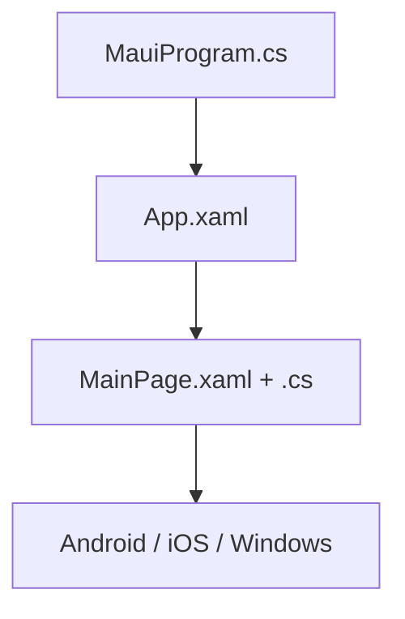

# .NET MAUI — первая программа

<div class="article-tags">
  <span class="tag tag-required">ОБЯЗАТЕЛЬНО</span>
  <span class="tag tag-beginner">ДЛЯ НОВИЧКОВ</span>
</div>

<span class="complexity-badge">Разработчику</span>
<span class="complexity-badge">Архитектору</span>

---

## .NET MAUI — первая программа

### Плавный старт перед первым запуском

MAUI кажется "большим" из-за нескольких платформ, поэтому полезно отделить обязательное от необязательного:

- сначала поднимите только одну цель (например, Windows);
- проверьте базовый цикл "клик → обновление UI";
- затем добавляйте Android/iOS и отдельные платформенные нюансы.

Так вы быстрее получаете рабочее приложение и не теряетесь в инфраструктуре.

---

### Где применяют MAUI

**Веб** открывается в браузере. **Нативное приложение** устанавливается на телефон или ПК и использует элементы ОС (Android, iOS, Windows, macOS).

**.NET MAUI** (Multi-platform App UI) — один проект на C#, сборки под разные платформы. Язык тот же, что в [Blazor](./4512.md) и [ASP.NET Core](./4511.md); UI — **страницы** и **XAML**.

Обзор: [/encyclopedia/4-code-dev/4-12-mobilnye-prilozheniya/1133](/encyclopedia/4-code-dev/4-12-mobilnye-prilozheniya/1133). Документация: [Первое приложение MAUI](https://learn.microsoft.com/ru-ru/dotnet/maui/get-started/first-app?view=net-maui-10.0).

---

### Словарь

| Термин | Простыми словами |
|--------|------------------|
| **Страница (Page)** | Один экран, обычно `ContentPage`. |
| **XAML** | XML-разметка UI. |
| **Code-behind** | `.xaml.cs` — обработчики на C#. |
| **partial class** | Класс = ваш код + сгенерированный из XAML. |
| **Workload** | `dotnet workload install maui` — SDK для мобильной сборки. |

---

### Требования

```bash
dotnet workload install maui
dotnet --version
```

| Платформа | Инструмент |
|-----------|------------|
| Windows | Visual Studio 2022 + mobile workload |
| macOS | VS / CLI + Xcode для iOS |
| CLI | Android SDK + эмулятор |

---

### Создание и запуск

```bash
dotnet new maui -n HelloMaui
cd HelloMaui
dotnet build -t:Run -f net8.0-windows10.0.19041.0
```

Framework смотрите в `.csproj` (`<TargetFrameworks>`).



---

### Логика счётчика

`MainPage.xaml.cs`:

```csharp
namespace HelloMaui;

public partial class MainPage : ContentPage
{
    int count;

    public MainPage()
    {
        InitializeComponent();
    }

    private void OnCounterClicked(object sender, EventArgs e)
    {
        count++;
        CounterLabel.Text = count == 1
            ? $"Нажато {count} раз"
            : $"Нажато {count} раз";
    }
}
```

| Элемент | Смысл |
|---------|--------|
| `partial class` | Связка с XAML через `InitializeComponent()`. |
| `ContentPage` | Экран с содержимым. |
| `OnCounterClicked` | Имя = `Clicked="OnCounterClicked"` в XAML. |
| `CounterLabel` | Поле из `x:Name="CounterLabel"`. |

Фрагмент `MainPage.xaml`:

```xml
<ContentPage ... x:Class="HelloMaui.MainPage">
    <VerticalStackLayout Padding="24" Spacing="12">
        <Label x:Name="CounterLabel" Text="Нажмите кнопку" />
        <Button Text="+" Clicked="OnCounterClicked" />
    </VerticalStackLayout>
</ContentPage>
```

---

### Структура проекта

| Путь | Назначение |
|------|------------|
| `Platforms/` | Точки входа Android, iOS, Windows |
| `Resources/` | Иконки, стили |
| `MauiProgram.cs` | DI, регистрация `App` |
| `MainPage.xaml` | Разметка |
| `MainPage.xaml.cs` | Логика |

---

### Список заметок (идея)

1. `ObservableCollection<string> Notes`
2. `CollectionView` + `ItemsSource="{Binding Notes}"`
3. `Entry` + `Button` → добавление

Для нескольких экранов — **MVVM** (`CommunityToolkit.Mvvm`).

Мини-пример ViewModel для этого шага:

```csharp
public partial class NotesViewModel : ObservableObject
{
    [ObservableProperty]
    private string newText = "";

    public ObservableCollection<string> Notes { get; } = new();

    [RelayCommand]
    private void Add()
    {
        if (string.IsNullOrWhiteSpace(NewText)) return;
        Notes.Add(NewText.Trim());
        NewText = "";
    }
}
```

---

### MAUI, Blazor и API

| Задача | Инструмент |
|--------|------------|
| Сторы (Play / App Store) | MAUI |
| Сайт в браузере | Blazor |
| Backend | [4511](./4511.md), [4515](./4515.md) |

---

### Частые ошибки

| Симптом | Причина |
|---------|---------|
| Android не собирается | Нет SDK / эмулятор |
| `InitializeComponent` не найден | Ошибка в XAML, неверный `x:Class` |
| Кнопка молчит | Разные имена в `Clicked` и C# |

---

### Что обычно добавляют после первого экрана

1. Локальное хранение (SQLite) для offline-сценариев.
2. Вызов API на ASP.NET Core ([4511](./4511.md)) через `HttpClient`.
3. Авторизацию через JWT ([4515](./4515.md)).
4. Разделение на слои: `Views`, `ViewModels`, `Services`, `Models`.

---

### Дальше

- [Blazor](./4512.md)
- [1121.md](/encyclopedia/4-code-dev/4-12-mobilnye-prilozheniya/1121)
- [Платформа .NET — обзор](/encyclopedia/5-languages/5-04-platforma-dotnet/intro)

---