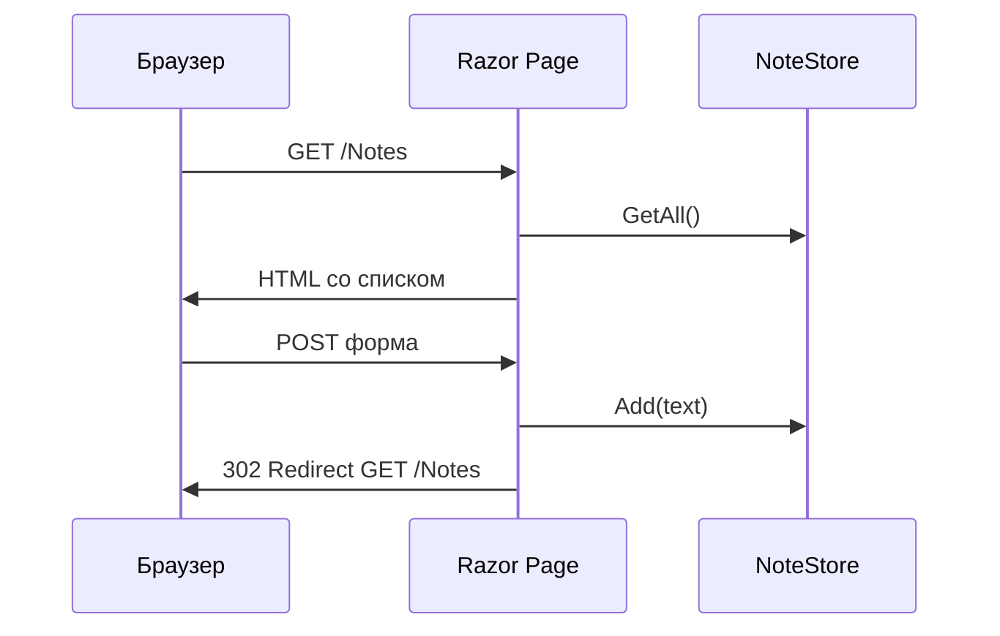

import FirstProgramPlay from '@site/src/components/FirstProgramPlay.jsx';

# Razor Pages — первая программа

<div class="article-tags">
  <span class="tag tag-required">ОБЯЗАТЕЛЬНО</span>
  <span class="tag tag-beginner">ДЛЯ НОВИЧКОВ</span>
</div>

<span class="complexity-badge">Разработчику</span>

<FirstProgramPlay language="aspnet" />

---

## Razor Pages — первая программа

### Плавный старт

Razor Pages удобно воспринимать как "HTML-страница + C#-класс рядом". Такой формат снижает порог входа:

- верстка и обработчик находятся рядом;
- проще проследить путь данных из формы в C#;
- легче вносить маленькие изменения без сложной структуры контроллеров.

Для первых CRUD-экранов это обычно самый быстрый путь к рабочему результату.

---

### Razor Pages — серверный HTML

**Web API** ([4511](./4511.md)) отдаёт **JSON** — данные для программ. **Razor Pages** отдаёт **готовый HTML**: сервер собирает страницу из шаблона и отправляет браузеру. Удобно для админок, внутренних панелей, форм регистрации, отчётов — без отдельного React/Vue.

Модель простая: **одна страница = два файла**

- `Something.cshtml` — разметка (HTML + директивы Razor);
- `Something.cshtml.cs` — класс **PageModel** с методами `OnGet`, `OnPost`.

| Подход | Когда выбирать |
|--------|----------------|
| [Web API](./4511.md) | Мобильное приложение, SPA, интеграции |
| **Razor Pages** | HTML с сервера, CRUD-формы, отчёты |
| [Blazor](./4512.md) | Интерактивный UI на C# в браузере (SignalR или WASM) |
| MVC (в [451](./451.md)) | Крупный сайт: один контроллер на много разных View |

Мы сделаем мини-сайт **"Заметки"**: список и форма добавления. Данные в памяти — как в [4511](./4511.md); с БД — [441](./441.md).

---

### Словарь

| Термин | Простыми словами |
|--------|------------------|
| **PageModel** | Класс с данными страницы и обработчиками HTTP. |
| **OnGet** | Выполняется при `GET` — показать страницу. |
| **OnPost** | Выполняется при отправке формы `method="post"`. |
| **Model binding** | Значения из формы попадают в свойства с `[BindProperty]`. |
| **ModelState** | Список ошибок валидации после привязки. |
| **Tag Helper** | Атрибуты `asp-for`, `asp-validation-for` — связь HTML и модели. |
| **PRG** | Post-Redirect-Get: после POST редирект на GET, чтобы F5 не дублировал отправку. |
| **CSRF** | Подделка запроса с чужого сайта; формы защищают скрытым токеном. |

---

### Что получится

| URL | Файл | Действие |
|-----|------|----------|
| `/` | `Pages/Index.cshtml` | Приветствие |
| `/Notes` | `Pages/Notes/Index` | Список + форма |
| POST `/Notes` | тот же PageModel | Добавить заметку |

---

## Требования

- .NET SDK 8+
- Базовый HTML помогает читать разметку, но не обязателен

---

## Создание проекта

```bash
dotnet new webapp -n NotesRazor -o NotesRazor
cd NotesRazor
dotnet run
```

Шаблон **`webapp`** включает Razor Pages (папка `Pages/`). Откройте URL из консоли — стартовая страница уже работает.

---

## Как устроена страница

Директива вверху `.cshtml`:

```razor
@page "/notes"
```

Без `@page` файл — просто фрагмент; с `@page` — **маршрут**. По умолчанию путь строится из папки: `Pages/Notes/Index.cshtml` → `/Notes`.

Структура:

```
Pages/
  Notes/
    Index.cshtml      ← разметка
    Index.cshtml.cs   ← OnGet, OnPost, свойства
```



---

## Модель заметки

`Models/Note.cs`:

```csharp
namespace NotesRazor.Models;

public class Note
{
    public int Id { get; set; }
    public string Text { get; set; } = "";
    public DateTime Created { get; set; } = DateTime.UtcNow;
}
```

`Services/NoteStore.cs` — хранилище в памяти:

```csharp
using NotesRazor.Models;

namespace NotesRazor.Services;

public class NoteStore
{
    private readonly List<Note> _items = new();
    private int _nextId = 1;

    public IReadOnlyList<Note> GetAll() =>
        _items.OrderByDescending(n => n.Created).ToList();

    public void Add(string text)
    {
        _items.Add(new Note { Id = _nextId++, Text = text.Trim() });
    }
}
```

`Program.cs`:

```csharp
builder.Services.AddSingleton<NoteStore>();
```

**Singleton** — один список на всё приложение (для учебного примера достаточно; с БД будет `DbContext` со **Scoped**).

---

## PageModel — список и добавление

`Pages/Notes/Index.cshtml.cs`:

```csharp
using System.ComponentModel.DataAnnotations;
using Microsoft.AspNetCore.Mvc;
using Microsoft.AspNetCore.Mvc.RazorPages;
using NotesRazor.Services;

namespace NotesRazor.Pages.Notes;

public class IndexModel : PageModel
{
    private readonly NoteStore _store;

    public IndexModel(NoteStore store) => _store = store;

    public IReadOnlyList<Models.Note> Items { get; private set; } = [];

    [BindProperty]
    [Required(ErrorMessage = "Введите текст заметки")]
    [StringLength(500)]
    public string NewText { get; set; } = "";

    public void OnGet()
    {
        Items = _store.GetAll();
    }

    public IActionResult OnPost()
    {
        if (!ModelState.IsValid)
        {
            Items = _store.GetAll();
            return Page();
        }

        _store.Add(NewText);
        return RedirectToPage();
    }
}
```

---

### Разбор PageModel

| Элемент | Смысл |
|---------|--------|
| `: PageModel` | Базовый класс Razor Pages; даёт `ModelState`, `RedirectToPage`, `Page()`. |
| Конструктор `NoteStore` | **DI** подставляет зарегистрированный сервис. |
| `Items` | Данные для списка в разметке (`Model.Items`). |
| `[BindProperty]` | При POST поле формы с именем `NewText` заполнит свойство. |
| `[Required]`, `[StringLength]` | Валидация; ошибки попадут в `ModelState`. |
| `OnGet()` | Подготовить данные и показать страницу (без изменений). |
| `!ModelState.IsValid` | Ошибка валидации — снова показать форму с сообщениями. |
| `return Page()` | Отрендерить тот же `.cshtml` с текущей моделью. |
| `RedirectToPage()` | **PRG**: после успеха редирект на GET `/Notes` — обновление F5 только перечитает список. |

---

## Разметка страницы

`Pages/Notes/Index.cshtml`:

```razor
@page
@model NotesRazor.Pages.Notes.IndexModel

<h1>Заметки</h1>

<form method="post">
    <div asp-validation-summary="All" class="text-danger"></div>
    <input asp-for="NewText" class="form-control" placeholder="Новая заметка" />
    <span asp-validation-for="NewText" class="text-danger"></span>
    <button type="submit" class="btn btn-primary mt-2">Добавить</button>
</form>

<ul class="mt-4">
    @foreach (var note in Model.Items)
    {
        <li><small>@note.Created.ToLocalTime():g</small> — @note.Text</li>
    }
</ul>
```

| Tag Helper | Что делает |
|------------|------------|
| `asp-for="NewText"` | `name`, `id`, значение поля связаны с `NewText`; для POST — правильное имя. |
| `asp-validation-for="NewText"` | Показать текст ошибки из `ModelState`. |
| `asp-validation-summary="All"` | Сводка всех ошибок над формой. |
| `<form method="post">` | Отправка на тот же URL → вызов `OnPost`. |

Форма с tag helpers **добавляет anti-forgery token** — скрытое поле, без которого POST вернёт 400 (защита от **CSRF**).

`Pages/_ViewImports.cshtml` (шаблон создаёт сам):

```razor
@using NotesRazor
@namespace NotesRazor.Pages
@addTagHelper *, Microsoft.AspNetCore.Mvc.TagHelpers
```

---

### Валидация формы на практике

Частая схема для полей ввода:

| Поле | Проверка | Зачем |
|------|----------|-------|
| `NewText` | `[Required]` | Не сохранять пустые записи |
| `NewText` | `[StringLength(500)]` | Ограничить размер данных |
| `ModelState` | `if (!ModelState.IsValid)` | Вернуть форму с ошибками |

Когда логика становится сложнее, валидацию стоит вынести в отдельные модели запроса и сервисы предметной области. Для API-варианта этого же потока см. [4511](./4511.md) и [4515](./4515.md).

---

## Ссылка с главной

`Pages/Index.cshtml`:

```html
<p><a href="/Notes">Мои заметки</a></p>
```

```bash
dotnet run
```

Добавьте заметки, нажмите F5 — дубликатов POST не будет благодаря redirect.

---

## Razor Pages и Web API в одном проекте

```csharp
builder.Services.AddRazorPages();
builder.Services.AddControllers();

var app = builder.Build();
app.MapRazorPages();
app.MapControllers();
```

Админка на Razor, публичное API — на контроллерах. Архитектура: [451](./451.md).

---

## Частые ошибки

| Симптом | Причина |
|---------|---------|
| 404 на `/Notes` | Нет `@page` или файл не `Pages/Notes/Index.cshtml` |
| POST не сохраняет | Нет `[BindProperty]` или `method="get"` у формы |
| Двойная отправка при F5 | Нет `RedirectToPage()` после успешного POST |
| Валидация не видна | Нет `asp-validation-for` / tag helpers |
| 400 Bad Request на POST | Убрали tag helpers — нет anti-forgery token |

---

### Что попробовать

1. `OnPostDelete(int id)` с кнопкой удаления в форме.
2. Замените `NoteStore` на [EF Core](./441.md).
3. `[Authorize]` на папке `Notes` после [4515](./4515.md).

---

## Дальше

- [ASP.NET Core Web API](./4511.md) · [Identity и JWT](./4515.md)
- [Безопасность приложений](./43.md) · [ASP.NET — обзор](./451.md)

---

{/* http-basics-link  */}
<div class="callout callout--tip">
  <div class="callout-title">Основа по протоколу</div>

  <div class="callout-body">
  Базовый разбор HTTP и HTTPS находится в отдельной статье — [HTTP как основа веб-интеграций](/encyclopedia/2-system-network/2-09-osnovy-integratsionnogo-vzaimodeystviya/118).
</div>
  </div>


