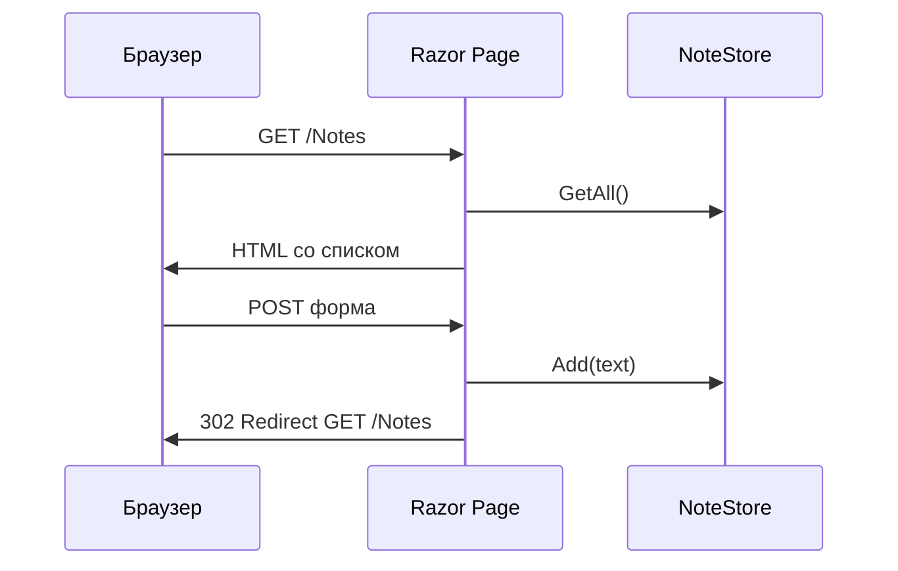

import ExternalCodeEmbed from '@site/src/components/ExternalCodeEmbed';


import ExternalPlayEmbed from '@site/src/components/ExternalPlayEmbed';


# Razor Pages — первая программа

<div class="article-tags">
  <span class="tag tag-required">ОБЯЗАТЕЛЬНО</span>
  <span class="tag tag-beginner">ДЛЯ НОВИЧКОВ</span>
</div>

<span class="complexity-badge">Разработчику</span>

<ExternalPlayEmbed example="lab/first-program-play" title="Первая программа" minHeight={420} playProps={{ language: 'aspnet' }} />

---

## Razor Pages — первая программа

### Модель Razor Pages

Страница = **разметка + C#-класс рядом** (`PageModel`): верстка и обработчик в одном месте, проще проследить путь данных из формы. Для первых CRUD-экранов и внутренних панелей это часто быстрее, чем отдельный SPA.

---

### Razor Pages — серверный HTML

**Web API** ([Первая программа на ASP.NET Core](./4511.md)) отдаёт **JSON** — данные для программ. **Razor Pages** отдаёт **готовый HTML**: сервер собирает страницу из шаблона и отправляет браузеру. Удобно для админок, внутренних панелей, форм регистрации, отчётов — без отдельного React/Vue.

Модель простая: **одна страница = два файла**

- `Something.cshtml` — разметка (HTML + директивы Razor);
- `Something.cshtml.cs` — класс **PageModel** с методами `OnGet`, `OnPost`.

| Подход | Когда выбирать |
|--------|----------------|
| [Web API](./4511.md) | Мобильное приложение, SPA, интеграции |
| **Razor Pages** | HTML с сервера, CRUD-формы, отчёты |
| [Blazor](./4512.md) | Интерактивный UI на C# в браузере (SignalR или WASM) |
| MVC (в [ASP.NET - фреймворк для веб-приложений](./451.md)) | Крупный сайт: один контроллер на много разных View |

Мы сделаем мини-сайт **"Заметки"**: список и форма добавления. Данные в памяти — как в [Первая программа на ASP.NET Core](./4511.md); с БД — [Entity Framework Core — первая программа](./441.md).

---

### Словарь

| Термин | Простыми словами |
|--------|------------------|
| **PageModel** | Класс с данными страницы и обработчиками HTTP. |
| **OnGet** | Выполняется при `GET` — показать страницу. |
| **OnPost** | Выполняется при отправке формы `method="post"`. |
| **Model binding** | Значения из формы попадают в свойства с `[BindProperty]`. |
| **ModelState** | Список ошибок валидации после привязки. |
| **Tag Helper** | Атрибуты `asp-for`, `asp-validation-for` — связь HTML и модели. |
| **PRG** | Post-Redirect-Get: после POST редирект на GET, чтобы F5 не дублировал отправку. |
| **CSRF** | Подделка запроса с чужого сайта; формы защищают скрытым токеном. |

---

### Что получится

| URL | Файл | Действие |
|-----|------|----------|
| `/` | `Pages/Index.cshtml` | Приветствие |
| `/Notes` | `Pages/Notes/Index` | Список + форма |
| POST `/Notes` | тот же PageModel | Добавить заметку |

---

## Требования

- .NET SDK 8+
- Базовый HTML помогает читать разметку, но не обязателен

---

## Создание проекта

```bash
dotnet new webapp -n NotesRazor -o NotesRazor
cd NotesRazor
dotnet run
```

Разбор:
- `dotnet new webapp` создаёт проект Razor Pages со стандартной структурой `Pages`, `wwwroot`, `Program.cs`.
- Ключ `-n NotesRazor` задаёт имя проекта и будущую сборку `NotesRazor.csproj`.
- Ключ `-o NotesRazor` указывает папку вывода, чтобы шаблон создал отдельный каталог.
- `cd NotesRazor` переключает рабочую директорию в корень проекта перед запуском.
- `dotnet run` собирает проект, поднимает встроенный Kestrel и выводит URL локального сервера.

Шаблон **`webapp`** включает Razor Pages (папка `Pages/`). Откройте URL из консоли — стартовая страница уже работает.

---

## Как устроена страница

Директива вверху `.cshtml`:

```razor
@page "/notes"
```

Разбор:
- Директива `@page` переводит `.cshtml` из шаблона-представления в полноценный endpoint Razor Pages.
- Строка `"/notes"` явно фиксирует маршрут страницы и отключает автогенерацию URL из пути файла.
- При `GET /notes` ASP.NET Core связывает этот маршрут с текущим PageModel и вызывает `OnGet`.
- Такой стиль удобен, когда URL нужно сделать человеко-понятным и независимым от структуры папок.

Без `@page` файл — просто фрагмент; с `@page` — **маршрут**. По умолчанию путь строится из папки: `Pages/Notes/Index.cshtml` → `/Notes`.

Структура:

```
Pages/
  Notes/
    Index.cshtml      ← разметка
    Index.cshtml.cs   ← OnGet, OnPost, свойства
```



Разбор:
- Диаграмма описывает полный цикл `GET` и `POST` для одной страницы `/Notes`.
- На `GET` PageModel получает данные из `NoteStore` и сервер рендерит HTML со списком заметок.
- На `POST` браузер отправляет форму, сервер выполняет `Add(text)` и сохраняет новую запись.
- Ответ `302 Redirect` реализует паттерн PRG и предотвращает повторную отправку формы при обновлении страницы.
- Повторный `GET /Notes` уже читает обновлённые данные и отдаёт их как итоговое состояние UI.

---

## Модель заметки

`Models/Note.cs`:

```csharp
namespace NotesRazor.Models;

public class Note
{
    public int Id { get; set; }
    public string Text { get; set; } = "";
    public DateTime Created { get; set; } = DateTime.UtcNow;
}
```

Разбор:
- `namespace NotesRazor.Models;` группирует модель в отдельном пространстве имён и упрощает импорт.
- Класс `Note` задаёт структуру сущности, которую будут хранить и показывать Razor-страницы.
- Свойство `Id` служит уникальным идентификатором записи для отображения и будущих операций обновления/удаления.
- `Text` хранит содержимое заметки; инициализация `""` исключает `null` в простом учебном примере.
- `Created` заполняется `DateTime.UtcNow`, чтобы дата создавалась автоматически и была в универсальном формате UTC.

`Services/NoteStore.cs` — хранилище в памяти:


<ExternalCodeEmbed example="csharp/csharp-505-4514-001" title="Модель заметки" minHeight={372} />


Разбор:
- Поле `_items` хранит заметки в памяти процесса, без базы данных и внешних зависимостей.
- `_nextId` обеспечивает последовательную выдачу идентификаторов при каждом добавлении.
- Метод `GetAll()` сортирует список по `Created` в обратном порядке, поэтому новые заметки показываются первыми.
- Возврат `IReadOnlyList<Note>` скрывает возможность прямого изменения коллекции из внешнего кода.
- В `Add(string text)` вызывается `Trim()`, чтобы убрать лишние пробелы по краям пользовательского ввода.

`Program.cs`:

```csharp
builder.Services.AddSingleton<NoteStore>();
```

Разбор:
- `builder.Services` — контейнер зависимостей, где регистрируются сервисы приложения.
- `AddSingleton<NoteStore>()` создаёт один экземпляр `NoteStore` на весь жизненный цикл процесса.
- Все запросы и PageModel получают один и тот же список заметок, поэтому данные "общие" для текущего запуска.
- Для учебного примера это самый короткий путь к рабочему состоянию без настройки БД.

**Singleton** — один список на всё приложение (для учебного примера достаточно; с БД будет `DbContext` со **Scoped**).

---

## PageModel — список и добавление

`Pages/Notes/Index.cshtml.cs`:


<ExternalCodeEmbed example="csharp/csharp-505-4514-002" title="PageModel — список и добавление" minHeight={720} />


Разбор:
- Наследование `PageModel` даёт HTTP-обработчики `OnGet`/`OnPost` и доступ к инфраструктуре Razor Pages.
- Конструктор принимает `NoteStore`, который подставляется через DI, и сохраняет его в `_store`.
- `Items` служит моделью отображения списка заметок в `.cshtml` через `Model.Items`.
- Атрибуты `[BindProperty]`, `[Required]`, `[StringLength]` связывают ввод формы и задают правила валидации.
- В `OnGet()` страница заполняет `Items` для первичной отрисовки.
- В `OnPost()` сначала проверяется `ModelState`, затем при успехе выполняется добавление и `RedirectToPage()` по схеме PRG.

---

### Разбор PageModel

| Элемент | Смысл |
|---------|--------|
| `: PageModel` | Базовый класс Razor Pages; даёт `ModelState`, `RedirectToPage`, `Page()`. |
| Конструктор `NoteStore` | **DI** подставляет зарегистрированный сервис. |
| `Items` | Данные для списка в разметке (`Model.Items`). |
| `[BindProperty]` | При POST поле формы с именем `NewText` заполнит свойство. |
| `[Required]`, `[StringLength]` | Валидация; ошибки попадут в `ModelState`. |
| `OnGet()` | Подготовить данные и показать страницу (без изменений). |
| `!ModelState.IsValid` | Ошибка валидации — снова показать форму с сообщениями. |
| `return Page()` | Отрендерить тот же `.cshtml` с текущей моделью. |
| `RedirectToPage()` | **PRG**: после успеха редирект на GET `/Notes` — обновление F5 только перечитает список. |

---

## Разметка страницы

`Pages/Notes/Index.cshtml`:


<ExternalCodeEmbed example="text/csharp-505-4514-003" title="Разметка страницы" minHeight={390} />


Разбор:
- `@model NotesRazor.Pages.Notes.IndexModel` связывает разметку с конкретным PageModel-классом.
- Форма `method="post"` отправляет данные на тот же URL, из-за чего вызывается метод `OnPost`.
- `asp-for="NewText"` генерирует корректные `name/id/value` и синхронизирует поле с `NewText`.
- `asp-validation-for` и `asp-validation-summary` выводят ошибки валидации из `ModelState`.
- Цикл `@foreach` проходит по `Model.Items` и рендерит каждую заметку вместе с локальным временем создания.

| Tag Helper | Что делает |
|------------|------------|
| `asp-for="NewText"` | `name`, `id`, значение поля связаны с `NewText`; для POST — правильное имя. |
| `asp-validation-for="NewText"` | Показать текст ошибки из `ModelState`. |
| `asp-validation-summary="All"` | Сводка всех ошибок над формой. |
| `<form method="post">` | Отправка на тот же URL → вызов `OnPost`. |

Форма с tag helpers **добавляет anti-forgery token** — скрытое поле, без которого POST вернёт 400 (защита от **CSRF**).

`Pages/_ViewImports.cshtml` (шаблон создаёт сам):

```razor
@using NotesRazor
@namespace NotesRazor.Pages
@addTagHelper *, Microsoft.AspNetCore.Mvc.TagHelpers
```

Разбор:
- `@using NotesRazor` добавляет пространство имён по умолчанию для Razor-страниц.
- `@namespace NotesRazor.Pages` задаёт базовый namespace для классов, связанных с `.cshtml`.
- `@addTagHelper *, Microsoft.AspNetCore.Mvc.TagHelpers` включает стандартные tag helpers ASP.NET Core во всём разделе `Pages`.
- Благодаря этой строке работают `asp-for`, `asp-validation-for`, `asp-page` и другие специальные атрибуты.

---

### Валидация формы на практике

Частая схема для полей ввода:

| Поле | Проверка | Зачем |
|------|----------|-------|
| `NewText` | `[Required]` | Не сохранять пустые записи |
| `NewText` | `[StringLength(500)]` | Ограничить размер данных |
| `ModelState` | `if (!ModelState.IsValid)` | Вернуть форму с ошибками |

Когда логика становится сложнее, валидацию стоит вынести в отдельные модели запроса и сервисы предметной области. Для API-варианта этого же потока см. [Первая программа на ASP.NET Core](./4511.md) и [Identity — JWT, cookie и MVC](./4515.md).

---

## Ссылка с главной

`Pages/Index.cshtml`:

```html
<p><a href="/Notes">Мои заметки</a></p>
```

Разбор:
- Тег `<a href="/Notes">` создаёт переход на страницу заметок по абсолютному пути.
- Абсолютный URL гарантирует корректный переход из любого раздела сайта.
- Такой простой линк полезен как стартовая навигация между главной страницей и CRUD-экраном.

```bash
dotnet run
```

Разбор:
- Команда запускает приложение в текущей конфигурации и собирает изменения перед стартом.
- После запуска можно проверить, что ссылка `/Notes` открывается и форма работает.
- Этот шаг закрепляет полный цикл: рендер, отправка POST, редирект и повторный GET.

Добавьте заметки, нажмите F5 — дубликатов POST не будет благодаря redirect.

---

## Razor Pages и Web API в одном проекте

```csharp
builder.Services.AddRazorPages();
builder.Services.AddControllers();

var app = builder.Build();
app.MapRazorPages();
app.MapControllers();
```

Разбор:
- `AddRazorPages()` подключает инфраструктуру серверного HTML и обработчиков `PageModel`.
- `AddControllers()` включает pipeline для API-контроллеров и JSON endpoint'ов.
- `MapRazorPages()` публикует маршруты страниц из папки `Pages`.
- `MapControllers()` активирует маршрутизацию контроллеров (`[ApiController]`, `[Route]`).
- Комбинация показывает гибридный подход: UI на Razor и интеграционный слой на Web API в одном хосте.

Админка на Razor, публичное API — на контроллерах. Архитектура: [ASP.NET - фреймворк для веб-приложений](./451.md).

---

## Частые ошибки

| Симптом | Причина |
|---------|---------|
| 404 на `/Notes` | Нет `@page` или файл не `Pages/Notes/Index.cshtml` |
| POST не сохраняет | Нет `[BindProperty]` или `method="get"` у формы |
| Двойная отправка при F5 | Нет `RedirectToPage()` после успешного POST |
| Валидация не видна | Нет `asp-validation-for` / tag helpers |
| 400 Bad Request на POST | Убрали tag helpers — нет anti-forgery token |

---

### Что попробовать

1. `OnPostDelete(int id)` с кнопкой удаления в форме.
2. Замените `NoteStore` на [EF Core](./441.md).
3. `[Authorize]` на папке `Notes` после [Identity — JWT, cookie и MVC](./4515.md).

---

## Дальше

- [ASP.NET Core Web API](./4511.md) · [Identity и JWT](./4515.md)
- [Безопасность приложений](./43.md) · [ASP.NET — обзор](./451.md)

---

{/* http-basics-link  */}
<div class="callout callout--tip">
  <div class="callout-title">Основа по протоколу</div>

  <div class="callout-body">
  Базовый разбор HTTP и HTTPS находится в отдельной статье — [HTTP как основа веб-интеграций](/encyclopedia/2-system-network/2-09-osnovy-integratsionnogo-vzaimodeystviya/118).
</div>
  </div>

{/* sidebar-collections */}

---

## В подборках

Статья входит в [тематические подборки](/about/collections) и блок «С чего начать?» на [главной](/). Соседние шаги того же маршрута:

**Первые шаги** ([маршрут подборки](/about/collections/pervye-shagi)) — [.NET MAUI — первая программа](/encyclopedia/5-languages/5-05-csharp/4513), [CMake — первая программа](/encyclopedia/5-languages/5-06-cpp/1006), [Blazor — первая программа](/encyclopedia/5-languages/5-05-csharp/4512), [Qt — первая программа](/encyclopedia/5-languages/5-06-cpp/2731), [Первая программа на ASP.NET Core](/encyclopedia/5-languages/5-05-csharp/4511), [Qt Quick — первая программа на QML](/encyclopedia/5-languages/5-06-cpp/2732).

{/* /sidebar-collections */}

---
