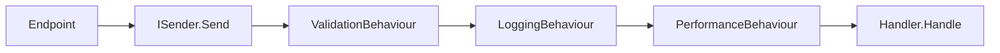

# MediatR и pipeline в слое Application

<div class="article-tags">
  <span class="tag tag-required">ОБЯЗАТЕЛЬНО</span>
  <span class="tag tag-beginner">ДЛЯ НОВИЧКОВ</span>
</div>

<span class="complexity-badge">Разработчику</span>
<span class="complexity-badge">Архитектору</span>

---

## MediatR и pipeline в слое Application

**MediatR** — библиотека "медиатора" для .NET: один объект (`ISender`) принимает **сообщение** (команду или запрос) и передаёт его зарегистрированному **обработчику**. В шаблоне [Clean Architecture на ASP.NET Core](/encyclopedia/7-project/7-06-proektirovanie-i-arhitektura/design/2143) через MediatR связаны HTTP endpoints и классы в `Application`.

Теория CQRS — [2122](/encyclopedia/7-project/7-06-proektirovanie-i-arhitektura/design/2122); сквозная структура solution — [2143](/encyclopedia/7-project/7-06-proektirovanie-i-arhitektura/design/2143). Web API и endpoints — [4511](./4511.md).

---

### Где применяют MediatR в Clean Architecture

| Без MediatR | С MediatR |
|-------------|-----------|
| Endpoint вызывает `IOrderService.Create(...)` | Endpoint вызывает `sender.Send(new CreateOrderCommand(...))` |
| Сервис растёт по мере фич | Каждая операция — отдельный handler в своей папке |
| Cross-cutting копируют в методы | Pipeline behaviours — один раз на все запросы |

MediatR **не заменяет** домен: бизнес-правила остаются в сущностях и value objects. Он **маршрутизирует** вызов сценария из Presentation в Application.

---

### Команда и обработчик

```csharp
// Команда — DTO намерения (изменяет состояние)
public record CreateTodoListCommand : IRequest<int>
{
    public string? Title { get; init; }
}

// Обработчик — один класс на сценарий
public class CreateTodoListCommandHandler : IRequestHandler<CreateTodoListCommand, int>
{
    private readonly IApplicationDbContext _context;

    public CreateTodoListCommandHandler(IApplicationDbContext context) => _context = context;

    public async Task<int> Handle(CreateTodoListCommand request, CancellationToken cancellationToken)
    {
        var entity = new TodoList { Title = request.Title };
        _context.TodoLists.Add(entity);
        await _context.SaveChangesAsync(cancellationToken);
        return entity.Id;
    }
}
```

**Запрос** (query) устроен так же, но возвращает данные и не меняет состояние по контракту CQRS:

```csharp
public record GetTodosQuery : IRequest<TodosVm>;

public class GetTodosQueryHandler : IRequestHandler<GetTodosQuery, TodosVm> { /* ... */ }
```

Регистрация в DI (типично в `Application/DependencyInjection.cs`):

```csharp
services.AddMediatR(cfg => cfg.RegisterServicesFromAssembly(Assembly.GetExecutingAssembly()));
```

---

### ISender из Web-слоя

```csharp
app.MapPost("/api/todo-lists", async (ISender sender, CreateTodoListCommand cmd, CancellationToken ct) =>
{
    var id = await sender.Send(cmd, ct);
    return Results.Created($"/api/todo-lists/{id}", id);
});
```

`ISender` скрывает конкретный handler: endpoint зависит только от **типа команды**. Новый сценарий = новая пара `Command` + `Handler`, без правок существующих endpoints (кроме маршрута).

---

### Pipeline behaviours

`IPipelineBehavior<TRequest, TResponse>` оборачивает вызов handler'а цепочкой, похожей на middleware ASP.NET:



**ValidationBehaviour** — запускает все `IValidator<TRequest>` до handler'а:

```csharp
public class ValidationBehaviour<TRequest, TResponse> : IPipelineBehavior<TRequest, TResponse>
    where TRequest : notnull
{
    private readonly IEnumerable<IValidator<TRequest>> _validators;

    public async Task<TResponse> Handle(
        TRequest request,
        RequestHandlerDelegate<TResponse> next,
        CancellationToken cancellationToken)
    {
        if (_validators.Any())
        {
            var context = new ValidationContext<TRequest>(request);
            var results = await Task.WhenAll(
                _validators.Select(v => v.ValidateAsync(context, cancellationToken)));
            var failures = results.SelectMany(r => r.Errors).Where(f => f != null).ToList();
            if (failures.Count != 0)
                throw new ValidationException(failures);
        }
        return await next();
    }
}
```

Регистрация:

```csharp
services.AddTransient(typeof(IPipelineBehavior<,>), typeof(ValidationBehaviour<,>));
services.AddTransient(typeof(IPipelineBehavior<,>), typeof(LoggingBehaviour<,>));
```

Порядок регистрации задаёт порядок выполнения (первый зарегистрированный — внешний слой цепочки).

---

### FluentValidation

Правила входа команды — рядом с командой:

```csharp
public class CreateTodoListCommandValidator : AbstractValidator<CreateTodoListCommand>
{
    public CreateTodoListCommandValidator()
    {
        RuleFor(v => v.Title)
            .MaximumLength(200)
            .NotEmpty();
    }
}
```

`AddValidatorsFromAssembly` подхватывает валидаторы; `ValidationBehaviour` вызывает их автоматически. Инварианты домена ("нельзя завершить пустую задачу") остаются в **entity**; валидатор проверяет **форму запроса** (длина, обязательные поля).

См. также [Minimal API и OpenAPI](./4517.md) для ошибок 400 на уровне HTTP.

---

### Notifications (события внутри процесса)

`INotification` + `INotificationHandler<T>` — слабая связь **внутри** одного приложения: после `SaveChanges` handler публикует `TodoItemCreatedNotification`, другие handlers реагируют (кэш, email). Это **in-process** pub/sub, не замена брокеру сообщений между сервисами.

Использовать умеренно: избыточная сеть notification'ов усложняет трассировку.

---

### Когда MediatR избыточен

| Признак | Альтернатива |
|---------|--------------|
| 5–10 endpoint'ов, один автор | Прямой вызов сервисов или use-case классов без MediatR |
| Нет общих cross-cutting | Pipeline не окупает абстракцию |
| Команда "нажми F5" для junior | Явные `CreateOrderHandler` в DI без брокера сообщений |

Минимальный Clean Architecture из [2132](/encyclopedia/7-project/7-06-proektirovanie-i-arhitektura/design/2132) **работает без MediatR**: `CreateTaskUseCase` инжектируется в контроллер напрямую.

---

### Связь с тестами

Юнит-тест handler'а:

```csharp
[Fact]
public async Task Handle_Empty_title_fails_validation()
{
    var handler = new CreateTodoListCommandHandler(new FakeDbContext());
    var validator = new CreateTodoListCommandValidator();
    var cmd = new CreateTodoListCommand { Title = "" };

    var result = await validator.ValidateAsync(cmd);
    Assert.False(result.IsValid);
}
```

Интеграционный тест — `WebApplicationFactory` + `POST` с телом JSON ([4516](./4516.md)): проверяется вся цепочка endpoint → MediatR → EF.

---

## Итог

MediatR в слое Application даёт **единую точку входа** для сценариев (`ISender`), **vertical slices** (команда + handler + validator в одной папке) и **pipeline** для валидации и наблюдаемости. Для учебного и корпоративного .NET это удобная реализация CQRS-light; для маленького API достаточно тонких endpoints и явных use-case классов без дополнительной библиотеки.

---
---

{/* http-basics-link  */}
:::tip Основа по протоколу
Базовый разбор HTTP и HTTPS находится в отдельной статье — [HTTP как основа веб-интеграций](/encyclopedia/2-system-network/2-09-osnovy-integratsionnogo-vzaimodeystviya/118).
:::

