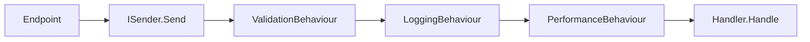

import ExternalCodeEmbed from '@site/src/components/ExternalCodeEmbed';


# MediatR и pipeline в слое Application

<div class="article-tags">
  <span class="tag tag-required">ОБЯЗАТЕЛЬНО</span>
  <span class="tag tag-beginner">ДЛЯ НОВИЧКОВ</span>
</div>

<span class="complexity-badge">Разработчику</span>
<span class="complexity-badge">Архитектору</span>

---

## MediatR и pipeline в слое Application

**MediatR** — библиотека "медиатора" для .NET: один объект (`ISender`) принимает **сообщение** (команду или запрос) и передаёт его зарегистрированному **обработчику**. В шаблоне [Clean Architecture на ASP.NET Core](/encyclopedia/7-project/7-06-proektirovanie-i-arhitektura/design/2143) через MediatR связаны HTTP endpoints и классы в `Application`.

<div class="callout callout--info">
  <div class="callout-title">Не путать с HTTP-pipeline</div>

  <div class="callout-body">
  <strong>Middleware</strong> и <strong>endpoint filters</strong> живут в веб-хосте (Kestrel, маршруты). <strong>IPipelineBehaviour</strong> MediatR — цепочка вокруг <code>IRequest</code> в слое Application: типичная реализация <strong>policy pipeline</strong> (бизнес- и регуляторные проверки перед handler). Схема слоёв — в <a href="./451.md#где-жить-логике-middleware-endpoint-filters-policy-pipeline">451</a>.
</div>
  </div>

Теория CQRS — [2122](/encyclopedia/7-project/7-06-proektirovanie-i-arhitektura/design/2122); сквозная структура solution — [2143](/encyclopedia/7-project/7-06-proektirovanie-i-arhitektura/design/2143). Web API и endpoints — [4511](./4511.md).

На практике MediatR хорошо решает задачу "чтобы каждый сценарий жил отдельно и не раздувал сервисы". Это особенно заметно, когда проект переходит от 5-10 ручек к десяткам use-case'ов.

---

### Где применяют MediatR в Clean Architecture

| Без MediatR | С MediatR |
|-------------|-----------|
| Endpoint вызывает `IOrderService.Create(...)` | Endpoint вызывает `sender.Send(new CreateOrderCommand(...))` |
| Сервис растёт по мере фич | Каждая операция — отдельный handler в своей папке |
| Cross-cutting копируют в методы | Pipeline behaviours — один раз на все запросы |

MediatR **не заменяет** домен: бизнес-правила остаются в сущностях и value objects. Он **маршрутизирует** вызов сценария из Presentation в Application.

---

### Команда и обработчик


<ExternalCodeEmbed example="csharp/csharp-505-4518-001" title="Команда и обработчик" minHeight={444} />


Разбор:
- `CreateTodoListCommand : IRequest<int>` описывает входное сообщение и тип ожидаемого результата (`int`).
- Команда хранит минимальный набор входных данных сценария, здесь — `Title`.
- `IRequestHandler<..., int>` связывает команду с единственным обработчиком этого use-case.
- В `Handle` создаётся сущность, добавляется в контекст и сохраняется через `SaveChangesAsync`.
- Возврат `entity.Id` даёт вызывающей стороне идентификатор только что созданной записи.

**Запрос** (query) устроен так же, но возвращает данные и не меняет состояние по контракту CQRS:

```csharp
public record GetTodosQuery : IRequest<TodosVm>;

public class GetTodosQueryHandler : IRequestHandler<GetTodosQuery, TodosVm> { /* ... */ }
```

Разбор:
- `GetTodosQuery` моделирует read-сценарий и по контракту не должен менять состояние системы.
- Тип `IRequest<TodosVm>` явно показывает, что результат — view model для чтения.
- Отдельный `GetTodosQueryHandler` держит логику выборки данных изолированно от write-команд.
- Такое разделение упрощает поддержку CQRS-light и чтение кода по feature-срезам.

Регистрация в DI (типично в `Application/DependencyInjection.cs`):

```csharp
services.AddMediatR(cfg => cfg.RegisterServicesFromAssembly(Assembly.GetExecutingAssembly()));
```

Разбор:
- `AddMediatR` подключает механизм маршрутизации сообщений к обработчикам.
- `RegisterServicesFromAssembly(...)` автоматически сканирует текущую сборку на handlers/notifications.
- Подход избавляет от ручной регистрации каждого `IRequestHandler` в DI.
- После регистрации `ISender.Send(...)` начинает находить нужный обработчик по типу запроса.

---

### ISender из Web-слоя

```csharp
app.MapPost("/api/todo-lists", async (ISender sender, CreateTodoListCommand cmd, CancellationToken ct) =>
{
    var id = await sender.Send(cmd, ct);
    return Results.Created($"/api/todo-lists/{id}", id);
});
```

Разбор:
- Endpoint получает `ISender` из DI и не зависит от конкретных handler-классов.
- `CreateTodoListCommand cmd` автоматически биндится из HTTP-тела запроса.
- `sender.Send(cmd, ct)` передаёт команду в MediatR pipeline и далее в целевой handler.
- `Results.Created(...)` возвращает `201` и URL созданного ресурса.
- Такой слой делает web-обработчик тонким и переносит бизнес-логику в Application.

`ISender` скрывает конкретный handler: endpoint зависит только от **типа команды**. Новый сценарий = новая пара `Command` + `Handler`, без правок существующих endpoints (кроме маршрута).

---

### Pipeline behaviours

`IPipelineBehavior<TRequest, TResponse>` оборачивает вызов handler'а цепочкой, похожей на middleware ASP.NET:



Разбор:
- Диаграмма отражает цепочку выполнения: endpoint вызывает `ISender`, дальше идут pipeline-поведения.
- Каждый behavior оборачивает следующий слой и может выполнять код до и после `next`.
- `ValidationBehaviour` блокирует невалидные запросы до обращения к доменной логике.
- `Logging/Performance` добавляют наблюдаемость без копирования кода в каждый handler.
- Конечный бизнес-код запускается только на этапе `Handler.Handle`.

**ValidationBehaviour** — запускает все `IValidator<TRequest>` до handler'а:


<ExternalCodeEmbed example="csharp/csharp-505-4518-002" title="Pipeline behaviours" minHeight={462} />


Разбор:
- Класс реализует `IPipelineBehavior` и перехватывает любой `TRequest` перед handler.
- `_validators` содержит все валидаторы FluentValidation для текущего типа запроса.
- `Task.WhenAll` запускает проверки параллельно и собирает результаты.
- При наличии ошибок формируется список `failures` и выбрасывается `ValidationException`.
- Если ошибок нет, `return await next()` передаёт управление следующему behavior/handler.

Регистрация:

```csharp
services.AddTransient(typeof(IPipelineBehavior<,>), typeof(ValidationBehaviour<,>));
services.AddTransient(typeof(IPipelineBehavior<,>), typeof(LoggingBehaviour<,>));
```

Разбор:
- `AddTransient` регистрирует поведения как краткоживущие зависимости на каждый запрос.
- Первая строка включает универсальную валидацию для всех команд и запросов.
- Вторая строка добавляет сквозное логирование в ту же цепочку исполнения.
- Порядок регистрации критичен: он определяет вложенность и последовательность обработки.

Порядок регистрации задаёт порядок выполнения (первый зарегистрированный — внешний слой цепочки).

---

#### Что обычно выносят в pipeline

- валидацию входа (`FluentValidation`);
- структурное логирование запроса/ответа;
- замер времени выполнения и метрики;
- проверку бизнес-контекста (tenant, permissions);
- транзакционную обёртку для набора команд.

Единая цепочка снижает дублирование и делает поведение сценариев более предсказуемым.

---

### FluentValidation

Правила входа команды — рядом с командой:

```csharp
public class CreateTodoListCommandValidator : AbstractValidator<CreateTodoListCommand>
{
    public CreateTodoListCommandValidator()
    {
        RuleFor(v => v.Title)
            .MaximumLength(200)
            .NotEmpty();
    }
}
```

Разбор:
- Валидатор наследуется от `AbstractValidator<T>` и описывает правила для конкретной команды.
- `RuleFor(v => v.Title)` выбирает поле, к которому применяется цепочка ограничений.
- `MaximumLength(200)` ограничивает размер текста и защищает систему от избыточных данных.
- `NotEmpty()` запрещает пустое значение и ранжирует ошибку до входа в handler.
- Размещение рядом с командой делает правила прозрачными и локальными для feature-модуля.

`AddValidatorsFromAssembly` подхватывает валидаторы; `ValidationBehaviour` вызывает их автоматически. Инварианты домена ("нельзя завершить пустую задачу") остаются в **entity**; валидатор проверяет **форму запроса** (длина, обязательные поля).

См. также [Minimal API и OpenAPI](./4517.md) для ошибок 400 на уровне HTTP.

---

### Notifications (события внутри процесса)

`INotification` + `INotificationHandler<T>` — слабая связь **внутри** одного приложения: после `SaveChanges` handler публикует `TodoItemCreatedNotification`, другие handlers реагируют (кэш, email). Это **in-process** pub/sub, не замена брокеру сообщений между сервисами.

Использовать умеренно: избыточная сеть notification'ов усложняет трассировку.

---

### Когда MediatR избыточен

| Признак | Альтернатива |
|---------|--------------|
| 5–10 endpoint'ов, один автор | Прямой вызов сервисов или use-case классов без MediatR |
| Нет общих cross-cutting | Pipeline не окупает абстракцию |
| Команда "нажми F5" для junior | Явные `CreateOrderHandler` в DI без брокера сообщений |

Минимальный Clean Architecture из [2132](/encyclopedia/7-project/7-06-proektirovanie-i-arhitektura/design/2132) **работает без MediatR**: `CreateTaskUseCase` инжектируется в контроллер напрямую.

---

### Связь с тестами

Юнит-тест handler'а:

```csharp
[Fact]
public async Task Handle_Empty_title_fails_validation()
{
    var handler = new CreateTodoListCommandHandler(new FakeDbContext());
    var validator = new CreateTodoListCommandValidator();
    var cmd = new CreateTodoListCommand { Title = "" };

    var result = await validator.ValidateAsync(cmd);
    Assert.False(result.IsValid);
}
```

Разбор:
- `[Fact]` помечает метод как unit-тест xUnit без параметров.
- Тест создаёт валидатор и команду с невалидным входом (`Title = ""`).
- `ValidateAsync` выполняет те же правила, что и в runtime через pipeline.
- `Assert.False(result.IsValid)` фиксирует ожидаемое поведение: пустой заголовок отклоняется.
- Такой тест быстро проверяет контракт входных данных независимо от HTTP-слоя.

Интеграционный тест — `WebApplicationFactory` + `POST` с телом JSON ([4516](./4516.md)): проверяется вся цепочка endpoint → MediatR → EF.

---

### Практические рекомендации по внедрению

1. Начните с 1-2 команд и одного `ValidationBehaviour`, не внедряйте весь набор абстракций сразу.
2. Держите команду, валидатор и handler в одной папке feature-модуля.
3. Соглашения по именованию (`CreateOrderCommand`, `CreateOrderCommandHandler`) фиксируйте в шаблоне команды.
4. Регулярно проверяйте, что в handler нет HTTP- и инфраструктурных деталей web-слоя.

Так MediatR остаётся инструментом упрощения, а не источником дополнительной сложности.

---

## Итог

MediatR в слое Application даёт **единую точку входа** для сценариев (`ISender`), **vertical slices** (команда + handler + validator в одной папке) и **pipeline** для валидации и наблюдаемости. Для учебного и корпоративного .NET это удобная реализация CQRS-light; для маленького API достаточно тонких endpoints и явных use-case классов без дополнительной библиотеки.

---

{/* http-basics-link  */}
<div class="callout callout--tip">
  <div class="callout-title">Основа по протоколу</div>

  <div class="callout-body">
  Базовый разбор HTTP и HTTPS находится в отдельной статье — [HTTP как основа веб-интеграций](/encyclopedia/2-system-network/2-09-osnovy-integratsionnogo-vzaimodeystviya/118).
</div>
  </div>


