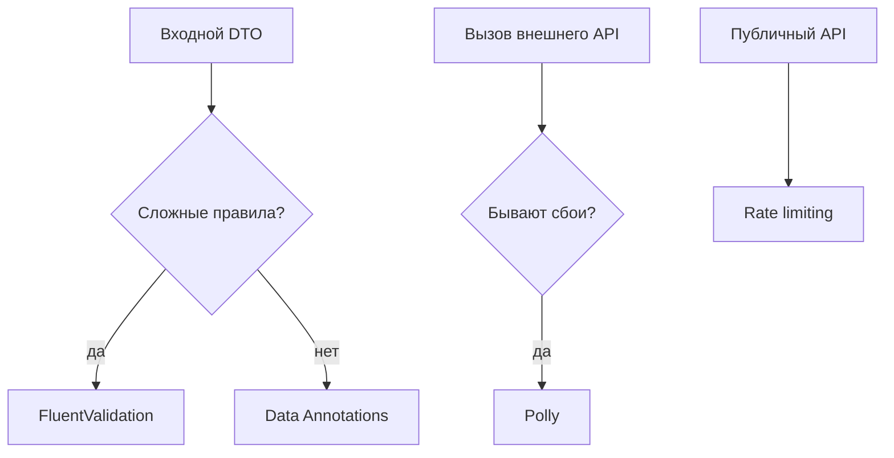

# FluentValidation, Polly и rate limiting в ASP.NET Core

<div class="article-tags">
  <span class="tag tag-required">ОБЯЗАТЕЛЬНО</span>
</div>

<span class="complexity-badge">Разработчику</span>
<span class="complexity-badge">Архитектору</span>

После [первого Web API](./4511) типичный следующий шаг в продакшене — три слоя поверх CRUD:

- **проверить вход** (валидация тела запроса и команд);
- **пережить сбой** внешнего HTTP-сервиса (повтор, таймаут, разрыв цепи);
- **ограничить частоту** запросов от одного клиента.

Базовый обзор ASP.NET — [451](./451). Pipeline MediatR — [4518](./4518). HTTP — [118](/encyclopedia/2-system-network/2-09-osnovy-integratsionnogo-vzaimodeystviya/118).

---

## Словарь

| Термин | Значение |
|--------|----------|
| **DTO** (Data Transfer Object) | Объект для передачи данных по API (`CreateOrderRequest`). |
| **Валидация** | Проверка, что поля заполнены и в допустимых пределах до бизнес-логики. |
| **Retry** | Повтор запроса при временной ошибке сети или 503. |
| **Circuit breaker** | Временная остановка вызовов к упавшему сервису, чтобы не усугублять перегрузку. |
| **Rate limiting** | Лимит числа запросов за интервал времени; при превышении — HTTP 429. |
| **Идемпотентность** | Повтор того же запроса даёт тот же результат (важно для retry на POST). |

---

## FluentValidation

**FluentValidation** — NuGet-библиотека правил для DTO и команд. Правила пишутся цепочками `.RuleFor()`, живут в отдельных классах, удобно тестируются без запуска HTTP.

Альтернатива — **Data Annotations** (`[Required]`, `[Range]`) прямо на свойствах модели. Они встроены в ASP.NET, но сложные правила (вложенные списки, кросс-поля) читаются хуже.

### Установка

```bash
dotnet add package FluentValidation
dotnet add package FluentValidation.DependencyInjectionExtensions
```

### Пример валидатора

```csharp
public sealed class CreateOrderCommandValidator : AbstractValidator<CreateOrderCommand>
{
    public CreateOrderCommandValidator()
    {
        RuleFor(x => x.CustomerId).NotEmpty();
        RuleFor(x => x.Lines).NotEmpty();
        RuleForEach(x => x.Lines).ChildRules(line =>
        {
            line.RuleFor(l => l.Quantity).GreaterThan(0);
            line.RuleFor(l => l.ProductId).NotEmpty();
        });
    }
}
```

### Регистрация в DI

```csharp
builder.Services.AddValidatorsFromAssemblyContaining<CreateOrderCommandValidator>();
```

**DI** (Dependency Injection) — контейнер в ASP.NET подставляет зависимости в конструкторы и обработчики. Подробнее — [внедрение зависимостей](./35).

### Вместе с MediatR

В [4518](./4518) валидация выполняется в `IPipelineBehavior<,>` **до** handler:

- вызывается `IValidator<TRequest>.ValidateAsync`;
- при ошибках — `ValidationException`;
- API возвращает **400 Bad Request** с списком полей.

### Без MediatR (Minimal API)

```csharp
app.MapPost("/orders", async (CreateOrderCommand cmd, IValidator<CreateOrderCommand> validator) =>
{
    var result = await validator.ValidateAsync(cmd);
    if (!result.IsValid)
        return Results.ValidationProblem(result.ToDictionary());

    // бизнес-логика
    return Results.Created();
});
```

### Data Annotations и FluentValidation

| | Data Annotations | FluentValidation |
|--|----------------|------------------|
| Где живут правила | На свойствах DTO | Отдельный класс |
| Сложные правила | Неудобно | Удобно |
| Зависимости | Ограничены | Можно инжектить сервисы |
| Встроенность | Из коробки | NuGet-пакет |

---

## Polly и устойчивость HTTP

**Polly** — библиотека политик устойчивости. В .NET 8+ для `HttpClient` часто используют пакет `Microsoft.Extensions.Http.Resilience` с методом `AddStandardResilienceHandler`.

Типичный сценарий — ваш API вызывает погодный сервис, платёжный шлюз или внутренний микросервис. Сеть и удалённый сервер иногда отвечают с задержкой или ошибкой 503.

### Регистрация (.NET 8+)

```csharp
builder.Services.AddHttpClient<IWeatherClient, WeatherClient>()
    .AddStandardResilienceHandler(options =>
    {
        options.Retry.MaxRetryAttempts = 3;
        options.TotalRequestTimeout.Timeout = TimeSpan.FromSeconds(30);
        options.CircuitBreaker.SamplingDuration = TimeSpan.FromSeconds(30);
    });
```

### Политики

- **Retry** — повтор при кратковременных сбоях (таймаут, 503).
- **Circuit breaker** — после серии ошибок вызовы временно блокируются, сервис "отдыхает".
- **Timeout** — верхняя граница ожидания ответа.

**Retry на POST** применяйте только если операция идемпотентна или есть **idempotency key** (уникальный ключ заказа). Иначе повтор может создать дубликат.

См. [популярные библиотеки](./46), [сетевое взаимодействие](./42), [интеграции](/encyclopedia/2-system-network/2-09-osnovy-integratsionnogo-vzaimodeystviya/intro).

---

## Rate limiting

**Rate limiting** встроен в ASP.NET Core 7+ (`Microsoft.AspNetCore.RateLimiting`). Ограничивает, сколько запросов клиент (IP, ключ API) может отправить за окно времени.

### Пример

```csharp
builder.Services.AddRateLimiter(options =>
{
    options.AddFixedWindowLimiter("api", opt =>
    {
        opt.PermitLimit = 100;
        opt.Window = TimeSpan.FromMinutes(1);
        opt.QueueLimit = 0;
    });
    options.RejectionStatusCode = StatusCodes.Status429TooManyRequests;
});

app.UseRateLimiter();

app.MapGet("/api/items", () => Results.Ok())
   .RequireRateLimiting("api");
```

### Стратегии

- **Fixed window** — простой лимит "100 запросов в минуту".
- **Sliding window** — более ровное распределение на границе минуты.
- **Token bucket** — разрешены короткие всплески (burst) при ограниченной средней скорости.

В **кластере** из нескольких инстансов счётчик лучше хранить в **Redis**, иначе каждый сервер считает лимит отдельно.

Обзор на уровне платформы — [ASP.NET](../5-04-platforma-dotnet/172).

---

## Схема — что подключать



---

## Частые ошибки

- Валидация только в браузере — сервер обязан проверять данные снова ([безопасность](./43)).
- Retry на POST без идемпотентности — дубликаты заказов и платежей.
- Rate limit без понятного ответа 429 — клиент не знает, когда повторить.
- Polly без логов — сложно понять, сколько retry добавило задержки.

---

## Краткая шпаргалка

| Задача | Инструмент |
|--------|------------|
| Правила на DTO | `FluentValidation` |
| Валидация в MediatR | `IPipelineBehavior` + `IValidator<>` |
| Устойчивость HttpClient | `AddStandardResilienceHandler` |
| Лимит запросов | `AddRateLimiter`, `UseRateLimiter` |

---

## См. также

- [Безопасность приложений на C#](./43)
- [Identity — JWT и cookie](./4515)
- [Выбор архитектуры под сценарий](./476)
- [Обработка исключений](./15)
