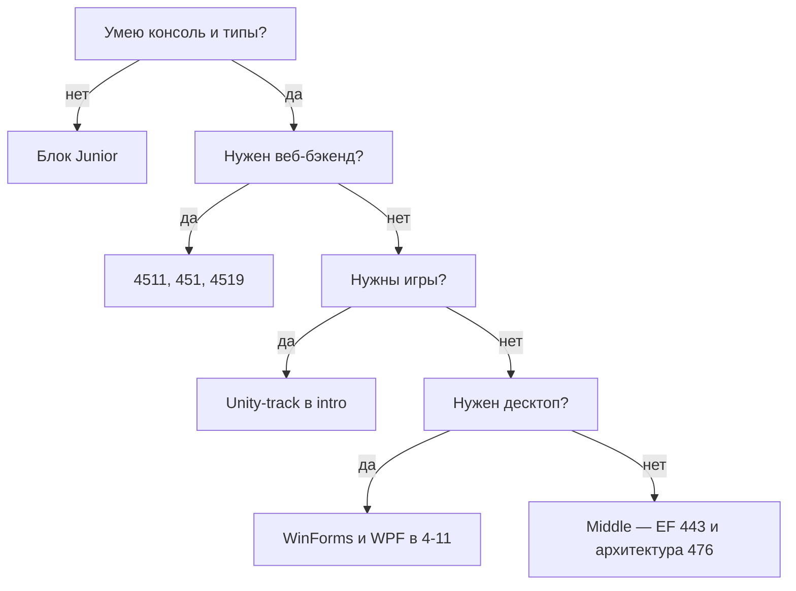

# Маршрут .NET-разработчика от Junior к Senior

  НЕ ОБЯЗАТЕЛЬНО
  ДЛЯ НОВИЧКОВ

Разработчику
Архитектору

Ниже — порядок прохождения материалов энциклопедии от первого `dotnet run` до проектирования сервисов. Сроки ориентировочные при **10–15 часах в неделю**.

**Уровни в IT (кратко)**

- **Junior** — пишет фичи по задаче, знает синтаксис, базовый веб или консоль, нуждается в ревью архитектуры.
- **Middle** — ведёт фичу end-to-end, настраивает API, БД, тесты, деплой в типичном стеке.
- **Senior** — проектирует модули и системы, диагностирует производительность, выбирает компромиссы.

Стартовые точки раздела — [C# — о разделе](./intro), [Платформа .NET — о разделе](../5-04-platforma-dotnet/intro). Дополнительные deep-dive на русском — [NET-Mastery-Hub](https://github.com/valinerosgordov/NET-Mastery-Hub).

---

## Как пользоваться маршрутом

- Закройте **одну ветку "первая программа"** (консоль, затем веб или EF). Переключение между стеками до рабочего примера только запутывает.
- После каждого блока сделайте **мини-проект** (CRUD API, консоль с БД, набор тестов).
- Перед собеседованием пройдите [вопросы на собеседование](./474), [чек-лист C#](./999), [чек-лист .NET](../5-04-platforma-dotnet/999).

---

## Уровень 0. Общая база (1–2 недели)

| Шаг | Материал | Что получите |
|-----|----------|--------------|
| 1 | [Что такое код](/encyclopedia/4-code-dev/4-02-chto-takoe-kod-i-kak-on-rabotaet/1) | Понимание компиляции, байт-кода, выполнения |
| 2 | [Платформа .NET](../5-04-platforma-dotnet/1) | CLR, сборки, публикация |
| 3 | [Visual Studio](./103), [первая программа](./16) | IDE и первый запуск |
| 4 | [Версии C# и .NET](./48) | LTS, STS, соответствие инструментов |

**Термины уровня 0**

- **CLR** (Common Language Runtime) — среда выполнения .NET, которая запускает скомпилированный код.
- **Сборка** — скомпилированный модуль (`.dll` или `.exe`). Подробнее — [сборка и развёртывание](../5-04-platforma-dotnet/14).
- **LTS** (Long Term Support) — версия .NET с длительной поддержкой; для продакшена обычно выбирают её.

---

## Junior. Язык и платформа (2–4 месяца)

На этом этапе вы пишете консольные и простые веб-приложения, разбираетесь в типах, коллекциях, исключениях и базовом HTTP.

### Синтаксис и основы

- [Синтаксис и пунктуация](./11)
- [Переменные](./17), [типы и приведения](./20)
- [Пространства имён](./12), [управляющие конструкции](./13), [ветвления](./14)

**Практика** — калькулятор, разбор строки по словам.

### Типы и память

- [Типы данных](./18), [стек и куча](./19), [nullable](./22)

**Практика** — явная работа с `int?`, разбор boxing в [типах данных](./18#znachimye-tipy-i-boxing).

### ООП и делегаты

- [ООП в C#](./25), [generics](./26), [делегаты и события](./33)

Теория ООП — [раздел "ООП"](/encyclopedia/4-code-dev/4-08-oop/intro).

**Практика** — простая модель предметной области (заказ, пользователь, товар).

### Коллекции и LINQ

- [Коллекции](./28), [LINQ](./29), [справочник LINQ](./291)

**LINQ** (Language Integrated Query) — запросы к коллекциям и БД прямо в C#.

**Практика** — отчёт из списка объектов (фильтр, группировка, сортировка).

### Исключения

- [Обработка исключений](./15), [иерархия исключений](./151)

Теория — [исключения в архитектуре выполнения](/encyclopedia/4-code-dev/4-06-arhitektura-vypolneniya/111).

### Данные

- [EF Core — первая программа](./441) или [ADO.NET / Dapper](./442)
- [Обзор БД и ORM](./44)

**Практика** — CRUD с SQLite, одна миграция.

### Веб

- [Первая программа на ASP.NET Core](./4511)
- [HTTP как основа интеграций](/encyclopedia/2-system-network/2-09-osnovy-integratsionnogo-vzaimodeystviya/118)

**REST API** — стиль, где ресурсы доступны по URL, а действия задаются HTTP-методами (`GET`, `POST` и т.д.).

**Практика** — API "заметки" с хранением в памяти или БД.

### Тесты и отладка

- [Тесты ASP.NET Core](./4516)
- [Разработка и отладка](/encyclopedia/4-code-dev/4-14-razrabotka-i-otladka/intro)

**Практика** — 3–5 юнит-тестов на сервис или валидатор.

### Критерий перехода на Middle

- Самостоятельно поднять Web API, EF, миграции и 5–10 юнит-тестов.
- Объяснить разницу между `class` и `struct`.
- Объяснить `async`/`await` на примере HTTP-запроса.
- Назвать жизненный цикл **DI** (Dependency Injection) и почему `DbContext` регистрируют как `Scoped` — [внедрение зависимостей](./35).

---

## Middle. Навыки продакшена (4–8 месяцев)

Вы уверенно ведёте фичу в ASP.NET Core, работаете с БД, конфигурацией, безопасностью и распространёнными библиотеками.

### ASP.NET Core

- [ASP.NET — фреймворк](./451)
- [Minimal API и OpenAPI](./4517)
- [Identity — JWT и cookie](./4515)
- [FluentValidation, Polly и rate limiting](./4519)

### Entity Framework

- [EF Core — продвинутое](./443) (N+1, bulk, миграции без простоя)

### Асинхронность

- [Асинхронность и многопоточность](./39), [Task и async/await](./392), [класс Thread](./391)

Теория потоков — [процессы и потоки](/encyclopedia/4-code-dev/4-05-asinhronnost/1).

### Конфигурация и DI

- [Внедрение зависимостей](./35), [справочник по конфигурациям](./101)

### Архитектура приложения

- [MediatR и pipeline](./4518)
- [Clean Architecture на ASP.NET Core](/encyclopedia/7-project/7-06-proektirovanie-i-arhitektura/design/2143)

**CQRS** (Command Query Responsibility Segregation) — разделение команд (изменение) и запросов (чтение). В учебных проектах часто применяют упрощённый вариант через MediatR.

### Деплой и SQL

- [Сборка и развёртывание .NET](../5-04-platforma-dotnet/14)
- [Контейнеризация](/encyclopedia/8-infra-security/8-06-konteynerizatsiya-i-orkestratsiya/intro)
- [SQL — раздел](/encyclopedia/3-data-markup/3-07-sql/intro)

### Выбор стека под задачу

- [Выбор архитектуры под сценарий](./476)

### Критерий перехода на Senior

- Спроектировать модуль с явными границами слоёв.
- Найти и устранить проблему N+1 в EF.
- Настроить JWT и health checks.
- Описать цепочку **middleware** в ASP.NET — [фреймворк ASP.NET](./451).

---

## Senior. Runtime, архитектура, масштаб

Постоянное углубление: проектирование систем, диагностика производительности, архитектурные решения.

| Тема | Материалы |
|------|-----------|
| CLR и память | [Архитектура .NET](../5-04-platforma-dotnet/12), [производительность](./41), [справочник C#](./471) (`Span`, pooling) |
| Native AOT | [Native AOT](../5-04-platforma-dotnet/191) |
| Распределённые системы | [Интеграция](/encyclopedia/2-system-network/2-09-osnovy-integratsionnogo-vzaimodeystviya/intro), [микросервисы](/encyclopedia/7-project/7-06-proektirovanie-i-arhitektura/design/118) |
| DDD и паттерны | [Доменная модель](/encyclopedia/7-project/7-06-proektirovanie-i-arhitektura/114), [паттерны проектирования](/encyclopedia/7-project/7-06-proektirovanie-i-arhitektura/design-patterns/intro) |
| Наблюдаемость | [Платформа .NET — OpenTelemetry](../5-04-platforma-dotnet/1) |
| AI в .NET | [Semantic Kernel](../5-04-platforma-dotnet/192) |
| Real-time | [SignalR](../5-04-platforma-dotnet/2) |
| Собеседование | [474](./474), [System Design](/encyclopedia/7-project/7-06-proektirovanie-i-arhitektura/143) |

---

## Спринт к собеседованию (7–14 дней)

Согласовано с [планом в 474](./474#план-подготовки-на-7-дней).

| День | Фокус |
|------|-------|
| 1 | Типы, память, GC, исключения |
| 2 | Коллекции, LINQ, generics |
| 3 | async/await, ThreadPool |
| 4 | ASP.NET, middleware, DI |
| 5 | EF, SQL, транзакции |
| 6 | Тесты, Docker, безопасность |
| 7 | Проговаривание ответов, [поведенческие вопросы](./474#поведенческие-вопросы-soft-skills) |

---

## Куда идти дальше

---

## Частые ошибки

- **Чтение без кода** — на каждый блок одна рабочая программа.
- **Микросервисы на старте** — сначала монолит с [Clean Architecture](/encyclopedia/7-project/7-06-proektirovanie-i-arhitektura/design/2143); дробление — когда появятся измеримые причины ([микросервисы](/encyclopedia/7-project/7-06-proektirovanie-i-arhitektura/design/118)).
- **Справочник вместо маршрута** — [471](./471) и [472](./472) для поиска синтаксиса, эта статья — для порядка тем.
- **Только теория** — [Lab](/lab/Вопросы/122), pet-проект в портфолио.

---

## Краткая шпаргалка

| Уровень | Минимум на выходе |
|---------|-------------------|
| Junior | Консоль + API + EF + тесты |
| Middle | Auth, валидация, SQL, деплой |
| Senior | Архитектура, perf, распределённые системы |

---

## См. также

- [Выбор архитектуры под сценарий](./476)
- [Сравнение C# и Java](./50)
- [NET-Mastery-Hub](https://github.com/valinerosgordov/NET-Mastery-Hub) — async internals, performance, interview prep
