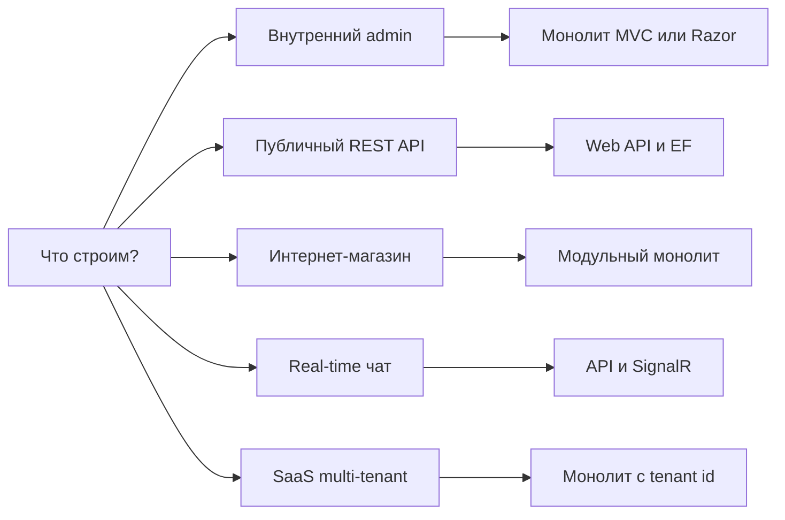

# Выбор архитектуры и стека .NET под сценарий

  НЕ ОБЯЗАТЕЛЬНО

Разработчику
Архитектору

Перед выбором микросервисов, Clean Architecture или Blazor полезно зафиксировать три вещи:

- **что** строим (admin, магазин, API для мобилки);
- **сколько** людей в команде и как часто релизы;
- **какие NFR** (non-functional requirements) — нагрузка, задержка, аудит, доступность.

Общая теория проектирования — [раздел 7-06](/encyclopedia/7-project/7-06-proektirovanie-i-arhitektura/intro). Принципы SOLID — [1112](/encyclopedia/7-project/7-06-proektirovanie-i-arhitektura/design/1112). Маршрут обучения — [475](./475).

**Монолит** — одно развёртываемое приложение (один процесс или один контейнер). **Микросервисы** — несколько независимых сервисов с отдельными деплоями. Стартовая рекомендация для большинства учебных и малых коммерческих проектов — **монолит с чёткими слоями**, пока нет измеримой боли (разные команды, частые независимые релизы, узкое место по масштабу). Подробнее — [микросервисы](/encyclopedia/7-project/7-06-proektirovanie-i-arhitektura/design/118).

---

## Схема выбора

---

## 1. Внутренний admin и back-office

Панель для сотрудников: справочники, отчёты, ручное редактирование данных.

**UI**

- [Razor Pages](./4514) — страницы с HTML на сервере, проще для CRUD.
- [Blazor Server](./4512) — интерактивный UI без отдельного JavaScript-фреймворка.

**Аутентификация**

- Cookie и роли через [Identity](./4515).
- Пользователи внутри компании, браузер хранит сессию.

**База данных**

- [EF Core — первая программа](./441).
- SQL Server или PostgreSQL — [практика SQL](/encyclopedia/3-data-markup/3-07-sql/intro).

**Структура кода**

- Классический N-слой (UI → сервисы → данные) или упрощённый [Clean Architecture](/encyclopedia/7-project/7-06-proektirovanie-i-arhitektura/design/2143).
- [MediatR](./4518) — по желанию, когда сценариев становится много.

**На первом этапе обычно не нужны**

- Kubernetes
- GraphQL
- Event sourcing

---

## 2. Публичный REST API и backend для мобильного приложения

Сервер отдаёт JSON по HTTP; клиенты — мобильные приложения, SPA, партнёры.

**Фреймворк**

- [ASP.NET Core Web API](./4511)
- [Minimal API](./4517) для небольших сервисов

**Контракт**

- OpenAPI (Swagger) для документации.
- Версионирование через URL (`/v1/...`) или заголовок.

**Надёжность и безопасность**

- [FluentValidation, Polly и rate limiting](./4519)
- JWT — [Identity](./4515)
- [Безопасность приложений](./43)

**Данные**

- EF Core; при росте нагрузки — [продвинутые темы EF](./443)

**Итог по стеку**

- API без состояния на сервере между запросами — проще масштабировать горизонтально.
- JSON и OpenAPI задают понятный контракт для мобильных и внешних клиентов.

HTTP-основа — [118](/encyclopedia/2-system-network/2-09-osnovy-integratsionnogo-vzaimodeystviya/118).

---

## 3. Интернет-магазин (малый и средний)

**Стартовая структура**

- Модульный монолит с зонами Catalog, Cart, Orders, Payments.
- Один репозиторий, один деплой, границы — папки или проекты в solution.

**Транзакции и оплата**

- EF + явные границы транзакций.
- Webhook оплаты с **идемпотентностью** (повторный запрос не создаёт второй заказ) — [интеграции](/encyclopedia/2-system-network/2-09-osnovy-integratsionnogo-vzaimodeystviya/intro).

**Фоновые задачи**

- `IHostedService` для простых сценариев.
- Брокер сообщений (RabbitMQ, Azure Service Bus) при пиках нагрузки.

**Кэш**

- `IDistributedCache` с Redis для каталога.

**Масштабирование позже**

- Read replicas
- Проекции для чтения
- Выделение сервисов — только при отдельных командах и метриках

См. [пакетная работа с данными](/encyclopedia/3-data-markup/3-11-analiz-dannyh/433).

---

## 4. Real-time (чат, дашборд, уведомления)

**Протокол**

- [SignalR](../5-04-platforma-dotnet/2) поверх WebSocket или long polling.

**Масштаб кластера**

- Redis backplane или Azure SignalR Service — чтобы несколько инстансов API видели одни hub-подключения.

**Разделение обязанностей**

- REST — история сообщений, профили.
- Hub — live-события.

**Auth**

- JWT в query string или заголовке при установке WebSocket.

---

## 5. SaaS B2B multi-tenant

Несколько организаций-клиентов в одном продукте.

**Изоляция данных**

- Колонка `TenantId` в строках — типичный старт.
- Отдельная схема или БД на tenant — реже, при жёстких требованиях.

**Auth**

- OIDC (OpenID Connect) — [Identity](./4515), [auth в ASP.NET](./451).

**Конфигурация**

- [Options pattern](./101) на tenant.

**Аудит**

- Структурированные логи, correlation id — [платформа .NET](../5-04-platforma-dotnet/1).

**Рост**

- Billing и Notifications выносят в отдельные сервисы, когда над ними работает отдельная команда.

---

## 6. CLI, serverless и edge

**Холодный старт и размер**

- [Native AOT](../5-04-platforma-dotnet/191)
- Trim, минимум рефлексии

**Данные**

- [Dapper](./442) часто легче EF для узких утилит.

---

## 7. Desktop (WinForms, WPF, MAUI)

- WinForms и WPF — [десктопные приложения](/encyclopedia/4-code-dev/4-11-desktopnye-prilozheniya/intro), [Lab 1138](/lab/Примеры/1138)
- Кроссплатформа — [MAUI](./4513)
- **MVVM** — отдельная ViewModel, без EF прямо в коде окна

---

## 8. Игры (Unity)

Маршрут — [C# для Unity](./intro#c-для-unity). ASP.NET на первом проходе можно отложить.

---

## Паттерны и когда их подключать

| Паттерн | Подходит, если | Рано подключать, если |
|---------|----------------|------------------------|
| [Clean Architecture](/encyclopedia/7-project/7-06-proektirovanie-i-arhitektura/design/2143) | 3+ разработчика, долгий жизненный цикл | Pet-проект на 2 недели |
| CQRS + [MediatR](./4518) | Много use-case, общие pipeline (валидация, лог) | 5 CRUD-эндпоинтов |
| Repository поверх EF | Сложные запросы, подмена в тестах | Generic `IRepository<T>` без логики |
| Event Sourcing | Нужен аудит и replay событий | Обычный CRUD |
| Микросервисы | Независимые релизы, разные команды | Нет DevOps и метрик |

[Паттерны проектирования](/encyclopedia/7-project/7-06-proektirovanie-i-arhitektura/design-patterns/intro), [декомпозиция монолита](/encyclopedia/7-project/7-06-proektirovanie-i-arhitektura/104).

---

## Частые ошибки

- Микросервисы "на вырост" без CI/CD и мониторинга — растёт сложность, выгода откладывается.
- Blazor WebAssembly для простого admin — лишний фронтенд-стек; [Razor Pages](./4514) проще.
- EF без базового SQL — N+1 и тяжёлые миграции; см. [443](./443), [SQL](/encyclopedia/3-data-markup/3-07-sql/intro).
- GraphQL без причины (overfetch редок) — усложняется кэш; REST часто достаточен — [бэкенд](/encyclopedia/1-basics/1-23-frontend-i-bekend/2).

---

## Краткая шпаргалка

| Сценарий | `dotnet new` | Статьи |
|----------|--------------|--------|
| API | `webapi` | [4511](./4511), [4519](./4519), [443](./443) |
| Admin | `razor` или `blazorserver` | [4514](./4514), [4512](./4512) |
| Консоль + БД | `console` + EF | [441](./441) |
| Real-time | `webapi` + SignalR | [2](../5-04-platforma-dotnet/2) |
| AOT CLI | `console` + PublishAot | [191](../5-04-platforma-dotnet/191) |

---

## См. также

- [Маршрут Junior → Senior](./475)
- [Типы приложений на .NET](../5-04-platforma-dotnet/13)
- [NET-Mastery-Hub — real-world-scenarios](https://github.com/valinerosgordov/NET-Mastery-Hub/blob/main/Architecture/Middle/real-world-scenarios.md)
